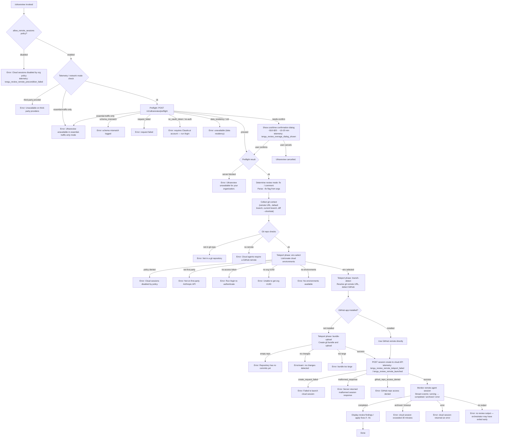

# `/ultrareview`

> Analysis basis: CC v2.1.179 bundle.js (AST extraction + Claude interpretation)
> Minimum version: v2.1.179

---

## Overview

`/ultrareview` launches a cloud-hosted AI agent that autonomously finds and verifies bugs in the current git branch. It runs inside Claude Code on the web (not locally) and requires a Claude.ai account, a GitHub remote, and organization-level policy permission for remote sessions. The estimated cost is approximately $10–$20 USD per run, with a typical duration of ~10–20 minutes.

---

## Registration

| Field | Value |
|---|---|
| type | `local-jsx` |
| name | `ultrareview` |
| description | `"Start a cloud agent that finds and verifies bugs in your branch ( ... , ... USD) · Runs in Claude Code on the web. See ..."` |
| loc_byte | `12651075` |
| loc_byte_end | `12651346` |
| loc_line | `8586` |
| module_id | `lYK` |
| load_inline | `true` |
| arbor_handler.name | `b85` |
| arbor_handler.fqn | `claude-2.1.179::b85` |
| arbor_handler.kind | `AsyncFunction` |
| arbor_handler.resolution_path | `module_id` |
| arbor_handler.n_hits | `1` |

Analysis basis: CC v2.1.179 bundle.js:+12651075

---

## Input Branching

The command has many distinct branches across policy checks, preflight calls, confirmation dialogs, teleport phases, and session monitoring. A flowchart is used.



---

## Behavioral Spec

### Handler Entry Point (`b85`)

The top-level async handler for `/ultrareview` is `b85` (resolved via `module_id` → `lYK`).

```
async function ultrareviewHandler(args, context):
    # Step 1: Policy gate
    if not appState.allow_remote_sessions:
        emit telemetry("tengu_review_remote_precondition_failed")
        show error "Cloud sessions are disabled by your organization's policy."
        return

    # Step 2: Random jitter delay (Math.random * 2 via helper H)
    await jitterDelay()

    # Step 3: Parse arguments
    reviewMode = parseArgs(args)   # "fix" or "comment"
    # Literal "fix" at bundle.js:+12610793, "comment" at +12610799

    # Step 4: Collect git repo metadata (yYK → xd8)
    gitMetadata = await collectGitContext()

    # Step 5: Preflight check (IJA → NYK → POST /v1/ultrareview/preflight)
    preflightResult = await runPreflight(gitMetadata)
    if preflightResult == error: return with appropriate message

    # Step 6: Handle "needs-confirm" (cost/time confirmation)
    if preflightResult.status == "needs-confirm":
        confirmed = await showCostConfirmationDialog()
        emit telemetry("tengu_review_overage_dialog_shown")
        if not confirmed:
            show "Ultrareview cancelled."
            return

    # Step 7: Check for overage blocking
    if overage_blocked:
        emit telemetry("tengu_review_overage_blocked")
        return

    # Step 8: Teleport to remote cloud session (SJA → RJA)
    sessionResult = await teleportAndLaunch(gitMetadata, reviewMode, preflightResult)
    if sessionResult == error:
        show "Ultrareview failed to launch the cloud session."
        return

    # Step 9: Monitor session (C85 → RJA → uTq)
    await monitorRemoteSession(sessionResult.sessionId)
```

Analysis basis: CC v2.1.179 bundle.js:+12648730

---

### Argument Parsing (`yYK` → `xd8`)

```
function parseReviewArgs(rawArgs):
    trimmed = rawArgs.trim()
    tokens = trimmed.split(whitespace)
    normalized = tokens.map(t => normalizeToken(t))
    # Modes: "fix" (bundle.js:+12610793) or "comment" (bundle.js:+12610799)
    mode = normalized.includes("fix") ? "fix" : "comment"
    # Also checks reference: "/code-review ultra" (bundle.js:+12610878)
    return { mode }
```

Analysis basis: CC v2.1.179 bundle.js:+12648931

When `--fix` is passed, a supplementary instruction is appended to the remote agent task (literal fragment `" The user passed --fix: when the findings arrive, apply them to the local working tree."`, bundle.js:+12648469).

---

### Preconditions Check (`_9`)

```
function checkRemoteEligibility(context):
    # Check ryf set membership (first-party provider check)
    if not ryf.has(currentProvider):
        return { ok: false, reason: "not_first_party" }

    # Run pb (policy check group)
    policyResult = checkOrgPolicies()
    # Checks: firstParty literal (bundle.js:+2588961)
    #         enterprise / team plan literals (bundle.js:+2589234, +2589269)
    #         allow_product_feedback (bundle.js:+2589535)

    # Check oyf set for data-residency / ZDR
    if oyf.has(currentConfig):
        return { ok: false, reason: "data_residency" }

    # Check fq (telemetry / traffic mode)
    trafficMode = getTrafficMode()
    # Modes: "essential-traffic" (bundle.js:+1049698),
    #        "no-telemetry" (bundle.js:+1049757),
    #        "default" (bundle.js:+1049831)
    if trafficMode == "essential-traffic":
        return { ok: false, reason: "essential-traffic-only" }

    return { ok: true }
```

Analysis basis: CC v2.1.179 bundle.js:+2589463

---

### Git Context Collection (`IJA`)

```
async function collectGitContext():
    # Verify git repo (WA6 → git rev-parse --is-inside-work-tree)
    isRepo = await git("rev-parse", "--is-inside-work-tree")
    if not isRepo: return error("not_in_git_repo")

    # Get remote URL (Zb → git config --get remote.origin.url)
    remoteUrl = await git("config", "--get", "remote.origin.url")
    # Redacts credentials: replaces "://***@" pattern (bundle.js:+1149875)
    if not remoteUrl: return error("no_git_remote", "No git remote URL found")

    # Detect GitHub.com host (bundle.js:+12611628)
    isGitHub = remoteUrl.includes("github.com")

    # Check for Anthropic/internal repo (bundle.js:+12611666, +12611703)
    isAnthropic = remoteUrl.includes("anthropics") or remoteUrl.includes("anthropic")

    # Get current branch (RY → git branch --abbrev-ref HEAD)
    currentBranch = await git("branch", "--abbrev-ref", "HEAD")

    # Get default branch (pk → git symbolic-ref --short refs/remotes/origin/HEAD)
    # Falls back to "main" or "master" (bundle.js:+1158166, +1158173)
    defaultBranch = await getDefaultBranch()

    # Compute merge-base (IJA → git merge-base)
    mergeBase = await git("merge-base", currentBranch, defaultBranch)

    # Get diff stats (g8 → gh pr view --json additions,deletions,changedFiles)
    # Timeout: 5000 ms (bundle.js:+12612117)
    diffStats = await getPRDiffStats()
    # Falls back to git diff --shortstat (bundle.js:+12613683)

    # Get git object count for repo size estimation (ITq → git count-objects -v)
    # Threshold: 5,000,000 objects (bundle.js:+8547156)
    objectCount = await git("count-objects", "-v")

    return { remoteUrl, isGitHub, currentBranch, defaultBranch, mergeBase, diffStats, objectCount }
```

Analysis basis: CC v2.1.179 bundle.js:+12648946

---

### Preflight API Call (`SJA` → `NYK`)

```
async function runPreflight(gitMetadata):
    # POST /v1/ultrareview/preflight (bundle.js:+12609262)
    # Header includes teleport-org (bundle.js:+12609296)
    response = await apiClient.post("/v1/ultrareview/preflight", {
        branch: gitMetadata.currentBranch,
        remoteUrl: gitMetadata.remoteUrl,
        ...
    })

    # Error cases (in order):
    if networkMode == "essential-traffic-only":  # bundle.js:+12609356
        return error("Ultrareview runs in Claude Code on the web and is unavailable when essential-traffic-only mode is active.")

    if thirdPartyProvider:  # bundle.js:+12609539
        return error("Ultrareview runs in Claude Code on the web and is unavailable on third-party providers.")

    if status == "no-auth":  # bundle.js:+12609651
        return error("no_oauth_token", "Ultrareview requires a Claude.ai account. Run /login to authenticate.")

    if status == "data-residency":  # bundle.js:+12609511
        return error("data_residency")

    # Emit: api_ultrareview_preflight (bundle.js:+12609883)
    emit telemetry("api_ultrareview_preflight", { status })

    if response.schema_mismatch:  # bundle.js:+12609911
        return error("schema_mismatch")

    if request_failed:  # bundle.js:+12610072
        return error("request_failed")

    # Status values: "proceed" (bundle.js:+12614436),
    #                "needs-confirm" (bundle.js:+12614816),
    #                "server" blocked (bundle.js:+12614617)
    return response
```

Analysis basis: CC v2.1.179 bundle.js:+12649026

---

### Teleport — Cloud Session Launch (`RJA` → `gU`)

```
async function teleportAndLaunch(gitMetadata, reviewMode, preflightData):
    # Phase: env-select (bundle.js:+8568415)
    # List available cloud environments (JHH / PA6 → GET environments API)
    environments = await listCloudEnvironments()

    # Eligibility checks (gU → checks at +8565308, +8565424, +8565567)
    if policy_denied: return error("Cloud sessions are disabled.")
    if not_first_party: return error("Cloud sessions are only available on the first-party Anthropic API.")
    if no_access_token: return error("Cloud sessions require a claude.ai login. Run /login to authenticate.")
    if no_org_uuid: return error("Unable to get organization UUID for cloud session creation")

    # Auto-create default environment if none exists (bundle.js:+8568523)
    # Environment spec includes python 3.11, node 20 (bundle.js:+7159094, +7159123)
    if environments is empty:
        env = await createDefaultEnvironment()
        if failed: return error("Could not create a cloud environment. Set one up at https://claude.ai/code/onboarding?magic=env-setup")

    # Phase: branch-detect (bundle.js:+8570220)
    # Resolve source: explicit URL, GitHub remote, bundle, or none
    sourceDecision = detectBranchSource(gitMetadata)
    emit telemetry("tengu_teleport_source_decision", { mode: sourceDecision })

    # Phase: bundle-upload (bundle.js:+8571356)
    if sourceDecision == "bundle":
        bundleResult = await uploadGitBundle()
        # Strategies: head, fallback_head, squashed, fallback_squashed
        # (bundle.js:+8551687, +8551726, +8551761, +8551804)
        emit telemetry("tengu_ccr_bundle_upload", { status })
        if failed: return error(bundleResult.error)

    # POST session create (bundle.js:+8567543 → jA.post)
    # Headers: anthropic-beta: ccr-byoc-2025-07-29 (bundle.js:+8566334)
    #          x-organization-uuid (bundle.js:+8566356)
    sessionResponse = await createRemoteSession({
        environment: selectedEnv,
        source: sourceDecision,
        task: buildTaskDescription(reviewMode, preflightData),
        # Task prefix: "claude/task" (bundle.js:+8553098)
        # Title generated via: teleport_generate_title telemetry
    })

    # HTTP error handling:
    # 401/403 → auth error (bundle.js:+8567701, +8567705)
    # 429 → rate limit (bundle.js:+8567709)
    # github_repo_access_denied → bundle.js:+8567754
    # malformed_response (no session id) → bundle.js:+8568267

    if not sessionResponse.sessionId:
        return error("malformed_response", "Server returned a malformed session response (no session id)")

    emit telemetry("tengu_review_remote_launched")
    return { sessionId: sessionResponse.sessionId }
```

Analysis basis: CC v2.1.179 bundle.js:+12615034 (RJA), +8565247 (gU)

---

### Remote Agent Session Monitor (`uTq`)

```
async function monitorRemoteSession(sessionId):
    # Session type: "remote_agent" (bundle.js:+8584728)
    # Maximum duration: 1,800,000 ms = 30 minutes (bundle.js:+8586413)
    deadline = Date.now() + 1800000

    loop:
        event = await pollSessionEvent(sessionId)

        switch event.type:
            case "starting":     # bundle.js:+8588440
                displayStatus("Starting cloud agent...")

            case "running":      # bundle.js:+8584836
                displayStatus("Cloud agent running...")

            case "hook_progress":  # bundle.js:+8587603
                streamProgressUpdate(event)

            case "hook_response":  # bundle.js:+8587632
                processIntermediateResponse(event)

            case "hook_started":   # bundle.js:+8588123
                notifyHookStarted(event)

            case "result":         # bundle.js:+8587420
                return processResult(event)

            case "completed":      # bundle.js:+8586932
                if no review output:
                    return error("no review output — orchestrator may have exited early")
                return displayFindings(event)

            case "archived":       # bundle.js:+8586857
                return error("cloud session returned an error")

            case "error":
                return error("cloud session returned an error")

        if Date.now() > deadline:
            return error("cloud session exceeded 30 minutes")
```

Analysis basis: CC v2.1.179 bundle.js:+8585250 (uTq), +8586413 (timeout literal)

---

### Git Bundle Upload (`f_A`)

```
async function uploadGitBundle(context):
    emit telemetry("teleport_git_bundle_upload")

    # Verify not empty repo
    if not git("for-each-ref", "--count=1", "refs/"):
        return error("empty_repo", "Repository has no commits yet")

    # Attempt strategies in order:
    for strategy in ["head", "fallback_head", "squashed", "fallback_squashed"]:
        try:
            bundle = await git.bundle(strategy)
            # Max size check: 5,000,000 bytes (bundle.js:+8547156 via tengu_ccr_bundle_max_bytes)
            if bundle.size > MAX_BYTES:
                continue  # try next strategy

            # Stash working tree changes if needed
            stashRef = await createStash()  # git stash create
            # Seed refs: refs/seed/stash, refs/seed/root (bundle.js:+8549815, +8549833)

            uploadResult = await uploadToAPI(bundle)
            if uploadResult.ok:
                emit telemetry("tengu_ccr_bundle_upload", { status: "success", strategy })
                return { ok: true, strategy }
        catch:
            continue

    return error("upload_failed")
```

Analysis basis: CC v2.1.179 bundle.js:+8549685 (f_A), +8550007 (tengu_ccr_bundle_upload)

---

### GitHub App Pre-check (`IxH`)

```
async function checkGithubAppInstalled(orgUuid, accessToken):
    if not accessToken:
        log("checkGithubAppInstalled: No access token found, assuming app not installed")
        return false

    if not orgUuid:
        log("checkGithubAppInstalled: No org UUID found, assuming app not installed")
        return false

    response = await apiClient.get(githubAppEndpoint)

    # 400 response → treated as "not installed" (bundle.js:+7160716)
    if response.status == 400:
        return false

    if response.isAxiosError:
        return false

    installed = response.data
    log("GitHub app is " + (installed ? "is" : "is not") + " installed")
    return installed
```

Analysis basis: CC v2.1.179 bundle.js:+7159912 (IxH)

---

## State & Side Effects

| Item | Detail |
|---|---|
| Telemetry: `tengu_review_remote_precondition_failed` | Fired when `allow_remote_sessions` policy blocks command (bundle.js:+12610925) |
| Telemetry: `tengu_review_overage_blocked` | Fired when usage limit blocks the run (bundle.js:+12649064) |
| Telemetry: `tengu_review_overage_dialog_shown` | Fired when cost confirmation dialog is presented (bundle.js:+12649401) |
| Telemetry: `tengu_review_remote_teleport_failed` | Fired when cloud session launch fails (bundle.js:+12617300) |
| Telemetry: `tengu_review_remote_launched` | Fired on successful remote session start (bundle.js:+12617821) |
| Telemetry: `tengu_review_bughunter_config` | Fired with session configuration info (bundle.js:+8875013) |
| Telemetry: `tengu_ccr_bundle_upload` | Fired with git bundle upload result (bundle.js:+8550007) |
| Telemetry: `tengu_ccr_bundle_max_bytes` | Reports bundle size limit check (bundle.js:+8546630) |
| Telemetry: `tengu_ccr_bundle_seed_enabled` | Reports seed bundle mode (bundle.js:+7162441) |
| Telemetry: `tengu_teleport_bundle_mode` | Reports bundle strategy selected (bundle.js:+8566678) |
| Telemetry: `tengu_teleport_source_decision` | Reports source type (github/bundle/none) decision (bundle.js:+8572266) |
| Telemetry: `tengu_ccr_session_link` | Records session link (bundle.js:+8559998) |
| Telemetry: `api_ultrareview_preflight` | Preflight API call result (bundle.js:+12609883) |
| Telemetry: `teleport_git_bundle_upload` | Git bundle upload phase start (bundle.js:+8549714) |
| Telemetry: `teleport_environments_list` | Environment listing (bundle.js:+7157574) |
| Telemetry: `teleport_default_environment_create` | Default environment auto-created (bundle.js:+7158494) |
| Telemetry: `teleport_generate_title` | Remote task title generation (bundle.js:+8553396) |
| Telemetry: `bg_remote_eligibility_check` | Background eligibility check (bundle.js:+7162038) |
| Telemetry: `tengu_bg_dispatch_sigkill_escalate` | Daemon kill escalation (bundle.js:+17067302) |
| Telemetry: `tengu_daemon_config_reload` | Daemon config reload (bundle.js:+17083201) |
| Telemetry: `tengu_daemon_control` | Daemon control signal (bundle.js:+17105376) |
| Telemetry: `tengu_bg_low_mem_mb` | Low memory warning in background (bundle.js:+13454570) |
| Telemetry: `tengu_bg_spare_enable` | Spare session enabled (bundle.js:+17068607) |
| Telemetry: `tengu_bg_spare_claim` | Spare session claimed (bundle.js:+17068735) |
| Telemetry: `tengu_bg_spare_claim_fail` | Spare session claim failed (bundle.js:+17069001) |
| Telemetry: `tengu_bg_sendclaim_failed` | Send-claim failed (bundle.js:+17043852) |
| Telemetry: `tengu_bg_state_read_transient` | Transient state read error (bundle.js:+4323451) |
| Telemetry: `tengu_scheduled_task_missed` | Background task missed (bundle.js:+16544540) |
| Telemetry: `tengu_feature_ok` / `tengu_feature_bad` / `tengu_feature_sad` | Generic feature gate events (bundle.js:+1020479, +1020546, +1020627) |
| Network I/O | POST `/v1/ultrareview/preflight`, POST session create, GET environments, GET GitHub app status |
| File I/O | Git bundle written to temp path, uploaded, then removed (`zO.unlink`) |
| Git operations | `rev-parse`, `config --get remote.origin.url`, `branch --abbrev-ref HEAD`, `symbolic-ref`, `merge-base`, `diff --shortstat`, `count-objects -v`, `stash create`, `bundle`, `for-each-ref` |
| appState read | `allow_remote_sessions` (bundle.js:+12648733), OAuth token, org UUID |
| Error exit text | `"Ultrareview cancelled."` (bundle.js:+12649709) |
| Session timeout | 1,800,000 ms / 30 minutes hard cap (bundle.js:+8586413) |
| Cost estimate shown | `$10–$20` (bundle.js:+8875130), `~10–20 min` (bundle.js:+8875223) |
| Admin settings URL | `/admin-settings/` (bundle.js:+12649186) |

---

## Version History

| Version | Change |
|---|---|
| v2.1.179 | Initial analysis |

---

## Common Mistakes

1. **Running without a Claude.ai OAuth login**: The command requires OAuth authentication (`/login`), not just an `ANTHROPIC_API_KEY`. API key authentication is explicitly rejected with a clear error message.
2. **Running in a repository with no GitHub remote**: The cloud agent needs a GitHub remote (`git remote add origin REPO_URL`). Non-GitHub remotes cause the bundle-upload path to be attempted, which may fail if no commits exist or the repo is too large.
3. **Running in an org with `allow_remote_sessions` disabled**: The command gate-checks this policy before any network call. Contact your organization admin to enable it.
4. **Running in essential-traffic-only mode**: When the network profile is set to `essential-traffic`, the command is blocked both at local eligibility check and at the preflight API level.
5. **Running in a repository with no commits**: An empty repository (no commits at all) causes the bundle-upload to fail immediately with a clear error asking you to make an initial commit first.
6. **Expecting local execution**: `/ultrareview` dispatches a cloud agent session — it does not run locally. Results stream back over a polling connection, and the session has a hard 30-minute timeout.
7. **Interpreting `--fix` as immediate local edits**: The `--fix` flag instructs the remote agent to produce applicable patches; they are delivered as findings when the session completes, not applied in real time.

---

## Appendix — Identifier Mapping

> For bundle debugging only. Identifiers change across versions.

| Identifier | Role |
|---|---|
| `b85` | Main `/ultrareview` handler (AsyncFunction, module `lYK`) |
| `_9` | Remote eligibility check (policy, provider, traffic mode) |
| `Mn1` | Provider/plan check orchestrator |
| `zt` | Outer eligibility wrapper |
| `pb` | Policy flag check group |
| `O26` | Enterprise/team plan file reader |
| `H5H` | First-party provider check |
| `fq` | Traffic mode resolver |
| `YrA` | Traffic mode string normalizer |
| `f6` | String utility |
| `lLH` | Locale/string formatter |
| `yYK` | Argument parser entry point |
| `xd8` | Argument token splitter/normalizer |
| `HN` | Token escape/replace helper |
| `IJA` | Git context collection orchestrator |
| `WA6` | Git repo verification (rev-parse) |
| `Zb` | Remote URL resolver and cache |
| `gl` | Remote URL cache lookup |
| `MH8` | Remote URL cache getter |
| `ilH` | Credential redaction in URLs |
| `l_H` | Git URL parser |
| `QsA` | URL includes/split helper |
| `llH` | URL pattern tester |
| `Z9` | URL slice/indexOf helper |
| `g8` | PR diff stats fetcher (gh CLI) |
| `D` | Background session manager / daemon handler |
| `b` | Daemon session state machine |
| `bCH` | Session config reader |
| `w` | Daemon write/supervisor handler |
| `Ht` | Session heartbeat helper |
| `dH6` | Session directory/file writer |
| `pk9` | Session filter helper |
| `P` | Buffer/stream reader |
| `z` | Daemon stop/control |
| `S` | Session state updater |
| `X` | Session map/timeout manager |
| `ctK` | Session change notification builder |
| `g9H` | Session list + config + dir handler |
| `n8` | Async timeout/abort helper |
| `O` | Background session state |
| `CH` | Feature check handler |
| `QH` | Feature result logger |
| `IH` | Feature ok handler |
| `il8` | Low-memory check (macOS) |
| `Y6` | Memory/resource monitor |
| `oRH` | Pins file reader/cleaner |
| `_E6` | Pin path builder |
| `l6` | JSON.parse wrapper |
| `x8` | Error code helper |
| `eL7` | Directory recursive file lister |
| `g` | Permission rule manager |
| `tq6` | Permission rule applier |
| `xd` | Permission classifier |
| `_kA` | Cloud session claim/connect orchestrator |
| `LTA` | Session claim file writer |
| `nb5` | Claim timeout manager |
| `lb5` | Claim frame builder |
| `VL` | G8 error wrapper |
| `GH` | String coercer |
| `hv` | Binary frame encoder (Buffer write) |
| `MkA` | Background agent lifecycle manager |
| `P4` | Path join helper (cj.join) |
| `zq` | File watcher / mtime tracker |
| `i$` | Session active-state helper |
| `D2H` | Diff/change set builder |
| `yL` | Path join + symlink helper |
| `qL6` | Session result poller |
| `vU6` | Path builder (x$.join + EU6) |
| `EzH` | Extended path builder |
| `aE` | TKK error wrapper |
| `uI` | Upload/init helper |
| `Cv` | TKK completion wrapper |
| `VU6` | URL path builder |
| `CAA` | Cost/time estimate calculator |
| `amH` | Y6 memory metric emitter |
| `G` | Agent session manager (locale formatter) |
| `CmH` | Mailbox/message orchestrator |
| `SmH` | Inbox path builder |
| `hO` | Object assign helper |
| `_OH` | Mailbox read/parse helper |
| `s8` | Underscore wrapper |
| `H9` | AsyncLocalStorage getter (YWf) |
| `bH` | JSON.stringify wrapper |
| `ITq` | Git object-count fetcher |
| `yTq` | Git count-objects runner |
| `kTq` | Y6 metric emitter |
| `pk` | Default branch resolver (symbolic-ref) |
| `G5_` | Default branch cache getter |
| `RY` | Current branch resolver (branch --abbrev-ref HEAD) |
| `P5_` | Current branch cache getter |
| `Q9A` | Diff stat parser (match/parseInt) |
| `SJA` | Preflight orchestrator |
| `NYK` | Preflight API caller (POST /v1/ultrareview/preflight) |
| `hJA` | Preflight eligibility error handler |
| `U6` | Session state "sad" logger |
| `smH` | Cost/time estimate formatter |
| `DK6` | Display component loader |
| `xV` | UI component helper |
| `FXH` | Display frame builder |
| `E4` | UI event emitter |
| `aw` | UI stream/session renderer |
| `h6` | Render tick / Date.now capture |
| `vA` | Session type checker |
| `Rb` | Array.isArray + includes helper |
| `TN` | Subscription/plan type checker |
| `Lq` | Plan-to-display mapper |
| `eHH` | Cost estimate display helper |
| `C85` | Session result collector |
| `RJA` | Teleport full launch orchestrator |
| `IKH` | Background eligibility + teleport dispatcher |
| `w9q` | Remote eligibility check runner |
| `Z` | Session array manager (Math.max/min) |
| `W` | Session connect handler |
| `FHH` | Session state formatter |
| `UVq` | Cost estimate display (amH variant) |
| `gU` | Cloud session creation orchestrator (teleportToRemote) |
| `$4` | u_ helper |
| `X$` | SO8 environment refresher |
| `nI8` | Environment selector |
| `Cb` | Session create request builder |
| `R1` | OAuth endpoint resolver |
| `VD` | HTTP client factory |
| `f_A` | Git bundle upload handler (teleport_git_bundle_upload) |
| `I6` | OT logger |
| `q6` | n36 event emitter |
| `RTq` | Control request / UUID generator |
| `ik6` | Session init helper |
| `AH` | Event stream connector |
| `STq` | Session link logger (tengu_ccr_session_link) |
| `VZ8` | Session status helper |
| `JHH` | Environment list fetcher |
| `PA6` | Environment create poster |
| `w5L` | Task description builder (claude/task schema) |
| `aS` | GitHub app install check orchestrator |
| `IxH` | GitHub app installed check (API call) |
| `Q1` | Cancel/abort helper |
| `i` | Output stream writer |
| `qH` | Result/message router |
| `WA` | Error/string coercer |
| `Oz` | Cancel check helper |
| `pz` | Error display helper |
| `t$H` | Remote agent session monitor orchestrator |
| `LI` | Random bytes / session token generator |
| `Tq6` | Session open helper (Z8H.open) |
| `A0` | Session pending state handler |
| `T5L` | Session state string builder |
| `uTq` | Remote agent event loop / streaming monitor |
| `SKH` | FD session display router |
| `FD` | g_/gg_ display handler |
| `R85` | Result map builder |
| `yJA` | Cancellation handler (returns "Ultrareview cancelled.") |
| `KxH` | MCP connection manager |
| `Us8` | MCP connection result applier |
| `fhA` | MCP server filter/connector |
| `N` | MCP server name formatter |
| `MkH` | MCP client connection handler |