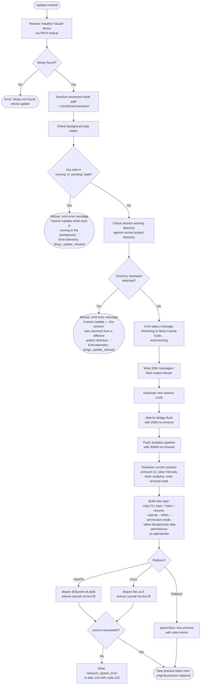

# `/update`

> Analysis basis: CC v2.1.179 bundle.js (AST extraction + Claude interpretation)
> Minimum version: v2.1.179

---

## Overview

The `/update` command performs an in-process upgrade of Claude Code to its latest installed version without ending the current conversation. When invoked, it validates preconditions, flushes in-flight I/O, tears down the current runtime session, and re-executes the process via `execve`/`spawnSync` so that the new binary takes over with the conversation context forwarded via `--resume`.

---

## Registration

| Field | Value |
|---|---|
| type | `local` |
| name | `update` |
| description | `Switch to the latest version (conversation continues)` |
| supportsNonInteractive | `false` |
| isHidden | `true` |
| module_id | `R0K` |
| load_inline | `true` |
| loc_byte | `13085395` |
| loc_byte_end | `13085636` |
| loc_line | `9036` |
| arbor_handler.name | `JK5` |
| arbor_handler.fqn | `claude-2.1.179::JK5` |
| arbor_handler.kind | `AsyncFunction` |
| arbor_handler.resolution_path | `module_id` |
| arbor_handler.n_hits | `0` |

Analysis basis: CC v2.1.179 bundle.js:+13085395

---

## Input Branching

The command follows 5+ distinct branches across precondition checks and execution paths, so a Mermaid flowchart is used.



---

## Behavioral Spec

### 1. Binary Resolution

Before attempting any upgrade work, the handler resolves the `claude` executable using `Bun.which`. The resolved path is then used to derive the versioned installation directory under `~/.local/share/versions/` (joined via path utilities). If the binary cannot be found, the update is refused immediately.

Analysis basis: CC v2.1.179 bundle.js:+13083191 (call to binary-resolver), +862237 (`Bun.which`), +6982038 (home directory join), +8490340 (`"versions"` path segment)

```
function resolveInstallPath():
    binaryPath = Bun.which("claude")
    if binaryPath is null:
        raise UpdateRefused("binary not found")
    homeDir = os.homedir()
    versionsDir = path.join(homeDir, ".local", "share", "versions")
    return { binaryPath, versionsDir }
```

### 2. Precondition Checks

Two guards run before the update proceeds:

**Guard A — Background work check** (`"running"` / `"pending"` states):  
The handler inspects active background task state. If any task reports status `"running"` or `"pending"`, the update is blocked and telemetry event `tengu_update_refused` is emitted.

Error message (exact text): `"Cannot /update while work is running in the background — wait for it to finish, then try again."` (bundle.js:+13083655)

**Guard B — Project directory mismatch check:**  
The handler compares the session's recorded working directory against the process's current working directory. A mismatch indicates a cross-directory `--resume` scenario where safe re-execution is impossible.

Error message (exact text): `"Cannot /update — this session was resumed from a different project directory. Restart manually with --resume to continue on the latest version."` (bundle.js:+13083899)

Analysis basis: CC v2.1.179 bundle.js:+13083291 (telemetry), +13083552 (`"running"`), +13083574 (`"pending"`), +13083655 (error literal), +13083899 (error literal)

```
function checkPreconditions(appState, taskRegistry):
    for each task in taskRegistry.values():
        if task.status in ["running", "pending"]:
            emit telemetry("tengu_update_refused")
            raise UpdateRefused("Cannot /update while work is running…")

    if appState.workingDirectory != process.cwd():
        emit telemetry("tengu_update_refused")
        raise UpdateRefused("Cannot /update — this session was resumed…")
```

### 3. Pre-Relaunch Flush Sequence

After preconditions pass, the handler prepares for process replacement:

1. **Status notification**: emits a `text`-typed message `"Switching to latest Claude Code… reconnecting"` to the conversation stream (bundle.js:+13084384).
2. **SDK message write**: calls `writeSdkMessages` to persist in-flight messages (bundle.js:+13084360).
3. **New session ID**: generates a UUID via `crypto.randomUUID()` for the resumed session (bundle.js:+13084380).
4. **Bridge flush with timeout**: awaits the I/O bridge flush with a hard timeout of **2000 ms** (`"bridge flush"`, bundle.js:+13084464, +13084469).
5. **Session teardown**: calls `flush()` then `teardown()` on the session object (bundle.js:+13084454, +13084505).

Analysis basis: CC v2.1.179 bundle.js:+13083337 (`"text"`), +13084384 (status string), +13084380 (UUID), +13084464 (2000 ms timeout)

```
async function preRelaunchFlush(session, bridge):
    session.writeSdkMessages([{ type: "text", content: "Switching to latest Claude Code… reconnecting" }])
    newSessionId = crypto.randomUUID()
    await Promise.race([
        bridge.flush(),
        timeout(2000)   // "bridge flush" timeout
    ])
    await session.flush()
    await session.teardown()
    return newSessionId
```

### 4. Full Session Teardown (relaunchWithSession)

The teardown helper (`jVH`) performs a deeper cleanup sequence:

1. **Path stat check**: validates the new binary path via `fs.stat` (bundle.js:+12808686).
2. **Scroll summary**: emits telemetry `tengu_scroll_summary` and clears intervals (bundle.js:+7194914).
3. **Terminal state write**: writes terminal save/restore escape sequences (`ESC 7` / `ESC 8`, bundle.js:+3930024, +3930035) and unmounts the UI via `H.unmount`.
4. **Analytics drain**: calls `qdH` (analytics drain wrapper over `oSA.drain`) with a **30000 ms** timeout labeled `"analytics flush timeout"` (bundle.js:+12808923, +12808805).
5. **MCP reconnect**: triggers MCP client reconnection via the MCP registry (`KxH`, `Us8`) to ensure tool state is transferred (bundle.js:+12809234).
6. **Argv construction**: assembles the new process argument list from current CLI args, forwarding `--resume`, `--add-dir`, `--effort`, `--permission-mode`, and `--allow-dangerously-skip-permissions` flags as applicable (bundle.js:+12808738, +12810262, +12810519, +12810536, +12810377).
7. **Signal handler reset**: removes all existing signal listeners and re-registers `SIGINT`/`SIGHUP`/`beforeExit`/`exit` handlers appropriate for the relaunch (bundle.js:+12809307, +12809278, +12809297).

Analysis basis: CC v2.1.179 bundle.js:+12808592–12809678

```
async function relaunchWithSession(newBinaryPath, currentArgs, sessionId):
    await fs.stat(newBinaryPath)   // confirm binary exists

    clearAllIntervals()
    unmountUI()
    writeTerminalEscapeSequences()  // ESC-7 save, ESC-8 restore

    await Promise.race([
        drainAnalytics(),
        timeout(30000)   // "analytics flush timeout"
    ])

    reconnectMcpClients()

    newArgv = buildArgv(currentArgs, {
        resume: sessionId,
        addDirs: currentAddDirs,
        effort: currentEffort,
        permissionMode: currentPermissionMode,
        bypassPermissions: currentBypassPermissions
    })

    process.removeAllListeners()
    registerRelaunchSignalHandlers()

    execveOrSpawn(newBinaryPath, newArgv)
```

### 5. Process Replacement (execve / spawnSync)

The handler (`jJK`) attempts a true process image replacement using `execve` loaded from the platform's C library via `bun:ffi` (bundle.js:+12807842):

- **macOS**: opens `/usr/lib/libSystem.B.dylib` (bundle.js:+12807886)
- **Linux**: opens `libc.so.6` (bundle.js:+12807915)

Arguments are passed as a null-terminated UTF-8 `Buffer` (bundle.js:+12808018). If `execve` succeeds the original process is fully replaced. On failure, a fallback `spawnSync` is attempted with `stdio: "inherit"` (bundle.js:+12809399). If that also fails, the error descriptor `"relaunch_spawn_error"` is written to disk (bundle.js:+12809589) and the process exits with code **128** (bundle.js:+12809726).

Environment variables are passed via `Object.entries` enumeration with environment forwarding (bundle.js:+12808146).

Analysis basis: CC v2.1.179 bundle.js:+12807834, +12807865, +12808241, +12809364, +12809613

```
function execveOrSpawn(binaryPath, argv):
    lib = loadFfi(platform == "macos" ? "/usr/lib/libSystem.B.dylib" : "libc.so.6")
    execveFn = lib.symbols.execve  // sig: (ptr, ptr, ptr) -> int

    argBuffer  = encodeUtf8NullTerminated(argv)
    envBuffer  = encodeUtf8NullTerminated(currentEnv)

    result = execveFn(Buffer.from(binaryPath), argBuffer, envBuffer)

    // execve only returns on failure
    fallback = spawnSync(binaryPath, argv, { stdio: "inherit" })
    if fallback failed:
        writeFileSync(errorPath, "relaunch_spawn_error")
        process.exit(128)
```

### 6. Post-Relaunch Conversation Context Transfer

The resumed argv always includes `--resume <sessionId>` to allow the new process to reload conversation history. The helper `wc8` also collects the `--add-dir` paths and other session flags to reconstruct the original invocation context, including `"cliArg"` and `"session"` typed sources (bundle.js:+12810162, +12810183).

Analysis basis: CC v2.1.179 bundle.js:+12808738, +12810087–12810481

```
function buildResumeArgv(originalArgv, sessionFlags):
    base = Array.from(originalArgv)
    base.push("--resume", sessionFlags.sessionId)
    for each dir in sessionFlags.addDirs:
        base.push("--add-dir", dir)
    if sessionFlags.effort:
        base.push("--effort", sessionFlags.effort)
    if sessionFlags.permissionMode:
        base.push("--permission-mode", sessionFlags.permissionMode)
    if sessionFlags.bypassPermissions:
        base.push("--allow-dangerously-skip-permissions")
    return base
```

---

## State & Side Effects

| Item | Detail |
|---|---|
| Telemetry: `tengu_update_refused` | Emitted when a background task is active or when a working-directory mismatch is detected (bundle.js:+13083291) |
| Telemetry: `tengu_scroll_summary` | Emitted during teardown to record scroll/display state (bundle.js:+7194914) |
| Telemetry: `tengu_amber_creek` | Emitted from terminal fullscreen path during teardown (bundle.js:+3587656) |
| Telemetry: `tengu_pewter_brook` | Emitted from alternate terminal path during teardown (bundle.js:+3587564) |
| Telemetry: `tengu_bg_dispatch_sigkill_escalate` | May fire if background daemon does not shut down cleanly (bundle.js:+17067302) |
| Telemetry: `tengu_config_parse_error` | May fire if config cannot be read during argv reconstruction (bundle.js:+3400393) |
| Telemetry: `tengu_disable_bypass_permissions_mode` | Fires if bypass-permissions mode is disabled during session transfer (bundle.js:+4357717) |
| Telemetry: `tengu_daemon_control` | Emitted during daemon stop/stop-failed transitions in teardown (bundle.js:+17105376) |
| appState changes | `_.getAppState` read at +13084159; `_.setAppState` written at +13084274 to record update-in-progress state |
| Session UUID | A fresh `crypto.randomUUID()` is generated for the resumed session (bundle.js:+13084380) |
| SDK messages flushed | `$.writeSdkMessages` called before relaunch (bundle.js:+13084360) |
| Bridge flushed | `$.flush` with 2000 ms timeout; `$.teardown` follows (bundle.js:+13084454, +13084505) |
| Terminal escape sequences | ESC-7 (save cursor) and ESC-8 (restore cursor) written to stdout during UI teardown (bundle.js:+3930024, +3930035) |
| Signal handlers | All existing process signal handlers are removed; new handlers for `SIGINT`, `SIGHUP`, `beforeExit`, `exit` are registered for the relaunch phase (bundle.js:+12809307) |
| Error file written | On `spawnSync` failure, `"relaunch_spawn_error"` written to a temp path; process exits 128 (bundle.js:+12809589, +12809726) |
| Hook registration | `xPA` appends a `"last-prompt"` entry (bundle.js:+13629169); `Pf`/`U9` calls `oSA.register` for hook tracking (bundle.js:+66377) |
| Sound | <!-- TODO: not found in depth-2 traversal; needs --depth 4 --> |

---

## Version History

| Version | Change |
|---|---|
| v2.1.179 | Initial analysis |

---

## Common Mistakes

1. **Invoking `/update` while a background task is running**: The command will refuse with an explicit error message and emit `tengu_update_refused`. You must wait for all running/pending background tasks to complete before updating.

2. **Invoking `/update` in a cross-directory resumed session**: If the session was started from directory A and later resumed from directory B, `/update` will refuse. You must restart manually with `--resume` from the correct directory instead.

3. **Expecting the command to appear in `/help`**: The registration sets `isHidden: true`, so `/update` does not appear in the command list. Users must know to invoke it explicitly.

4. **Expecting interactive prompts**: `supportsNonInteractive: false` means this command is strictly interactive-session-only. Calling it in a non-interactive pipeline will not work.

5. **Assuming the old process continues**: `execve` fully replaces the process image on success. Any in-memory state not serialized before the relaunch is permanently lost. The conversation continues only because the session ID is forwarded via `--resume`.

6. **Assuming instant execution**: The flush sequence includes a 2000 ms bridge flush timeout and a 30000 ms analytics drain timeout. In degraded network conditions the update may appear to hang for up to ~32 seconds before the new process takes over.

---

## Appendix — Identifier Mapping

> For bundle debugging only. Identifiers change across versions.

| Identifier | Role |
|---|---|
| `JK5` | Main async handler for `/update` (arbor_handler; AsyncFunction) |
| `Bc8` | Binary/install-path resolver (resolves `claude` binary and versioned path) |
| `P3` | PATH lookup wrapper (calls `Bun.which`) |
| `sgA` | Low-level `Bun.which` call site |
| `aR` | Versioned install directory path builder |
| `vI8` | Path join helper for versioned install tree |
| `X3` | Array.isArray utility used in path construction |
| `A$H` | Home directory path segment builder (`.local/share`) |
| `hT8` | `os.homedir()` wrapper |
| `VqH` | Versioned `bin/` directory path builder |
| `V9` | Process mode checker (`"bg"` / `"daemon"` / `"daemon-worker"` detection) |
| `XyH` | Process mode constants |
| `d` | General async utility / deferred helper |
| `nJ` | Executable basename resolver (calls `path.basename`) |
| `I6` | Output/display emitter |
| `OT` | Terminal output primitive |
| `Fh` | Current binary path resolver |
| `GXA` | Directory-change utility (changes working dir then resolves) |
| `G_` | Sub-utility called by GXA |
| `D4` | Sub-utility called by GXA |
| `s4H` | Session state accessor |
| `j8H` | Background-task state inspector (checks `"ant"` queue membership) |
| `Nn8` | Task-type registry lookup |
| `xPA` | Hook/prompt-entry appender (writes `"last-prompt"` entry) |
| `Pf` | Hook registration coordinator |
| `U9` | `oSA.register` call site |
| `SH` | Telemetry/logging subsystem entry point |
| `WA` | Error formatter |
| `f6` | String coercion utility |
| `fq` | Log formatter |
| `YrA` | Log line builder |
| `Nd4` | Rolling log buffer manager (shift/push) |
| `h5` | Async-local-storage context reader |
| `O2` | `w2_.getStore()` wrapper |
| `$J` | App-state mutation helper |
| `$` | SDK I/O bridge object (`writeSdkMessages`, `flush`, `teardown`) |
| `yTK` | SDK message write coordinator |
| `Ht` | Message format builder |
| `mLH` | Message text trimmer |
| `H9` | Session-store getter (`YWf.getStore`) |
| `VF6` | Daemon status file path builder (`daemon.status.json`) |
| `bH` | JSON serializer wrapper |
| `I0K` | Session UUID generator (`crypto.randomUUID`) |
| `r4` | Timeout-race utility (`Promise.race` + `setTimeout` + `clearTimeout`) |
| `gXH` | Object.assign helper for state merge |
| `J2H` | String coercion for argument building |
| `jVH` | Full relaunch-with-session coordinator (main teardown + exec) |
| `Oy6` | Interval-clear helper |
| `Uo_` | `clearInterval` wrapper |
| `FxH` | Terminal/UI unmount sequence |
| `H` | Ink/React UI root (has `.unmount`, `.replaceAll`) |
| `qR` | Post-unmount cleanup step |
| `xY8` | Terminal escape sequence writer |
| `zRH` | Terminal emulator version checker (Ghostty, iTerm, tmux) |
| `qRH` | Terminal write helper |
| `_G` | tmux / multiplexer escape-prefix handler |
| `mL` | Miscellaneous terminal utility |
| `N` | Log-level formatter / message classifier |
| `aZ8` | Scroll summary and animation driver |
| `b0` | Scroll animation sub-step |
| `U9q` | Animation frame counter |
| `p9q` | Progress timing calculator (`Date.now`, `Math.max`, `Math.round`) |
| `u9q` | Progress sub-utility |
| `m1` | Fullscreen-mode manager |
| `xl` | Fullscreen capability checker |
| `GS_` | Fullscreen state formatter |
| `it` | Fullscreen enter helper |
| `WS_` | Fullscreen exit helper (Windows/tmux guard) |
| `t_` | Fullscreen transition helper |
| `usf` | Fullscreen restore helper |
| `Y6` | React rendering / component render helper |
| `iE` | Hook-flush initiator |
| `qdH` | Analytics drain wrapper (`oSA.drain`) |
| `QxH` | Post-drain promise resolver |
| `rZ8` | Post-drain cleanup |
| `jJK` | Low-level process-replacement executor (execve / spawnSync) |
| `L` | FFI library handle (libSystem / libc) |
| `A` | FFI symbol table |
| `q` | FFI active-call set |
| `f` | FFI call lifecycle manager |
| `D` | Background-daemon process manager |
| `b` | Background session object |
| `n8` | Abort/timeout promise helper |
| `CH` | Daemon feature-ok telemetry emitter |
| `IH` | Daemon feature-bad telemetry emitter |
| `il8` | Low-memory check helper |
| `oRH` | Temp-file lstat/rm/read helper |
| `g` | Settled-task reaper |
| `_kA` | Spare-session claim coordinator |
| `MkA` | Main daemon dispatch / session lifecycle manager |
| `Y` | Forced-shutdown handler (`process.exit`, `z.abort`) |
| `G8` | General state snapshot helper |
| `QH` | n36 utility wrapper |
| `B` | Disposable resource |
| `O` | Background-mode helper |
| `y8` | Background-session descriptor |
| `M` | MCP client registry manager |
| `KxH` | MCP connection builder (all transport types) |
| `Us8` | MCP connection result applier |
| `fhA` | MCP reconnect orchestrator |
| `z` | Daemon stop coordinator |
| `QS` | Daemon stop signal sender |
| `QB` | Daemon stop-with-timeout race |
| `GH` | String coercion / display helper |
| `bX` | Error file writer (`Y_.writeFileSync`) |
| `wc8` | Resume-argv assembler |
| `wNH` | Argv flag filter |
| `IL8` | Argv source classifier |
| `h6` | Config file reader / watcher |
| `c6` | Config path resolver |
| `iy_` | Config schema validator |
| `r5H` | Config file sync reader and migrator |
| `brf` | Config file watcher (`oO8.watchFile`) |
| `B_` | Session-context reconstructor (reads app state for resume) |
| `MU8` | Session working-directory extractor |
| `M1` | Session model/flag extractor |
| `$U8` | Session tool-list extractor |
| `wx` | Permission-mode disable handler |
| `S$` | Minimal app-state reader for resume argv |