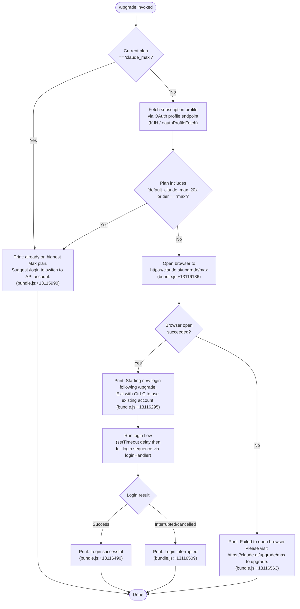

# `/upgrade`

> Analysis basis: CC v2.1.178 bundle.js (AST extraction + Claude interpretation)
> Minimum version: v2.1.178

---

## Overview

`/upgrade` guides the user from a lower-tier Claude plan to the **Claude Max** subscription tier by opening a browser to `https://claude.ai/upgrade/max` and then initiating a fresh login sequence to pick up the new entitlements. If the user is already on the highest Max plan, the command short-circuits immediately with an informational message and takes no further action.

---

## Registration

| Field | Value |
|---|---|
| type | `local-jsx` |
| name | `upgrade` |
| description | `Upgrade to Max for higher rate limits and more Opus` |
| loc_byte | `13116770` |
| loc_byte_end | `13117017` |
| loc_line | `9032` |
| module_id | `ZPA` |
| load_inline | `true` |
| arbor_handler.name | `YF6` |
| arbor_handler.fqn | `claude-2.1.178::YF6` |
| arbor_handler.kind | `AsyncFunction` |
| arbor_handler.resolution_path | `module_id` |
| arbor_handler.n_hits | `0` |

Analysis basis: CC v2.1.178 bundle.js:+13116770

---

## Input Branching

The handler has four distinct outcome paths depending on plan and browser availability, so a Mermaid flowchart is used.



---

## Behavioral Spec

### Top-level handler (`YF6` — upgradeCommandHandler)

```
async function upgradeCommandHandler(context):
    appState = context.getAppState()

    // 1. Early-exit: already at highest Max tier
    if appState.currentPlan == "claude_max":
        print("You are already on the highest Max subscription plan. "
              "For additional usage, run /login to switch to an API usage-billed account.")
        return

    // 2. Fetch OAuth profile to verify subscription tier
    profile = await fetchOAuthProfile(context)   // calls oauthProfileFetch (KJH)
    if profile.tier == "max" OR profile.planId == "default_claude_max_20x":
        // User is already upgraded; reflect same message
        print(alreadyOnMaxMessage)
        return

    // 3. Open upgrade URL in the default browser
    upgradeURL = "https://claude.ai/upgrade/max"
    opened = await openUrlInBrowser(upgradeURL)   // calls urlOpener (h4 → Dg9)

    if NOT opened:
        print("Failed to open browser. Please visit https://claude.ai/upgrade/max to upgrade.")
        return

    // 4. Notify user then start a fresh login
    print("Starting new login following /upgrade. Exit with Ctrl-C to use existing account.")
    await delay(setTimeout)   // brief delay before login
    result = await runLoginFlow(context)   // calls loginHandler (jTH)

    if result == SUCCESS:
        print("Login successful")
    else:
        print("Login interrupted")
```

Analysis basis: CC v2.1.178 bundle.js:+13115659

---

### OAuth Profile Fetch (`KJH` — oauthProfileFetch)

```
async function fetchOAuthProfile(context):
    token = oauthTokenStore.get()    // zA.get
    response = await httpPost(
        url      = oauthProfileEndpoint,
        headers  = { "Content-Type": "application/json" },
        timeout  = 10000,            // bundle.js:+2127895
        event_id = "oauth_profile_fetch"   // bundle.js:+2127911
    )
    if response.error:
        emit telemetry("oauth_profile_token_failed")   // bundle.js:+2127978
        logError(response.error)
    return response.data
```

Analysis basis: CC v2.1.178 bundle.js:+2127751

---

### URL Opener (`h4` / `Dg9` — urlOpener)

```
async function openUrlInBrowser(url):
    // Validates URL scheme
    if NOT (url.startsWith("http:") OR url.startsWith("https:")):
        throw Error("Invalid URL scheme")   // KV7, bundle.js:+6311128

    if platform == "darwin":
        spawn("open", [url])               // bundle.js:+6311885
    else:
        // cross-platform open via Iw / g8
        spawnPlatformOpen(url)

    return true on success, false on failure
```

Analysis basis: CC v2.1.178 bundle.js:+6311736

---

### Login Flow (`jTH` — loginHandler)

```
async function runLoginFlow(context):
    // Reads current app state
    state = context.getAppState()

    // Triggers OAuth device flow / browser-based auth
    await startOAuthDeviceFlow(context)          // VA6 → sr

    // On API key change, propagates new credentials
    context.onChangeAPIKey(newKey)               // bundle.js:+8725808

    // Applies any pending message operations
    context.applyMessageOp(op)                   // bundle.js:+8725827

    // Updates account state (setAppState)
    context.setAppState(updatedState)            // bundle.js:+8726306

    // Loads remote managed settings for new account
    await loadRemoteManagedSettings()            // sy6 / co_

    // Refreshes policy limits for new account
    await refreshPolicyLimits()                  // dy6 / PE8

    // If account changed (different user/org), disconnects bridge/repl
    if accountChanged:
        log("[bridge:repl] Account changed via /login — disconnecting Remote Control session")
        // bundle.js:+8726218

    // Trusted device enrollment for new session
    await enrollTrustedDevice()                  // sy6 → zA.post

    return loginOutcome
```

Analysis basis: CC v2.1.178 bundle.js:+8725808

---

### Plan / Tier Resolution (`ZA` — resolveCurrentPlan)

```
function resolveCurrentPlan(appState):
    // Uses authConfigReader (Hw) to determine active auth method
    authMethod = readAuthConfig(appState)   // Hw

    // Checks for profile-implicit plan
    if authMethod.profileType == "profile-implicit":
        return authMethod.plan

    // Checks for user_oauth plan
    if authMethod.oauthType == "user_oauth":
        return authMethod.plan

    return null
```

Analysis basis: CC v2.1.178 bundle.js:+3302500

---

### Auth Config Reader (`Hw` — authConfigReader)

Reads the active authentication configuration from `appState` and resolves which provider is in use. Recognises the following provider string constants found in scope:

- `"bedrock"` (bundle.js:+2120745)
- `"foundry"` (bundle.js:+2120795)
- `"anthropicAws"` (bundle.js:+2120851)
- `"mantle"` (bundle.js:+2120905)
- `"vertex"` (bundle.js:+2120953)
- `"firstParty"` (bundle.js:+2120962)

It also validates that one of `ANTHROPIC_API_KEY`, `ANTHROPIC_AUTH_TOKEN`, `CLAUDE_CODE_OAUTH_TOKEN`, or WIF env vars (`ANTHROPIC_FEDERATION_RULE_ID` + `ANTHROPIC_ORGANIZATION_ID`) is present (bundle.js:+3283902).

Analysis basis: CC v2.1.178 bundle.js:+3281183

---

## State & Side Effects

| Item | Detail |
|---|---|
| Telemetry — `tengu_feature_ok` | Fired on successful feature flag read (bundle.js:+1020153) |
| Telemetry — `tengu_feature_sad` | Fired on soft feature flag failure (bundle.js:+1020301) |
| Telemetry — `tengu_feature_bad` | Fired on hard feature flag failure (bundle.js:+1020220) |
| Telemetry — `tengu_managed_settings_security_dialog_shown` | Fired when remote-managed settings security dialog is presented (bundle.js:+7208525) |
| Telemetry — `tengu_managed_settings_security_dialog_accepted` | Fired when user accepts new managed settings (bundle.js:+7208906) |
| Telemetry — `tengu_managed_settings_security_dialog_rejected` | Fired when user rejects new managed settings (bundle.js:+7209065) |
| Telemetry — `tengu_policy_limits_fetch` | Fired when policy limits are fetched post-login (bundle.js:+7149707) |
| Telemetry — `tengu_disable_bypass_permissions_mode` | Fired if bypass-permissions mode is disallowed after account change (bundle.js:+11251918) |
| Telemetry — `tengu_auto_mode_config` | Fired to record auto-mode configuration state after login (bundle.js:+11249807) |
| Telemetry — `tengu_daemon_config_reload` | Fired when daemon config is reloaded (bundle.js:+17081946) |
| Browser side effect | Opens `https://claude.ai/upgrade/max` in the system default browser |
| `appState` changes | `setAppState` called with updated account credentials and plan after successful login (bundle.js:+8726306) |
| Hook registration | Process `exit` and `beforeExit` listeners cleared on session teardown (`$sH`); intervals/timeouts cleared (bundle.js:+3326222, +3326982) |
| Credential storage | New OAuth token written via secure storage or plaintext fallback (`KC1` / `tK`); telemetry events `secure_storage_credentials_write`, `primary_transient_skip_fallback`, `plaintext_fallback_used`, `primary_and_fallback_failed` possible (bundle.js:+2323596–2323946) |
| Remote managed settings | Pulled and optionally cached after auth change; cache validated via SHA-256 hash (bundle.js:+7187048) |
| Policy limits | Refreshed from network after login; stale cache used on failure (bundle.js:+7150134) |
| Trusted device enrollment | POST to enrollment endpoint; device token stored; `bridge_trusted_device_enroll` telemetry emitted (bundle.js:+7171879) |
| Sound | None identified in depth-2 traversal |

---

## Version History

| Version | Change |
|---|---|
| v2.1.178 | Initial analysis |

---

## Common Mistakes

1. **Running `/upgrade` when already on Max**: The command immediately prints a message directing the user to `/login` for API billing instead of attempting a browser upgrade flow. No browser is opened.
2. **Cancelling the Ctrl-C prompt too early**: The message "Exit with Ctrl-C to use existing account" is printed before the login sequence starts. Pressing Ctrl-C after the login handshake has begun may leave credentials in a partially updated state.
3. **Browser unavailable in headless/SSH environments**: If the system cannot open `https://claude.ai/upgrade/max`, the command falls back to printing the URL for manual navigation. Upgrade still requires a browser-based OAuth flow; there is no CLI-only path.
4. **Confusing `/upgrade` with `/login`**: `/upgrade` is specifically for plan tier promotion to Claude Max. After upgrading on the web, a `/login` is still required if Claude Code was already authenticated with the previous plan's token.
5. **Network or OAuth profile fetch failure**: If the OAuth profile endpoint returns an error (HTTP 401/403/429 — bundle.js:+182657/182666/182675), the plan-check step may be indeterminate and the handler may proceed to the browser flow unnecessarily.

---

## Appendix — Identifier Mapping

> For bundle debugging only. Identifiers change across versions.

| Identifier | Role |
|---|---|
| `YF6` | upgradeCommandHandler — async top-level handler for `/upgrade` |
| `ZA` | resolveCurrentPlan — reads plan tier from app state |
| `Hw` | authConfigReader — resolves active auth provider and config |
| `vL` | authConfigParser — parses raw auth config object |
| `L6` | stringUtility — general string helper |
| `kn6` | authConfigValidator — validates parsed auth fields |
| `Qj` | oauthConfigBuilder — builds OAuth configuration object |
| `bq8` | sessionFlagReader — reads session flag settings |
| `eaH` | providerChecker — checks auth provider type |
| `eF` | oauthTokenFileDescriptorReader — reads OAuth token from FD |
| `fv` | authConfigMerger — merges multiple auth config sources |
| `cb` | arrayIncludesChecker — checks array membership |
| `E4` | profileImplicitResolver — resolves implicit profile auth |
| `S_` | apiKeyValidator — validates API key format |
| `tP` | tokenRefresher — refreshes expiring tokens |
| `SO` | oauthSessionBuilder — builds full OAuth session |
| `OG6` | oauthGrantHandler — handles OAuth grant response |
| `cQH` | vsCodeClientDetector — detects claude-vscode client |
| `XX6` | oauthTokenFdLoader — loads token from file descriptor |
| `S6` | flagSettingsWriter — persists flag settings |
| `nb` | messageHistoryTrimmer — trims message history (max 20 items) |
| `wG6` | providerTypeEmitter — emits provider type for config |
| `KJH` | oauthProfileFetch — fetches user OAuth profile from API |
| `k1` | oauthUrlBuilder — constructs OAuth endpoint URL |
| `JgA` | environmentDetector — detects prod/staging/local environment |
| `ON4` | oauthClientIdResolver — resolves OAuth client ID |
| `SH` | credentialPersister — persists credentials to storage |
| `d` | secureStorageWriter — writes to secure storage |
| `dH` | plaintextFallbackWriter — writes credentials as plaintext fallback |
| `c36` | esModuleExportsMarker — marks module as ES module |
| `d6` | credentialReader — reads credentials from storage |
| `gz` | nonceGenerator — generates OAuth nonce |
| `N` | loggingWriter — writes structured log entries |
| `AM4` | logEntryFormatter — formats log entry for output |
| `WSA` | logFilePather — resolves log file path |
| `H` | retryWithJitter — retries with random jitter (Math.random + setTimeout) |
| `xH` | jsonStringifyHelper — wraps JSON.stringify |
| `d4` | logLineFormatter — formats a single log line |
| `sCA` | logLevelMapper — maps log level codes to strings |
| `VdH` | logStreamFlusher — flushes log stream writes |
| `FCA` | streamWriter — writes directly to stream |
| `LM4` | logFileWriter — manages log file rotation and appending |
| `sQH` | writeQueueProcessor — processes buffered write queue |
| `G7H` | logFilePathResolver — resolves final log file path |
| `n6` | pathNormalizer — normalizes file path separators |
| `INH` | eisDirChecker — detects EISDIR errors |
| `_bA` | logFileJoiner — joins log directory and filename |
| `P__` | logFileRotator — rotates .txt log files |
| `fM4` | logFileAppender — appends data to log file with mkdir |
| `F9` | atexitRegistrar — registers atexit/cleanup handler |
| `RH` | httpRequestHandler — makes HTTP requests with retry/queue |
| `jA` | httpErrorBuilder — builds HTTP error objects |
| `qq` | requestPriorityRouter — routes requests by telemetry priority |
| `biA` | essentialTrafficChecker — checks essential-traffic flag |
| `RQ4` | requestQueueManager — manages pending request queue (shift/push) |
| `h4` | urlOpenerDispatcher — dispatches URL open by platform |
| `KV7` | urlSchemeValidator — validates http/https URL schemes |
| `Dg9` | platformUrlOpener — opens URL using platform-native command |
| `Iw` | urlOpenerCore — core URL open implementation |
| `g8` | processSpawner — spawns child process for URL open |
| `Q_` | childProcessManager — manages spawned child processes |
| `u6` | processOutputReader — reads stdout/stderr from process |
| `Z4` | sessionStateResetter — resets session state after login |
| `jTH` | loginHandler — orchestrates full login sequence |
| `FQH` | timestampGenerator — generates Date.now timestamps |
| `VA6` | oauthDeviceFlowOrchestrator — orchestrates OAuth device flow |
| `l9q` | deviceCodeRequester — requests device authorization code |
| `Ok6` | tokenExchanger — exchanges device code for access token |
| `ftA` | tokenExchangeCore — core token exchange logic |
| `sr` | remoteSettingsLoader — loads remote managed settings |
| `a7H` | remoteSettingsEndpointResolver — resolves settings endpoint URL |
| `_AH` | remoteSettingsCacheReader — reads cached remote settings |
| `LNH` | remoteSettingsHasher — hashes settings for cache validation |
| `Fz` | remoteSettingsFetcher — fetches settings over HTTP |
| `Y7` | vq8Wrapper — wraps vq8 validation call |
| `FW` | sessionWriterForward — writes session data forward |
| `JG6` | sessionWriterReverse — writes session data in reverse |
| `tE8` | remoteSettingsApplier — applies fetched settings to state |
| `LtA` | settingsDiffLogger — logs settings changes |
| `Qo_` | remoteSettingsPollScheduler — schedules background settings poll |
| `x9q` | pollIntervalCalculator — calculates next poll interval |
| `co_` | remoteSettingsSyncCore — core sync logic for managed settings |
| `s7H` | settingsValidator — validates settings object structure |
| `q9q` | settingsHashComputer — computes SHA-256 hash of settings |
| `$F7` | settingsSecurityChecker — checks security of new settings |
| `bH` | credentialReaderAlt — alternate credential reader |
| `alH` | settingsSchemaValidator — validates settings against schema |
| `B9q` | remoteSettingsConsentManager — manages user consent for settings |
| `u9q` | managedSettingsSecurityDialog — shows security dialog for settings |
| `m9q` | settingsApplyExecutor — executes settings application |
| `F9q` | settingsCacheWriter — writes settings to local cache file |
| `d9q` | fdCleanup — cleans up file descriptors |
| `c9q` | remoteSettingsChangeWatcher — watches for settings changes |
| `YE8` | intervalPoller — sets/clears polling interval |
| `zF7` | remoteSettingsRefresher — refreshes settings on trigger |
| `dy6` | policyLimitsRefresher — refreshes policy limits after auth change |
| `ur_` | policyLimitsClearer — clears policy limits on account switch |
| `Ur_` | policyLimitsClearCore — core limits clearing logic |
| `M5H` | policyLimitsModelChecker — checks model against policy limits |
| `JE8` | policyLimitsLoadScheduler — schedules policy limits load |
| `ab` | policyLimitsConfig — holds policy limits configuration |
| `xJH` | policyLimitsPathResolver — resolves policy limits cache path |
| `PE8` | policyLimitsFetchOrchestrator — orchestrates policy limits fetch |
| `j1q` | policyLimitsFetcher — fetches policy limits from network |
| `J1q` | policyLimitsApplier — applies fetched policy limits |
| `kJH` | trustedDeviceKicker — kicks off trusted device enrollment check |
| `N1H` | sessionTeardownHandler — handles session teardown/cleanup |
| `Xp` | sessionEventEmitter — emits session lifecycle events |
| `qp` | ibWrapper — wraps ib event bus call |
| `$sH` | sessionCleanupExecutor — executes full session cleanup |
| `ty_` | intervalAndListenerClearer — clears intervals and process listeners |
| `DE6` | accountChangeDetector — detects account/org changes |
| `Lo_` | remoteControlDisconnector — disconnects remote control session |
| `x_` | workerThreadInitializer — initializes worker thread bindings |
| `ec6` | workerEventBinder — binds worker event handlers |
| `_GH` | bridgeSessionStateUpdater — updates bridge/repl session state |
| `O6` | sessionStateGateKeeper — gates session state transitions |
| `tK` | credentialStorageManager — manages credential read/write/delete |
| `KC1` | keyChainCredentialStore — reads/writes/deletes keychain credentials |
| `sy6` | trustedDeviceEnroller — enrolls device as trusted after login |
| `zR` | trustedDeviceGateChecker — checks if trusted device enrollment should run |
| `vG6` | trustedDeviceFeatureFlagChecker — checks trusted-device feature flag |
| `NG6` | trustedDeviceOrgChecker — checks org-level trusted device policy |
| `o$8` | trustedDeviceTokenCacheResolver — resolves cached device token |
| `a79` | trustedDeviceEligibilityResolver — resolves full enrollment eligibility |
| `bB7` | eRWrapper — wraps eR eligibility check |
| `_o_` | afWrapper — wraps af policy check |
| `K` | policyEnforcementChecker — checks isPolicyAllowed / isPolicyEnforced |
| `f` | pendingOperationTracker — tracks in-flight async operations |
| `L` | connectionManager — manages open/close of connections |
| `Ee6` | enrollmentEndpointResolver — resolves trusted device enrollment URL |
| `TH` | stringCoercer — coerces values to String |
| `ZEq` | bridgeReplDisconnectNotifier — notifies bridge/repl of disconnect |
| `KC6` | permissionModeManager — manages session permission mode |
| `MS8` | bypassPermissionsGateChecker — gates bypassPermissions mode |
| `sy_` | bypassPermissionsFeatureFlagChecker — checks bypass-permissions feature |
| `$k6` | permissionModeApplier — applies permission mode changes |
| `dO` | permissionOpsProcessor — processes permission operation commands |
| `b_` | mcpPolicyReader — reads MCP-level policy restrictions |
| `tp8` | allowedToolsPolicyApplier — applies allowed-tools policy |
| `K1` | toolPolicyCore — core tool policy implementation |
| `ep8` | disallowedToolsPolicyApplier — applies disallowed-tools policy |
| `Nx` | permissionModeDisabler — disables permission mode |
| `u_A` | autoModeGateNotifier — notifies UI of auto-mode gate denial |
| `fC6` | sessionConfigLoader — loads full session configuration |
| `LC6` | sessionConfigCore — core session config loading and application |
| `gn` | a8Resolver — resolves a$8 session metadata |
| `C$A` | sessionConfigValidator — validates session configuration schema |
| `R$A` | sessionConfigRaApplier — applies rA-based session config |
| `d1` | sessionModelResolver — resolves model for session |
| `BJH` | modelVersionGateChecker — checks model version compatibility |
| `k76` | umConfigApplier — applies Um configuration object |
| `Y` | supervisorLifecycleManager — manages supervisor start/stop/config |
| `KG6` | modelStringValidator — validates model string constants |
| `e6H` | sessionConfigExtras — applies extra session config fields |
| `jb` | autoGateDenialLogger — logs auto-gate denial events |
| `oMH` | permissionModeChangedEmitter — emits permission_mode_changed event |
| `WzH` | sessionConfigMapReducer — maps/reduces session config entries |