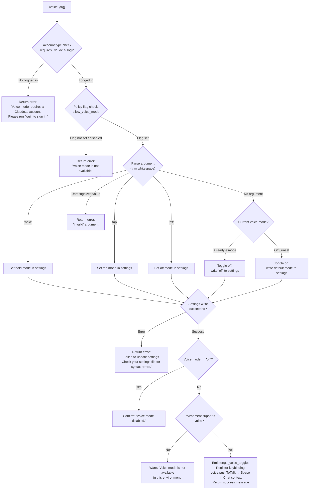

# `/voice`

> Analysis basis: CC v2.1.179 bundle.js (AST extraction + Claude interpretation)
> Minimum version: v2.1.179

---

## Overview

The `/voice` command toggles voice input mode for the Claude Code CLI. It accepts an optional argument (`hold`, `tap`, or `off`) to set a specific voice activation mode, and performs a series of eligibility checks — including account type, policy flags, and environment capabilities — before writing the chosen mode to user settings and reporting the result.

---

## Registration

| Field | Value |
|---|---|
| type | `local` |
| name | `voice` |
| description | `Toggle voice mode` |
| argumentHint | `[hold\|tap\|off]` |
| supportsNonInteractive | `false` |
| isHidden | `null` |
| module_id | `uVK` |
| load_inline | `true` |
| loc_byte | `13408760` |
| loc_byte_end | `13409002` |
| loc_line | `9578` |
| arbor_handler.name | `v55` |
| arbor_handler.fqn | `claude-2.1.179::v55` |
| arbor_handler.kind | `AsyncFunction` |
| arbor_handler.resolution_path | `module_id` |
| arbor_handler.n_hits | `1` |

Analysis basis: CC v2.1.179 bundle.js:+13408760

---

## Input Branching

The command has 5+ distinct branches based on the argument value and eligibility state, so a Mermaid flowchart is used.



Analysis basis: CC v2.1.179 bundle.js:+13406162, +13406174, +13406185, +13406206, +13406273, +13406286, +13406385

---

## Behavioral Spec

### Handler Entry Point (`v55`)

The handler is an `AsyncFunction` resolved via `module_id: "uVK"`, handler identifier `v55`.

```
async function voiceCommandHandler(args, context):
    trimmedArg = trimArgument(args)           // V55 helper
    accountInfo = await getAccountState()     // aw → Uj
    if not accountInfo.hasClaudeAiAccount:
        return textMessage("Voice mode requires a Claude.ai account. Please run /login to sign in.")

    policyFlags = await loadSettings()        // p56 → ml8 → _9
    if not policyFlags.allow_voice_mode:
        return textMessage("Voice mode is not available.")

    mode = parseVoiceArg(trimmedArg)          // V55: "hold" | "tap" | "off" | toggle logic
    if mode == "invalid":
        return textMessage("<invalid argument error>")

    success = await writeVoiceModeSetting(mode)   // DA (settings writer)
    if not success:
        return textMessage("Failed to update settings. Check your settings file for syntax errors.")

    if mode == "off":
        return textMessage("Voice mode disabled.")

    if not environmentSupportsVoice():        // f / K / M checks
        return textMessage("Voice mode is not available in this environment.")

    emitTelemetry("tengu_voice_toggled")      // d at +13406754
    registerKeybinding("voice:pushToTalk", context="Chat", key="Space")   // V2
    return successMessage(mode)
```

Analysis basis: CC v2.1.179 bundle.js:+13406245, +13406256, +13406423, +13406439, +13406506, +13406575, +13406754, +13406871, +13408021

---

### Argument Parsing (`V55`)

```
function parseVoiceArg(rawArg):
    trimmed = rawArg.trim()
    if trimmed == "hold":  return "hold"
    if trimmed == "tap":   return "tap"
    if trimmed == "off":   return "off"
    if trimmed == "":      return TOGGLE   // toggle current state
    return "invalid"
```

Valid literal values: `"hold"` (+13406162), `"tap"` (+13406174), `"off"` (+13406185), `"invalid"` (+13406206).

Analysis basis: CC v2.1.179 bundle.js:+13406115, +13406162

---

### Account and Auth Check (`aw` → `Uj`)

The handler calls an account-state resolver that checks whether the current session holds a Claude.ai user account (as opposed to an API-key-only session). If no such account is present, the voice command is rejected immediately with the literal message:

> "Voice mode requires a Claude.ai account. Please run /login to sign in." (+13406286)

Auth credential types checked internally include `ANTHROPIC_API_KEY`, `user_oauth`, and related tokens. The `firstParty` credential flag is consulted (+2121778).

Analysis basis: CC v2.1.179 bundle.js:+13406256, +3328245, +3326820

---

### Policy / Feature-Flag Check (`p56` → `ml8` → `_9`)

After the account check, the handler loads settings and verifies the `"allow_voice_mode"` policy flag (+13395486). If this flag is absent or evaluates to false, the command returns:

> "Voice mode is not available." (+13406385)

The flag is evaluated via the `_9` eligibility resolver, which also consults subscription tiers (`"enterprise"` at +2589234, `"team"` at +2589269) and `allow_product_feedback` (+2589535).

Analysis basis: CC v2.1.179 bundle.js:+13395528, +13395483, +13395486

---

### Settings Write (`DA`)

When the mode is valid and eligibility passes, `DA` (the settings writer) is invoked. It:

1. Resolves the user settings file path (`.claude/settings.json` at +1306945/+1306955).
2. Reads the current JSON, merges the new voice mode value.
3. Writes atomically using a temp-file → rename pattern (`ED6`).
4. If a parse or write error occurs, returns the literal:
   > "Failed to update settings. Check your settings file for syntax errors." (+13406673)

Analysis basis: CC v2.1.179 bundle.js:+13406575, +1326183, +1326233, +1326343

---

### Keybinding Registration (`V2` → `wD8` → `RRH`)

On a successful voice-mode enable, the handler registers a push-to-talk keybinding:

- **Action**: `"voice:pushToTalk"` (+13408024)
- **Context**: `"Chat"` (+13408043)
- **Key**: `"Space"` (+13408050)

This is stored in `keybindings.json` (+4017367) under the `"bindings"` array (+4019437). The keybinding loader (`RRH`) validates the structure; format errors emit `keybinding_config_invalid_format` or `keybinding_config_invalid_structure`.

Analysis basis: CC v2.1.179 bundle.js:+13408021, +13408024, +4026289, +4019133

---

### Environment Capability Check

After a successful settings write (and for non-`"off"` modes), the handler checks whether the runtime environment supports voice input. If not, it returns:

> "Voice mode is not available in this environment." (+13407055)

On macOS, the relevant permission path is referenced as `"System Settings → Privacy & Security → Microphone"` (+13407562).

Analysis basis: CC v2.1.179 bundle.js:+13407000, +13407055, +13407542, +13407562

---

### Toggle Behavior (No Argument)

When invoked as `/voice` with no argument, the handler reads the current voice mode from settings:
- If voice mode is currently `"off"` or unset → enables a default mode.
- If voice mode is currently active (`"hold"` or `"tap"`) → writes `"off"` and confirms with `"Voice mode disabled."` (+13406811).

Analysis basis: CC v2.1.179 bundle.js:+13406506, +13406811

---

## State & Side Effects

| Item | Detail |
|---|---|
| Telemetry | `tengu_voice_toggled` (emitted on successful toggle, +13406756); `tengu_feature_ok` (+1020479); `tengu_feature_sad` (+1020627); `tengu_feature_bad` (+1020546); `tengu_keybinding_customization_release` (+4016853); `tengu_custom_keybindings_loaded` (+4017273); `tengu_keybinding_fallback_used` (+4026371) |
| Settings write | Writes the resolved voice mode (`hold`/`tap`/`off`) to `.claude/settings.json` via atomic temp-file rename |
| Keybinding registration | On enable, registers `voice:pushToTalk → Space` in the `Chat` context inside `keybindings.json` |
| appState changes | Voice mode state is updated in the in-memory app state; MCP supervisor is notified via `WnH.emit` (+1327339) |
| Sound | No sound side-effect found in depth-2 traversal |
| Hook registration | File-watch hook (`brf → oO8.watchFile`) registered for settings file to detect external changes |

---

## Version History

| Version | Change |
|---|---|
| v2.1.179 | Initial analysis |

---

## Common Mistakes

1. **Running `/voice` without a Claude.ai account** — API-key-only sessions are rejected. Run `/login` first to authenticate with a Claude.ai account.
2. **Using `/voice` in unsupported environments** — Even with a valid account and policy flag, certain environments (e.g., remote SSH sessions without audio hardware, or environments where the microphone permission has not been granted) will show "Voice mode is not available in this environment." On macOS, grant microphone access via System Settings → Privacy & Security → Microphone.
3. **Settings file syntax errors** — If `.claude/settings.json` has been manually edited and contains invalid JSON, the settings write will fail with "Failed to update settings. Check your settings file for syntax errors."
4. **Expecting interactive toggle in non-interactive mode** — `supportsNonInteractive: false` means `/voice` is rejected in `--print` / headless invocations.
5. **Passing an unrecognized argument** — Only `hold`, `tap`, and `off` are accepted; any other string is treated as `"invalid"` and returns an error.

---

## Appendix — Identifier Mapping

> For bundle debugging only. Identifiers change across versions.

| Identifier | Role |
|---|---|
| `v55` | Main async handler for `/voice` command (arbor_handler) |
| `p56` | Eligibility and settings pre-flight orchestrator |
| `ul8` | Account/auth state loader called by pre-flight |
| `aw` | Account state resolver (checks Claude.ai login) |
| `ZL` | Auth credential validator |
| `Uj` | OAuth/user profile resolver |
| `$4` | First-party credential checker |
| `lP` | Low-level auth provider |
| `kO` | API key / auth token dispatcher |
| `PG6` | Profile loader helper |
| `JsH` | Auth error formatter |
| `bW` | Account state wrapper |
| `dF6` | Feature-dispatch helper |
| `ml8` | Feature-flag settings loader |
| `_9` | Voice feature eligibility checker (reads `allow_voice_mode`) |
| `Mn1` | Subscription tier resolver |
| `pb` | Plan/billing state accessor |
| `fq` | Essential-traffic flag checker |
| `lLH` | Flag logging helper |
| `zt` | Policy settings aggregator |
| `t_` | Settings-from-disk loader entry |
| `bF` | Full settings load orchestrator |
| `FM_` | Settings file reader and parser |
| `C8` | Config file appender / directory creator |
| `Pj6` | Flag/policy settings merger |
| `_H1` | Settings object key enumerator |
| `oDH` | User settings file path resolver |
| `CF` | SDK inline settings handler |
| `eeA` | Settings completion notifier |
| `vb` | Settings source registry |
| `Wj6` | WSL platform detector |
| `V55` | Voice argument parser (trims and classifies argument) |
| `H` | String/random utility (used for argument trimming) |
| `DA` | Settings writer (reads, merges, writes voice mode) |
| `g3` | Settings write orchestrator |
| `BM_` | Settings persistence helper |
| `$W` | Settings path resolver |
| `Is` | Settings file I/O handler |
| `iL` | Real-path resolver for settings |
| `N` | Normalized platform/path utility |
| `Ve6` | Settings directory creator |
| `x8` | ENOENT file-existence checker |
| `G8` | ENOENT error code constant accessor |
| `r5_` | Timestamp recorder for settings writes |
| `ZkH` | Settings path + source builder |
| `M68` | Settings file path constructor |
| `ED6` | Atomic file writer (temp → rename) |
| `O` | Symlink/stat status checker |
| `bH` | JSON stringifier wrapper |
| `Mz` | Cache clearer (dl6, Se8) |
| `JH8` | Git-ignore / file-tracking checker |
| `x6` | Async context store accessor |
| `Ee6` | AsyncLocalStorage getter |
| `R5_` | Key-file locator |
| `jH8` | File path normalizer for git check |
| `o_` | Git check-ignore runner |
| `un4` | Path expander (handles `~/`) |
| `esA` | Git ls-files checker |
| `ym` | Claude config directory path builder |
| `IH` | Telemetry `tengu_feature_ok` emitter |
| `d` | Core telemetry dispatcher |
| `QH` | Telemetry event queue |
| `n36` | Low-level telemetry sink |
| `U6` | Telemetry `tengu_feature_sad` emitter |
| `CH` | Telemetry `tengu_feature_bad` emitter |
| `SH` | Log/error output handler |
| `WA` | Error message formatter |
| `f6` | String coercion utility |
| `Nd4` | Circular log buffer manager |
| `M` | MCP server manager / voice environment checker |
| `KxH` | MCP connection orchestrator |
| `IQ` | MCP slot processor |
| `Q86` | MCP config hash builder |
| `vr` | MCP server connector |
| `HU` | MCP server list builder |
| `G08` | MCP error color formatter |
| `B86` | MCP transport handler (SSE/HTTP) |
| `IE` | MCP intent/eligibility evaluator |
| `Jw` | MCP intent dispatcher |
| `s8` | MCP singleton accessor |
| `YHq` | MCP cache hash evaluator |
| `Sn_` | MCP needs-auth cache path builder |
| `j0H` | Object/array hash generator (SHA-256) |
| `JL8` | MCP server state serializer |
| `XL8` | MCP state hash writer |
| `rX` | Buffer hash helper |
| `DL8` | MCP state diff helper |
| `q4` | MCP state container |
| `$8` | MCP debug logger |
| `F08` | MCP full connection pipeline |
| `KR7` | MCP connection rate limiter |
| `il` | MCP transport initializer |
| `HqH` | Claude.ai proxy connector |
| `OqH` | MCP OAuth flow orchestrator |
| `r86` | MCP pending-request registry |
| `Y` | Process exit handler |
| `Q08` | MCP cache path resolver |
| `yr` | MCP reconnect handler |
| `hm` | MCP transport message handler |
| `w` | MCP supervisor writer |
| `w7` | MCP error logger |
| `GH` | String error formatter |
| `qR7` | SSH environment MCP checker |
| `g08` | MCP tool-list fetcher |
| `i86` | MCP pending-request getter |
| `o86` | MCP cached-connection getter |
| `ZHq` | MCP hash-state updater |
| `H9` | AsyncLocalStorage MCP context getter |
| `BG8` | MCP needs-auth cache path builder |
| `ac_` | MCP auth-cache writer |
| `j` | Process kill helper |
| `S` | Worker process manager |
| `Yh` | MCP skills telemetry emitter |
| `Y6` | MCP skills tracker |
| `xc_` | MCP server config includer |
| `J8` | MCP server config reader |
| `y` | Background worker scheduler |
| `wi` | Worker state inspector |
| `I` | Worker sweep/prewarm orchestrator |
| `k` | Worker pool accessor |
| `NaK` | Worker pool "at" accessor |
| `PHq` | MCP param validator |
| `qQ` | Generic stream/iterator mapper |
| `T_6` | MCP port parseInt helper |
| `FG8` | MCP port range parseInt helper |
| `Us8` | MCP connection result applier |
| `qxH` | MCP connection hash checker |
| `GG` | MCP cleanup coordinator |
| `W_6` | MCP slot hash builder |
| `$` | MCP state getter |
| `yTK` | Daemon status file writer |
| `Ht` | Daemon status path resolver |
| `VF6` | Daemon status JSON path builder |
| `fhA` | MCP full refresh orchestrator |
| `N08` | MCP server suppression checker |
| `n8` | Async-with-timeout utility |
| `V2` | Keybinding registration handler |
| `wD8` | Keybinding config loader |
| `RRH` | Keybinding file parser and validator |
| `pb_` | Keybinding entry builder |
| `og` | Keybinding action registry accessor |
| `N4` | Platform keybinding resolver |
| `ZMH` | Keybinding file path builder |
| `l6` | JSON.parse wrapper |
| `$D8` | Keybinding structure validator |
| `fD8` | Keybinding entry expander |
| `PP9` | Keybinding telemetry recorder |
| `ub_` | Duplicate keybinding detector |
| `mb_` | Keybinding block processor |
| `YD8` | Keybinding action lookup |
| `Qb_` | Action resolver |
| `gb_` | Action registry builder |
| `OP9` | Keybinding display formatter |
| `r17` | Keybinding string builder |
| `q6` | Telemetry event queue accessor |
| `gQH` | Locale/language parser |
| `h6` | Config file loader (global) |
| `iy_` | Config migration checker |
| `r5H` | Global config reader/writer |
| `Vm` | Config version prefix stripper |
| `fM9` | Config backup directory scanner |
| `ay_` | Backup path builder |
| `D` | Background session / worker dispatcher |
| `b` | Background worker spawn controller |
| `il8` | Low-memory background worker retirer |
| `oRH` | Stale-checkpoint cleaner |
| `g` | Tool-call permission classifier |
| `_kA` | Daemon socket connector |
| `MkA` | Worker lifecycle manager |
| `B` | Worker pool set |
| `brf` | Config file watcher |
| `kg` | Config watch debouncer |
| `U9` | OS signal/hook registrar |

---

Note: index built via Arbor fallback; some signals (telemetry, literals) may be missing — see arbor-fallback.js.