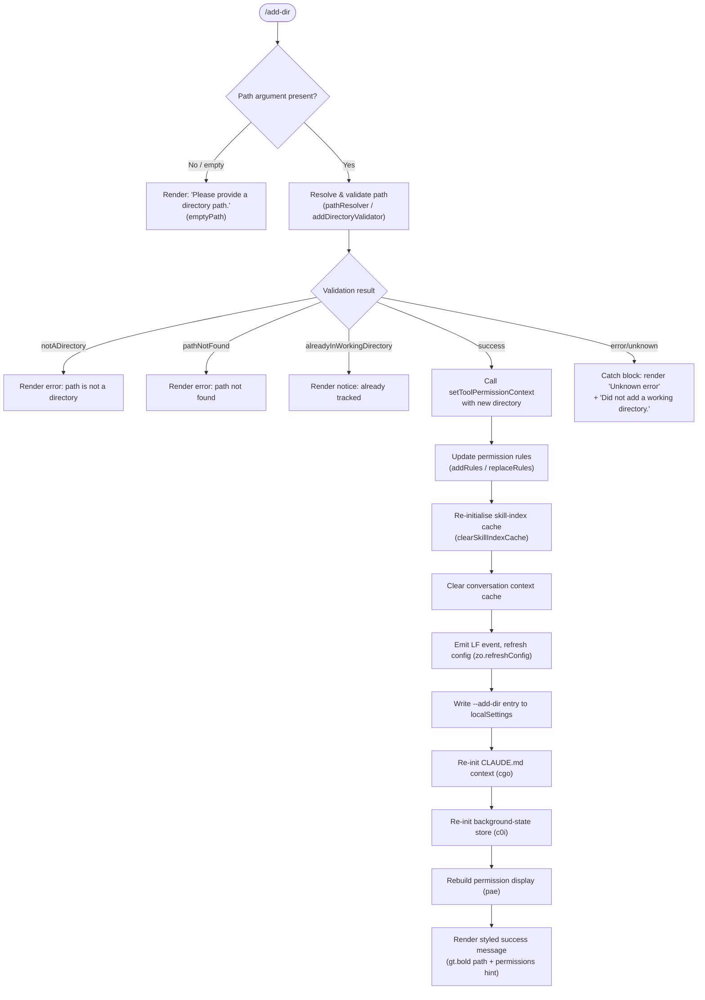

# `/add-dir`

> Analysis basis: CC v2.1.181 bundle.js (AST extraction + Claude interpretation)
> Minimum version: v2.1.181

---

## Overview

`/add-dir` registers an additional working directory with the current Claude Code session, expanding the set of paths the agent is permitted to read and write. It resolves and validates the supplied path, updates session tool-permission context, refreshes configuration, re-initialises per-directory caches (skill index, conversation context), and renders a styled confirmation or diagnostic message to the user.

---

## Registration

| Field | Value |
|---|---|
| type | `local-jsx` |
| name | `add-dir` |
| description | `Add a new working directory` |
| argumentHint | `<path>` |
| module_id | `Ztl` |
| load_inline | `true` |
| loc_byte | `11138914` |
| loc_byte_end | `11139062` |
| loc_line | `6836` |
| arbor_handler.name | `P9p` |
| arbor_handler.fqn | `claude-2.1.181::P9p` |
| arbor_handler.kind | `AsyncFunction` |
| arbor_handler.resolution_path | `module_id` |
| arbor_handler.n_hits | `0` |

Analysis basis: CC v2.1.181 bundle.js:+11138914

---

## Input Branching

The handler has more than three distinct outcome paths (empty path, not-a-directory, path-not-found, already-in-working-directory, success, unknown error), so a Mermaid flowchart is used.



Analysis basis: CC v2.1.181 bundle.js:+11137648 (handler entry `P9p`), +3947374 (`emptyPath`), +3947472 (`notADirectory`), +3947617 (`pathNotFound`), +3947742 (`alreadyInWorkingDirectory`), +3947818 (`success`), +11138375 (`Did not add a working directory.`)

---

## Behavioral Spec

### 1. Handler Entry — `addDirHandler` (`P9p`)

```
async function addDirHandler(commandInput, sessionContext):
    rawPath = commandInput.argument          // may be empty

    // Step 1: Validate and resolve the path
    validationResult = await validateAndResolvePath(rawPath)
    // returns one of: emptyPath, notADirectory, pathNotFound,
    //                 alreadyInWorkingDirectory, success

    if validationResult.kind == "emptyPath":
        render("Please provide a directory path.")
        return

    if validationResult.kind != "success":
        render(errorMessageFor(validationResult.kind))
        if validationResult.kind == "pathNotFound" or "notADirectory":
            render("Did not add a working directory.")
        return

    resolvedPath = validationResult.resolvedPath

    // Step 2: Update tool-permission context
    sessionContext.setToolPermissionContext(resolvedPath)

    // Step 3: Sync permission rules (allow/deny/always-ask)
    updatePermissionRules(sessionContext, resolvedPath)

    // Step 4: Invalidate caches
    clearSkillIndexCache(sessionContext)
    clearConversationContextCache()

    // Step 5: Emit change event, refresh global config
    eventBus.emit("LF")
    configService.refreshConfig()

    // Step 6: Persist path to localSettings as "--add-dir" entry
    persistAddDir(resolvedPath)

    // Step 7: Re-initialise CLAUDE.md / project config context
    reInitProjectContext(resolvedPath)

    // Step 8: Re-initialise background-state (MCP, daemon, etc.)
    reInitBackgroundState(resolvedPath)

    // Step 9: Rebuild permission display panel
    rebuildPermissionsDisplay(sessionContext)

    // Step 10: Render confirmation
    render(bold(resolvedPath) + "\n" + dim("· /permissions to manage"))
```

Analysis basis: CC v2.1.181 bundle.js:+11137648 (`P9p`), +11137758 (`setToolPermissionContext`), +11137790 (`Jg` — rule sync), +11137805 (`$0` — cache clear), +11137828 (`jye`), +11137842 (`mM` — skill-index invalidation), +11137847 (`IHe`), +11137853 (`t5` — context cache clear), +11137858 (`LF.emit`), +11137868 (`zo.refreshConfig`), +11137887 (`cgo` — project-context re-init), +11137894 (`c0i` — background-state re-init), +11137928 (`pae` — permission display rebuild), +11137946 (`gt.bold`), +11138232 (`gt.dim`), +11138239 (`· /permissions to manage`)

---

### 2. Path Validation — `validateAndResolvePath` (`IZe`)

```
async function validateAndResolvePath(rawPath):
    if rawPath is null or rawPath.trim() == "":
        return { kind: "emptyPath" }

    // Resolve tilde, relative segments, symlinks
    resolvedPath = pathResolver(rawPath)   // vs / OO.normalize / OO.resolve
    // Reject null bytes, validate absolute form
    // Expand "~/" using homedir()

    try:
        stats = await fs.stat(resolvedPath)
    catch ENOENT:
        return { kind: "pathNotFound" }

    if not stats.isDirectory():
        return { kind: "notADirectory" }

    currentDirs = getAppState().workingDirectories
    if resolvedPath in currentDirs:
        return { kind: "alreadyInWorkingDirectory" }

    return { kind: "success", resolvedPath }
```

Analysis basis: CC v2.1.181 bundle.js:+3947393 (`IZe`/`AEn.resolve`), +3947427 (`HIi.stat`), +3947535 (`ln` — error handler), +3947678 (`pB`), +3947702 (`Ck`), +1089542 (`TypeError`/path null-byte check), +1089783 (`e.trim`), +1089846 (`ben.homedir`), +1089939 (`Yt`/isDirectory check), +3947903 (`Please provide a directory path.`)

---

### 3. Permission Rule Synchronisation — `permissionRuleSync` (`Jg`)

```
function permissionRuleSync(sessionContext, resolvedPath):
    // Reads current allow/deny/alwaysAsk rule sets from settings layers:
    //   userSettings, projectSettings, policySettings, flagSettings
    // Applies "addRules" operation for the new directory scope
    // Applies "replaceRules" and "removeRules" where conflicts exist
    // Writes back via n.set / n.delete on the internal rule map
    // Rule categories tracked: alwaysAllowRules, alwaysDenyRules, alwaysAskRules
    // bypassPermissions mode is guarded: if disableBypassPermissionsMode is set,
    //   setMode("bypassPermissions") is silently ignored with a log entry
```

Analysis basis: CC v2.1.181 bundle.js:+5235728 (`Jg`/`I`), +5236006 (`addRules`), +5236191 (`allow`/`alwaysAllowRules`), +5236231 (`deny`/`alwaysDenyRules`), +5236256 (`alwaysAskRules`), +5236354 (`replaceRules`), +5237011 (`removeRules`), +5237395 (`removeDirectories`), +5235642 (`setMode`), +5235730 (bypass-permissions rejection log)

---

### 4. Skill-Index Cache Invalidation — `skillIndexInvalidator` (`mM`)

```
async function skillIndexInvalidator(sessionContext):
    // Resolves the skill index promise (O5)
    // Calls e.clearSkillIndexCache() on the resolved object
    // Also invokes S6n, Sel, i6e helpers to invalidate sub-caches
    // i6e delegates to P9t which reads from c4n.get / M9t
```

Analysis basis: CC v2.1.181 bundle.js:+11137842 (`mM`), +13412063 (`O5`/`Promise.resolve`), +13412115 (`e.clearSkillIndexCache`), +13412162 (`S6n`), +13412167 (`Sel`), +13412173 (`i6e`)

---

### 5. Conversation-Context Cache Clear — `contextCacheClear` (`t5`)

```
function contextCacheClear():
    O4t.clear()    // clears the in-memory conversation-context map
```

Analysis basis: CC v2.1.181 bundle.js:+11137853 (`t5`), +10955940 (`O4t.clear`)

---

### 6. Project-Context Re-Initialisation — `projectContextReInit` (`cgo`)

```
async function projectContextReInit(resolvedPath):
    // Normalises path (mH / e.normalize, NFC form)
    // Resolves real path via Ol.realpath
    // Reads CLAUDE.md files from directory hierarchy (Ol.readFile, utf8)
    // Creates .claude/ directory if absent (Ol.mkdir, mode 448 / 0o700)
    // Appends to settings.local.json (mode 384 / 0o600) via Ol.appendFile
    // Writes JW/production environment config entry
    // Handles EACCES, EPERM, ENOTDIR, ELOOP, ENAMETOOLONG, EROFS errors via ls
```

Analysis basis: CC v2.1.181 bundle.js:+11137887 (`cgo`), +13427065 (`JW`), +13427100 (`Ol.realpath`), +13427129 (`Dn`), +13427258 (`qh.join`), +13427287 (`Ol.readFile`/`utf8`), +13427452 (`Ol.mkdir`), +13427461 (`qh.dirname`), +13427494 (mode `448`), +13427603 (`Ol.appendFile`), +13427631 (mode `384`), +1310058 (`".claude"`), +1310068 (`"settings.json"`), +1310130 (`"settings.local.json"`)

---

### 7. Background-State Re-Initialisation — `backgroundStateReInit` (`c0i`)

```
async function backgroundStateReInit(sessionContext):
    // 1. Clears existing background-session state (uT / UZ.delete)
    // 2. Loads per-directory config files (fa):
    //      - lstat each file; skips non-regular files with "warn"
    //      - reads utf-8 content (cT.readFile), parses JSON (Wt/JSON.parse)
    //      - validates numeric fields with Number.isFinite
    //      - tracks "order" and "stateOrder" keys
    //      - maintains SCe (set of known paths)
    // 3. Writes updated state atomically (Fp / Ih):
    //      - pfr.randomBytes for temp-file suffix
    //      - zV.writeFile → zV.rename
    //      - preserves chmod permissions (zV.chmod)
    // 4. Merges MCP connection state (MA):
    //      - checks oPe registry
    //      - emits feature_ok / feature_bad / feature_sad telemetry
    //      - delegates to ke for connection lifecycle
```

Analysis basis: CC v2.1.181 bundle.js:+11137894 (`c0i`), +4288388 (`uT`), +4288406 (`fa`), +4284293 (`UZ.delete`), +4284360 (`order`), +4284381 (`stateOrder`), +4284433 (`cT.lstat`), +4284507 (`a.isFile`), +4284712 (`not a regular file`), +4284742 (`warn`), +4285366 (`utf-8`), +4285737 (`Number`), +4285794 (`Number.isFinite`), +4285898 (`UZ.clear`), +4288571 (`Fp`/atomic write), +4288676 (`Dn`), +4288682 (`MA`)

---

### 8. Permissions Display Rebuild — `permissionsDisplayRebuild` (`pae`)

```
function permissionsDisplayRebuild(sessionContext):
    // Reads n8r (current permission snapshot)
    // Iterates allowed/denied tool lists via I2i
    // Groups by setting source: userSettings, projectSettings, policySettings, flagSettings
    // For each rule calls ao (rule renderer):
    //   - looks up gitignore_global_rule, write_ineffective flags
    //   - resolves symlinks (lSt) and real paths (Jp)
    //   - formats entries with sm (text sanitiser) and vA (display formatter)
    //   - clears caches fH (kKt.clear / Ser.clear)
    // Filters out rules already satisfied (a.has check)
    // Renders final JSX component tree for the permission panel
```

Analysis basis: CC v2.1.181 bundle.js:+11137928 (`pae`), +5237862 (`n8r`), +5237941 (`I`), +5238231 (`I2i`), +5237804 (`userSettings`), +5237824 (`projectSettings`), +5233878 (`policySettings`), +1329256 (`flagSettings`), +1330146 (`gitignore_global_rule`), +1330287 (`write_ineffective`), +5238570 (`ao`)

---

### 9. App-State Retrieval and Context Propagation — `appStateContextPropagator` (`Pr`)

```
function appStateContextPropagator(sessionContext):
    appState = sessionContext.getAppState()
    // Searches for last working directory entry (n.findLast)
    // Reads keys: working_directory, allowed_tools, disallowed_tools,
    //             avoid_prompts, permission_mode, bypassPermissions,
    //             session, effort, model, max_thinking_tokens, flag_settings
    // Delegates to R5n (allowed-tools loader) and P5n (disallowed-tools loader),
    //   each calling ps (settings merge helper)
    // Applies rB (bypass-permissions guard): fires tengu_disable_bypass_permissions_mode
    //   if mode is "disable"
```

Analysis basis: CC v2.1.181 bundle.js:+11137648 (`Pr`), +10828379 (`e.getAppState`), +10828459 (`n.findLast`), +10828484 (`working_directory`), +10828539 (`allowed_tools`), +10828594 (`disallowed_tools`), +10828655 (`avoid_prompts`), +10828757 (`permission_mode`), +10828788 (`bypassPermissions`), +10829087 (`session`), +10829112 (`effort`), +10829125 (`model`), +10829137 (`max_thinking_tokens`), +10829163 (`flag_settings`), +10828557 (`R5n`), +10828615 (`P5n`), +10828810 (`rB`), +3382738 (`tengu_disable_bypass_permissions_mode`)

---

## State & Side Effects

| Item | Detail |
|---|---|
| Telemetry — `tengu_disable_bypass_permissions_mode` | Fired when `bypassPermissions` mode is rejected because the session was not launched in that mode or `disableBypassPermissionsMode` is set (bundle.js:+3382738) |
| Telemetry — `tengu_daemon_config_reload` | Fired when the daemon detects a config change triggered by the directory addition (bundle.js:+17117192) |
| Telemetry — `tengu_feature_ok` | MCP/background-feature connection succeeded during state re-init (bundle.js:+1019804) |
| Telemetry — `tengu_feature_bad` | MCP/background-feature connection failed (bundle.js:+1019871) |
| Telemetry — `tengu_feature_sad` | MCP/background-feature in degraded state (bundle.js:+1019952) |
| Telemetry — `tengu_daemon_control` | Daemon start/stop lifecycle event during state re-init (bundle.js:+17138162) |
| Telemetry — `tengu_bg_state_read_transient` | Background-state file read produced a transient / non-persistent entry (bundle.js:+4285153) |
| `localSettings` persistence | New directory written as `--add-dir <path>` in local settings (bundle.js:+11137898, +11137731) |
| `zo.refreshConfig` | Global configuration refreshed after directory addition (bundle.js:+11137868) |
| `LF` event emission | Internal event bus notified of working-directory change (bundle.js:+11137858) |
| `O4t` cache | Conversation-context in-memory map cleared (bundle.js:+10955940) |
| Skill-index cache | Cleared via `e.clearSkillIndexCache()` (bundle.js:+13412115) |
| `.claude/` directory | Created (mode `0o700` / `448`) if absent in new working directory (bundle.js:+13427494) |
| `settings.local.json` | Appended (mode `0o600` / `384`) inside `.claude/` (bundle.js:+13427631) |
| Background-state files | Atomically re-written with `randomBytes`-suffixed temp file, `writeFile` → `rename`, then `chmod` (bundle.js:+4288571) |
| Hook registration | `Gi` registers a hook via `v$o.register` during logger initialisation (bundle.js:+212510, +65579) |
| Sound | <!-- TODO: not found in depth-2 traversal; needs --depth 4 --> |

---

## Version History

| Version | Change |
|---|---|
| v2.1.181 | Initial analysis |

---

## Common Mistakes

1. **Passing a file path instead of a directory path** — validation returns `notADirectory` and prints an error. The argument must point to an existing directory.
2. **Passing a path that does not exist** — triggers `pathNotFound`; the path must exist on disk at the time the command is run.
3. **Re-adding an already-tracked directory** — the handler detects `alreadyInWorkingDirectory` and silently does nothing beyond showing the notice.
4. **Omitting the path argument entirely** — produces `"Please provide a directory path."` and exits immediately without modifying state.
5. **Expecting `bypassPermissions` to be auto-enabled** — if the session was not launched in bypass mode, any attempt to set `bypassPermissions` during the permission-rule sync is silently dropped and a `tengu_disable_bypass_permissions_mode` event is logged.
6. **Assuming the change is ephemeral** — the new directory is written to `localSettings` (as `--add-dir <path>`) and persists across sessions.

---

## Appendix — Identifier Mapping

> For bundle debugging only. Identifiers change across versions.

| Identifier | Role |
|---|---|
| `P9p` | Main async handler for `/add-dir` (`addDirHandler`) |
| `Pr` | App-state retrieval and context propagation |
| `R5n` | Allowed-tools loader (delegates to settings merge helper `ps`) |
| `P5n` | Disallowed-tools loader (delegates to settings merge helper `ps`) |
| `ps` | Settings merge helper used by tools loaders |
| `rB` | Bypass-permissions guard / mode enforcer |
| `ut` | Logger / output writer utility |
| `Ygn` | Logger deduplication / registry helper |
| `It` | Timestamp and event metadata builder |
| `Jg` | Permission rule synchroniser (add/replace/remove rules) |
| `I` | Shell-output formatter / escape helper |
| `xhc` | Output channel dispatcher |
| `Re` | JSON serialisation helper |
| `qc` | Path-component formatter / redactor |
| `Rhc` | File write orchestrator (atomic write pipeline) |
| `kWe` | Buffered async write scheduler |
| `Fde` | Write finaliser (joins buffers, calls `sr`/`Lt`) |
| `bre` | Error-code translator |
| `f3o` | Path join helper for write targets |
| `Sor` | File stat + rename + unlink utility |
| `Mhc` | Mkdir + appendFile + stat pipeline |
| `Gi` | Hook registrar (wraps `v$o.register`) |
| `sm` | Text sanitiser / replaceAll normaliser |
| `DYc` | String `replaceAll` wrapper |
| `YGe` | File-stat validator (checks isFile, size limit 1 048 576) |
| `oi` | Async-local-storage store reader |
| `gvo` | File-read helper (`hvo`) |
| `Ee` | String coercion wrapper |
| `bkl` | Directory listing / column-width calculator |
| `oht` | MCP connection lifecycle helper |
| `jic` | MCP client key enumerator |
| `ke` | Feature connection controller |
| `Ho` | Error/String normaliser |
| `dlc` | Heartbeat / keepalive scheduler (`Use`) |
| `mlc` | File-mtime watcher (realpath + stat + rename) |
| `F9f` | "mtime changed" event emitter (`nUn`) |
| `mM` | Skill-index cache invalidator |
| `O5` | Skill-index promise resolver |
| `i6e` | Sub-cache invalidator (delegates to `P9t`) |
| `P9t` | Per-directory cache entry accessor |
| `IHe` | Supplementary context helper (`v6n`) |
| `t5` | Conversation-context cache clearer (`O4t.clear`) |
| `cgo` | Project-context re-initialiser (reads CLAUDE.md, writes `.claude/`) |
| `JW` | Environment config writer (production/test guard) |
| `mH` | Path normaliser (NFC unicode form) |
| `Dn` | Error propagator / rethrow helper |
| `ls` | File-system error handler (EACCES, EPERM, etc.) |
| `c0i` | Background-state re-initialiser |
| `uT` | State-store delete helper |
| `fa` | Per-directory config file loader and parser |
| `DBe` | MCP connection orchestrator |
| `bQn` | MCP update applicator |
| `kOo` | MCP slot reconciler |
| `xe` | Feature-ok reporter |
| `Me` | Feature-bad reporter |
| `zU` | First-party daemon controller |
| `cG` | Daemon process exit handler |
| `kp` | Error logger for background state |
| `Wt` | JSON parse wrapper |
| `Fp` | Atomic file write coordinator |
| `Ih` | Low-level atomic write (randomBytes + writeFile + rename + chmod) |
| `MA` | MCP state merger and feature emitter |
| `pae` | Permissions display panel rebuilder |
| `I2i` | Permission rule list renderer |
| `yRt` | Policy-settings reader (`Tn`) |
| `Tn` | Settings-layer resolver |
| `evd` | Rule entry formatter |
| `ZA` | Display text builder |
| `Jp` | Real-path resolver (realpathSync) |
| `Sv` | Scope validator (`qJ`) |
| `vA` | Rule label formatter (substring / replaceAll) |
| `ek` | `Object.hasOwn` wrapper |
| `MYc` | Label replaceAll normaliser |
| `ao` | Individual rule renderer (resolves symlinks, checks gitignore, writes settings) |
| `OAr` | Glob / pattern matcher |
| `x2` | Settings-file handler factory |
| `qmr` | Rule timestamp recorder |
| `jOe` | Rule type dispatcher |
| `lSt` | Symlink-safe atomic file writer |
| `fH` | Cache-clear helper (clears `kKt` and `Ser`) |
| `NZo` | Gitignore rule writer (mkdir + readFile + appendFile + writeFile) |
| `O9` | `.claude/settings.json` path builder |
| `Ut` | Feature-sad reporter |
| `tj` | Settings-load event tracer |
| `IZe` | Path validation and resolution entry point (`addDirValidator`) |
| `vs` | Core path resolver (tilde expansion, normalise, resolve) |
| `Mt` | Context-store accessor |
| `cen` | Async-local-store reader (`len.getStore`) |
| `pB` | Post-stat directory type formatter |
| `Ck` | Platform-specific path canonicaliser (`/var/` → `/tmp`) |
| `U6e` | Yt / `$D` path helper |
| `RA` | Case-normaliser (`toLowerCase`) |
| `toe` | Remaining path canonicalisation step |
| `CZe` | Error/confirmation message renderer (bold + dirname) |

---

Note: index built via Arbor fallback; some signals (telemetry, literals) may be missing — see arbor-fallback.js.