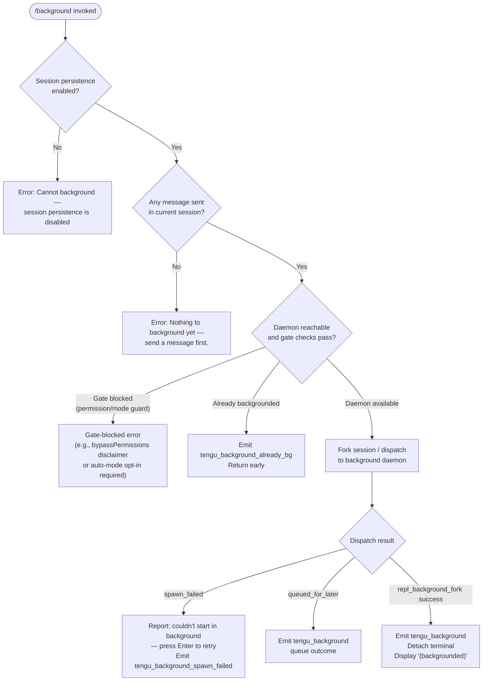

# `/background`

> Analysis basis: CC v2.1.181 bundle.js (AST extraction + Claude interpretation)
> Minimum version: v2.1.181

---

## Overview

`/background` (alias `/bg`) sends the current interactive REPL session to the Claude Code background daemon, freeing the terminal for other use. The command forks the running conversation into a persistent background job managed by the daemon process, then detaches the terminal UI. If no message has been sent yet in the current session, or if session persistence is disabled, the command refuses with an explanatory error.

---

## Registration

| Field | Value |
|---|---|
| type | `local-jsx` |
| name | `background` |
| description | `Send this session to the background and free the terminal` |
| aliases | `["bg"]` |
| argumentHint | `[prompt]` |
| immediate | `null` |
| module_id | `$Ml` |
| load_inline | `true` |
| loc_byte | `13328953` |
| loc_byte_end | `13329193` |
| loc_line | `8879` |
| arbor_handler.name | `Kff` |
| arbor_handler.fqn | `claude-2.1.181::Kff` |
| arbor_handler.kind | `AsyncFunction` |
| arbor_handler.resolution_path | `module_id` |
| arbor_handler.n_hits | `0` |

Analysis basis: CC v2.1.181 bundle.js:+13328953

---

## Input Branching

The handler has 4+ distinct branches based on pre-conditions, session state, and dispatch outcome:



Analysis basis: CC v2.1.181 bundle.js:+13328227 (handler entry `Kff`), +13328307 (persistence guard literal), +13328483 (no-message guard literal), +13324402 (`tengu_background_spawn_failed`), +13325203 (`tengu_background`), +13328241 (`tengu_background_already_bg`)

---

## Behavioral Spec

### Guard: Session Persistence Check

Before any forking logic, the handler verifies that session persistence is active. If the daemon or session storage is not configured to retain sessions, it immediately returns an error.

```
function checkPersistenceGuard(sessionContext):
    if sessionContext.persistenceDisabled:
        raise UserError(
            "Cannot background — session persistence is disabled, " +
            "so the forked job would have nothing to resume."
        )
```

Analysis basis: CC v2.1.181 bundle.js:+13328307

---

### Guard: Message Existence Check

The command verifies the current session has at least one user message. Backgrounding an empty session has no useful meaning.

```
function checkMessageExists(sessionContext):
    if sessionContext.messages is empty:
        raise UserError("Nothing to background yet — send a message first.")
```

Analysis basis: CC v2.1.181 bundle.js:+13328483

---

### Guard: Already-Backgrounded Detection

If the session is already running as a background job, the handler emits a telemetry event (`tengu_background_already_bg`) and returns without further action.

```
function checkAlreadyBackgrounded(sessionContext):
    if sessionContext.isBackgroundSession:
        emit("tengu_background_already_bg")
        return early
```

Analysis basis: CC v2.1.181 bundle.js:+13328241

---

### Permission / Mode Gate

The handler invokes gate-check logic (via the `qff` / `Nff` call path) that enforces two pre-conditions before background dispatch is permitted:

1. **bypassPermissions gate**: If the session would use `--dangerously-skip-permissions`, the user must have previously accepted the disclaimer interactively (by running `claude --dangerously-skip-permissions` once in foreground mode). Violation produces: `"--bg with bypassPermissions requires accepting the disclaimer first. Run 'claude --dangerously-skip-permissions' once interactively."` (Analysis basis: CC v2.1.181 bundle.js:+13321863)

2. **Auto-mode gate**: If `--permission-mode auto` is active, the user must have opted in interactively first. Violation produces: `"--bg with auto mode requires opting in first. Run 'claude --permission-mode auto' once interactively."` (Analysis basis: CC v2.1.181 bundle.js:+13322025)

3. **Cloud/remote conflict**: If `--cloud` or `--remote` flags were present, the command aborts with: `"--bg and --cloud are different backends. Use 'claude --cloud '<task>'' directly to start a cloud session."` (Analysis basis: CC v2.1.181 bundle.js:+13267068)

```
function enforcePermissionGates(parsedArgs, settings):
    if parsedArgs.includes("--cloud") or parsedArgs.includes("--remote"):
        raise UserError("--bg and --cloud are different backends. ...")
    if settings.bypassPermissions and not settings.bypassDisclaimerAccepted:
        raise UserError("--bg with bypassPermissions requires ...")
    if settings.permissionMode == "auto" and not settings.autoModeOptedIn:
        raise UserError("--bg with auto mode requires ...")
```

Analysis basis: CC v2.1.181 bundle.js:+13267068, +13321863, +13322025

---

### Argument Forwarding

The handler assembles a CLI argument vector for the background job that forwards key flags from the current session. Observed forwarded flags include:

| Flag | Purpose |
|---|---|
| `--resume` | Resume the forked session ID |
| `--fork-session` | Marks job as a fork of the originating session |
| `--reply-on-resume` | Carry the optional prompt argument into the resumed session |
| `--add-dir` | Forwarded working directories |
| `--allowed-tools` | Allowed tool set |
| `--disallowed-tools` | Disallowed tool set |
| `--model` | Model selection |
| `--effort` | Effort level |
| `--permission-mode` | Permission mode |
| `--agent` | Agent name |
| `--name` / `-n` | Session name |
| `--continue` / `-c` | Continue flag |

Analysis basis: CC v2.1.181 bundle.js:+13323758 (`--resume`), +13323771 (`--fork-session`), +13323813 (`--reply-on-resume`), +13323865 (`--add-dir`), +13323900 (`--allowed-tools`), +13323941 (`--disallowed-tools`), +13323972 (`--model`), +13324001 (`--effort`), +13324018 (`--permission-mode`)

---

### Daemon Ensure Running

Before dispatching, the handler calls into the daemon-ensure subsystem (`X6` / `uwo` call path) to start or locate the daemon process.

```
async function ensureDaemonRunning(context):
    daemonStatus = await checkDaemonStatus()
    if daemonStatus == "up":
        return daemonSocket
    else:
        attempt to spawn daemon (transient or service)
        if spawn fails:
            emit("tengu_bg_daemon_spawn_failed")
            raise error with human-readable reason
        wait for daemon to become reachable (timeout: 5000 ms)
        return daemonSocket
```

Key daemon-status outcomes and their telemetry:

| Status | Telemetry Event | loc_byte |
|---|---|---|
| Daemon already running | `tengu_bg_daemon_service_stale_exec` (stale exec path) | +13257030 |
| Daemon spawn failed | `tengu_bg_daemon_spawn_failed` | +13258549 |
| Transient daemon unreachable | `tengu_bg_dispatch_fallback` | +13299376 |
| Cold-start prompted user | `tengu_bg_daemon_cold_start_ask` | +13257978 |
| User answered cold-start prompt | `tengu_bg_daemon_cold_start_ask_answer` | +13264706 |

The cold-start prompt text is: `"Install as a service now? [y/N/never, or 'once' just for now] "` (Analysis basis: CC v2.1.181 bundle.js:+13264631)

---

### Flush Timeout

Before dispatching the background job, the handler waits briefly for in-flight data to flush. A timeout of **2000 ms** is applied; if exceeded, the condition is labeled `"flush timeout"`.

```
async function flushWithTimeout(session):
    result = await Promise.race([
        flushSession(session),
        timeout(2000)
    ])
    if result == "timeout":
        log("flush timeout")
```

Analysis basis: CC v2.1.181 bundle.js:+13323702 (value `2000`), +13323707 (literal `"flush timeout"`)

---

### Background Dispatch

The core dispatch (`uwo` / `bKn` path) serializes the session state to a dispatch file, connects to the daemon's control socket, and transmits the job request.

```
async function dispatchBackgroundJob(args, sessionState):
    jobId = generateUUID()
    dispatchFile = writeTempDispatchFile(sessionState, args)
    
    socket = await connectToDaemon(daemonSocketPath, timeout=6000)
    
    response = await sendDispatch(socket, {
        type: "dispatch",
        jobId: jobId,
        args: args,
        dispatchFile: dispatchFile
    })
    
    emit("tengu_bg_dispatch", { jobId, outcome: response.status })
    return response
```

Dispatch error codes observed in literals:

| Code | Meaning |
|---|---|
| `"daemon-unreachable"` | Daemon socket not found |
| `"ack-timeout"` | No acknowledgement received |
| `"dispatch-write"` | Could not write dispatch file |
| `"enoconn"` | Socket missing |
| `"estarting"` | Service still starting |
| `"stale-short"` | Previous session still shutting down |
| `"short-alive"` | Session alive but too short-lived |

Analysis basis: CC v2.1.181 bundle.js:+13299445–+13299659, +13298846 (`tengu_bg_dispatch`), +13299376 (`tengu_bg_dispatch_fallback`)

---

### Post-Dispatch UI Update

On successful dispatch, the handler:

1. Emits `tengu_background` telemetry.
2. Updates the REPL title/label to show `"(backgrounded)"`.
3. Triggers the terminal-detach sequence (`xHe` → `"detach-request"` message to the daemon worker).
4. Renders a JSX confirmation element via `__e.createElement`.

```
function onDispatchSuccess(jobId, sessionId):
    emit("tengu_background")
    updateSessionLabel("(backgrounded)")
    sendToWorker({ type: "detach-request" })
    renderJSX(BackgroundConfirmationComponent)
```

Analysis basis: CC v2.1.181 bundle.js:+13325203 (`tengu_background`), +13325938 (literal `"(backgrounded)"`), +11234145 (literal `"detach-request"`), +13328553 (`__e.createElement`)

---

### Spawn-Failed Recovery UI

When the background spawn fails, the handler displays a retry prompt: `"couldn't start in the background — press Enter to retry"` and emits `tengu_background_spawn_failed`.

```
function onSpawnFailed(error):
    emit("tengu_background_spawn_failed")
    displayRetryPrompt("couldn't start in the background — press Enter to retry")
```

Analysis basis: CC v2.1.181 bundle.js:+13324402 (`tengu_background_spawn_failed`), +13324765 (retry literal)

---

### Tmux / Child Session Detection

The environment is checked for `CLAUDE_CODE_CHILD_SESSION` (via `qku` → `qw` / tmux check path) to detect if Claude Code is already running inside a managed multiplexer context. This affects how the detach sequence is performed.

Analysis basis: CC v2.1.181 bundle.js:+13426866 (`i9` node), +2297975 (literal `"CLAUDE_CODE_CHILD_SESSION"`), +2297943 (literal `"tmux"`)

---

## State & Side Effects

| Item | Detail |
|---|---|
| Telemetry: `tengu_background` | Emitted on every successful background dispatch (bundle.js:+13325203) |
| Telemetry: `tengu_background_already_bg` | Emitted when session is already a background job (bundle.js:+13328241) |
| Telemetry: `tengu_background_spawn_failed` | Emitted when daemon spawn or dispatch fails (bundle.js:+13324402) |
| Telemetry: `tengu_bg_dispatch` | Emitted by core dispatch subsystem (bundle.js:+13298846) |
| Telemetry: `tengu_bg_dispatch_fallback` | Emitted when daemon is transient/unreachable (bundle.js:+13299376) |
| Telemetry: `tengu_bg_daemon_spawn_failed` | Emitted when daemon process cannot be started (bundle.js:+13258549) |
| Telemetry: `tengu_bg_daemon_cold_start_ask` | Emitted when user is prompted to install daemon service (bundle.js:+13257978) |
| Telemetry: `tengu_bg_daemon_cold_start_ask_answer` | Emitted with user's answer to the cold-start prompt (bundle.js:+13264706) |
| Telemetry: `tengu_bg_dispatch_rescued` | Emitted if dispatch recovers after transient failure (bundle.js:+13305911) |
| Telemetry: `tengu_rename_full_session_fork` | Emitted during session fork/rename (bundle.js:+12266921) |
| appState changes | Session label updated to `"(backgrounded)"`; REPL exits interactive mode |
| Daemon side-effect | Daemon process is started (transient or service) if not already running |
| Dispatch file | Temporary dispatch file written to daemon temp directory; cleaned up by daemon |
| Terminal | Detach sequence sent via `"detach-request"` message; terminal freed |
| MCP connections | MCP server connections are transferred to the background job via the daemon's connection-management subsystem |
| Hook registration | No slash-command-specific hooks observed; daemon event loop registers process exit handlers |
| Sound | None observed |

---

## Version History

| Version | Change |
|---|---|
| v2.1.181 | Initial analysis |

---

## Common Mistakes

1. **Running `/background` before sending any message** — the command will immediately reject with `"Nothing to background yet — send a message first."` Send at least one message to the model before attempting to background the session.

2. **Using `/background` with `--dangerously-skip-permissions` without prior interactive acceptance** — the gate check will fail. Run `claude --dangerously-skip-permissions` in a foreground session first to accept the disclaimer.

3. **Confusing `/background` with `--cloud` or `--remote` flags** — these are incompatible backends. Use `claude --cloud '<task>'` directly to start a cloud session instead.

4. **Expecting `/background` to work without daemon infrastructure** — if no daemon is installed or running, the command will prompt to install one (`"Install as a service now? [y/N/never, or 'once' just for now]"`). Answering `"no"` or `"never"` without installing the service means background sessions require a transient daemon per invocation.

5. **Using `/background` in a session that already has `--permission-mode auto` without prior opt-in** — the auto-mode gate requires one interactive `claude --permission-mode auto` run to opt in. The error message will explain this explicitly.

6. **Alias confusion** — `/bg` is the registered alias and is fully equivalent to `/background`. Both forms accept an optional `[prompt]` argument that is forwarded as `--reply-on-resume` to the resumed session.

---

## Appendix — Identifier Mapping

> For bundle debugging only. Identifiers change across versions.

| Identifier | Role |
|---|---|
| `Kff` | Main async handler for `/background` command (arbor_handler) |
| `bKn` | Primary background-dispatch orchestration function (call graph root) |
| `S_` | Session enumeration / values helper |
| `Ps` | Process-exit / CLI error emitter |
| `dA` | Session state accessor |
| `ywo` | Signal/hook registration helper |
| `Au` | Hook/register abstraction |
| `Gi` | Signal/event registration (`v$o.register` caller) |
| `lu` | Flush-with-timeout implementation (2000 ms timeout) |
| `eD` | Additional hook/registration path |
| `kRe` | Argument-parsing helper for background flags |
| `p` | Forced-shutdown / abort path (`process.exit` caller) |
| `BT` | "Forced shutdown" label constant site |
| `u` | Abort/kill orchestration for background session |
| `xe` | Feature-ok telemetry emitter (`tengu_feature_ok`) |
| `Me` | Feature-bad telemetry emitter (`tengu_feature_bad`) |
| `zU` | Daemon stop controller (`tengu_daemon_control`) |
| `d4` | Daemon stop sub-helper |
| `q1r` | First-party daemon event emitter (UUID generator path) |
| `cG` | Graceful-exit / `process.exit` orchestrator (500 ms timeout) |
| `dme` | MCP shutdown helper (`ume.shutdown`) |
| `_me` | Timeout-clear helper |
| `Fn` | Timeout-with-unref utility |
| `h` | MCP reconnection / setTimeout path |
| `a` | MCP server management loop |
| `DBe` | MCP connection driver (stdio/sse/http/ws-ide) |
| `z8` | MCP connection builder |
| `Pk` | MCP client factory |
| `qn` | Queue/task helper |
| `Jta` | MCP connection result recorder |
| `zAn` | MCP state accessor |
| `qAn` | MCP state writer |
| `sn` | MCP debug logger (`jJ.logMCPDebug`) |
| `yLn` | MCP OAuth flow handler |
| `ELn` | MCP OAuth callback handler |
| `ana` | MCP reconnect-after-auth helper |
| `WVr` | MCP tool-listing helper |
| `gP` | MCP skills telemetry (`tengu_mcp_skills`) |
| `wVr` | MCP inclusion filter |
| `w` | Background-session blur/focus tracker |
| `Du` | MCP error logger (`jJ.logMCPError`) |
| `Ee` | String coercion helper |
| `bQn` | MCP update applier (`e.applyMcpUpdate`) |
| `kBe` | MCP server state helper |
| `kL` | MCP cleanup orchestrator |
| `I` | Context/environment builder |
| `xhc` | Context detail builder |
| `Re` | JSON stringify wrapper |
| `qc` | Path utility helper |
| `nqe` | Query-string builder |
| `Rhc` | CLAUDE_SECURESTORAGE_CONFIG_DIR / config path resolver |
| `l` | Background session context loader (`cxl`) |
| `cxl` | Session context timestamp logger |
| `kOo` | MCP client polling / retry helper |
| `sLn` | MCP filter set (vFd/NVr) |
| `Xrt` | MCP server config watcher |
| `g` | Daemon socket stream reader |
| `sf` | Socket end/Re helper |
| `y9f` | Daemon protocol message handler (core daemon RPC dispatcher) |
| `Wt` | JSON parse wrapper |
| `E9f` | Daemon internal event |
| `c` | Daemon write stream |
| `bn` | Background-session label constant (`"background session"`) |
| `w_` | Daemon state writer (`ZTe` caller) |
| `ZTe` | Daemon state persistence (`ut` caller) |
| `M1o` | Daemon message-map accessor |
| `qac` | Daemon connection retry/dedup logic (30 s timeout, 25 retries) |
| `ke` | Telemetry dispatcher (`jJ.logError`, `QVe.push`) |
| `zte` | Timing-safe-equal (daemon control key auth) |
| `H` | Terminal repaint coordinator |
| `t4e` | Teammate mailbox / mark-as-read subsystem |
| `fa` | File-state reader (lstat/readFile/UZ cache) |
| `d` | Supervisor write handler |
| `Dn` | Logger (`ln` caller) |
| `kp` | Logger helper (`ln` caller) |
| `Tc` | Jobs directory path builder |
| `vk` | Jobs path helper |
| `eoe` | Session-file scanner (link scan, project dir) |
| `US` | Realpath resolver |
| `jy` | Invalid-resume-id detector |
| `v2` | Session path builder |
| `tL` | Directory reader for session links |
| `QVc` | Session file reader (lstat/open/readline) |
| `lKn` | Background attach upgrade dispatcher (`tengu_bg_attach_upgrade`) |
| `ut` | Background state writer (tx/nxt/p4) |
| `H9f` | Attach-stall timing helper (`tengu_bg_attach_stall_ms`) |
| `D` | Daemon write-with-clear-timeout helper |
| `R` | Interval holder |
| `v` | Daemon internal state variable |
| `Vce` | Daemon state notifier |
| `_9f` | Daemon respawn/cleanup helper |
| `L` | Background sweep loop (memory, retire, prewarm) |
| `W` | Scheduled-task / grace-clock manager |
| `k` | Daemon write helper |
| `Ujt` | Memory/free-mem checker (`QDl.freemem`) |
| `ZDl` | Daemon state persistence path |
| `H$e` | File-state cleanup helper (lstat/rm/readFile) |
| `$` | Worker set |
| `q` | Worker queue |
| `K` | Key-handler (backspace prevention in background context) |
| `X` | MCP session-list holder |
| `_` | MCP session-run orchestrator |
| `Y` | Recording / voice-toggle holder |
| `Q` | Queue write helper (t6t/jal) |
| `y` | Session event stream holder |
| `oht` | Dynamic MCP session handler |
| `B` | Daemon idle-exit timer |
| `F` | Permission classifier (deny/classify/ask) |
| `Clt` | OS notification / permission-context helper |
| `YW` | Permission UI (du/Sot/gb/rt) |
| `b9f` | Output replace/include helper |
| `V` | Multiplexed write helper |
| `oVt` | Socket destroy/write/Re helper |
| `gHn` | Config-loading gate (`It` caller) |
| `It` | Config initializer (jt/Sx/p0o/w_e) |
| `jt` | Config path resolver |
| `p0o` | Config initializer helper |
| `w_e` | Config file reader (readFileSync/statSync/mkdirSync) |
| `x9` | startsWith/slice string helper |
| `ln` | Logger |
| `uUl` | Config directory enumerator (readdirStringSync) |
| `h0o` | Config path joiner |
| `f` | Daemon worker process manager (spawn/kill/retire) |
| `Byf` | File watcher (`Zzn.watchFile`) |
| `kq` | Watch-key helper |
| `SX` | Session-fork/background job creator (UUID, mkdir, Nff) |
| `qff` | Argument parser for background dispatch |
| `Tmt` | Argument pre-processor |
| `Cq` | Argument accumulator |
| `Kvo` | Cloud/remote flag detector |
| `Vvo` | Additional flag validator |
| `_Kn` | Flag parser segment |
| `ZDe` | Argument push helper |
| `k2` | Settings loader (Tn) |
| `Tn` | Settings reader (userSettings/localSettings/flagSettings/policySettings) |
| `N9` | Post-parse validator |
| `Nff` | Full background session setup (worktree, git, MCP, dispatch) |
| `RMl` | Resume-flag parser |
| `Dne` | startsWith guard |
| `Vff` | Continue-flag parser |
| `yKn` | Session-id flag parser |
| `NMl` | Additional flag handler |
| `ECe` | Tool-allow/deny list parser |
| `Sfd` | Allowed-tools set builder |
| `OMl` | Disallowed-tools parser |
| `Mt` | Context-store accessor (`cen`) |
| `cen` | AsyncLocalStorage getter |
| `gr` | Telemetry helper (`fx`) |
| `$z` | Path-normalization (UNC, `\\?\`) |
| `iet` | Path validator |
| `obn` | startsWith checker |
| `sC` | Path resolver (`qRe`) |
| `E` | Window-size min/max helper |
| `qRe` | UNC/Windows path handler |
| `T$o` | Path includes checker |
| `Unr` | Path slice/startsWith |
| `_d` | Path helper |
| `XA` | Path helper |
| `Fp` | File-permission setter (Ih, ub.join, Re, uT) |
| `Ih` | Atomic file writer (randomBytes/writeFile/rename) |
| `uT` | Cache delete helper |
| `Lie` | Working-directory label builder |
| `TMl` | Tool-map builder |
| `Off` | Yt/Aen git-bash check |
| `Aen` | Git-bash availability check |
| `PMl` | Permission-mode flag parser |
| `uwo` | Background dispatch orchestrator (daemon socket, dispatch file, retry) |
| `Njt` | Dispatch file writer |
| `X6` | Daemon-ensure-running function (`tengu_bg_daemon_cold_start_ask`) |
| `lwo` | Dispatch error message builder |
| `Tjn` | Daemon socket connector (bjn.connect, setTimeout) |
| `aGe` | Socket path builder (Gh.join) |
| `vy` | Control socket writer/reader |
| `nue` | Socket file checker (gS.lstat) |
| `CMl` | Dispatch-status mapper |
| `Z_` | Short-alive / stale-short handler |
| `Fff` | Dispatch-failed reporter |
| `Fse` | Daemon state helper (`fme`) |
| `fme` | Amber-anchor telemetry emitter (`tengu_amber_anchor`) |
| `AJ` | Cleanup helper |
| `o2` | Background UI state writer |
| `Qot` | UI queue helper |
| `yLe` | UI render helper |
| `Ut` | Feature-sad telemetry emitter (`tengu_feature_sad`) |
| `mft` | Main background query loop (API call, streaming, session rename) |
| `OAo` | Main API orchestrator (Ns/agt) |
| `Ns` | Model-name normalizer (gs/Ug) |
| `xK` | Session/auth builder (S_/CG/es/Tl) |
| `gs` | Model alias resolver (sonnet/haiku/opus/best/fable etc.) |
| `Ug` | Model selector (gs/lL) |
| `agt` | API gateway target |
| `rJp` | Streaming request handler (Vx, Pn, Hhl) |
| `Wae` | Pre-request hook (Ns) |
| `Vx` | Stream event dispatcher |
| `B$n` | App-state getter/setter |
| `G$n` | State transition helper |
| `gF` | Request-ID generator (randomBytes/replace) |
| `uce` | Upstream connection helper (`Au`, `w6e`) |
| `h6` | Sub-agent exit handler (`tengu_forked_agent_default_turns_exceeded`) |
| `N0` | Telemetry counter |
| `l4e` | Message-type filter (tombstone/tool_use_summary etc.) |
| `Xte` | Stream-event helper |
| `O5n` | Stream state helper |
| `oMa` | Stream message filter |
| `Lge` | Tool-listing filter (LT/Ghp) |
| `h2p` | Fork-agent query (`tengu_fork_agent_query`) |
| `Pn` | Session-context builder (randomUUID) |
| `Hhl` | Response text trimmer (Fa/w2) |
| `w2` | Trim helper |
| `rWn` | Message assembler (Array.isArray, join) |
| `c4e` | Message-type constant |
| `ZF` | Session-state serializer (jc/X5n/Pn/$Ge) |
| `jc` | JSON schema helper |
| `X5n` | Message content serializer (sha1, readFile, writeFile) |
| `Y5n` | Content-type helper |
| `IL` | Full message-list serializer (100+ fields) |
| `Q2p` | Content-block mapper |
| `rZa` | Encoding helper |
| `$Ge` | Background query invoker (JAo/_1l) |
| `JAo` | Agent-listing helper (Y5n/X5n) |
| `_1l` | Core query execution engine (massive function — tool dispatch, streaming, retries) |
| `mx` | Event-emitter helper (`fx`) |
| `fx` | Low-level event bus |
| `EC` | API client constructor (xr/qu/evr/Ns/sfe) |
| `xr` | Request runner (`rt`) |
| `qu` | Queue runner (`dln`) |
| `evr` | Auth-type detector (sk-ant- / managed key) |
| `sfe` | SSE parser (`JCr`) |
| `T1` | Streaming transport |
| `_m` | Logger (`Lt`) |
| `Lt` | Low-level logger (`fx`) |
| `$c` | Filter helper |
| `CH` | Compact-boundary handler (`rGn`) |
| `rGn` | Compact boundary resolver (`LT`) |
| `LT` | Layout/text helper |
| `TCe` | File-cache manager (Tc/fa/uT/Fp/Dn/MA) |
| `MA` | File-access validator (ln/oPe.has/I/Ee/ke) |
| `TKn` | JSX response renderer (B8/Cmt/MP/Mce/mh/sq/Lt) |
| `B8` | Array-check helper |
| `Cmt` | Content-type matcher |
| `MP` | Message-part renderer (vY) |
| `vY` | Array/filter renderer |
| `Mce` | startsWith renderer |
| `mh` | Render helper (Lt/Au) |
| `sq` | Render helper (Lt/Au) |
| `Kff` | **Top-level `/background` async handler** (arbor primary) |
| `Ci` | Worker-context accessor (`G1e`) |
| `G1e` | Worker context singleton |
| `xHe` | Detach-request sender (`fun`/`Xrl`/`x6`/`Vce`) |
| `fun` | Worker message sender |
| `Xrl` | Worker channel (h5n/bn) |
| `h5n` | Worker channel helper |
| `x6` | Yte write + Re helper (sends `"detach-request"`) |
| `JW` | Environment/production check (rt/FRl/i9/$1e) |
| `rt` | String coercer |
| `FRl` | Flag reader |
| `i9` | Tmux/child-session detector |
| `$1e` | Tmux session checker (qw/ym/Wku) |
| `qw` | Store getter helper |
| `ym` | wx wrapper |
| `wx` | AsyncLocalStorage store getter |
| `Wku` | Tmux spawner (qku) |
| `qku` | Tmux spawnSync (N2s.spawnSync / CLAUDE_CODE_CHILD_SESSION) |