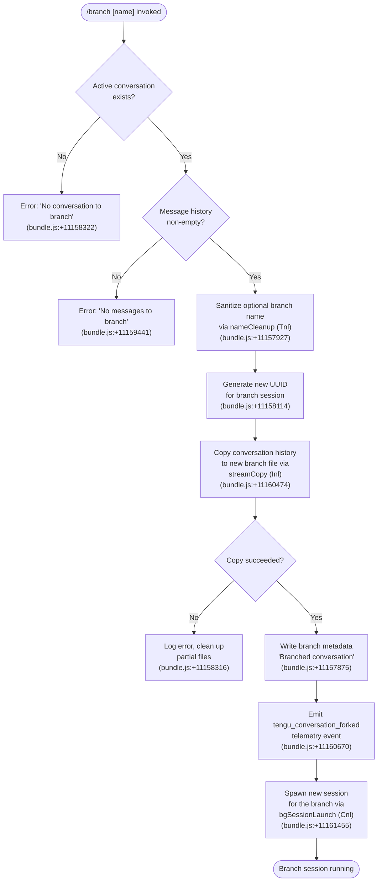

# `/branch`

> Analysis basis: CC v2.1.181 bundle.js (AST extraction + Claude interpretation)
> Minimum version: v2.1.181

---

## Overview

The `/branch` command forks the current conversation at its present point, creating a new independent conversation branch that begins with an identical copy of the message history up to that moment. It optionally accepts a user-supplied name for the new branch, and then spawns a fresh Claude Code session rooted at the forked conversation state.

---

## Registration

| Field | Value |
|---|---|
| type | `local-jsx` |
| name | `branch` |
| description | `Create a branch of the current conversation at this point` |
| argumentHint | `[name]` |
| module_id | `Ago` |
| load_inline | `true` |
| loc_byte | `12739726` |
| loc_byte_end | `12739903` |
| loc_line | `8369` |
| arbor_handler.name | `Q9p` |
| arbor_handler.fqn | `claude-2.1.181::Q9p` |
| arbor_handler.kind | `AsyncFunction` |
| arbor_handler.resolution_path | `module_id` |
| arbor_handler.n_hits | `0` |

Analysis basis: CC v2.1.181 bundle.js:+12739726

---

## Input Branching

The command exhibits four distinct paths depending on session state and whether the conversation has any messages. A Mermaid flowchart is required.



---

## Behavioral Spec

### Top-Level Handler: `branchCommandHandler` (Q9p)

The Arbor-resolved handler is the async function `Q9p`. It orchestrates branch creation end-to-end.

```
async function branchCommandHandler(context, args):
    optionalName = args.trim()  // optional user-supplied label

    // 1. Resolve current conversation
    session = getCurrentSession(context)
    if session is null:
        displayError("No conversation to branch")
        return

    // 2. Validate message history
    messages = session.getMessages()
    if messages is empty:
        displayError("No messages to branch")
        return

    // 3. Sanitize branch name
    cleanName = sanitizeBranchName(optionalName)
    //   → nameCleanup (Tnl): find/replace pass strips unsafe chars

    // 4. Create branch identity
    branchId = crypto.randomUUID()     // Enl.randomUUID (bundle.js:+11158114)
    branchPath = buildBranchPath(branchId)

    // 5. Stream-copy conversation file into new branch
    result = await streamCopyConversation(session, branchPath)  // Inl
    if result is error:
        if error.code == "ENOENT":
            displayError("No conversation to branch")
        else:
            logError(result)
        cleanupPartialFiles(branchPath)
        return

    // 6. Write branch metadata header
    writeBranchMetadata(branchPath, {
        title: "Branched conversation",   // bundle.js:+11157875
        type: "text",                      // bundle.js:+11157948
        name: cleanName or auto-generated
    })

    // 7. Mark fork type
    setForkType("fork")   // bundle.js:+11161191

    // 8. Fire telemetry
    emit("tengu_conversation_forked")   // bundle.js:+11160670

    // 9. Launch background session for the new branch
    await launchBranchSession(context, branchId)  // Cnl

    return
```

Analysis basis: CC v2.1.181 bundle.js:+11161455

---

### Branch Name Sanitization: `nameCleanup` (Tnl)

```
function nameCleanup(rawName):
    // Find disallowed characters via pattern match (t.find)
    // Replace them with safe equivalents (n.replace)
    // bundle.js:+11157927, +11158005
    return sanitizedName
```

Analysis basis: CC v2.1.181 bundle.js:+11157927

---

### Conversation Stream Copy: `streamCopyConversation` (Inl)

This is the core I/O function that duplicates the conversation file into a new branch file.

```
async function streamCopyConversation(session, branchPath):
    // Ensure parent directory exists
    fs.mkdir(branchPath.dir, { recursive: true })  // eGn.mkdir, bundle.js:+11158176

    // Open read stream from source conversation (448-byte header block read)
    readStream = fs.createReadStream(session.filePath, {
        highWaterMark: 448   // bundle.js:+11158207
    })

    // Open write stream to destination
    writeStream = fs.createWriteStream(branchPath.full)  // bundle.js:+11158371

    // Write initial 100-byte metadata prefix if applicable
    // (literal 100 at bundle.js:+11158042)

    // Pipe with backpressure ('drain' event, bundle.js:+11158682)
    readStream.pipe(writeStream)

    // Handle 'open' event on readStream before data flows
    // (literal "open", bundle.js:+11158284)

    // On error: emit error, clean up
    //   - destroy read stream (c.destroy, bundle.js:+11158567)
    //   - unlink partial dest file (eGn.unlink, bundle.js:+11158585)

    // Apply content-replacement pass on copied lines
    // (literal "content-replacement", bundle.js:+11158802)

    // Finalize with stream.finished (bnl.finished, bundle.js:+11159851)
    await streamFinished(writeStream)

    return { success: true }
```

Analysis basis: CC v2.1.181 bundle.js:+11158176

---

### Background Session Launch: `bgSessionLaunch` (Cnl)

Called after the branch file is ready. Spins up the new Claude Code session that will serve the branch.

```
async function bgSessionLaunch(context, branchId):
    // Resolve path helpers (Lt, bundle.js:+11160366)
    branchFilePath = resolveConversationPath(branchId)  // mh

    // Load existing branch data from copied file (Inl, bundle.js:+11160474)
    branchData = await loadBranchFile(branchFilePath)

    // Validate entries; find entry for this branch (l.find, bundle.js:+11160537)
    entry = branchData.find(e => e.id == branchId)

    // Build session options (J9p, bundle.js:+11160606)
    options = buildSessionOptions(entry)

    // Determine branch title mode ("auto", bundle.js:+11160624)
    titleMode = "auto"

    // Apply session rename tracking (L6, bundle.js:+11160637)
    trackSessionTitle(branchId, titleMode)   // emits tengu_session_renamed

    // Apply agent name if set (y6e, bundle.js:+11160655)
    applyAgentName(branchId)                 // emits tengu_agent_name_set

    // Record ISO timestamp for branch creation
    createdAt = new Date().toISOString()  // u.toISOString, bundle.js:+11160760

    // Resume the new session stream (e.resume, bundle.js:+11161178)
    session.resume()

    // Spawn child process via daemon (Dq.spawn, bundle.js:+17103076)
    await spawnSession(branchId, options)
```

Analysis basis: CC v2.1.181 bundle.js:+11160474

---

### Session Options Builder: `buildSessionOptions` (J9p)

```
function buildSessionOptions(entry):
    // Normalize entry ID (j0: e.replace, bundle.js:+11160144)
    normalizedId = normalizeId(entry.id)

    // Track seen IDs in a set (o.add/o.has, bundle.js:+11160238, +11160291)
    if seenIds.has(normalizedId):
        return cached options

    // Parse integer fields (parseInt, bundle.js:+11160244)
    options = {
        id: normalizedId,
        ...parsedFields
    }
    seenIds.add(normalizedId)
    return options
```

Analysis basis: CC v2.1.181 bundle.js:+11160144

---

## State & Side Effects

| Item | Detail |
|---|---|
| Telemetry — `tengu_conversation_forked` | Fired when fork completes successfully (bundle.js:+11160670) |
| Telemetry — `tengu_session_renamed` | Fired when the new branch session's title is set (bundle.js:+13462021) |
| Telemetry — `tengu_agent_name_set` | Fired when an agent name is applied to the new branch (bundle.js:+13465558) |
| Telemetry — `tengu_bg_dispatch_sigkill_escalate` | May fire if background process escalation occurs during session spawn (bundle.js:+17101321) |
| Telemetry — `tengu_bg_spare_claim` | Fires when a spare background session slot is claimed (bundle.js:+17102747) |
| Telemetry — `tengu_bg_spare_enable` | Fires when spare session mode is enabled (bundle.js:+17102619) |
| Telemetry — `tengu_bg_sendclaim_failed` | Fires if the IPC claim message fails (bundle.js:+17077853) |
| Telemetry — `tengu_daemon_config_reload` | Fires if daemon config is reloaded during session init (bundle.js:+17117192) |
| File system — branch conversation file | Created at a new UUID-keyed path under the `.claude` directory (bundle.js:+11158176) |
| File system — metadata header | `"Branched conversation"` title written into the new file (bundle.js:+11157875) |
| File system — cleanup on error | Partial files unlinked on copy failure (bundle.js:+11158585) |
| Fork type marker | Set to `"fork"` in session metadata (bundle.js:+11161191) |
| Background session | A new Claude Code daemon session is spawned for the branch (bundle.js:+17103076) |
| Sound | Not found in depth-2 traversal |
| appState changes | The new session is registered in the background session roster (`t.rosterEntry`, bundle.js:+17108926) |

---

## Version History

| Version | Change |
|---|---|
| v2.1.181 | Initial analysis |

---

## Common Mistakes

1. **Invoking `/branch` with no active conversation** — If Claude Code has not yet loaded any conversation (e.g., immediately on startup before any messages), the command exits early with `"No conversation to branch"` and no branch is created.
2. **Invoking `/branch` in an empty conversation** — Even with an active session, if no messages have been exchanged yet, the command exits with `"No messages to branch"` (bundle.js:+11159441). At least one message must exist.
3. **Expecting synchronous completion** — The handler is async and spawns a background daemon process; the new branch session may not be immediately interactive. The caller should wait for the background session to signal readiness.
4. **Special characters in the branch name** — The `nameCleanup` function (Tnl) strips or replaces characters that are unsafe for file paths. Supplying names with slashes, null bytes, or other special characters will result in a sanitized (possibly shortened or altered) name silently.
5. **Disk errors during copy** — If the destination directory cannot be created or the source file is missing (`ENOENT`), the command fails silently from the user's perspective without creating a branch. Check that the `.claude` data directory is writable.

---

## Appendix — Identifier Mapping

> For bundle debugging only. Identifiers change across versions.

| Identifier | Role |
|---|---|
| `Q9p` | Top-level branch command handler (AsyncFunction; Arbor-resolved entry point) |
| `Cnl` | Background session launcher for the forked conversation |
| `Inl` | Conversation stream-copy function (source → branch file I/O) |
| `Tnl` | Branch name sanitization / cleanup function |
| `J9p` | Session options builder (normalizes IDs, builds launch config) |
| `JY` | Conversation file resolver / path helper |
| `L6` | Session title tracker (rename side-effect on new branch) |
| `y6e` | Agent name applicator for new branch session |
| `mh` | Conversation path resolution helper |
| `Au` | Session registration helper |
| `Gi` | Service/hook registration function |
| `gge` | Git worktree detection utility |
| `rPl` | File listing / directory reader used during branch resolution |
| `sje` | Buffer allocation helper for stream operations |
| `S_e` | File append/mkdir synchronous logger |
| `JW` | Session record writer |
| `j0` | String normalizer (regex replace for ID sanitization) |
| `Zk` | Session state builder |
| `Lt` | Path computation utility |
| `fx` | Filesystem base-path constant supplier |
| `gr` | Path join/resolve helper |
| `qP` | Session queue or priority manager |
| `Vm` | Session metadata composer |
| `r2` | Filesystem root resolver |
| `Dn` | Error code classifier |
| `ln` | Low-level error constructor/logger |
| `ke` | Telemetry emission wrapper |
| `Ho` | Error object builder |
| `rt` | String coercion utility |
| `ta` | Telemetry batch flusher |
| `qYo` | Telemetry record formatter |
| `fVc` | Telemetry queue manager (shift/push ring buffer) |
| `Re` | JSON serializer wrapper |
| `Wt` | JSON parser wrapper |
| `bn` | Background session event handler |
| `A` | Top-level agent/session manager |
| `f` | Background session dispatch function |
| `M` | Background session process controller |
| `mtt` | Session state file reader |
| `d` | Session supervisor write handler |
| `I` | Message type classifier |
| `hQ` | Conversation history reader |
| `oMt` | Session directory initializer |
| `qOi` | Session filter / active-session query |
| `g` | IPC socket buffer accumulator |
| `u` | Daemon control command dispatcher |
| `x` | Session executor / launcher |
| `h` | Session timeout manager |
| `Lec` | Prompt-change summary formatter |
| `tae` | Session state persistence manager |
| `Fn` | Process timeout / abort helper |
| `o` | Output formatter (padEnd columns) |
| `Me` | Feature-ok telemetry emitter |
| `$e` | Feature gate evaluator |
| `xe` | Feature-ok (alternate path) emitter |
| `aKn` | Low-memory background session monitor |
| `ut` | Memory/platform capability checker |
| `H$e` | Pins file reader/cleaner |
| `Pkt` | Pins file path builder |
| `Cfd` | Recursive directory file collector |
| `F` | Tool permission/classifier manager |
| `Clt` | Tool classification engine |
| `YW` | API request dispatcher |
| `x1o` | IPC claim sender |
| `k0o` | Session state file writer |
| `c9f` | IPC claim timeout handler |
| `l9f` | IPC claim frame builder |
| `kp` | Error code normalizer |
| `Ee` | String coercion helper |
| `UM` | IPC binary frame encoder |
| `O1o` | Background session lifecycle manager |
| `Tc` | Session socket path builder |
| `fa` | Session file watcher |
| `lg` | Session active-state tracker |
| `ECe` | Context/environment variable extractor |
| `Fp` | File permission checker |
| `Mpt` | Promise timing wrapper |
| `l6t` | Session state "late" marker |
| `NHe` | Session path resolver (lGe variant) |
| `oD` | Session error recorder |
| `PN` | Session spawn path builder |
| `jM` | Session late-error recorder |
| `a6t` | Session state directory initializer |
| `p` | Forced-shutdown handler |
| `BT` | Shutdown sequence coordinator |
| `m` | Session kill-all manager |
| `c6` | Session credential/config helper |
| `l` | Stream destroy wrapper |
| `cxl` | Daemon status file writer |
| `oi` | AsyncLocalStorage store accessor |
| `sjt` | Daemon status file path builder |
| `_` | MCP/SDK request dispatcher |
| `oht` | SDK object key enumerator |
| `jic` | SDK connection key lister |
| `RK` | Settings file read/write manager |
| `KIt` | Settings file path/IO helper |
| `Li` | String slice utility (indexOf + slice) |
| `Ah` | Conversation sorting helper |
| `jt` | File path normalizer |

---

Note: index built via Arbor fallback; some signals (telemetry, literals) may be missing — see arbor-fallback.js.