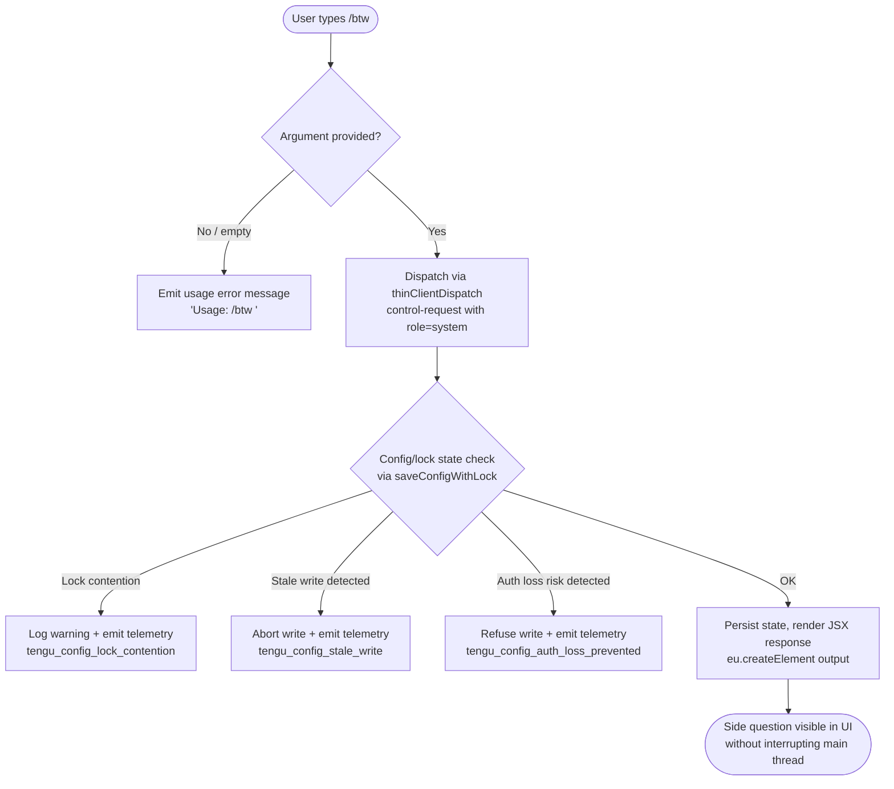

# `/btw`

> Analysis basis: CC v2.1.181 bundle.js (AST extraction + Claude interpretation)
> Minimum version: v2.1.181

---

## Overview

`/btw` ("by the way") is a lightweight side-question command that lets the user inject a quick contextual question into the agent without interrupting or derailing the main conversation thread. It is registered as a `local-jsx` command with `immediate: true`, meaning it is dispatched synchronously to the thin-client control channel as soon as the user submits it, before any assistant turn completes.

---

## Registration

| Field | Value |
|---|---|
| type | `local-jsx` |
| name | `btw` |
| description | `Ask a quick side question without interrupting the main conversation` |
| argumentHint | `<question>` |
| immediate | `true` |
| thinClientDispatch | `control-request` |
| module_id | `Lnl` |
| load_inline | `true` |
| loc_byte | `11167708` |
| loc_byte_end | `11167947` |
| loc_line | `6868` |
| arbor_handler.name | `a4p` |
| arbor_handler.fqn | `claude-2.1.181::a4p` |
| arbor_handler.kind | `AsyncFunction` |
| arbor_handler.resolution_path | `module_id` |
| arbor_handler.n_hits | `0` |

Analysis basis: CC v2.1.181 bundle.js:+11167708

---

## Input Branching

The handler has three distinct paths based on argument presence and content:



Analysis basis: CC v2.1.181 bundle.js:+11167299, +11167301, +11167340, +11167409

---

## Behavioral Spec

### 1. Argument Validation

```
function validateBtwArgument(rawArg):
    if rawArg is null or rawArg.trim() == "":
        emitSystemMessage("Usage: /btw <your question>")
        return ABORT
    return rawArg
```

The usage string `"Usage: /btw <your question>"` is a literal constant in the bundle.

Analysis basis: CC v2.1.181 bundle.js:+11167299, +11167301

### 2. Main Handler Dispatch (AsyncFunction `a4p`)

```
async function handleBtwCommand(context, args):
    question = validateBtwArgument(args)
    if question == ABORT:
        return

    // Dispatch as a control-request to the thin-client layer
    // Role is flagged "system" — not a user turn
    dispatchControlRequest(
        role = "system",
        payload = question,
        immediate = true
    )

    // Trigger jitter delay before any dependent async work
    delayWithJitter(baseMs=1, jitterFactor=2)

    // Invoke config persistence path (un)
    persistConversationState(context)

    // Render JSX response element for UI
    return eu.createElement(SidequestionComponent, { question })
```

The `immediate: true` flag and `thinClientDispatch: "control-request"` combination means the payload is forwarded to the control channel before the current agent turn settles.

Analysis basis: CC v2.1.181 bundle.js:+11167363, +11167409, +11167340

### 3. Jitter Delay Utility (`e`)

```
function delayWithJitter(baseMs, jitterFactor):
    // Generates a random delay between baseMs and baseMs * jitterFactor
    delay = baseMs + Math.random() * (jitterFactor - 1) * baseMs
    return new Promise(resolve => setTimeout(resolve, delay))
```

Numeric constants `2` and `1` are used as the jitter multiplier and base respectively.

Analysis basis: CC v2.1.181 bundle.js:+14249544, +14249546, +14249560, +14249583

### 4. Config Persistence Path (`un` → `n7n`)

The handler invokes a config-persistence subsystem (`un`) that orchestrates file-system locking, backup rotation, and atomic writes:

```
async function persistConversationState(context):
    // Acquire filesystem lock via n7n
    acquireConfigLock()

    // If lock takes too long, emit warning
    if lockDurationExceedsThreshold():
        logWarning("Lock acquisition took longer than expected - another Claude instance may be running")
        emitTelemetry("tengu_config_lock_contention")

    // Load existing config (w_e)
    config = readConfigFile(encoding="utf-8")

    // Guard: refuse write if auth fields would be lost
    if cachedConfigHasAuthThatRereadeConfigLacks():
        logWarning("saveConfigWithLock: re-read config is missing auth that cache has; refusing to write to avoid wiping ~/.claude.json. See GH #3117.")
        emitTelemetry("tengu_config_auth_loss_prevented")
        return

    // Rotate backups (up to 5 kept, prefix ".backup.")
    rotateBackups(maxCount=5, prefix=".backup.")

    // Write atomically via lSt (safe write with fsync + rename)
    atomicWriteConfig(config, permissions=0o600)

    releaseLock()
```

Analysis basis: CC v2.1.181 bundle.js:+11167363, +13935801, +13939139, +13939228, +13939555, +13939707, +13940025, +13940158

### 5. Atomic Config Write (`lSt`)

```
function atomicWriteConfig(data, permissions):
    // Write to temp file with random hex suffix
    tempPath = generateTempPath(randomBytes=8, encoding="hex")
    writeFileSync(tempPath, data, encoding="utf-8")
    applyPermissions(tempPath, permissions)  // 0o600 = 384 decimal
    fsyncSync(tempPath)
    renameSync(tempPath, targetPath)

    // On EACCES or permission errors (EINVAL, ENOTSUP, EPERM, ENOSYS),
    // fall back to in-place write and log warning
    if error in [EINVAL, ENOTSUP, EPERM, ENOSYS, EACCES]:
        logWarning("writeFileSyncAndFlush: in-place fallback write failed; content preserved at temp path")
```

Permissions constant `384` (octal `0o600`) is a literal in the bundle.

Analysis basis: CC v2.1.181 bundle.js:+1094871, +1094899, +1095054, +1095312, +1095374, +1095521, +1095730, +13940440

### 6. JSX Rendering (`eu.createElement`)

```
function renderBtwResponse(question):
    return eu.createElement(SidequestionUIComponent, {
        role: "system",
        content: question
    })
```

The JSX render call is the final step of the handler. The `local-jsx` type means the resulting element is rendered inline in the CLI UI.

Analysis basis: CC v2.1.181 bundle.js:+11167409

---

## State & Side Effects

| Item | Detail |
|---|---|
| Telemetry | `tengu_config_lock_contention` (bundle.js:+13939228) — emitted when lock acquisition is slow |
| Telemetry | `tengu_config_stale_write` (bundle.js:+13939364) — emitted when a stale write is detected |
| Telemetry | `tengu_config_parse_error` (bundle.js:+13941803) — emitted when config JSON cannot be parsed |
| Telemetry | `tengu_config_auth_loss_prevented` (bundle.js:+13939707) — emitted when write is refused to protect auth fields |
| Telemetry | `tengu_config_fallback_write` (bundle.js:+13938844) — emitted when global config fallback write path is used |
| Telemetry | `tengu_bg_dispatch_sigkill_escalate` (bundle.js:+17101321) — background daemon escalation |
| Telemetry | `tengu_bg_dispatch_low_mem` (bundle.js:+17101922) — background low-memory condition |
| Telemetry | `tengu_bg_spare_enable`, `tengu_bg_spare_claim`, `tengu_bg_spare_claim_fail` — background session spare pool |
| Telemetry | `tengu_bg_proto_mismatch`, `tengu_bg_dispatch_stale_drop` — background IPC protocol events |
| Telemetry | `tengu_bg_attach`, `tengu_bg_attach_legacy_autorespawn`, `tengu_bg_attach_stall_gave_up`, `tengu_bg_attach_stall_respawn`, `tengu_bg_attach_kick` — background attach lifecycle |
| Telemetry | `tengu_daemon_control` (bundle.js:+17138162) — daemon control operations |
| thinClientDispatch | Sends a `control-request` to the thin-client layer immediately on invocation |
| Config file I/O | Acquires file lock, rotates up to 5 backups (`.backup.*`), performs atomic write with fsync+rename to `~/.claude.json` |
| appState changes | Conversation state is persisted; `save_global` path (bundle.js:+13936254) may be triggered |
| JSX rendering | Returns a `local-jsx` element rendered inline in the CLI UI |
| Sound | <!-- TODO: not found in depth-2 traversal; needs --depth 4 --> |

---

## Version History

| Version | Change |
|---|---|
| v2.1.181 | Initial analysis |

---

## Common Mistakes

1. **Omitting the argument**: Invoking `/btw` with no text produces a usage error (`"Usage: /btw <your question>"`) and no dispatch occurs. Always include the question text.
2. **Expecting a user-turn reply**: `/btw` is dispatched with `role: "system"` via `thinClientDispatch: "control-request"`. It does not create a standard user turn in the conversation history and the response format differs from a normal prompt.
3. **Concurrent Claude instances**: Because `/btw` touches the config lock path, running multiple Claude Code instances simultaneously can cause lock contention warnings (`tengu_config_lock_contention`). This does not block the side question from being sent, but may slow down config persistence.
4. **Assuming synchronous completion**: The handler is an `AsyncFunction` (`a4p`) that includes a jitter delay. Any code depending on `/btw` completing before the next turn must account for this async gap.
5. **Confusing `/btw` with `/ask` or inline questions**: `/btw` is specifically designed for non-interrupting side queries; it uses a dedicated control-request dispatch path, not the normal conversation pipeline.

---

## Appendix — Identifier Mapping

> For bundle debugging only. Identifiers change across versions.

| Identifier | Role |
|---|---|
| `a4p` | Main async handler for `/btw` command (arbor_handler, AsyncFunction) |
| `e` | Jitter delay utility (Math.random + setTimeout wrapper) |
| `un` | Config persistence orchestrator (lock + write + backup) |
| `n7n` | Config lock acquisition and file-system state manager |
| `t` | Filesystem abstraction (statSync, readdirStringSync, etc.) |
| `jt` | Path normalization / join utility |
| `s` | File I/O set with add/delete/finally lifecycle |
| `r` | File operations object (readFileSync, statSync, unlinkSync, renameSync, etc.) |
| `i` | Stream/handle closer (close, finally wrapper) |
| `gBs` | Config object merger (kvr + Object.assign) |
| `kvr` | Config base reader (feeds into gBs) |
| `I` | Message/content formatter (role, encoding, context assembly) |
| `xhc` | Extended handler context builder |
| `Re` | JSON serializer (JSON.stringify wrapper) |
| `qc` | String manipulation utility (replace, at, lastIndexOf, slice) |
| `nqe` | Queue/batch helper |
| `Rhc` | File context builder (dirname, byteLength, buffer ops) |
| `j` | Logger / structured log emitter |
| `ln` | Error/warning logger |
| `w_e` | Config file reader and backup rotator |
| `Wt` | JSON parser (JSON.parse wrapper) |
| `x9` | Path prefix stripper (startsWith + slice) |
| `uUl` | Directory traversal utility (readdirStringSync + TS.join) |
| `h0o` | Path join + stat helper |
| `f` | Background daemon process manager (spawn, kill, freemem) |
| `qmt` | Config mutation / transform helper |
| `n` | String normalizer (toLowerCase) |
| `T` | Scroll/viewport math helper (Math.max, Math.floor, preventDefault) |
| `x` | Terminal write / supervisor client |
| `E` | Clamp/range utility (Math.max, Math.min) |
| `g` | IPC buffer reader (Buffer.concat, indexOf) |
| `h` | Timeout/stream helper |
| `m` | Process kill manager (n.values, x.kill) |
| `sf` | Stream end/reply finalizer |
| `y9f` | Full IPC message dispatch and session lifecycle handler |
| `Ee` | String coercion utility (String wrapper) |
| `lSt` | Atomic file write with fsync+rename and permission management |
| `Jp` | Symlink resolution / realpathSync helper |
| `u` | Process/session state accessor (xe, Me, zU, cG) |
| `Dn` | Error logger with ln dependency |
| `cKe` | Permission error classifier (EINVAL, ENOTSUP, EPERM, ENOSYS) |
| `dMe` | Config diff/merge helper |
| `f0o` | Config entries iterator (Object.entries) |
| `L8t` | Timestamp recorder (Date.now) |
| `t7n` | Config transaction writer (lock + lSt + Re) |
| `$e` | App state / Rht initializer |
| `Rht` | Root app state object |

---

*Note: index built via Arbor fallback; some signals (telemetry, literals) may be missing — see arbor-fallback.js.*