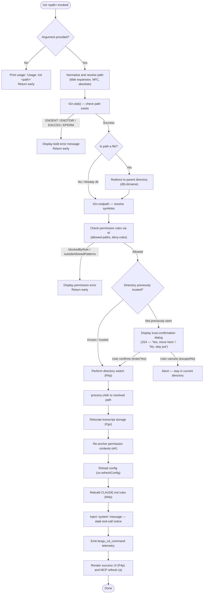

# `/cd`

> Analysis basis: CC v2.1.181 bundle.js (AST extraction + Claude interpretation)
> Minimum version: v2.1.181

---

## Overview

The `/cd` command moves the active Claude Code session to a new working directory by resolving and validating the target path, optionally prompting the user for trust confirmation when the destination has not been visited before, and then performing an atomic directory switch that updates the process working directory, rewrites transcript storage, reloads configuration, and refreshes all tool permission rules to reflect the new location.

---

## Registration

| Field | Value |
|---|---|
| type | `local-jsx` |
| name | `cd` |
| description | Move this session to a new working directory |
| argumentHint | `<path>` |
| module_id | `orl` |
| load_inline | `true` |
| loc_byte | `11201988` |
| loc_byte_end | `11202148` |
| loc_line | `6889` |
| arbor_handler.name | `O4p` |
| arbor_handler.fqn | `claude-2.1.181::O4p` |
| arbor_handler.kind | `AsyncFunction` |
| arbor_handler.resolution_path | `module_id` |
| arbor_handler.n_hits | `0` |

Analysis basis: CC v2.1.181 bundle.js:+11201988

---

## Input Branching

The command has more than three distinct execution paths (no argument, stat failure with several distinct error codes, untrusted directory requiring confirmation, permission-blocked path, and successful switch), so a Mermaid flowchart is used.



---

## Behavioral Spec

### 1. Entry point and argument validation

Handler `O4p` (AsyncFunction, resolved via module_id `orl`) is the sole entry point.

```
async function handleCdCommand(rawArg, context):
    if rawArg is empty or whitespace:
        display("Usage: /cd <path>")
        return

    resolvedPath = resolvePath(rawArg)          // see §2
    stat = await filesystem.stat(resolvedPath)   // iGn.stat
    if stat error:
        code = error.code  // ENOENT | ENOTDIR | EACCES | EPERM
        display(bold(errorMessage(code)))
        return

    if stat indicates regular file:
        resolvedPath = path.dirname(resolvedPath) // d5t.dirname

    realPath = await filesystem.realpath(resolvedPath) // iGn.realpath
```

Analysis basis: CC v2.1.181 bundle.js:+11200465

---

### 2. Path normalization (`vs` — path sanitizer)

```
function normalizePath(raw):
    if raw contains null bytes:
        throw Error("Path contains null bytes")   // bundle.js:+1089749
    trimmed = raw.trim()
    normalized = unicodeNormalize(trimmed, "NFC") // mH, bundle.js:+64429
    expanded = normalized via OO.normalize
    if expanded starts with "~/":                 // bundle.js:+1089877
        expanded = homedir() + expanded.slice(2)
    if platform == "windows":                     // bundle.js:+1089946
        handle Windows-style tilde "~\"
    if OO.isAbsolute(expanded):
        return expanded
    return OO.resolve(cwd, expanded)
```

Analysis basis: CC v2.1.181 bundle.js:+1089698

---

### 3. Permission-rule evaluation (`trl` — tool-rule evaluator)

```
function evaluatePermissions(resolvedPath, session):
    pathStr = toDisplayPath(resolvedPath)   // c5t — strips home prefix

    // Check each active permission rule via k4p
    for rule in session.permissionRules:
        result = matchRule(rule, resolvedPath)
        if result == "blockedByRule":        // bundle.js:+11195870
            return { status: "blocked", rule }
        if result == "outsideAllowedPatterns": // bundle.js:+11196104
            return { status: "blocked", rule }

    // Check deny-list via nq
    denyResult = checkDenyList(resolvedPath) // "deny" bundle.js:+13772229
    if denyResult.denied:
        return { status: "denied" }

    return { status: "allowed" }             // bundle.js:+11195977
```

Analysis basis: CC v2.1.181 bundle.js:+11195712

---

### 4. Trust confirmation dialog (JSX component `rrl`)

When the destination directory has not been previously trusted, a JSX dialog is rendered with the following properties:

- **Warning header**: "Moving to a new working directory:" — bundle.js:+11198528
- **Body** (paraphrased): Informs the user that Claude Code has not worked in this directory before and asks whether it is a directory the user created or trusts. References that the tool will be able to read, edit, and execute files. Provides a security guide link (`https://code.claude.com/docs/en/security` — bundle.js:+11197892).
- **Confirm button**: "Yes, move here" — bundle.js:+11198046
- **Cancel button**: "No, stay put" — bundle.js:+11198075
- **Keyboard shortcuts**: `enter`/`confirm` to accept, `escape`/`cancel` to abort — bundle.js:+11198315–11198393

```
function showTrustDialog(targetPath):
    result = await renderDialog({
        variant: "warning",
        title: "Moving to a new directory:",
        path: targetPath,
        confirmLabel: "Yes, move here",
        cancelLabel:  "No, stay put",
        keys: { confirm: ["enter", "confirm"], cancel: ["escape", "cancel"] }
    })
    if result == "cancel":
        return ABORT
    return CONFIRMED
```

Analysis basis: CC v2.1.181 bundle.js:+11197523

---

### 5. Directory switch execution (`R4p` — directory-switch executor)

```
async function executeDirectorySwitch(realPath, context):
    // 1. Atomically change the Node.js process working directory
    process.chdir(realPath)                        // bundle.js:+11198996

    // 2. Notify shell CWD subsystem (vH → kD → wer.emit)
    //    Emits tengu_shell_set_cwd telemetry
    updateShellCwd(realPath)

    // 3. Relocate transcript storage to new path (Fgo)
    //    - beginTranscriptRelocation / flush / mkdir / rename / rm / copyFile
    //    - Uses "cd" marker string at bundle.js:+13443909
    //    - Directory permissions mask: 0o700 (decimal 448, bundle.js:+13444070)
    await relocateTranscript(realPath, context)

    // 4. Re-anchor tool-permission contexts to new path (eK → soe.reanchor)
    reanchorPermissions(realPath)                  // bundle.js:+1147081

    // 5. Reload project configuration from new location
    await refreshConfig(realPath)                  // zo.refreshConfig, bundle.js:+11199317

    // 6. Inject stale-context system message (j)
    //    Content references "previous directory — that information is stale.
    //    All tool calls and ..." (≤30-char fragment) bundle.js:+11199532
    injectSystemMessage("system", staleNotice)     // bundle.js:+11201316

    // 7. Rebuild memory/CLAUDE.md rule set for new directory (M4p)
    //    Scans CLAUDE.md, CLAUDE.local.md, .claude/** rules files
    await rebuildRules(realPath)                   // bundle.js:+11198789–11198949

    // 8. Emit telemetry
    emit("tengu_cd_command")                       // bundle.js:+11199338
```

Analysis basis: CC v2.1.181 bundle.js:+11198984

---

### 6. Transcript relocation (`Fgo` — transcript relocator)

```
async function relocateTranscript(newPath, sessionManager):
    oldTranscriptDir = path.dirname(currentTranscriptPath)
    newTranscriptDir = path.join(newPath, ".claude", sessionId)

    sessionManager.beginTranscriptRelocation()     // bundle.js:+13443984
    await sessionManager.flush()                   // bundle.js:+13444024
    await fs.mkdir(newTranscriptDir, { mode: 0o700 }) // bundle.js:+13444040

    // Move files; falls back to copy+delete on EXDEV cross-device errors
    await moveOrCopyFiles(oldTranscriptDir, newTranscriptDir)
    // Error codes handled: EEXIST, EBUSY, ENOTEMPTY, EXDEV, EISDIR, ENOTSUP
    //   bundle.js:+13444415–13444634

    sessionManager.endTranscriptRelocation()       // bundle.js:+13444302
```

Analysis basis: CC v2.1.181 bundle.js:+13443846

---

### 7. Rules rebuild (`M4p` — rules assembler)

```
function rebuildRulesForNewDirectory(realPath):
    ancestors = collectAncestors(realPath)  // walks up via d5t.parse/dirname
    for each ancestor:
        files = collectRuleFiles(ancestor)
        // Looks for: "CLAUDE.md", "CLAUDE.local.md", ".claude/**/*.md"
        //   bundle.js:+5056178, 5056346, 5056245
    rules = buildMemoryList(files)          // PMt
    // Categories: Project, Local, AutoMem, Managed instructions
    //   bundle.js:+5056212, 5056386, 5058391, 5058465
    session.updateRules(rules)
```

Analysis basis: CC v2.1.181 bundle.js:+11198789

---

### 8. Post-switch UI and MCP refresh (`P4p`, `a`)

```
function renderSuccessUI(newPath, session):
    displayPath = formatWithBold(newPath)    // gt.bold, bundle.js:+11199833
    renderCdSuccessComponent(displayPath)    // P4p → Rke → JZo

function refreshMcpServers(session):
    // kOo → DBe: re-evaluates all MCP server connections for new cwd context
    // Applies server policies, re-connects stdio/sse/http servers as needed
    applyMcpUpdate(session)                  // bQn → e.applyMcpUpdate
```

Analysis basis: CC v2.1.181 bundle.js:+11199727, +11201566

---

## State & Side Effects

| Item | Detail |
|---|---|
| Telemetry | `tengu_cd_command` (bundle.js:+11199338); `tengu_shell_set_cwd` (bundle.js:+7025971) |
| process.chdir | The Node.js process working directory is permanently changed to the real resolved path (bundle.js:+11198996) |
| Transcript storage | Moved to a new `.claude/<sessionId>` directory under the target path; uses `beginTranscriptRelocation` / `endTranscriptRelocation` guards (bundle.js:+13443984, +13444302) |
| Permission contexts | Re-anchored via `soe.reanchor` to the new path (bundle.js:+1147081) |
| Configuration | `zo.refreshConfig` is called to reload project-level config from the new directory (bundle.js:+11199317) |
| System message injected | A `"system"` role message notifying the model that prior tool-call context referencing the previous directory is stale (bundle.js:+11199532) |
| CLAUDE.md rules | Completely rebuilt by scanning ancestors of the new directory (bundle.js:+11198789) |
| MCP server connections | Re-evaluated for the new cwd; servers may reconnect or apply different policies (bundle.js:+11201566) |
| CWD event emitted | `wer.emit` fired via `kD` → `Zht` path normalization (bundle.js:+45195) |
| Hook registration | `v$o.register` called via `Au` → `Gi` during transcript relocation (bundle.js:+65579) |
| Sound | <!-- TODO: not found in depth-2 traversal; needs --depth 4 --> |

---

## Version History

| Version | Change |
|---|---|
| v2.1.181 | Initial analysis |

---

## Common Mistakes

1. **Passing a file path instead of a directory** — the command auto-redirects to the parent directory via `d5t.dirname`, which may not be the intended destination.
2. **Paths with null bytes** — rejected immediately with "Path contains null bytes" error; this is a security guard and cannot be bypassed.
3. **Paths outside allowed permission patterns** — if the session was started with `--allowedPaths` or policy restrictions, `/cd` to an outside directory will fail silently with a permission error rather than prompting for trust.
4. **Expecting MCP tools to persist unchanged** — after `/cd`, MCP server connections are re-evaluated against the new directory's policies; some servers may disconnect or require re-authentication.
5. **Assuming prior tool context remains valid** — a `"system"` message is injected informing the model that all prior tool references to the old directory are stale; ignoring this can cause the model to use outdated path context.
6. **Using relative paths that depend on current shell cwd** — the path is resolved against the session cwd at the time of invocation, not the user's shell cwd; always prefer absolute paths or explicit tilde-relative paths.

---

## Appendix — Identifier Mapping

> For bundle debugging only. Identifiers change across versions.

| Identifier | Role |
|---|---|
| `O4p` | Main async handler for `/cd` command (AsyncFunction, module `orl`) |
| `vs` | Path sanitizer / normalizer — validates null bytes, NFC, tilde, absolute resolution |
| `Mt` | Context store accessor — retrieves current session state |
| `cen` | Store getter — reads from async local storage via `len.getStore` |
| `mV` | State value extractor used by store getter |
| `gr` | Graphics/renderer utility called during path display |
| `fx` | Low-level render primitive |
| `jt` | Logger / trace utility |
| `mH` | Unicode NFC normalizer wrapper |
| `ln` | General logging helper |
| `trl` | Tool-rule evaluator — checks path against permission rules |
| `ps` | Permission-store accessor |
| `PD` | Permission-directory walker — builds allowed-path sets |
| `_d` | Path-set data structure helper |
| `XA` | Path-set auxiliary helper |
| `lor` | Symlink-safe directory lister / path resolver |
| `cxl` | Cache hit checker with timestamp (`Date.now`) |
| `Nde` | Symlink chain resolver with realpath fallback |
| `Jp` | Realpath resolver using `e.realpathSync` |
| `c5t` | Display-path formatter — strips home directory prefix |
| `k4p` | Rule matcher for individual permission rules |
| `l5t` | Glob/pattern expander for permission rule strings |
| `ZAf` | Rule normalizer combining `vs` (path) and `gr` (render) |
| `U6e` | Permission-token evaluator using `Yt` and `$D` |
| `D4p` | Rule-construction helper for denied patterns |
| `nq` | Deny-list checker using `Pzn.flatMap` |
| `vA` | Rule-string parser / token extractor |
| `RYc` | Rule token type constant |
| `ek` | Object-own-property checker used in rule parsing |
| `PYc` | Rule token subtype constant |
| `MYc` | Rule string replacer / escaper |
| `LHe` | Settings-context resolver for permission rules |
| `V1l` | Settings layer enumerator |
| `S5e` | Settings cache accessor (`f4a.get`/`f4a.set`) |
| `l3t` | Settings layer constructor |
| `u3t` | Settings string parser (trim, startsWith, endsWith, indexOf, slice) |
| `Wco` | Settings cache validator using `ek` |
| `Pr` | App-state reader — retrieves working_directory, allowed_tools, etc. |
| `R5n` | App-state parser for allowed-tools field |
| `P5n` | App-state parser for disallowed-tools field |
| `rB` | Permission-mode handler (disable / bypassPermissions) |
| `ut` | Token/claim tracker with deduplication |
| `txt` | Token text extractor |
| `nxt` | Token-next helper |
| `p4` | Token page helper |
| `Ygn` | Seen-token deduplicator using `z1r` / `zTe` sets |
| `It` | Event emitter with timestamp (`Date.now`, `Byf`) |
| `P4p` | Success-UI renderer for `/cd` |
| `sm` | String sanitizer used in UI display |
| `DYc` | HTML entity replacer (replaceAll) |
| `Rke` | UI component factory |
| `JZo` | UI component base |
| `R4p` | Directory-switch executor — orchestrates all post-chdir steps |
| `vH` | Shell CWD updater (b0n.isAbsolute / b0n.resolve / Dn) |
| `Dn` | Path-store notifier |
| `dfr` | CWD store reader using `len.getStore` and `mH` |
| `hre` | CWD store update helper |
| `j` | React/UI render scheduler |
| `kD` | CWD event emitter via `Zht` normalizer and `wer.emit` |
| `Zht` | Path normalizer used by CWD emitter |
| `Fgo` | Transcript relocator — mkdir / rename / copy operations |
| `Lt` | Transcript-path builder using `fx` |
| `Au` | Hook registration dispatcher |
| `Gi` | Hook registrar (`v$o.register`) |
| `JW` | Session-ID formatter |
| `rt` | String coercer |
| `FRl` | Transcript filename formatter |
| `i9` | Transcript metadata helper |
| `$1e` | UI component combiner |
| `Wb` | Event bus wrapper |
| `A$o` | Event bus subscribe helper |
| `m$o` | Event emitter via `RKt.emit` |
| `IRl` | File-move helper with EXDEV/EBUSY fallback |
| `qRl` | Recursive directory copy helper |
| `I` | Config-file reader / CLAUDE.md loader |
| `xhc` | Config-file parser |
| `Re` | JSON serializer helper |
| `qc` | Config-line extractor |
| `nqe` | Config-cache accessor |
| `Rhc` | Config-file watcher / reloader |
| `ke` | Rule-set builder with error logging |
| `Ho` | Error-string formatter |
| `ta` | Queue-based task runner |
| `fVc` | Queue shift/push manager |
| `eK` | Permission-context re-anchor dispatcher (`soe.reanchor`) |
| `AE` | Post-switch state applier |
| `M4p` | Rules assembler — walks ancestor dirs, collects CLAUDE.md files |
| `rI` | Path normalizer used in rule assembly |
| `OMt` | CLAUDE.md file collector (CLAUDE.md, CLAUDE.local.md, .claude/**) |
| `eg` | Settings-group extractor |
| `X4` | Single rule-file loader |
| `yve` | Recursive directory scanner for `.md` rule files |
| `DMt` | Path-relative resolver for rule files |
| `PMt` | Memory-list builder (Project, Local, AutoMem, Managed categories) |
| `aGn` | HTML entity encoder for display strings |
| `Sw` | Sidebar/status updater after switch |
| `lpt` | Async task submitter |
| `JV` | Path normalizer using `OO.normalize` |
| `a` | MCP server refresh orchestrator after directory switch |
| `DBe` | MCP connection manager — re-evaluates all server connections |
| `z8` | MCP config applier |
| `Hrt` | MCP server config parser |
| `x7` | MCP server connector |
| `h5` | MCP server entry builder |
| `Zwn` | MCP warning/error renderer |
| `Art` | MCP server registry updater |
| `Pk` | MCP client factory |
| `M_` | MCP client builder |
| `LVr` | MCP client version resolver |
| `qn` | Config token helper |
| `UOt` | MCP disabled-server filter |
| `Jta` | MCP connection coordinator |
| `Mzr` | MCP connection state initializer |
| `wwe` | MCP config hasher |
| `KAn` | MCP schema validator |
| `zAn` | MCP schema hash builder |
| `AI` | MCP hash helper using `Dti.createHash` |
| `qAn` | MCP cache-key builder |
| `uc` | MCP byte-buffer helper |
| `sn` | MCP debug logger |
| `yLn` | MCP OAuth / server launcher |
| `t$d` | MCP server startup helper |
| `R9` | MCP token accessor |
| `Aae` | MCP unsupported-server UI renderer |
| `hae` | MCP server metadata helper |
| `Iae` | MCP OAuth flow executor |
| `Trt` | MCP pending-connection tracker |
| `p` | Process-exit handler |
| `SLn` | MCP server state logger |
| `R7` | MCP server reconnector |
| `M9` | MCP token store accessor |
| `Du` | MCP error logger |
| `Ee` | String coercer used in error paths |
| `n$d` | MCP server null-result handler |
| `e$d` | MCP SSH-session detector |
| `ELn` | MCP server event-loop handler |
| `brt` | MCP connection state reader |
| `Irt` | MCP pending-connection reader |
| `ana` | MCP reconnect scheduler |
| `oi` | Async-local-store accessor |
| `wxn` | MCP cache-file path builder |
| `WVr` | MCP connection result applier |
| `m` | Background-session value map |
| `x` | Background-session process wrapper |
| `gP` | MCP skill-count telemetry emitter (`tengu_mcp_skills`) |
| `wVr` | MCP server list updater |
| `un` | Config save coordinator |
| `w` | Background-session worker manager |
| `Az` | Background-session event listener |
| `L` | Background-session lifecycle sweeper |
| `v` | Background-session view helper |
| `uQl` | Background-session away-summary accessor |
| `nna` | Promise-mapping helper |
| `y8` | Async iterator mapper |
| `Qrt` | MCP retry-count parser (parseInt) |
| `Lxn` | MCP backoff-delay parser (parseInt) |
| `bQn` | MCP connection-result applier |
| `kBe` | MCP config-change detector |
| `kL` | MCP cleanup coordinator |
| `Xrt` | MCP config hasher for cleanup |
| `kOo` | MCP server-slot updater |
| `sLn` | MCP needs-auth cache checker |
| `Fn` | MCP timeout/retry helper |
| `p5t` | Background-task launcher |
| `rrl` | Trust-confirmation dialog JSX component |

---

Note: index built via Arbor fallback; some signals (telemetry, literals) may be missing — see arbor-fallback.js.