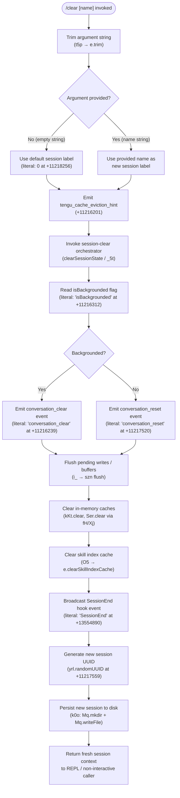

# `/clear`

> Analysis basis: CC v2.1.181 bundle.js (AST extraction + Claude interpretation)
> Minimum version: v2.1.181

---

## Overview

The `/clear` command starts a fresh session with an empty context window while leaving the previous session intact on disk so it can be resumed later with `/resume`. It is also registered under the aliases `/reset` and `/new`. The command accepts an optional `[name]` argument to label the new session and supports non-interactive (scripted) invocation.

---

## Registration

| Field | Value |
|---|---|
| type | `local` |
| name | `clear` |
| description | Start a new session with empty context; previous session stays on disk (resumable with /resume) |
| aliases | `reset`, `new` |
| argumentHint | `[name]` |
| supportsNonInteractive | `true` |
| thinClientDispatch | `post-text` |
| module_id | `brl` |
| load_inline | `true` |
| loc_byte | 11218415 |
| loc_byte_end | 11218706 |
| loc_line | 6891 |
| arbor_handler.name | `t5p` |
| arbor_handler.fqn | `claude-2.1.181::t5p` |
| arbor_handler.kind | `AsyncFunction` |
| arbor_handler.resolution_path | `module_id` |
| arbor_handler.n_hits | 0 |

Analysis basis: CC v2.1.181 bundle.js:+11218415

---

## Input Branching

The command has three distinct meaningful paths depending on the argument string supplied and whether a background context is detected, so a flowchart is used.



---

## Behavioral Spec

### 1. Argument Trimming and Session Naming

```
async function handleClear(rawArg):
    name = rawArg.trim()          // t5p → e.trim  (+11218241)
    if name == "":
        name = defaultLabel       // literal 0 / empty-string fallback (+11218256)
    return clearSessionState(name)
```

Analysis basis: CC v2.1.181 bundle.js:+11218241

---

### 2. Session State Teardown (`clearSessionState` / `_5t`)

This is the primary orchestrator. It performs all teardown steps in sequence.

```
async function clearSessionState(newName):
    // 1. Emit telemetry hint before expensive work
    emit("tengu_cache_eviction_hint")               // +11216201

    // 2. Read app-state flag
    backgrounded = appState.isBackgrounded           // +11216312

    // 3. Choose event variant
    if backgrounded:
        emit_event("conversation_clear")             // +11216239
    else:
        emit_event("conversation_reset")             // +11217520

    // 4. Parse effort/model settings for new session
    effortValue   = parseIntOrDefault(settings.effort, 10, base=10)  // E5t, parseInt +13564340–+13564362
    modelValue    = resolveModelSetting()            // DC, model literals +3360954 …

    // 5. Abort any running AbortController
    abortAll(signal = AbortSignal.timeout(...))      // +11216157

    // 6. Kill background daemons if needed
    killBackgroundProcesses()                        // f → M.kill (+11101362)

    // 7. Flush pending writes / buffer queues
    flushPendingWrites()                             // i_ → szn.delete (+13524337)

    // 8. Clear all in-memory caches
    clearInMemoryCaches()                            // fH: kKt.clear (+27824), Ser.clear (+27836)
    clearSkillIndexCache()                           // O5 → e.clearSkillIndexCache (+13412115)
    clearSubagentState()                             // Vte: j4n, N4n, tZi, Yxe …
    clearCompactionCache()                           // t5 → O4t.clear (+10955940)
    clearToolResultCaches()                          // e0a, Bka, Smr, pmr, bna …

    // 9. Fire SessionEnd hook (hooks may run async)
    fireHookEvent("SessionEnd")                      // B6e literal +13554890

    // 10. Generate new session identity
    newUUID = crypto.randomUUID()                    // yrl.randomUUID (+11217559)
    emit("conversation_reset", id=newUUID)           // Cer → m$o → RKt.emit (+44251)

    // 11. Persist new session directory
    persistNewSession(newName, newUUID)              // k0o: Mq.mkdir (+13989752), Mq.writeFile (+13989798)

    // 12. Re-initialise log writers
    reinitLogs()                                     // S_e: appendFileSync, mkdirSync

    // 13. Reload hook registrations for new session
    reloadHooks()                                    // $8: load_plugin_hooks (+5206205)

    return newSessionContext
```

Analysis basis: CC v2.1.181 bundle.js:+11216097 (`_5t`), +11216188 (`igt`), +11217559 (`yrl.randomUUID`)

---

### 3. Cache and State Clear sub-routines

```
function clearInMemoryCaches():
    // Xj → fH
    kKt.clear()                   // +27824
    Ser.clear()                   // +27836
    // Xj → NNr (resets hooks map)
    resetHooksMap()               // NNr → Tn, Ul, VE, es

function clearSkillAndSubagentState():
    // zgo orchestrates many clear() calls
    O5.clearSkillIndexCache()     // +13412115
    F8.clear()                    // z$i +5194409
    LXa.clear()                   // N4n +10640973
    eOt.clear()                   // tZi +6666713
    mKr.clear()                   // tZi +6666725
    B9e.clear()                   // e0a +8513635
    Cro.clear()                   // e0a +8513647
    mlt.clear()                   // Bka +8705476
    Q$t.clear()                   // Bka +8705488
    QEe.clear()                   // Smr +1148447
    sFn.clear()                   // eMa +8765542
    yKe.clear()                   // pmr +1140756
    Lee.clear()                   // bna +6876252
    jwe.clear()                   // bna +6876264
    O4t.clear()                   // t5  +10955940
```

Analysis basis: CC v2.1.181 bundle.js:+11215056 (`zgo`), +5194409, +10640973, +6666713

---

### 4. New Session Persistence

```
async function persistNewSession(name, uuid):
    dir  = path.join(baseDir, uuid)    // k0o → Mq.mkdir +13989752
    Mq.mkdir(dir, { recursive: true })
    payload = JSON.stringify({ name, uuid, ... })   // JSON.stringify +13989813
    Mq.writeFile(path.join(dir, sessionFile), payload)   // +13989798
    // Permissions: 448 (octal 0o700) +13989786
    // Buffer size hint: 384 bytes +13989837
```

Analysis basis: CC v2.1.181 bundle.js:+13989752, +13989786, +13989837

---

### 5. Hook Lifecycle around Clear

The `SessionEnd` hook event is fired before the new session is created, giving hook scripts a chance to react.

```
function fireSessionEndHook():
    hookEvent = { type: "SessionEnd" }    // literal +13554890
    broadcastHook(hookEvent)              // B6e → sx → bzn (spawn) or TLo (HTTP)
    // Hook types supported: PreToolUse, PostToolUse, SessionEnd, SessionStart, etc.
```

After the new session is established, `SessionStart` is broadcast and plugin hooks are reloaded (literal `"load_plugin_hooks"` at +5206205; `"hook_session_start_reload_skills"` at +5207453).

Analysis basis: CC v2.1.181 bundle.js:+13554890, +5206205, +5207453

---

### 6. Non-Interactive Mode

When `supportsNonInteractive: true` is active, the command runs identically but returns its result through the `thinClientDispatch: "post-text"` channel rather than printing to the REPL.

---

## State & Side Effects

| Item | Detail |
|---|---|
| Telemetry — `tengu_cache_eviction_hint` | Emitted at start of clear flow (+11216201) |
| Telemetry — `tengu_run_hook` | Emitted when hook runner is invoked (+13604319) |
| Telemetry — `tengu_repl_hook_finished` | Emitted after REPL hook completes (+13588063) |
| Telemetry — `tengu_hook_plugin_metrics` | Emitted with plugin hook metrics (+13582590) |
| Telemetry — `tengu_session_renamed` | Emitted if new session name differs (+13462021) |
| Telemetry — `tengu_feature_ok` / `tengu_feature_bad` | Feature gate check outcomes (+1019804, +1019871) |
| Telemetry — `tengu_shell_set_cwd` | Emitted when working directory is re-established after clear (+7025971) |
| Event broadcast — `conversation_clear` | Emitted when session is backgrounded (literal +11216239) |
| Event broadcast — `conversation_reset` | Emitted for normal (foreground) clear (literal +11217520) |
| Event broadcast — `SessionEnd` | Hook lifecycle event fired before new session creation (literal +13554890) |
| Hook registration | All plugin hooks are unregistered and then reloaded for the new session via `load_plugin_hooks` (+5206205) |
| In-memory caches cleared | `kKt`, `Ser`, `F8`, `LXa`, `eOt`, `mKr`, `B9e`, `Cro`, `mlt`, `Q$t`, `QEe`, `sFn`, `yKe`, `Lee`, `jwe`, `O4t` |
| Disk side-effect | Previous session directory is **retained** on disk; new session directory is created via `Mq.mkdir` + `Mq.writeFile` |
| AbortController | Any in-progress request is aborted via `AbortSignal.timeout` (+11216157) |
| Background processes | Running background daemons receive SIGKILL escalation if needed (`tengu_bg_dispatch_sigkill_escalate` +17101321) |
| New UUID | A fresh `crypto.randomUUID()` is generated for the new session (+11217559) |
| Sound | <!-- TODO: not found in depth-2 traversal; needs --depth 4 --> |

---

## Version History

| Version | Change |
|---|---|
| v2.1.181 | Initial analysis |

---

## Common Mistakes

1. **Expecting history to be gone**: `/clear` does **not** delete the previous session. It stays on disk and can be resumed with `/resume`. Use a dedicated deletion command if permanent removal is needed.
2. **Confusing `/reset` and `/new` with separate commands**: Both are aliases for `/clear` and have identical behaviour.
3. **Assuming hooks are skipped**: `SessionEnd` hooks fire during `/clear`. If a hook is slow or errors out, the clear flow may block or log a warning before completing.
4. **Using the optional `[name]` argument without quoting spaces**: The argument is trimmed but not further parsed, so names with internal spaces must be handled by the shell layer before the command receives them.
5. **Expecting instant effect in non-interactive mode**: In `thinClientDispatch: "post-text"` mode the response is deferred through the thin-client channel; callers should await the completion signal before assuming the session is ready.

---

## Appendix — Identifier Mapping

> For bundle debugging only. Identifiers change across versions.

| Identifier | Role |
|---|---|
| `t5p` | Main handler for `/clear` (AsyncFunction, arbor_handler) |
| `_5t` | Session-clear orchestrator — primary teardown coordinator |
| `E5t` | Effort/model settings parser (parseInt, Number.isFinite) |
| `lb` | Settings loader (calls `Ul`, `Wse`) |
| `Ul` | Configuration reader (safe-mode aware) |
| `Wse` | Policy settings loader (`policySettings`) |
| `wG` | Working-directory getter |
| `fx` | Filesystem primitive wrapper |
| `Xj` | Cache-clear dispatcher (calls `fH`, `NNr`) |
| `ONr` | Cache entry getter/setter |
| `fH` | Clears `kKt` and `Ser` maps |
| `NNr` | Resets hooks map (`Tn`, `Ul`, `VE`, `es`) |
| `B6e` | SessionEnd hook broadcaster |
| `wd` | Session writer / state persister |
| `Lt` | Low-level file transport |
| `IO` | I/O helper |
| `DC` | Model capability dispatcher (model name checks) |
| `DR` | Effort-level dispatcher (`high` literal) |
| `Zk` | Path join helper for session files |
| `Mt` | Metadata tracker |
| `sx` | Hook execution engine |
| `sB` | Hook event builder |
| `I` | Debug/verbose logger |
| `T_e` | Hook type extractor |
| `xLo` | Hook source loader (plugin/skill/command/prompt/agent/http/mcp_tool) |
| `HOl` | Hook output parser |
| `LLo` | Third-party hook filter |
| `EOl` | Hook event object builder |
| `j` | Logger (info level) |
| `Re` | JSON serializer wrapper |
| `ke` | Hook error logger |
| `Me` | Feature-gate OK path |
| `sOe` | Feature-gate bad path |
| `vM` | AbortController manager |
| `Jle` | Hook result joiner |
| `xP` | Worktree-create hook emitter |
| `_zn` | Block-hook path handler |
| `ILo` | MCP tool hook runner |
| `Szn` | Hook output parser (JSON vs plain-text detection) |
| `Nce` | Plugin metrics hook handler |
| `TLo` | HTTP hook executor |
| `gOl` | Hook output line reader |
| `s_e` | Hook stderr formatter |
| `bzn` | Shell/spawn hook executor |
| `FBe` | Hook final-result builder |
| `xe` | Feature-gate checker |
| `E8` | Telemetry emitter with dedup |
| `X4e` | Session context builder |
| `igt` | Background session identifier |
| `Qe` | Non-conforming session handler |
| `Ur` | Session state reader |
| `X_` | Session state writer |
| `s` | Daemon process set manager |
| `r` | Daemon process registry |
| `Ps` | Process exit handler |
| `i` | Daemon connection handle |
| `n` | Connection type normaliser |
| `f` | Background session kill/claim orchestrator |
| `M` | Daemon session manager |
| `mtt` | Session file reader |
| `d` | Session state writer / supervisor |
| `hQ` | Config reload notifier |
| `oMt` | `.claude` directory writer |
| `qOi` | Session entry filter |
| `g` | Binary stream reader (buffer concat) |
| `u` | Daemon stop sequence |
| `x` | Daemon config reload handler |
| `h` | Stream timeout handler |
| `Lec` | Session list formatter |
| `tae` | Session archive/restore handler |
| `Fn` | Timeout/retry wrapper |
| `o` | Pad/format helper |
| `aKn` | macOS memory-pressure handler |
| `ut` | Token-count tracker |
| `H$e` | Pins.json reader |
| `Pkt` | Pins path builder |
| `Wt` | JSON parse wrapper |
| `Dn` | ENOENT error classifier |
| `Cfd` | Directory crawler |
| `F` | Permission rule evaluator (allow/deny/classify/ask) |
| `Clt` | Permission classifier |
| `YW` | Permission rule runner |
| `x1o` | Daemon socket claim sender |
| `k0o` | New session directory creator |
| `c9f` | Claim timeout/retry handler |
| `l9f` | Claim frame builder |
| `kp` | Error logger (ln wrapper) |
| `Ee` | String coercion helper |
| `UM` | Binary frame encoder |
| `O1o` | Session lifecycle orchestrator (roster, symlinks, timeouts) |
| `Tc` | Session path builder |
| `fa` | Session file state reader/watcher |
| `lg` | Session file activator |
| `ECe` | Environment variable injector for hooks |
| `Fp` | File path resolver |
| `Mpt` | Async hook promise tracker |
| `l6t` | Path: `Gh.join` + `i6t` |
| `NHe` | Session symlink updater |
| `oD` | Session `err` state setter |
| `PN` | Session directory initialiser |
| `jM` | Session `late` state setter |
| `a6t` | Session directory path builder |
| `p` | Forced shutdown handler |
| `BT` | Process abort signaller |
| `ln` | Low-level file logger |
| `$e` | Rht (reheat / warm-up) caller |
| `$` | Disposable resource holder |
| `vd` | Void/noop placeholder |
| `NI` | Non-interactive flag |
| `zgo` | Bulk-cache-clear dispatcher (calls all `.clear()` subroutines) |
| `jgo` | Pre-clear hook |
| `mM` | Skill/MCP state resetter |
| `O5` | Skill index cache clearer |
| `S6n` | Subagent state resetter |
| `Sel` | Selection state clearer |
| `i6e` | P9t cache invalidator |
| `z$i` | F8 map clearer |
| `T2e` | Disk-based state file writer |
| `Ngt` | Notification state clearer |
| `Vte` | Subagent/teammate/compact state clearer |
| `qUe` | Z2 main-session guard |
| `j4n` | Subagent map clearer (w6, Tmo, K9t, Imo) |
| `MMt` | Session-start emitter (qx) |
| `Ogt` | Output-token tracker reset |
| `Fgt` | Fx/mre state clearer |
| `N4n` | LXa map clearer |
| `tZi` | eOt + mKr map clearers |
| `CNa` | Cleanup callback invoker |
| `Yxe` | State snapshot resetter |
| `CE` | AWe/Object.values state clearer |
| `Dmo` | Deferred-task canceller |
| `t5` | O4t map clearer |
| `e0a` | B9e + Cro map clearers |
| `Bka` | mlt + Q$t map clearers |
| `Smr` | QEe map clearer |
| `_rl` | Rollback state flag resetter |
| `eMa` | sFn map clearer |
| `Cnr` | e.has guard |
| `pmr` | yKe map clearer |
| `n7a` | P9t cache invalidator (second instance) |
| `P9t` | c4n cache getter + M9t invalidator |
| `bna` | Lee + jwe map clearers |
| `vH` | Working-directory setter |
| `jt` | Filesystem stat helper |
| `dfr` | AsyncLocalStorage CWD resolver |
| `mH` | Path normaliser (NFC) |
| `hre` | Zht path helper |
| `gr` | fx-based path getter |
| `_2e` | Object-key iterator |
| `Qx` | Queue flusher |
| `i_` | szn (pending-writes map) flusher |
| `azn` | EPl pending-set tracker |
| `xot` | Aia (analytics) notifier |
| `kL` | MCP skill reloader |
| `Xrt` | SHA-256 hook hash builder |
| `wwe` | JSON/array hash computer |
| `gP` | ut (token count) accessor |
| `Srl` | Gye (session-reload) trigger |
| `mh` | Au-based log writer |
| `Au` | Generic log appender |
| `Gi` | v$o hook register caller |
| `qP` | Queue processor |
| `Vm` | Path join helper (qve) |
| `r2` | fx reader |
| `y5t` | Au-based session-start log writer |
| `Cer` | New-session UUID emitter (RKt.emit) |
| `A$o` | Pre-emit guard |
| `m$o` | RKt event emitter |
| `Ela` | State enumeration helper |
| `ZY` | Au-based teardown logger |
| `L6` | Session rename/log writer (l8t.emit) |
| `S_e` | File-based log appender (appendFileSync, mkdirSync) |
| `JW` | Log path builder (rt, FRl, i9, $1e) |
| `K5e` | Symlink manager for session directories |
| `HLo` | Session task-directory creator |
| `bot` | hLo.join + ije + Lt helper |
| `fh` | Symlink target path builder |
| `Kat` | Symlink open/create helper |
| `AM` | Subagent path builder (Yjr, qve) |
| `Mf` | Metadata flag setter |
| `Mr` | Module initialiser (VVt.bind, lNo.set) |
| `VVt` | Module value binder |
| `_` | SDK/SSE coordinator orchestrator |
| `oht` | Connection object map builder (jic) |
| `jic` | Object.keys enumerator |
| `Ho` | Error/string coercer |
| `y` | UOt + oht post-clear state builder |
| `UOt` | State object builder |
| `dA` | Deferred-abort token |
| `E6` | Au + S5n.emit worktree-state emitter |
| `Wce` | Isolation-latch / log writer |
| `ePl` | JW + Ol.appendFile log appender |
| `$8` | Plugin hook registration batch handler |
| `yc` | Plugin settings reader (Ul, Lp) |
| `Lp` | Bare-mode settings reader |
| `JQ` | Hook-config entries parser |
| `Tn` | qtn + x2 event emitter |
| `_Ke` | Log-timestamp writer (wn) |
| `wn` | appendFileSync log writer |
| `VAe` | Plugin safe-mode guard |
| `fRt` | Session runner entry point (wd, mh, Py, Lt, tv) |
| `Py` | Permission/policy checker |
| `tv` | Full turn-execution engine (getAppState, hooks, tool calls, etc.) |
| `a` | MCP server connection batch manager |
| `DBe` | MCP server connector |
| `bQn` | MCP update applier |
| `l` | cxl (connection-close) helper |
| `kOo` | MCP client orchestrator |
| `mi` | UUID + timestamp generator |

---

Note: index built via Arbor fallback; some signals (telemetry, literals) may be missing — see arbor-fallback.js.