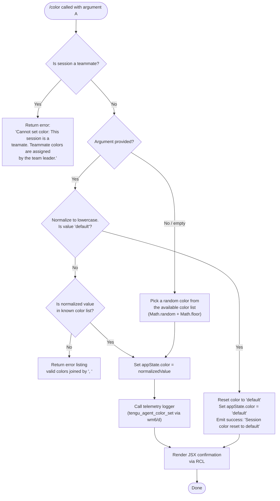

# `/color`

> Analysis basis: CC v2.1.176 bundle.js (AST extraction + Claude interpretation)
> Minimum version: v2.1.176

---

## Overview

The `/color` command sets the prompt bar color for the current Claude Code session. It accepts a named color value (or a special `"default"` keyword to reset), validates the input against a list of known color names, and immediately applies the chosen color by writing it into application state. The command is marked `immediate`, meaning it executes synchronously without waiting for an agent turn.

---

## Registration

| Field | Value |
|---|---|
| type | `local-jsx` |
| name | `color` |
| description | `Set the prompt bar color for this session` |
| argumentHint | `null` |
| immediate | `true` |
| module_id | `stq` |
| load_inline | `true` |
| loc_byte | `11323413` |
| loc_byte_end | `11323630` |
| loc_line | `7379` |
| arbor_handler.name | `SCL` |
| arbor_handler.fqn | `claude-2.1.176::SCL` |
| arbor_handler.kind | `AsyncFunction` |
| arbor_handler.resolution_path | `module_id` |
| arbor_handler.n_hits | `0` |

Analysis basis: CC v2.1.176 bundle.js:+11323413

---

## Input Branching

The command has four distinct execution paths based on the argument provided and the session context, so a flowchart is used.



Analysis basis: CC v2.1.176 bundle.js:+11322182 – +11323082

---

## Behavioral Spec

### Guard: Teammate Session Check

Before any color logic runs, the handler checks whether the current session is operating as a teammate (i.e., the session role is not the team leader). If so, the command exits immediately with a fixed error message.

```
function checkTeammateGuard(sessionContext):
    if sessionContext.isTeammate == true:
        return errorResult(
            "Cannot set color: This session is a teammate. " +
            "Teammate colors are assigned by the team leader."
        )
    return null
```

Analysis basis: CC v2.1.176 bundle.js:+11322262

---

### Input Resolution: Selecting a Color

If no argument is supplied (or the argument is empty), a random color is selected from the internal color list using `Math.random()` and `Math.floor()`.

If an argument is supplied, it is normalized to lowercase via `.toLowerCase()` before any comparison.

```
function resolveColor(rawArgument, colorList):
    if rawArgument is absent or blank:
        index = Math.floor(Math.random() * colorList.length)
        return colorList[index]
    else:
        return rawArgument.toLowerCase()
```

Analysis basis: CC v2.1.176 bundle.js:+11322391, +11322402, +11322428

---

### Validation: Known Colors and "default" Keyword

After normalization, the resolved value is checked in two stages:

1. If the value is `"default"`, the color is reset without a list-membership check.
2. Otherwise, the value must be present in the known color list (`kCL`). If not found, an error is returned listing all valid options separated by `", "`.

```
function validateAndApplyColor(resolvedColor, knownColorList, appStateManager):
    if resolvedColor == "default":
        appStateManager.setAppState({ color: "default" })
        return successResult("Session color reset to default")

    if NOT knownColorList.includes(resolvedColor):
        validList = knownColorList.join(", ")
        return errorResult("Invalid color. Valid options: " + validList)

    appStateManager.setAppState({ color: resolvedColor })
    return null  // proceed to telemetry + render
```

Analysis basis: CC v2.1.176 bundle.js:+11322446, +11322470, +11322492, +11322500, +11322590, +11322632, +11322851

---

### Telemetry Emission

Once the color is successfully applied (non-default path), the handler calls the telemetry logging pipeline rooted at `wm6`, which invokes the logging helper (`d`) and emits the `tengu_agent_color_set` event. The log entry is tagged with the string `"agent-color"`.

```
function emitColorTelemetry(colorValue, telemetryLogger):
    telemetryLogger.log({
        tag: "agent-color",
        event: "tengu_agent_color_set",
        color: colorValue
    })
```

Analysis basis: CC v2.1.176 bundle.js:+13564776, +13564860

---

### Available Color List Introspection

The handler also exposes a helper (`kp8`) that derives the set of available color names by calling `Object.keys` on a color-map object. This is used both for random selection and for validation error messages.

```
function getAvailableColors(colorMap):
    return Object.keys(colorMap)
```

Analysis basis: CC v2.1.176 bundle.js:+11321955, +11322651

---

### App State Retrieval (Post-Set Confirmation)

After the set operation, the handler reads back application state via `_.getAppState()` to construct the confirmation result displayed to the user.

```
function readBackCurrentColor(appStateManager):
    currentState = appStateManager.getAppState()
    return currentState.color
```

Analysis basis: CC v2.1.176 bundle.js:+11322675

---

### JSX Result Renderer

The final success result is produced by the `RCL` function, which assembles a JSX element confirming the new color. Internally it resolves several sub-helpers (`$J`, `oHH`, `$EH`, `bKH`, `q`) to build and return the display component.

```
function renderColorResult(colorValue):
    component = buildJSXComponent(colorValue)
    return Promise.resolve(component)
```

Analysis basis: CC v2.1.176 bundle.js:+11322842, +11322935, +11322982

---

## State & Side Effects

| Item | Detail |
|---|---|
| Telemetry | `tengu_agent_color_set` (bundle.js:+13564860); `tengu_daemon_config_reload` (bundle.js:+16997877, reachable via `wY8` file-write path); `tengu_feature_ok` / `tengu_feature_bad` (bundle.js:+1018758, +1018825, reachable via `IH`/`bH` in daemon control sub-path); `tengu_daemon_control` (bundle.js:+17019560); `tengu_bg_state_read_transient` (bundle.js:+4261246) |
| appState changes | `color` field updated via `_.setAppState()` (bundle.js:+11322632); readable back via `_.getAppState()` (bundle.js:+11322675) |
| Hook registration | Reachable `u9` calls `DyA.register` (bundle.js:+65203); likely a shutdown/cleanup hook registration in the daemon config persistence path |
| File I/O | `wY8` → `$q` pipeline performs file reads (`cJ.readFile`), file stats (`cJ.lstat`), and atomic writes (`IO` → `Kn.writeFile`, `Kn.rename`) for config persistence (bundle.js:+4261445, +4260526, +2320492) |
| Sound | <!-- TODO: not found in depth-2 traversal; needs --depth 4 --> |

---

## Version History

| Version | Change |
|---|---|
| v2.1.176 | Initial analysis |

---

## Common Mistakes

1. **Passing a color name with mixed case** — the handler lowercases the input before validation, but users may be surprised that `"Red"` resolves to `"red"` silently. Matching must succeed on the lowercase form.
2. **Using `/color` in a teammate session** — the command is unconditionally blocked for teammate-role sessions; the error message explicitly states that team leaders assign colors.
3. **Expecting persistence across sessions** — the color is written into `appState`, which is session-scoped; there is no guarantee the color persists after the session ends unless the config-write path (`wY8`/`$q`) also flushes it to disk.
4. **Omitting the argument expecting a prompt** — `/color` with no argument silently picks a random color rather than asking the user to specify one, because `immediate: true` skips any interactive prompting.
5. **Assuming an unlimited color palette** — valid colors are constrained to the keys of a fixed internal color-map object; unknown names produce a validation error listing all accepted values.

---

## Appendix — Identifier Mapping

> For bundle debugging only. Identifiers change across versions.

| Identifier | Role |
|---|---|
| `SCL` | Main async handler for `/color` command (Arbor-resolved, `module_id` path) |
| `Rp8` | Core color-setting logic function called by `SCL` |
| `wM` | App-store accessor (reads current store context) |
| `XT` | Store retrieval helper (calls `yJ_.getStore`) |
| `kp8` | Available-color-list builder (uses `Object.keys` on color map) |
| `RCL` | JSX result renderer for success output |
| `$J` | JSX sub-component builder (called by `RCL`) |
| `oHH` | JSX helper within result renderer |
| `$EH` | JSX helper within result renderer |
| `bKH` | JSX helper within result renderer |
| `wm6` | Telemetry dispatch entry-point for color events |
| `lh` | Telemetry event builder (formats event payload) |
| `NzH` | Telemetry persistence / log-file writer |
| `Yd` | Telemetry environment resolver (production/test branching) |
| `A6` | String conversion utility used in telemetry |
| `XEK` | Telemetry environment constant provider |
| `iu` | Telemetry sub-helper |
| `TyH` | Telemetry store accessor (calls `N0`, `wM`) |
| `Q6` | Telemetry log queue helper |
| `CH` | JSON serializer wrapper (`JSON.stringify`) |
| `P4` | Telemetry flush / register helper |
| `u9` | Hook registrar (calls `DyA.register`) |
| `d` | General-purpose logger / event emitter |
| `_` | App-state manager (provides `setAppState`, `getAppState`) |
| `wY8` | Config file persistence orchestrator |
| `wf` | File-path builder for config |
| `zZ` | Path join helper for job config |
| `$q` | File read/write orchestrator for background state |
| `lJ` | Cache entry deletion helper |
| `xL` | Atomic file write coordinator |
| `IO` | Low-level atomic file writer (temp-write + rename) |
| `k3` | Config entry validator/merger |
| `kH` | Config write executor with error logging |
| `JA` | Error construction helper |
| `Aq` | Traffic-type tagger (`essential-traffic`) |
| `JUf` | Queue rotation helper (shift/push on write queue) |
| `nJ` | Basename extractor for config file paths |
| `k96` | Supplementary config helper called after color set |
| `S6` | Logging sink (console/structured log) |
| `eG` | Low-level log emitter |
| `dM` | Formatted log builder |
| `iC` | Log-level helper |
| `T_` | Log formatting helper |
| `gh` | Log metadata helper |
| `M` | MCP client/server manager |
| `LbH` | MCP connection initializer |
| `Ho8` | MCP connection result applier |
| `N` | Color/format normalization utility (also MCP name normalizer) |
| `$` | MCP client config loader |
| `vZA` | MCP server update orchestrator |
| `w` | MCP server supervisor / daemon write handler |
| `nZH` | File stat and validation helper |
| `q0K` | Key-count / max-length calculator |
| `T` | MCP connection stop controller |
| `E` | Rate-limiter / throttle controller |
| `j6f` | Heartbeat event emitter |
| `V` | MCP connection start controller |
| `z` | Daemon control dispatcher |
| `IH` | Daemon stop success handler |
| `bH` | Daemon stop failure handler |
| `gS` | Daemon control request builder |
| `hB` | Daemon shutdown race/all orchestrator |
| `k8` | Error code extractor |
| `E8` | Error type checker |
| `GL` | Error logger for background state |
| `c6` | JSON parse wrapper |
| `H` | Random delay / setTimeout wrapper (also MCP apply helper) |
| `TH` | String coercion helper |

---

Note: index built via Arbor fallback; some signals (telemetry, literals) may be missing — see arbor-fallback.js.