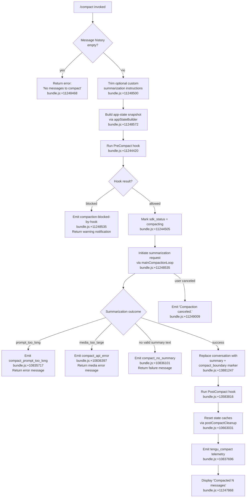

# `/compact`

> Analysis basis: CC v2.1.181 bundle.js (AST extraction + Claude interpretation)
> Minimum version: v2.1.181

---

## Overview

`/compact` frees up context window space by replacing the current conversation history with an AI-generated summary, optionally guided by custom summarization instructions supplied as an argument. The command orchestrates a multi-phase pipeline: hook invocation, API-based summarization, conversation replacement, and post-compact cleanup with telemetry reporting throughout.

---

## Registration

| Field | Value |
|---|---|
| type | `local` |
| name | `compact` |
| description | `Free up context by summarizing the conversation so far` |
| argumentHint | `<optional custom summarization instructions>` |
| supportsNonInteractive | `true` |
| thinClientDispatch | `post-text` |
| module_id | `hol` |
| load_inline | `true` |
| loc_byte | `11249436` |
| loc_byte_end | `11249736` |
| arbor_handler.name | `v5p` |
| arbor_handler.fqn | `claude-2.1.181::v5p` |
| arbor_handler.kind | `AsyncFunction` |
| arbor_handler.resolution_path | `module_id` |
| arbor_handler.n_hits | `0` |

Analysis basis: CC v2.1.181 bundle.js:+11249436

---

## Input Branching

The handler has 4+ distinct branches: no messages guard, hook-blocked path, success path, and multiple error paths (prompt-too-long, no-summary, API error, canceled). A Mermaid flowchart is required.



---

## Behavioral Spec

### Entry point: main handler (v5p)

```
async function compactCommandHandler(context, userArgument):
    // Guard: no history
    if conversationHistory is empty:
        throw Error("No messages to compact")   // bundle.js:+11248468

    // Parse optional custom instructions
    customInstructions = userArgument.trim()    // bundle.js:+11248500

    // Build system prompt + app state context
    appState = buildAppStateSnapshot(context)   // bundle.js:+11248572

    // Invoke PreCompact lifecycle hook
    hookResult = await runPreCompactHook(appState)  // bundle.js:+11244420, +11244443

    if hookResult.blocked:
        emitNotification("compaction-blocked-by-hook", "warning")  // bundle.js:+10833654
        return

    // Update SDK status indicator
    setSDKStatus("compacting")   // bundle.js:+11244505

    // Delegate to core compaction loop
    result = await mainCompactionPipeline(context, customInstructions)  // bundle.js:+11248535

    if result.canceled:
        display("Compaction canceled.")   // bundle.js:+11249009
        return

    if result.error:
        handleCompactionError(result)
        return

    // On success, update conversation state
    replaceConversationWithSummary(result.summary)  // bundle.js:+13881247

    // Post-compact lifecycle
    await runPostCompactHook()   // bundle.js:+13583816
    await postCompactCleanup()   // bundle.js:+10663031

    // Telemetry
    emitTelemetry("tengu_compact", metrics)  // bundle.js:+10837696

    display("Compacted " + messageCount + " messages")  // bundle.js:+11247868
```

Analysis basis: CC v2.1.181 bundle.js:+11248437, +11248535, +11248558

---

### Sub-feature: Conversation summarization pipeline (w5p → mainCompactionLoop)

```
async function mainCompactionPipeline(context, customInstructions):
    startTime = performance.now()   // bundle.js:+11244526

    // Collect current system prompt and conversation segments
    [systemPromptData, conversationGroups] = await Promise.all([
        buildSystemPromptContext(context),   // bundle.js:+11244590
        collectConversationGroups(context)
    ])

    // Pre-compute compaction eligibility (sepia_moth feature flag)
    if precomputeCompactionEnabled:          // bundle.js:+10654395
        checkPrecomputedCompactCache()

    // Send summarization request to API
    summaryResponse = await requestSummarization(
        systemPromptData,
        conversationGroups,
        customInstructions
    )  // bundle.js:+11244749, +11244980

    // Handle API errors
    if summaryResponse.error == "prompt_too_long":
        emit("tengu_compact_ptl_retry")      // bundle.js:+10835757
        retryWithTrimmedContext()
    elif summaryResponse.error == "media_too_large":
        return { error: "media_too_large" }  // bundle.js:+11245602

    // Validate summary text
    if summaryText is empty or null:
        emit("compact_no_summary")           // bundle.js:+10836101
        return { error: "no_summary" }

    // Cache sharing / prefix caching
    attemptCacheSharingForSummary(summaryResponse)  // bundle.js:+10846326

    // Reconstruct boundary
    boundaryUUID = generateUUID()
    markBoundary("compact_boundary", boundaryUUID)  // bundle.js:+13881247

    elapsed = performance.now() - startTime
    recordMetrics("compact_end", elapsed)   // bundle.js:+11246355

    return { summary: summaryText, metrics: ... }
```

Analysis basis: CC v2.1.181 bundle.js:+11244526, +11244590, +11244676, +11244749, +11244980, +11245863

---

### Sub-feature: Conversation boundary insertion (rGn / CH)

```
function insertCompactionBoundary(messages, summaryText):
    // Locate or create a special "compact_boundary" system message
    // at index 1 (after the first system message) or index 0
    boundaryIndex = findBoundaryPosition(messages, 1, 0)  // bundle.js:+13881301, +13881306

    // The boundary message carries role "system" and type "compact_boundary"
    boundaryMessage = {
        role: "system",           // bundle.js:+13881225
        type: "compact_boundary", // bundle.js:+13881247
        content: summaryText
    }

    // Slice messages from boundaryIndex onward
    preservedTail = messages.slice(boundaryIndex)  // bundle.js:+13881400

    return [boundaryMessage, ...preservedTail]
```

Analysis basis: CC v2.1.181 bundle.js:+13881225, +13881247, +13881301, +13881306, +13881377, +13881400

---

### Sub-feature: App state snapshot builder (Aol)

```
async function buildAppStateSnapshot(context):
    appState = context.getAppState()   // bundle.js:+11247924

    // Collect last system prompt message
    lastSystemPrompt = findLastSystemPrompt(appState)  // bundle.js:+10828379

    // Build full system prompt via prompt builder (zk / systemPromptBuilder)
    fullSystemPrompt = await buildSystemPrompt(appState, {
        contextManagement: true,
        memoryInstructions: true,
        hookInstructions: true,
        environmentInfo: true
    })  // bundle.js:+11247948

    // Resolve conversation history and filter
    conversationMessages = Array.from(getConversationMessages(appState))  // bundle.js:+11247991

    // Identify prior compact boundaries
    priorBoundary = findPriorBoundaryMarker(conversationMessages)

    return {
        systemPrompt: fullSystemPrompt,
        messages: conversationMessages,
        priorBoundary: priorBoundary,
        appState: appState
    }
```

Analysis basis: CC v2.1.181 bundle.js:+11247924, +11247948, +11247991, +11248002

---

### Sub-feature: Post-compact cleanup (Vte / postCompactCleanup)

```
async function postCompactCleanup(context):
    // Clean up precomputed compact cache entries
    clearPrecomputedCompactCache()       // bundle.js:+10640973

    // Clear other turn-scoped caches
    clearTurnCaches()                    // bundle.js:+6666713, +6666725

    // Reset autonomous loop delivery counter
    resetAutonomousLoopDelivered()       // bundle.js:+10663158

    // Restore app values to post-compact defaults
    restoreContextWindowValues()         // bundle.js:+10663208

    // Reconstruct SDK status
    setSDKStatus("ready")

    // Trigger action toggle (transcript view)
    context.dispatchAction("app:toggleTranscript")  // bundle.js:+11247729

    // Display compacted count in UI
    displayCompactedMessage()            // bundle.js:+11247868
```

Analysis basis: CC v2.1.181 bundle.js:+10663031, +10663082, +10663097, +10663126, +10663132, +10663158, +10663208

---

### Sub-feature: Compaction error handling

```
function handleCompactionError(errorType, errorMessage):
    match errorType:
        case "prompt_too_long":
            displayError("Compaction failed · conversation could not be reduced below the context limit")
            // bundle.js:+11245480
            emit("tengu_compact_ptl_retry")

        case "media_too_large":
            displayError("Compaction failed · attached media exceeds size limits")
            // bundle.js:+11245602
            emit("tengu_compact_failed")  // bundle.js:+10849601

        case "no_summary":
            displayError("Failed to generate conversation summary - response did not contain valid text content")
            // bundle.js:+10836130
            emit("tengu_compact_failed")

        case "api_error":
            displayError("unknown error")  // bundle.js:+11245726
            emit("tengu_compact_api_error")  // bundle.js:+10836397

        case "fable_no_fallback":
            displayError("Compaction unavailable: your model policy only allows Fable 5, which requires usage credits · /model to set it up")
            // bundle.js:+10847876
            emit("compact_no_allowed_fallback")  // bundle.js:+10847833
```

Analysis basis: CC v2.1.181 bundle.js:+11245480, +11245602, +11245726, +10836130, +10847876

---

### Sub-feature: Reactive compaction mode (w5p / Pmo → reactiveCompactionLoop)

Reactive compaction triggers automatically as context approaches limits, sharing most logic with `/compact` but invoked without user action.

```
async function reactiveCompactionLoop(context):
    // Must have ≥ 2 conversation groups
    if groupCount < 2:
        emit("too_few_groups")          // bundle.js:+5230695
        log("Reactive compact: fewer than 2 groups, nothing to compact")
        return

    // Must have at least one assistant message
    if noAssistantMessagesInSummarizeSet:
        log("Reactive compact: no assistant messages in summarize set, bailing")
        return

    attempt = await summarizeConversationSegment(context)

    if attempt.mediaError:
        log("Reactive compact: summarize hit media-size error, retrying stripped")
        retryWithStrippedMedia()          // bundle.js:+5232296

    if attempt.summaryEmpty:
        log("Reactive compact: empty summary text in summarization response")
        return { status: "failed" }

    emit("tengu_reactive_compact_succeeded")  // bundle.js:+10669534
    return { status: "ok" }               // bundle.js:+5231727
```

Analysis basis: CC v2.1.181 bundle.js:+5230605, +5230695, +5231169, +5231727, +10669534

---

## State & Side Effects

| Item | Detail |
|---|---|
| Telemetry: tengu_compact | Fired on successful manual compact, carries metrics (bundle.js:+10837696) |
| Telemetry: tengu_compact_failed | Fired when compaction cannot complete (bundle.js:+10849601) |
| Telemetry: tengu_compact_ptl_retry | Fired when prompt-too-long triggers retry (bundle.js:+10835757) |
| Telemetry: tengu_compact_cache_prefix | Fired when cache prefix sharing succeeds (bundle.js:+10835281) |
| Telemetry: tengu_compact_cache_sharing_success | Cache sharing success path (bundle.js:+10846326) |
| Telemetry: tengu_compact_cache_sharing_fallback | Cache sharing fallback path (bundle.js:+10846956) |
| Telemetry: tengu_reactive_compact_succeeded | Fired on reactive auto-compact success (bundle.js:+10669534) |
| Telemetry: tengu_reactive_compact_failed | Fired on reactive auto-compact failure (bundle.js:+10667065) |
| Telemetry: tengu_reactive_compact_attempt | Fired on each reactive compact attempt (bundle.js:+5231414) |
| Telemetry: tengu_precomputed_compact_consumed | Precomputed compact cache hit (bundle.js:+10661705) |
| Telemetry: tengu_precomputed_compact_discarded | Precomputed compact cache miss/discarded (bundle.js:+10662344) |
| Telemetry: tengu_post_compact_file_restore_success | Post-compact file restore succeeded (bundle.js:+10850854) |
| Telemetry: tengu_post_compact_file_restore_error | Post-compact file restore failed (bundle.js:+10850896) |
| Telemetry: tengu_compact_credits_clamp_rescue | Credit clamp rescue during compaction (bundle.js:+5231257) |
| Telemetry: tengu_sepia_moth | Precomputed compaction feature flag check (bundle.js:+10654353) |
| Telemetry: tengu_run_hook | Hook execution for PreCompact/PostCompact (bundle.js:+13604319) |
| Hook registration: PreCompact | Invoked before summarization begins; can block compaction (bundle.js:+13550049) |
| Hook registration: PostCompact | Invoked after conversation replacement (bundle.js:+13583816) |
| appState changes | Conversation history replaced with `[compact_boundary system message + preserved tail]` (bundle.js:+13881247) |
| appState changes | SDK status cycles through `"compacting"` → reset to ready (bundle.js:+11244505) |
| Cache clearing | Precomputed compact cache, turn caches, autonomous loop counter all cleared on completion (bundle.js:+10663031) |
| UI action | Dispatches `"app:toggleTranscript"` (Ctrl+O) to update transcript view after compact (bundle.js:+11247729) |
| Sound | <!-- TODO: not found in depth-2 traversal; needs --depth 4 --> |

---

## Version History

| Version | Change |
|---|---|
| v2.1.181 | Initial analysis |

---

## Common Mistakes

1. **Running `/compact` on an empty conversation**: The command immediately errors with "No messages to compact" (bundle.js:+11248468). Ensure at least one exchange has occurred before invoking.
2. **Assuming all history is preserved**: Compaction replaces the conversation before the boundary marker. Only the summary and messages after the `compact_boundary` remain accessible to the model.
3. **Expecting custom instructions to override system behaviour**: The optional argument is passed as summarization guidance only; it does not change which model is used or bypass the PreCompact hook.
4. **Ignoring "compaction blocked" notifications**: A PreCompact hook returning a block decision silently prevents compaction. Check hook configurations if `/compact` appears to do nothing.
5. **Conflating manual `/compact` with reactive compaction**: Reactive compaction (triggered automatically near context limits) uses the same pipeline but requires ≥ 2 conversation groups and emits separate telemetry (`tengu_reactive_compact_*`).
6. **Using `/compact` when the model is Fable 5 without usage credits**: Compaction may emit `compact_no_allowed_fallback` and display an error directing the user to `/model` (bundle.js:+10847876).

---

## Appendix — Identifier Mapping

> For bundle debugging only. Identifiers change across versions.

| Identifier | Role |
|---|---|
| `v5p` | Main async handler for `/compact` command (Arbor-resolved entry point) |
| `w5p` | Main compaction pipeline orchestrator (manual + pre-compact setup) |
| `CH` | Conversation boundary inserter |
| `rGn` | Boundary message constructor |
| `LT` | Low-level utility (shared) |
| `Z4` | Message history access helper |
| `Lr` | Logging/reporting utility |
| `ut` | Conversation message utility (shared) |
| `Ygn` | MCP/hook registration tracker |
| `V1r` | Hook event emitter |
| `Q1r` | Hook queue runner |
| `It` | Config file loader/watcher |
| `w_e` | Config file read/write helper |
| `Byf` | File watcher (watchFile/unwatchFile) |
| `DI` | API client builder |
| `rBp` | API request builder |
| `cve` | Model resolution helper |
| `J5n` | System prompt assembler |
| `zY` | System context collector (hooks, env) |
| `wd` | System prompt section builder |
| `IO` | Feature flag reader |
| `DC` | Model capability classifier |
| `DR` | Effort/thinking setting resolver |
| `Zk` | System prompt orchestrator |
| `Mt` | Working directory / env info builder |
| `sx` | Hook execution engine |
| `sB` | Policy settings loader |
| `I` | Log level / debug helper |
| `T_e` | Hook type-to-event mapper |
| `xLo` | Plugin/hook loader |
| `HOl` | Hook output parser |
| `LLo` | Third-party hook filter |
| `EOl` | Hook error collector |
| `Re` | JSON serializer utility |
| `ke` | Hook error reporter |
| `Me` | App state setter |
| `sOe` | Hook input stringifier |
| `vM` | Timeout/abort controller |
| `Jle` | Hook UUID generator |
| `xP` | Hook context builder |
| `_zn` | DSO/MSO hook dispatcher |
| `ILo` | MCP tool hook dispatcher |
| `Szn` | Hook output normalizer |
| `Nce` | Plugin metrics aggregator |
| `TLo` | HTTP hook executor |
| `gOl` | Script hook executor |
| `bzn` | Subprocess hook spawner |
| `FBe` | Hook callback runner |
| `xe` | App state fetcher (hook context) |
| `E8` | Telemetry event emitter |
| `DBe` | MCP server connection manager |
| `bQn` | MCP connection result applier |
| `kOo` | MCP client registry |
| `Aol` | App state snapshot builder |
| `zk` | Full system prompt orchestrator |
| `zLo` | System prompt section: environment |
| `Go` | Model identifier parser |
| `_6n` | Agent-type lister |
| `Kr` | Turn-scope logger |
| `qXe` | Pewter-owl feature check |
| `Khf` | Autonomy / output style section builder |
| `zhf` | Irreversible-action confirmation section |
| `Yhf` | Confirmation reminder section |
| `cAn` | Fable model name checker |
| `Hj` | Network/connection checker |
| `Gfi` | Tool permission context builder |
| `QLo` | Tool context system prompt section |
| `Cgf` | Tool context orchestrator |
| `jW` | Turn logger (named) |
| `cgf` | Scheduled-context section builder |
| `Rxt` | Memory/CLAUDE.md loader |
| `Hgf` | Environment info (static) |
| `ggf` | Environment info (simple/git) |
| `ygf` | Output style section builder |
| `W$n` | Scratchpad/bg-session section builder |
| `Sgf` | Brief mode section builder |
| `Igf` | Flag settings section builder |
| `pgf` | Base system prompt selector |
| `Zhf` | Heron-brook experiment section |
| `egf` | Amber-sextant section builder |
| `w8a` | MCP instruction delta section |
| `dgf` | KLo section delegator |
| `ogf` | Orchid-mantis section builder |
| `sgf` | Verified-vs-assumed section builder |
| `igf` | QLo section delegator |
| `agf` | YC section builder |
| `ugf` | QW section builder |
| `kAi` | Memory directory helper |
| `PTe` | Anthropic AWS / Bedrock config |
| `OOl` | Context-management strategy selector |
| `Pr` | Last-system-prompt finder |
| `R5n` | System prompt part builder (role R5) |
| `P5n` | System prompt part builder (role P5) |
| `rB` | Bypass-permissions mode guard |
| `d6` | Agent memory loader |
| `jc` | Background session identifier |
| `rw` | Tool registry builder |
| `Mr` | Module export wrapper |
| `cH` | Main-thread system prompt channel |
| `$e` | Rht-based state container |
| `Qe` | Rht-based state container (read) |
| `F5n` | Context hint builder |
| `UAo` | User agent / API header builder |
| `L5p` | Compaction result applier |
| `wmo` | Pending-turn waiter |
| `Edt` | Precomputed compact consumer |
| `$4n` | Main API call setup |
| `Gg` | API metrics aggregator |
| `us` | Rht state container (usage) |
| `xmo` | Conversation slicer for boundary |
| `G4n` | Precomputed compact discard recorder |
| `V4n` | Single-turn query executor (yut entry) |
| `qUe` | Agent prefix classifier |
| `Z2` | Agent custom prefix check |
| `hT` | Model header builder |
| `gUi` | Model capability loader |
| `tee` | Model tier lookup |
| `kMt` | Header entry transformer |
| `_2e` | Disallowed-tool filter |
| `A7` | Tool schema builder |
| `aRt` | Cache-prefix tool writer |
| `T2e` | Cache file writer |
| `gWe` | Gemini/worktree flag |
| `bdt` | Audio tool capability loader |
| `z9t` | UUID generator (crypto) |
| `WY` | Tool array combiner |
| `z2p` | Tool array check |
| `K2p` | Tool array merger |
| `mFp` | Full tool + message payload builder |
| `z4n` | Tool call result collector |
| `Q4n` | App-state tool result reader |
| `Y4n` | Tool result normalizer (kM/xM) |
| `J4n` | Plan-file tool result builder |
| `X4n` | Tool value extractor |
| `Xge` | Tool type A initializer |
| `lke` | Tool result collator |
| `A6e` | Tool type B initializer |
| `mi` | Message ID generator |
| `$8` | Plugin hook loader |
| `cke` | System context + hook combiner |
| `Omo` | Message at-index accessor |
| `w6e` | Tool filter (ANT/KQn) |
| `LCn` | Token-count rounder |
| `wCn` | Token count reporter |
| `IL` | Conversation message normalizer |
| `Wm` | Token math rounder |
| `zId` | Token stats tracker |
| `Ek` | DC+DR combined resolver |
| `Uh` | App-state getter (Uh) |
| `Pmo` | Reactive compaction orchestrator |
| `YCn` | Reactive compaction loop |
| `ARt` | CH-based boundary helper |
| `h2i` | Context ratio calculator |
| `XCd` | Summarization API caller |
| `JCd` | Gap analysis helper |
| `jMt` | BMt-based model map |
| `n5` | Path sanitizer |
| `mUi` | mUi UI metric |
| `Ut` | App state updater (Ut) |
| `Ee` | String coercer |
| `Vte` | Post-compact cleanup orchestrator |
| `j4n` | Turn-cache cleaner |
| `MMt` | qx-based state |
| `Ogt` | Ogt flag check |
| `Fgt` | fx/mre feature flag |
| `N4n` | LXa cache clear |
| `tZi` | eOt/mKr cache clear |
| `CNa` | CNa state |
| `Yxe` | Yxe state |
| `CE` | AWe/Object.values checker |
| `Dmo` | Post-compact state reset |
| `y2e` | sRt state setter |
| `mol` | Transcript toggle + display |
| `k4e` | Model key lookup |
| `u_p` | Model resolution (xK/nee) |
| `UC` | keybinding/action handler |
| `vEn` | vEn state container |
| `wEn` | wEn session action |
| `DCe` | OTEL metrics publisher |
| `Pu` | Metrics resource attribute builder |
| `b$e` | OTEL attribute assembler |
| `yut` | Full per-turn query runner |
| `iOt` | OTel span creator |
| `RF` | Active trace tracker |
| `snt` | Session notification handler |
| `zCn` | Text trimmer |
| `Pn` | PTY / daemon subprocess channel |
| `XQa` | Core per-turn agent loop |
| `hKa` | h9t interval helper |
| `AKa` | h9t retry helper |
| `Vx` | Turn streaming manager |
| `B$n` | App state update with UUID |
| `gF` | Random token generator |
| `uce` | Au/w6e combo |
| `h6` | Post-turn handler |
| `l4e` | wgp tracker |
| `oMa` | oMa combo |
| `Lge` | LT/Ghp filter |
| `h2p` | j/$e/Ur state bundle |
| `XCn` | Array normalizer |
| `Obe` | Ny/ZS normalizer |
| `UAe` | MTe/aae token limit |
| `MTe` | Context window limit table |
| `aae` | Max-token parser |
| `gM` | Message findLast helper |
| `KCn` | VCn/summary tag wrapper |
| `VCn` | Summary tag finder |
| `qn` | t-based state |
| `T` | Keyboard/math input handler |
| `x` | mlc/Xp input processor |
| `E` | Math min/max range |
| `T2p` | Qe/$e state pair |
| `mJ` | mJ turn metric |
| `w4t` | Tool registry lookup |
| `t7` | Model tier string normalizer |
| `Voe` | ggt/Gvr tool lookup |
| `Z0e` | e.some/Vc check |
| `dMt` | Tool search enablement resolver |
| `Y2p` | Tool search turn builder |
| `Zjr` | e.map/E2p/flatMap message rebuilder |
| `E2p` | Array-is-array message checker |
| `S2p` | Message filter |
| `b2p` | Message map/normalizer |
| `NAo` | qQa/Array.isArray normalizer |
| `qQa` | charCodeAt/slice splitter |
| `Ytt` | yC/YIn/i$i hook registrar |
| `yC` | nc/Go/Hj validator |
| `YIn` | PGr input normalizer |
| `i$i` | LRe/xRe replacer |
| `ife` | Ug/NE/cL/sfe/MU/Tl input formatter |
| `Ug` | gs/lL helper |
| `NE` | Pbe normalizer |
| `cL` | zcn cleaner |
| `sfe` | JCr selector |
| `MU` | L2s/Tl/nc model prompt formatter |
| `Tl` | Multi-turn conversation assembler |
| `Mut` | JAo/_1l main agent loop |
| `JAo` | Y5n/X5n fallback request builder |
| `_1l` | Full agent run loop (very large) |
| `oFn` | It/Go object entries filter |
| `mx` | fx-based metric |
| `L` | Daemon supervisor loop |
| `w` | Az/Date.now/Math.min window tracker |
| `W` | Grace clock / scheduled task manager |
| `k` | d.write/j key handler |
| `Ujt` | aKn/QDl.freemem memory checker |
| `ZDl` | ut-based daemon state |
| `H$e` | cT lstat/rm/readFile file manager |
| `lKn` | ut-based rate guard |
| `K` | V.preventDefault handler |
| `wC` | X_/Qe nonconforming wrapper |
| `X_` | Rht-based value |
| `Ur` | X_/Qe state reader |
| `Rp` | Tf/b1e/Wcn/ofe/Foe model display |
| `Tf` | e.replace formatter |
| `b1e` | toLowerCase/Object.values model mapper |
| `Wcn` | _2s/KCr/E2s gateway model |
| `ofe` | It/Array.isArray checker |
| `Foe` | e.endsWith/Go suffix checker |
| `B8` | Array.isArray block checker |
| `KQa` | Slice/int/Wtt/DI history trimmer |
| `int` | t.push/n.push accumulator |
| `Wtt` | jAe/eRt token estimator |
| `jAe` | Array.isArray/t.some validator |
| `eRt` | e.match/parseInt token counter |
| `X1` | e.startsWith prefix checker |
| `O` | UEl/lj/k.enqueue output queue |
| `lj` | kc connector |
| `kc` | uy/It invoker |
| `Vm` | r2/mg/gr/qve.join/Lt model identifier |
| `r2` | fx resolver |
| `gr` | fx resolver |
| `tw` | b9/hl/rt/ut tool-use writer |
| `b9` | b9 state |
| `hl` | String formatter |
| `hRt` | YCd output formatter |
| `YCd` | t.replace/t.match summary cleaner |
| `u7` | lae/tee model tier check |
| `lae` | Ptt.has tier lookup |
| `YQa` | mJ/Ee/RI turn summary reporter |
| `RI` | Lr/Ax/fvd rolling buffer |
| `fvd` | X2i/d8r cache |
| `oOt` | oOt cleanup |
| `bBe` | e.setStatus status setter |
| `BAo` | rt-based post-compact helper |