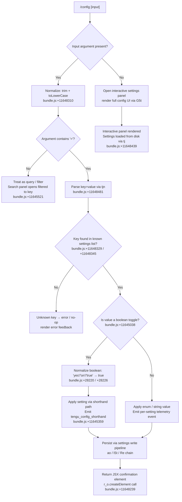

# `/config`

> Analysis basis: CC v2.1.181 bundle.js (AST extraction + Claude interpretation)
> Minimum version: v2.1.181

---

## Overview

`/config` (aliased as `/settings`) opens an interactive settings panel that lets the user read and toggle a broad set of Claude Code preferences — from model selection and thinking mode to notifications, UI behavior, MCP connections, and feature flags. The command parses an optional `key=value` argument to directly apply or query a single setting without opening the full panel, and emits per-setting telemetry events on every change.

---

## Registration

| Field | Value |
|---|---|
| type | `local-jsx` |
| name | `config` |
| description | `Open settings` |
| aliases | `["settings"]` |
| argumentHint | `[key=value]` |
| module_id | `Dil` |
| load_inline | `true` |
| loc_byte | `11649164` |
| loc_byte_end | `11649323` |
| loc_line | `7001` |
| arbor_handler.name | `Gjp` |
| arbor_handler.fqn | `claude-2.1.181::Gjp` |
| arbor_handler.kind | `AsyncFunction` |
| arbor_handler.resolution_path | `module_id` |
| arbor_handler.n_hits | `0` |

Analysis basis: CC v2.1.181 bundle.js:+11649164

---

## Input Branching

Five or more distinct execution paths exist depending on argument presence, argument format, and the identity of the setting key. A Mermaid flowchart is used.



---

## Behavioral Spec

### 1. Entry Point and Argument Normalization

The async handler `Gjp` (Arbor-resolved; `claude-2.1.181::Gjp`) receives the raw argument string. It immediately trims whitespace and lowercases the value before any further processing.

```
async function configCommandHandler(rawInput, context):
    normalized = rawInput.trim().toLowerCase()         // bundle.js:+11648310

    if normalized is empty:
        return renderSettingsPanel(context)            // bundle.js:+11648239

    if normalized includes '=':
        [key, value] = parseKeyValue(normalized)       // tjn — bundle.js:+11648481
        return applySettingShorthand(key, value, context)
    else:
        return renderSettingsPanel(context, filterText=normalized)
```

Analysis basis: CC v2.1.181 bundle.js:+11648239, +11648310

---

### 2. Key=Value Parsing (`tjn`)

The key-value parser (`tjn`) splits on `=`, handles multi-`=` values by rejoining the remainder, and trims both sides. It then checks membership against two known-key sets (identifiers `C9` and `Zre`) to validate the key.

```
function parseKeyValue(input):
    trimmed = input.trim()                              // bundle.js:+11644971
    if not trimmed.includes('='):
        return { key: trimmed, value: null }            // bundle.js:+11644988
    parts = trimmed.split('=')                          // bundle.js:+11645038
    idx   = parts.indexOf(parts[0])                    // bundle.js:+11645060
    key   = parts[0]
    valueParts = []
    valueParts.push(...)                               // bundle.js:+11645095
    value = parts.slice(idx + 1).join('=')             // bundle.js:+11645107
    return { key, value }
```

Analysis basis: CC v2.1.181 bundle.js:+11644971–11645107

---

### 3. Settings Panel Rendering (`njn` → `G5t`)

When no valid `key=value` shorthand is detected, or when the command is invoked without arguments, the full settings panel is rendered by `njn` which delegates to the large settings component `G5t`. The component maps known setting identifiers to React elements.

```
function renderSettingsPanel(context, filterText=""):
    settingsState = loadSettingsFromDisk()             // tj — bundle.js:+11648439
    rows = buildSettingRows(settingsState)             // G5t — bundle.js:+11645265
    if filterText:
        rows = rows.filter(row => row.key.includes(filterText))
    return createElement(SettingsPanelComponent, { rows, context })
```

Analysis basis: CC v2.1.181 bundle.js:+11648594, +11645265, +11645269

---

### 4. Settings Persistence Pipeline (`ao` → `lSt` / `Re`)

All mutations to settings flow through a layered write pipeline. Settings are segmented by scope:

| Scope key | File path constant |
|---|---|
| `userSettings` | `~/.claude/settings.json` (bundle.js:+1329880) |
| `projectSettings` | `.claude/settings.json` (bundle.js:+1329995) |
| `localSettings` | `.claude/settings.local.json` (bundle.js:+1330018) |
| `policySettings` | policy layer (bundle.js:+1329234) |
| `flagSettings` | flag layer (bundle.js:+1329256) |

The write function (`lSt`) uses atomic file replacement with a temp-file + rename strategy and acquires a file lock to prevent concurrent writes. The fallback path constant `".claude"` and file names `"settings.json"` / `"settings.local.json"` are confirmed literals (bundle.js:+1310058, +1310068, +1310130).

```
function persistSetting(scope, key, value):
    lockPath = resolveLockPath(scope)
    acquireLock(lockPath)                              // lSt — bundle.js:+1329899
    current = readSettingsFile(scope)
    current[key] = value
    serialized = JSON.stringify(current)               // Re — bundle.js:+1329905
    writeTempAndRename(serialized, targetPath)         // lSt atomic write
    clearSettingsCache()                               // fH — bundle.js:+1330041
    releaseLock(lockPath)
```

Lock contention is telemetry-tracked (`tengu_config_lock_contention`, bundle.js:+13939228). Auth-loss prevention is enforced: if the cached config contains auth data that the re-read file does not, the write is aborted and `tengu_config_auth_loss_prevented` is emitted (bundle.js:+13939707). Stale writes are tracked via `tengu_config_stale_write` (bundle.js:+13939364).

Analysis basis: CC v2.1.181 bundle.js:+1329899, +1329905, +1330041, +13939228, +13939707

---

### 5. Individual Setting Rows Rendered by `G5t`

The settings component `G5t` contains all known setting rows. The following table summarizes each setting key, its UI label, and supporting telemetry event, extracted from literals.

| Setting Key | UI Label | Telemetry Event | loc_byte |
|---|---|---|---|
| `model` | `Model` / `Default (recommended)` | `tengu_config_model_changed` | +11327007 |
| `verbose` | `Verbose output` / `Verbose` | <!-- TODO: not found in depth-2 traversal; needs --depth 4 --> | +11327414 |
| `preferredNotifChannel` | `Notifications` | `tengu_push_notif_pref_changed` | +11327867 |
| `inputNeededNotifEnabled` | `Push when actions required` | `tengu_push_notif_pref_changed` | +11327667 |
| `agentPushNotifEnabled` | `Push when Claude decides` | `tengu_push_notif_pref_changed` | +11327971 |
| `autoCompact` / `autoCompactEnabled` | `Auto-compact` | `tengu_auto_compact_setting_changed` | +11328421 |
| `switchModelsOnFlag` | — | `tengu_refusal_fallback_setting_changed` | +11328659 |
| `tips` | `Show tips` | `tengu_tips_setting_changed` | +11328890 |
| `reduceMotion` | `Reduce motion` | `tengu_reduce_motion_setting_changed` | +11329188 |
| `thinking` / `thinking_toggle` | `Thinking mode` | `tengu_thinking_toggled` | +11329409 |
| `fast` | `Fast mode` | `tengu_penguins_off` (availability check) | +11329490 |
| `promptSuggestionEnabled` | `Prompt suggestions` | `tengu_chomp_inflection` | +11329850 |
| `recap` | `Session recap` | `tengu_sedge_lantern` | +11330084 |
| `checkpoints` / `fileCheckpointingEnabled` | `Rewind code (checkpoints)` | `tengu_file_history_snapshots_setting_changed` | +11330527 |
| `workflows` / `workflowKeywordTriggerEnabled` | `Dynamic workflows` / `Ultracode keyword trigger` | `tengu_maple_sundial` | +11323108 |
| `progressBar` / `terminalProgressBarEnabled` | `Terminal progress bar` | `tengu_terminal_progress_bar_setting_changed` | +11331517 |
| `showStatusInTerminalTab` | `Show status in terminal tab` | `tengu_terminal_tab_status_setting_changed` | +11331832 |
| `turnDuration` / `showTurnDuration` | `Show turn duration` | `tengu_show_turn_duration_setting_changed` | +11332056 |
| `precomputeCompactionEnabled` | `Precompute compaction` | `tengu_precompute_compaction_setting_changed` | +11332376 |
| `timestamps` / `showMessageTimestamps` | `Show message timestamps` | `tengu_show_message_timestamps_setting_changed` | +11332691 |
| `permissionMode` | `Default permission mode` | <!-- TODO: not found in depth-2 traversal; needs --depth 4 --> | +11332762 |
| `worktreeBaseRef` | `Worktree base ref` | <!-- TODO: not found in depth-2 traversal; needs --depth 4 --> | +11333377 |
| `useAutoModeDuringPlan` | `Use auto mode during plan` | <!-- TODO: not found in depth-2 traversal; needs --depth 4 --> | +11333816 |
| `gitignore` | `Respect .gitignore in file picker` | `tengu_respect_gitignore_setting_changed` | +11334382 |
| `copyFullResponse` | `Skip the /copy picker` | <!-- TODO: not found in depth-2 traversal; needs --depth 4 --> | +11334443 |
| `copyOnSelect` | `Copy on select` | <!-- TODO: not found in depth-2 traversal; needs --depth 4 --> | +11334632 |
| `autoScroll` / `autoScrollEnabled` | `Auto-scroll output` | <!-- TODO: not found in depth-2 traversal; needs --depth 4 --> | +11334793 |
| `agentsView` / `defaultToAgentsView` | `Agents view` / `Open agents view by default` | <!-- TODO: not found in depth-2 traversal; needs --depth 4 --> | +11334999 |
| `leftArrowOpensAgents` | — | <!-- TODO: not found in depth-2 traversal; needs --depth 4 --> | +11335385 |
| `autoUpdatesChannel` | `Auto-update channel` | <!-- TODO: not found in depth-2 traversal; needs --depth 4 --> | +11335589 |
| `theme` | `Theme` | <!-- TODO: not found in depth-2 traversal; needs --depth 4 --> | +11335852 |
| `notifChannel` | `Notifications` | <!-- TODO: not found in depth-2 traversal; needs --depth 4 --> | +11335978 |
| `outputStyle` | `Output style` | <!-- TODO: not found in depth-2 traversal; needs --depth 4 --> | +11336482 |
| `defaultView` | `Default view` | `tengu_default_view_setting_changed` | +11337027 |
| `language` | `Language` | <!-- TODO: not found in depth-2 traversal; needs --depth 4 --> | +11337098 |
| `editor` / `editorMode` | `Editor mode` | `tengu_editor_mode_changed` | +11337385 |
| `externalEditorContext` | `Show last response in external editor` | `tengu_external_editor_context_changed` | +11337700 |
| `prStatus` | `Show PR status footer` | `tengu_pr_status_footer_setting_changed` | +11338014 |
| `diffTool` | `Diff tool` | `tengu_diff_tool_changed` | +11338343 |
| `autoConnectIde` | `Auto-connect to IDE (external terminal)` | `tengu_auto_connect_ide_changed` | +11338615 |
| `autoInstallIdeExtension` | `Auto-install IDE extension` | `tengu_auto_install_ide_extension_changed` | +11338919 |
| `chrome` | `Claude in Chrome` | `tengu_claude_in_chrome_setting_changed` | +11339255 |
| `teammateMode` | `Teammate mode` | `tengu_teammate_mode_changed` | +11339622 |
| `teammateDefaultModel` | `Default teammate model` | <!-- TODO: not found in depth-2 traversal; needs --depth 4 --> | +11339672 |
| `remoteControl` / `remoteControlAtStartup` | `Enable Remote Control for all sessions` | <!-- TODO: not found in depth-2 traversal; needs --depth 4 --> | +11339814 |
| `showExternalIncludesDialog` | `External CLAUDE.md includes` | <!-- TODO: not found in depth-2 traversal; needs --depth 4 --> | +11340395 |
| `apiKey` | `Use custom API key` | <!-- TODO: not found in depth-2 traversal; needs --depth 4 --> | +11340597 |

Analysis basis: CC v2.1.181 bundle.js:+11327005–11341715

---

### 6. Boolean Normalization

For toggle-type settings the parser accepts `"yes"`, `"on"`, `"true"`, `"1"` as truthy and their opposites as falsy. Constants `"yes"` and `"on"` are confirmed literals (bundle.js:+28220, +28226). `"no"` is a confirmed falsy literal (bundle.js:+11645794).

```
function normalizeBooleanValue(raw):
    lower = raw.toLowerCase()
    if lower in ["yes", "on", "true", "1"]:
        return true
    if lower in ["no", "off", "false", "0"]:
        return false
    return INVALID
```

Analysis basis: CC v2.1.181 bundle.js:+28220, +28226, +11645794

---

### 7. Notification Preferences Patch (`wHo` / `ysl`)

When a notification-related setting changes, the handler `wHo` computes a diff against the server-side preference state and dispatches a PATCH request. The telemetry key `"notif_prefs_patch"` is emitted on attempt, `"notif_prefs_patch_ok"` on success, `"notif_prefs_patch_failed"` on HTTP failure (bundle.js:+11312971, +11313019, +11313107). If no auth token is available the code emits `"no_auth"` and skips the network call (bundle.js:+11312991).

```
async function patchNotificationPreferences(key, value, authState):
    if not authState.isAuthenticated:
        log("no_auth")                   // bundle.js:+11312991
        return
    emit("notif_prefs_patch")            // bundle.js:+11312971
    try:
        await patchRemotePrefs(key, value)
        emit("notif_prefs_patch_ok")     // bundle.js:+11313019
    catch httpError:
        emit("notif_prefs_patch_failed") // bundle.js:+11313107
        emit("http_error")               // bundle.js:+11313167
```

Analysis basis: CC v2.1.181 bundle.js:+11313203

---

### 8. Fast Mode Availability Check (`Moe`)

When the user toggles the `fast` setting, the handler verifies availability before applying. Known unavailability conditions and their display strings:

| Condition | Message constant | loc_byte |
|---|---|---|
| Not on Anthropic API | `"Fast mode is only available when using the Anthropic API directly"` | +2256982 |
| Agent SDK context | `"Fast mode is not available in the Agent SDK"` | +2257467 |
| Org status pending | `"Checking fast mode availability"` | +2257638 |
| Network error | `"network_error"` | +2257722 |
| Status unknown | `"unknown"` | +2257751 |
| Disabled | `"disabled"` | +2257687 |

Analysis basis: CC v2.1.181 bundle.js:+2257050–2257876

---

### 9. Workflow Enable/Disable Path (`kil`)

The `kil` function handles workflow-related feature flags. It reads `appState` via `e.getAppState()` (bundle.js:+11646669), checks the `disableWorkflows` / `enableWorkflows` flags (bundle.js:+11646705, +11646733), emits the appropriate telemetry, and calls `e.setAppState()` (bundle.js:+11647582) to persist. The allowed value format is `"true|false"` (literal at bundle.js:+11646592). The literal `"/config"` at bundle.js:+11646419 confirms this function is specifically scoped to the `/config` command context.

```
function applyWorkflowSetting(value, context):
    current = context.getAppState()
    if value == "true":
        flag = "enableWorkflows"          // bundle.js:+11646733
    else:
        flag = "disableWorkflows"         // bundle.js:+11646705
    newState = { ...current, [flag]: value }
    context.setAppState(newState)         // bundle.js:+11647582
    emit("tengu_config_shorthand")        // bundle.js:+11645359
```

Analysis basis: CC v2.1.181 bundle.js:+11646669–11647582

---

### 10. Settings Load from Disk (`tj` / `qtn` / `OAr`)

Settings loading is instrumented with start/end telemetry literals `"loadSettingsFromDisk_start"` and `"loadSettingsFromDisk_end"` (bundle.js:+1326808, +1326864). The loader reads up to five scopes (policy, flag, user, project, local), merges them in priority order, and caches the result. A 1024-item limit appears in the data stream processing path (bundle.js:+17000463).

```
function loadSettingsFromDisk():
    log("loadSettingsFromDisk_start")     // bundle.js:+1326808
    scopes = [policy, flag, user, project, local]
    merged = {}
    for scope in scopes:
        data = readScopeFile(scope)       // OAr — bundle.js:+1310214
        merged = deepMerge(merged, data)
    log("loadSettingsFromDisk_end")       // bundle.js:+1326864
    return merged
```

Analysis basis: CC v2.1.181 bundle.js:+1326808, +1326864

---

## State & Side Effects

| Item | Detail |
|---|---|
| Telemetry — model | `tengu_config_model_changed` (bundle.js:+11327007) |
| Telemetry — feature toggle OK | `tengu_feature_ok` (bundle.js:+1019804) |
| Telemetry — feature toggle sad | `tengu_feature_sad` (bundle.js:+1019952) |
| Telemetry — feature toggle bad | `tengu_feature_bad` (bundle.js:+1019871) |
| Telemetry — push notif pref | `tengu_push_notif_pref_changed` (bundle.js:+11327867) |
| Telemetry — auto-compact | `tengu_auto_compact_setting_changed` (bundle.js:+11328421) |
| Telemetry — refusal fallback | `tengu_refusal_fallback_setting_changed` (bundle.js:+11328659) |
| Telemetry — tips | `tengu_tips_setting_changed` (bundle.js:+11328890) |
| Telemetry — reduce motion | `tengu_reduce_motion_setting_changed` (bundle.js:+11329188) |
| Telemetry — thinking toggled | `tengu_thinking_toggled` (bundle.js:+11329409) |
| Telemetry — fast mode | `tengu_penguins_off` (bundle.js:+2257088) |
| Telemetry — prompt suggestions | `tengu_chomp_inflection` (bundle.js:+11329850) |
| Telemetry — session recap | `tengu_sedge_lantern` (bundle.js:+11330084) |
| Telemetry — checkpoints | `tengu_file_history_snapshots_setting_changed` (bundle.js:+11330527) |
| Telemetry — workflows | `tengu_maple_sundial` (bundle.js:+11323108) |
| Telemetry — progress bar | `tengu_terminal_progress_bar_setting_changed` (bundle.js:+11331517) |
| Telemetry — terminal sidebar | `tengu_terminal_sidebar` (bundle.js:+11331584) |
| Telemetry — terminal tab status | `tengu_terminal_tab_status_setting_changed` (bundle.js:+11331832) |
| Telemetry — turn duration | `tengu_show_turn_duration_setting_changed` (bundle.js:+11332056) |
| Telemetry — precompute compaction | `tengu_precompute_compaction_setting_changed` (bundle.js:+11332376) |
| Telemetry — timestamps | `tengu_show_message_timestamps_setting_changed` (bundle.js:+11332691) |
| Telemetry — gitignore | `tengu_respect_gitignore_setting_changed` (bundle.js:+11334382) |
| Telemetry — default view | `tengu_default_view_setting_changed` (bundle.js:+11337027) |
| Telemetry — editor mode | `tengu_editor_mode_changed` (bundle.js:+11337385) |
| Telemetry — external editor | `tengu_external_editor_context_changed` (bundle.js:+11337700) |
| Telemetry — PR status | `tengu_pr_status_footer_setting_changed` (bundle.js:+11338014) |
| Telemetry — diff tool | `tengu_diff_tool_changed` (bundle.js:+11338343) |
| Telemetry — auto-connect IDE | `tengu_auto_connect_ide_changed` (bundle.js:+11338615) |
| Telemetry — IDE extension | `tengu_auto_install_ide_extension_changed` (bundle.js:+11338919) |
| Telemetry — Chrome | `tengu_claude_in_chrome_setting_changed` (bundle.js:+11339255) |
| Telemetry — teammate mode | `tengu_teammate_mode_changed` (bundle.js:+11339622) |
| Telemetry — config shorthand | `tengu_config_shorthand` (bundle.js:+11645359) |
| Telemetry — config panel | literal `"config_panel"` (bundle.js:+11337431) |
| Telemetry — config lock contention | `tengu_config_lock_contention` (bundle.js:+13939228) |
| Telemetry — config stale write | `tengu_config_stale_write` (bundle.js:+13939364) |
| Telemetry — config auth loss | `tengu_config_auth_loss_prevented` (bundle.js:+13939707) |
| Telemetry — config parse error | `tengu_config_parse_error` (bundle.js:+13941803) |
| Telemetry — config fallback write | `tengu_config_fallback_write` (bundle.js:+13938844) |
| Telemetry — sepia moth | `tengu_sepia_moth` (bundle.js:+11332120) |
| Telemetry — silk hinge | `tengu_silk_hinge` (bundle.js:+11332447) |
| Telemetry — amber creek | `tengu_amber_creek` (bundle.js:+3542927) |
| Telemetry — pewter brook | `tengu_pewter_brook` (bundle.js:+3542835) |
| Telemetry — amber flint | `tengu_amber_flint` (bundle.js:+7044134) |
| Telemetry — CCR bridge | `tengu_ccr_bridge` (bundle.js:+13922806) |
| Telemetry — auto mode config | `tengu_auto_mode_config` (bundle.js:+13803047) |
| Telemetry — kairos input push | `tengu_kairos_input_needed_push` (bundle.js:+4916888) |
| Telemetry — kairos push notifs | `tengu_kairos_push_notifications` (bundle.js:+4916825) |
| Telemetry — notif pref patch events | `notif_prefs_patch` / `notif_prefs_patch_ok` / `notif_prefs_patch_failed` / `http_error` (bundle.js:+11312971–11313167) |
| appState changes | `e.setAppState()` called when workflow flags or other reactive settings change (bundle.js:+11647582) |
| Settings files written | `~/.claude/settings.json`, `.claude/settings.json`, `.claude/settings.local.json` |
| Settings cache cleared | `fH` clears two internal caches (`kKt`, `Ser`) after every write (bundle.js:+1330041) |
| Network PATCH | Notification preference changes trigger a remote PATCH when authenticated (bundle.js:+11313203) |
| Error output | `eje` uses `console.error` + red styling for CLI errors (bundle.js:+13300016, +13300030) |
| Exit code | Process exits with code `1` on CLI error via `Ps` → `process.exit` (bundle.js:+13300084) |
| Hook registration | <!-- TODO: not found in depth-2 traversal; needs --depth 4 --> |
| Sound | <!-- TODO: not found in depth-2 traversal; needs --depth 4 --> |

---

## Version History

| Version | Change |
|---|---|
| v2.1.181 | Initial analysis |

---

## Common Mistakes

1. **Forgetting the `=` separator in shorthand mode**: `/config verbose` opens the panel filtered to "verbose" rather than toggling verbose mode. Use `/config verbose=true` to set the value directly.
2. **Using `true`/`false` strings for non-boolean enums**: Settings like `permissionMode` accept enum values (`"default"`, `"plan"`, `"bypassPermissions"`) — passing `true` will be treated as an unknown enum value.
3. **Expecting immediate disk persistence for all settings**: Some settings (e.g., notification preferences) also trigger a network PATCH. If the session is unauthenticated the local write still occurs but the remote sync is silently skipped.
4. **Editing `settings.local.json` manually while Claude Code is running**: The atomic-write pipeline may overwrite manual edits. Always use `/config` to change settings while a session is active.
5. **Assuming `/settings` and `/config` are identical in all contexts**: Both names resolve to the same handler, but only `config` is listed as the canonical name; `settings` is the alias. Telemetry is emitted using the canonical name.
6. **Setting `fast` mode when not on the direct Anthropic API**: The handler actively blocks this and emits an error message rather than silently ignoring the request.

---

## Appendix — Identifier Mapping

> For bundle debugging only. Identifiers change across versions.

| Identifier | Role |
|---|---|
| `Gjp` | Main async handler for `/config` command (Arbor-resolved entry point) |
| `rjn` | Settings panel orchestrator — coordinates `G5t` and `kil` |
| `G5t` | Large settings component that renders all individual setting rows |
| `kil` | App-state settings handler (workflow flags, MCP, notification state) |
| `tjn` | Key=value argument parser |
| `njn` | Panel renderer delegator — maps input to `G5t` / `kil` |
| `Bjp` | Per-setting row change handler with `onChange` callback |
| `Fjp` | Setting key normalizer (toLowerCase + find) |
| `Np` | SHA-256 hash helper used for change fingerprinting |
| `ao` | Settings read/write coordinator (multi-scope merge) |
| `lSt` | Atomic file write with lock, temp file, rename, and fsync |
| `Re` | JSON serializer wrapper for settings objects |
| `fH` | Settings cache invalidator (clears `kKt` and `Ser`) |
| `tj` | Settings load dispatcher with start/end telemetry |
| `qtn` | Settings file path resolver (project + local paths) |
| `OAr` | Single-scope settings file reader |
| `NZo` | Gitignore file integration helper |
| `O9` | Path joiner for `.claude/settings.json` |
| `ZA` | Settings merge helper |
| `x2` | Full settings schema builder (all scope fields) |
| `Ps` | CLI error handler (prints red error, exits with code 1) |
| `eje` | Error formatter using red terminal color |
| `JT` | Config file sync writer (lower-level) |
| `jOe` | Settings object factory |
| `qmr` | Cache timestamp setter |
| `wHo` | Notification preferences PATCH dispatcher |
| `Hsl` | Notification preference state builder |
| `ysl` | Individual notification setting applier with remote patch |
| `Moe` | Fast mode availability checker and toggle handler |
| `tT` | Model/provider context builder |
| `xr` | Provider resolver |
| `afe` | Provider-to-render-target mapper |
| `lfe` | Provider label formatter |
| `da` | Model descriptor builder |
| `Rx` | Settings reload trigger |
| `Tn` | Settings transaction wrapper |
| `Qe` | React root helper |
| `Rht` | Base React component helper |
| `tCn` | Config panel telemetry emitter |
| `cc` | Component container helper |
| `rt` | String renderer / React text node |
| `aL` | Alternate component layout helper |
| `z9` | Setting description renderer |
| `Dbe` | Setting dependency checker |
| `M1e` | Model selector component |
| `ut` | React hook / state management primitive |
| `Ygn` | Hook deduplication tracker |
| `It` | Timestamp / session tracking helper |
| `hNr` | Nested settings helper |
| `gNr` | Workflow allow-list checker |
| `_pt` | Verbose output setting row builder |
| `Bke` | Verbose toggle state accessor |
| `un` | Global config save handler |
| `n7n` | Config file save with lock and backup rotation |
| `t7n` | Config file atomic write helper |
| `w_e` | Config file read helper |
| `L8t` | Timestamp recorder for config saves |
| `f0o` | Config entry iterator |
| `dMe` | Config diff helper |
| `qmt` | Config merge helper |
| `W` | Background worker / task scheduler |
| `u` | Worker lifecycle manager |
| `H` | Worker registry set |
| `h` | Worker map (id → worker) |
| `sMt` | Worker spawn timing calculator |
| `hIn` | Worker spawn backoff calculator |
| `B` | Output write-buffer with debounce |
| `_re` | Set membership tester |
| `tae` | Worker retirement filter |
| `F` | Command filter list |
| `Clt` | Command allow-list checker |
| `YW` | Command executor |
| `WO` | Bubble notification checker |
| `PKe` | Permission key extractor |
| `HR` | Handler resolver |
| `ytn` | Handler type normalizer |
| `d3e` | Permission rules builder |
| `Q6` | Permission entry enumerator |
| `Dxo` | Permission deny-list builder |
| `a2` | Permission scope resolver |
| `C_e` | Permission category mapper |
| `Ds` | Fullscreen / display mode handler |
| `qV` | Local-agent mode detector |
| `eM` | Fullscreen enable checker |
| `BUr` | Fullscreen renderer |
| `uZ` | ZJu-based display helper |
| `$Ur` | Boolean display state resolver |
| `Kr` | Config row key resolver |
| `eQu` | Enum value renderer |
| `kR` | Setting key registry |
| `zJe` | Setting key normalizer registry |
| `tX` | Setting key + value accessor |
| `_a` | Alternate value accessor |
| `yc` | Safe-mode / bare-mode flag handler |
| `Ul` | Safe-mode CLI argument processor |
| `Lp` | Bare-mode CLI argument processor |
| `h4` | String prefix stripper |
| `xHo` | Setting section header renderer |
| `gIn` | Input-needed push notification row |
| `aJ` | Setting row action dispatcher |
| `$e` | React element factory helper |
| `_l` | Agent-teams mode setting handler |
| `l6d` | Agent-teams flag accessor |
| `nYr` | Teammate model row builder |
| `rYr` | Teammate model option resolver |
| `FGn` | Full settings model selector component |
| `M3t` | Model display name builder |
| `ex` | Remote control setting handler |
| `zzn` | Remote control state reader |
| `C8t` | Remote control config accessor |
| `IW` | Remote control writer |
| `T4e` | Remote control toggle handler |
| `Jce` | Session / environment info row |
| `Mr` | Module initializer |
| `UHo` | External includes dialog handler |
| `zT` | API key setting row |
| `vU` | API key display truncator (slices to 20 chars — bundle.js:+2149355) |
| `ypt` | Settings row timestamp + key accessor |
| `Ec` | Workflow state evaluator |
| `gR` | Workflow allow-set manager |
| `n` | Lowercase normalizer helper |
| `JAr` | Settings path resolver with home directory |
| `mHn` | Workflow enable/disable animation helper |
| `ami` | Workflow allow animation |
| `Gke` | Workflow mode display label resolver |
| `N9` | Workflow mode enum |
| `Y6e` | Auto mode config row builder |
| `wxo` | Auto mode status reader |
| `rae` | Push notification input-needed row |
| `ta` | Essential traffic / telemetry row |
| `qYo` | Traffic mode renderer |
| `sb` | Display mode row |
| `yBe` | IDE extension presence checker |
| `lge` | Auto-updater environment detector |
| `JVe` | Updater channel reader |
| `Sde` | Settings section divider component |
| `E` | Math clamp helper (Math.max / Math.min) |
| `_` | Background worker orchestrator |
| `w` | Worker heartbeat / blur-focus tracker |
| `Az` | Blur state label (`"blurred"`) |
| `L` | Background sweep loop (idle/stale/low-mem retirement) |
| `v` | Worker state value accessor |
| `uQl` | Worker array tail accessor (`e.at`) |
| `X9` | Model registry loader |
| `To` | Model list fetcher |
| `Qcn` | Model record builder |
| `Ug` | Model filter helper |
| `gs` | Model alias resolver |
| `Fke` | Config-panel model list builder |
| `o` | Column padding helper (padEnd) |
| `xA` | Model availability checker |
| `Hj` | Notification channel normalizer |
| `Y1` | First-party model detector |
| `N8` | Model capability flags builder |
| `v_` | Model short-name mapper |
| `Rx` | Settings reload trigger (via `ao`) |
| `xe` | Feature flag OK emitter |
| `Ut` | Feature flag sad emitter |
| `Me` | Feature flag bad emitter |
| `Sv` | Queue helper |
| `Dn` | ENOENT error handler |
| `I` | Log-level / debug/error/warn routing helper |
| `qmr` | Cache timestamp setter |
| `gr` | FX / render helper |
| `DBe` | MCP server connection builder |
| `bQn` | MCP connection result applier |
| `kOo` | MCP client map updater |
| `a` | MCP server orchestrator (top-level) |
| `s` | Promise set tracker |
| `l` | MCP context holder |
| `i` | Stream close helper |