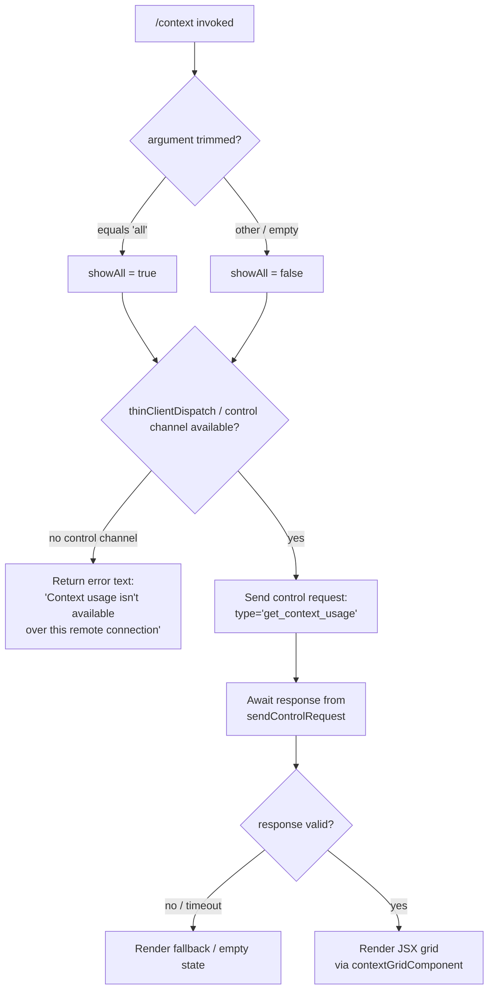

# `/context`

> Analysis basis: CC v2.1.181 bundle.js (AST extraction + Claude interpretation)
> Minimum version: v2.1.181

---

## Overview

`/context` visualizes the current conversation's context window usage as a colored grid, broken down by content category (system prompt, memory files, messages, tools, etc.). It dispatches a control request over the active connection to retrieve live token-usage data and renders a JSX component in the terminal. When invoked with the `all` argument, the visualization includes every tracked segment.

---

## Registration

| Field | Value |
|---|---|
| type | `local-jsx` |
| name | `context` |
| description | `Visualize current context usage as a colored grid` |
| argumentHint | `[all]` |
| thinClientDispatch | `control-request` |
| module_id | `tal` |
| load_inline | `true` |
| loc_byte | `11668444` |
| loc_byte_end | `11668670` |
| loc_line | `7038` |
| arbor_handler.name | `w8p` |
| arbor_handler.fqn | `claude-2.1.181::w8p` |
| arbor_handler.kind | `AsyncFunction` |
| arbor_handler.resolution_path | `module_id` |
| arbor_handler.n_hits | `0` |

Analysis basis: CC v2.1.181 bundle.js:+11668444

---

## Input Branching

Four distinct paths exist based on argument and connection type.



Analysis basis: CC v2.1.181 bundle.js:+11667038 – +11667600

---

## Behavioral Spec

### 1. Handler entry (`w8p`)

The top-level handler is the async function resolved by Arbor as `w8p`.

```
async function contextCommandHandler(options):
    rawArg = options.args?.trim()

    showAll = (rawArg === "all")          // literal "all" @ +11667069

    if not options.controlChannel:        // "controlChannel" @ +11667095
        return textResult(
            "Context usage isn't available over this remote connection"
        )                                 // literal @ +11667122

    response = await options.sendControlRequest({
        type: "get_context_usage"         // literal @ +11667234
    })

    usageData = parseUsageResponse(response)

    limit = usageData.limit ?? 80         // number 80 @ +11667580

    segmentGrid = buildContextGrid(usageData, showAll)

    return createElement(contextGridComponent, {
        segments: segmentGrid,
        limit:    limit,
        showAll:  showAll
    })
```

Analysis basis: CC v2.1.181 bundle.js:+11667038

---

### 2. Control-request dispatch

The command uses `sendControlRequest` (reachable from `o.sendControlRequest` in the call graph). The request type string is `"get_context_usage"`. The payload is dispatched over the `controlChannel`, which is the thin-client IPC path declared in the registration as `thinClientDispatch: "control-request"`.

```
function dispatchContextUsageRequest(channel):
    return channel.sendControlRequest({
        type: "get_context_usage"
    })
    // pads connection string: "  " (2-space pad) @ +17127064
```

Analysis basis: CC v2.1.181 bundle.js:+11667204

---

### 3. Grid construction (`z5t`)

`z5t` (grid builder) receives the usage response and the `showAll` flag. It produces an ordered array of colored segments.

```
function buildContextGrid(usageData, showAll):
    segments = usageData.filter(seg =>
        showAll OR seg.visible
    )                                    // n.filter @ +11665141

    systemSeg  = segments.find(s => s.type === "system")   // +11665459
    // Segment label literals found in scope:
    //   "System prompt"         @ +10867175
    //   "System tools"          @ +10867256
    //   "MCP tools"             @ +10867321
    //   "MCP tools (deferred)"  @ +10867397
    //   "System tools (deferred)" @ +10867483
    //   "Custom agents"         @ +10867572
    //   "Memory files"          @ +10867639
    //   "Messages"              @ +10868183
    //   "Skills"                @ +10867701
    //   "Free space"            @ +11665176
    //   "Autocompact buffer"    @ +11665199

    for each segment in orderedSegments:
        pct   = Math.round(segment.tokens / limit * 100)  // kre @ +218539
        color = resolveColor(segment.type)

    return grid

function resolveColor(segmentType):
    // special overrides for sub-agent roles:
    // "cyan_FOR_SUBAGENTS_ONLY"   @ +10867348
    // "purple_FOR_SUBAGENTS_ONLY" @ +10868209
    // "warning"                   @ +10867725
    // "permission"                @ +10867603
    // "claude"                    @ +10867669
    // "promptBorder"              @ +10867206
    return colorForType
```

Analysis basis: CC v2.1.181 bundle.js:+11665100

---

### 4. Number formatting (`gl` / `kre`)

Percentages are rounded and formatted with locale `"en-US"` using `"compact"` notation. The threshold tiers are:

| Threshold | Label |
|---|---|
| < 20 % | `"< 20"` (literal @ +218519) |
| ≥ 20 %, step | numeric, rounded by `Math.round` |
| Denominator step | 10 (literal @ +218552) |
| Decimal suffix | `".0"` (literal @ +218480) |

Analysis basis: CC v2.1.181 bundle.js:+218466

---

### 5. Compact-boundary marker (`v8p` / `CH`)

If a compact boundary exists in the conversation, `v8p` calls `CH` to locate and annotate it. The boundary is identified by the string `"compact_boundary"` (literal @ +13881247). The function slices the token array at that boundary offset.

```
function annotateCompactBoundary(tokenArray):
    boundary = locateBoundary(tokenArray)   // rGn @ +13881377
    if boundary found:
        return tokenArray.slice(0, boundary.index)
    return tokenArray
```

Analysis basis: CC v2.1.181 bundle.js:+11667000

---

### 6. Context-usage data gathering (`G5n`)

`G5n` is the large aggregation function that accumulates all context segments from the live session state. It calls into a wide set of sub-functions, including:

- `zk` — system-prompt composition and tool listing
- `M2p` — MCP tool analysis
- `R2p` — built-in tool analysis
- `P2p`, `U2p`, `F2p`, `O2p`, `N2p`, `j2p` — message and conversation segment analysis
- `eee` — max-token / auto-compact window calculation
- `HUi` — final usage-summary building
- `SC` — system-call classification
- `ne.push` — segment accumulation loop

```
async function gatherContextSegments(session):
    systemPrompt   = await composeSystemPrompt(session)    // zk
    builtinTools   = analyzeBuiltIn(session)               // R2p
    mcpTools       = analyzeMcp(session)                   // M2p; literal @ +10863569
    messages       = analyzeMessages(session)              // N2p / P2p / U2p
    memoryFiles    = gatherMemory(session)                 // Rxt

    segments = []
    for each category in [systemPrompt, builtinTools, mcpTools, messages, memoryFiles]:
        segments.push(buildSegment(category))

    limit = computeAutoCompactWindow(session)              // eee
    return { segments, limit }
```

Key constants surfaced in `G5n`:
- `Math.max`, `Math.min`, `Math.round`, `Math.floor` — used for token-count clamping
- `"System prompt"` label @ +10867175
- `"Messages"` label @ +10868183

Analysis basis: CC v2.1.181 bundle.js:+10866024

---

### 7. JSX rendering (`Xit`)

`Xit` is the React-style component renderer. It listens on a stream event (`o.on` @ +8142361) and renders the colored grid using `Mle.createElement`. The grid cells are built by `p8`, which delegates to `wZ` for full-context display and `x2r` for condensed display.

```
function renderContextGrid(props):
    cells = props.segments.map(seg =>
        createElement(GridCell, {
            color:   seg.color,
            label:   seg.label,
            percent: seg.percent
        })
    )
    return createElement(Box, { flexDirection: "column" }, ...cells)
```

Analysis basis: CC v2.1.181 bundle.js:+11667264

---

## State & Side Effects

| Item | Detail |
|---|---|
| Telemetry | No `/context`-specific `tengu_*` event found at depth ≤ 2; sub-functions fire `tengu_amber_creek` (+3542927), `tengu_pewter_brook` (+3542835), `tengu_sparrow_ledger` (+13668306), `tengu_silent_harbor` (+13668921), `tengu_slate_harrier` (+13678619), `tengu_orchid_mantis_v2` (+13663596), `tengu_moth_copse` (+3466268) |
| Control-request dispatch | Sends `{type:"get_context_usage"}` over the IPC control channel; read-only |
| appState changes | None — pure read + render |
| Hook registration | `Gi` registers via `v$o.register` (+65579); not directly altered by `/context` |
| Sound | None detected |
| Error string | `"Context usage isn't available over this remote connection"` returned as text when no control channel |

---

## Version History

| Version | Change |
|---|---|
| v2.1.181 | Initial analysis |

---

## Common Mistakes

1. **Running over a plain SSH / remote session without a control channel** — the command returns an error message rather than a grid. Ensure the CC daemon bridge is active so the control-request path is available.
2. **Forgetting the `all` argument** — by default, low-visibility segments (e.g., deferred tools, sub-agent context) are filtered out. Pass `/context all` to see every tracked segment.
3. **Interpreting percentages as exact token counts** — the grid displays rounded percentages with compact notation; the underlying token values are available in the raw usage data but are not shown in the grid cells directly.
4. **Expecting the grid in non-interactive / thin-client modes** — the `local-jsx` type requires an active JSX rendering context; headless or pipe-mode sessions may not render the component correctly.

---

## Appendix — Identifier Mapping

> For bundle debugging only. Identifiers change across versions.

| Identifier | Role |
|---|---|
| `w8p` | Top-level async handler for `/context` (Arbor-resolved entry point) |
| `Ds` | Fullscreen / display-mode check helper |
| `qV` | Local-agent type check |
| `eM` | Feature-flag / experiment check |
| `BUr` | Background session detection |
| `rt` | String conversion utility |
| `uZ` | Terminal multiplexer detection (tmux/screen) |
| `ZJu` | Multiplexer environment resolver |
| `QJu` | String prefix checker for terminal IDs |
| `sKe` | iTerm / terminal-type classifier |
| `I` | Debug/logging utility |
| `xhc` | Environment variable reader |
| `L$o` | `yes`/`on` boolean string parser |
| `Re` | JSON serializer wrapper |
| `qc` | Locale-aware compact number formatter |
| `c3o` | Compact notation segment mapper |
| `nqe` | Output writer wrapper |
| `QBo` | Stream write helper |
| `Rhc` | File-logging / transcript writer |
| `kWe` | Buffered async output flusher |
| `Fde` | Log-file directory builder |
| `bre` | Log path resolver |
| `f3o` | Log file path joiner |
| `Sor` | File rotation helper |
| `Mhc` | Append-file writer |
| `Gi` | Hook registrar |
| `$Ur` | Windows-over-SSH detection |
| `Kr` | Settings loader dispatcher |
| `tj` | Settings-load orchestrator |
| `ha` | Memory-usage sampler |
| `NAr` | Settings disk loader |
| `x2` | Settings merge helper |
| `eQu` | Context-tracking entry |
| `ut` | Session-state reader |
| `Ygn` | Context-dependency tracker |
| `It` | Conversation-turn stamper |
| `fd` | Feature-detection helper |
| `NO` | Feature-flag overrider |
| `Xit` | JSX grid renderer (React component) |
| `p8` | Grid layout builder |
| `G2r` | React element factory |
| `wZ` | Full-context cell layout |
| `VIe` | Context-cell with display-mode |
| `x2r` | Condensed-context cell layout |
| `z5t` | Grid segment builder / filter |
| `gl` | Percentage formatter |
| `su` | Locale number formatter |
| `Nhc` | `"en-US"` / `"compact"` formatter options |
| `LKe` | Segment label resolver |
| `kre` | Per-segment rounding function |
| `Ee` | String stringifier |
| `v8p` | Compact-boundary annotator |
| `CH` | Boundary locator / slicer |
| `rGn` | Token-array boundary finder |
| `LT` | Token offset lookup |
| `G5n` | Context-segment aggregation function |
| `ak` | Model/settings resolver |
| `xK` | Model-ID parser |
| `Tl` | System-prompt segment builder |
| `tT` | API provider resolver |
| `MU` | Model-enforcement enforcer |
| `L2s` | Available-models allowlist checker |
| `gs` | Model alias normalizer |
| `mQ` | Model family matcher |
| `TK` | Provider-type resolver |
| `cL` | Model shortname canonicalizer |
| `sfe` | Secondary model alias resolver |
| `w2s` | Model-upgrade path resolver |
| `RU` | Model-to-display-name mapper |
| `qC` | Auto-compact settings reader |
| `Ec` | Global-config reader |
| `gR` | Token-set tracker |
| `JAr` | Per-message token counter |
| `Tn` | Token-event emitter |
| `UB` | Auto-compact window calculator |
| `Go` | Model-display-name resolver |
| `w7e` | Provider-entries enumerator |
| `e_` | Lowercase model-name matcher |
| `Tf` | Model-name sanitizer |
| `ZS` | Auto-compact source resolver |
| `Aei` | Integer parser for token windows |
| `PRr` | Window-override resolver |
| `hei` | Token-window finalizer |
| `aae` | Token-count integer validator |
| `dTd` | Auto-compact validation |
| `wGr` | Context-window reader |
| `vGr` | Float/int token-count parser |
| `zk` | System-prompt composer |
| `Mt` | AsyncLocalStorage context getter |
| `cen` | Store resolver |
| `gr` | Feature flag reader |
| `_6n` | Tool-definition serializer |
| `qXe` | Pewter-owl tool injector |
| `ORr` | Tool-segment builder |
| `Khf` | Brief-mode prompt builder |
| `Vhf` | Brief-mode toggle |
| `zhf` | Confirmation-gate prompt builder |
| `Yhf` | Confirmation-gate toggle |
| `cAn` | Fable-identity prefix checker |
| `Hj` | Normalization helper |
| `Gfi` | Schema freeze helper |
| `sxt` | Object.freeze / array validator |
| `QLo` | System-message builder |
| `hl` | String helper |
| `Cgf` | System-prompt finalizer |
| `jW` | Settings-reloader |
| `cgf` | Context-state manager |
| `_V` | Context-version checker |
| `YC` | Tool-result formatter |
| `lgf` | Local-guidance loader |
| `ago` | Agent-context loader |
| `i7` | Permission-state reader |
| `TW` | Tool-whitelist reader |
| `QW` | Content-block flattener |
| `Rxt` | Memory-file loader |
| `vu` | Memory-path builder |
| `Kse` | Memory-directory creator |
| `Jj` | Memory-file type checker |
| `Qe` | File-system reader |
| `xe` | File-stat helper |
| `cAi` | Memory-file batch loader |
| `LXu` | Memory-content reader |
| `Mxt` | Memory-filename parser |
| `ib` | Memory-segment builder |
| `yAi` | Team-memory path builder |
| `_Ai` | User-memory loader |
| `HAi` | Project-memory loader |
| `QNr` | Memory-summary builder |
| `Hgf` | Environment-info builder |
| `Ng` | Shell info resolver |
| `YLo` | OS info builder |
| `ggf` | Static env-info gatherer |
| `JLo` | OS version/type reader |
| `dA` | Working-directory resolver |
| `XLo` | Shell type classifier |
| `tgf` | Language-info injector |
| `ngf` | Output-style injector |
| `ygf` | Background-session injector |
| `kao` | Worktree detector |
| `W$n` | Scratchpad loader |
| `bX` | Scratchpad state reader |
| `b_e` | Scratchpad file reader |
| `Sgf` | Brief-mode flag reader |
| `Igf` | Context-management injector |
| `iQe` | Focus-mode reader |
| `pgf` | Base system-message selector |
| `Zhf` | Task-continuity prompt |
| `egf` | Amber-sextant experiment reader |
| `w8a` | Pre-warm prompt gatherer |
| `dgf` | Autonomy-append injector |
| `rgf` | Heron-brook experiment |
| `ogf` | Routine-schedule injector |
| `Qhf` | Schedule builder |
| `sgf` | Session-guidance injector |
| `igf` | Session-guidance formatter |
| `agf` | Tool-param-JSON injector |
| `tw` | CLI/remote context selector |
| `ugf` | SDK injector |
| `kAi` | Memory-disabled builder |
| `xAi` | Memory-state summarizer |
| `PTe` | Provider-token limit resolver |
| `wR` | Rate-limit reader |
| `qu` | Provider-name resolver |
| `OOl` | Token-limit aggregator |
| `m6n` | Math.max limit helper |
| `d6` | Agent-session builder |
| `jc` | Agent-type detector |
| `rw` | Session-role resolver |
| `qw` | Role-string helper |
| `_a` | Role fallback |
| `Mr` | Module initializer |
| `VVt` | Bind helper |
| `cH` | System-prompt getter |
| `$e` | File-reader helper |
| `Rht` | File stat resolver |
| `Rtt` | Last-assistant-message finder |
| `lae` | Token-count extractor |
| `M2p` | MCP-tool analyzer |
| `D2p` | MCP-schema parser |
| `W5n` | MCP-tool segment builder |
| `_gf` | MCP-tool env aggregator |
| `DAi` | MCP-tool content builder |
| `WLo` | MCP-tool name parser |
| `Bdt` | Built-in token counter |
| `G2e` | Tool-token size estimator |
| `ke` | Error logger |
| `ZQa` | Tool-definition token counter |
| `R2p` | Built-in tool analyzer |
| `jse` | ClaudeMD builder |
| `yc` | ClaudeMD segment |
| `$0` | ClaudeMD formatter |
| `RMt` | Tool-result filter |
| `P2p` | Message analyzer (builtins) |
| `mke` | Tool-use message builder |
| `q5n` | Tool-spec serializer |
| `u` | Daemon stop handler |
| `Me` | File-read helper (messages) |
| `zU` | Queue pusher |
| `cG` | Main-loop race helper |
| `H` | Conversation-state reader |
| `t4e` | Mailbox reader |
| `h` | Timeout setter |
| `U2p` | Conversation-segment analyzer |
| `Wm` | Token rounder |
| `c` | Conversation walker |
| `bn` | Batch normalizer |
| `p` | Process-exit handler |
| `BT` | Shutdown broadcaster |
| `F2p` | Tool-result segment builder |
| `O2p` | Context-order validator |
| `t6r` | Context-flag extractor |
| `eae` | Tool-result filter |
| `QQa` | Context-order checker |
| `Il` | Message deduplicator |
| `j2p` | Message-token attributor |
| `$2p` | Token-range builder |
| `B2p` | Token-attribution helper |
| `G2p` | Attribution range helper |
| `IL` | Full conversation builder |
| `ZHf` | Message-block builder |
| `Mxo` | Attachment normalizer |
| `DNl` | Attachment type router |
| `o_f` | Attachment category classifier |
| `F` | Permission-rule set reader |
| `l_f` | Tool-set tracker |
| `Rxo` | Array-type checker |
| `s_f` | Array-some helper |
| `i_f` | Tool-reference builder |
| `Q` | Scheduler |
| `Cmt` | Some-tool checker |
| `l` | Session-map reader |
| `$` | Dispose helper |
| `B` | Supervisor writer |
| `b_f` | UUID generator wrapper |
| `Pn` | UUID+handle generator |
| `Sw` | Snapshot writer |
| `eao` | Event-and-object builder |
| `Uzn` | Block finalizer |
| `iP` | Tool-search injector |
| `oxo` | Tool-use map builder |
| `e_f` | Tool-reference extractor |
| `_Nl` | Tool-ref flat mapper |
| `R` | Response accumulator |
| `t_f` | Tool-array type checker |
| `S_f` | Attachment slice helper |
| `WOl` | Window-overflow limiter |
| `M` | Session-loop controller |
| `u_f` | Content-filter helper |
| `RNl` | Content-filter executor |
| `J5n` | System-injection builder (large) |
| `x` | Output stream writer |
| `T_f` | Token trimmer |
| `c_f` | Content-block cleaner |
| `H$t` | Block-type guard |
| `M_f` | Block-range extractor |
| `g$t` | Block-group builder |
| `R_f` | Block-array slicer |
| `d_f` | Block-delta builder |
| `kNl` | Deferred-block accumulator |
| `PNl` | Block-finalizer helper |
| `r_f` | Block-every filter |
| `N2p` | Conversation-turn analyzer |
| `ltt` | Context-order helper |
| `SC` | System-call classifier |
| `k9t` | Token-round helper |
| `Hfo` | Token-floor helper |
| `Ho` | Error string builder |
| `eee` | Auto-compact window entrypoint |
| `UAe` | Output-token cap resolver |
| `MTe` | Context-window selector |
| `ne` | Segment accumulator array |
| `ee` | MCP-update processor |
| `y8` | Async iterator helper |
| `g` | Buffer reader |
| `Qrt` | Int parser (MCP) |
| `y` | MCP state tracker |
| `Lxn` | Int parser (Lxn) |
| `Y` | MCP updater |
| `kBe` | MCP-retry helper |
| `kOo` | MCP-client enumerator |
| `te` | Segment type router |
| `E` | Math.max/min helper |
| `_` | SDK connection handler |
| `v` | Segment visitor |
| `Z4` | Limit resolver |
| `HUi` | Usage-summary builder |
| `gUi` | Summary segment collector |
| `hUi` | Summary formatter |
| `DI` | Usage report builder |
| `rBp` | Context report emitter |
| `Ct` | Render orchestrator |
| `by` | Render initializer |
| `or` | Plugin/tool render loop |
| `Vpt` | Plugin visibility checker |
| `Xpt` | Plugin tool formatter |
| `Jpt` | Plugin tool builder |
| `Spl` | Plugin key lister |
| `T` | Scroll handler |
| `yw` | Plugin state manager |
| `LOi` | Directory lister |
| `jHe` | Plugin file reader |
| `Qpt` | Plugin installer |
| `Fh` | Plugin host |
| `Ke` | Plugin registry |
| `Bt` | Plugin manifest builder |
| `hy` | Hook initializer |
| `ce` | Queue enqueuer |
| `fn` | JSX document builder |
| `bo` | Document node builder |
| `Pt` | Permission-set builder |
| `xn` | Session initializer |
| `so` | Session-fallback handler |
| `Vt` | View-tree builder |
| `Rn` | Render-node manager |
| `af` | DOM append helper |
| `at` | DOM node manager |
| `tn` | Plugin path parser |
| `C0` | DOM child adder |
| `SD` | DOM structure validator |
| `bl` | Block-layout builder |
| `he` | Session finder |
| `se` | Session manager (large) |
| `KWn` | Session watcher |
| `Vv` | Terminal encoding resolver |
| `K` | Key handler |
| `Ah` | Session activity tracker |
| `_ge` | Session list getter |
| `W` | Loop controller |
| `jle` | Session loader |
| `Le` | Promise-race session load |
| `We` | Session history trimmer |
| `Zc` | UUID generator |
| `Wb` | Env-var path builder |
| `Py` | Prompt builder |
| `KWt` | Conversation file writer |
| `ZY` | Audit logger |
| `Q$n` | Config-reload trigger |
| `I6e` | Audit-log helper |
| `j_e` | Model-selection handler |
| `xkn` | XR integration reader |
| `qje` | Fork-mode handler |
| `Vje` | Fork-neutralize handler |
| `Ue` | Timeout race handler |
| `RK` | Rate-limit tracker |
| `kue` | Audit-trail writer |
| `QWt` | Working-directory changer |
| `xue` | Session metadata appender |
| `w` | Focus-blur tracker |
| `xo` | Session cleanup runner |
| `cme` | Context-cleanup helper |
| `Z2` | Session-type prefix checker |
| `fna` | MCP-server connector |
| `OD` | String truncation helper |
| `sn` | MCP debug logger |
| `Du` | MCP error logger |
| `Vc` | Schema validator |
| `ps` | Permission-set serializer |
| `Cr` | Read-only permission checker |
| `M9` | UI string sanitizer |
| `$l` | AI-source string replacer |
| `D2i` | Experiment-gate reader |
| `lvd` | Experiment-state reader |
| `tCn` | d7 proxy |
| `d7` | Debug-channel writer |
| `RHl` | Tool-history logger |
| `ZSo` | Tool-call serializer |
| `FAe` | Token-usage formatter |
| `N8` | Usage annotation builder |
| `Y1` | Usage-record builder |
| `Wsc` | Rating-event builder |
| `ii` | Permission-gate checker |
| `aG` | String coercer |
| `o1o` | UI-option builder |
| `ge` | Session-state checker |
| `sq` | Session-file path builder |
| `Lt` | File-path resolver |
| `Au` | Audit-path resolver |
| `Te` | Session-tag builder |
| `mh` | Session metadata helper |
| `Ye` | Session-map manager |
| `FY` | Tool-list builder |
| `BP` | Tool-permission checker |
| `vce` | Tool-category filter |
| `FGe` | Tool-sort helper |
| `QTl` | Coordinator-mode tool filter |
| `IO` | Feature-flag reader |
| `Ate` | Tool-set analyzer |
| `dso` | Tool-visibility filter |
| `pso` | Permission-scope builder |
| `uso` | Tool-include-list parser |
| `d` | Render-stream writer |
| `vA` | Tool-name normalizer |
| `Ix` | Tool-slug joiner |
| `$Oe` | Tool-slug resolver |
| `L` | Worker-pool manager |
| `it` | View-item builder |
| `Ge` | Abort-controller wrapper |
| `szt` | Session-size tracker |
| `Ett` | Schema compiler cache |
| `rSd` | AJV schema validator |