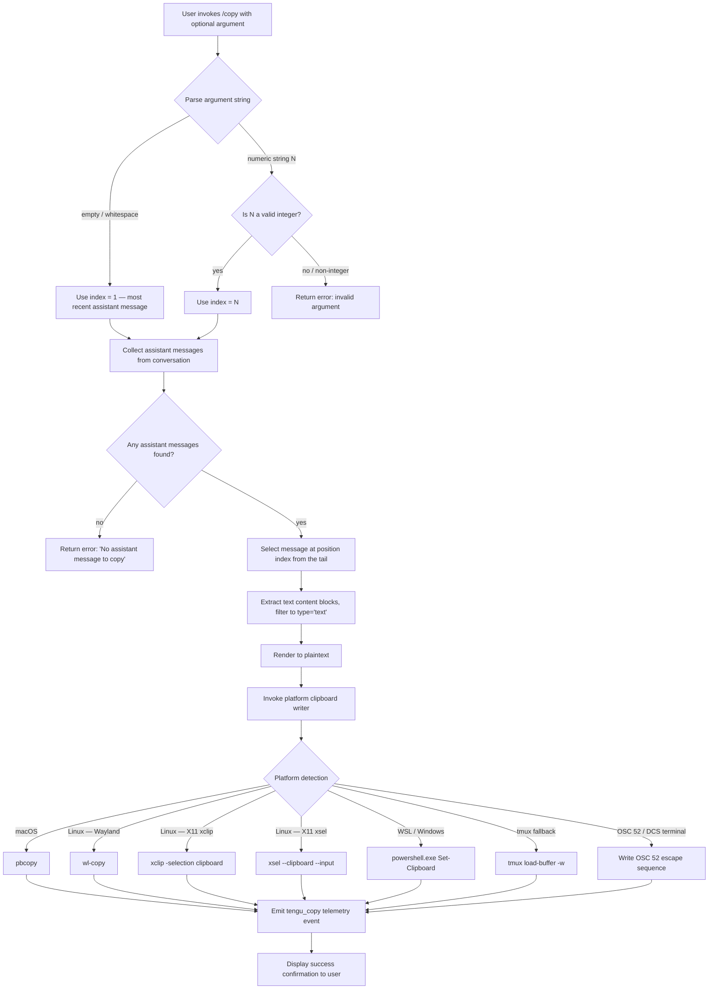

# `/copy`

> Analysis basis: CC v2.1.181 bundle.js (AST extraction + Claude interpretation)
> Minimum version: v2.1.181

---

## Overview

`/copy` copies Claude's most recent assistant response to the system clipboard. An optional numeric argument (`/copy N`) selects the Nth-latest assistant message instead of the most recent one. The command uses platform-specific clipboard backends (e.g., `pbcopy` on macOS, `wl-copy`/`xclip`/`xsel` on Linux, `powershell.exe` on Windows/WSL) and falls back to OSC 52 terminal escape sequences and tmux buffer copy when native tools are unavailable.

---

## Registration

| Field | Value |
|---|---|
| type | `local-jsx` |
| name | `copy` |
| description | `Copy Claude's last response to clipboard (or /copy N for the Nth-latest)` |
| loc_byte | `11226898` |
| loc_byte_end | `11227084` |
| loc_line | `6899` |
| module_id | `Grl` |
| load_inline | `true` |
| arbor_handler.name | `A5p` |
| arbor_handler.fqn | `claude-2.1.181::A5p` |
| arbor_handler.kind | `AsyncFunction` |
| arbor_handler.resolution_path | `module_id` |
| arbor_handler.n_hits | `0` |

Analysis basis: CC v2.1.181 bundle.js:+11226898

---

## Input Branching

Four distinct branches exist based on argument parsing and message availability, so a Mermaid flowchart is used.



Analysis basis: CC v2.1.181 bundle.js:+11226078 (handler entry `A5p`), +11226117 (argument presence check), +11226188 (Number coercion), +11226202 (Number.isInteger guard), +11226119 (no-message error literal)

---

## Behavioral Spec

### 1. Argument Parsing

```
async function copyCommandHandler(userInput, appState):
    rawArg = stripLeadingSlashCommand(userInput)   // remove "/copy"
    trimmedArg = rawArg.trim()

    if trimmedArg == "":
        index = 1                                  // default: most recent
    else:
        candidate = Number(trimmedArg)
        if not Number.isInteger(candidate) or candidate < 1:
            return renderError("Invalid argument — must be a positive integer")
        index = candidate
```

Analysis basis: CC v2.1.181 bundle.js:+11226117, +11226188, +11226202

### 2. Message Selection

```
function selectAssistantMessage(conversationMessages, index):
    // Filter to assistant-role messages only
    assistantMessages = conversationMessages.filter(m => m.role == "assistant")

    if assistantMessages.length == 0:
        return Error("No assistant message to copy")

    // index=1 → last; index=2 → second-to-last; etc.
    targetIndex = Math.max(0, assistantMessages.length - index)
    return assistantMessages[targetIndex]
```

Analysis basis: CC v2.1.181 bundle.js:+11222025 (`"assistant"` literal), +11226119 (`"No assistant message to copy"` literal), +11221268 (`Math.max` call)

### 3. Text Extraction and Rendering

```
function extractPlaintext(assistantMessage):
    // Filter content blocks to text-type only (drop tool_use, images, etc.)
    textBlocks = filterContentBlocks(assistantMessage.content, type="text")
    // Join blocks, then render markdown → terminal plaintext
    rawText = joinBlocks(textBlocks)
    return renderToPlaintext(rawText)    // strips markdown, normalises whitespace
```

The call to `filterContentBlocks` corresponds to `Frl` → `$c` (filter on `"text"` kind).
Plaintext rendering corresponds to `Url` → `Nrl` (table/plaintext layout path, literal `"plaintext"` at bundle.js:+11222230).

Analysis basis: CC v2.1.181 bundle.js:+11222095 (`Array.isArray`), +11222127 (`$c` filter), +13851896 (`"text"` literal), +11221789 (`"table"` layout), +11222230 (`"plaintext"` layout)

### 4. Platform Clipboard Writing

The clipboard writer (`Vv` → `hgi` / `OUr` / sub-backends) selects a backend at runtime:

```
async function writeToClipboard(text, platform):
    encoding = detectEncoding(text)   // "utf8" or "base64"

    match platform:
        case "darwin" (macOS):
            spawn("pbcopy", stdin=text, timeout=2000ms)

        case "linux":
            if waylandAvailable():
                spawn("wl-copy", stdin=text)
            else if xclipAvailable():
                spawn("xclip", ["-selection", "clipboard"], stdin=text)
            else if xselAvailable():
                spawn("xsel", ["--clipboard", "--input"], stdin=text)
            else:
                fallbackToOSC52(text)

        case "wsl" or "windows":
            spawn("powershell.exe",
                  ["-NoProfile", "-NonInteractive", "-Command", "Set-Clipboard ..."],
                  stdin=text)

        case "tmux" (TMUX env present):
            spawn("tmux", ["load-buffer", "-w", "-"], stdin=text)

        case terminal-supports-OSC52 ("raw", "dcs", "raw+dcs", "osc52"):
            writeOSC52EscapeSequence(text)

        case "screen":
            useScreenPasteBuffer(text)

        case "kitty":
            useKittyProtocol(text)

        case "none" / "unset":
            reportUnsupported()
```

Timeout of 2000 ms applies to the `pbcopy` subprocess.
Analysis basis: CC v2.1.181 bundle.js:+3535012 (`"pbcopy"`), +3533972 (`"wl-copy"`), +3534040 (`"xclip"`), +3534080 (`"xsel"`), +3535409 (`"powershell.exe"`), +3534267 (`"load-buffer"`), +3534691 (`"raw+dcs"`), +3534714 (`"dcs"`), +3534720 (`"raw"`), +3533855 (`"osc52"`), +3532967 (`"screen"`), +3533436 (`"kitty"`), +3534765 (`"none"`), +3534978 (timeout `2000`)

### 5. Clipboard Writer Sub-Backends

```
function buildClipboardCommand(backendName, text):
    // Linux X11 — xclip
    if backendName == "xclip":
        return ["xclip", "-selection", "clipboard"]   // args: +3535224, +3535237

    // Linux X11 — xsel
    if backendName == "xsel":
        return ["xsel", "--clipboard", "--input"]      // args: +3535323, +3535337

    // WSL
    if backendName == "wsl":
        return ["powershell.exe", "-NoProfile", "-NonInteractive", "-Command", ...]
                                                       // args: +3535427, +3535440, +3535458

    // tmux
    if backendName == "tmux":
        return ["tmux", "load-buffer", "-w", "-"]      // "-w" arg: +3534281

    // xclip primary (alternate selection)
    if backendName == "xclip-primary":
        return ["xclip", "-selection", "primary"]      // +3535278
```

Analysis basis: CC v2.1.181 bundle.js:+3535224, +3535237, +3535278, +3535323, +3535337, +3535409, +3535427, +3535440, +3535458, +3534281

---

## State & Side Effects

| Item | Detail |
|---|---|
| Telemetry | `tengu_copy` fired on every invocation (success path) — bundle.js:+11226497 |
| Clipboard mutation | Writes to system clipboard via platform backend; no in-process state changed |
| appState changes | None detected within depth-2 traversal |
| Sound | None detected |
| Hook registration | None detected |
| Subprocess spawning | Short-lived child process for native clipboard tools (pbcopy / wl-copy / xclip / xsel / powershell.exe / tmux); 2000 ms timeout for pbcopy |
| OSC 52 terminal write | Writes a raw VT escape sequence to stdout when native tools are absent |

---

## Version History

| Version | Change |
|---|---|
| v2.1.181 | Initial analysis |

---

## Common Mistakes

1. **Passing a non-integer argument** — `/copy 2.5` or `/copy latest` will fail argument validation. Only positive whole numbers are accepted.
2. **Expecting `/copy` to work before Claude has replied** — if the conversation contains no assistant-role messages, the command returns an error (`"No assistant message to copy"`).
3. **Clipboard not available in headless / SSH environments** — when no native clipboard backend is detected and the terminal does not support OSC 52, the copy silently falls back to a no-op or reports an unsupported-backend error. Use a terminal that advertises OSC 52 support, or set `TERM` appropriately.
4. **Index off-by-one confusion** — `/copy 1` copies the *most recent* assistant message; `/copy 2` copies the second-most-recent. The index counts from the tail, not the head.
5. **Expecting rich formatting in the clipboard** — the command renders markdown to plaintext before writing; inline code, bold, and similar markup are stripped.

---

## Appendix — Identifier Mapping

> For bundle debugging only. Identifiers change across versions.

| Identifier | Role |
|---|---|
| `A5p` | Main async handler for `/copy` (arbor_handler, AsyncFunction) |
| `Frl` | Content-block filter — retains only `"text"`-type blocks from assistant message |
| `$c` | Inner filter predicate used by content-block filter |
| `Url` | Conversation message walker / text extractor |
| `Nrl` | Plaintext/table layout renderer |
| `u5p` | Helper mapped over layout rows |
| `c5p` | Lexer-based text pipeline entry (feeds into `NA.lexer`) |
| `Fxe` | Regex replacement pass within lexer pipeline |
| `NA` | Markdown lexer wrapper (`o2e.parse`) |
| `$rl` | Escape / replace pass on rendered text |
| `Jgo` | Clipboard dispatch coordinator — selects backend and calls writer |
| `Vv` | Clipboard backend selector (platform detection + encoding) |
| `hgi` | macOS `pbcopy` backend writer |
| `OUr` | Linux clipboard backend dispatcher (wl-copy / xclip / xsel) |
| `WJu` | tmux `load-buffer` backend |
| `PUr` | OSC 52 / DCS escape-sequence writer |
| `Vxt` | Kitty clipboard protocol writer |
| `gL` | Screen paste-buffer backend |
| `eE` | Clipboard text encoder (utf8 / base64) |
| `Agi` | Terminal escape sequence builder |
| `qxt` | Raw OSC 52 sequence emitter |
| `b_` | Low-level terminal write primitive |
| `Wu` | String index-search utility |
| `Brl` | Temporary-file / safe-write helper used by clipboard pipeline |
| `qE` | Secure temp-directory creator |
| `wmi` | Directory validator / chmod helper |
| `bfr` | Atomic file-write helper (open → write → rename) |
| `It` | Config / environment loader called during handler init |
| `w_e` | Filesystem config reader (readFileSync path) |
| `Byf` | File-watcher setup helper |
| `Wt` | JSON.parse wrapper |
| `x9` | Path prefix normaliser |
| `uUl` | Backup-directory resolver |
| `h0o` | Path join + stat helper |
| `cfe` | Text trimmer / whitespace normaliser (1000 ms debounce, trim at byte 2294766) |
| `roe` | Inner text processing step called by `cfe` |
| `cxl` | Daemon status reader (reads `"daemon.status.json"`) |
| `hQ` | Clipboard utility lookup / capability check |
| `sjt` | Status-file path builder (`lxl.join` + `"daemon.status.json"`) |
| `oi` | AsyncLocalStorage store accessor (`tLu.getStore`) |
| `Re` | JSON serialiser wrapper (`JSON.stringify`) |
| `bn` | Background-session type descriptor |
| `nn` | Terminal string-width measurer (`Bun.stringWidth`) |
| `mm` | String repeat / pad helper |
| `Ps` | Process-exit coordinator |
| `Me` | Error event emitter (`tengu_feature_bad`) |
| `xe` | OK event emitter (`tengu_feature_ok`) |
| `ke` | Error logger + telemetry sink |
| `j` | Logging / debug utility |
| `ln` | Low-level logger primitive |
| `Dn` | Error-wrapping logger |
| `jt` | Path / environment bootstrap |
| `sr` | String join helper |

Note: index built via Arbor fallback; some signals (telemetry, literals) may be missing — see arbor-fallback.js.