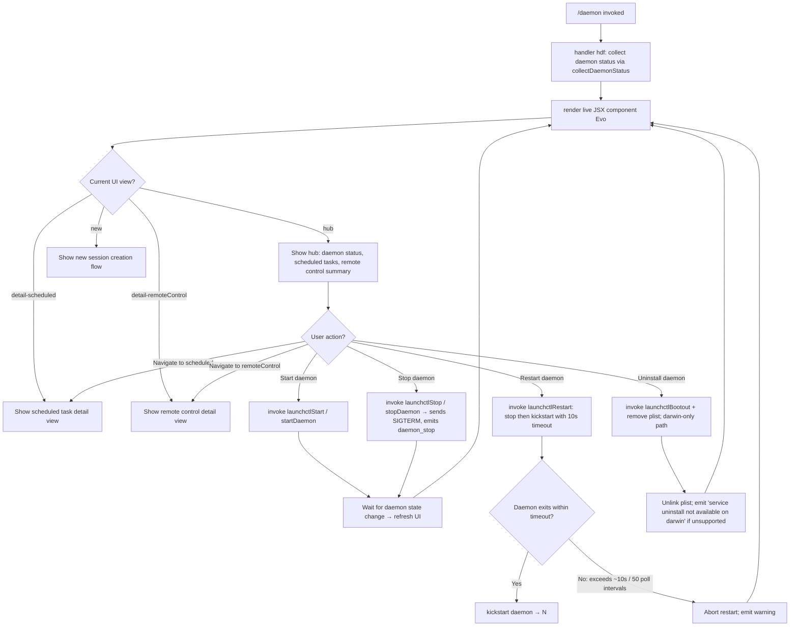

# `/daemon`

> Analysis basis: CC v2.1.181 bundle.js (AST extraction + Claude interpretation)
> Minimum version: v2.1.181

---

## Overview

The `/daemon` command provides an interactive management interface for the Claude Code background daemon process and its associated background services. It surfaces real-time status of the daemon supervisor, scheduled tasks, and remote-control sessions, and allows the user to start, stop, restart, or uninstall the daemon service. The command renders a live JSX UI (type `local-jsx`) that reacts to changes in daemon state and MCP connection health.

---

## Registration

| Field | Value |
|---|---|
| type | `local-jsx` |
| name | `daemon` |
| description | `Manage background services and routines` |
| loc_byte | `13195851` |
| loc_byte_end | `13196019` |
| loc_line | `8640` |
| immediate | `true` |
| module_id | `Svo` |
| load_inline | `true` |
| arbor_handler.name | `hdf` |
| arbor_handler.fqn | `claude-2.1.181::hdf` |
| arbor_handler.kind | `AsyncFunction` |
| arbor_handler.resolution_path | `module_id` |
| arbor_handler.n_hits | `0` |

Analysis basis: CC v2.1.181 bundle.js:+13195851

---

## Input Branching

The command presents multiple distinct views (hub, scheduled detail, remote-control detail, new session) and performs branching across daemon start/stop/restart/uninstall lifecycle paths. More than three distinct branches exist in the UI and lifecycle logic, so a Mermaid flowchart is used.



Analysis basis: CC v2.1.181 bundle.js:+13185052 (handler `hdf`), +13185202 (UI component `Evo`), +11710624 (lifecycle `Lpt`), +11710897 (start/stop `L_o`), +17138087 (daemon_stop telemetry)

---

## Behavioral Spec

### Handler Entry Point (`hdf`)

The Arbor-resolved handler is `hdf` (AsyncFunction, `claude-2.1.181::hdf`), reached via `module_id` resolution (`Svo`).

```
async function daemonCommandHandler(context):
    status = await collectDaemonStatus()          // yvo
    uiNode = await renderDaemonManagerUI(status)  // Nkl
    return uiNode
```

Analysis basis: CC v2.1.181 bundle.js:+13185052 (`hdf → yvo`), +13185122 (`hdf → Nkl`)

---

### Status Collection (`yvo` — collectDaemonStatus)

Gathers all information needed to render the daemon management UI. Executes several sub-tasks in parallel using `Promise.all`.

```
async function collectDaemonStatus():
    [rosterData, daemonJson, scheduledStatus, pidInfo, launchctlInfo] =
        await Promise.all([
            readRosterFile(),          // kkl → lmt → reads roster.json
            readDaemonStatusJson(),    // dxl → reads daemon.status.json
            readScheduledStatusJson(), // U0l → reads daemon.scheduled.status.json
            readPidFile(),             // f0  → reads daemon PID file
            queryLaunchctl(),          // sX  → runs `launchctl print` (macOS)
            cleanStalePidFile(),       // lq  → checks/rotates roster.json
        ])
    return { rosterData, daemonJson, scheduledStatus, pidInfo, launchctlInfo }
```

Analysis basis: CC v2.1.181 bundle.js:+13184611 (`yvo → Qke`), +13184639 (`yvo → Promise.all`), +13184652 (`yvo → kkl`), +13184658 (`yvo → Tkl`), +13184664 (`yvo → f0`), +13184685 (`yvo → dxl`), +13184707 (`yvo → U0l`), +13184729 (`yvo → lq`)

---

### Roster File Reader (`kkl` → `lmt` → `ECo`)

Reads and parses the daemon roster from a JSON file. The roster tracks active daemon worker jobs.

```
async function readRosterAndParseDaemon():
    entries = await Promise.all(readRosterEntries())  // lmt per entry
    return entries

async function readRosterEntry(path):
    stat = await fs.stat(path)
    if not stat.isFile():
        throw Error("not a regular file")
    raw = await fs.readFile(path, "utf8")             // max 1 048 576 bytes (bundle.js:+12998938)
    text = Dn(raw.trim())                             // Dn = decode/normalize
    parsed = JSON.parse(text)
    if Array.isArray(parsed):
        return validateAndReturnArray(parsed)         // x9
    return parsed
```

- Maximum file read size: **1 048 576 bytes** (1 MiB). Analysis basis: CC v2.1.181 bundle.js:+12998938
- File encoding: `"utf8"`. Analysis basis: CC v2.1.181 bundle.js:+12999057
- Roster entries tagged with type `"scheduled"` are separated from regular entries. Analysis basis: CC v2.1.181 bundle.js:+13092015

---

### Daemon Status JSON Reader (`dxl`)

Reads `daemon.status.json` from the daemon run directory, obtains the current context via `oi` (async-local store lookup), constructs the path via `sjt`, and parses the file. If the process is running, sends a signal via `process.kill` and waits for the process via `Uv`.

```
async function readDaemonStatusJson():
    ctx    = getAsyncLocalStoreContext()   // oi
    path   = buildStatusPath("daemon.status.json")  // sjt → lxl.join + sr
    raw    = await fs.readFile(path)
    status = Fa(raw)                       // decode/deserialize
    if status.pid:
        process.kill(status.pid, 0)        // existence check
        await waitForProcess(status.pid)   // Uv → PU
    return status
```

- File name constant: `"daemon.status.json"`. Analysis basis: CC v2.1.181 bundle.js:+12998118

---

### Scheduled Status JSON Reader (`U0l`)

Reads `daemon.scheduled.status.json` analogously to the daemon status reader.

```
async function readScheduledStatusJson():
    ctx  = getAsyncLocalStoreContext()
    path = buildScheduledStatusPath("daemon.scheduled.status.json")  // N0l → P0l.join + sr
    raw  = await fs.readFile(path)
    data = Fa(raw)
    if data.pid:
        process.kill(data.pid, 0)
        await waitForProcess(data.pid)
    return data
```

- File name constant: `"daemon.scheduled.status.json"`. Analysis basis: CC v2.1.181 bundle.js:+13090510

---

### PID File Reader and Stale-PID Cleanup (`f0` / `t6t`)

Reads the daemon PID file (`daemon.json`) and cleans up any stale file.

```
async function readAndCleanPidFile(pidFilePath):
    stat = await fs.lstat(pidFilePath)
    if stat exists and not stat.isFile():
        await fs.rm(pidFilePath, { force: true, maxRetries: 0 })  // 65 536 retry limit (bundle.js:+11707066)
    raw = await fs.readFile(pidFilePath)
    pid = Dn(raw)                          // decode
    return Fa(pid)                         // parse

async function killStaleDaemonPid(pidInfo):
    process.kill(pidInfo.pid, 0)           // sends signal 0 (existence probe) (bundle.js:+11708703)
    recentLogs = await readRecentLogLines(logFile)  // T_o: reads log, splits lines, slices last N
    await waitForProcess(pidInfo.pid)      // Uv
```

- PID file name: `"daemon.json"`. Analysis basis: CC v2.1.181 bundle.js:+11708566
- Log file search string: `"claude daemon"`. Analysis basis: CC v2.1.181 bundle.js:+11707991
- Log line slice count: **4**. Analysis basis: CC v2.1.181 bundle.js:+11708018
- Signal for existence probe: **0**. Analysis basis: CC v2.1.181 bundle.js:+11708703

---

### launchctl Query (`sX` / `Hjn` / `Kal`)

On macOS, queries the system service manager to determine whether the daemon LaunchAgent is registered and running.

```
async function queryLaunchctlStatus():
    uid = process.getuid()                           // Kal (bundle.js:+11708950)
    result = await runLaunchctl(["print", "gui/" + uid + "/..."])  // Hjn → Kal
    return parseLaunchctlOutput(result)
```

- Invokes `launchctl` with subcommand `"print"`. Analysis basis: CC v2.1.181 bundle.js:+11712167
- Timeout: **5000 ms**. Analysis basis: CC v2.1.181 bundle.js:+11712201
- LaunchAgents directory path segment: `"Library/LaunchAgents"`. Analysis basis: CC v2.1.181 bundle.js:+11708881, +11708891

---

### Roster Validation and Stale-Entry Cleanup (`lq`)

Validates the roster file (`roster.json`), removes entries that are no longer valid, rotates old roster files, and parses surviving entries.

```
async function validateAndCleanRoster(rosterPath):
    stat = await fs.lstat(rosterPath)
    if not stat.isFile():
        // log error "is not a regular file — removing" (bundle.js:+11719481)
        emit telemetry tengu_bg_roster_parse_failed
        await fs.rm(rosterPath)
        return []

    raw    = await fs.readFile(rosterPath)
    text   = Dn(raw)                         // decode
    parsed = Wt(text)                        // JSON.parse wrapper
    if parsed is too large (E2BIG / EFTYPE): // bundle.js:+11719607, +11719619
        rotateRoster(rosterPath)             // Ijn: rename with Date.now suffix
        return []

    entries = sll(parsed)                    // validate: Array.isArray + Object.keys
    return entries.filter(isValidEntry)
```

- Roster file name: `"roster.json"`. Analysis basis: CC v2.1.181 bundle.js:+11715305
- Error codes handled: `"E2BIG"`, `"EFTYPE"`. Analysis basis: CC v2.1.181 bundle.js:+11719607, +11719619
- Telemetry fired on parse failure: `tengu_bg_roster_parse_failed`. Analysis basis: CC v2.1.181 bundle.js:+11719527

---

### Daemon Lifecycle Control (`Lpt` / `L_o`)

Controls the macOS LaunchAgent lifecycle. The plist is stored in `~/Library/LaunchAgents/`.

```
async function uninstallDaemon(context):
    plistPath = buildPlistPath()          // w_o → r6t.join + C_o.homedir (bundle.js:+11710624)
    uid       = getUid()                  // Un → Vr (bundle.js:+11710636)
    await runLaunchctl(["bootout", "gui/" + uid + "/..."])  // Hjn
    await fs.unlink(plistPath)            // oX.unlink (bundle.js:+11710692)
    decode_result = Dn(result)
    return Ee(decode_result)

async function startOrRestartDaemon(action):
    // action ∈ { "start", "stop", "kickstart", "restart" }
    uid     = getUid()                    // Un
    if action == "restart":
        await runLaunchctl(["stop", ...])
        for attempt in range(50):         // 50 poll intervals (bundle.js:+11711307)
            if daemonStopped(): break
            await sleep(200ms)
        if not daemonStopped():
            logError("daemon did not exit within 10s of SIGTERM; restart aborted before kickstart")
            // bundle.js:+11711336
            return
        await runLaunchctl(["kickstart", ...])   // bundle.js:+11711014
    else if action == "start":
        await runLaunchctl(["kickstart", ...])
    else if action == "stop":
        await runLaunchctl(["stop", ...])
    await sleep(...)                      // Val.setTimeout (bundle.js:+11711292)
```

- `"bootout"` constant. Analysis basis: CC v2.1.181 bundle.js:+11710652
- `"kickstart"` constant. Analysis basis: CC v2.1.181 bundle.js:+11711014
- `"start"`, `"stop"`, `"restart"` action constants. Analysis basis: CC v2.1.181 bundle.js:+11711003, +11711039, +11711079
- Platform restriction: `"darwin"` only for uninstall. Analysis basis: CC v2.1.181 bundle.js:+11711662
- Uninstall unsupported message: `"service uninstall not available on darwin"` (emitted when path unavailable). Analysis basis: CC v2.1.181 bundle.js:+11710783

---

### UI Component (`Evo` — DaemonManagerUI)

A React/Ink JSX component rendering the daemon management UI. Uses `El.useState`, `El.useRef`, and `cu` (a composite hook providing `useRef`, `useContext`, `useMemo`, `useSyncExternalStore`, and timeout management).

```
function DaemonManagerUI(props):
    [view, setView]     = useState("hub")           // initial view: "hub" (bundle.js:+13185329)
    clockNow            = useClock()                // Ms → VTi.useContext
    startTime           = Date.now()                // bundle.js:+13185251
    status              = yvo(...)                  // live status ref
    ref                 = El.useRef(...)

    renderByView(view):
        switch view:
            case "hub":                 return renderHub(status)
            case "detail-scheduled":   return renderScheduledDetail(status)   // bundle.js:+13185822
            case "detail-remoteControl": return renderRemoteControlDetail()   // bundle.js:+13185980
            case "new":                return renderNewSession()               // bundle.js:+13185920
            case "uninstall":          return renderUninstall()               // bundle.js:+13185633

    // Hub view sections:
    //   "Scheduled"      label (bundle.js:+13186458)
    //   "Remote Control" label (bundle.js:+13186779)
    //   "Claude daemon"  label (bundle.js:+13187064)
    //   "permission"     section (bundle.js:+13187162)

    // Lifecycle hook: Lpt (uninstall), s6t (start/stop/restart)
    // Background session label: "hub" (bundle.js:+13185329)
```

Analysis basis: CC v2.1.181 bundle.js:+13185202 (`Evo` component start), +13185219 (`Ms` / clock context), +13185251 (`Date.now`), +13185445 (`yvo` call), +13185653 (`Lpt`), +13185684 (`s6t`)

---

### Background Session Supervisor Protocol (`y9f`)

The daemon IPC protocol handler manages the wire protocol between the CLI foreground client and the background supervisor process. Key protocol message types found in literals:

| Message type | Direction | Description |
|---|---|---|
| `ping` | client→daemon | Keepalive probe |
| `nudge` | client→daemon | Trigger activity |
| `yield` | client→daemon | Yield execution slot |
| `lease` / `leases` | bidirectional | Resource lease management |
| `shutdown` | client→daemon | Request orderly shutdown |
| `dispatch` | client→daemon | Send a job to a worker |
| `reply` | client→daemon | Reply to a pending job prompt |
| `exec` | daemon→client | Execute a job |
| `kill` | client→daemon | Terminate a job |
| `attach` | client→daemon | Attach foreground terminal to background job |
| `resize` | client→daemon | Resize attached PTY |
| `snapshot` | daemon→client | State snapshot push |
| `subscribe` | client→daemon | Subscribe to state updates |
| `list` | client→daemon | List active jobs |
| `has` | client→daemon | Check job existence |
| `ensure-spare` | internal | Pre-warm a spare worker |
| `permission-response` | client→daemon | Respond to a permission prompt |
| `respawn-stale` | daemon→client | Signal worker respawn |
| `stream` | daemon→client | Streaming output |

Error codes used in protocol:

| Code | Meaning |
|---|---|
| `ETOOLARGE` | Payload exceeds size limit |
| `EUNKNOWN` | Unknown protocol error |
| `ESTARTING` | Daemon/worker still starting |
| `EPROTO` | Protocol violation |
| `ESTALE` | Dispatch ID is stale |
| `ETIMEOUT` | Operation timed out |
| `EAUTH` | Control key mismatch |
| `ENOJOB` | Job not found |
| `ENOREPLY` | Job not accepting replies |
| `ERESPAWNING` | Worker is respawning |
| `EUNVERIFIED` | Worker identity unverified |

- Dispatch timeout: **30 000 ms**. Analysis basis: CC v2.1.181 bundle.js:+17084752
- Max in-flight dispatches: **25**. Analysis basis: CC v2.1.181 bundle.js:+17085032
- Authentication: clients must present a daemon control key (timing-safe comparison via `kJa.timingSafeEqual`). Analysis basis: CC v2.1.181 bundle.js:+10730118
- Attach stall respawn timeout: **2000 ms**. Analysis basis: CC v2.1.181 bundle.js:+17082466
- Protocol connection timeout: **500 ms** for initial connect. Analysis basis: CC v2.1.181 bundle.js:+17133221

Analysis basis: CC v2.1.181 bundle.js:+17085762 through +17096927

---

### Background Worker Pool Sweep (`L` — sweepWorkerPool)

A periodic sweep function that manages background worker lifecycle: pre-warming spare workers, retiring settled or idle workers, and responding to low-memory pressure.

```
async function sweepWorkerPool(poolState):
    now = Date.now()
    workers = poolState.values()

    // Advance grace clocks
    W.shiftGraceClocksForward(workers)

    for worker in workers:
        if lowMemoryPressure and worker.settled:
            // emit tengu_bg_retire_pinned_low_mem
            // "bg: low memory persists after shedding non-pinned — retiring pinned settled workers as a last resort"
            worker.retireIfSettled()

    // Pre-warm spare workers
    needed = computePrewarmCount()             // max 12 per sweep (bundle.js:+17106166)
    // emit tengu_bg_prewarm_per_sweep
    await Promise.all(prewarmWorkers(needed))

    // Respawn idle/stale workers
    for worker in workers:
        worker.respawnIfIdleStale()

    // Retire settled workers
    await Promise.all(retireSettledWorkers())
```

- Max pre-warm workers per sweep: **12**. Analysis basis: CC v2.1.181 bundle.js:+17106166
- Pre-warm state constant: `"prewarm"`. Analysis basis: CC v2.1.181 bundle.js:+17106736

---

### MCP Connection Management (`DBe` / `kOo`)

The daemon integrates with the MCP (Model Context Protocol) server connection subsystem. When `/daemon` is active, it calls `DBe` (mcpConnectionManager) which orchestrates MCP server connections, reconnections, and OAuth flows.

Key behaviors:
- Skips connections cached as `"needs-auth"` with message `"Skipping connection (cached needs-auth)"`. Analysis basis: CC v2.1.181 bundle.js:+6830562
- Skips connections with recent failure cache for 15 minutes: `"Skipping connection (recent failure cached; retries automatically in 15 min, or edit the plugin config to retry now)"`. Analysis basis: CC v2.1.181 bundle.js:+6830824
- Applies MCP updates via `bQn` (applyMcpUpdate handler). Analysis basis: CC v2.1.181 bundle.js:+16747872
- Sends SIGTERM to orphaned MCP processes. Analysis basis: CC v2.1.181 bundle.js:+17103269
- Reconnect events: `mcp_reconnect`, `mcp_reconnect_not_connected`, `mcp_reconnect_needs_auth_discovery`, `mcp_reconnect_failed`. Analysis basis: CC v2.1.181 bundle.js:+6828567, +6828583, +6828895, +6829280

---

### OAuth Flow Integration (`Iae` / `yLn`)

The daemon command can display OAuth authentication state for MCP servers requiring authorization.

```
async function mcpOAuthFlow(server, context):
    // emit tengu_mcp_oauth_flow_start
    server = createOAuthServer()                  // CJi.createServer
    server.listen("127.0.0.1", port)              // bundle.js:+6590122
    server.unref()

    // OAuth callback endpoint: /callback (bundle.js:+6588744)
    // Auth timeout: 300 000 ms (5 minutes) (bundle.js:+6590219)
    // On EADDRINUSE: find next available port

    result = await Promise.race([
        waitForCallback(),
        timeout(300000)
    ])

    if result == "AUTHORIZED":
        // emit tengu_mcp_oauth_flow_success
        return success
    else:
        // emit tengu_mcp_oauth_flow_error
        throw OAuthError(result)
```

- OAuth callback server binds to `"127.0.0.1"`. Analysis basis: CC v2.1.181 bundle.js:+6590122
- Authentication timeout: **300 000 ms** (5 min). Analysis basis: CC v2.1.181 bundle.js:+6590219
- OAuth flow telemetry events: `tengu_mcp_oauth_flow_start`, `tengu_mcp_oauth_flow_success`, `tengu_mcp_oauth_flow_error`. Analysis basis: CC v2.1.181 bundle.js:+6585687, +6590645, +6592356

---

## State & Side Effects

| Item | Detail |
|---|---|
| Telemetry: `tengu_bg_roster_parse_failed` | Fired when `roster.json` cannot be parsed (bundle.js:+11719527) |
| Telemetry: `tengu_mcp_oauth_flow_start` | Fired when MCP OAuth flow begins (bundle.js:+6585687) |
| Telemetry: `tengu_mcp_oauth_flow_success` | Fired on successful OAuth completion (bundle.js:+6590645) |
| Telemetry: `tengu_mcp_oauth_flow_error` | Fired on OAuth flow failure (bundle.js:+6592356) |
| Telemetry: `tengu_daemon_config_reload` | Fired when daemon config is hot-reloaded (bundle.js:+17117192) |
| Telemetry: `tengu_mcp_skills` | Fired to record MCP skill inventory (bundle.js:+6693108) |
| Telemetry: `tengu_config_auth_loss_prevented` | Fired when a config save is rejected to prevent auth loss (bundle.js:+13936136) |
| Telemetry: `tengu_bg_retire_pinned_low_mem` | Fired when pinned workers are retired under low-memory pressure (bundle.js:+17106011) |
| Telemetry: `tengu_bg_prewarm_per_sweep` | Fired each pool sweep when workers are pre-warmed (bundle.js:+17106132) |
| Telemetry: `tengu_feature_ok` / `tengu_feature_bad` | Feature flag check outcomes (bundle.js:+1019804, +1019871) |
| Telemetry: `tengu_daemon_control` | Fired on daemon control actions (start/stop/restart) (bundle.js:+17138162) |
| Telemetry: `tengu_amber_anchor` | Background service anchor event (bundle.js:+3338788) |
| Telemetry: `tengu_bg_proto_mismatch` | Protocol version mismatch between client and daemon (bundle.js:+17087088) |
| Telemetry: `tengu_bg_dispatch_stale_drop` | A dispatched job was dropped as stale (bundle.js:+17088487) |
| Telemetry: `tengu_bg_state_read_transient` | Transient state file read (bundle.js:+4285153) |
| Telemetry: `tengu_bg_attach_legacy_autorespawn` | Legacy client triggered auto-respawn on attach (bundle.js:+17091377) |
| Telemetry: `tengu_bg_attach_upgrade` | Worker upgraded during attach (bundle.js:+13267834) |
| Telemetry: `tengu_bg_attach` | Successful attach to background worker (bundle.js:+17092536) |
| Telemetry: `tengu_bg_attach_stall_ms` | Duration of attach stall in milliseconds (bundle.js:+17082410) |
| Telemetry: `tengu_bg_attach_stall_gave_up` | Attach stall exceeded limit; gave up (bundle.js:+17093466) |
| Telemetry: `tengu_bg_attach_stall_respawn` | Attach stall triggered worker respawn (bundle.js:+17093736) |
| Telemetry: `tengu_bg_attach_kick` | Worker was kicked during attach (bundle.js:+17094733) |
| Telemetry: `tengu_daemon_idle_exit` | Daemon exited due to idle timeout (bundle.js:+17122627) |
| File writes | `daemon.status.json`, `daemon.scheduled.status.json`, `roster.json`, `daemon.json` (PID file), LaunchAgent plist |
| Process signals | `SIGTERM` to daemon and MCP processes; `SIGKILL` when stall detected; signal `0` for existence probing |
| macOS LaunchAgent | Installs/uninstalls plist under `~/Library/LaunchAgents/`; uses `launchctl bootout`, `kickstart`, `stop`, `print` |
| MCP auth cache | Reads and writes `mcp-needs-auth-cache.json` to skip reconnects; 15-minute TTL before automatic retry |
| OAuth callback HTTP server | Ephemeral HTTP server bound to `127.0.0.1` on a dynamically selected port; unref'd so it does not keep the process alive |
| Background worker pool | Pre-warms up to 12 spare workers per sweep; retires settled/idle workers; sheds pinned workers under low memory |
| appState changes | `E.stop`, `E.start`, `E.updateConfig`, `E.setMetadata`, `E.markStepUpPending` called through daemon config reload path |
| Sound | None detected in traversal |

---

## Version History

| Version | Change |
|---|---|
| v2.1.181 | Initial analysis |

---

## Common Mistakes

1. **Expecting `/daemon` on non-macOS platforms to offer full lifecycle control.** The `uninstall`, `kickstart`, and `bootout` paths are guarded behind `"darwin"` detection; on other platforms the launchctl subcommands are unavailable and the command logs an appropriate message.

2. **Restarting the daemon and not waiting for it to fully stop.** The restart sequence polls up to 50 times (approximately 10 seconds) for the daemon to exit after SIGTERM before issuing `kickstart`. Interrupting before the poll completes will leave a stale daemon process.

3. **Misinterpreting `"needs-auth"` as a permanent failure.** Connections skipped due to cached `"needs-auth"` state automatically clear after 15 minutes, or immediately if the plugin config is edited.

4. **Assuming the OAuth callback server is long-lived.** The local HTTP server on `127.0.0.1` is started fresh per OAuth flow, is `.unref()`'d immediately after binding, and has a hard **5-minute** timeout; it is not a persistent daemon endpoint.

5. **Treating the daemon control key as optional.** The IPC protocol performs a timing-safe comparison of the daemon control key for `dispatch`, `reply`, `attach`, and `permission-response` messages. Clients without the key are rejected with `EAUTH`; the sole legacy exception is attach via matching peer UID.

6. **Overlooking stale roster entries.** `roster.json` is validated on every status poll; entries that are not regular files, or that exceed size limits (`E2BIG`, `EFTYPE`), are silently rotated out, which may cause previously listed sessions to disappear from the UI.

---

## Appendix — Identifier Mapping

> For bundle debugging only. Identifiers change across versions.

| Identifier | Role |
|---|---|
| `hdf` | Main handler (AsyncFunction) for `/daemon`; Arbor-resolved entry point |
| `Tdf` | Rendering/mount helper; renders JSX and handles unmount |
| `yvo` | collectDaemonStatus — orchestrates parallel status gathering |
| `Evo` | DaemonManagerUI — live JSX React/Ink UI component |
| `Qke` | First sub-task in status collection (parallel branch) |
| `kkl` | Roster reader coordinator; calls `lmt` and `ke` |
| `lmt` | Per-entry roster loader; calls `ECo`, `XCo`, `zCo` |
| `ECo` | Roster entry file reader; stat/readFile/JSON.parse |
| `XCo` | Roster entry array validator |
| `ke` | Entry processor / connection handler |
| `Ho` | Error constructor helper |
| `rt` | String coercion helper |
| `ta` | Traffic routing check (`"essential-traffic"`) |
| `fVc` | Queue rotation (shift/push) |
| `f0` | PID file reader and stale-PID killer |
| `t6t` | PID file lstat/rm/readFile helper |
| `T_o` | Log tail reader (readFile + split + slice) |
| `Uv` | Wait-for-process helper |
| `Tkl` | Daemon JSON / config file reader (reads `daemon.json`) |
| `YGe` | Daemon state file stat/parse; emits ENOENT on missing |
| `ln` | Logging/notification helper |
| `oi` | Async-local store context getter |
| `gvo` | Helper used inside `YGe` |
| `Ee` | String coercion / error format helper |
| `F6` | Path builder for `daemon.json` |
| `dxl` | `daemon.status.json` reader; sends `process.kill` |
| `sjt` | Path builder for `daemon.status.json` |
| `U0l` | `daemon.scheduled.status.json` reader |
| `N0l` | Path builder for `daemon.scheduled.status.json` |
| `lq` | Roster validation and stale-entry cleanup |
| `dne` | Roster directory path builder |
| `OHe` | Roster subdirectory path builder |
| `Qe` | Utility: wraps `Rht` |
| `Rht` | Low-level utility (event emitter / promise helper) |
| `Ijn` | Roster rotation: renames file with `Date.now` suffix |
| `c6t` | Timestamp helper (`Date.now`) |
| `Wt` | JSON.parse wrapper |
| `Dn` | Decode/normalize text content |
| `kp` | Logging helper (wraps `ln`) |
| `AJ` | Unknown utility reached from `lq` |
| `sll` | Roster entry structure validator (`Array.isArray` + `Object.keys`) |
| `Y2o` | Entry enrichment helper |
| `X_` | Utility wrapping `Rht` |
| `us` | Utility wrapping `Rht` |
| `sX` | launchctl query orchestrator |
| `Un` | UID / user-context resolver |
| `Vr` | Process spawner for `launchctl` |
| `Mt` | Process spawn helper |
| `Hjn` | launchctl runner (`launchctl print …`) |
| `Kal` | `process.getuid()` wrapper |
| `e` | Random delay helper (`Math.random` + `setTimeout`) |
| `Nkl` | UI node builder / wrapper called from `hdf` |
| `Utt` | Renders the model selection / context component |
| `qMt` | Model picker logic |
| `FTd` | Model list builder and display helper |
| `I` | Log level / model capability inspector |
| `vUi` | UI sub-component for model picker |
| `Go` | Inference profile handler |
| `Ug` | Grammar helper |
| `gs` | Model name normalizer (trim/toLowerCase/pattern match) |
| `a` | MCP update applicator wrapper |
| `DBe` | MCP connection manager — orchestrates all MCP connections |
| `z8` | MCP server connector core |
| `Hrt` | MCP server connect helper (transport: `fP`, `bpe`) |
| `x7` | MCP server connection state machine |
| `h5` | MCP server inventory builder |
| `Zwn` | MCP connection warning emitter (red/yellow) |
| `Art` | MCP reconnect state machine |
| `Pk` | MCP slot resolver |
| `M_` | MCP slot state updater |
| `LVr` | MCP slot lifecycle helper |
| `qn` | Timeout/timer utility |
| `UOt` | Unknown utility in connection flow |
| `Jta` | MCP hash/fingerprint builder |
| `Mzr` | MCP state serializer |
| `wwe` | MCP config hasher (`sha256`, hex, 16 chars) |
| `KAn` | MCP cache key builder |
| `zAn` | MCP auth hash builder |
| `AI` | Auth hash builder (SHA-256 via `Dti.createHash`) |
| `qAn` | Auth nonce/cache accessor |
| `uc` | Auth cache helper |
| `sn` | MCP debug log emitter (`jJ.logMCPDebug`) |
| `yLn` | MCP server session manager (OAuth + connect lifecycle) |
| `t$d` | Session config builder |
| `R9` | Session credential accessor (`M9`, `$l`) |
| `Aae` | Claude.ai connector helper |
| `hae` | Session state helper |
| `Iae` | OAuth flow runner (HTTP server + token exchange) |
| `Trt` | Pending-connection tracker (`pLn`) |
| `p` | Shutdown/exit handler (`process.exit`, `u.abort`) |
| `SLn` | MCP store context getter |
| `R7` | MCP reconnect orchestrator |
| `M9` | Credential store accessor |
| `d` | Daemon supervisor client-side connection handler |
| `Du` | MCP error log emitter (`jJ.logMCPError`) |
| `n$d` | Unknown completion branch in auth flow |
| `e$d` | SSH-aware redirect-URI builder |
| `ELn` | Stale-connection disposer |
| `brt` | In-flight connection getter (`dLn`) |
| `Irt` | Pending-connection getter (`pLn`) |
| `s` | Async set with finally-cleanup |
| `ana` | MCP auth cache writer |
| `wxn` | MCP auth cache path builder |
| `Re` | JSON.stringify wrapper |
| `WVr` | MCP auth/connection result finalizer |
| `m` | Worker pool values iterator |
| `n` | String toLowerCase helper |
| `x` | Background worker process manager |
| `gP` | MCP skills telemetry emitter |
| `ut` | Token/model cache lookup |
| `wVr` | Worker pool state publisher |
| `un` | Global config save (with auth-loss guard) |
| `w` | Background session window/blur tracker |
| `Az` | Session blur state constant (`"blurred"`) helper |
| `L` | Worker pool sweep function |
| `v` | Worker pool focus tracker |
| `uQl` | Worker pool "system" / "away_summary" slot reader |
| `nna` | Promise-pool / async-iterator helper |
| `y8` | Async iterator implementation |
| `Qrt` | parseInt wrapper for port parsing |
| `Lxn` | parseInt wrapper for timeout parsing |
| `bQn` | MCP update applier (calls `e.applyMcpUpdate`) |
| `kBe` | MCP config hasher helper (wraps `wwe`) |
| `kL` | MCP cleanup orchestrator |
| `Xrt` | MCP pre-cleanup hasher |
| `l` | MCP slot reconnect scheduler |
| `cxl` | MCP reconnect timestamp logger |
| `hQ` | Reconnect cache helper |
| `kOo` | MCP slot-client coordinator (filters, dispatches, maps) |
| `sLn` | MCP slot availability checker (`vFd`, `NVr`) |
| `Fn` | Timeout-with-abort helper |
| `c` | Timeout abort state holder |
| `Ms` | Clock context consumer (`VTi.useContext`) |
| `cu` | Composite hook (useRef + useContext + useMemo + useSyncExternalStore + setTimeout) |
| `u` | Background session lifecycle coordinator |
| `xe` | Feature flag OK emitter |
| `$e` | Feature flag helper (wraps `Rht`) |
| `Me` | Feature flag BAD emitter |
| `zU` | Worker pool subscriber |
| `d4` | Worker pool query helper |
| `zUe` | Worker pool state hook |
| `q1r` | Event emitter / UUID generator for worker events |
| `cG` | Graceful shutdown coordinator (`Promise.race` + `process.exit`) |
| `dme` | Shutdown signal sender (`ume.shutdown`) |
| `_me` | Timeout-clear + `y0o` helper for shutdown |
| `g` | PTY / pseudo-terminal stream handler |
| `h` | Stream timeout helper |
| `sf` | Stream end/reply helper |
| `y9f` | Daemon IPC protocol handler (full wire protocol) |
| `E9f` | Protocol message type constant holder |
| `w_` | Background-service anchor (`ZTe → ut`) |
| `ZTe` | Background service anchor wrapper |
| `M1o` | In-flight message map accessor |
| `qac` | Dispatch timeout / stale-drop logic |
| `zte` | Timing-safe control-key comparison (`kJa.timingSafeEqual`) |
| `H` | PTY repaint helper |
| `t4e` | Teammate mailbox read-marker |
| `fa` | Job state file reader (`order`, `stateOrder`) |
| `Tc` | Job state directory path builder (`jobs/`) |
| `vk` | Job state path builder |
| `eoe` | Project file scanner (JSONL resume IDs, link scan) |
| `US` | Realpath resolver |
| `jy` | Path validator (regex test) |
| `v2` | Path join + PO + DE helper |
| `tL` | Directory recursive reader |
| `QVc` | File content scanner (lstat + open + readline) |
| `lKn` | Worker attach/upgrade helper |
| `H9f` | Stall duration calculator (`Math.max`) |
| `D` | Debounced write helper (clearTimeout + write) |
| `R` | Interval-based heartbeat |
| `Vce` | Unknown periodic helper |
| `_9f` | Worker lifecycle manager (kill / respawn / phase check) |
| `X` | MCP retry coordinator |
| `_` | Unknown utility (oht + OF + HP + Promise.all) |
| `Y` | Voice recording toggle handler |
| `K` | Keyboard backspace handler |
| `Q` | PID cleanup queue |
| `$` | Unknown set-accessor |
| `y` | Worker state event list |
| `oht` | Worker orphan handler |
| `B` | Transient write with timeout |
| `F` | Permission classifier (deny/classify/ask) |
| `Clt` | Permission outcome handler |
| `YW` | Permission request renderer |
| `q` | Connection state holder |
| `b9f` | Output sanitizer (includes/replace) |
| `V` | Write passthrough (Q.write + g.write) |
| `oVt` | Stream destroy/write/reply helper |
| `Lpt` | Daemon uninstall lifecycle handler |
| `w_o` | LaunchAgent plist path builder |
| `s6t` | Daemon start/stop/restart lifecycle handler |
| `L_o` | launchctl action dispatcher (kickstart/stop/bootout) |
| `gr` | Graphics/rendering helper (`fx`) |
| `fx` | Low-level render primitive |
| `E` | Math clamp helper (max/min) |