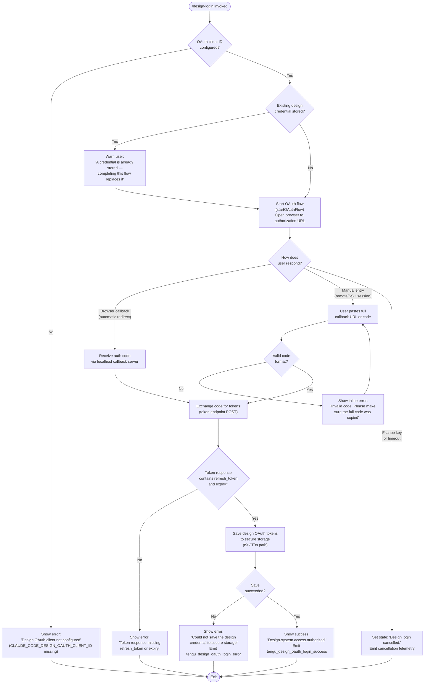

# `/design-login`

> Analysis basis: CC v2.1.181 bundle.js (AST extraction + Claude interpretation)
> Minimum version: v2.1.181

---

## Overview

`/design-login` initiates an OAuth 2.0 authorization flow that links the user's claude.ai account to the design-system integration, granting Claude Code the credentials it needs to drive `/design-sync`. The command renders an interactive JSX panel inside the terminal that opens the user's browser to an authorization URL, waits for the callback, persists the resulting refresh token to secure storage, and reports success or failure inline. This authorization credential is entirely separate from Claude Code's primary session authentication and does not alter any other settings.

---

## Registration

| Field | Value |
|---|---|
| type | `local-jsx` |
| name | `design-login` |
| description | `Authorize design-system access for /design-sync with your claude.ai account` |
| loc_byte | `11838752` |
| loc_byte_end | `11838951` |
| loc_line | `7579` |
| module_id | `tul` |
| load_inline | `true` |
| arbor_handler.name | `rul` |
| arbor_handler.fqn | `claude-2.1.181::rul` |
| arbor_handler.kind | `Function` |
| arbor_handler.resolution_path | `direct` |
| arbor_handler.n_hits | `1` |

Analysis basis: CC v2.1.181 bundle.js:+11838752 – +11838951

---

## Input Branching

The command has more than three distinct execution branches (OAuth client absent, browser flow, manual code entry, success, cancellation, storage failure), so a Mermaid flowchart is used.



---

## Behavioral Spec

### Panel Initialization

```
function designLoginPanel(props):
    state = useState("starting")       // initial animation / loading state
    clockContext = useClockContext()    // Ms → VTi.useContext; throws if no ClockProvider
    terminalSize = useTerminalSize()   // hr → AIi.useContext; throws if no Ink App
    authCodeRef = useRef(null)

    // Spinner tick: interval ~50 ms, 4 frames (bundle.js:+11832647, +11832671)
    spinnerFrame = max(0, floor(elapsed / 50) % 4)

    render loginUI(state, spinnerFrame, terminalSize)
```

Analysis basis: CC v2.1.181 bundle.js:+11832418, +11832574, +11832637–11832671

---

### OAuth Client Guard

```
function checkOAuthClientConfigured():
    clientId = resolveDesignOAuthClientId()   // ks / I9n path
    if clientId starts with "00000000-":
        // placeholder sentinel — client not registered in this build
        throw ConfigError(
          "The Claude Design OAuth client is not configured in this build. " +
          "Set CLAUDE_CODE_DESIGN_OAUTH_CLIENT_ID …"
        )
    return clientId
```

Literal sentinel prefix: `"00000000-"` (bundle.js:+10158505).  
Error message literal excerpt: `"…not configured in this build…"` (bundle.js:+11833531).

---

### Authorization URL Construction and Browser Launch

```
function startBrowserOAuthFlow(clientId):
    redirectUri = "http://localhost:<port>/callback"   // bundle.js:+6613552
    authUrl = buildAuthorizationUrl(clientId, redirectUri, state=randomState())
    openBrowser(authUrl)

    // If browser did not open automatically, show fallback UI:
    //   "Browser didn't open? Use the url below to sign in"  (bundle.js:+11836005)
    //   Display authUrl; show "(Copied!)" after clipboard write (bundle.js:+11836101)

    startLocalCallbackServer(redirectUri)
    return waitForCallback(timeout=300000)   // 5 min; bundle.js:+6590219
```

The callback server binds to `127.0.0.1` (bundle.js:+6590122), listens on the port embedded in the redirect URI, and handles exactly the path `/callback` (bundle.js:+6588744).  
Authentication timeout: 300 000 ms / 5 minutes (bundle.js:+6590219).

Analysis basis: CC v2.1.181 bundle.js:+6585687 (`tengu_mcp_oauth_flow_start`), +6590111

---

### Callback Server — Request Handling

```
function handleCallbackRequest(req, res):
    params = parseQueryString(req.url)   // wJi.parse

    if req.path != "/callback":
        res.writeHead(404)
        res.end("Not found")             // bundle.js:+6589544, +6589603
        return

    if params.state != expectedState:
        res.writeHead(400, {"Content-Type": "text/html"})
        res.end(htmlPage(
          "Authentication failed",
          "Invalid state parameter. Close this tab and try again from Claude Code."
        ))
        // bundle.js:+6587962, +6588972
        return  // CSRF guard

    if params.error present:
        resolvedError = classifyOAuthError(params.error, params.error_description)
        rejectFlow(resolvedError)
        return

    if params.code absent:
        res.end(htmlPage("Authentication failed", "Close this tab and try again…"))
        return

    // Success path
    res.writeHead(200, {"Content-Type": "text/html"})
    res.end(htmlPage(
        "Authentication successful",
        "You can close this tab and return to Claude Code."
    ))
    resolveFlow(params.code)
```

Analysis basis: CC v2.1.181 bundle.js:+6588869, +6589075, +6589427, +6589463

---

### Manual Code Entry (Remote / SSH Sessions)

When `/design-login` detects an SSH environment (`e$d → qe.isSSH`; bundle.js:+6613353), or the user manually pastes the redirect URL, the command accepts input via `r.handleManualAuthCodeInput` (bundle.js:+11833359).

```
function handleManualInput(rawInput):
    parsed = extractCodeFromCallbackUrl(rawInput)   // splits on "?code=…&state=…"
    if parsed.code is empty or malformed:
        showError("Invalid code. Please make sure the full code was copied")
        // bundle.js:+11833162
        return  // stay in waiting_for_login state

    emitTelemetry("tengu_design_oauth_manual_entry")   // bundle.js:+11833321
    submitAuthCode(parsed.code)
```

State label during waiting: `"waiting_for_login"` (bundle.js:+11833235).

---

### Token Exchange

```
function exchangeCodeForTokens(code, clientId, redirectUri):
    response = httpPost(tokenEndpoint, {
        grant_type: "authorization_code",
        code: code,
        redirect_uri: redirectUri,
        client_id: clientId
    }, {
        headers: {"Content-Type": "application/json"},
        timeout: 5000   // bundle.js:+2135442
    })

    if isAxiosError(response):
        classify error as "network"   // bundle.js:+2135576
        raise NetworkError

    tokens = response.data
    if tokens.refresh_token absent OR tokens.expiry absent:
        raise TokenError(
          "The token response was missing a refresh token or expiry …"
          // bundle.js:+10158931
        )

    return tokens
```

Analysis basis: CC v2.1.181 bundle.js:+2135284–2135449 (`t1` call graph)

---

### Token Persistence

```
function saveDesignTokens(tokens):
    // T9n → t9t path (bundle.js:+11834257, +10155064)
    result = secureStorageSave(tokens, onlyIf=credentialSlotAvailable)
    if result is error:
        logError("Failed to save design OAuth tokens")   // bundle.js:+10155457
        return Err(
          "Could not save the design credential to secure storage."
          // bundle.js:+11834366
        )
    return Ok
```

---

### Success / Failure Display

```
function renderOutcome(state):
    if state == "success":
        showMessage("Design-system access authorized.")   // bundle.js:+11832733
        emitTelemetry("tengu_design_oauth_login_success")

    elif state == "cancelled" (Escape key):
        showMessage("Design login cancelled.")            // bundle.js:+11832898
        // no success telemetry

    elif state == "error:storage":
        showMessage("Could not save the design credential to secure storage.")
        emitTelemetry("tengu_design_oauth_login_error")

    elif state == "about_to_retry":
        // Intermediate retry animation; brief 1500 ms pause  (bundle.js:+11834591)
        delay(1500)
        restartFlow()
```

Cancellation is triggered by the `"escape"` key binding (bundle.js:+11832809).  
The `"return"` key binding (bundle.js:+11832962) confirms manual code submission.

---

### MCP OAuth Flow (Underlying Shared Infrastructure)

`/design-login` re-uses the same OAuth callback-server infrastructure that MCP OAuth flows (`Iae`) employ. Key shared behaviors:

| Behavior | Detail |
|---|---|
| Callback server binds | `127.0.0.1:<dynamic port>` (bundle.js:+6590122) |
| Server unreferenced from event loop | `L.unref()` called immediately (bundle.js:+6590148) |
| Timeout | 300 000 ms (bundle.js:+6590219) |
| State parameter CSRF guard | Mismatch → 400 response + `"OAuth state mismatch - possible CSRF attack"` (bundle.js:+6587962) |
| `EADDRINUSE` handling | Retries on alternate port (bundle.js:+6589827) |
| Server cleanup log | `"MCP OAuth server cleaned up"` (bundle.js:+6587525) |

---

## State & Side Effects

| Item | Detail |
|---|---|
| Telemetry — `tengu_design_oauth_manual_entry` | Fired when user submits code manually (bundle.js:+11833321) |
| Telemetry — `tengu_design_oauth_login_success` | Fired on successful token persistence (bundle.js:+11834462) |
| Telemetry — `tengu_design_oauth_login_error` | Fired on token exchange or storage failure (bundle.js:+11834615) |
| Telemetry — `tengu_mcp_oauth_flow_start` | Fired when OAuth flow initializes (bundle.js:+6585687) |
| Telemetry — `tengu_mcp_oauth_flow_success` | Fired on successful OAuth authorization (bundle.js:+6590645) |
| Telemetry — `tengu_mcp_oauth_flow_error` | Fired when OAuth authorization fails (bundle.js:+6592356) |
| Telemetry — `tengu_feature_ok` / `_sad` / `_bad` | Generic feature-health probes on OAuth helper path (bundle.js:+1019804, +1019871, +1019952) |
| Secure storage write | Tokens saved via secure-storage API (`t9t`/`T9n`); existing design credential is overwritten if present |
| Local HTTP server | Ephemeral callback server on `127.0.0.1`, unref'd, torn down after flow or timeout |
| Clipboard write | Authorization URL is copied to clipboard; `"(Copied!)"` indicator shown (bundle.js:+11836101) |
| React state machine | Panel holds internal states: `"starting"`, `"waiting_for_login"`, `"about_to_retry"`, `"processing"`, `"success"`, cancelled (bundle.js:+11832437, +11833235, +11833002, +11834061, +11832701) |
| appState changes | No global appState mutations detected within depth-2 traversal |
| Sound | <!-- TODO: not found in depth-2 traversal; needs --depth 4 --> |
| Hook registration | `QP.useState`, `QP.useRef`, `QP.useCallback`, `QP.useEffect` — all standard React/Ink lifecycle hooks registered inside `eul` |
| Daemon config reload | `tengu_daemon_config_reload` event emitted by shared write-watcher (`d` path; bundle.js:+17117192) |

---

## Version History

| Version | Change |
|---|---|
| v2.1.181 | Initial analysis |

---

## Common Mistakes

1. **Missing `CLAUDE_CODE_DESIGN_OAUTH_CLIENT_ID`** — If the environment variable is absent or the build ships the placeholder client ID (UUID starting with `00000000-`), the command aborts immediately with a configuration error. This is a build-time issue, not a user error.
2. **Pasting only the auth code instead of the full callback URL** — In SSH/remote sessions the manual entry expects the full redirect URL (e.g. `http://localhost:<port>/callback?code=…&state=…`). Pasting only the bare code value will fail validation.
3. **Assuming `/design-login` re-authenticates the main Claude Code session** — This command grants access exclusively to the design-system (`/design-sync`) scope. It creates a separate design credential and does not replace or affect the primary API key or OAuth session.
4. **Running the command in an environment where `127.0.0.1` is unreachable** — The callback server binds locally. Containerised or heavily firewalled environments may prevent the OAuth redirect from completing automatically; use the manual URL-paste fallback in those cases.
5. **Interrupting mid-flow and expecting credentials to persist** — If the user presses Escape or the flow times out (5-minute window), the credential is not written. The command must be re-run from scratch.

---

## Appendix — Identifier Mapping

> For bundle debugging only. Identifiers change across versions.

| Identifier | Role |
|---|---|
| `vVp` | Top-level JSX render wrapper for the design-login panel (handler per callGraph entry; `rul` per Arbor) |
| `rul` | Arbor-resolved handler function for `/design-login` (direct resolution) |
| `eul` | Main design-login React component (state machine, event handlers, render tree) |
| `Ms` | Clock context accessor (`VTi.useContext` wrapper) |
| `hr` | Terminal-size context accessor (`AIi.useContext` wrapper) |
| `T` | Keystroke / input event dispatcher |
| `x` | File-write supervisor / daemon write dispatcher |
| `mlc` | File path resolution helper (realpath + stat) |
| `Dn` | Error-code resolver (ENOENT etc.) |
| `Xp` | Utility: path joiner or resolver |
| `I` | HTTP request builder / fetch wrapper |
| `xhc` | HTTP options assembler |
| `Re` | JSON serializer wrapper |
| `qc` | URL path-component builder |
| `nqe` | Query-string builder |
| `Rhc` | File write executor (Buffer.byteLength, then-chain) |
| `ke` | Subprocess / worker spawner |
| `Ho` | Error constructor helper |
| `rt` | String normalization utility |
| `ta` | Queue/routing helper (`qYo`) |
| `fVc` | Ring-buffer / shift-push queue |
| `F9f` | Version fetch wrapper (`nUn`) |
| `nUn` | Fetches `claude` versions from join path |
| `d` | Daemon write-stream orchestrator |
| `YGe` | File stat + content reader with size guard (1 MiB limit) |
| `r` | Data-channel write wrapper |
| `bkl` | Column-width formatter (Object.keys + Math.max) |
| `i` | Stream handle holder (close/get) |
| `y` | Ticker/heartbeat controller (`UOt`, `oht`) |
| `E` | Configurable rate-limiter / token-bucket (Math.max, Math.min) |
| `dlc` | Heartbeat payload builder (`Use`) |
| `j` | General-purpose async scheduler |
| `s` | Set-based in-flight tracker (add / delete / finally) |
| `a` | MCP server-state applier (DBe + bQn orchestration) |
| `DBe` | Full MCP server lifecycle manager (connect, reconnect, OAuth, cleanup) |
| `z8` | MCP server discovery / config-to-connection mapper |
| `Hrt` | Config entry transformer |
| `x7` | Per-server connection driver (Promise.all, tool approval, dynamic tools) |
| `h5` | SDK-type server enumerator |
| `Zwn` | Connection status colorizer (red/yellow) |
| `Art` | Connection-result applicator (r.has / r.set / r.get) |
| `Pk` | Config persistence helper (`M_`, `LVr`) |
| `M_` | Config file writer (`Pue`, `It`, `Fa`) |
| `LVr` | Config lock/version helper |
| `o` | Output formatter (s.map / i.padEnd) |
| `qn` | Retry-delay scheduler |
| `UOt` | Timer/tick reference holder |
| `Jta` | Server fingerprint + connection metadata builder |
| `Mzr` | Connection output writer (`oi`, `wxn`, `Wt`) |
| `wwe` | Config-hash generator (SHA-256) |
| `KAn` | Capability key enumerator (`Tse`, `Object.keys`, `ez`) |
| `zAn` | Auth-state hash builder |
| `AI` | Token-hash builder (`Re`, `Dti.createHash`) |
| `qAn` | Credential accessor (`uc`) |
| `uc` | Secure-storage read helper |
| `sn` | MCP debug log emitter (`jJ.logMCPDebug`) |
| `yLn` | MCP OAuth orchestrator (complete_authentication, race, SLn, R7, etc.) |
| `t$d` | OAuth URL builder |
| `R9` | Token storage writer (`M9`, `$l`) |
| `Aae` | Connector hint builder ("Connect via Settings → Connectors on claude.ai") |
| `hae` | OAuth hint renderer |
| `Iae` | MCP OAuth callback-server lifecycle (createServer, listen, unref, setTimeout) |
| `Trt` | Pending-flow registry (pLn map) |
| `p` | Process exit / abort controller |
| `SLn` | Needs-auth cache reader (`oi`, `wxn`) |
| `R7` | MCP reconnect driver (Promise.all, xe, Me, Du, Ee) |
| `M9` | Token store (`$l`) |
| `Du` | MCP error log emitter (`jJ.logMCPError`) |
| `Ee` | String coercion wrapper |
| `n$d` | Nonce/state generator |
| `e$d` | SSH-environment detector (`qe.isSSH`, `rt`, `_a`) |
| `ELn` | Auth-URL extractor from tool results (`ZFd`, `brt`) |
| `brt` | Deferred-login map reader (`dLn.get`) |
| `Irt` | Pending-flow map reader (`pLn.get`) |
| `ana` | Server reconnect attempt wrapper (`Txn.then`, `Mzr`, `oi`, `wxn`, `Re`) |
| `oi` | AsyncLocalStorage store reader |
| `wxn` | Path-join + serializer (`vxn.join`, `sr`) |
| `WVr` | Post-auth token writer (`AI`, `uc`, `sn`, `Ee`) |
| `m` | Worker kill iterator (`n.values`, `x.kill`) |
| `n` | String lowercase normalizer |
| `gP` | MCP skills telemetry emitter (`ut`) |
| `ut` | Skills count/tag builder |
| `wVr` | Tool-filter applicator (`un`, `n.includes`) |
| `un` | Tool definition builder |
| `w` | Background-worker scheduler (blurred/focused, Math.min, Date.now) |
| `Az` | Worker focus-state tracker |
| `L` | Worker-pool sweep loop (retire, respawn, prewarm) |
| `v` | Worker-pool state reader |
| `uQl` | Last-item accessor (`e.at`) |
| `nna` | Schema validator dispatcher (`y8`, `Qrt`, `Lxn`) |
| `y8` | JSON-schema validator (TypeError, Number.isSafeInteger, AggregateError) |
| `Qrt` | Integer parser (radix 10) |
| `Lxn` | Integer parser variant |
| `bQn` | MCP connection-result applier (`applyMcpUpdate`, `kBe`, `sn`, `kL`) |
| `kBe` | Config-hash comparator |
| `kL` | Server slot cleanup manager (`Xrt`, `o.cleanup`, `gP`) |
| `Xrt` | Config-hash equality checker |
| `l` | Daemon status writer (`cxl`) |
| `cxl` | Status-file writer (`hQ`, `Date.now`, `oi`, `sjt`, `Re`) |
| `hQ` | Config-file reader (`cfe`) |
| `sjt` | Status-file path builder |
| `kOo` | MCP full-reconcile loop (Object.entries, filter, getClients, DBe, bQn) |
| `sLn` | Auth-cache membership checker (`vFd.has`, `NVr.has`) |
| `Fn` | Timeout-with-abort helper (Error, r, setTimeout, clearTimeout, s.unref) |
| `c` | Background-session handle (`bn`) |
| `n9t` | Design OAuth client-ID resolver entry (`I9n`) |
| `I9n` | OAuth client-ID lookup (calls `ks`) |
| `ks` | OAuth endpoint/client resolver (`vWo`, `UOc`, `t.replace`, `JQt.includes`, Error) |
| `vWo` | Prod-environment endpoint constant holder |
| `UOc` | Staging-environment endpoint constant holder |
| `t1` | Token-exchange HTTP caller (`ho.post`, `ks`, `xe`, `ho.isAxiosError`, `I`, `Ut`) |
| `xe` | Feature-ok telemetry helper (`j`, `$e`) |
| `$e` | Telemetry payload builder (`Rht`) |
| `Rht` | Telemetry transport |
| `Ut` | Feature-sad/bad telemetry helper (`j`, `$e`) |
| `jdo` | Token-response validator and credential saver (`ipe.filter`, `t1`, `n.join`, `ipe.some`) |
| `T9n` | Credential persistence wrapper (`uc`, `t.onlyIf`, `I`, `Ee`) |
| `Nd` | Ink context aggregator (useContext, useRef, useMemo, useSyncExternalStore) |
| `u` | App-root lifecycle orchestrator (xe, Me, zU, cG) |
| `Me` | Feature-bad telemetry helper |
| `zU` | Session initializer (`d4`, `sz.push`, `zUe`, `q1r`) |
| `d4` | Config bootstrapper (`Q2`) |
| `zUe` | State hydrator (`xR`) |
| `q1r` | Event emitter / session-start signaller (`Ggn`, `j1r.randomUUID`, `sJe`, `$j`, `e.emit`) |
| `cG` | Graceful-shutdown orchestrator (Promise.race, Promise.all, `dme`, `_me`, `Fn`, process.exit) |
| `dme` | Server shutdown caller (`ume.shutdown`) |
| `_me` | Timeout-cancel + cleanup on shutdown (`clearTimeout`, `y0o`) |
| `Vv` | Clipboard utility dispatcher (`qxt`, `hgi`, `WJu`, `PUr`, `Vxt`, `gL`, `eE`) |
| `qxt` | Clipboard read helper |
| `b_` | OSC-52 escape-sequence builder |
| `hgi` | Clipboard write dispatcher (platform-aware: macOS pbcopy, Linux wl-copy/xclip/xsel, Windows PowerShell) |
| `Un` | Clipboard-write executor (`Vr`, `Mt`) |
| `Vr` | Subprocess spawn for clipboard (`LOe`, `Xp`, `qzc`, `ln`, `Wzc`, `ke`) |
| `Mt` | Clipboard error handler |
| `OUr` | OSC-52 terminal-write path (`Yt`, `TA`) |
| `TA` | DCS/OSC escape builder (`xWo`) |
| `WJu` | tmux buffer clipboard path (`Un`, `I`) |
| `PUr` | OSC-52 availability checker |
| `Vxt` | Clipboard-read via OSC-52 (`qxt`, `Yt`) |
| `gL` | Clipboard text sanitizer (`PUr`, `e.replaceAll`) |
| `eE` | Clipboard join helper (`Agi`, `e.join`) |
| `Agi` | OSC-52 encoder |
| `t9t` | Secure-storage write caller for design tokens (`uc`, `I`, `Ee`) |

Note: index built via Arbor fallback; some signals (telemetry, literals) may be missing — see arbor-fallback.js.