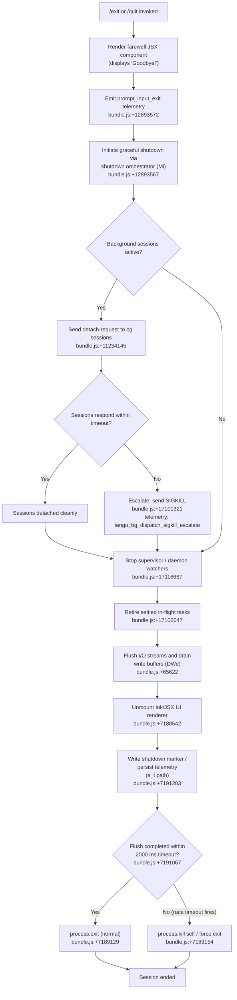

# `/exit`

> Analysis basis: CC v2.1.181 bundle.js (AST extraction + Claude interpretation)
> Minimum version: v2.1.181

---

## Overview

The `/exit` command (aliased as `/quit`) terminates the Claude Code CLI session. When invoked, it triggers a multi-phase shutdown sequence: it displays a farewell message ("Goodbye!"), flushes pending I/O and telemetry, gracefully stops active background and daemon sessions, unmounts the UI renderer, and finally calls `process.exit`. The command is registered as `local-jsx` type, meaning its output is rendered as a JSX component before teardown.

---

## Registration

| Field | Value |
|---|---|
| type | `local-jsx` |
| name | `exit` |
| description | `null` |
| aliases | `["quit"]` |
| loc_byte | `12894135` |
| loc_byte_end | `12894331` |
| loc_line | `8496` |
| immediate | `true` |
| module_id | `twl` |
| load_inline | `true` |
| arbor_handler.name | `naf` |
| arbor_handler.fqn | `claude-2.1.181::naf` |
| arbor_handler.kind | `AsyncFunction` |
| arbor_handler.resolution_path | `module_id` |
| arbor_handler.n_hits | `1` |

Analysis basis: CC v2.1.181 bundle.js:+12894135–+12894331

---

## Input Branching

The `/exit` command does not branch on user-supplied arguments. However, the shutdown sequence internally branches across multiple distinct paths depending on runtime state: whether background (daemon/bg) sessions are active, whether the UI renderer is mounted, whether in-flight async tasks exist, and whether a forced-shutdown timeout fires. This yields well over three distinct execution branches.



---

## Behavioral Spec

### 1. Handler Entry — `exitCommandHandler` (bundle name: `naf`)

The handler is an `AsyncFunction` resolved via `module_id` → `twl`.

```
async function exitCommandHandler(context):
    # 1. Check process mode (bg / daemon / daemon-worker)
    processMode = checkProcessMode()   # Ci → G1e; literals "bg","daemon","daemon-worker"

    # 2. Trigger random farewell variant (e → Math.random / setTimeout)
    scheduleRandomFarewell()

    # 3. Send detach-request message to any active background session (xHe)
    sendDetachRequest()                # literal "detach-request" @ +11234145

    # 4. Read and display scheduled tasks (hGn → g5p → sP / G1 / dtt)
    scheduledTaskSummary = gatherScheduledTasks()   # literal "scheduled task" @ +11227151

    # 5. Render JSX farewell component (kIo.createElement)
    #    The component displays the "Goodbye!" string literal (+12893348)
    renderFarewellComponent()

    # 6. Emit telemetry: prompt_input_exit (+12893572)
    emitTelemetry("prompt_input_exit")

    # 7. Delegate to full shutdown orchestrator (Mi)
    await runShutdownOrchestrator()
```

Analysis basis: CC v2.1.181 bundle.js:+12893384–+12893567

---

### 2. Detach-Request to Background Sessions — `bgDetachHelper` (bundle name: `xHe`)

```
function bgDetachHelper():
    # Write "detach-request" message via stream writer (x6 → Yte.write)
    writeToStream("detach-request")   # literal @ +11234145

    # Serialize with JSON.stringify (Re path)
    payload = serializeMessage(message)

    # Invoke Vce for post-detach cleanup
    postDetachCleanup()
```

Analysis basis: CC v2.1.181 bundle.js:+11234108–+11234221

---

### 3. Scheduled-Task Display — `scheduledTaskDisplay` (bundle name: `hGn`)

```
function scheduledTaskDisplay():
    # Initialize output buffer (F0 → fx)
    buffer = initOutputBuffer()

    # Push "scheduled task" label @ +11227151
    buffer.push(LABEL_SCHEDULED_TASK)

    # Parse cron/schedule expressions (g5p → sP, G1, dtt)
    tasks = parseScheduleExpressions()

    # Format display with column alignment (qa → nn → Bun.stringWidth)
    formatted = alignColumns(tasks)

    # Compute next-run times (g5p → ea → Math.floor / Math.round)
    nextRuns = computeNextRunTimes(tasks)

    return formatted + nextRuns
```

Analysis basis: CC v2.1.181 bundle.js:+11227132–+11227413

---

### 4. Schedule Expression Parser — `scheduleParser` (bundle name: `sP`)

```
function scheduleParser(expression):
    trimmed = expression.trim()

    # "Every minute" shorthand detection (+4900153)
    if trimmed matches /every minute/ pattern:
        return { intervalMs: 60000, label: "Every minute" }

    # Field count: minimum 5 fields (+4900069, value=5)
    fields = trimmed.split(whitespace)
    if fields.length < 5:
        return parseError("too few fields")

    # Parse numeric fields with parseInt (+4900209)
    parsed = fields.map(parseInt)

    # "Every hour" shorthand (+4900370)
    if pattern matches hourly:
        return { intervalMs: 3600000, label: "Every hour" }

    # Day-of-week boundary: value 7 treated as 0 (Sunday) (+4900880)
    dow = normalizeDoW(parsed[4])   # literal 7 @ +4900880

    # Range "1-5" for weekday support (+4901077)
    if expression includes "1-5":
        return weekdaySchedule()

    # UTC date/day manipulation (A.getUTCDay, A.setUTCDate, etc.)
    adjustedDate = applyUTCOffsets(parsed)

    return { nextRun: adjustedDate }
```

Analysis basis: CC v2.1.181 bundle.js:+4900033–+4900989

---

### 5. Shutdown Orchestrator — `shutdownOrchestrator` (bundle name: `Mi`)

This is the primary teardown function coordinating all exit sub-phases.

```
async function shutdownOrchestrator():
    # Phase A: unmount UI renderer
    unmountRenderer()          # i3e → e.unmount @ +7188542

    # Phase B: restore terminal state (Xyn)
    #   - write ESC-7 / ESC-8 cursor save/restore sequences (+3884092, +3884103)
    #   - handle tmux / iTerm2 / Ghostty terminal variants
    restoreTerminalState()

    # Phase C: write "other" context marker (+7190656)
    writeContextMarker("other")

    # Phase D: write exit summary to stdout (lXr)
    #   - replace special chars: "\\" and "\"" (+7188840, +7188863)
    #   - write dim-formatted text (gt.dim @ +7188937)
    writeExitSummary()

    # Phase E: clear any pending UI timeout (clearTimeout @ +7191079)
    clearTimeout(pendingTimer)

    # Phase F: flush async settlement of all pending promises (Hla)
    await Promise.allSettled(Array.from(pendingPromises))   # +13526735

    # Phase G: abort any active AbortController signals (+7191167)
    AbortSignal.timeout(shutdownDeadline)

    # Phase H: persist telemetry / perf data (e_t → Ror → D3o → v3o)
    persistTelemetryAndPerf()

    # Phase I: render scroll-summary telemetry (Ckn → tengu_scroll_summary)
    emitScrollSummary()

    # Phase J: emit session_end event (+7191279)
    emitTelemetry("session_end")

    # Phase K: emit cache eviction hint (+7191241)
    emitTelemetry("tengu_cache_eviction_hint")

    # Phase L: race between clean completion and 2000 ms hard timeout
    #   timeout value: 2000 ms (+7191067), with max(5000, 3500) guard (+7190882/+7190889)
    result = await Promise.race([
        cleanShutdown(),
        hardTimeoutPromise(2000)
    ])

    # Phase M: call process.exit or process.kill depending on race result
    if result == "clean":
        process.exit(0)      # cXr @ +7189129
    else:
        process.kill(pid)    # cXr @ +7189154
        throw Error("unreachable")   # literal "unreachable" @ +7189202

    # Phase N: write final sync bytes to stdout (Fhe.writeSync @ +7191353)
    Fhe.writeSync(finalBytes)
```

Analysis basis: CC v2.1.181 bundle.js:+7190785–+7191353

---

### 6. Terminal Restore — `terminalStateRestore` (bundle name: `Xyn`)

```
function terminalStateRestore():
    # Save/restore cursor via ANSI escape sequences
    vZ.writeSync(ESC_7)    # "\x1B7" @ +3884092
    vZ.writeSync(ESC_8)    # "\x1B8" @ +3884103

    # Detect terminal emulator (RFe)
    terminal = detectTerminal()   # checks "ghostty"@+3610419, "iTerm.app"@+3610488

    # Apply tmux / screen double-escape workaround (gL)
    #   tmux escape: replace with "\x1B\x1B" @ +3533564
    #   "screen" also patched @ +3533591
    if terminal.isTmux:
        applyTmuxEscape()

    # Write final restore payload (Xp, I)
    writeRestorePayload()
```

Analysis basis: CC v2.1.181 bundle.js:+3883938–+3884189

---

### 7. Force-Exit Path — `forceExitExecutor` (bundle name: `cXr`)

```
function forceExitExecutor():
    clearTimeout(activeTimer)

    # Retrieve active process handle from registry (Vu.get @ +7189081)
    handle = processRegistry.get(currentId)

    if handle exists:
        process.exit(handle.code)   # +7189129
    else:
        # Escalate: kill the process group
        process.kill(pid, signal)   # +7189154

    # This point should never be reached
    throw new Error("unreachable")  # +7189196
```

Analysis basis: CC v2.1.181 bundle.js:+7189048–+7189196

---

### 8. Telemetry Persistence — `telemetryPersist` (bundle name: `e_t` → `Ror` → `D3o` / `v3o`)

```
async function telemetryPersist():
    # Build storage path (v3o → JHt.join, sr, Lt)
    storagePath = buildTelemetryPath()

    # Write startup perf report if enabled (x3o / k3o)
    #   label "startup-perf" @ +222461
    #   label "main_after_run" @ +222712
    #   label "mark" @ +222609
    writeStartupPerfReport()

    # Serialize with JSON.stringify @ +222196
    serialized = JSON.stringify(telemetryPayload)

    # Atomic write: openSync → writeFileSync → fsyncSync → closeSync (rEe)
    atomicWriteFile(storagePath, serialized)

    # Merge with existing data (D3o → r.set / r.get / Object.entries)
    mergeAndDeduplicateEvents()

    # Emit tengu_startup_perf event @ +223663
    emitEvent("tengu_startup_perf", perfData)
```

Analysis basis: CC v2.1.181 bundle.js:+221977–+222359

---

### 9. Background-Session Daemon Management — `bgSessionManager` (bundle name: `f`, called via `sP`)

```
function bgSessionManager():
    # Check session state ("closed" @ +17101183)
    if session.state == "closed":
        return

    # Grace period: 30 s primary, 15 s secondary (+17101276, +17101287)
    gracePeriodMs = 30_000   # or 15_000 for secondary
    handle = sessionRegistry.get(sessionId)

    # Attempt graceful kill
    handle.kill(signal)

    # If not responded within 100 ms iterations (+17101396), escalate
    if retryCount > 100:
        handle.kill("SIGKILL")   # +17101369
        emitTelemetry("tengu_bg_dispatch_sigkill_escalate")   # +17101321

    # Low-memory check (N1o.freemem @ +17101752)
    freeMem = os.freemem()
    if freeMem < threshold:
        emitTelemetry("tengu_bg_dispatch_low_mem")   # +17101922

    # Spare-session lifecycle
    emitTelemetry("tengu_bg_spare_enable")    # +17102619
    emitTelemetry("tengu_bg_spare_claim")     # +17102747
    emitTelemetry("tengu_bg_spare_claim_fail") # +17103013

    # Spawn replacement if needed (Dq.spawn @ +17103076)
    if needsReplacement:
        Dq.spawn(newSessionArgs)
```

Analysis basis: CC v2.1.181 bundle.js:+17101183–+17103076

---

## State & Side Effects

| Item | Detail |
|---|---|
| Telemetry: `prompt_input_exit` | Emitted immediately when `/exit` is invoked (bundle.js:+12893572) |
| Telemetry: `session_end` | Emitted during shutdown orchestration (bundle.js:+7191279) |
| Telemetry: `tengu_cache_eviction_hint` | Emitted near end of shutdown (bundle.js:+7191241) |
| Telemetry: `tengu_scroll_summary` | Emitted by scroll-summary reporter during teardown (bundle.js:+7190298) |
| Telemetry: `tengu_startup_perf` | Persisted to disk during telemetry flush (bundle.js:+223663) |
| Telemetry: `tengu_bg_dispatch_sigkill_escalate` | Fired when a background session ignores graceful termination (bundle.js:+17101321) |
| Telemetry: `tengu_bg_dispatch_low_mem` | Fired when free memory is below threshold at shutdown (bundle.js:+17101922) |
| Telemetry: `tengu_bg_spare_enable` | Fired when spare-session pool is activated (bundle.js:+17102619) |
| Telemetry: `tengu_bg_spare_claim` | Fired when a spare session is successfully claimed (bundle.js:+17102747) |
| Telemetry: `tengu_bg_spare_claim_fail` | Fired when spare-session claim fails (bundle.js:+17103013) |
| Telemetry: `tengu_daemon_config_reload` | Fired if daemon config is reloaded during shutdown (bundle.js:+17117192) |
| Telemetry: `tengu_amber_creek` | Display-mode telemetry emitted during shutdown UI path (bundle.js:+3542927) |
| Telemetry: `tengu_pewter_brook` | Display-mode telemetry, alternate path (bundle.js:+3542835) |
| UI renderer | Unmounted via `e.unmount` (bundle.js:+7188542) |
| Terminal state | Cursor save/restore escape sequences written; tmux/screen double-escape applied (bundle.js:+3884092) |
| Background sessions | Sent `detach-request`; escalated to SIGKILL after grace period (bundle.js:+11234145, +17101369) |
| Scheduled tasks | Gathered and displayed before teardown (bundle.js:+11227151) |
| I/O streams | Drained via `v$o.drain` (bundle.js:+65622); final sync write via `Fhe.writeSync` (bundle.js:+7191353) |
| Telemetry file | Atomically written with `openSync → writeFileSync → fsyncSync → closeSync` (bundle.js:+190621–+190726) |
| `process.exit` | Called by force-exit executor after race (bundle.js:+7189129) |
| `process.kill` | Called as escalation fallback (bundle.js:+7189154) |
| Hard timeout | 2000 ms race timeout (bundle.js:+7191067); secondary guard values 5000/3500 ms (bundle.js:+7190882, +7190889) |
| Farewell literal | String `"Goodbye!"` rendered in JSX component (bundle.js:+12893348) |

---

## Version History

| Version | Change |
|---|---|
| v2.1.181 | Initial analysis |

---

## Common Mistakes

1. **Using `/exit` expecting synchronous termination.** The command is `immediate: true` in registration, but the shutdown orchestrator is async and races a 2000 ms hard timeout. If the process hangs, it is force-killed — callers should not assume a clean exit code.
2. **Ignoring the `/quit` alias.** `/quit` is registered as an alias of `/exit` and follows the identical code path. Documentation that mentions only one name may confuse users.
3. **Assuming background sessions are killed instantly.** The daemon/bg session teardown has a 30 s (and 15 s secondary) grace period before SIGKILL escalation. Long-running background sessions may continue briefly after `/exit` is typed.
4. **Expecting output after `"Goodbye!"`.** The JSX farewell component and `"Goodbye!"` literal are rendered at the top of the handler, but stdout may still receive dim-formatted summary text from `lXr` before the final `Fhe.writeSync` flush. Downstream tooling should not parse post-exit output.
5. **Confusing telemetry flush with exit-code guarantee.** Telemetry is written atomically to disk (`fsyncSync`) but only within the 2000 ms window. If the window expires, the force-exit path (`process.kill`) fires without guaranteeing the write completed.

---

## Appendix — Identifier Mapping

> For bundle debugging only. Identifiers change across versions.

| Identifier | Role |
|---|---|
| `naf` | Main exit command handler (`AsyncFunction`; Arbor-resolved entry point) |
| `Ci` | Process-mode checker (detects "bg", "daemon", "daemon-worker") |
| `G1e` | Process-mode classifier helper |
| `xHe` | Background-session detach-request sender |
| `fun` | Sub-helper within detach-request path |
| `Xrl` | Detach coordination sub-routine |
| `h5n` | Detach state sub-helper |
| `bn` | Background session base helper |
| `x6` | Stream writer wrapper (calls `Yte.write`) |
| `Re` | JSON serializer wrapper (calls `JSON.stringify`) |
| `Vce` | Post-detach cleanup routine |
| `dA` | Intermediate state setter during exit sequence |
| `hGn` | Scheduled-task gatherer and display builder |
| `F0` | Output buffer initializer |
| `fx` | Low-level buffer/format utility |
| `g5p` | Schedule expression dispatcher (cron parser coordinator) |
| `sP` | Core schedule expression parser |
| `G1` | Schedule expression pre-processor / trimmer |
| `yEd` | Schedule field tokenizer and range expander |
| `dtt` | Date/time adjustment calculator for schedule next-run |
| `ea` | Duration formatter (floor/round milliseconds) |
| `qa` | Column-width alignment helper |
| `nn` | String width measurer (wraps `Bun.stringWidth`) |
| `Vs` | Grapheme-aware string slicer |
| `$y` | Visual padding sub-helper |
| `taf` | Farewell JSX component factory (renders "Goodbye!") |
| `Mi` | Shutdown orchestrator (primary async teardown function) |
| `i3e` | UI renderer unmount coordinator |
| `oF` | Post-unmount cleanup step |
| `Xyn` | Terminal state restore writer (ANSI escape sequences) |
| `RFe` | Terminal emulator detector (Ghostty, iTerm2, etc.) |
| `vFe` | Terminal variant fallback handler |
| `gL` | tmux/screen escape sequence patcher |
| `Xp` | Final restore payload writer |
| `I` | Debug/log wrapper (checks "debug" mode) |
| `lXr` | Exit summary writer (formats and writes dim text to stdout) |
| `qw` | Shared queue/state accessor |
| `i9` | Internal index or identifier lookup |
| `Lt` | Path/filesystem utility (wraps `fx`) |
| `Z1t` | File stat and path resolver |
| `r2` | Path helper variant A |
| `gr` | Path helper variant B |
| `jt` | Directory creation/check helper |
| `mh` | Additional path resolver |
| `Au` | Git-root or workspace resolver |
| `ala` | String escape helper for exit summary |
| `cXr` | Force-exit executor (calls `process.exit` / `process.kill`) |
| `DWe` | I/O drain helper (calls `v$o.drain`) |
| `d` | Supervisor / daemon watcher manager |
| `YGe` | File stat checker for supervisor paths |
| `ln` | Logger/null-logger helper |
| `oi` | AsyncLocalStorage store accessor |
| `gvo` | Supervisor config reader |
| `Ee` | String coercion wrapper |
| `bkl` | Column-width table formatter for supervisor output |
| `y` | Watcher lifecycle manager (stop method) |
| `UOt` | Watcher type discriminator |
| `oht` | MCP/transport connection handler |
| `E` | Display/renderer configuration object |
| `_` | MCP server stop coordinator (calls `Promise.all`) |
| `dlc` | Heartbeat / keepalive stop helper |
| `Use` | Heartbeat timer implementation |
| `T` | Scroll/input event controller |
| `x` | Key event / input dispatcher |
| `j` | Shared utility / object accessor |
| `Hla` | All-settled promise aggregator |
| `e_t` | Telemetry persistence entry point |
| `Ror` | Telemetry record router |
| `D3o` | Telemetry deduplication and merge logic |
| `v3o` | Telemetry file write coordinator |
| `x3o` | Startup-perf path resolver (variant A) |
| `rEe` | Atomic file write implementation |
| `b3o` | Telemetry payload builder |
| `d9` | `require` wrapper / dynamic import helper |
| `k3o` | Startup-perf path resolver (variant B) |
| `Ckn` | Scroll-summary reporter |
| `ila` | Scroll state accessor |
| `sla` | Scroll summary stats calculator |
| `rla` | Scroll summary sub-helper |
| `Ds` | Display-mode resolver (fullscreen vs default) |
| `qV` | Local-agent mode checker |
| `eM` | Fullscreen enable/disable evaluator |
| `BUr` | Display-mode fallback handler |
| `uZ` | ZJu display state accessor |
| `$Ur` | Windows/OS detection wrapper |
| `Kr` | Terminal type dispatcher |
| `eQu` | Amber-creek telemetry path helper |
| `ut` | Pewter-brook telemetry / Ink render trigger |
| `igt` | Cache-eviction hint emitter |
| `Qe` | `Rht` runtime accessor (variant A) |
| `Rht` | Core runtime handle |
| `Ur` | `Rht` runtime accessor (variant B, "nonconforming" path) |
| `X_` | Nonconforming runtime wrapper |
| `l3e` | Promise-resolve wrapper for async teardown step |
| `Tkn` | Final teardown sub-step |

---

Note: index built via Arbor fallback; some signals (telemetry, literals) may be missing — see arbor-fallback.js.