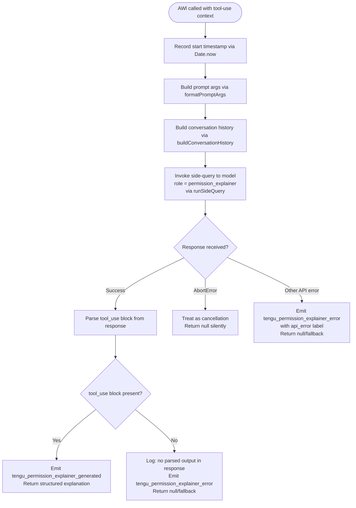

# `/explain_command`

> Analysis basis: CC v2.1.181 bundle.js (AST extraction + Claude interpretation)
> Minimum version: v2.1.181

---

## Overview

The `explain_command` tool generates a human-readable explanation for why a particular tool invocation requires a specific permission. It operates as an internal tool (`type: "tool"`) that fires a side-query to the AI model using the role `"permission_explainer"`, parses a structured `tool_use` block from the response, and emits telemetry for both success and error paths.

---

## Registration

| Field | Value |
|---|---|
| type | `tool` |
| name | `explain_command` |
| description | `null` |
| loc_byte | `14768841` |
| loc_byte_end | `14768877` |
| loc_line | `10922` |
| arbor_handler.name | `AWl` |
| arbor_handler.fqn | `claude-2.1.181::AWl` |
| arbor_handler.kind | `AsyncFunction` |
| arbor_handler.resolution_path | `direct` |
| arbor_handler.n_hits | `1` |

Analysis basis: CC v2.1.181 bundle.js:+14768841

---

## Input Branching

The handler has 4+ distinct branches (permission explainer success, missing parsed output, AbortError, and generic API error), so a flowchart is used.



Analysis basis: CC v2.1.181 bundle.js:+14768536 (AWl→mRo), +14768581 (AWl→_Df), +14768599 (AWl→yDf), +14768746 (AWl→Ns), +14768759 (AWl→m6), +14769324 (tengu_permission_explainer_generated), +14769536 (tengu_permission_explainer_error), +14769994 (AbortError), +14770065 (api_error)

---

## Behavioral Spec

### Top-Level Handler (`AWl` — `explainCommandHandler`)

```
async function explainCommandHandler(toolUseContext):
    startTime = Date.now()

    // Step 1: Prepare the side-query payload
    formattedArgs  = formatPermissionArgs(toolUseContext)   // _Df
    conversationHistory = buildConversationHistory(toolUseContext, limit=3, roleFilter="assistant")  // yDf

    // Step 2: Build model request metadata
    modelRequest = buildSideQueryRequest(conversationHistory, formattedArgs)  // Ns

    // Step 3: Execute the side query
    try:
        response = await runSideQuery(modelRequest, role="permission_explainer")  // m6
    catch AbortError:
        return null  // silent cancellation path (bundle.js:+14769994)
    catch other:
        emitTelemetry("tengu_permission_explainer_error", {error: "api_error"})  // +14770065
        return null

    // Step 4: Parse tool_use block from response
    parsedBlock = extractToolUseBlock(response)  // looks for "tool_use" type content

    if parsedBlock is null or undefined:
        log("Permission explainer: no parsed output in response")  // +14769671
        emitTelemetry("tengu_permission_explainer_error")
        return null

    // Step 5: Emit success telemetry and return
    emitTelemetry("tengu_permission_explainer_generated")  // +14769324
    return parsedBlock
```

Analysis basis: CC v2.1.181 bundle.js:+14768536

---

### Argument Formatter (`_Df` — `formatPermissionArgs`)

```
function formatPermissionArgs(context):
    // Serializes the tool-call arguments as a compact representation
    serialized = jsonStringify(context)       // Re → JSON.stringify (+190076)
    asString   = String(serialized)           // _Df:+14768077
    return asString
```

Analysis basis: CC v2.1.181 bundle.js:+14768051, +14768077

---

### Conversation History Builder (`yDf` — `buildConversationHistory`)

```
function buildConversationHistory(messages, maxMessages=3, roleFilter="assistant"):
    // Filter to assistant messages only
    filtered = messages.filter(m => m.role === "assistant")  // +14768140
    // Take most recent N (up to 3)
    recent   = filtered.reverse().slice(0, maxMessages)      // +14768160, +14768185
    // Extract text content blocks only
    textBlocks = recent.flatMap(m => m.content.filter(c => c.type === "text"))  // "text":+14768243
    // Truncate long blocks with "..."
    truncated = textBlocks.map(b => truncateContent(b))      // OD: +14768328, "...":+14768336
    // Prepend oldest first, join
    result = truncated.reverse().unshift(...).join(...)       // +14768344, +14768377
    return result
```

Analysis basis: CC v2.1.181 bundle.js:+14768117, +14768140, +14768160, +14768185, +14768243, +14768328, +14768336, +14768344, +14768377

---

### Side-Query Executor (`m6` — `runSideQuery`)

```
async function runSideQuery(requestPayload, options):
    // Label this invocation as a side_query ("side_query":+8775285)
    // Attach role "permission_explainer" ("permission_explainer":+14768899)
    // Uses structured_outputs mode ("structured_outputs":+8775413)
    // Sends via the standard API request pipeline (Rj)
    // Applies conversation cache control ("cache_control":+8777455)
    // Caps history at Math.min context window size (8776132)
    // Records performance.now timestamps (8776743)
    response = await apiRequestPipeline(requestPayload, {
        role: "permission_explainer",
        queryType: "side_query",
        structuredOutputs: true,
        cacheControl: "cache_control",
    })
    emitTelemetry("tengu_api_success")  // +8776956
    return response
```

Analysis basis: CC v2.1.181 bundle.js:+8775285, +8775413, +8775474, +8776132, +8776253, +8776743, +8776956, +14768899

---

### Response Parser / Tool-Use Block Extractor (`AWl` inline — `extractToolUseBlock`)

```
function extractToolUseBlock(response):
    // Searches response content array for a block with type === "tool_use"
    // ("tool_use":+14769054)
    for block in response.content:
        if block.type === "tool_use":
            return block
    return null
    // Absence triggers the "no parsed output" warning path (+14769671)
```

Analysis basis: CC v2.1.181 bundle.js:+14769054, +14769671

---

### Config Reader (`w_e` — `readConfigFile`)

Called transitively through the config-access path (`It → w_e`).

```
function readConfigFile(path, fs):
    // Guard: throws if config accessed before initialization
    // ("Config accessed before allowed.":+13941172)
    if not initialized:
        throw Error("Config accessed before allowed.")

    raw = fs.readFileSync(path, "utf-8")  // +13941255
    parsed = JSON.parse(raw)              // via Wt:+190853

    if parsed has ENOENT:                 // "ENOENT":+13941402
        return defaultConfig

    // Strip prefix from string values via x9
    result = stripConfigPrefix(parsed)
    return result
```

Analysis basis: CC v2.1.181 bundle.js:+13941172, +13941228, +13941255, +13941278, +13941402

---

### File Watcher Registration (`Byf` — `registerConfigFileWatcher`)

```
function registerConfigFileWatcher(configPath, callback):
    // Uses Zzn.watchFile to monitor the config path (+13937323)
    // On change: re-parses with x9 (prefix-strip), resets p0o flag (+13937492, +13937554)
    // Registers cleanup hook via Gi → v$o.register (+65579)
    // Calls Zzn.unwatchFile on dispose (+13937656)
    watcher = Zzn.watchFile(configPath, handler)
    Gi.register(cleanup)
    return watcher
```

Analysis basis: CC v2.1.181 bundle.js:+13937318, +13937323, +13937492, +13937554, +13937643, +13937656

---

## State & Side Effects

| Item | Detail |
|---|---|
| Telemetry: `tengu_permission_explainer_generated` | Fired on successful extraction of `tool_use` block from model response (bundle.js:+14769324) |
| Telemetry: `tengu_permission_explainer_error` | Fired when response lacks a parseable `tool_use` block, or on API error (bundle.js:+14769536) |
| Telemetry: `tengu_api_success` | Fired by the generic side-query path on any successful API round-trip (bundle.js:+8776956) |
| Telemetry: `tengu_config_parse_error` | Fired by `readConfigFile` on JSON parse failure (bundle.js:+13941803) |
| Telemetry: `tengu_config_auth_loss_prevented` | Fired when a config save would drop auth credentials (bundle.js:+13936136) |
| Telemetry: `tengu_lone_surrogate_sanitized` | Fired when a lone Unicode surrogate is removed from a payload (bundle.js:+8776652) |
| Telemetry: `tengu_prompt_cache_1h_config` | Fired when 1-hour prompt-cache config is applied (bundle.js:+13696975) |
| Telemetry: `tengu_stream_watchdog_default_on` | Fired by stream watchdog initialisation path (bundle.js:+3020905) |
| Telemetry: `tengu_byte_watchdog_fired_late` | Fired when byte-stream watchdog fires late (bundle.js:+3020187) |
| Telemetry: `tengu_feature_ok` / `tengu_feature_bad` / `tengu_feature_sad` | Generic feature-flag telemetry reached transitively (bundle.js:+1019804, +1019871, +1019952) |
| Hook registration | `Gi → v$o.register` used for config-file watcher cleanup (bundle.js:+65579) |
| File I/O | `fs.readFileSync` with `"utf-8"` encoding; `fs.statSync`; `fs.copyFileSync`; `fs.mkdirSync` all reached via config path |
| Backup directory | Config backups stored under `"backups"` subdirectory (bundle.js:+13940740) |
| appState changes | No direct `appState` mutations observed within depth-2 traversal |
| Sound | No sound effects observed within depth-2 traversal |
| Side-query label | `"side_query"` tag attached to all model calls from this handler (bundle.js:+8775285) |
| Structured outputs | Model request uses `"structured_outputs"` mode (bundle.js:+8775413) |
| Cache control | Prompt cache with `"1h"` TTL applied when configured (bundle.js:+8776174) |
| Request timeout | Stream byte-watchdog default 15 000 ms; hard timeout 120 000 ms (bundle.js:+3019187, +3019205) |

---

## Version History

| Version | Change |
|---|---|
| v2.1.181 | Initial analysis |

---

## Common Mistakes

1. **Expecting a description in the UI** — `description` is `null` in the registration object; this tool is not exposed as a user-visible slash command and has no help text. Do not rely on its name appearing in completion menus.
2. **Assuming synchronous execution** — `AWl` is an `AsyncFunction`; callers must `await` it or handle the returned Promise explicitly.
3. **Treating the result as plain text** — The successful return value is a parsed `tool_use` block (structured object), not a human-readable string. Callers that treat it as a string will see `[object Object]`.
4. **Ignoring `null` returns** — Both the `AbortError` path and the missing-`tool_use`-block path return `null`. Callers must guard against a `null` result.
5. **Confusing `tengu_permission_explainer_error` with a fatal error** — The tool swallows errors internally and returns `null`; the telemetry event is informational and the process continues normally.
6. **Triggering config access too early** — Any code path that reads the config before the initialization guard passes will throw `"Config accessed before allowed."` (bundle.js:+13941172).

---

## Appendix — Identifier Mapping

> For bundle debugging only. Identifiers change across versions.

| Identifier | Role |
|---|---|
| `AWl` | Main async handler for `explain_command` (`explainCommandHandler`) |
| `mRo` | Config/context initialisation helper called first by `AWl` |
| `It` | Config accessor / initialisation guard |
| `jt` | Logging/debug utility |
| `p0o` | Config-ready flag or sentinel |
| `w_e` | Config file reader (`readConfigFile`) |
| `Wt` | JSON parse wrapper |
| `x9` | Config key prefix-stripper |
| `ln` | Logger or notification emitter |
| `uUl` | Directory listing / backup-path resolver |
| `h0o` | Backup subdirectory path builder |
| `Byf` | Config file watcher registration (`registerConfigFileWatcher`) |
| `kq` | File-change debounce/rate-limiter |
| `Gi` | Cleanup hook registrar |
| `_Df` | Permission argument formatter (`formatPermissionArgs`) |
| `Re` | JSON-stringify wrapper |
| `yDf` | Conversation history builder (`buildConversationHistory`) |
| `OD` | Content truncation helper (handles surrogate pairs) |
| `Ns` | Model request builder / side-query orchestrator |
| `xK` | Request schema constructor |
| `S_` | Schema primitive helper |
| `CG` | Schema field builder |
| `Tl` | Tool-schema / model-spec resolver |
| `pbt` | Primitive type resolver |
| `fbt` | Schema object builder |
| `nc` | String normaliser |
| `O1e` | Token / tier inclusion checker |
| `CR` | Tier/capability checker |
| `Vcn` | Recursive schema validator |
| `C2s` | Schema entry builder |
| `Tn` | Schema token resolver |
| `w7e` | Schema entry mapper |
| `I2s` | Schema index finder |
| `Iku` | Schema inclusion resolver |
| `gs` | Model-name / alias resolver |
| `DIt` | Model-version resolver |
| `Cku` | Capability gate checker |
| `Ug` | Upstream model config loader |
| `lL` | Model list loader |
| `QCr` | Model record builder |
| `Xcn` | Full model-spec resolver (schema + permissions) |
| `m6` | Side-query executor (`runSideQuery`) |
| `_m` | App-context accessor |
| `Lt` | React/render context accessor |
| `fx` | Context store primitive |
| `Rj` | Core API request pipeline |
| `DK` | Request content-type discriminator |
| `vRr` | Request line parser |
| `Ci` | Context-type resolver |
| `G1e` | Context variant mapper |
| `JK` | Async store accessor |
| `nun` | AsyncLocalStorage `getStore` wrapper |
| `rvr` | URL encode / escape helper |
| `rt` | String coercion primitive |
| `Ch` | OAuth token checker |
| `SAn` | OAuth token refresh handler |
| `P2s` | Boolean coercion helper |
| `uy` | Auth resolution pipeline |
| `Lp` | Auth header builder |
| `ob` | OAuth credential loader |
| `Ac` | Provider type resolver |
| `zT` | Auth token cache |
| `Bg` | Full API auth builder |
| `tLt` | Token expiry checker |
| `ZXe` | Token payload decoder |
| `VH` | Versioned-header builder |
| `XGu` | Request header assembler |
| `jXe` | Request timestamp tracker |
| `Lr` | Proxy/label resolver |
| `csn` | Proxy auth helper runner |
| `u1e` | Proxy config loader |
| `Xys` | Proxy URL parser |
| `emu` | Integer parser with NaN guard |
| `CU` | Credential updater |
| `Iv` | LOE / limit-of-exposure tracker |
| `rju` | HTTP request executor with retry |
| `xr` | Request primitive builder |
| `iei` | Request ID generator |
| `kRr` | Request dispatcher |
| `oju` | Response header inspector |
| `aei` | Request metadata attacher |
| `sei` | Streaming response handler |
| `LRr` | Rate-limit / retry calculator |
| `tju` | Byte-stream watchdog |
| `HH` | Header normaliser |
| `XTt` | Header key formatter |
| `Wwu` | Header prefix checker |
| `b1e` | Header case normaliser |
| `b2` | AWS region resolver |
| `cOe` | Endpoint config reader |
| `sy` | Proxy URL resolver |
| `hl` | String coercion utility |
| `EK` | URL scheme parser |
| `JKe` | Domain resolver |
| `Jys` | Proxy bypass list checker |
| `Yyr` | IP/host classifier |
| `Qyr` | Hostname normaliser |
| `nju` | Retry-state resetter |
| `rei` | Request retry resolver |
| `JGu` | Endpoint URL builder |
| `oAn` | API endpoint selector |
| `RWe` | Request wrapper helper |
| `Sre` | Vertex AI endpoint resolver |
| `Bvr` | Foundry endpoint resolver |
| `ks` | Custom OAuth URL validator |
| `Gbe` | Gateway JWT refresher |
| `Ztr` | JWT expiry checker |
| `MDu` | Gateway token POST handler |
| `ZKt` | Gateway token store |
| `Qtr` | Clock/timestamp primitive |
| `Bwt` | Response header lowercaser |
| `DTe` | SDK error logger |
| `M` | Agent / REPL session manager |
| `mtt` | File-based message store reader |
| `d` | Supervisor process manager |
| `hQ` | Agent context builder |
| `oMt` | Workspace directory writer |
| `qOi` | Message filter helper |
| `g` | Buffer/stream pipe manager |
| `u` | Agent lifecycle controller |
| `x` | PTY/tty output writer |
| `h` | Request timeout manager |
| `Lec` | Prompt-change summary formatter |
| `tae` | Agent task executor |
| `k` | Terminal write dispatcher |
| `w` | Window/focus state manager |
| `Az` | Window blur detector |
| `L` | Background worker pool manager |
| `v` | Worker instance |
| `uQl` | Conversation window accessor |
| `Dv` | Full API conversation driver |
| `jbe` | WIF credential exchanger |
| `hYe` | WIF token fetcher |
| `xe` | Feature flag accessor (ok path) |
| `Me` | Feature flag accessor (bad path) |
| `FDu` | WIF error classifier |
| `T` | Token rate-limiter / leaky bucket |
| `E` | Token bucket calculator |
| `_Ue` | Model capability filter |
| `Go` | Model ID normaliser |
| `e_` | Model alias expander |
| `Ugt` | Model tier mapper |
| `Tf` | Model string replacer |
| `e1` | Header builder (xr-based) |
| `Voe` | Foundry resource resolver |
| `ggt` | Foundry URL builder |
| `Gvr` | Foundry endpoint formatter |
| `_` | MCP server/tool registry |
| `oht` | MCP tool index builder |
| `jic` | MCP key extractor |
| `ke` | MCP server connector |
| `Ho` | Error constructor wrapper |
| `ta` | Traffic policy checker |
| `fVc` | Connection queue manager |
| `Mgp` | Conversation message finder |
| `Joo` | Hash generator (SHA-256) |
| `oun` | User-agent header builder |
| `qu` | DLN context accessor |
| `dln` | DLN store primitive |
| `tvr` | Timestamp version resolver |
| `IHn` | Internal header injector |
| `d4e` | Prompt-cache config builder |
| `To` | Conversation driver dispatcher |
| `U2` | Array type guard |
| `knr` | Cache-key normaliser |
| `ut` | Tool-use dispatcher |
| `txt` | Tool result text extractor |
| `nxt` | Tool next-step resolver |
| `p4` | Tool phase selector |
| `Ygn` | Tool registry lookup |
| `Dnr` | Tool name normaliser |
| `wR` | HIPAA/compliance flag checker |
| `BRr` | Compliance header builder |
| `HUe` | Compliance config loader |
| `D1e` | Compliance allowlist checker |
| `gMa` | GPU/memory availability probe |
| `AAn` | Temperature config builder |
| `Nv` | Tool list mapper |
| `Rve` | Tool invocation wrapper |
| `$j` | Sub-agent spawner |
| `un` | Sub-agent config builder |
| `kc` | Tool call dispatcher |
| `t3o` | Message array normaliser |
| `_7t` | Surrogate-pair detector |
| `eU` | Structured clone wrapper |
| `S7t` | Message sanitiser |
| `y7t` | Replacement string builder |
| `Qe` | React hook accessor |
| `Rht` | Root React context primitive |
| `Wvr` | API response validator |
| `KBs` | Content-type boundary parser |
| `jvr` | Foundry model validator |
| `Uye` | Upstream model validator |
| `Ur` | UI state accessor |
| `X_` | App state primitive |
| `us` | Usage stats recorder |
| `Wkt` | Agent-ID resolver |
| `k0i` | Agent builtin-ID builder |
| `Ufd` | Agent permission checker |
| `het` | App state reader |
| `jkt` | Agent hash builder |
| `Gkt` | Hash digest creator |
| `_F` | Agent custom-ID parser |
| `Nfd` | Custom agent ID extractor |
| `dbn` | Agent prefix resolver |
| `y1r` | Agent ID slicer |
| `Z2` | Agent ID prefix validator |
| `lgt` | Legacy/compat flag loader |
| `Ji` | Tool-name classifier (mcp__ / mcp_tool) |
| `Ut` | Feature flag: ok-path emitter |
| `$e` | React context root store |
| `Ee` | String error formatter |

---

Note: index built via Arbor fallback; some signals (telemetry, literals) may be missing — see arbor-fallback.js.