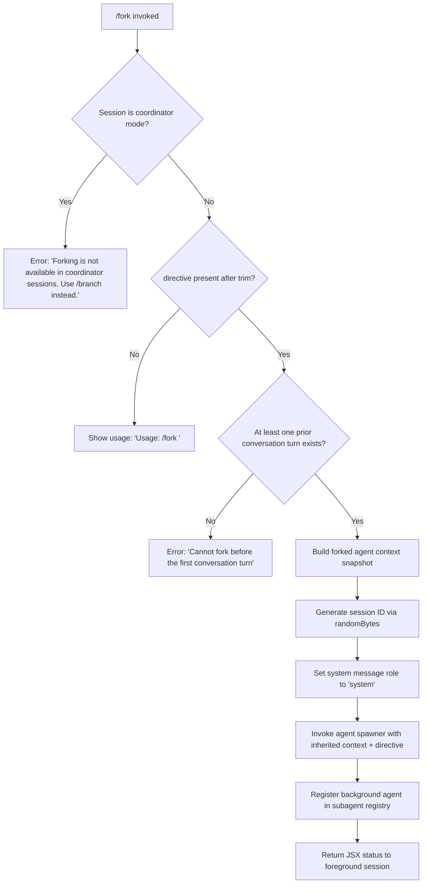

# `/fork`

> Analysis basis: CC v2.1.181 bundle.js (AST extraction + Claude interpretation)
> Minimum version: v2.1.181

---

## Overview

`/fork` spawns a background agent that inherits the full conversation history of the current session. It accepts a mandatory `<directive>` argument that instructs the forked agent on its assigned task. The command is blocked in coordinator sessions (use `/branch` instead) and requires at least one prior conversation turn to have occurred before it can be invoked.

---

## Registration

| Field | Value |
|---|---|
| type | `local-jsx` |
| name | `fork` |
| description | `Spawn a background agent that inherits the full conversation` |
| argumentHint | `<directive>` |
| module_id | `qTl` |
| load_inline | `true` |
| loc_byte | `12740418` |
| loc_byte_end | `12740621` |
| loc_line | `8369` |
| arbor_handler.name | `Cof` |
| arbor_handler.fqn | `claude-2.1.181::Cof` |
| arbor_handler.kind | `AsyncFunction` |
| arbor_handler.resolution_path | `module_id` |
| arbor_handler.n_hits | `0` |

Analysis basis: CC v2.1.181 bundle.js:+12740418

---

## Input Branching

The handler has 4+ distinct execution branches based on session mode, directive presence, and conversation state:



Analysis basis: CC v2.1.181 bundle.js:+12739977, +12740001, +12740041, +12740115, +12740188

---

## Behavioral Spec

### 1. Argument Validation and Guard Rails

```
async function forkCommandHandler(directive, sessionContext):
    trimmedDirective = directive.trim()                    // +12739977

    if sessionContext.isCoordinatorMode():
        display("Forking is not available in coordinator sessions. Use /branch instead.")
        return                                             // +12740115

    if trimmedDirective is empty:
        display("Usage: /fork <directive>")               // +12740001
        return

    if no prior conversation turns exist:
        display("Cannot fork before the first conversation turn")
        return                                             // +12740188
```

Analysis basis: CC v2.1.181 bundle.js:+12739977, +12740001, +12740115, +12740188

---

### 2. Context Snapshot Construction

The handler calls the prompt-builder function (identified as `pgo`) to assemble the forked agent's initial context. This builder:

- Reads app state and extracts the current working directory, allowed/disallowed tools, permission mode, model, session effort, max thinking tokens, and flag settings (Analysis basis: CC v2.1.181 bundle.js:+10828484, +10828539, +10828594, +10828757, +10829125, +10829112, +10829137, +10829163)
- Builds the system prompt block using the `system` role marker (Analysis basis: CC v2.1.181 bundle.js:+12740041)
- Constructs a REPL context snapshot via `getReplContexts` and slices the transcript to the last 50–49 characters boundary (Analysis basis: CC v2.1.181 bundle.js:+11155662, +11155675)
- Trims and normalizes the directive (Analysis basis: CC v2.1.181 bundle.js:+11157457)
- Emits telemetry marker `subagent_launch` with `subagent_fork_coordinator_mode` flag (Analysis basis: CC v2.1.181 bundle.js:+11155286, +11155304)
- If the directive was empty or missing at this stage, emits `subagent_fork_prompt_missing` (Analysis basis: CC v2.1.181 bundle.js:+11155428)

```
function buildForkContext(appState, conversationHistory, directive):
    workDir       = appState.get("working_directory")
    allowedTools  = appState.get("allowed_tools")
    deniedTools   = appState.get("disallowed_tools")
    permMode      = appState.get("permission_mode")        // "bypassPermissions" or "disable"
    modelId       = appState.get("model")
    effortLevel   = appState.get("effort")
    maxThinkTok   = appState.get("max_thinking_tokens")
    flagSettings  = appState.get("flag_settings")

    systemPrompt  = buildSystemPrompt(appState)            // role: "system"
    replCtx       = getReplContexts()
    transcript    = sliceTranscript(conversationHistory, limit=50)

    emit_telemetry("subagent_launch", { mode: subagent_fork_coordinator_mode })

    return { systemPrompt, transcript, directive, workDir, allowedTools,
             deniedTools, permMode, modelId, effortLevel, maxThinkTok,
             flagSettings, replCtx }
```

Analysis basis: CC v2.1.181 bundle.js:+11155271, +11155390, +11155517, +11155644, +11155665

---

### 3. Session ID Generation

A unique hex session identifier is generated using `randomBytes(8).toString("hex")` (8 bytes → 16 hex characters). A `Date.now()` timestamp is also captured at this point.

```
function generateForkSessionId():
    randomPart = crypto.randomBytes(8).toString("hex")    // +4272754, +4272770, +4272782
    timestamp  = Date.now()                               // +11155719
    return { id: randomPart, createdAt: timestamp }
```

The session directory is managed by the `K5e`/`HLo` symlink/mkdir subsystem, which sets up an isolated subagent working directory and a symlink for the new session. On `EEXIST` the symlink step is skipped (Analysis basis: CC v2.1.181 bundle.js:+13525300).

Analysis basis: CC v2.1.181 bundle.js:+4272744, +4272754, +4272770, +4272782

---

### 4. Background Agent Spawning

The actual agent is launched through the `but` → `K5e` → `AM` chain, which:

1. Creates the agent process directory structure
2. Registers the agent with status `"pending"` then `"running"` (Analysis basis: CC v2.1.181 bundle.js:+13526285, +10506194)
3. Sets agent type to `"local_agent"` with purpose `"general-purpose"` (Analysis basis: CC v2.1.181 bundle.js:+10506149, +10506312)
4. Registers the AbortController and wires it to the agent lifecycle via `a.register`
5. Configures the AbortSignal under the `"abort"` key (Analysis basis: CC v2.1.181 bundle.js:+5079597)
6. Passes the inherited conversation context, directive, and system prompt to the sub-agent runner

```
async function spawnForkedAgent(forkContext, abortController):
    agentDir = createAgentDirectory(forkContext.id)       // mkdir + symlink
    registry.register(forkContext.id, {
        status:  "pending",
        type:    "local_agent",
        purpose: "general-purpose"
    })

    agentProcess = launchProcess({
        context:  forkContext,
        signal:   abortController.signal,
        mode:     "subagent",
        spawnType:"spawn"
    })

    registry.update(forkContext.id, { status: "running" })
    return agentProcess
```

Analysis basis: CC v2.1.181 bundle.js:+10506102, +10506127, +10506144, +10506514

---

### 5. Sub-Agent Execution Loop

Once launched, the forked agent runs the standard `A3`/`t2p` agent execution loop, which handles:

- Model API calls (`p.callModel`)
- Tool execution, MCP tool dispatch
- Auto-compaction when context limits are approached
- Transcript writes
- Progress telemetry emission
- Stop/SubagentStop hook invocation
- Completion → registry status set to `"completed"` (Analysis basis: CC v2.1.181 bundle.js:+10499744)

The coordinator mode check literal `"Forking is not available in coordinator sessions. Use /branch instead."` prevents `/fork` from being re-entered within a coordinator (Analysis basis: CC v2.1.181 bundle.js:+12740115).

---

### 6. Fork Context Reference

The forked agent's context is stored with the key `"fork-context-ref"` (Analysis basis: CC v2.1.181 bundle.js:+13442577), allowing the parent session to cross-reference the spawned agent's context for result retrieval or cancellation.

---

### 7. Error Handling and Shutdown

The `Ps` function (reached via `i → r → Ps`) handles terminal error conditions:

- Emits a `"cli_error"` event (Analysis basis: CC v2.1.181 bundle.js:+13300071)
- Calls `process.exit(1)` (Analysis basis: CC v2.1.181 bundle.js:+13300097)

Background session teardown emits `"daemon_stop"` and `"daemon_stop_failed"` telemetry (Analysis basis: CC v2.1.181 bundle.js:+17138087, +17138124). The `"background session"` label is assigned to such sessions (Analysis basis: CC v2.1.181 bundle.js:+17138039).

---

## State & Side Effects

| Item | Detail |
|---|---|
| Telemetry — subagent_launch | Emitted on every fork attempt (bundle.js:+11155286) |
| Telemetry — subagent_fork_coordinator_mode | Emitted as property of subagent_launch event (bundle.js:+11155304) |
| Telemetry — subagent_fork_prompt_missing | Emitted when directive is absent at context-build time (bundle.js:+11155428) |
| Telemetry — tengu_forked_agent_default_turns_exceeded | Emitted if forked agent exceeds default turn budget (bundle.js:+10827230) |
| Telemetry — tengu_async_agent_stall_timeout | Emitted if forked agent stream watchdog fires (bundle.js:+8872302) |
| Telemetry — tengu_auto_mode_decision | Emitted during sub-agent handoff classifier evaluation (bundle.js:+8869912) |
| Telemetry — tengu_agent_tool_completed | Emitted per tool call inside forked agent (bundle.js:+8868233) |
| Telemetry — tengu_agent_tool_terminated | Emitted when a tool is cancelled inside forked agent (bundle.js:+8875880) |
| Telemetry — tengu_slim_subagent_claudemd | Emitted during sub-agent CLAUDE.md processing (bundle.js:+9163646) |
| Registry side effect | New entry created in subagent registry with status `"pending"` → `"running"` → `"completed"` |
| Session directory | Agent working dir created via `mkdir` + `symlink` under subagents path (bundle.js:+13522782, +13522836) |
| AbortController | Registered under `"abort"` key; used to cancel forked agent on parent request |
| fork-context-ref | Context snapshot stored under key `"fork-context-ref"` for cross-session reference (bundle.js:+13442577) |
| Blocked in coordinator | Guard raises error message and returns without spawning (bundle.js:+12740115) |

---

## Version History

| Version | Change |
|---|---|
| v2.1.181 | Initial analysis |

---

## Common Mistakes

1. **Invoking `/fork` without a directive**: The command requires a non-empty `<directive>` argument. Without one the handler prints the usage string `"Usage: /fork <directive>"` and exits without spawning any agent.
2. **Invoking `/fork` before the first conversation turn**: The guard at bundle.js:+12740188 prevents forking in an empty session. Send at least one message to the agent first.
3. **Using `/fork` inside a coordinator session**: The coordinator guard at bundle.js:+12740115 blocks the command. Use `/branch` in coordinator sessions instead.
4. **Expecting synchronous results**: The forked agent runs entirely in the background. There is no inline result returned to the foreground session; check the subagent registry or wait for a notification.
5. **Assuming the fork inherits live tool permissions**: The forked agent inherits the permission snapshot (`allowed_tools`, `disallowed_tools`, `permission_mode`) captured at fork time — subsequent foreground permission changes do not propagate.

---

## Appendix — Identifier Mapping

> For bundle debugging only. Identifiers change across versions.

| Identifier | Role |
|---|---|
| `Cof` | Main `/fork` handler (AsyncFunction) — entry point resolved by Arbor |
| `pgo` | Fork context builder — assembles system prompt, transcript slice, REPL context, session metadata |
| `rw` | Runtime environment/model resolver helper called by context builder |
| `rt` | String coercion / model tag utility |
| `qw` | Config field accessor helper |
| `_a` | Additional model config accessor |
| `Me` | Feature flag evaluator |
| `$e` | Feature flag sub-evaluator |
| `Rht` | Feature flag base resolver |
| `X9p` | App-state extraction function for fork context |
| `Pr` | Conversation history resolver — finds last turn, applies allowed/disallowed tool filtering |
| `R5n` | Allowed-tools context builder helper |
| `P5n` | Disallowed-tools context builder helper |
| `rB` | Permission-mode resolver (`bypassPermissions`, `disable`) |
| `zk` | System prompt assembly orchestrator |
| `Mt` | Model metadata accessor |
| `Go` | Model capability checker (includes `application-inference-profile`) |
| `_6n` | Plugin system prompt block builder |
| `Kr` | Tool-junction / tool-registry lookup |
| `qXe` | Pewter-owl tool context helper |
| `Khf` | Base system-prompt section builder |
| `zhf` | Confirmation-gating prompt section builder |
| `Yhf` | Task-continuity prompt section builder |
| `cAn` | Fable model identity prefix checker (`claude-fable-`) |
| `Hj` | Newline normalizer helper |
| `Gfi` | Syntax-token helper |
| `UQ` | Tool-use prompt qualifier |
| `ut` | System prompt section assembler |
| `QLo` | Compact/additive context mode selector |
| `Cgf` | Context-management prompt builder |
| `jW` | Tool-registry junction |
| `cgf` | Session-guidance / schedule / routines prompt section |
| `Rxt` | Memory load prompt builder (reads CLAUDE.md, team memory) |
| `Hgf` | Environment info (static) section builder |
| `ggf` | Environment info (simple / worktree) section builder |
| `tgf` | Language section builder |
| `ngf` | Output style section builder |
| `ygf` | Background session context section builder |
| `W$n` | Scratchpad / worktree tmp path builder |
| `Sgf` | Brief-mode section builder |
| `Igf` | Flag-settings / focus section builder |
| `pgf` | Act-don't-re-derive section builder |
| `Zhf` | Heron-brook autonomy section builder |
| `egf` | Autonomy-append section builder |
| `w8a` | MCP tool pre-computation helper |
| `dgf` | SDK prompt section builder |
| `ogf` | Doing-tasks section builder |
| `sgf` | Tool-usage section builder |
| `igf` | Context-window compression section builder |
| `agf` | Using-tools section builder |
| `ugf` | Tone-and-style section builder |
| `kAi` | Memory prompt post-processor |
| `PTe` | API endpoint type resolver (`firstParty`, `anthropicAws`) |
| `OOl` | System prompt finalizer / emitter |
| `d6` | Main-thread system prompt loader |
| `jc` | Session-path / transcript-dir resolver |
| `Mr` | Module registry / module-id loader |
| `a` | MCP client state accessor |
| `cH` | Conversation-history snapshot accessor |
| `Qe` | Feature gate evaluator |
| `u9n` | REPL context hydration function |
| `Akp` | Assistant message filter |
| `hkp` | Tool-use message filter |
| `mkp` | Tool-result message filter |
| `vja` | Message type validator |
| `gkp` | Combined tool message filter |
| `_nl` | Directive trim/normalize helper |
| `gF` | Random session-ID generator (randomBytes → hex) |
| `MK` | Subagent metadata builder |
| `but` | Background agent bootstrap orchestrator |
| `K5e` | Agent session directory setup (mkdir + symlink + unlink) |
| `azn` | Pending-agent set tracker (add/delete with finally) |
| `HLo` | Agent directory creator (`Rne.mkdir`) |
| `fh` | Agent file path joiner |
| `ln` | Symlink helper |
| `I` | Log/debug utility |
| `ke` | Agent lifecycle event emitter |
| `Kat` | Agent session open helper (open fd for transcript) |
| `AM` | Subagent working-directory assembler |
| `r2` | Path fragment helper |
| `gr` | Path join helper |
| `Lt` | Path resolution utility |
| `Mf` | Module flag accessor |
| `K1` | AbortController factory |
| `Yl` | MaxListeners setter on EventEmitter |
| `pUi` | Signal binding helper |
| `o0` | Pending-agent timestamp recorder |
| `Cs` | Config accessor for subagents path |
| `fx` | Filesystem path constant |
| `ite` | Agent system-prompt injection and model selector |
| `ak` | Model alias resolver (opusplan, plan, fable, sonnet, haiku, opus, best) |
| `xK` | Model selection branch evaluator |
| `tT` | Model provider type resolver |
| `hj` | Model string `[1m]` annotation stripper |
| `NE` | Model refuse-state checker |
| `MU` | Model policy string builder |
| `Tl` | Full model-resolution pipeline |
| `gs` | Model alias normalizer (toLowerCase → fable/sonnet/haiku/opus) |
| `cL` | Model cache lookup |
| `gmp` | Sub-agent system prompt injector |
| `nc` | Newline normalizer |
| `cln` | CLAUDE.md content boundary parser |
| `jwu` | ARN string detector (`arn:` prefix) |
| `HH` | Provider detection (bedrock, vertex, mantle, foundry) |
| `XTt` | Bedrock model tag resolver |
| `Wwu` | `anthropic.` prefix checker |
| `xr` | Provider tag builder |
| `b1e` | Model name case normalizer |
| `C7e` | CLAUDE.md content region extractor |
| `fTr` | CLAUDE.md start-tag detector |
| `cka` | Model capability context builder |
| `c` | Background-session stop handler |
| `bn` | Background-session internal state |
| `lka` | Model + provider combination builder |
| `_j` | Provider-aware model string builder |
| `v_` | AFE provider string builder |
| `Zro` | Remaining context trimmer |
| `J9` | AsyncLocalStorage store getter |
| `wx` | Store-lookup helper |
| `yj` | BIT runner context injector |
| `E4e` | Sub-agent main execution loop (stream, tools, compaction, hooks) |
| `vd` | Agent-version descriptor |
| `Elt` | Transcript update dispatcher |
| `Gae` | Agent state updater (thinking, compact, hooks) |
| `iLe` | App state setter for agent phase |
| `vot` | Agent completion notifier |
| `T` | Terminal display math helper |
| `x` | Terminal write/kill helper |
| `E` | Display min/max math helper |
| `ee` | Promise aggregator / MCP update applier |
| `y8` | Async iterator / ReadableStream consumer |
| `g` | Buffer / TCP stream handler |
| `Qrt` | Integer parser (for MCP frame sizes) |
| `y` | MCP packet reader |
| `Lxn` | Integer parser variant |
| `Y` | MCP update applicator |
| `ne` | MCP state tracker |
| `kBe` | WebSocket MCP connect helper |
| `Ee` | String coercion utility |
| `q` | Stream queue helper |
| `kOo` | MCP client map builder |
| `B` | Terminal refresh / setTimeout loop |
| `$` | Terminal output queue |
| `d` | Terminal renderer |
| `R` | Agent result collector |
| `F` | Permission classifier (allow/deny/classify/ask) |
| `Clt` | Classifier invocation wrapper |
| `YW` | Streaming API caller |
| `HFn` | Agent state flush / metrics recorder |
| `Pfo` | Agent heartbeat recorder |
| `i_` | Agent transcript flusher |
| `Ofo` | Agent notification dispatcher |
| `p` | Forced-shutdown / process.exit wrapper |
| `BT` | Shutdown reason tagger |
| `u` | Background-session daemon-stop controller |
| `y4e` | Agent speculation abort / completion handler |
| `o` | Progress pad/map renderer |
| `jP` | Agent heartbeat timestamp helper |
| `Lr` | Agent log writer |
| `mut` | Agent metrics updater |
| `Bp` | HTML entity unescaper (`&amp;`, `&lt;`, `&gt;`) |
| `gFn` | Agent filter (message boundary cleaner) |
| `$c` | Compact-boundary message filter |
| `_Fn` | Agent result post-processor |
| `EFn` | Dependency-graph resolver (Il) |
| `Il` | Incremental dependency cache (Object.hasOwn, Bmi, Gmi sets) |
| `aMa` | Agent summary generator / handoff classifier invoker |
| `zoo` | Set-based unique-item tracker |
| `_` | Agent queue drainer / MCP reconnect loop |
| `Vx` | Stream event dispatcher (stream_event, message_delta, progress) |
| `Pn` | UUID + metadata generator |
| `xgp` | Agent extra context builder |
| `cMa` | Agent compact state machine |
| `h` | Retry-after-timeout wrapper |
| `M` | Scheduled-task registry |
| `mtt` | Task manifest reader (readFile → JSON) |
| `hQ` | CFE error logger |
| `oMt` | Task output writer (mkdir + writeFile) |
| `qOi` | Task filter / deadline checker |
| `Lec` | Task result summary formatter |
| `tae` | Task list loader + writer |
| `m` | Process kill / stdout writer |
| `bFn` | Compact-boundary findLastIndex helper |
| `yFn` | Tool classification pipeline entry |
| `c6e` | Tool classifier (search/read vs mutating) |
| `dRa` | Transcript mutation record writer |
| `b1p` | Transcript mutation helper |
| `m2t` | Stall-detection helper |
| `hso` | Agent heartbeat/stall-timeout scheduler |
| `wHp` | Watchdog progress tracker |
| `LHp` | Heartbeat + vlt combo invoker |
| `vlt` | Agent vitals logger |
| `SFn` | Agent prefix-routing helper |
| `HHe` | Agent heartbeat event emitter |
| `klt` | Agent route-prefix matcher |
| `fso` | Agent turn finalizer (summary, handoff, classify) |
| `gM` | Last-assistant-message finder |
| `tee` | Tool-result encoder |
| `CHp` | Context-header builder |
| `H` | Agent task-set tracker |
| `kA` | Routing helper |
| `aM` | MIME type checker (aSe set) |
| `Pu` | Event emitter (event.name, event.timestamp, prompt.id) |
| `lAe` | Token counter helper |
| `Ur` | Nonconforming output detector |
| `vHp` | Classifier-cache checker |
| `pRa` | Agent progress reporter (update + Pfo + i_) |
| `xe` | Feature-ok/feature-bad event emitter |
| `ce` | Stream event router (startsWith branch dispatch) |
| `Zc` | UUID generator wrapper |
| `ate` | Stream attachment handler |
| `Ns` | Normalized model-string builder |
| `k` | Stream enqueue helper |
| `A2t` | Tool-use ID generator |
| `Aso` | Agent streaming orchestrator (qMa, p2t) |
| `qMa` | Query metadata aggregator |
| `p2t` | Primary streaming pipeline (API call → tool loop) |
| `LG` | Agent lifecycle governor |
| `us` | Rht-based utility |
| `fRa` | Safety-classifier vNl invoker |
| `Nxe` | Agent notification + transcript update dispatcher |
| `V` | Terminal write buffer |
| `Q` | Terminal queue writer |
| `b9f` | ANSI escape filter |
| `Rgt` | Agent run-guard tracker |
| `ZDa` | sFn cleanup helper |
| `A3` | Full agent session runner (outer coordinator) |
| `Rge` | Context-remaining calculator |
| `RHp` | Context-slice helper |
| `u2i` | Yjr session-map setter |
| `ghe` | Session GHE accessor |
| `BLn` | Batch-limiter / timing tracker |
| `pZi` | _Kr cache get/set |
| `dZi` | Timing delta calculator |
| `T2d` | gKr push helper |
| `G$n` | Session state builder |
| `OAe` | Session dump loader |
| `NB` | Session state validator |
| `de` | MCP elicitation handler |
| `pe` | MCP connection set |
| `sn` | MCP debug log emitter |
| `Re` | JSON.stringify wrapper |
| `cOt` | Elicitation request builder |
| `Cic` | Elicitation context builder |
| `uOt` | Elicitation response dispatcher |
| `N7` | Notification sender (wd + sx) |
| `RI` | Response queue manager (shift/push) |
| `Ate` | Tool context assembler (tool sets, MCP, permissions) |
| `dso` | Disallowed-tool set builder |
| `pso` | Permitted-tool set builder |
| `f` | Sub-process lifecycle manager (spawn, kill, memory check) |
| `uso` | Tool-name allowlist parser |
| `tw` | Tool-wrapper builder (b9, hl, rt, ut) |
| `vA` | Tool-name path normalizer |
| `Ix` | Tool path split/join helper |
| `$Oe` | Tool-name R9 resolver |
| `L` | Background-worker lifecycle manager (retire, respawn, prewarm) |
| `v` | Worker version tracker |
| `YC` | Tool-result formatter |
| `Vc` | Tool validator |
| `cRa` | ut-based context reducer |
| `Ae` | Agent list manager (filter, map) |
| `D` | Terminal clearTimeout / write helper |
| `Ay` | Agent constructor (Mr + R8r) |
| `te` | Agent state tracker |
| `sbp` | System prompt getter + OOl caller |
| `uBt` | System prompt builder chain (hgf + OOl) |
| `abp` | System prompt attachment validator |
| `dBt` | SubagentStart hook dispatcher |
| `wd` | Hook orchestrator (Lt, IO, DC, DR, Zk, Mt) |
| `tv` | Hook session runner (full hook execution loop) |
| `Ke` | NGe-based push helper |
| `NGe` | Notification gateway emitter |
| `mi` | Message-ID generator (randomUUID + uuid + now) |
| `VE` | Permission-type validator |
| `Tn` | Permission resolver |
| `Sme` | ZYu set-membership checker |
| `sMa` | Object.keys-based MCP map reducer |
| `_c` | fx path utility |
| `lbp` | Tool-schema fetcher (fct + Li) |
| `fct` | fS-based schema resolver |
| `Li` | String index-of + slice helper |
| `r5e` | Tool reference resolver (fS + map + localeCompare) |
| `fS` | Tool-schema find + SRl |
| `id` | Tool-id accessor |
| `tt` | UI component push/write helper |
| `Pe` | Plugin file loader (rfl.readFile) |
| `st` | UI state record |
| `dt` | Command registry (Array.from, getPromptForCommand) |
| `Ve` | Timer manager (clearAllTimers, run) |
| `rbp` | MCP server config merger and tool registration |
| `xkn` | IXr MCP permission resolver |
| `Oye` | MCP oye accessor |
| `yc` | Tool-id Ul+Lp builder |
| `Ul` | Safe-mode flag resolver |
| `g5` | Enterprise/project/local MCP source tagger |
| `met` | MCP server policy evaluator |
| `h5` | Tool-name push/build helper |
| `l` | cxl-based list helper |
| `xt` | ut-based context filter |
| `ze` | Context zero-state helper |
| `Xge` | Tool-search / deferred-tools initializer |
| `iP` | Standard tool initializer |
| `t7` | Tool type normalizer (toLowerCase + JEd) |
| `Z0e` | Tool-set membership checker |
| `YAo` | Tool-pool update dispatcher (add/delete/filter/sort) |
| `oFn` | Existing-tool-block entry checker |
| `It` | Telemetry span recorder (jt, Sx, Date.now, Byf) |
| `B$n` | App-state updater for fork (getAppState → setAppState) |
| `Uve` | Session-state upgrade helper |
| `OJi` | Session option injector |
| `M5n` | Fork-state metadata builder |
| `j$n` | Sub-agent tool and MCP config merger |
| `i2` | MCP tool-set initializer |
| `U4t` | Tool-availability filter |
| `N4t` | Tool-dedup filter |
| `MY` | Tool allowlist merger |
| `eae` | Tool existence checker |
| `_V` | Tool-version accessor |
| `iel` | O4t get/set with THe dedup set |
| `ZS` | Aei/PRr/hei context-slot builders |
| `Ny` | fx path resolver |
| `e6r` | Context-token estimator |
| `Q4e` | Exponential-backoff delay calculator |
| `SC` | Tool-name gs/nc/Go combo builder |
| `N0` | Tool-null state helper |
| `mx` | fx 62018 path helper |
| `mre` | Model-result extractor |
| `A` | f-based agent array builder |
| `rao` | Context-ref audit recorder |
| `Au` | Gi-based context context builder |
| `uce` | w6e-based tool-use checker |
| `w6e` | Tool-use filter (UKn, QKn, PAf) |
| `Act` | Context metadata writer (NRl + mkdir + writeFile) |
| `NRl` | AM-based path normalizer |
| `tn` | Transcript message array accessor (startsWith + indexOf + push) |
| `Aa` | HTML table scope parser |
| `hu` | Parser fragment helper (h_, cr, nNf) |
| `Sl` | HTML token handler |
| `La` | Table-scope clearToMarker handler |
| `$r` | ht-based transcript push helper |
| `ht` | Message window limiter (Math.min + slice + Ge.writeMessages) |
| `RZi` | OTel span context setter |
| `xae` | Span attribute helper |
| `RF` | Ahe.active span checker |
| `TBe` | Span b\$e builder |
| `hP` | Span header builder |
| `Uwe` | Nwe span enterWith setter |
| `h6` | Sub-agent runner entry (t2p + j4n) |
| `t2p` | Full sub-agent turn pipeline (callModel, tools, hooks, compaction) |
| `j4n` | Sub-agent exit / registry cleanup |
| `l4e` | wgp tool-completion checker |
| `oao` | Context-response cache updater |
| `rMa` | Cgp.has cache checker |
| `nio` | tio cache clearer |
| `rio` | tio cache get/set with KPa eviction |
| `$zn` | Math.ceil token estimator |
| `Ott` | Math.round token estimator |
| `g_f` | Cache eviction helper |
| `Nt` | Foreground MCP server sync loop |
| `se` | Full background-session runner (load, run, shutdown) |
| `$Vr` | Session state snapshot |
| `Wic` | MCP plugin sync handler |
| `xo` | Detached-session context (sync, aux modes) |
| `Zt` | k2e/OBl-based registry entry |
| `_n` | Parser char-class constants (9, 32, 47, 61, 62) |
| `is` | kk-based permission filter |
| `Dt` | Remote-bridge WebSocket connector |
| `ps` | Agent process state |
| `M9` | $l name helper |
| `Lge` | LT + Ghp tool-filter |
| `LT` | LT path builder |
| `Ghp` | e.find-based tool finder |
| `obp` | Optional prompt builder |
| `JDa` | Session teardown dispatcher |
| `_y` | b8t-based memory store accessor |
| `JHf` | Memory store header accessor |
| `b8t` | Memory store root accessor |
| `QHf` | Memory store SGt/Pn builder |
| `q$n` | o/r context pair builder |
| `mct` | Skill-progress / bash-progress task dispatcher |
| `qte` | t.trim-based query normalizer |
| `Zut` | Array.isArray + Il + Qle + n.push serializer |
| `CUa` | t.get + vd + HHe agent-state getter |
| `Jge` | Sub-agent start hook + tv caller |
| `PP` | Xj/lb/wG/a9 hook launcher |
| `tOl` | Object.values tool-result builder |
| `nOl` | F0 + e.map + iPe tool mapper |
| `Ge` | I + st.abort session aborter |
| `A7` | F\$i session finalizer |
| `F$i` | Session cleanup function |
| `K$i` | F8.delete + T2e session-key cleaner |
| `T2e` | Session state persister (readFile + writeFile) |
| `nao` | O4t.delete MCP tool cleanup |
| `EBe` | FLn.delete + _Kr.delete batch-limit cleanup |
| `PZi` | OTel span attribute setter + e.end |
| `bBe` | e.setStatus OTel span status setter |
| `Fwe` | RF + Ahe.enterWith span context restorer |
| `d2i` | Yjr.delete session-map deleter |
| `nMa` | Object.entries + t.all MCP parallel executor |
| `Qx` | Parallel-execution queue |
| `kge` | t.update + clearTimeout + Date.now + Oh + i_ agent-state flush |
| `_Mt` | Post-run metadata updater |
| `ALe` | Agent lifecycle event emitter |

---

Note: index built via Arbor fallback; some signals (telemetry, literals) may be missing — see arbor-fallback.js.