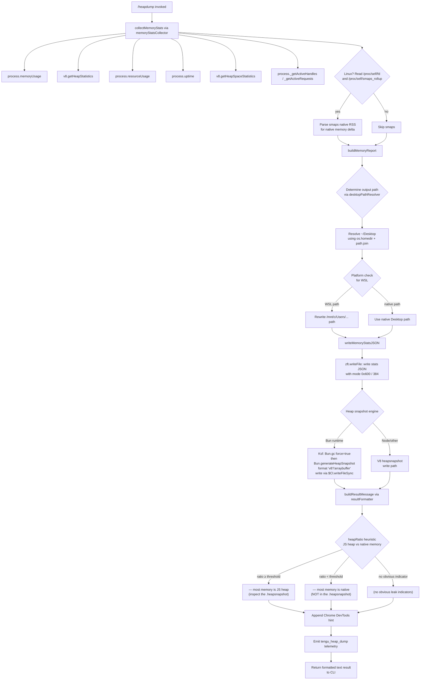

# `/heapdump`

> Analysis basis: CC v2.1.181 bundle.js (AST extraction + Claude interpretation)
> Minimum version: v2.1.181

---

## Overview

`/heapdump` is a hidden diagnostic command that captures a comprehensive snapshot of the Node.js/Bun runtime's memory state and writes it to `~/Desktop`. It collects heap statistics, native memory metrics, open file descriptors, and smaps data before generating a `.heapsnapshot` file (using either `Bun.generateHeapSnapshot` or a V8-compatible path), then presents a formatted memory analysis report with leak indicators to the user.

---

## Registration

| Field | Value |
|---|---|
| type | `local` |
| name | `heapdump` |
| description | `Dump the JS heap to ~/Desktop` |
| loc_byte | `12842136` |
| loc_byte_end | `12842564` |
| loc_line | `8491` |
| supportsNonInteractive | `true` |
| isHidden | `true` |
| module_id | `jCl` |
| load_inline | `true` |
| arbor_handler.name | `zsf` |
| arbor_handler.fqn | `claude-2.1.181::zsf` |
| arbor_handler.kind | `AsyncFunction` |
| arbor_handler.resolution_path | `module_id` |
| arbor_handler.n_hits | `0` |

Analysis basis: CC v2.1.181 bundle.js:+12842136

---

## Input Branching

The command's execution involves 4+ distinct branching paths (runtime environment detection, heap snapshot engine selection, platform-specific memory accounting, and leak heuristic routing). A Mermaid flowchart is used.



---

## Behavioral Spec

### 1. Command Entry — `heapDumpHandler` (`zsf`)

The handler is an `AsyncFunction` resolved via `module_id` → `jCl`.

```
async function heapDumpHandler(context):
    lines = []
    lines.push("Open the .heapsnapshot in Chrome DevTools → Memory → Load to inspect retainers.")
    
    statsReport = await collectAndFormatStats()   // calls memoryStatsCollector + resultFormatter
    lines.push(...statsReport)
    
    return { type: "text", content: lines.join("\n") }
```

Analysis basis: CC v2.1.181 bundle.js:+12841005, +12841037, +12841151, +12841273

---

### 2. Memory Statistics Collection — `memoryStatsCollector` (`BCl`)

Gathers all available runtime memory metrics from Node/Bun APIs and Linux `/proc` pseudo-files.

```
async function memoryStatsCollector():
    stats = {}
    stats.memoryUsage      = process.memoryUsage()
    stats.heapStats        = v8Module.getHeapStatistics()        // qqn = v8 module
    stats.resourceUsage    = process.resourceUsage()
    stats.uptime           = process.uptime()
    stats.heapSpaceStats   = v8Module.getHeapSpaceStatistics()
    stats.activeHandles    = process._getActiveHandles().length
    stats.activeRequests   = process._getActiveRequests().length

    // Linux-only: read open file descriptor count
    try:
        fds = await fs.readdir("/proc/self/fd")                  // zft.readdir
        stats.openFds = fds.length
    catch:
        stats.openFds = null

    // Linux-only: read native RSS breakdown from smaps
    try:
        smaps = await fs.readFile("/proc/self/smaps_rollup", "utf8")
        stats.smapsData = parseSmaps(smaps)
    catch:
        stats.smapsData = null

    // Load bun:jsc module if available for Bun-specific metrics
    try:
        jscModule = require("bun:jsc")
        stats.jsc = jscModule
    catch:
        stats.jsc = null

    // Compute native memory delta (RSS minus JS heap)
    // Constants: 3600 (sec/hr), 1048576 (bytes/MB)
    // Threshold for "native > heap" warning: 100 MB delta
    nativeDelta = stats.resourceUsage.maxRSS - stats.memoryUsage.heapUsed
    if nativeDelta > (100 * 1048576):
        stats.warning = "Native memory > heap - leak may be in native addons (node-pty, sharp, etc.)"

    return stats
```

Analysis basis: CC v2.1.181 bundle.js:+12837168, +12837192, +12837218, +12837244, +12837269, +12837311, +12837348, +12837399, +12837461, +12837559, +12837700, +12837705, +12837852, +12837938

---

### 3. Desktop Path Resolution — `desktopPathResolver` (`zXo`)

Resolves the output directory, handling WSL environments where the Windows Desktop path differs from the Linux home.

```
function desktopPathResolver():
    home = os.homedir()                              // yfr.homedir
    desktopPath = path.join(home, "Desktop")         // hm.join, literal "Desktop"

    // WSL detection: if path contains /mnt/c/Users, remap to Windows Desktop
    if desktopPath.includes("/mnt/c/Users"):
        // Filter out system accounts: Public, Default, Default User, All Users
        desktopPath = desktopPath.replace(...)       // zXo: r.replace

    // Validate path is reachable; log error if not
    try:
        validatePath(desktopPath)                    // jt
    catch err:
        log("error", err)

    return desktopPath
```

Analysis basis: CC v2.1.181 bundle.js:+12839963, +1099675, +1099682, +1099718, +1099728, +1099858, +1099950, +1099994, +1100013, +1100033, +1100058, +1100242

---

### 4. Memory Stats JSON Writer — `statsFileWriter` (`fIo`)

Orchestrates stat collection, desktop path resolution, and writing the stats JSON to disk, then triggers heap snapshot generation.

```
async function statsFileWriter(context):
    // Initialize with "manual" trigger, priority 0
    trigger = "manual"
    priority = 0

    memStats = await memoryStatsCollector()         // BCl
    logOutput = buildLogLines(memStats)             // I (formatter)
    paddedLines = padLines(logOutput)               // o (padEnd formatter)

    desktop = desktopPathResolver()                 // zXo
    outputPath = path.join(pIo, desktop)            // pIo.join

    // Write stats as JSON, file mode 384 (0o600 — owner read/write only)
    await fs.writeFile(outputPath + "/stats.json",
                       JSON.stringify(memStats),
                       { mode: 384 })              // zft.writeFile, Re=JSON.stringify

    emitTelemetry("tengu_heap_dump")               // j

    // Generate heap snapshot (Bun or V8 path)
    await heapSnapshotWriter(outputPath)            // Ksf

    // Format and return result lines
    result = resultFormatter(memStats, outputPath)  // Ho/Xp
    return result
```

Analysis basis: CC v2.1.181 bundle.js:+12839643, +12839654, +12839667, +12839680, +12839726, +12839768, +12839963, +12839975, +12840072, +12840115, +12840131, +12840150, +12840206, +12840255, +12840426, +12840435, +12840513

---

### 5. Heap Snapshot Writer — `heapSnapshotWriter` (`Ksf`)

Generates the actual `.heapsnapshot` file using the Bun runtime API (with a V8-compatible output format).

```
function heapSnapshotWriter(outputDir):
    // Write snapshot synchronously
    // Bun.gc(true) forces a full GC before snapshot for cleaner data
    Bun.gc(true)
    snapshot = Bun.generateHeapSnapshot({ format: "v8", encoding: "arraybuffer" })
    $Cl.writeFileSync(outputDir + "/heap.heapsnapshot", snapshot)
```

Analysis basis: CC v2.1.181 bundle.js:+12840685, +12840705, +12840730, +12840735, +12840762

---

### 6. Result Formatter — `resultFormatter` (`Ysf`)

Builds the human-readable memory summary returned as the command's text output.

```
function resultFormatter(memStats, outputPath):
    lines = []

    heapUsedMB = memStats.memoryUsage.heapUsed / 1048576
    rssMB      = memStats.resourceUsage.maxRSS / 1048576
    ratio      = heapUsedMB / Math.max(rssMB, 1)        // avoid divide-by-zero

    // Heap ratio heuristic
    if ratio >= threshold:                               // Yft threshold comparison
        lines.push("— most memory is JS heap (inspect the .heapsnapshot)")
    else if nativeDelta > threshold:
        lines.push("— most memory is native (NOT in the .heapsnapshot)")
    else:
        lines.push("  (no obvious leak indicators)")

    // Include paths, sizes, and open FD count
    // File size block uses constant 8 (bits) and 1073741824 (1 GiB)
    lines.push(formatSizes(memStats))

    // Auto-threshold annotation "auto-1.5GB" appended when relevant
    if heapTotal > 1073741824 * 1.5:
        lines.push("auto-1.5GB")

    return lines
```

Analysis basis: CC v2.1.181 bundle.js:+12841124, +12841380, +12841448, +12841508, +12841645, +12841692, +12841780, +12842054, +12840323

---

### 7. macOS Memory Accounting — platform branch in `memoryStatsCollector`

```
if platform == "darwin":                   // "macos" / "darwin" literals
    // macOS does not expose smaps; use resourceUsage.maxRSS directly
    // maxRSS on macOS is in bytes (not KB as on Linux)
    // Divide by 1024 to normalize to KB
    rssMB = stats.resourceUsage.maxRSS / 1024
```

Analysis basis: CC v2.1.181 bundle.js:+12838785, +12838792, +12838802, +12839057, +12839211

---

## State & Side Effects

| Item | Detail |
|---|---|
| Telemetry | `tengu_heap_dump` (bundle.js:+12840257); background daemon telemetry `tengu_bg_proto_mismatch`, `tengu_bg_dispatch_stale_drop`, `tengu_bg_attach_legacy_autorespawn`, `tengu_bg_attach`, `tengu_bg_attach_stall_gave_up`, `tengu_bg_attach_stall_respawn`, `tengu_bg_attach_kick` are in traversed code but are not specific to `/heapdump` |
| File output | Writes `stats.json` (mode `0o600`) and `heap.heapsnapshot` to `~/Desktop` |
| GC side effect | `Bun.gc(true)` is called before snapshot generation — forces a full garbage collection |
| Hook registration | None identified in depth-2 traversal |
| appState changes | None identified in depth-2 traversal |
| Sound | None identified |
| Platform branching | macOS (`darwin`) uses `maxRSS / 1024`; Linux reads `/proc/self/fd` and `/proc/self/smaps_rollup`; WSL remaps `/mnt/c/Users` Desktop path |
| File permissions | Output files written with mode `384` (`0o600`) — owner read/write only (bundle.js:+12840150) |
| Trigger label | Hardcoded to `"manual"` with priority `0` (bundle.js:+12839643, +12839654) |

---

## Version History

| Version | Change |
|---|---|
| v2.1.181 | Initial analysis |

---

## Common Mistakes

1. **Expecting output in the current directory** — the command always writes to `~/Desktop` (resolved via `os.homedir()`), not the working directory. On WSL, this is remapped to the Windows user Desktop.
2. **Running on non-Bun runtime** — `Ksf` calls `Bun.generateHeapSnapshot` and `Bun.gc`, which are Bun-specific APIs. If the bundle is executed under plain Node.js, the heap snapshot step will throw.
3. **Assuming the command is user-visible** — `isHidden: true` means `/heapdump` does not appear in the command palette or `/help` output; it must be invoked by typing the exact name.
4. **Overlooking `isHidden` in automation scripts** — `supportsNonInteractive: true` allows the command to run headlessly, but because it is hidden, scripted discovery must hard-code the name.
5. **Interpreting the "native memory" warning as definitive** — the warning `"Native memory > heap"` is a heuristic based on `maxRSS - heapUsed`; on macOS the RSS unit conversion (`/1024`) can affect the ratio, so treat it as indicative, not conclusive.
6. **File permission surprise** — output files are written `0o600`; other system users (including other Unix accounts sharing the Desktop via network share) will not be able to read them.

---

## Appendix — Identifier Mapping

> For bundle debugging only. Identifiers change across versions.

| Identifier | Role |
|---|---|
| `zsf` | `heapDumpHandler` — async command entry point (Arbor handler) |
| `fIo` | `statsFileWriter` — orchestrates stat collection, file writes, snapshot trigger |
| `BCl` | `memoryStatsCollector` — gathers heap/native/proc memory metrics |
| `Lt` | `pathUtility` — path helper used in stats collection and log writing |
| `fx` | `pathUtilityHelper` — called by `Lt` |
| `H` | `logLineBuilder` — constructs structured log entries from stats |
| `t4e` | `teammateMailboxHelper` — reached via `H`; handles mailbox read-marking (traversal depth spillover) |
| `g` | `subprocessOutputBuffer` — buffer/stream helper (traversal depth spillover from IPC layer) |
| `h` | `timeoutStream` — stream with timeout (traversal depth spillover) |
| `m` | `subprocessKillManager` — subprocess lifecycle (traversal depth spillover) |
| `sf` | `streamEnder` — ends a stream and resolves (traversal depth spillover) |
| `y9f` | `daemonProtocolHandler` — IPC message dispatcher (traversal depth spillover) |
| `Ee` | `stringCoercer` — calls `String()` for safe coercion |
| `I` | `outputFormatter` — formats stats as log-level debug output |
| `xhc` | `logWriterCore` — lower-level log write path |
| `L$o` | `logFilePathBuilder` — constructs log file path |
| `Re` | `jsonStringifier` — wraps `JSON.stringify` |
| `qc` | `redactingFormatter` — formats with `[REDACTED]` substitution |
| `c3o` | `chalkColorMapper` — maps log levels to chalk color codes |
| `nqe` | `logStreamWriter` — writes to the log output stream |
| `QBo` | `streamWriteWrapper` — `e.write` wrapper |
| `Rhc` | `persistentLogWriter` — appends to persistent log file |
| `kWe` | `batchedLogFlusher` — batches and flushes log lines with `setTimeout`/`setImmediate` |
| `Fde` | `logFileRotator` — rotates log file when size threshold reached |
| `jt` | `fsAccessChecker` — validates path accessibility |
| `bre` | `dirErrorHandler` — handles `EISDIR` errors on log path |
| `f3o` | `logFilePathJoiner` — joins log directory + filename |
| `Sor` | `logFileRenamer` — renames `.txt` log files during rotation |
| `Mhc` | `logFileAppender` — `mkdir` + `appendFile` path for persistent logging |
| `Gi` | `signalRegistrar` — registers process signal handlers via `v$o.register` |
| `o` | `paddedLineFormatter` — pads output lines with `padEnd` |
| `s` | `asyncTaskTracker` — tracks async tasks with add/delete/finally |
| `i` | `resourceCloser` — closes handles on task completion |
| `zXo` | `desktopPathResolver` — resolves `~/Desktop`, handles WSL remapping |
| `Ksf` | `heapSnapshotWriter` — calls `Bun.gc` + `Bun.generateHeapSnapshot` + `writeFileSync` |
| `j` | `telemetryEmitter` — fires `tengu_heap_dump` event |
| `Ho` | `errorWrapper` — wraps `Error` and `String` for safe error creation |
| `Xp` | `resultPresenter` — presents final result to CLI output |
| `ke` | `errorLogger` — logs errors via `jJ.logError`, manages error ring buffer |
| `rt` | `stringNormalizer` — normalizes values via `String()` |
| `ta` | `errorThrottler` — throttles repeated error emissions |
| `qYo` | `errorThrottleHelper` — helper for `ta` |
| `fVc` | `errorRingBuffer` — shift/push ring buffer for recent errors |
| `Ysf` | `resultFormatter` — builds human-readable memory summary with leak heuristics |
| `Yft` | `heapRatioThreshold` — numeric threshold constant used by `resultFormatter` |

---

Note: index built via Arbor fallback; some signals (telemetry, literals) may be missing — see arbor-fallback.js.