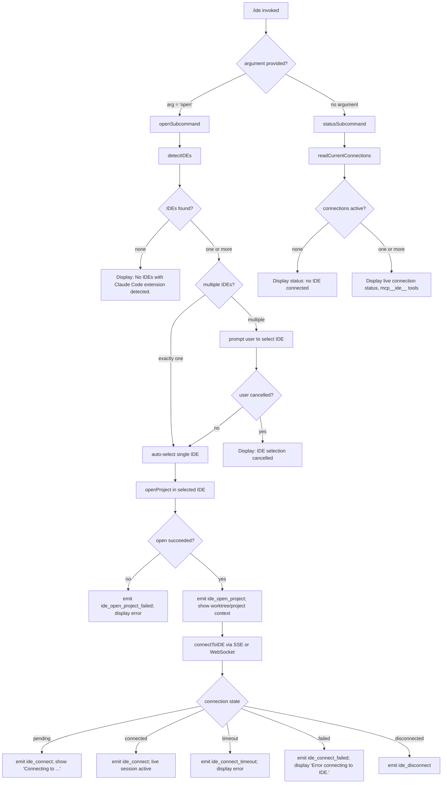

# `/ide`

> Analysis basis: CC v2.1.181 bundle.js (AST extraction + Claude interpretation)
> Minimum version: v2.1.181

---

## Overview

The `/ide` command manages IDE integrations for Claude Code by detecting installed IDEs with the Claude Code extension, opening projects in a selected IDE, and establishing a live connection (SSE or WebSocket) between Claude Code and the IDE. It serves as the primary control surface for IDE-aware sessions, handling detection, selection, project opening, and real-time connection lifecycle.

---

## Registration

| Field | Value |
|---|---|
| type | `local-jsx` |
| name | `ide` |
| description | `Manage IDE integrations and show status` |
| argumentHint | `[open]` |
| module_id | `Ocl` |
| load_inline | `true` |
| loc_byte | `11796977` |
| loc_byte_end | `11797133` |
| loc_line | `7095` |
| arbor_handler.name | `hVp` |
| arbor_handler.fqn | `claude-2.1.181::hVp` |
| arbor_handler.kind | `AsyncFunction` |
| arbor_handler.resolution_path | `module_id` |
| arbor_handler.n_hits | `0` |

Analysis basis: CC v2.1.181 bundle.js:+11796977

---

## Input Branching

The command has 5+ distinct execution branches determined by the subcommand argument, IDE detection results, and connection state. A Mermaid flowchart is used.



---

## Behavioral Spec

### Handler Entry — `ideCommandHandler` (`hVp`)

The Arbor-resolved handler is `hVp` (an `AsyncFunction`), reached via `module_id → Ocl`.

Analysis basis: CC v2.1.181 bundle.js:+11793092

```
async function ideCommandHandler(commandContext):
    emit telemetry event "tengu_ext_ide_command"

    if commandContext.argument == "open":
        run openIDEFlow(commandContext)
    else:
        run statusFlow(commandContext)
```

---

### Sub-feature: IDE Detection — `detectIDEs` (`PLn`)

Analysis basis: CC v2.1.181 bundle.js:+6651449

`PLn` is the IDE detection routine. It enumerates running processes and known IDE installation paths to discover IDEs that have the Claude Code extension installed.

```
async function detectIDEs(options):
    // Platform-specific process scan
    if platform == "linux":
        run shell command:
            "ps aux | grep -E 'code|cursor|windsurf|...' | grep -v grep"
        parse output lines for known IDE process names

    if platform == "macos":
        scan home directory and standard application paths
        check for .lock files and realpath resolution

    // Normalise detected entries
    for each candidate in rawCandidates:
        normalise name to lowercase
        classify as one of:
            "windsurf", "devin", "cursor", "insiders",
            "vscode", "vs code", "visual studio code",
            "vscodium", "code - oss", "codium", "jetbrains"

    // Filter candidates that have the Claude Code extension
    filteredIDEs = candidates where extension is confirmed

    emit telemetry "tengu_feature_ok" on success      // bundle.js:+1019804
    emit telemetry "ide_detect"                        // bundle.js:+6652804
    on failure: emit "ide_detect_failed"               // bundle.js:+6652868

    return filteredIDEs
```

Platform-specific literals found:
- Linux process grep pattern (bundle.js:+6656175)
- WSL path prefix `/mnt/c/Users` (bundle.js:+6649540)
- macOS marker `"macos"` (bundle.js:+13267617)

---

### Sub-feature: IDE Name Normalisation — `normaliseIDEName` (`$Qi`, `OLn`)

Analysis basis: CC v2.1.181 bundle.js:+6654245

```
function classifyIDEByName(rawName):
    lower = rawName.toLowerCase()
    if lower includes "windsurf"  → return "windsurf"
    if lower includes "devin"     → return "devin"
    if lower includes "cursor"    → return "cursor"
    if lower includes "insiders"  → return "insiders"
    if lower includes "vscode"
       or "vs code"
       or "visual studio code"    → return "vscode"
    if lower includes "vscodium"
       or "code - oss"
       or "codium"                → return "vscodium"
    // JetBrains products use basename + additional heuristics (xL / OLn)
    // Windows .cmd extension stripped before classification
    return derived label or "IDE"
```

The string `"Devin Desktop"` (bundle.js:+6654595) is the display name normalised to `"devin"` internally.

---

### Sub-feature: Open Project in IDE — `openProjectInIDE` (`hVp` branch)

Analysis basis: CC v2.1.181 bundle.js:+11793566

```
async function openProjectInIDE(selectedIDE, projectPath):
    resolvedPath = path.basename(jjn.basename(projectPath))
    attempt to open selectedIDE with projectPath as argument

    emit telemetry "ide_open_project"           // bundle.js:+11793645
    record context: worktree or project         // bundle.js:+11793679, +11793690

    on failure:
        emit telemetry "ide_open_project_failed" // bundle.js:+11793752
        if IDE requires manual start:
            display "restart your IDE"           // bundle.js:+11794311
        else:
            display "Exited without opening IDE" // bundle.js:+11794042
```

---

### Sub-feature: IDE Connection — `connectToIDE` (`Pcl` / `uVp`)

Analysis basis: CC v2.1.181 bundle.js:+11794979

The connection component (`Pcl`) is a JSX component that manages the live IDE connection. It uses React hooks (`useState`, `useRef`, `useEffect`, `useCallback`) to track connection state.

```
async function ideConnectionComponent(props):
    [status, setStatus] = useState("pending")

    useEffect:
        attempt connection over SSE ("sse-ide") or WebSocket ("ws-ide")
        // Transport selection literals: bundle.js:+11791079, +11791099

        on connection start:
            emit telemetry "ide_connect"             // bundle.js:+11795196
            display "Connecting to <IDE name>"       // bundle.js:+11796226

        on connection success:
            setStatus("connected")
            register mcp__ide__ tool namespace       // bundle.js:+11795786

        on timeout:
            emit telemetry "ide_connect_timeout"     // bundle.js:+11795390
            setStatus("failed")

        on error:
            emit telemetry "ide_connect_failed"      // bundle.js:+11795283
            display "Error connecting to IDE."       // bundle.js:+11795508

        on disconnect:
            emit telemetry "ide_disconnect"          // bundle.js:+11795889

    render status display with bold IDE name (gt.bold)
    filter available MCP tools by "mcp__ide__" prefix

    // WebSocket path distinguishes "ws:" prefix: bundle.js:+11796006
```

---

### Sub-feature: IDE Status Display — `statusDisplayComponent` (`iyo`)

Analysis basis: CC v2.1.181 bundle.js:+11796471

When no subcommand argument is given, `iyo` renders the current IDE integration status. It reads live connection state and displays the list of active IDE sessions.

```
function renderIDEStatus(connections):
    normalised = connections.map(c => c.normalize("NFC"))
                            // NFC normalisation: bundle.js:+11796576

    if connections.length == 0:
        display empty state

    // Truncation logic
    MAX_DISPLAY = 100         // bundle.js:+11796435
    MIN_INDEX   = 0           // bundle.js:+11796454
    SLICE_STEP  = 3           // bundle.js:+11796508

    if connections.length > MAX_DISPLAY:
        display first slice + ", …"  // bundle.js:+11796747
    else:
        display joined with ", "     // bundle.js:+11796733

    // Path normalisation uses Math.floor + path.normalize
    render each active connection with its IDE name
```

---

### Sub-feature: IDE Extension Installation Callback — `onInstallIDEExtension`

Analysis basis: CC v2.1.181 bundle.js:+11794219

```
function handleInstallExtensionCallback(context):
    // Called when the user triggers extension install from the /ide UI
    invoke context.onInstallIDEExtension(selectedIDE)

    // bee helper formats the install guidance message
    display install instructions via bee()   // bundle.js:+11794246
```

---

### Sub-feature: IDE Capability Listing — `listIDECapabilities` (`lKr` / `f2d`)

Analysis basis: CC v2.1.181 bundle.js:+11794175

```
function listIDECapabilities(connectedIDE):
    capabilities = f2d(connectedIDE)

    for each [key, value] in Object.entries(capabilities):
        if value matches supported capability list:
            push to display list
        if platform is "linux":
            apply linux-specific capability filter  // bundle.js:+6656149

    return formatted capability list
```

---

## State & Side Effects

| Item | Detail |
|---|---|
| Telemetry: `tengu_ext_ide_command` | Fired at handler entry on every `/ide` invocation (bundle.js:+11793094) |
| Telemetry: `tengu_feature_ok` | IDE detection succeeded (bundle.js:+1019804) |
| Telemetry: `tengu_feature_bad` | IDE detection encountered a recoverable error (bundle.js:+1019871) |
| Telemetry: `tengu_feature_sad` | IDE detection encountered a fatal error (bundle.js:+1019952) |
| Telemetry: `ide_detect` | IDE detection completed (bundle.js:+6652804) |
| Telemetry: `ide_detect_failed` | IDE detection failed (bundle.js:+6652868) |
| Telemetry: `ide_open_project` | Project successfully opened in IDE (bundle.js:+11793645) |
| Telemetry: `ide_open_project_failed` | Project open attempt failed (bundle.js:+11793752) |
| Telemetry: `ide_connect` | IDE connection attempt started/succeeded (bundle.js:+11795196) |
| Telemetry: `ide_connect_failed` | IDE connection failed (bundle.js:+11795283) |
| Telemetry: `ide_connect_timeout` | IDE connection timed out (bundle.js:+11795390) |
| Telemetry: `ide_disconnect` | IDE disconnected (bundle.js:+11795889) |
| Telemetry: `tengu_mcp_skills` | MCP skills registered via IDE connection (bundle.js:+6693108) |
| MCP tool namespace | Registers tools under `mcp__ide__` prefix when connected (bundle.js:+11795786) |
| appState changes | Connection state tracked via `useAppState` / `useSyncExternalStore`; `AppStateProvider` required (bundle.js:+3949507) |
| Transport protocols | SSE (`sse-ide`) and WebSocket (`ws-ide`) both supported (bundle.js:+11791079, +11791099) |
| Sound | <!-- TODO: not found in depth-2 traversal; needs --depth 4 --> |
| Hook: `onInstallIDEExtension` | Called on user-initiated extension install action (bundle.js:+11794219) |

---

## Version History

| Version | Change |
|---|---|
| v2.1.181 | Initial analysis |

---

## Common Mistakes

1. **Running `/ide open` without an IDE having the Claude Code extension installed** — the command will display "No IDEs with Claude Code extension detected." and exit without opening anything. Install the Claude Code extension in your IDE first.

2. **Expecting `/ide` to work outside an `AppStateProvider`** — the JSX connection component requires the app state context. Calling it in a raw script context will throw a `ReferenceError` ("useAppState/useSetAppState cannot be called outside of an `<AppStateProvider />`").

3. **Confusing the `open` subcommand with a URL opener** — `argumentHint: [open]` means `open` is the only recognised subcommand. Any other argument is silently treated as the status display flow.

4. **Assuming a single transport** — the command negotiates either SSE (`sse-ide`) or WebSocket (`ws-ide`). Network or firewall rules that block one may require checking both transports.

5. **Not restarting the IDE after extension install** — the "restart your IDE" message (bundle.js:+11794311) is displayed in certain failure scenarios because the extension does not take effect without a restart.

---

## Appendix — Identifier Mapping

> For bundle debugging only. Identifiers change across versions.

| Identifier | Role |
|---|---|
| `hVp` | Main async handler for `/ide` command (Arbor-resolved entry point) |
| `iyo` | IDE status display / render component |
| `PLn` | IDE detection routine (process scan + path enumeration) |
| `RLn` | IDE detection sub-routine: parallel directory scanning |
| `s2d` | IDE path walker: resolves home directory and symlinks |
| `r2d` | IDE detection formatter / result normaliser |
| `ovr` | IDE candidate string parser (parseInt / isNaN guards) |
| `Vr` | IDE connection info builder |
| `$Qi` | IDE name classifier (lowercase matching) |
| `OLn` | Extended IDE name classifier (codium / JetBrains branch) |
| `xL` | IDE name derivation from process basename |
| `Li` | String slice/indexOf helper used in name derivation |
| `dwi` | Regex match helper for IDE detection |
| `BQi` | String replace helper for IDE name cleaning |
| `OQi` | Process kill helper (process.kill wrapper) |
| `zQi` | <!-- TODO: not found in depth-2 traversal; needs --depth 4 --> |
| `lKr` | IDE capability listing coordinator |
| `f2d` | IDE capability enumerator (Object.entries iteration) |
| `Iv` | IDE capability transport builder |
| `LOe` | Low-level connection/transport factory |
| `Un` | Connection normaliser (wraps `Vr` + `Mt`) |
| `Pcl` | JSX connection component (useState/useEffect IDE connect) |
| `uVp` | IDE connection sub-component rendered inside `Pcl` |
| `mt` | App state accessor (getState + useSyncExternalStore) |
| `z2r` | App state context reader (useContext wrapper) |
| `Io` | App state context accessor variant |
| `Nd` | Derived state hook (useMemo + useSyncExternalStore) |
| `kL` | MCP skill registration callback |
| `Xrt` | MCP tool hash/fingerprint builder |
| `wwe` | MCP tool config serialiser (JSON hash via createHash) |
| `gP` | MCP skill loader (calls `ut`) |
| `bee` | Extension install instruction formatter |
| `Mt` | Connection state reader (calls `cen`) |
| `cen` | Store accessor helper (`len.getStore` + `mV`) |
| `mV` | Store value extractor |
| `gr` | Rendering helper used in status display |
| `fx` | Low-level render primitive |
| `dA` | Display action helper used in open flow |
| `Ps` | Process shutdown helper (calls `eje`, `JT`, `process.exit`) |
| `iyo` | (See above) Status display / render |
| `_` | IDE supervisor / platform-aware session manager |
| `oht` | Session config reader |
| `jic` | Object.keys-based config enumerator |
| `Ho` | Error string formatter |
| `Ut` | Feature-flag helper (`j` + `$e`) |
| `Fn` | Timeout/promise race helper |
| `ke` | Logging/error push helper |
| `Re` | JSON.stringify wrapper |
| `Ee` | String coercion helper |
| `Wt` | JSON.parse wrapper |
| `Dn` | Error normaliser (uses `ln`) |
| `ln` | Error code classifier (ENOENT, EACCES, EPERM, etc.) |
| `jt` | Platform detection primitive |
| `kp` | Log helper (uses `ln`) |
| `I` | Message/content formatter (trim, toUpperCase, etc.) |
| `Xp` | Path resolution helper |
| `ls` | File-system error handler |
| `mtt` | File read and IDE config parser |
| `CAe` | Path join helper for `.claude` directory |
| `_c` | Config directory resolver |
| `oMt` | Config directory writer (mkdir + writeFile) |
| `G1` | Text trimming / line splitter |
| `tae` | IDE config sync helper (mtt + oMt) |
| `_re` | Set membership check helper |
| `qOi` | Filtered-session enumerator |
| `ftt` | Session timestamp comparator |
| `d4` | Queue primitive |
| `q1r` | Session event emitter (randomUUID + emit) |
| `zU` | Daemon control message dispatcher |
| `zUe` | Daemon socket writer |
| `Lec` | Scheduled-task message builder |
| `sP` | Cron-style schedule parser (Every minute / Every hour) |
| `M` | IDE background session manager (top-level) |
| `d` | Supervisor session lifecycle manager |
| `YGe` | File stat + content reader for IDE sessions |
| `bkl` | Column width calculator for status display |
| `dlc` | Heartbeat setup helper |
| `T` | Math-based rendering/scroll component |
| `y` | Stop handler (UOt + oht) |
| `E` | Rate-limited animation/scroll manager |
| `hQ` | Connection trim helper |
| `cfe` | String whitespace normaliser |
| `x` | Session config reload handler (mlc) |
| `mlc` | Real-path stat resolver (KQn.realpath / stat) |
| `F9f` | Session config notifier |
| `F` | Permission classifier (allow/deny/classify/ask) |
| `Clt` | Permission result formatter |
| `p2t` | Permission response builder |
| `YW` | Tool result renderer |
| `du` | Tool display helper |
| `Sot` | Tool output formatter |
| `gb` | Highlight renderer |
| `Uut` | <!-- TODO: not found in depth-2 traversal; needs --depth 4 --> |
| `Epo` | Tool error presenter |
| `Spo` | Tool success presenter |
| `iP` | API request builder (standard / vertex) |
| `f` | Background session spawn/kill manager |
| `aKn` | Memory check helper (macOS freemem) |
| `ut` | MCP client initialiser (txt/nxt/p4) |
| `It` | MCP connection bootstrapper |
| `p4` | Queue-based MCP send helper |
| `Ygn` | MCP deduplication helper |
| `H$e` | Pins file manager (lstat / readFile / rm) |
| `Pkt` | Pins path builder |
| `vk` | Job path builder |
| `Cfd` | Directory crawler for IDE session files |
| `l0i` | Directory creation helper |
| `MA` | File metadata annotator |
| `x1o` | Daemon spawn/claim handler |
| `k0o` | Roster file writer |
| `a6t` | Roster path builder |
| `i6t` | Auth path builder |
| `c9f` | Send-claim socket connector (5000 ms timeout) |
| `u9f` | Socket connect helper (jQn.connect) |
| `l9f` | Claim frame builder |
| `UM` | Binary frame encoder (Buffer.allocUnsafe + writeUInt32BE) |
| `O1o` | Background session lifecycle manager |
| `Tc` | Job directory path resolver |
| `fa` | Pin/unpin file manager |
| `lg` | Session activity tracker |
| `Fx` | Activity state helper |
| `ECe` | Tool permission evaluator |
| `Sfd` | Tool permission sub-evaluator |
| `Fp` | File write helper (Ih + ub.join) |
| `Ih` | Atomic file writer (randomBytes temp + rename) |
| `uT` | Cache invalidation helper |
| `Mpt` | Session roster sync (lq + UWp) |
| `lq` | Roster file reader/validator |
| `UWp` | Roster file writer (mkdir + Ih) |
| `l6t` | Late PTY path builder |
| `NHe` | PTY PID file path builder |
| `lGe` | PTY PID directory builder |
| `oD` | PTY error log helper |
| `nll` | PTY PID line splitter |
| `PN` | PTY manager |
| `D_o` | PTY worker path resolver |
| `Dpt` | PTY path builder |
| `jM` | Late PTY log helper |
| `mtt` | (See above) File read + config parse |
| `Lec` | (See above) Scheduled-task message builder |
| `rt` | String coercion primitive |
| `ovr` | (See above) Candidate string parser |