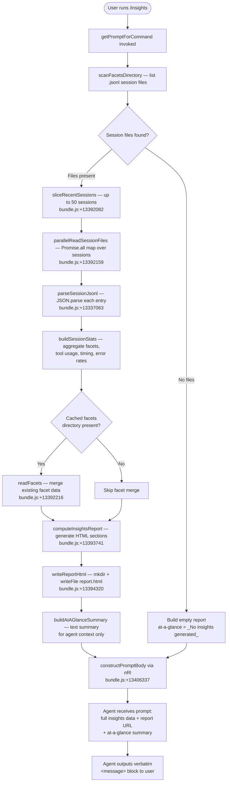

# `/insights`

> Analysis basis: CC v2.1.181 bundle.js (AST extraction + Claude interpretation)
> Minimum version: v2.1.181

---

## Overview

`/insights` generates a shareable HTML usage-analytics report from the user's local Claude Code session data, writes it to disk, and then instructs the agent to deliver a fixed confirmation message verbatim — pointing the user to the report URL and inviting follow-up questions. The command operates entirely client-side: it reads `.jsonl` session files and facet directories, builds an HTML report, and passes a rendered at-a-glance summary into the agent prompt as context.

---

## Registration

| Field | Value |
|---|---|
| type | `prompt` |
| name | `insights` |
| description | `Generate a report analyzing your Claude Code sessions` |
| loc_byte | `13405131` |
| loc_byte_end | `13406435` |
| loc_line | `9777` |
| handler_method | `getPromptForCommand` |
| handler_method_start | `13405305` |
| handler_method_end | `13406434` |
| prompt_body.length | `513` characters |
| prompt_body.trace | `call→nRl(...) (1 literals)` |
| arbor_handler.name | `getPromptForCommand` |
| arbor_handler.fqn | `claude-2.1.181::getPromptForCommand` |
| arbor_handler.kind | `Method` |
| arbor_handler.resolution_path | `direct` |
| arbor_handler.n_hits | `1` |

Analysis basis: CC v2.1.181 bundle.js:+13405131

---

## Input Branching

The command has 3+ distinct execution paths depending on whether session data exists, whether the directory scan succeeds, and whether previously cached facets are present. A Mermaid flowchart is used below.



---

## Behavioral Spec

### 1. Handler Entry — `getPromptForCommand`

The handler is an `ObjectMethod` directly on the registration object (resolved via Arbor `direct` path). It is the sole entry point for `/insights`.

```
async function getPromptForCommand(context):
    sessionList = await scanProjectDirectories(context)       // Pmf
    recentSessions = sessionList.slice(0, 50)                // tRl:+13392082/13392136
    sessionDataArray = await Promise.all(
        recentSessions.map(s => readAndParseSession(s))      // bmf via tRl:+13392159
    )
    facets = await buildFacetIndex(context)                  // wKn via tRl:+13392666
    stats = computeAggregatedStats(sessionDataArray, facets) // eRl via tRl:+13393983
    reportHtml = buildHtmlReport(stats)                      // Mmf via tRl:+13394042
    reportPath = await writeReportToDisk(reportHtml)         // tRl:+13394348
    atAGlance = buildAtAGlanceSummary(stats)                 // tRl:+13393600 (Imf)
    prompt = constructFinalPrompt(                           // nRl:+13406337
        insightsData = stats,
        reportUrl = reportPath,
        htmlFile = reportPath,
        facetsDir = facetsDirectory,
        atAGlance = atAGlance
    )
    return prompt
```

Analysis basis: CC v2.1.181 bundle.js:+13405311

---

### 2. Project Directory Scan — `scanProjectDirectories`

Reads the top-level projects directory (path component `"projects"`, bundle.js:+5211900), lists subdirectories, filters for valid project folders, and returns them sorted. Concurrency is controlled with a yielding loop using `setImmediate` (bundle.js:+13391970) and a batch size of 10 items per tick (bundle.js:+13391940) with up to 9 retries (bundle.js:+13391945).

```
async function scanProjectDirectories(context):
    rootDir = path.join(dataRoot, "projects")               // h7:+5211886
    entries = await fs.readdir(rootDir)                     // Pmf:+13391690
    dirs = entries.filter(e => e.isDirectory())             // Pmf:+13391758
    result = []
    for batch in chunked(dirs, batchSize=10):               // literal:+13391940
        for each dir in batch:
            facetFiles = await scanForJsonlFiles(dir)       // wmt:+13391848
            result.push(facetFiles)
        await yieldToEventLoop()                            // setImmediate:+13391970
    return result.sort(...)                                 // Pmf:+13391994
```

Analysis basis: CC v2.1.181 bundle.js:+13392063

---

### 3. Session File Scan — `scanForJsonlFiles`

Recursively reads a directory looking for files ending in `".jsonl"` (bundle.js:+13488497). Each entry's `isFile()` status is checked (bundle.js:+13488468), the filename is tested against a regex filter (bundle.js:+13488522), and matching files have their `stat` retrieved (bundle.js:+13488700) for metadata (size, mtime). Results are collected and returned via `Promise.all` (bundle.js:+13488632).

```
async function scanForJsonlFiles(dirPath):
    entries = await fs.readdir(dirPath)                     // wmt:+13488391
    files = []
    for entry in entries:
        if entry.isFile() and matchesJsonlPattern(entry):   // wmt:+13488468, KR:+13488522
            basename = path.basename(entry)                 // wmt:+13488525
            files.push({ name: basename, path: fullPath }) // wmt:+13488570
    stats = await Promise.all(files.map(f => fs.stat(f)))  // wmt:+13488700
    for each (file, stat) in zip(files, stats):
        fileMap.set(file.name, stat)                        // wmt:+13488711
    return fileMap
```

Analysis basis: CC v2.1.181 bundle.js:+13488391

---

### 4. Session Reading & Parsing — `readAndParseSession`

For each session, reads the corresponding `usage-data` and `session-meta` sub-paths (bundle.js:+13330897, +13330993) under the `facets` directory (bundle.js:+13330947). Files are read with encoding `"utf-8"` (bundle.js:+13337046) and parsed via `JSON.parse` (bundle.js:+190853). A safe JSON parser (`Wt`) is used to handle malformed entries gracefully.

```
async function readAndParseSession(sessionPath):
    facetsDir = path.join(sessionPath, "facets")           // Swo:+13330979
    usageDataPath = path.join(facetsDir, "usage-data")     // Qjt:+13330884
    sessionMetaPath = path.join(facetsDir, "session-meta") // literal:+13330993
    rawUsage = await fs.readFile(usageDataPath, "utf-8")   // bmf:+13337022
    parsedUsage = safeJsonParse(rawUsage)                  // Wt:+190853
    return { usage: parsedUsage, sessionPath }
```

Analysis basis: CC v2.1.181 bundle.js:+13336979

---

### 5. Facet Index Construction — `buildFacetIndex`

Enumerates all known facet keys (session metadata fields such as `"summary"`, `"last-prompt"`, `"custom-title"`, `"ai-title"`, `"tag"`, `"agent-name"`, `"agent-color"`, `"agent-setting"`, `"mode"`, `"permission-mode"`, `"isolation-latch"`, `"worktree-state"`, `"pr-link"`, `"bridge-session"`, `"file-history-snapshot"`, `"attribution-snapshot"`, `"content-replacement"`, `"fork-context-ref"`, `"marble-origami-commit"`, `"marble-origami-snapshot"`, `"marble-origami-reset"`) and collects their stored values from the session transcript store. Entries are deduped, sorted, and assembled into a structured facet map.

Analysis basis: CC v2.1.181 bundle.js:+13489141 (`qle`), with facet key literals at +13475002 through +13476749.

---

### 6. Statistics Aggregation — `computeAggregatedStats`

Processes the parsed session array to compute multi-dimensional analytics:

- **Tool usage breakdown**: tallies calls to `Edit`, `Write`, `WebSearch`, `WebFetch`, and `mcp__`-prefixed tools; classifies outcomes as success, failed, rejected, or interrupted (bundle.js:+13331721, +13331733, +13331569).
- **Session timing**: extracts hour-of-day from timestamps, buckets into `Morning (6-12)`, `Afternoon (12-18)`, `Evening (18-24)`, `Night (0-6)` (bundle.js:+13349081–+13349234).
- **Response time histograms**: bins durations into `2-10s`, `10-30s`, `30s-1m`, `1-2m`, `2-5m`, `5-15m`, `>15m` (bundle.js:+13348233–+13348293); upper bound constants 120 s and 900 s (bundle.js:+13348453, +13348535).
- **Error rate analysis**: per-tool error counts, coloured `#dc2626` (errors) / `#16a34a` (success) / `#eab308` (warning) (bundle.js:+13389614, +13389863, +13390356).
- **Commit / push events**: detects `git commit` and `git push` strings in tool call records (bundle.js:+13331977, +13332009).
- **Session length cap**: sessions longer than 3600 s are clamped (bundle.js:+13332394).
- **Warmup sessions**: sessions tagged `"warmup_minimal"` are filtered separately (bundle.js:+13393878).

Analysis basis: CC v2.1.181 bundle.js:+13340833 (`eRl`), +13343714 (`vmf`)

---

### 7. HTML Report Generation — `buildHtmlReport`

Produces a self-contained HTML file named `report.html` (bundle.js:+13394320). Key rendering details:

- HTML entities are escaped via `&amp;`, `&lt;`, `&gt;`, `&quot;`, `&apos;` (bundle.js:+5248941–+5249064).
- Markdown-style bold (`**text**`) is converted to `<strong>$1</strong>` (bundle.js:+13349939).
- Bullet points rendered as `• ` prefix (bundle.js:+13349982); line breaks as `<br>` (bundle.js:+13350012).
- Chart palette uses four colours: `#2563eb`, `#0891b2`, `#10b981`, `#8b5cf6` (bundle.js:+13385898–+13386351).
- Empty-state placeholders: `<p class="empty">No data</p>`, `<p class="empty">No response time data</p>`, `<p class="empty">No tool errors</p>`, `<p class="empty">No time data</p>` (bundle.js:+13347724, +13348181, +13389625, +13349031).
- Maximum HTML output size: 8192 characters per section (bundle.js:+13347402); overall HTML cap: 4096 (bundle.js:+13338928).
- An "Add to CLAUDE.md" suggestion link is embedded in the report output (bundle.js:+13353577).
- Report directory is created with `fs.mkdir` (bundle.js:+13394061) under the `insights` subdirectory (bundle.js:+13338819) using a timestamp-derived folder name (year/month/date/hour/minute/second, bundle.js:+13394152–+13394250).

Analysis basis: CC v2.1.181 bundle.js:+13349867 (`Mmf`), +13394061

---

### 8. At-a-Glance Summary Construction — `buildAtAGlanceSummary`

Generates a short textual summary keyed `"at_a_glance"` (bundle.js:+13345260) intended for the agent's context only — the user does not see it directly. Falls back to `"None captured"` when no sessions are processed (bundle.js:+13344594). This value is injected into the agent prompt body alongside the full insights data block.

Analysis basis: CC v2.1.181 bundle.js:+13344644 (`YMl`)

---

### 9. Prompt Construction — `constructFinalPrompt`

Called via `nRl` (bundle.js:+13406337). Assembles the 513-character prompt body (registration.prompt_body.length = 513) that the agent receives. The prompt structure (paraphrased — not quoted verbatim):

1. **Context declaration**: states the user ran `/insights` to generate a usage report.
2. **Data injection**: embeds the full aggregated insights data block.
3. **Path references**: includes the report URL, the HTML file path, and the facets directory path.
4. **Agent-only context**: injects the at-a-glance summary with a note that the user has not yet seen any output.
5. **Constrained output instruction**: instructs the agent to output the text between `<message>` tags verbatim as its entire response, without omitting any line.
6. **Fixed message template**: the `<message>` block confirms the report is ready, provides the shareable link, and closes with an invitation to explore sections or try suggestions.

When no insights were generated, the fallback string `"_No insights generated_"` (bundle.js:+13406202) is substituted into the message body.

The separator ` · ` (bundle.js:+13405763) is used between path components in the output line.

`Math.round` is called on numeric values during summary formatting (bundle.js:+13405692).

Analysis basis: CC v2.1.181 bundle.js:+13406337, +13405692

---

## State & Side Effects

| Item | Detail |
|---|---|
| Telemetry | `tengu_mcp_skills` (+6693108), `tengu_daemon_config_reload` (+17117192), `tengu_daemon_idle_exit` (+17122627), `tengu_daemon_control` (+17138162), `tengu_bg_dispatch_sigkill_escalate` (+17101321), `tengu_bg_dispatch_low_mem` (+17101922), `tengu_bg_spare_enable` (+17102619), `tengu_bg_spare_claim` (+17102747), `tengu_bg_spare_claim_fail` (+17103013), `tengu_scheduled_task_fire` (+16571560), `tengu_scheduled_task_expired` (+16571903), `tengu_bg_retire_pinned_low_mem` (+17106011), `tengu_bg_prewarm_per_sweep` (+17106132), `tengu_transcript_phantom_parent` (+13473767), `tengu_relink_walk_broken` (+13452800), `tengu_transcript_parent_cycle` (+13477687), `tengu_chain_parent_cycle` (+13454577), `tengu_chain_timestamp_fallback` (+13454726), `tengu_chain_parallel_tr_recovered` (+13456592), `tengu_daemon_yield` (+17121597) |
| Filesystem reads | Reads all `.jsonl` files from the `projects` data directory; reads `usage-data` and `session-meta` facet files per session (encoding: `utf-8`) |
| Filesystem writes | Creates timestamped subdirectory under `insights/` with `fs.mkdir`; writes `report.html` via `fs.writeFile` (bundle.js:+13394348) |
| Session limit | Maximum 50 recent sessions processed (bundle.js:+13392082) |
| Batch concurrency | Directory scan yields every 10 items via `setImmediate` (bundle.js:+13391940, +13391970) |
| Agent output | Agent is instructed to emit the `<message>` block verbatim — no additional prose permitted |
| appState changes | None observed in depth-2 traversal |
| Sound | None observed in depth-2 traversal |
| Hook registration | None observed in depth-2 traversal |

---

## Version History

| Version | Change |
|---|---|
| v2.1.181 | Initial analysis |

---

## Common Mistakes

1. **Expecting live/streaming output**: `/insights` pre-computes everything before the agent responds. There is no streaming progress — the agent emits one fixed message after the report is fully written.
2. **Looking for the report in the current directory**: the HTML file is written to a timestamped subdirectory under the Claude Code data root's `insights/` folder, not the working directory. The agent message includes the exact path.
3. **Running `/insights` with no prior sessions**: if no `.jsonl` session files are present, the report is generated but contains only empty-state placeholders; the agent response substitutes `"_No insights generated_"` into the message body.
4. **Expecting customisable output**: the agent response is a verbatim fixed template. The command does not accept arguments; no filtering by date range or project is supported at invocation time.
5. **Assuming the at-a-glance text is shown directly**: the at-a-glance summary is injected into the agent's context only. The user sees the `<message>` block output, not the raw summary text.
6. **Modifying the facets directory during execution**: the scan uses a `Promise.all` over stat calls; files added or removed mid-flight may produce inconsistent metadata.

---

## Appendix — Identifier Mapping

> For bundle debugging only. Identifiers change across versions.

| Identifier | Role |
|---|---|
| `tRl` | Main insights data-pipeline orchestrator (called by `getPromptForCommand`) |
| `Pmf` | Project directory scanner — lists and filters project subdirectories |
| `h7` | Constructs the `projects` root path via `path.join` |
| `wmt` | Recursive `.jsonl` file scanner within a project directory |
| `KR` | Regex tester for `.jsonl` filename pattern |
| `bmf` | Per-session reader — resolves facet path and reads session file |
| `Swo` | Facet directory path resolver (one level above `Qjt`) |
| `Qjt` | `usage-data` sub-path constructor |
| `QMl` | Unknown helper called after `readFile` in session reader |
| `Wt` | Safe JSON parser wrapper around `JSON.parse` |
| `nRl` | Final prompt-body assembler — inserts data into the template |
| `eRl` | Statistics aggregation over parsed session array |
| `vmf` | Per-project stats formatter and HTML section builder |
| `Mmf` | Top-level HTML report generator |
| `Dmf` | HTML escape utility called inside report generator |
| `y_e` | Per-section HTML table/chart renderer |
| `xmf` | Numeric max/entry aggregation helper for chart data |
| `kmf` | Map-based aggregation helper (tool counts) |
| `CKn` | HTML entity encoder called from report generator |
| `Ep` | HTML text escape function |
| `Bp` | `replaceAll`-based entity substitution primitive |
| `Imf` | At-a-glance summary builder and report metadata writer |
| `ymf` | Prompt section formatter (maps sessions to text rows) |
| `gmf` | Inner row formatter used by `ymf` |
| `Two` | Session-level stat computer (timing, tool types, outcomes) |
| `JMl` | Per-message classifier — categorises tool calls and event types |
| `Amf` | NaN-guard helper for numeric session fields |
| `Jjt` | Unknown helper invoked during message classification |
| `mmf` | File extension extractor (`path.extname`) |
| `Fve` | Diff utility caller |
| `Wu` | Index-of helper |
| `Ah` | Rounding/formatting helper for session stats |
| `bwo` | Unknown helper called before stat map lookup in `tRl` |
| `ZMl` | Numeric distribution / histogram bucket builder |
| `eRl` | Session stats reducer (entry-level aggregation, sort, percentile) |
| `vmt` | Object-entries iterator for stats map |
| `Li` | String slice helper (index-of + slice) |
| `Tmf` | Report directory creator and initial file writer (`usage-data` facet) |
| `Re` | JSON stringify wrapper |
| `Emf` | Facet file reader and unlinker for stale entries |
| `vKn` | Session-meta path resolver |
| `rRl` | Unknown helper called after facet parse in `Emf`/`Imf` |
| `Smf` | Secondary file writer for facet data |
| `Omf` | Object-keys enumerator used in report post-processing |
| `Lut` | Report output stage — calls agent runner and writes final artefact |
| `jc` | Unknown helper called at report output stage |
| `X5n` | Agent invocation wrapper — hashes content, reads/writes files |
| `Pn` | UUID generator for report artefact naming |
| `$Ge` | Error handler for missing assistant message in agent output |
| `N0` | Unknown constant used at report output stage |
| `mx` | Calls `fx`; likely a module initialiser |
| `T1` | Unknown terminal step in `Lut` |
| `XMl` | Wraps `NE`; used in `Imf` for config lookup |
| `NE` | Config accessor (`Pbe`) |
| `_m` | Module entry point caller (`Lt`) |
| `Lt` | Calls `fx`; likely bundle bootstrap |
| `$c` | Array filter helper |
| `Ho` | Error / string coercion utility |
| `YMl` | Per-report HTML section combiner and at-a-glance writer |
| `umf` | Calls `NE`; config reader for insights section |
| `wKn` | Facet index builder — enumerates all facet types across sessions |
| `qle` | Central facet store manager (get/set/clear per facet key) |
| `rAf` | Unknown initialiser called at start of `qle` |
| `D` | Timeout-cleared write stream (used inside `qle`) |
| `c6` | Unknown helper within `qle` |
| `S7t` | JSON-like object walker (handles arrays and plain objects) |
| `LT` | Unknown transform called in facet value processing |
| `vRl` | Facet value chain walker (follows parent links) |
| `LAf` | Binary buffer parser for facet file format |
| `xAf` | Binary file reader for attribution snapshots |
| `kAf` | Synchronous binary file reader (open/read/close) |
| `tSe` | Unknown codec called in `qle` |
| `QRl` | Facet entry collector (values → push → set) |
| `yge` | Chain builder — detects cycles, resolves parent UUIDs |
| `HAf` | NaN-guard and value-existence checker for chain entries |
| `_Af` | Chain sort and deduplication logic |
| `hAf` | Queue-based chain traversal helper |
| `Bat` | Map transform over chain entries |
| `Zwo` | Text normaliser — `replaceAll` and slice on chain entries |
| `bGt` | Row builder for chain entries (handles arrays) |
| `tLo` | Attachment type checker (image / document) |
| `yAf` | Array-or-string trim/test helper |
| `EAf` | Array some-matcher for attachment types |
| `jKn` | Facet map get/set/push helper |
| `WKn` | Array.from + values helper for facet enumeration |
| `Lxn` | `parseInt` wrapper for retry-count parsing |
| `Qrt` | `parseInt` wrapper for connection slot parsing |
| `DBe` | MCP connection dispatcher (reached via `a.push` in `tRl`) |
| `qle` | (see above — also the central session-state store) |
| `F` | Tool-call classifier / permission gate |
| `Clt` | Tool classifier — calls `oso` and `p2t` |
| `YW` | Workflow executor — orchestrates sub-tasks |
| `ke` | Error logger and event emitter |
| `ls` | Filesystem error classifier (`ln`) |
| `Ho` | (see above) |
| `Re` | (see above) |

---

Note: index built via Arbor fallback; some signals (telemetry, literals) may be missing — see arbor-fallback.js.