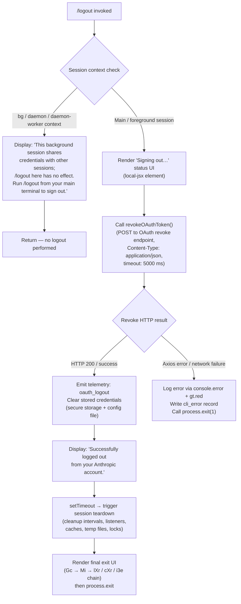

# `/logout`

> Analysis basis: CC v2.1.181 bundle.js (AST extraction + Claude interpretation)
> Minimum version: v2.1.181

---

## Overview

The `/logout` command signs the user out of their Anthropic account by revoking the active OAuth token, clearing stored credentials, and then terminating the current Claude Code session. It is a `local-jsx` command that renders a brief status UI, executes the logout flow asynchronously, and finally calls process exit. Background (daemon/worker) sessions are explicitly blocked from performing a real logout and instead display an informational message.

---

## Registration

| Field | Value |
|---|---|
| type | `local-jsx` |
| name | `logout` |
| description | Sign out from your Anthropic account |
| loc_byte | `11839270` |
| loc_byte_end | `11839554` |
| loc_line | `7579` |
| module_id | `Kto` |
| load_inline | `true` |
| arbor_handler.name | `Tlp` |
| arbor_handler.fqn | `claude-2.1.181::Tlp` |
| arbor_handler.kind | `AsyncFunction` |
| arbor_handler.resolution_path | `module_id` |
| arbor_handler.n_hits | `0` |

Analysis basis: CC v2.1.181 bundle.js:+11839270

---

## Input Branching

The command has three distinct top-level paths based on session context and logout outcome, warranting a Mermaid flowchart.



Analysis basis: CC v2.1.181 bundle.js:+8127606, +8129062, +8129172, +8129371, +8129434

---

## Behavioral Spec

### Background-session guard

When the session type is `bg`, `daemon`, or `daemon-worker` (literals at bundle.js:+2299640, +2299650, +2299664), the handler detects that credentials are shared and outputs the message beginning with `"This background session shares credentials…"` (bundle.js:+8129172). No credential revocation or session teardown occurs; the command returns immediately.

```
function logoutHandler(sessionContext, appState):
    if sessionContext.type in {"bg", "daemon", "daemon-worker"}:
        renderMessage("This background session shares credentials …")
        return
    runForegroundLogout(appState)
```

Analysis basis: CC v2.1.181 bundle.js:+8129062, +8129172

---

### OAuth token revocation (`revokeOAuthToken` — identified as `t1`)

Posts to the configured OAuth endpoint with the `refresh_token` field and the `oauth_token_revoke` label. The request carries `Content-Type: application/json` and a 5 000 ms timeout.

```
async function revokeOAuthToken(credentials):
    payload = {refresh_token: credentials.refreshToken}
    headers = {"Content-Type": "application/json"}
    response = await httpPost(oauthEndpoint, payload,
                              {timeout: 5000, label: "oauth_token_revoke"})
    if isAxiosError(response):
        logNetworkError(response)
        writeCliErrorRecord("cli_error")
        process.exit(1)
    return response
```

Analysis basis: CC v2.1.181 bundle.js:+2135344, +2135399, +2135414, +2135442, +2135452, +13300071

---

### Credential clearing (`clearCredentials` — identified as `Ps` / `JT` chain)

After a successful revoke call the handler clears the stored credentials. The secure-storage layer (`bBs`) handles both a primary keychain path and a plaintext fallback. If clearing the keychain entry fails the error handler (`eje`) prints a red-coloured error via `console.error` and `gt.red`, then writes a `cli_error` record and calls `process.exit(1)`.

```
function clearCredentials(configPath):
    try:
        secureStorage.delete(credentialKey)    // primary keychain
    catch err:
        if isTransientSkipFallback(err):
            // emit: primary_transient_skip_fallback
            pass
        else:
            // emit: primary_and_fallback_failed
            printError(err)
            writeCliErrorRecord("cli_error")
            process.exit(1)
    writeFileSync(configPath, updatedConfig)   // JT → Ire.writeFileSync
```

Analysis basis: CC v2.1.181 bundle.js:+13300061, +13300068, +13300071, +13300084, +198143, +2327746, +2327844, +2327993, +2328096

---

### Session teardown (`cleanupSession` — identified as `uFt`)

Invoked after successful credential clearing. Runs several sub-steps:

1. **Cache flush** (`Yfe`): calls `xei.clear()` to wipe in-memory caches.
2. **Listener removal** (`qJe` via `Ose`): removes `exit` and `beforeExit` process listeners (bundle.js:+3321888, +3322648), clears multiple WeakRef/Map registries (`zTe`, `Kgn`, `ZLt`, `z1r`, `Vj`), and removes interval timers via `clearInterval`.
3. **Config/lock cleanup** (`_ca`): unlinks any lock files and socket files via `lst.unlink`.
4. **Daemon socket cleanup** (`zto` / `Zxo`): clears pending daemon timeouts via `clearTimeout` and unlinks the daemon socket (`mje.unlink`).

```
async function cleanupSession():
    flushCaches()          // xei.clear
    removeProcessListeners()   // process.off, clearInterval on exit/beforeExit
    clearRegistries()      // zTe/Kgn/ZLt/z1r/Vj .clear
    unlinkLockFiles()      // lst.unlink
    clearDaemonTimeout()   // clearTimeout
    unlinkDaemonSocket()   // mje.unlink
```

Analysis basis: CC v2.1.181 bundle.js:+8128919, +8128925, +8128931, +8128937, +8128962, +8129016, +8129028, +3039163, +3321830, +3321956, +3322590, +3322625

---

### Telemetry emission (`oauth_logout`)

Immediately after credential clearing succeeds, the handler emits the telemetry literal `"oauth_logout"` (bundle.js:+8128842). This is a string constant, not a `tengu_*` event, fired inline in the `zit` function body.

Analysis basis: CC v2.1.181 bundle.js:+8128842

---

### Exit UI rendering (`Gc` → `Mi` chain)

After `setTimeout` fires (bundle.js:+8129434) the handler calls `Gc`, which:

1. Invokes `i3e` to write a final sync output line via `Fhe.writeSync` and unmount the Ink/React component.
2. Calls `lXr` to render the goodbye banner (using `gt.dim`, path sanitisation via `t.replaceAll`).
3. Calls `cXr` which clears the exit timer, reads process state via `Vu.get`, and calls `process.exit` (or `process.kill("SIGKILL")` on a timeout path).

```
function renderExitAndTerminate():
    writeSync(finalOutputLine)   // i3e → Fhe.writeSync
    unmountInkComponent()        // i3e → e.unmount
    renderGoodbyeBanner()        // lXr
    scheduleForceKill()          // cXr, SIGKILL if graceful exit stalls
    process.exit(0)
```

Analysis basis: CC v2.1.181 bundle.js:+7189129, +7189154, +7189179, +7189196, +7188464, +7188542, +7188921

---

### Config persistence during logout (`saveConfigWithLock` — identified as `un` / `n7n`)

When credentials are wiped from config the lock-based write path applies the safety guard described by the literal at bundle.js:+13939555: if the re-read config is missing auth that the cache still holds, the write is refused to avoid wiping `~/.claude.json` (GitHub issue #3117). The telemetry event `tengu_config_auth_loss_prevented` (bundle.js:+13939707) is emitted when this guard triggers.

Analysis basis: CC v2.1.181 bundle.js:+13939555, +13939707

---

## State & Side Effects

| Item | Detail |
|---|---|
| Telemetry (inline literal) | `oauth_logout` — emitted on successful token revocation (bundle.js:+8128842) |
| Telemetry (config subsystem) | `tengu_config_lock_contention`, `tengu_config_stale_write`, `tengu_config_parse_error`, `tengu_config_auth_loss_prevented`, `tengu_config_fallback_write` |
| Telemetry (feature tracking) | `tengu_feature_ok`, `tengu_feature_sad`, `tengu_feature_bad` |
| Telemetry (session/scroll) | `tengu_scroll_summary`, `tengu_cache_eviction_hint`, `tengu_session_end` (via `session_end` literal at +7191279) |
| Telemetry (startup) | `tengu_startup_perf` (exit path) |
| Telemetry (daemon) | `tengu_daemon_config_reload` |
| OAuth HTTP call | `POST` to OAuth endpoint, `refresh_token` body, 5 000 ms timeout, label `oauth_token_revoke` |
| Secure storage | Credential key deleted; telemetry events distinguish `secure_storage_credentials_write`, `primary_transient_skip_fallback`, `plaintext_fallback_used`, `primary_and_fallback_failed` |
| Config file | `~/.claude.json` updated to remove auth; lock-based write with auth-loss guard |
| Lock / socket files | Unlinked by `_ca` → `lst.unlink` and `zto` → `mje.unlink` |
| Process listeners | `exit` and `beforeExit` listeners removed; all registered intervals cleared |
| In-memory caches | `xei`, `zTe`, `Kgn`, `ZLt`, `z1r`, `Vj` cleared |
| Ink/React component | Unmounted via `e.unmount` before process exit |
| Process exit | `process.exit` called (code 0 on success, code 1 on error); SIGKILL fallback if graceful exit stalls |
| Sound | Not found in depth-2 traversal |

---

## Version History

| Version | Change |
|---|---|
| v2.1.181 | Initial analysis |

---

## Common Mistakes

1. **Running `/logout` inside a background or daemon session** — the command detects `bg`/`daemon`/`daemon-worker` context and does nothing; you must run `/logout` from the main interactive terminal session.
2. **Expecting the token revoke to be instantaneous** — the OAuth revoke POST has a 5 000 ms timeout; network issues will cause a `cli_error` exit rather than a silent no-op.
3. **Assuming `/logout` only clears in-memory state** — the command deletes the credential from the OS keychain and rewrites `~/.claude.json`, so the effect persists across restarts.
4. **Re-running Claude immediately after** — session teardown includes timer and listener cleanup followed by `process.exit`; the process will terminate, so any in-flight work is lost.
5. **Ignoring the auth-loss guard** — if another Claude instance wrote auth between the command reading and writing `~/.claude.json`, the write is refused and `tengu_config_auth_loss_prevented` is emitted; this is a safety mechanism, not a bug.

---

## Appendix — Identifier Mapping

> For bundle debugging only. Identifiers change across versions.

| Identifier | Role |
|---|---|
| `Tlp` | Main logout handler (AsyncFunction, resolved via module_id `Kto`) |
| `Ilp` | Logout UI component — renders "Signing out…" status element |
| `zit` | Core logout execution function; orchestrates revoke → clear → cleanup → exit |
| `r` | Data-stream reader helper used in logout pipeline |
| `Ps` | Error-writing helper; writes `cli_error` record and calls `process.exit(1)` |
| `eje` | Error formatter; calls `console.error` + `gt.red` for red-coloured error output |
| `JT` | Config file writer; calls `Ire.writeFileSync` after credential removal |
| `Ci` | Session-context classifier (detects `bg`/`daemon`/`daemon-worker`) |
| `G1e` | Session type constant / lookup used by context classifier |
| `uFt` | Session teardown orchestrator (caches, listeners, locks, sockets) |
| `gkn` | Sub-step of session teardown |
| `zfe` | Cache/state reset utility |
| `Yfe` | Cache flush; calls `xei.clear()` |
| `UTe` | Teardown sub-step |
| `Ose` | Listener/registry removal orchestrator |
| `p4` | Registry helper used by listener removal |
| `d4` | Registry helper (depth 2 under `p4`) |
| `qJe` | Clears process listeners and multiple Map/WeakRef registries |
| `eNr` | Removes `beforeExit` interval and `process.removeListener` |
| `ke` | Error logging helper; uses `jJ.logError` and manages `QVe`/`ren` queues |
| `Ho` | Error construction helper |
| `rt` | String conversion utility |
| `ta` | Network traffic classifier (`essential-traffic`) |
| `fVc` | Queue rotation helper (`ren.shift` / `ren.push`) |
| `_ca` | Lock/socket file cleanup; calls `lst.unlink` |
| `Sca` | Sub-helper of lock cleanup |
| `sNt` | Sub-helper; calls `Ees` |
| `Ees` | Cleanup primitive |
| `hpe` | Path helper used in cleanup |
| `ctn` | Path join helper (`yes.join`, `sr`) |
| `zto` | Daemon socket teardown; calls `mje.unlink` and `tIe` |
| `Zxo` | Daemon timeout clearance; calls `clearTimeout` |
| `t0o` | Sub-helper of daemon timeout clear |
| `Ame` | State-check helper (`n.some`, `t.includes`, `zfe`) |
| `tIe` | Socket path builder (`Yfi.join`, `sr`) |
| `xr` | Utility reading current state (`rt`) |
| `uc` | Credential store accessor |
| `bBs` | Secure-storage read/write/delete implementation |
| `z1e` | Storage async-read helper |
| `TDu` | AsyncLocalStorage context manager for credential operations |
| `xe` | Feature-event emitter (`tengu_feature_ok` / bad) |
| `j` | Feature-event payload builder |
| `$e` | Event dispatcher routing to `Rht` |
| `Ut` | Feature-event emitter variant (`tengu_feature_sad`) |
| `Me` | Feature-event emitter variant (`tengu_feature_bad`) |
| `t1` | OAuth token revocation HTTP call; posts `refresh_token`, handles Axios errors |
| `ks` | OAuth endpoint URL builder (env-aware: `prod`/`local`/`staging`) |
| `vWo` | OAuth URL constant helper |
| `UOc` | OAuth URL constant helper |
| `I` | HTTP client wrapper / API request helper |
| `xhc` | HTTP request executor |
| `L$o` | HTTP transport layer (`Mfc`/`Rfc`) |
| `Re` | JSON serialisation helper |
| `qc` | Response path/header extractor |
| `c3o` | Header map helper |
| `nqe` | Output write helper (`QBo` → `e.write`) |
| `Rhc` | Log-file writer (append, rotate, flush) |
| `kWe` | Buffered batch writer (setTimeout/setImmediate flush) |
| `Fde` | Log entry formatter |
| `jt` | File-existence / stat guard utility |
| `bre` | EISDIR-safe path resolver |
| `f3o` | Log file path builder |
| `Sor` | Atomic rename-based file write helper |
| `Mhc` | Log file append + rotate implementation |
| `Gi` | Output-drain registration (`v$o.register`) |
| `lJ` | Miscellaneous logout-pipeline step |
| `dPr` | Directory/path resolution for config |
| `Wei` | Config path builder |
| `DMs` | Platform-aware config directory resolver |
| `n1` | NFC-normalised path + SHA-256 hash utility |
| `Iv` | Path cache lookup (`LOe`) |
| `IR` | OS user-info resolver (`wln.userInfo`, `sLu.test`) |
| `Ee` | String cast utility |
| `un` | `saveGlobalConfig` with fallback-write safety guard |
| `n7n` | `saveConfigWithLock` — acquires file lock, writes config atomically |
| `gBs` | Key-value store bootstrap (`kvr`, `Object.assign`) |
| `ln` | Logging helper used across config and cleanup paths |
| `w_e` | Config file reader with backup/copy logic |
| `qmt` | Config merge helper |
| `h0o` | Backup directory path builder (`backups`) |
| `T` | Terminal/input handler (cursor math) |
| `g` | Stream chunk processor (Buffer.concat, indexOf, subarray) |
| `E` | Viewport dimension helper (Math.max/min) |
| `lSt` | `writeFileSyncAndFlush` — atomic write with fsync and rename |
| `dMe` | Config delta helper |
| `f0o` | Config entry enumerator (`Object.entries`) |
| `L8t` | Timestamp helper (`Date.now`) |
| `t7n` | Fallback config writer (uses `lSt`, emits `tengu_config_fallback_write`) |
| `Dun` | Supplementary teardown step |
| `o` | UI row formatter (`s.map`, `i.padEnd`, `"  "` padding) |
| `FRe` | State mutation helper |
| `Ilp` | Logout UI component (renders "Signing out…" + "logout"/"oauth" labels) |
| `T$e` | App-state accessor/initialiser |
| `DS` | State container (`Ee`) |
| `Pu` | Config hydration and MCP server update emitter |
| `b$e` | Full application config loader |
| `$j` | Session-ID generator (`A0o.randomBytes`, 32 bytes) |
| `Lt` | Lazy initialiser wrapper (`fx`) |
| `gbn` | Config schema builder (`VH`, `URe`, `Wfd`, `Object.freeze`) |
| `Kkt` | Config key transformer (`rt`) |
| `qV` | Capability check (`y8c.has`) |
| `kc` | Credential lookup (`uy`, `It`) |
| `U0i` | Config field validators (`Vfd`, `qfd`) |
| `$gt` | Config getter shorthand |
| `Etr` | Config change event type |
| `a` | MCP server lifecycle manager (emit, get, values, mutate) |
| `DBe` | MCP connection orchestrator (stdio/sse/ws-ide transport selection) |
| `bQn` | MCP connection result applicator (`applyMcpUpdate`, `n.cleanup`) |
| `l` | MCP client registry helper (`cxl`) |
| `kOo` | MCP slot reconciler (filter, getClients, DBe, bQn) |
| `Str` | Config serialisation helper |
| `Gc` | Top-level exit renderer; calls `Mi` for graceful shutdown |
| `Mi` | Session exit orchestrator (unmount, write, race timeout, drain) |
| `i3e` | Ink component unmount + final writeSync |
| `oF` | Exit output formatter |
| `Xyn` | ANSI cursor-save/restore writer (`\x1b7`/`\x1b8`) |
| `lXr` | Goodbye banner renderer (`gt.dim`, path sanitisation) |
| `qw` | Terminal width/state query |
| `i9` | Ink instance accessor |
| `Z1t` | Working-directory stat helper |
| `mh` | Module path helper (`Lt`, `Au`) |
| `ala` | Banner formatting helper |
| `cXr` | Force-exit scheduler; calls `process.exit` or `process.kill("SIGKILL")` |
| `DWe` | Output drain trigger (`v$o.drain`) |
| `d` | MCP supervisor lifecycle (start/stop/updateConfig, heartbeat) |
| `YGe` | File-read orchestrator for session context |
| `bkl` | Column-width calculator (`Math.max`, `Object.keys`) |
| `y` | UI stop helper (`UOt`, `oht`) |
| `dlc` | Heartbeat helper (`Use`) |
| `Hla` | Parallel shutdown helper (`Promise.allSettled`, `Array.from`) |
| `e_t` | Startup-perf profiler (`Ror`, `v3o`; emits `tengu_startup_perf`) |
| `Ror` | Perf report serialiser (`D3o`, `j`) |
| `v3o` | Perf report writer (joins path, `JSON.stringify`, "mark", "Startup profiling report:") |
| `Ckn` | Scroll summary recorder (emits `tengu_scroll_summary`) |
| `ila` | Scroll measurement helper |
| `sla` | Scroll stats aggregator (`Date.now`, `Math.round`, `Object.assign`) |
| `Ds` | Display-mode selector (fullscreen/default; emits `tengu_pewter_brook`) |
| `igt` | Cache eviction hint (emits `tengu_cache_eviction_hint`) |
| `Qe` | React root accessor (`Rht`) |
| `Rht` | React root registry |
| `Ur` | Non-conforming state handler |
| `X_` | Fallback root accessor (`Rht`) |
| `l3e` | Graceful-exit promise chain (`Tkn`) |
| `Tkn` | Exit promise resolver |

---

*Note: index built via Arbor fallback; some signals (telemetry, literals) may be missing — see arbor-fallback.js.*