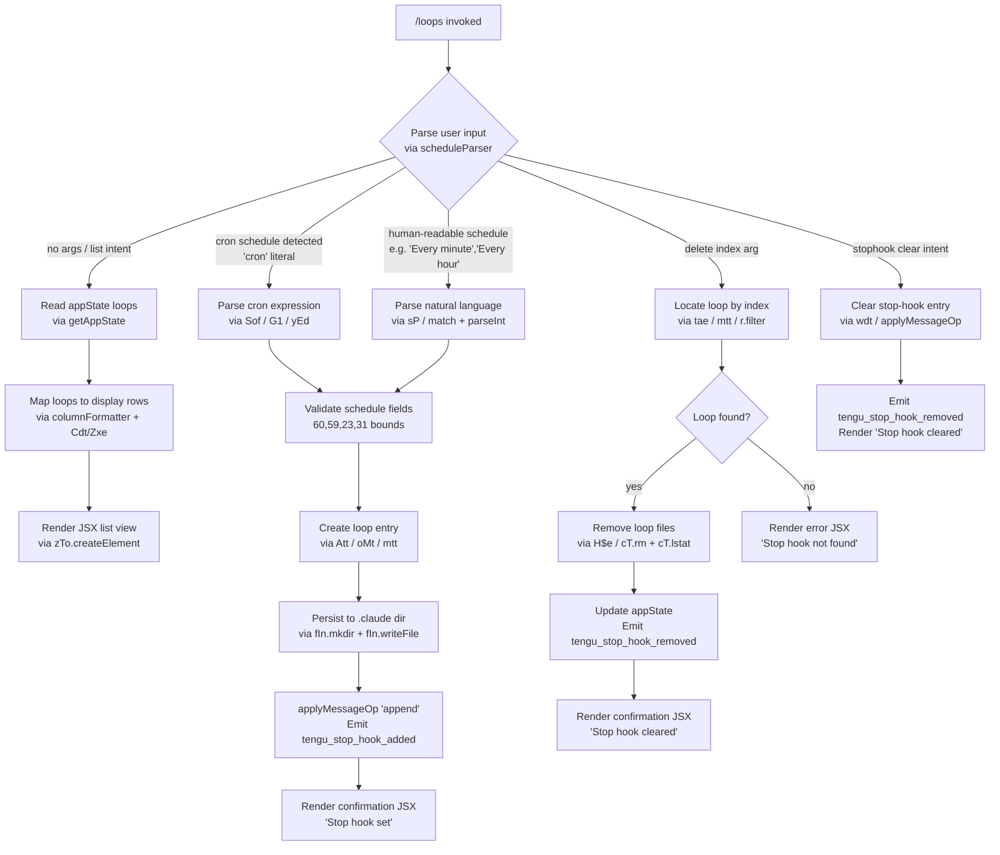

# `/loops`

> Analysis basis: CC v2.1.181 bundle.js (AST extraction + Claude interpretation)
> Minimum version: v2.1.181

---

## Overview

The `/loops` command provides a management interface for Claude Code's background loop (scheduled task) system. It allows users to list currently active loops, create new scheduled loops with cron-style or human-readable schedule specifications, and delete existing loops. The command renders its output as a JSX component (`local-jsx` type) and operates by reading application state, constructing or removing loop entries, and persisting changes back to the session's loop registry.

---

## Registration

| Field | Value |
|---|---|
| type | `local-jsx` |
| name | `loops` |
| description | `List, create, and delete loops` |
| loc_byte | `12739527` |
| loc_byte_end | `12739684` |
| loc_line | `8369` |
| immediate | `true` |
| module_id | `FTl` |
| load_inline | `true` |
| arbor_handler.name | `bof` |
| arbor_handler.fqn | `claude-2.1.181::bof` |
| arbor_handler.kind | `AsyncFunction` |
| arbor_handler.resolution_path | `module_id` |
| arbor_handler.n_hits | `0` |

Analysis basis: CC v2.1.181 bundle.js:+12739527

---

## Input Branching

The command handles five distinct user-intent branches (list, create with cron schedule, create with human-readable schedule, delete by index, and clear stop-hook), warranting a Mermaid flowchart.



---

## Behavioral Spec

### Handler Entry Point (`bof`)

The primary async handler resolves via `module_id` → `FTl` and is identified by Arbor as `bof` (AsyncFunction).

Analysis basis: CC v2.1.181 bundle.js:+12738482

```
async function loopsCommandHandler(context):
    emit telemetry("tengu_loops_command")            // loc +12738484
    rawInput = context.userInput
    appState = context.getAppState()                 // loc +12738534

    parsedSchedule = parseScheduleInput(rawInput)   // sP, loc +12738613
    loopList       = buildLoopList(appState)        // Cdt + Zxe, loc +12738530

    if rawInput is empty or list-only:
        rows = loopList.map(formatLoopRow)           // n.map, loc +12738562
        return renderJSX(LoopListView, rows)

    elif parsedSchedule.type == "cron":              // literal "cron" loc +12738580
        entry = createLoopEntry(parsedSchedule)      // Att, loc +12739132
        persistLoopFiles(entry)                      // oMt, loc +12738769 via tae
        applySessionOp("append", entry)              // wdt, loc +12738908
        return renderJSX(ConfirmView, "Stop hook set")  // loc +12739244

    elif parsedSchedule.type == "stophook":          // literal "stophook" loc +12738666
        clearResult = clearStopHook(appState)        // wdt, loc +12738908
        if clearResult.found:
            return renderJSX(ConfirmView, "Stop hook cleared")   // loc +12738948
        else:
            return renderJSX(ErrorView, "Stop hook not found")   // loc +12738926

    elif parsedSchedule.isDelete:
        deleteResult = deleteLoop(parsedSchedule.index, appState) // tae, loc +12738769
        if deleteResult.removed:
            return renderJSX(ConfirmView, "Stop hook cleared")
        else:
            return renderJSX(ErrorView, "Stop hook not found")

    else:
        return renderJSX(ErrorView, parseError)
```

### Schedule Parser (`sP`)

`sP` normalizes a variety of schedule formats into a canonical schedule object.

Analysis basis: CC v2.1.181 bundle.js:+4900033

```
function parseScheduleInput(raw):
    trimmed = raw.trim()                             // loc +4900033
    if match(trimmed, humanReadablePattern):         // o.match, loc +4900174
        value = parseInt(captureGroup)               // loc +4900209
        if contains("Every minute"):                 // literal loc +4900153
            return {type:"cron", minute:"*", hour:"*"}
        elif contains("Every hour"):                 // literal loc +4900370
            return {type:"cron", minute:"0", hour:"*"}
        // day-of-week UTC adjustment:
        date = new Date()
        date.setUTCDate(...)                         // loc +4900929
        date.setUTCHours(0,0,0,0)                   // loc +4900960
        day = date.getDay()                          // loc +4900989

    if match(trimmed, cronStringPattern):            // s.match, loc +4900444
        return parsedCronDescriptor(trimmed)
    if match(trimmed, "1-5" range):                  // literal loc +4901077
        return weekdayRange

    return {type:"cron", rawExpr: trimmed}
```

### Cron Expression Validator / Normalizer (`Sof`)

`Sof` validates cron field ranges and converts shorthand into canonical cron tuples.

Analysis basis: CC v2.1.181 bundle.js:+12738070

```
function validateCronExpression(expr):
    parts = expr.match(cronPattern)                  // e.match, loc +12738070
    minutes = parseInt(parts[0])                     // loc +12738107
    maxMinutes = Math.max(0, Math.ceil(minutes))     // loc +12738192, +12738203
    // Bounds applied:
    //   minute field max: 59    (literal loc +12738249)
    //   hour field max:   23    (literal loc +12738320)
    //   day field max:    31    (literal loc +12738373)
    //   second/tick max:  60    (literal loc +12738215)
    rounded = Math.round(normalizedValue)            // loc +12738276
    lineItems = buildLineItems(rounded)              // G1, loc +12738440
    return canonicalCronObject
```

### Line-Item / Day-of-Week Builder (`G1` + `yEd`)

Converts numeric day/time values into human-readable line items for display.

Analysis basis: CC v2.1.181 bundle.js:+4898862

```
function buildLineItems(value):
    trimmed = value.trim()                           // e.trim, loc +4898862
    segments = splitIntoLineItems(trimmed)           // yEd, loc +4898948

function splitSegments(raw):
    parts = raw.split(separator)                     // e.split, loc +4898282
    for each part s:
        m = s.match(numericPattern)                  // s.match, loc +4898302
        n = parseInt(m)                              // loc +4898347
        // Recognized day-of-week constants:
        //   3 = Wednesday, 6 = Saturday,
        //   7 = Sunday (or overflow),  loc +4898523,+4898559,+4898565
        daySet.add(n)                                // o.add, loc +4898408
    // max items per row: 5  (literal loc +4898898)
    // max digit width:   10 (literal loc +4898361)
    // day-name array length: 4 (literal loc +4899061)
    return Array.from(daySet)                        // loc +4898810
```

### Loop List Builder (`Cdt` + `Zxe` + `rUa`)

Formats existing loops into aligned table columns for display.

Analysis basis: CC v2.1.181 bundle.js:+10692485

```
function buildLoopList(appState):
    columnWidths = new Map()
    for each loop in appState.loops:
        Zxe: columnWidths.set(key, padded)           // o.set, loc +9133748
        rUa: rows = entries.map(formatRow)           // e.map, loc +9133517
    // column separator: "  " (two spaces, literal loc +17127064)
    // column pad: i.padEnd  (loc +17127043)
    items.push(formattedRow)                         // n.push, loc +10692609
    return items
```

### Column / Schedule Text Formatter (`Lec`)

Renders plural-aware summary text for multi-loop display.

Analysis basis: CC v2.1.181 bundle.js:+16574224

```
function formatLoopSummaryText(loops):
    mapped = loops.map(entry => formatEntry(entry))  // e.map, loc +16574224
    sched  = parseScheduleInput(entry.schedule)      // sP, loc +16574246
    maxWidth = Math.max(...widths)                   // loc +16574355
    // Plural/singular strings assembled:
    //   "s were" / " was"         loc +16573911, +16573920
    //   "They have" / "It has"    loc +16573969, +16573981
    //   "these prompts" / "this prompt"  loc +16574067, +16574083
    //   "each one" / "it"         loc +16574164, +16574175
    return rows.join(delimiter)                      // r.join, loc +16574461
```

### Loop Entry Creator (`Att`)

Constructs a new loop entry object with a UUID and timestamp.

Analysis basis: CC v2.1.181 bundle.js:+4903589

```
function createLoopEntry(schedule, promptText):
    id        = crypto.randomUUID()                  // BOi.randomUUID, loc +4903589
    createdAt = Date.now()                           // loc +4903651
    // UUID generation uses 8-character hex prefix (literal 8, loc +4903614)
    content   = buildEntryContent(schedule, promptText) // BRe, loc +4903697
    fileData  = readAndMergeConfig(...)              // mtt, loc +4903741
    entry     = {id, createdAt, schedule, content}
    entries.push(entry)                              // a.push, loc +4903754

    // Persist:
    persistLoopFiles(entry)                          // oMt, loc +4903848
    uiState = buildUIState(entry)                    // Lt, loc +4903786
    return {entry, uiState}
```

### Loop File Persistence (`oMt`)

Writes loop configuration files under the `.claude` directory.

Analysis basis: CC v2.1.181 bundle.js:+4903398

```
function persistLoopFiles(entry):
    baseDir = resolveConfigPath()                    // _c, loc +4903398
    fs.mkdir(baseDir, {recursive:true})              // fIn.mkdir, loc +4903409
    targetPath = path.join(baseDir, ...)             // mIn.join, loc +4903419
    // Root config dir: ".claude"  (literal loc +4903430)
    payload = entry.content.map(serializeItem)       // e.map, loc +4903470
    fs.writeFile(targetPath, serialized)             // fIn.writeFile, loc +4903506
    merged = mergeWithExisting(targetPath)           // CAe, loc +4903520
    jsonOut = JSON.stringify(merged)                 // Re, loc +4903527
```

### Loop Deletion (`tae` + `H$e`)

Removes a loop entry by index, deleting its backing files.

Analysis basis: CC v2.1.181 bundle.js:+4903919

```
function deleteLoop(index, appState):
    resolvedPath = resolvePath(...)                  // _re, loc +4903919
    existingLoops = readLoopConfig(...)              // mtt, loc +4903969
    remaining = existingLoops.filter(e => e.index != index)  // r.filter, loc +4903978
    if not remaining.has(index):                     // n.has, loc +4903993
        persistLoopFiles(remaining)                  // oMt, loc +4904042
        return {removed: true}
    return {removed: false}

function removeLoopFile(filePath):
    stat = fs.lstat(filePath)                        // cT.lstat, loc +4286359
    pinsPath = path.join(dir, "pins.json")           // ub.join+literal loc +4286309
    if stat.isFile():                                // loc +4286379
        fs.rm(filePath, {recursive:true})            // cT.rm, loc +4286424
    raw = fs.readFile(filePath)                      // cT.readFile, loc +4286502
    parsed = JSON.parse(raw)                         // Wt/JSON.parse, loc +4286531
    if Array.isArray(parsed):                        // loc +4286541
        filtered = parsed.filter(validEntry)         // n.filter, loc +4286588
        // Error codes handled: ENOENT, EACCES, EPERM, ENOTDIR, ELOOP,
        //   ENAMETOOLONG, EROFS  (literals loc +181628…+181717)
```

### Session State Application (`wdt`)

Applies loop create/delete changes into the live session via message ops.

Analysis basis: CC v2.1.181 bundle.js:+10693289

```
function applyLoopStateChange(context, entry, opType):
    currentState = context.getAppState()             // e.getAppState, loc +10693289
    newState = merge(currentState, entry)
    context.setAppState(newState)                    // e.setAppState, loc +10693418
    // Op types: "append" (literal loc +10693510)
    context.applyMessageOp(opType, entry)            // loc +10693487
    msgId = generateUUID()                           // rJa/eJa.randomUUID, loc +10693638
    // Goal tracking:
    //   type="goal"       loc +10693578
    //   type="goal_status" loc +10693707
    //   type="attachment"  loc +10693620
    //   type="prompt"      loc +10692600 ("prompt" literal)
    //   type="system"      loc +12738815
    notifyUI(entry)                                  // j, loc +10693542
    renderProgress(entry)                            // Qe/Rht, loc +10693575
```

### Config File Reader (`mtt`)

Central file-reader used by multiple sub-operations to load loop config.

Analysis basis: CC v2.1.181 bundle.js:+4902242

```
function readLoopConfig(configPath):
    resolvedPath = resolveSymlinks(configPath)       // jt, loc +4902242
    raw = fs.readFile(resolvedPath, "utf-8")         // t.readFile, loc +4902261; literal loc +4902289
    merged = mergeWithBase(raw)                      // CAe, loc +4902272
    validated = validateSchema(merged)               // ls, loc +4902311
    normalized = normalizeKeys(validated)            // ke, loc +4902333
    extras = loadExtras(normalized)                  // Fa, loc +4902348
    if Array.isArray(normalized):                    // loc +4902405
        result = buildContext(normalized)            // I, loc +4902584
    jsonStr = JSON.stringify(result)                 // Re, loc +4902631
    lineItems = buildLineItems(result)               // G1, loc +4902653
    entries.push(entry)                              // s.push, loc +4902748
    return entries
```

---

## State & Side Effects

| Item | Detail |
|---|---|
| Telemetry: `tengu_loops_command` | Fired immediately on command invocation (loc +12738484) |
| Telemetry: `tengu_stop_hook_added` | Fired when a new loop (stop-hook) is successfully created (loc +10693172) |
| Telemetry: `tengu_stop_hook_removed` | Fired when a loop is deleted or stop-hook cleared (loc +10693544) |
| Telemetry: `tengu_scheduled_task_missed` | Fired when a scheduled loop task was due but missed (loc +16570809) |
| Telemetry: `tengu_bg_dispatch_sigkill_escalate` | Fired during background task escalation if SIGKILL is sent (loc +17101321) |
| Telemetry: `tengu_daemon_config_reload` | Fired when daemon config is reloaded by a loop change (loc +17117192) |
| Telemetry: `tengu_daemon_control` | Fired on daemon control operations triggered by loop management (loc +17138162) |
| Telemetry: `tengu_bg_low_mem_mb` | Fired when background loop runner detects low memory (loc +13267644) |
| Telemetry: `tengu_bg_dispatch_low_mem` | Fired when a background loop dispatch is skipped due to memory pressure (loc +17101922) |
| Telemetry: `tengu_bg_spare_enable` | Fired when a spare background session is enabled (loc +17102619) |
| Telemetry: `tengu_bg_sendclaim_failed` | Fired when sending a claim to a background daemon fails (loc +17077853) |
| Telemetry: `tengu_bg_state_read_transient` | Fired on transient read errors for background loop state (loc +4285153) |
| Telemetry: `tengu_bg_spare_claim` | Fired when a spare session is claimed for a loop run (loc +17102747) |
| Telemetry: `tengu_bg_spare_claim_fail` | Fired when spare-session claim fails (loc +17103013) |
| Telemetry: `tengu_feature_bad` / `tengu_feature_ok` / `tengu_feature_sad` | Feature-flag gate events reached during handler setup (loc +1019871, +1019804, +1019952) |
| Telemetry: `tengu_mcp_skills` | Fired when MCP skill list is consulted during loop dispatch (loc +6693108) |
| Telemetry: `tengu_daemon_bg_session_create` | Fired when a new background daemon session is created (loc +17101637) |
| File system writes | New loop entries written under `.claude/` directory via `fIn.mkdir` + `fIn.writeFile` |
| File system deletes | Loop entry files removed via `cT.rm` (recursive) and `cT.lstat` |
| appState changes | `getAppState` / `setAppState` / `applyMessageOp("append")` update live session loop registry |
| Session message ops | `applyMessageOp` inserts `goal`, `goal_status`, `attachment`, `prompt`, and `system` typed entries |
| Hook registration | Stop-hook entries added/removed from the session hook table; loop entries stored as `stophook` type (literal loc +12738666) |
| Daemon config reload | Changes propagate to the background daemon via `E.stop` / `E.updateConfig` / `E.start` cycle |
| Sound | None observed in traversal |
| UUID generation | `BOi.randomUUID` (loop entry ID) and `eJa.randomUUID` (message op ID) |
| Render output | `zTo.createElement` produces JSX for the terminal UI (loc +12739287) |

---

## Version History

| Version | Change |
|---|---|
| v2.1.181 | Initial analysis |

---

## Common Mistakes

1. **Providing an invalid cron expression**: The parser (`Sof`) enforces hard bounds on each cron field (minute ≤ 59, hour ≤ 23, day ≤ 31, second/tick ≤ 60). An out-of-range value is silently clamped via `Math.max`/`Math.ceil`/`Math.round`, which may produce an unexpected schedule rather than an error.

2. **Deleting by wrong index**: Loop indices are derived from the current `appState` list order. If loops have been added or removed in the same session, indices may shift. Always run `/loops` without arguments first to confirm the current numbering before issuing a delete.

3. **Expecting immediate persistence without daemon sync**: After creation, the loop file is written to `.claude/` and the daemon config is reloaded (`E.stop` → `E.updateConfig` → `E.start`). If the daemon is not running or the reload fails (check `tengu_daemon_config_reload`), the loop will not execute until the daemon restarts.

4. **Confusing `stophook` with cron loops**: The command manages both generic cron-scheduled loops and stop-hooks (one-shot post-task hooks). Passing `stophook` as a subcommand clears only the stop-hook entry, not all loops. Use explicit delete-by-index to remove individual cron loops.

5. **Assuming natural-language schedules cover all intervals**: Only `"Every minute"` and `"Every hour"` are recognized as human-readable shortcuts (literals at loc +4900153 and +4900370). Any other English phrase will fall through to the cron-string parser and may fail to parse.

---

## Appendix — Identifier Mapping

> For bundle debugging only. Identifiers change across versions.

| Identifier | Role |
|---|---|
| `bof` | Main async handler for `/loops` command (Arbor-resolved entry point) |
| `j` | Utility / notification helper called at handler start |
| `nae` | Secondary initialization wrapper called from handler |
| `mtt` | Central loop-config file reader |
| `jt` | Symlink / path resolver used inside config reader |
| `CAe` | Config merge helper (joins base config with overlay) |
| `_c` | Config base-path resolver |
| `ls` | Schema validator for loop config |
| `ln` | Logger / error-code normalizer |
| `ke` | Key normalizer for config entries |
| `Ho` | Error constructor wrapper |
| `rt` | String-coercion utility |
| `ta` | Traffic-classifier helper (`"essential-traffic"`) |
| `fVc` | Queue manager (shift/push pattern) |
| `I` | Context/input builder used across multiple callers |
| `xhc` | Sub-context builder with `vO`, `Hor`, `L$o` |
| `Re` | JSON serializer wrapper |
| `qc` | String sanitizer / redactor |
| `nqe` | Query builder helper |
| `Rhc` | File-read-with-budget helper (checks `Buffer.byteLength`) |
| `G1` | Line-item / day-of-week builder |
| `yEd` | Day-of-week segment splitter and numeric parser |
| `n` | Generic array/set accumulator (context-dependent) |
| `s` | Generic set/stream handle (context-dependent) |
| `r` | Generic set/resource handle (context-dependent) |
| `i` | Generic iterator / stream handle |
| `F0` | Framework helper (calls `fx`) |
| `fx` | Core framework renderer / component factory |
| `Cdt` | Loop-list column builder |
| `Zxe` | Column-width mapper (Map.set pattern) |
| `o` | Generic map / output buffer (context-dependent) |
| `rUa` | Row mapper for loop display |
| `Lt` | UI state builder (calls `fx`) |
| `sP` | Schedule input parser (cron + natural language) |
| `f` | Background session / process manager |
| `M` | Background task dispatcher |
| `d` | Background session write/lifecycle handler |
| `hQ` | Context-store helper |
| `oMt` | Loop file persistence helper (mkdir + writeFile) |
| `qOi` | Entry filter utility |
| `g` | Buffer / stream chunking utility |
| `u` | Daemon connection utility |
| `x` | Background process executor |
| `h` | Timeout / reconnect scheduler |
| `q` | Queue of scheduled tasks |
| `Lec` | Plural-aware loop summary text formatter |
| `tae` | Loop deletion orchestrator |
| `Fn` | Abort/timeout controller |
| `c` | Close/cleanup callback |
| `Me` | Session message emitter |
| `$e` | Render-progress helper |
| `xe` | Alternative session message emitter |
| `aKn` | Low-memory detector (macOS freemem check) |
| `ut` | Pin/context loader |
| `H$e` | Loop file remover (lstat + rm + readFile) |
| `Pkt` | Path builder for pins.json |
| `Wt` | JSON.parse wrapper |
| `Dn` | Error-code logger |
| `Cfd` | Recursive directory scanner for loop files |
| `F` | Claim/retirement manager for background sessions |
| `Clt` | Session state classifier (`allow`/`deny`/`warn`/`classify`) |
| `YW` | Session lifecycle manager |
| `x1o` | Claim sender (socket protocol) |
| `k0o` | Claim directory writer |
| `c9f` | Claim timeout enforcer (5000 ms timeout, literal loc +17078287) |
| `l9f` | Claim frame builder |
| `kp` | Logger for send operations |
| `Ee` | String coercion utility |
| `UM` | Binary frame encoder (Buffer.allocUnsafe + writeUInt32BE/UInt8) |
| `O1o` | Session roster and lifecycle controller |
| `Tc` | Path resolver for session files |
| `fa` | Session file watcher / state reader |
| `lg` | Active-session state getter |
| `ECe` | Tool-filter / permission-path parser |
| `Fp` | Session file-path builder |
| `Mpt` | Session promise tracker (Date.now-based) |
| `l6t` | Session "late" state writer |
| `NHe` | Session directory initializer |
| `oD` | Session error reporter (`"err"`) |
| `PN` | Session daemon-path builder |
| `jM` | Session "late" error writer |
| `a6t` | Session directory creator |
| `p` | Forced-shutdown handler (process.exit) |
| `BT` | Shutdown reason recorder (`"forced shutdown"`) |
| `$` | Disposable resource handle |
| `m` | Process map iterator (n.values + x.kill) |
| `l` | Background session log writer |
| `cxl` | Session context loader (Date.now + daemon.status.json) |
| `oi` | AsyncLocalStorage store accessor |
| `sjt` | Status-file path builder (daemon.status.json) |
| `A` | Date/time calculator for UTC day adjustments |
| `wdt` | Session state applier (getAppState/setAppState/applyMessageOp) |
| `rJa` | Message UUID generator (crypto.randomUUID) |
| `Qe` | Progress render helper |
| `Rht` | Core React/Ink renderer |
| `Sof` | Cron expression validator and normalizer |
| `Att` | Loop entry constructor (UUID + timestamp + content) |
| `BRe` | Entry content builder |
| `a` | MCP orchestrator / loop-dispatch top-level |
| `DBe` | MCP server connection manager |
| `z8` | MCP config-diff engine |
| `Pk` | MCP policy applier |
| `qn` | MCP config entry type handler |
| `UOt` | MCP connection state tracker |
| `Jta` | MCP connection attempt initiator |
| `zAn` | MCP auth-needs handler |
| `qAn` | MCP capability querier |
| `sn` | MCP debug log pusher |
| `yLn` | MCP OAuth flow handler |
| `ELn` | MCP OAuth callback handler |
| `ana` | MCP post-connect state applier |
| `WVr` | MCP connection result writer |
| `gP` | MCP skill-list loader (`tengu_mcp_skills`) |
| `wVr` | MCP include-filter checker |
| `w` | MCP reconnect throttler (blurred/focused, 3600000 ms) |
| `Du` | MCP error logger |
| `nna` | MCP tool-list builder |
| `Qrt` | MCP timeout parser |
| `Lxn` | MCP retry-count parser |
| `bQn` | MCP update applier (`applyMcpUpdate`) |
| `kBe` | MCP state-change notifier |
| `kL` | MCP cleanup orchestrator |
| `kOo` | MCP client reconciler (Object.entries + filter + getClients) |
| `sLn` | MCP server capability checker |
| `Xrt` | MCP recent-failure gate |
| `vdt` | Loop-create session dispatcher |
| `Kmo` | Loop trust/hooks gate evaluator |
| `sB` | Policy-settings resolver |
| `Tn` | Policy-tree builder |
| `Wse` | Policy-tree node evaluator |
| `Lr` | Loop trust resolver |
| `Op` | Hooks-gate evaluator |
| `Oyf` | Path-safety validator (`".."` traversal check, literal loc +13935158) |
| `Ut` | Session UI state emitter |
| `CE` | Output-token counter helper |

---

Note: index built via Arbor fallback; some signals (telemetry, literals) may be missing — see arbor-fallback.js.