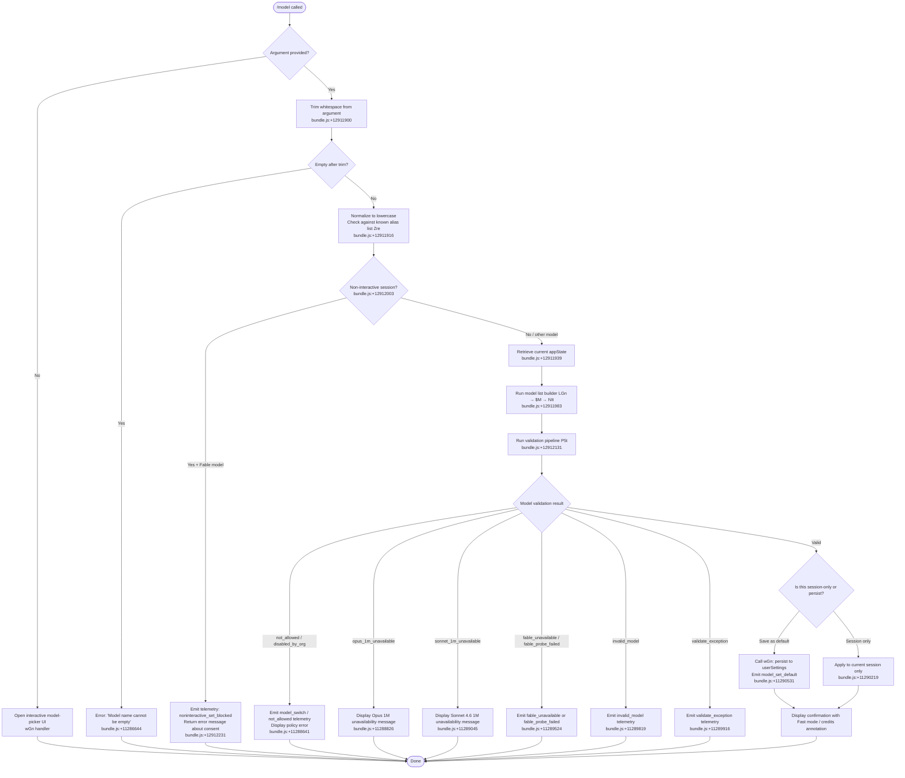

# `/model`

> Analysis basis: CC v2.1.181 bundle.js (AST extraction + Claude interpretation)
> Minimum version: v2.1.181

---

## Overview

The `/model` command allows users to select or change the active AI model used by Claude Code within a session. When invoked with a model name argument, it validates the requested model against the available model list, enforces policy and account-level restrictions (including consent gates for certain models), updates application state, and optionally persists the selection as the default for future sessions. When invoked without arguments, it presents an interactive model-picker UI.

---

## Registration

| Field | Value |
|---|---|
| type | `local` |
| name | `model` |
| description | `Set the AI model for Claude Code` |
| argumentHint | `<model>` |
| supportsNonInteractive | `true` |
| module_id | `Twl` |
| load_inline | `true` |
| loc_byte | `12948050` |
| loc_byte_end | `12948224` |
| loc_line | `8506` |
| arbor_handler.name | `_af` |
| arbor_handler.fqn | `claude-2.1.181::_af` |
| arbor_handler.kind | `AsyncFunction` |
| arbor_handler.resolution_path | `module_id` |
| arbor_handler.n_hits | `0` |

Analysis basis: CC v2.1.181 bundle.js:+12948050

---

## Input Branching

Five or more distinct branches exist (no argument / argument present / Fable consent gate / non-interactive block / policy/account restrictions), so a Mermaid flowchart is required.



---

## Behavioral Spec

### Handler Entry Point (`_af`)

The Arbor-resolved handler is `_af` (AsyncFunction), reached via `module_id` resolution through module `Twl`.

Analysis basis: CC v2.1.181 bundle.js:+12911900

```
async function handleModelCommand(argument, context):
    trimmed = argument.trim()                         // bundle.js:+12911900
    if trimmed is in knownAliasSet:                   // bundle.js:+12911916
        resolve canonical model name from alias

    appState = context.getAppState()                  // bundle.js:+12911939

    if trimmed is empty:
        return openInteractiveModelPicker(appState)   // wGn path

    modelList = buildModelList(appState)              // LGn, bundle.js:+12911983

    if isNonInteractive(context):                    // C9.includes, bundle.js:+12912003
        if model requires Fable consent:
            emit telemetry("noninteractive_set_blocked")  // bundle.js:+12912231
            return error("Fable 5 uses usage credits …")  // bundle.js:+12912280

    emit telemetry("tengu_model_command_inline")     // bundle.js:+12912050

    validationResult = runValidationPipeline(trimmed, modelList, appState)  // P5t, bundle.js:+12912131

    if validationResult is error:
        return displayValidationError(validationResult)

    consentResult = checkFableConsent(trimmed, appState)  // Kce, bundle.js:+12912186
    applyModelToSession(trimmed, context)                 // Ut, bundle.js:+12912206
    persistOrSessionOnly(trimmed, context)                // wGn, bundle.js:+12912431
```

---

### Model List Builder (`LGn` → `$M` → `NIt`)

Builds the set of available models from both the static built-in registry and remote/gateway sources.

Analysis basis: CC v2.1.181 bundle.js:+12911983

```
function buildModelList(appState):
    builtinModels = buildBuiltinModelRegistry()   // NIt → Rp, bundle.js:+2287043
    remoteModels  = loadRemoteModelList()         // $M → lL → QCr/Xcn, bundle.js:+11291323
    return merge(builtinModels, remoteModels)
```

The built-in registry (`gs`) maps short aliases to canonical identifiers. Known aliases found in literals include:

| Alias | Canonical description (from literals) |
|---|---|
| `sonnet` | Sonnet family (bundle.js:+2288773) |
| `haiku` | Haiku family (bundle.js:+2288812) |
| `opus` | Opus family (bundle.js:+2288851) |
| `fable` | Fable family (bundle.js:+2288670) |
| `best` | Best available (bundle.js:+2288885) |
| `opusplan` | "Opus in plan mode, else Sonnet" (bundle.js:+2287003) |
| `sonnet[1m]` | Sonnet with 1M context (bundle.js:+11291059) |
| `sonnet-4-6[1m]` | Sonnet 4.6 with 1M context (bundle.js:+11291085) |

Known fully-qualified canonical model IDs found in literals (bundle.js:+2285205 et seq.):

- `claude-fable-5`, `claude-mythos-5`
- `claude-opus-4-8`, `claude-opus-4-7`, `claude-opus-4-6`, `claude-opus-4-5`, `claude-opus-4-1`, `claude-opus-4-0`
- `claude-sonnet-4-6`, `claude-sonnet-4-5`, `claude-sonnet-4-0`
- `claude-haiku-4-5`
- `claude-3-7-sonnet`, `claude-3-5-sonnet`, `claude-3-5-haiku`, `claude-3-opus`, `claude-3-sonnet`, `claude-3-haiku`

Display names for these models are also embedded as literals (e.g., `"Fable 5"` at bundle.js:+2287691, `"Opus 4"` at bundle.js:+2287973, `"Sonnet 4.6"` at bundle.js:+2288014, etc.).

---

### Remote Model Discovery (`lL` → `QCr` / `Xcn`)

Analysis basis: CC v2.1.181 bundle.js:+11291132

```
function loadRemoteModelList():
    // QCr path: fetch models from API/gateway
    // Xcn path: parse and normalize gateway model list
    //   - strips "claude-" prefix (bundle.js:+2278225)
    //   - lowercases names
    //   - deduplicates via Set (c1.has / c1.add, bundle.js:+2278477)
    //   - marks models with status: "refused" | "inactive" | "active"
    //     (bundle.js:+2277583, +2277621, +2277663)
    //   - provider-tag: "foundry" (bundle.js:+2279950), "mantle" (bundle.js:+2277349),
    //     "gateway" (bundle.js:+2273691)
    //   - policy tier: "tier default is the admin-mapped value …"
    //     (bundle.js:+2280466)
    return normalizedModelList
```

Bootstrap fetch for model discovery skips when `CLAUDE_CODE_ENABLE_GATEWAY_MODEL_DISCOVERY` is not set (literal at bundle.js:+8130481). It also skips for third-party providers (literal at bundle.js:+8130727) and when non-essential traffic is disabled (literal at bundle.js:+8130636).

Bootstrap fetch uses `anthropic-version: 2023-06-01` (bundle.js:+8132985), with timeouts of 1000 ms / 5000 ms (bundle.js:+8133031, +8133045).

---

### Validation Pipeline (`P5t` → sub-validators)

Analysis basis: CC v2.1.181 bundle.js:+12912131

```
function runValidationPipeline(modelName, modelList, appState):
    // R5t: primary name normalizer
    normalized = modelName.trim().toLowerCase()
    if normalized is empty:
        return error("Model name cannot be empty")    // bundle.js:+11286644

    if normalized in policy-denied list (P1e):        // bundle.js:+11286811
        return { status: "not_allowed" }              // bundle.js:+11288641

    if normalized in tier-disabled set (Uol):         // bundle.js:+11286913
        run m6 (full API round-trip validation)

    // _6p: Opus 1M check
    if model is opus-class with [1m] context suffix:
        if account lacks 1M entitlement:
            return { status: "opus_1m_unavailable" }  // bundle.js:+11288788

    // y6p: Sonnet 1M check
    if model matches "sonnet[1m]" or "sonnet-4-6[1m]":
        if account lacks 1M entitlement:
            return { status: "sonnet_1m_unavailable" } // bundle.js:+11289005

    // Rbe: per-model availability check (disabled / absent / gateway)
    if model status is "disabled":
        return { status: "disabled_by_org" }           // bundle.js:+11289273

    // Fol: Fable family check
    if model is fable-class:
        run fable probe (Yit / vlp bootstrap fetch)
        on failure: return { status: "fable_unavailable" | "fable_probe_failed" }

    // g6p / H6p: model validation telemetry
    emit "model_validation" with model name           // bundle.js:+11287008

    // if probe throws:
    on auth error:   return message "Authentication failed …"  // bundle.js:+11287380
    on network error: return message "Network error …"         // bundle.js:+11287482
    on not_found_error: return { status: "invalid_model" }     // bundle.js:+11289819
    on exception:    return { status: "validate_exception" }   // bundle.js:+11289916

    return { status: "ok", resolvedName: normalized }
```

---

### Fable Consent Gate (`Kce` → `xGn`)

Analysis basis: CC v2.1.181 bundle.js:+12912186

```
function checkFableConsent(modelName, appState):
    // xGn checks whether user has previously consented to Fable credit usage
    // Uses YIn → PGr for consent-state lookup
    if model is fable-class AND consent not previously granted:
        if session is non-interactive:
            emit "noninteractive_set_blocked"           // bundle.js:+12912231
            return blocked("Fable 5 uses usage credits …")
        else:
            present interactive consent UI (YIn / PGr)
```

---

### Session Application and Persistence (`wGn`)

Analysis basis: CC v2.1.181 bundle.js:+12912431

```
function applyModelAndPersist(modelName, context, appState):
    // Determine persistence scope
    if user confirmed save-as-default:
        write to userSettings                          // bundle.js:+1329880
        emit "model_set_default"                       // bundle.js:+11290531
        confirmationSuffix = " and saved as your default for new sessions"
                                                       // bundle.js:+11290173
    else:
        confirmationSuffix = " for this session only"  // bundle.js:+11290219

    // Compose display message with feature annotations
    if modelSupportsHaiku (fast mode):
        append " · Fast mode ON"                       // bundle.js:+11290337
    if modelDrawsCredits (e.g., Fable):
        append " · Draws from usage credits"           // bundle.js:+11290388
    if fast mode disabled:
        append " · Fast mode OFF"                      // bundle.js:+11290434

    displayConfirmation(modelName + confirmationSuffix + featureAnnotations)

    // If managed settings are active, show "Managed settings" label
    // bundle.js:+11290740
```

The `O5t` sub-function triggers the full settings-load pipeline (`ao`) whenever the persisted model value needs to be refreshed from disk.

---

### API Round-Trip Validation (`m6` → `Rj`)

When a model name is not recognized in the static registry or requires live validation, the command performs an API round-trip via `m6` and the underlying HTTP client `Rj`.

Analysis basis: CC v2.1.181 bundle.js:+11286958

```
function apiValidateModel(modelName, context):
    // m6 orchestrates:
    //   - Auth header assembly (Rj): x-app, User-Agent, X-Claude-Code-Session-Id,
    //     x-client-app, x-claude-code-agent-id (bundle.js:+3012556 et seq.)
    //   - OAuth token check (Rj): logs "[API:auth] OAuth token check starting/complete"
    //     (bundle.js:+3013139, +3013193)
    //   - Timeout: 600000 ms with retry limit 10 (bundle.js:+3013511, +3013519)
    //   - Hash for idempotency: SHA-256, hex, 12 chars (bundle.js:+3365938, +3365965, +3365980)
    //   - Structured-output flag check (bundle.js:+8775413)
    //   - Sends request; on 401/403 checks OAuth revocation (bundle.js:+3084195, +3084223)
    //   - On cloud gateway session expiry:
    //       "Cloud gateway session expired — run /login to reconnect."
    //       (bundle.js:+3013720)
    emit "tengu_api_success" on completion            // bundle.js:+8776956
    return validatedModelDescriptor
```

---

## State & Side Effects

| Item | Detail |
|---|---|
| Telemetry: `tengu_model_command_inline` | Fired when `/model` is invoked with an inline argument (bundle.js:+12912050) |
| Telemetry: `tengu_api_success` | Fired on successful API round-trip during model validation (bundle.js:+8776956) |
| Telemetry: `tengu_feature_ok` | Fired on successful feature completion (bundle.js:+1019804) |
| Telemetry: `tengu_feature_bad` | Fired on feature failure path (bundle.js:+1019871) |
| Telemetry: `tengu_feature_sad` | Fired on partial-failure / warning path (bundle.js:+1019952) |
| Telemetry: `tengu_prompt_cache_1h_config` | Fired when prompt-cache 1h config is evaluated during validation (bundle.js:+13696975) |
| Telemetry: `tengu_lone_surrogate_sanitized` | Fired when lone Unicode surrogates are sanitized in model names (bundle.js:+8776652) |
| Telemetry: `tengu_saffron_lattice` | Fired in Fable availability sub-check (bundle.js:+5083298) |
| Telemetry: `tengu_config_lock_contention` | Fired when config-file lock is contested during persistence (bundle.js:+13939228) |
| Telemetry: `tengu_config_stale_write` | Fired when a stale config write is detected (bundle.js:+13939364) |
| Telemetry: `tengu_config_auth_loss_prevented` | Fired when a write that would erase auth is blocked (bundle.js:+13939707) |
| Telemetry: `tengu_config_parse_error` | Fired on config JSON parse failure (bundle.js:+13941803) |
| Telemetry: `tengu_config_fallback_write` | Fired when the config write falls back to an alternate path (bundle.js:+13938844) |
| Telemetry: `tengu_bg_retire_pinned_low_mem` | Background worker management side-effect during heavy validation (bundle.js:+17106011) |
| Telemetry: `tengu_bg_prewarm_per_sweep` | Background worker pre-warm sweep (bundle.js:+17106132) |
| appState changes | Active model identifier updated in `appState`; optionally written to `userSettings` (bundle.js:+1329880) |
| Settings persistence | Written to `~/.claude.json` via locked atomic write (`lSt`); protected against auth-loss overwrite (GH #3117, bundle.js:+13939555) |
| Hook registration | `KKe.emit` fires a model-change event to registered listeners (bundle.js:+1330452) |
| Cache invalidation | `fH` clears `kKt` and `Ser` caches on model change (bundle.js:+27824, +27836) |
| Sound | None observed |
| Non-interactive block | When `supportsNonInteractive: true` but model requires Fable consent, execution is blocked with an explicit message (bundle.js:+12912280) |

---

## Version History

| Version | Change |
|---|---|
| v2.1.181 | Initial analysis |

---

## Common Mistakes

1. **Passing an empty string**: `/model ` (whitespace only) triggers the "Model name cannot be empty" error (bundle.js:+11286644). Always supply a non-empty model alias or full identifier.
2. **Using Fable in non-interactive mode**: Running `/model fable` in a non-interactive (`--print` / pipe) session is blocked because Fable requires a one-time consent that must be completed in an interactive session (bundle.js:+12912280).
3. **Expecting instant persistence without confirmation**: The model is only saved as the session default if the user explicitly confirms the "save as default" path; otherwise it applies to the current session only (bundle.js:+11290219).
4. **Assuming all model IDs are available**: Models marked `"inactive"` or `"refused"` in the gateway list, or blocked by organization policy (`"disabled_by_org"`), will be rejected even if the identifier is syntactically correct (bundle.js:+11289273).
5. **Assuming 1M-context variants are universally available**: The `[1m]` suffix variants for Opus and Sonnet 4.6 require explicit account entitlement; absence triggers a specific error with a documentation URL (bundle.js:+11288826, +11289045).
6. **Omitting the `claude-` prefix for full IDs**: The normalizer strips `"claude-"` internally (bundle.js:+2278225), but short aliases (e.g., `opus`, `sonnet`) are preferred to avoid ambiguity across model generations.

---

## Appendix — Identifier Mapping

> For bundle debugging only. Identifiers change across versions.

| Identifier | Role |
|---|---|
| `_af` | Main handler for `/model` command (AsyncFunction) |
| `LGn` | Model list builder orchestrator |
| `$M` | Model list assembler (merges builtin + remote) |
| `NIt` | Builtin model registry builder |
| `Rp` | Raw builtin model record constructor |
| `gs` | Short-alias-to-canonical-ID resolver |
| `lL` | Remote model list loader |
| `QCr` | Gateway model fetcher |
| `Xcn` | Gateway model list normalizer/deduplicator |
| `P5t` | Validation pipeline orchestrator |
| `Tl` | Model descriptor builder / alias expander |
| `R5t` | Primary name normalizer and policy gate |
| `_6p` | Opus 1M context entitlement checker |
| `y6p` | Sonnet 1M context entitlement checker |
| `Rbe` | Per-model availability checker (disabled/absent/gateway) |
| `Fol` | Fable-family classifier |
| `g6p` | Model validation telemetry emitter |
| `H6p` | Model validation display formatter |
| `Yit` | Fable probe bootstrap orchestrator |
| `vlp` | Bootstrap fetch executor |
| `Llp` | Bootstrap fetch response handler |
| `m6` | API round-trip validation orchestrator |
| `Rj` | HTTP client (auth headers, retries, timeouts) |
| `Kce` | Fable consent gate checker |
| `xGn` | Consent-state resolver |
| `YIn` | Consent UI presenter |
| `PGr` | Consent-state persistence |
| `wGn` | Session application and persistence writer |
| `O5t` | Settings reload trigger |
| `ao` | Full settings load pipeline |
| `_Ho` | Interactive model-picker renderer |
| `Tpe` | Model-picker list builder |
| `gR` | Model-picker selection tracker |
| `kK` | Model-picker policy filter |
| `Np` | SHA-256 hash generator for idempotency keys |
| `X_` | Hash utility wrapper |
| `Rht` | Crypto primitive accessor |
| `Fke` | Model feature-annotation composer (Fast mode / credits) |
| `N8` | Credit-usage model flag evaluator |
| `FAe` | Credit-usage availability checker |
| `TTd` | Credit-usage timestamp checker |
| `Y1` | Entitlement tier resolver |
| `Ube` | Enterprise/Pro tier classifier |
| `l4` | Extended-context tier classifier |
| `v_` | Model capability flag accessor |
| `cc` | Display string compositor |
| `xA` | Model display builder (name + annotations) |
| `Ug` | Display alias lookup |
| `Vcn` | Model normalization pipeline |
| `DIt` | Model ID canonicalizer |
| `CR` | Policy blocklist membership checker |
| `O1e` | Tier-override membership checker |
| `ofe` | Availability record constructor |
| `It` | Availability record timestamp writer |
| `Go` | Gateway model descriptor builder |
| `joe` | Gateway model status resolver |
| `Noe` | Gateway inactive model classifier |
| `Foe` | 1M-context suffix appender |
| `Ycn` | Absent model classifier |
| `rYe` | Absent model membership checker |
| `e_` | Model ID normalization (lowercase, replace) |
| `Tf` | Model ID suffix stripper |
| `qu` | Model display-name lookup |
| `dln` | Display-name table |
| `nYe` | Unknown model fallback handler |
| `lSt` | Atomic file writer with fsync |
| `NZo` | Settings file writer |
| `fH` | Cache invalidator (kKt, Ser) |
| `Re` | JSON serializer |
| `Dn` | Logger |
| `qmr` | Settings write timestamp recorder |
| `jOe` | Settings write gate |
| `Sv` | Queue manager |
| `ao` | Settings load/save pipeline |
| `ZA` | Settings loader |
| `OAr` | Settings file reader |
| `Ps` | Process exit handler |
| `cxl` | Session log writer |
| `Sde` | Session descriptor |
| `tj` | Settings change dispatcher |
| `ke` | Feature telemetry emitter |
| `Ho` | Error formatter |
| `rt` | String builder |
| `fVc` | Recent-model ring-buffer manager |
| `Ee` | String coercer |
| `Dv` | Auth provider accessor |
| `ob` | OAuth token manager |
| `jbe` | WIF token exchange handler |
| `hYe` | WIF credentials resolver |
| `ks` | OAuth URL validator |
| `Mv` | Auth type classifier |
| `gk` | Axios error classifier |
| `xe` | Model context builder |
| `Ut` | Model application to appState |
| `Me` | Model result formatter |
| `Yh` | HTTP response parser |
| `vRr` | Header parser |
| `qV` | Feature-flag cache checker |
| `Ns` | Model name sanitizer |
| `un` | Config save orchestrator |
| `n7n` | Config file writer with backup rotation |
| `t7n` | Config fallback writer |
| `w_e` | Config file reader |
| `L8t` | Config write timestamp |
| `f0o` | Config entry serializer |
| `dMe` | Config dirty-state checker |
| `qmt` | Config write queue |
| `KH` | Session key handler |
| `eIa` | Error interceptor |
| `Gy` | Response validator |
| `un` | Config persistence coordinator |
| `Wvr` | Cache-hit rate tracker |
| `jvr` | Cache entry manager |
| `Voe` | Cache store accessor |
| `Mgp` | Model capability finder |
| `Joo` | Request hash generator |
| `oun` | User-agent string builder |
| `IHn` | Request interceptor |
| `d4e` | Response stream processor |
| `wR` | Rate-limit handler |
| `AAn` | Anthropic Claude-3 classifier |
| `Nv` | Model list mapper |
| `Rve` | Response record builder |
| `t3o` | Message content extractor |
| `eU` | Message cloner |
| `S7t` | System message extractor |
| `Qe` | Resolve helper |
| `Uye` | Token usage tracker |
| `Ur` | Session identifier builder |
| `us` | Utility resolve |
| `Wkt` | Worker keepalive manager |
| `_F` | Worker pool manager |
| `lgt` | Worker lifecycle logger |
| `_Ue` | Include-list checker |
| `Iku` | Extended model-ID parser |
| `b2s` | Index-of helper |
| `Cku` | Prefix classifier |
| `T2s` | Starts-with helper |
| `C2s` | Settings entry mapper |
| `Tn` | Model selection event emitter |
| `qtn` | Selection broadcast |
| `w7e` | Policy-entry iterator |
| `Kr` | Policy map accessor |
| `I2s` | Index resolver |
| `pbt` | Model list filter (non-warning) |
| `nns` | Warning model filter |
| `tns` | Model list push helper |
| `fbt` | Model list group builder |
| `KFo` | Group key factory |
| `Aoe` | Group sort comparator |
| `Qtn` | Model entry normalizer |
| `pSe` | Remote-settings accessor |
| `x2` | Model entry constructor |
| `moe` | Model entry metadata accessor |
| `cbt` | Model entry capability accessor |
| `zFo` | Model entry sort key |
| `Hj` | Display-name fallback |
| `yC` | Name compositor |
| `Dbe` | Display badge composer |
| `SUi` | Usage-status interpreter |
| `nee` | Credit-status resolver |
| `afe` | Entitlement API caller |
| `To` | Token/entitlement response parser |
| `tT` | Tier classifier |
| `lfe` | Pro-tier identifier |
| `xr` | HTTP request builder |
| `da` | Entitlement record |
| `$Ae` | Alternative credit-status resolver |
| `Ugt` | Gateway model tag |
| `tacos` | *(not present)* |
| `ta` | Essential-traffic gate |
| `ks` | OAuth endpoint validator |
| `gk` | Axios error handler |
| `Llp` | Bootstrap response cache writer |
| `Clp` | Bootstrap cache reader |