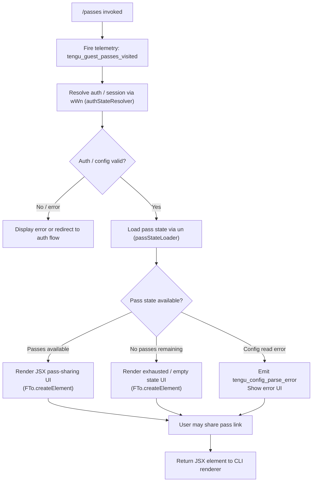

# `/passes`

> Analysis basis: CC v2.1.181 bundle.js (AST extraction + Claude interpretation)
> Minimum version: v2.1.181

---

## Overview

The `/passes` command allows users to share a free week of Claude Code access with friends (guest passes). It renders a JSX-based UI component that presents available pass state and handles the pass-sharing flow. Upon invocation, it fires a telemetry event (`tengu_guest_passes_visited`) and delegates to the underlying pass-management subsystem via JSX element creation.

---

## Registration

| Field | Value |
|---|---|
| type | `local-jsx` |
| name | `passes` |
| description | `Share a free week of Claude Code with friends` |
| loc_byte | `12687303` |
| loc_byte_end | `12687625` |
| loc_line | `8271` |
| isHidden | `null` (not hidden) |
| module_id | `Zbl` |
| load_inline | `true` |
| arbor_handler.name | `tof` |
| arbor_handler.fqn | `claude-2.1.181::tof` |
| arbor_handler.kind | `AsyncFunction` |
| arbor_handler.resolution_path | `module_id` |
| arbor_handler.n_hits | `2` |

Analysis basis: CC v2.1.181 bundle.js:+12687303

---

## Input Branching

The handler `tof` has three meaningful execution paths based on pass state (available, exhausted, or error retrieving state), plus the telemetry side-effect that fires unconditionally. The JSX rendering branch is always taken on success.



---

## Behavioral Spec

### Main Handler — `tof` (AsyncFunction)

Handler resolved via `module_id` → `Zbl` → `tof`. Entry point for `/passes`.

```
async function passesCommandHandler(context):
    // 1. Fire visit telemetry unconditionally
    emit("tengu_guest_passes_visited")

    // 2. Resolve authentication / session state
    authState = await resolveAuthState(context)           // wWn → kc → uy → Bg chain
    if authState is invalid:
        return renderError("auth not available")

    // 3. Load background pass / config state
    passState = await loadPassState(context)              // un → n7n → w_e chain
    if passState load fails:
        emit("tengu_config_parse_error")
        return renderError("could not read pass state")

    // 4. Create and return JSX element for the pass UI
    element = JSXRenderer.createElement(PassesComponent, { passState, authState })
    return element
```

Analysis basis: CC v2.1.181 bundle.js:+12687020 (tof → wWn), +12687026 (tof → un), +12687124 (tof → j), +12687175 (tof → FTo.createElement), +12687126 (tengu_guest_passes_visited)

---

### Auth State Resolution — `authStateResolver` (`wWn`)

Called first by `tof`. Delegates to the credential/config pipeline.

```
function authStateResolver(context):
    // Delegates to config cache layer (kc) which wraps session resolver (uy)
    configHandle = openConfigCache(context)               // kc → uy
    sessionCtx   = configHandle.resolveSession()          // uy → ob / Bg / Ac chain

    // Bg verifies credentials:
    //   - Checks ANTHROPIC_API_KEY env var
    //   - Falls back to apiKeyHelper / user_oauth / firstParty auth
    //   - Requires one of: ANTHROPIC_API_KEY, ANTHROPIC_AUTH_TOKEN,
    //     CLAUDE_CODE_OAUTH_TOKEN, or WIF env vars
    //     (literal: bundle.js:+3047251)

    if no valid credential found:
        raise Error("credential required")

    return sessionContext
```

Analysis basis: CC v2.1.181 bundle.js:+12326471 (wWn → kc), +12326519 (wWn → It), +3046782 (ANTHROPIC_API_KEY literal), +3047251 (credential error literal)

---

### Pass State Loader — `passStateLoader` (`un`)

Reads, validates, and hydrates pass data from the on-disk config.

```
async function passStateLoader(context):
    // Step 1: Determine config directories
    configPath = pathHelper.dirname(context.configRoot)    // n7n → TS.dirname

    // Step 2: Acquire config lock (contention emits telemetry)
    //   Lock contention warning: "Lock acquisition took longer than expected…"
    //   (bundle.js:+13939139)
    //   emits tengu_config_lock_contention on slow lock (bundle.js:+13939228)
    acquireConfigLock(configPath)

    // Step 3: Read raw config file via fileSystemReader
    raw = fileSystemReader.readFileSync(configPath, "utf-8")   // w_e → r.readFileSync
    parsed = jsonSafeParser(raw)                               // Wt → JSON.parse

    // Step 4: Validate pass schema
    //   Known state label strings (from literals):
    //     "unknown", "local", "migrated", "native", "installed",
    //     "disabled", "enabled", "no_permissions", "global",
    //     "not_configured"
    passStatus = classifyPassState(parsed)

    // Step 5: Guard stale-write scenario
    //   If re-read config is missing auth that cache has, refuse to write
    //   (literal: "saveConfigWithLock: re-read config is missing auth…"
    //    bundle.js:+13939555)
    //   emits tengu_config_stale_write (bundle.js:+13939364)
    //   emits tengu_config_auth_loss_prevented (bundle.js:+13939707)

    // Step 6: Return hydrated pass descriptor
    return { passStatus, raw: parsed }
```

Analysis basis: CC v2.1.181 bundle.js:+13935801 (un → n7n), +13935982 (un → w_e), +13941228 (w_e → r.readFileSync), +13941255 ("utf-8" literal), +13936464–13936691 (state label literals)

---

### Config File Read / Backup Layer — `configFileReader` (`w_e`)

Low-level file access utility used by `passStateLoader`.

```
function configFileReader(filePath, options):
    // Guard: config must not be accessed before initialization
    //   Error literal: "Config accessed before allowed." (bundle.js:+13941172)
    if not configInitialized:
        raise Error("Config accessed before allowed.")

    // Read file synchronously with UTF-8 encoding
    content = fs.readFileSync(filePath, "utf-8")
    parsed  = safeJsonParse(content)                      // Wt → JSON.parse

    // Handle ENOENT gracefully; propagate other errors
    if error.code == "ENOENT":                            // literal bundle.js:+13941402
        return defaultConfig()

    // Manage backup rotation: keep up to 5 backups (bundle.js:+13940158)
    //   Backup directory label: "backups" (bundle.js:+13940740)
    //   Backup file prefix: ".backup." (bundle.js:+13940025)
    manageBackups(filePath, maxBackups=5)

    // Emit error telemetry if parse fails
    if parse failed:
        emit("tengu_config_parse_error")                  // bundle.js:+13941803

    return parsed
```

Analysis basis: CC v2.1.181 bundle.js:+13941172 (guard literal), +13941228 (readFileSync), +13941255 ("utf-8"), +13941402 ("ENOENT"), +13940025 (".backup."), +13940158 (5 backups), +13941803 (telemetry)

---

### Pass State Classification — literals observed

During `passStateLoader`, the pass descriptor is classified using a fixed set of string labels found in the implementation:

| Label | Meaning |
|---|---|
| `"unknown"` | State could not be determined |
| `"local"` | Pass is local-only |
| `"migrated"` | Pass was migrated from an older format |
| `"native"` | Native pass (platform-issued) |
| `"installed"` | Pass has been installed/activated |
| `"disabled"` | Feature disabled |
| `"enabled"` | Feature enabled |
| `"no_permissions"` | Insufficient permissions to use passes |
| `"global"` | Global scope |
| `"not_configured"` | Pass feature not yet configured |

Analysis basis: CC v2.1.181 bundle.js:+13936464 through +13936691

---

## State & Side Effects

| Item | Detail |
|---|---|
| Telemetry (primary) | `tengu_guest_passes_visited` — fires unconditionally on `/passes` invocation (bundle.js:+12687126) |
| Telemetry (config) | `tengu_config_parse_error` — fires if config JSON cannot be parsed (bundle.js:+13941803) |
| Telemetry (config) | `tengu_config_lock_contention` — fires if config lock acquisition is slow (bundle.js:+13939228) |
| Telemetry (config) | `tengu_config_stale_write` — fires if a stale write is detected (bundle.js:+13939364) |
| Telemetry (config) | `tengu_config_auth_loss_prevented` — fires when an auth-wiping write is refused (bundle.js:+13939707) |
| Telemetry (config) | `tengu_config_fallback_write` — fires on fallback write path (bundle.js:+13938844) |
| Telemetry (bg) | Various `tengu_bg_*` events emitted by the background-session subsystem reached during depth-2 traversal; not directly triggered by `/passes` under normal conditions |
| Hook registration | `Gi` → `v$o.register` (bundle.js:+65579); lifecycle hook registered during session init |
| appState changes | Pass state descriptor is read but not mutated; rendering is read-only |
| File system | Config file read via `readFileSync`; backup rotation performed (up to 5 backups in `backups/` directory) |
| JSX rendering | `FTo.createElement` called to produce the passes UI component (bundle.js:+12687175) |
| Sound | None observed in depth-2 traversal |

---

## Version History

| Version | Change |
|---|---|
| v2.1.181 | Initial analysis |

---

## Common Mistakes

1. **Invoking `/passes` without authentication**: The handler validates credentials early (`authStateResolver`). If no valid API key or OAuth token is present, the command will fail with a credential-required error rather than showing the passes UI.
2. **Expecting immediate network activity**: The `/passes` command reads pass state from the local config file first; it does not make a live API call on every invocation. Stale local state may be shown if the config has not been refreshed.
3. **Assuming pass state is writable from this command**: `/passes` is a read-and-display command. The stale-write guard actively prevents overwriting auth credentials, so pass state mutations initiated elsewhere may be rejected if the cache and disk diverge.
4. **Confusing `local-jsx` type with prompt commands**: This command renders a JSX component, not a plain text prompt. It will not send a text message to the agent model; it renders interactive UI directly in the CLI.
5. **Expecting no side effects**: Even a casual visit fires `tengu_guest_passes_visited` telemetry, which is logged unconditionally before any other branching logic.

---

## Appendix — Identifier Mapping

> For bundle debugging only. Identifiers change across versions.

| Identifier | Role |
|---|---|
| `tof` | Main handler (AsyncFunction) for `/passes` — entry point resolved via module `Zbl` |
| `It` | Session/config initializer called from handler and other subsystems |
| `jt` | Path/config utility (used across multiple subsystems) |
| `p0o` | Config pre-flight or permission check utility |
| `w_e` | Config file reader with backup rotation and parse-error telemetry |
| `r` | Node.js `fs`-compatible sync file system wrapper |
| `Ps` | Process exit / CLI error handler (`cli_error`, `process.exit`) |
| `Wt` | Safe JSON parser (`JSON.parse` wrapper) |
| `x9` | String prefix classifier (uses `startsWith` / `slice`) |
| `e` | Random/timer utility (uses `Math.random`, `setTimeout`) |
| `ln` | Logging utility |
| `uUl` | Directory scanner / backup lister (uses `readdirStringSync`, `TS.basename`) |
| `h0o` | Backup path builder (`TS.join`, `sr`) |
| `a` | Session/config map accessor (`s.get`, `s.values`, `kOo`) |
| `l` | Feature-flag or config-value resolver (`cxl`) |
| `I` | HTTP/API request builder (headers, JSON body, `Buffer.byteLength`) |
| `xhc` | Request formatter (`vO`, `Hor`, `L$o`) |
| `Re` | JSON serializer (`JSON.stringify` wrapper) |
| `qc` | String sanitizer / redactor (`[REDACTED]` literal, `e.replace`) |
| `nqe` | Response normalizer (`QBo`) |
| `Rhc` | HTTP send/receive pipeline (`kWe`, `Fde`, `Buffer.byteLength`, `Gi`) |
| `j` | General-purpose utility / JSX helper |
| `f` | Background-session dispatch manager |
| `n` | Session map / name normalizer |
| `M` | Background task scheduler (`Date.now`, `qOi`, `tae`) |
| `Fn` | Timeout/abort wrapper (`setTimeout`, `clearTimeout`, `s.unref`) |
| `Me` | Feature-ok reporter (`tengu_feature_ok`) |
| `xe` | Feature-bad reporter (`tengu_feature_bad`) |
| `aKn` | Low-memory check helper (`tengu_bg_low_mem_mb`, macOS detection) |
| `H$e` | Async file cleaner (`cT.lstat`, `cT.rm`, `cT.readFile`) |
| `ke` | Error log flusher (`jJ.logError`, `QVe.push`) |
| `F` | Session retire/settle manager (`Clt`, `YW`) |
| `ut` | Spare-session enable/claim logic (`tengu_bg_spare_enable`, `Vj.has/get`) |
| `x1o` | Daemon socket connector (`Dq.claim`, `jQn.connect`, `i.on/once/write`) |
| `O1o` | Daemon session lifecycle manager (`Ig.rm/unlink`, `Yt`, `NHe`, `Mpt`) |
| `s` | Session set wrapper (delegates to `O1o`) |
| `p` | Forced-shutdown handler (`BT`, `process.exit`, `u.abort`) |
| `$e` | Cleanup / dispose helper (`Rht`) |
| `$` | Disposable resource (`$.dispose`) |
| `Byf` | File-watch session manager (`Zzn.watchFile/unwatchFile`, `Gi`) |
| `kq` | Key/queue helper used by file watcher |
| `Gi` | Hook registrar (`v$o.register`) |
| `wWn` | Auth-state resolver — first callee of `tof` |
| `kc` | Config cache opener (wraps `uy`) |
| `uy` | Session resolver orchestrator (`ob`, `Bg`, `Ac`, `ZXe`) |
| `Lp` | Bare-mode initializer (`--bare` literal, `rt`, `Ezt`) |
| `ob` | OAuth/profile initializer (`yln`, `ZXe`, `cj`, `Nei`, `Uei`) |
| `Ac` | First-party auth resolver (`xr`, `firstParty` literal) |
| `zT` | Token/context helper |
| `Bg` | Credential validator (checks API key env vars, raises on missing creds) |
| `tLt` | Config pre-loader (`ZXe`) |
| `ZXe` | Config reader bootstrapper (`rt`, `Xre`) |
| `un` | Pass state loader — second callee of `tof` |
| `n7n` | Config-with-lock reader (mkdir, statSync, copyFileSync, unlinkSync) |
| `gBs` | Config object builder (`kvr`, `Object.assign`) |
| `kvr` | Config struct factory (`hBs`) |
| `qmt` | Config merge/defaults utility |
| `T` | Scroll/layout math helper (`Math.max`, `Math.floor`, `x.preventDefault`) |
| `x` | Supervisor/repaint connector (`mlc`, `Xp`, `d.write`) |
| `E` | Clamp utility (`Math.max`, `Math.min`) |
| `g` | IPC buffer/socket manager (`Buffer.concat`, `h.indexOf`) |
| `h` | Socket timeout wrapper (`r.setTimeout`) |
| `m` | Session kill manager (`n.values`, `x.kill`) |
| `sf` | Stream-end helper (`e.end`, `Re`) |
| `y9f` | Daemon protocol message dispatcher (large switch over ping/nudge/yield/lease/attach/resize etc.) |
| `Ee` | String coercion utility (`String`) |
| `lSt` | Atomic file write helper (temp file, `fchmodSync`, `fsyncSync`, `renameSync`) |
| `Jp` | Realpath resolver (`_d`, `XA`, `lor`, `e.realpathSync`) |
| `u` | Abort-controller container (`xe`, `Me`, `zU`, `cG`) |
| `Dn` | Log-line emitter (`ln`) |
| `i` | IPC stream instance (`n.close`, `r.close`) |
| `cKe` | Extended attribute error filter (`EINVAL`, `ENOTSUP`, `EPERM`, `ENOSYS`) |
| `dMe` | Pass descriptor or diff helper |
| `f0o` | Config entry iterator (`Object.entries`) |
| `L8t` | Timestamp recorder (`Date.now`) |
| `t7n` | Symlink-aware config writer (`lSt`, `Re`, `nI`) |

---

Note: index built via Arbor fallback; some signals (telemetry, literals) may be missing — see arbor-fallback.js.