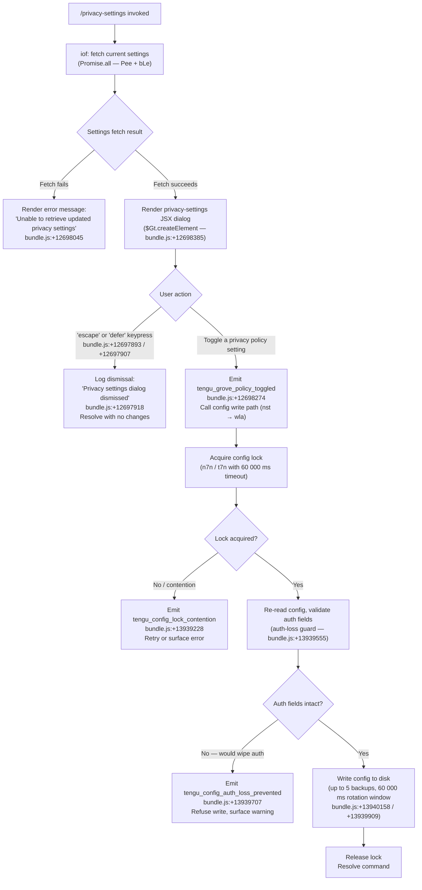

# `/privacy-settings`

> Analysis basis: CC v2.1.181 bundle.js (AST extraction + Claude interpretation)
> Minimum version: v2.1.181

---

## Overview

The `/privacy-settings` command opens an interactive JSX dialog that allows users to view and update their current privacy configuration. It is a `local-jsx` command, meaning it renders a terminal UI component rather than dispatching a prompt to the language model. The handler (`iof`) fetches current settings in parallel, presents them via a React-style element tree, and persists any changes back to the global config with full locking semantics.

---

## Registration

| Field | Value |
|---|---|
| type | `local-jsx` |
| name | `privacy-settings` |
| description | `View and update your privacy settings` |
| module_id | `oTl` |
| load_inline | `true` |
| loc_byte | `12698738` |
| loc_byte_end | `12698921` |
| loc_line | `8281` |
| arbor_handler.name | `iof` |
| arbor_handler.fqn | `claude-2.1.181::iof` |
| arbor_handler.kind | `AsyncFunction` |
| arbor_handler.resolution_path | `module_id` |
| arbor_handler.n_hits | `0` |

Analysis basis: CC v2.1.181 bundle.js:+12698738

---

## Input Branching

The command has three distinct runtime paths depending on the user's interaction with the privacy-settings dialog.



---

## Behavioral Spec

### 1. Handler Entry — `privacySettingsHandler` (`iof`)

The async handler is resolved via `module_id` → `oTl` → `iof`.

```
async function privacySettingsHandler(args, appContext):
    // Parallel fetch of current privacy data and feature flags
    [settingsData, featureFlags] = await Promise.all([
        fetchPrivacySettings(),      // Pee — bundle.js:+12697782
        loadFeatureFlags()           // bLe — bundle.js:+12697788
    ])

    if fetchFailed:
        return renderError("Unable to retrieve updated privacy settings")
        // literal: bundle.js:+12698045

    // Render interactive dialog
    element = createElement(PrivacySettingsDialog, {
        settings:     settingsData,
        featureFlags: featureFlags,
        onKeypress:   handleKeypress,
        onToggle:     handlePolicyToggle,
    })
    // bundle.js:+12698385

    return element
```

Analysis basis: CC v2.1.181 bundle.js:+12697729

---

### 2. Keypress / Dismissal Handling

```
function handleKeypress(key):
    if key == "escape" or key == "defer":
        // bundle.js:+12697893, +12697907
        log("Privacy settings dialog dismissed")
        // literal: bundle.js:+12697918
        resolveCommand(noChanges)
    else:
        passToDialog(key)
```

Analysis basis: CC v2.1.181 bundle.js:+12697893

---

### 3. Policy Toggle — `configCacheAndWriteLayer` (`nst`)

When the user toggles a policy setting the handler calls `nst`, which acts as a caching/write coordinator.

```
async function configCacheAndWriteLayer(newSettings):
    // Grove cache logic:
    // Path A — no cache: fetch in background, log
    //   literal: "Grove: No cache, fetching config in background..."
    //   bundle.js:+7197418
    // Path B — stale cache: return stale, refresh background
    //   literal: "Grove: Cache stale, returning cached data and refreshing..."
    //   bundle.js:+7197538
    // Path C — fresh cache: return immediately
    //   literal: "Grove: Using fresh cached config"
    //   bundle.js:+7197644

    resolvedSettings = groveCache(newSettings)
    await writeGlobalConfig(resolvedSettings)   // wla path
    emitTelemetry("tengu_grove_policy_toggled") // bundle.js:+12698274
```

Analysis basis: CC v2.1.181 bundle.js:+7197303

---

### 4. Global Config Write — `globalConfigWriter` (`wla` → `un` → `n7n` / `t7n`)

```
async function globalConfigWriter(updatedConfig):
    // Record timestamp: Date.now()   bundle.js:+7197842
    await acquireFileLock()           // n7n — bundle.js:+13935801
    // Lock timeout: 60 000 ms        bundle.js:+13939909
    // If contention: tengu_config_lock_contention bundle.js:+13939228

    diskConfig = readConfigFromDisk() // r.readFileSync bundle.js:+13941228
    // Validate that auth fields present in cache are not absent on disk:
    if cacheHasAuth and diskConfigMissingAuth:
        emitTelemetry("tengu_config_auth_loss_prevented")
        // bundle.js:+13939707
        // literal: "saveConfigWithLock: re-read config is missing auth..."
        //          bundle.js:+13939555
        abort write and return

    // Rotate backups (max 5 kept, window 60 000 ms)
    // bundle.js:+13940158, +13939909
    rotateBackups(diskConfig, maxBackups=5)

    writeToDisk(updatedConfig)        // s.mkdirSync + s.copyFileSync
    releaseLock()

    // Emit stale-write telemetry if timestamps diverged
    emitTelemetry("tengu_config_stale_write") // bundle.js:+13939364 (conditional)
```

Analysis basis: CC v2.1.181 bundle.js:+7197498, +13935801

---

### 5. Config File Access Guard — `configFileReader` (`w_e`)

```
function configFileReader(path, options):
    if configNotYetAllowed:
        throw Error("Config accessed before allowed.")
        // literal: bundle.js:+13941172
    
    raw = fs.readFileSync(path, "utf-8")   // bundle.js:+13941228, +13941255
    parsed = JSON.parse(raw)

    if parseError:
        emitTelemetry("tengu_config_parse_error") // bundle.js:+13941803
    
    if error.code == "ENOENT":             // bundle.js:+13941402
        return defaultConfig
    
    if backupDirMissing:
        fs.mkdirSync(backupDir)            // bundle.js:+13941982
    
    rotateOldBackups(maxAge=60000)         // bundle.js:+13939909
    return parsed
```

Analysis basis: CC v2.1.181 bundle.js:+13941166

---

### 6. Config Watch / Hot-Reload — `configWatcher` (`Byf`)

```
function configWatcher(configPath, onChange):
    Zzn.watchFile(configPath, handler)    // bundle.js:+13937323
    // On file change:
    //   re-read config
    //   call onChange(newConfig)
    //   emit tengu_daemon_config_reload (via downstream iof → un → Byf chain)

    return function unwatch():
        Zzn.unwatchFile(configPath)       // bundle.js:+13937656
```

Analysis basis: CC v2.1.181 bundle.js:+13937318

---

### 7. Privacy Setting Value Constants

The following enumerated string values are used for privacy-related configuration fields observed in the call graph:

| Constant | Meaning | loc_byte |
|---|---|---|
| `"enabled"` | Feature explicitly on | +13936637 |
| `"disabled"` | Feature explicitly off | +13936611 |
| `"no_permissions"` | Missing OS/system permission | +13936651 |
| `"not_configured"` | No user choice recorded | +13936672 |
| `"global"` | Global scope setting | +13936691 |
| `"local"` | Project-local scope | +13936560 |
| `"native"` | Native credential store | +13936592 |
| `"installed"` | Extension installed | +13936578 |
| `"migrated"` | Setting migrated from old format | +13936547 |
| `"unknown"` | State cannot be determined | +13936485 |

Analysis basis: CC v2.1.181 bundle.js:+13936485–+13936691

---

## State & Side Effects

| Item | Detail |
|---|---|
| Telemetry — `tengu_grove_policy_toggled` | Fired on every privacy policy toggle (bundle.js:+12698274) |
| Telemetry — `tengu_config_parse_error` | Fired when config JSON cannot be parsed (bundle.js:+13941803) |
| Telemetry — `tengu_config_lock_contention` | Fired when lock acquisition is slow / contested (bundle.js:+13939228) |
| Telemetry — `tengu_config_stale_write` | Fired when write timestamp diverges from expected (bundle.js:+13939364) |
| Telemetry — `tengu_config_auth_loss_prevented` | Fired when a write would have wiped auth credentials (bundle.js:+13939707) |
| Telemetry — `tengu_config_fallback_write` | Fired when the primary write path fails and a fallback is used (bundle.js:+13938844) |
| Telemetry — `tengu_daemon_config_reload` | Fired when the daemon detects a config file change via `watchFile` (bundle.js:+17117192) |
| Config file writes | Updates `~/.claude.json` (global) under a file lock with up to 5 rotating backups |
| File watch | `Zzn.watchFile` registered on the config path; cleaned up on command exit via `Zzn.unwatchFile` |
| appState changes | Privacy policy flags updated in the Grove cache layer (`nst`) after a successful write |
| Hook registration | `v$o.register` called from the `Gi` utility (bundle.js:+65579) — registers an atexit/cleanup hook |
| Sound | None observed |

---

## Version History

| Version | Change |
|---|---|
| v2.1.181 | Initial analysis |

---

## Common Mistakes

1. **Pressing `Escape` or selecting "defer" does not save changes.** Both dismiss the dialog immediately with `"Privacy settings dialog dismissed"` logged and no write performed.
2. **Running two Claude Code instances simultaneously** can trigger `tengu_config_lock_contention`. The lock has a 60 000 ms timeout; if the second instance holds the lock longer than expected, the write will be refused and a warning is surfaced.
3. **Manually editing `~/.claude.json`** while the dialog is open may cause the auth-loss guard to fire (`tengu_config_auth_loss_prevented`), silently aborting the update to protect credentials. Close the dialog, let the watcher reload, then retry.
4. **Assuming the command sends a prompt to the model.** `/privacy-settings` is `type: local-jsx`; it renders a terminal UI component and never dispatches a model turn.
5. **Expecting immediate disk persistence.** The Grove cache layer (`nst`) may return a stale in-memory value while asynchronously refreshing from disk; observable settings may lag a single event loop tick behind the actual file.

---

## Appendix — Identifier Mapping

> For bundle debugging only. Identifiers change across versions.

| Identifier | Role |
|---|---|
| `iof` | Main async handler — `privacySettingsHandler` (AsyncFunction, arbor_handler) |
| `nst` | Config cache and write coordinator — Grove cache layer |
| `TUe` | Settings fetch / data-load orchestrator |
| `da` | Settings data assembler |
| `DTr` | Settings field transformer A |
| `kTr` | Settings field transformer B |
| `uy` | Privacy settings state reader (reads `ANTHROPIC_API_KEY`, `apiKeyHelper`, etc.) |
| `To` | Sub-settings resolver |
| `U2` | Array-inclusion checker utility |
| `zei` | Settings serializer / emitter |
| `kc` | Config access coordinator |
| `It` | Config file initializer / loader |
| `jt` | Config path resolver |
| `p0o` | Config path builder helper |
| `w_e` | Config file reader with access guard |
| `Byf` | Config file watcher (watchFile / unwatchFile) |
| `I` | Logger / debug emitter |
| `xhc` | Log transport handler |
| `L$o` | Log formatter |
| `Re` | JSON serializer wrapper |
| `qc` | String sanitizer / redactor |
| `c3o` | Character map builder |
| `nqe` | stdout/stderr write dispatcher |
| `QBo` | Raw stream writer |
| `Rhc` | Append-log writer with rotation |
| `kWe` | Debounced batch writer |
| `Fde` | File rotation executor |
| `bre` | Log directory ensurer |
| `f3o` | Log file path builder |
| `Sor` | Log file rename / unlink rotator |
| `Mhc` | Append-file writer with mkdir |
| `Gi` | Cleanup hook registrar (`v$o.register`) |
| `wla` | Global config async writer |
| `un` | Config save orchestrator with lock |
| `n7n` | Config lock-acquire + locked-write handler |
| `dMe` | Config migration helper |
| `f0o` | Config entry iterator |
| `L8t` | Timestamp recorder for config writes |
| `qmt` | Config quota / limit checker |
| `t7n` | Fallback config writer (save_global path) |
| `a` | MCP server state manager |
| `DBe` | MCP server connection orchestrator |
| `z8` | MCP server registry builder |
| `Hrt` | MCP server capability resolver |
| `x7` | MCP server config expander |
| `h5` | MCP server SDK entry builder |
| `Zwn` | MCP server status color formatter |
| `Art` | MCP server approval-state aggregator |
| `Pk` | Config persistence caller |
| `M_` | Config write + file-watch bridge |
| `LVr` | Config persistence helper |
| `qn` | Queue/task runner |
| `UOt` | MCP server filter utility |
| `Jta` | MCP connection attempt executor |
| `Mzr` | MCP connection context builder |
| `wwe` | MCP config hash generator (sha256) |
| `KAn` | MCP tool-set key builder |
| `zAn` | MCP tool-set hash wrapper |
| `AI` | Hash digest producer |
| `qAn` | MCP server unique-ID resolver |
| `uc` | UUID / ID generator |
| `sn` | MCP debug log emitter |
| `yLn` | MCP server lifecycle manager |
| `t$d` | MCP transport factory |
| `R9` | Model / auth context reader |
| `Aae` | claude.ai connector prompt builder |
| `hae` | OAuth helper |
| `Iae` | MCP OAuth flow handler |
| `Trt` | Pending-connection map manager |
| `p` | Process/abort controller |
| `SLn` | MCP reconnect context builder |
| `R7` | MCP reconnect executor |
| `M9` | Model selector |
| `d` | Daemon MCP supervisor |
| `Du` | MCP error log emitter |
| `Ee` | String coercion wrapper |
| `n$d` | MCP race-timeout builder |
| `e$d` | MCP SSH/remote transport selector |
| `ELn` | MCP tool-result processor |
| `brt` | Pending-auth cache reader |
| `Irt` | Pending-connection cache reader |
| `ana` | MCP connection attempt with retry |
| `oi` | Async-local-storage context reader |
| `wxn` | MCP needs-auth cache writer |
| `WVr` | MCP auth-result validator |
| `m` | Worker process collection |
| `x` | Worker process controller |
| `gP` | MCP skills telemetry emitter |
| `ut` | Worker pool task dispatcher |
| `wVr` | Config-reload-aware connect helper |
| `w` | Background worker lifecycle manager |
| `Az` | Background worker state tracker |
| `L` | Background worker sweep executor |
| `v` | Background worker metrics |
| `uQl` | Away-summary selector |
| `nna` | Promise utility (AggregateError path) |
| `y8` | Promise combinator (all/race/any) |
| `Qrt` | Retry-delay parser (parseInt, 10-base) |
| `Lxn` | Retry-delay parser (parseInt, 20-base) |
| `bQn` | MCP update applicator |
| `kBe` | MCP config hash checker |
| `kL` | MCP server cleanup coordinator |
| `Xrt` | MCP server config hash verifier |
| `l` | Session/conversation context holder |
| `cxl` | Daemon status file writer |
| `hQ` | Config feature-flag reader |
| `sjt` | Daemon status path builder |
| `kOo` | MCP server slot reconciler |
| `sLn` | MCP server capability filter |
| `Fn` | Timeout-with-abort utility |
| `c` | Background-session token |
| `Qe` | Dialog/settings component renderer |
| `Rht` | Root UI component |

Note: index built via Arbor fallback; some signals (telemetry, literals) may be missing — see arbor-fallback.js.