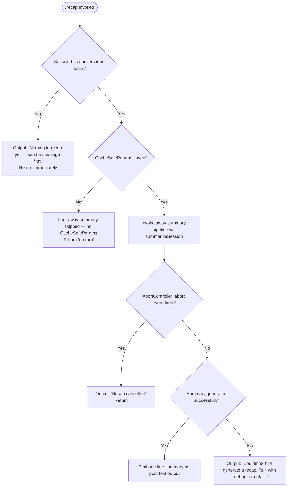

# `/recap`

> Analysis basis: CC v2.1.181 bundle.js (AST extraction + Claude interpretation)
> Minimum version: v2.1.181

---

## Overview

The `/recap` command triggers an on-demand, one-line summary of the current Claude Code session. It operates by invoking the "away summary" subsystem (`spf`) — the same background summarization pathway used for scheduled session recaps — but fires it immediately rather than waiting for the normal trigger condition. The resulting summary is delivered as a post-text output to the terminal.

---

## Registration

| Field | Value |
|---|---|
| type | `local` |
| name | `recap` |
| description | `Generate a one-line session recap now` |
| loc_byte | `13210195` |
| loc_byte_end | `13210411` |
| loc_line | `8651` |
| supportsNonInteractive | `false` |
| thinClientDispatch | `post-text` |
| load_inline | `true` |
| load_ident | `spf` |
| arbor_handler.name | `spf` |
| arbor_handler.fqn | `claude-2.1.181::spf` |
| arbor_handler.kind | `AsyncFunction` |
| arbor_handler.resolution_path | `load_ident` |
| arbor_handler.n_hits | `0` |

The handler was inlined via a `load: () => Promise.resolve({ call: spf })` shape; no separate `module_id` is present. Arbor resolved the handler by following the inline `Promise.resolve({call: spf})` ident (resolution_path: `load_ident`).

Analysis basis: CC v2.1.181 bundle.js:+13210195

---

## Input Branching

The command has three distinct terminal outcomes — no prior conversation activity, user cancels during generation, and a normal generation (success or error) — so a Mermaid flowchart is used.



Analysis basis: CC v2.1.181 bundle.js:+13209803, +13209945, +13210037, +13210095

---

## Behavioral Spec

### Top-level handler: `spf` (recapHandler)

The Arbor-resolved handler is `spf` (FQN: `claude-2.1.181::spf`, AsyncFunction).

```
async function recapHandler(context):
    // Guard: nothing to recap if there are no conversation messages yet
    if conversationIsEmpty(context):
        outputText("Nothing to recap yet — send a message first.")
        return

    // Guard: the summarization subsystem requires CacheSafeParams to be present
    params = loadCacheSafeParams(context)
    if params is null:
        log("[awaySummary] no CacheSafeParams saved, skipping")
        return "no-turn"

    // Set up abort controller so user can cancel during generation
    abortController = new AbortController()
    context.addEventListener("abort", () => abortController.abort())

    // Delegate to the shared away-summary pipeline
    result = await runAwaySummaryPipeline(context, params, abortController.signal)

    if abortController.signal.aborted:
        outputText("Recap cancelled.")
        return

    if result.status == "ok":
        emitPostText(result.summary)
    elif result.status == "api-error" or result.status == "other":
        outputText("Couldn't generate a recap. Run with --debug for details.")
```

Analysis basis: CC v2.1.181 bundle.js:+13209803, +13209945, +13210037, +13210095, +7041695, +7041753, +7041809

### Away-summary pipeline: `_1t` (awaySummaryOrchestrator)

`_1t` is called by `spf` and orchestrates the actual summarization. It:

1. Checks for saved `CacheSafeParams`; if absent, logs a skip message and returns `"no-turn"`.
2. Attaches an abort listener; if the abort event fires, it calls `abortController.abort()` on an inner controller.
3. Calls `Vx` (summarizeViaQuery) which drives the main query pipeline.
4. Collects the result and delegates flat-mapping of output messages via `eia` (flatMapOutputMessages).

```
async function awaySummaryOrchestrator(context, signal):
    cacheSafeParams = loadCacheSafeParams(context)   // calls _1t → I (loadParams)
    if not cacheSafeParams:
        log("[awaySummary] no CacheSafeParams saved, skipping")
        return "no-turn"

    innerAbort = new AbortController()
    signal.addEventListener("abort", () => innerAbort.abort())

    queryResult = await summarizeViaQuery(context, cacheSafeParams, innerAbort.signal)

    flatMessages = flatMapOutputMessages(queryResult)
    return flatMessages
```

Analysis basis: CC v2.1.181 bundle.js:+7041674, +7041693, +7041790, +7041821, +7041868, +7041888, +7042230, +7042319

### Model name resolution: `Ns` → `xK` / `gs` (resolveModelName)

`Ns` resolves the model tier name to use for the summary query. It calls `xK` (parseModelTier) which reads one of the string constants `"fable"`, `"opusplan"`, `"sonnet"`, `"haiku"`, `"opus"`, or `"best"`, and then delegates to `gs` (normalizeModelName) to trim, lowercase, and further normalize the string (via helpers `v_`, `nc`, `CR`, `mQ`, `TK`, `cL`, `sfe`, `hj`, `NE`, `w2s`, `Td`, `rfe`, `sYe`, `wku`, `RU`).

```
function resolveModelName(rawModelString):
    tier = parseModelTier(rawModelString)   // one of: fable, opusplan, sonnet, haiku, opus, best
    normalized = normalizeModelName(tier)   // trim + lowercase + alias expansion
    return normalized
```

Analysis basis: CC v2.1.181 bundle.js:+2273205, +2273241, +2288593, +2288604, +2288670, +2288732, +2288773, +2288812, +2288851, +2288885

### Session context construction: `I` (buildQueryContext)

`I` constructs the query context object used by the summarization call. It invokes `xhc` (resolveConversationHistory) and `qc` (sanitizePromptPath) to assemble the conversation history, and `nqe` / `QBo` (writeStreamOutput) to handle output streaming. It also calls `Rhc` (buildTranscriptWriter) which manages log file rotation and appending via `Mhc` (appendToLogFile), `Sor` (rotateLogs), and `f3o` (buildLogPath).

```
function buildQueryContext(options):
    history = resolveConversationHistory(options)    // xhc
    sanitizedPath = sanitizePromptPath(options)      // qc
    writer = buildTranscriptWriter(options)          // Rhc
    return { history, sanitizedPath, writer, ...options }
```

Analysis basis: CC v2.1.181 bundle.js:+212659, +212677, +212781, +212800, +212806, +212820

### Core query pipeline: `Vx` (summarizeViaQuery)

`Vx` drives the actual API call. It:

1. Records `Date.now()` as the start timestamp.
2. Calls `B$n` (buildSummaryRequest) to assemble the request payload, including `getAppState`, `setAppState`, and random UUID generation.
3. Applies `gF` (sanitizeFileIdentifier) using random bytes (63 chars, 8 bytes, hex encoding).
4. Calls `uce` (filterAndBuildTools) → `w6e` (filterToolsByPrefix, filtering by `"ant"` prefix).
5. Dispatches to `h6` which runs `t2p` (the main query execution loop) and `j4n` (sessionStateCleanup).
6. Applies `Lge` (mergeActiveSessions) to the result.
7. Uses `h2p` (postProcessSummary) and `Ur` (formatSummaryOutput) which classifies output as `"nonconforming"` or valid.
8. Checks `l4e` / `oMa` (isToolUseSummaryType) against the `"tool_use_summary"` message type.
9. Emits `N0` (emitRecapLine) and pushes results via `f.push`.

```
async function summarizeViaQuery(context, params, signal):
    startTime = Date.now()
    request = buildSummaryRequest(context, params)     // B$n
    toolList = filterAndBuildTools(context)            // uce → w6e (prefix "ant")
    
    queryResult = await runQueryLoop(request, toolList, signal)  // h6 → t2p + j4n

    mergedSessions = mergeActiveSessions(queryResult)  // Lge
    postProcessed = postProcessSummary(mergedSessions) // h2p
    formatted = formatSummaryOutput(postProcessed)     // Ur (may tag as "nonconforming")
    
    return formatted
```

Analysis basis: CC v2.1.181 bundle.js:+10825573, +10825940, +10825965, +10825983, +10826007, +10826027, +10826097, +10826158, +10826374, +10826405, +10826495, +10826524, +10826545, +10826650, +10826662, +10826695, +10827006, +10827228, +10827322

### Away-summary constraint: tools disabled

The summarization sub-call is explicitly constrained to operate without tool use. The literal string `"Away summary cannot use tools"` is emitted if a tool-bearing context is detected, and the query is redirected.

Analysis basis: CC v2.1.181 bundle.js:+7042001

### Summary result classification: `eia` (flatMapOutputMessages)

`eia` flat-maps over the raw query output array (`e.flatMap`) to classify results into `"ok"`, `"api-error"`, or `"other"` categories, which drives the terminal output selection in the handler.

```
function flatMapOutputMessages(rawResults):
    return rawResults.flatMap(msg =>
        classifyMessage(msg)  // → "ok" | "api-error" | "other" | "away_summary"
    )
```

Analysis basis: CC v2.1.181 bundle.js:+7042319, +7042529, +7042054, +7042069, +7042302, +7042363

---

## State & Side Effects

| Item | Detail |
|---|---|
| Telemetry | `tengu_fork_agent_query` (bundle.js:+10827673), `tengu_forked_agent_default_turns_exceeded` (bundle.js:+10827230), plus all standard query-pipeline events (`tengu_query_error`, `tengu_auto_compact_succeeded`, `tengu_refusal_fallback_triggered`, `tengu_model_fallback_triggered`, etc.) via the shared `t2p` query loop |
| Hook registration | `Gi` → `v$o.register` is called as part of the query context setup (bundle.js:+65579); away-summary hooks are active during the sub-call |
| appState changes | `B$n` reads and writes appState via `e.getAppState` / `e.setAppState` (bundle.js:+10822539, +10823703); session state is mutated then restored |
| Log file I/O | `Mhc` appends to transcript log (`tU.appendFile`), `Sor` rotates logs (rename + unlink), and `f3o` constructs the log path (`bundle.js:+211901, +211960, +211832`) |
| Output dispatch | `thinClientDispatch: "post-text"` — the summary line is delivered as a post-text event, not as an inline assistant message |
| Non-interactive | `supportsNonInteractive: false` — `/recap` cannot be used in `--print` / non-interactive mode |
| Sound | <!-- TODO: not found in depth-2 traversal; needs --depth 4 --> |

---

## Version History

| Version | Change |
|---|---|
| v2.1.181 | Initial analysis |

---

## Common Mistakes

1. **Running `/recap` before any conversation turn**: The handler immediately returns with `"Nothing to recap yet — send a message first."` (bundle.js:+13209945). At least one exchanged message is required.
2. **Using `/recap` in non-interactive / `--print` mode**: `supportsNonInteractive: false` means the command is not registered in headless contexts and will not be available.
3. **Expecting tool results in the recap**: The away-summary pipeline explicitly blocks tool use (`"Away summary cannot use tools"`, bundle.js:+7042001). The recap is text-only and cannot invoke tools during generation.
4. **Cancelling during generation and expecting a partial recap**: Once the abort signal fires, the output is unconditionally replaced with `"Recap cancelled."` (bundle.js:+13210037) — no partial content is preserved.
5. **Assuming `/recap` uses a different model than the session default**: Model resolution flows through the shared `Ns` / `gs` tier resolver and respects the session's configured model tier (`"fable"`, `"sonnet"`, `"haiku"`, `"opus"`, `"best"`, `"opusplan"`).

---

## Appendix — Identifier Mapping

> For bundle debugging only. Identifiers change across versions.

| Identifier | Role |
|---|---|
| `spf` | Top-level recap handler (AsyncFunction); Arbor-resolved entry point |
| `_1t` | Away-summary orchestrator; checks CacheSafeParams, wires abort, calls `Vx` |
| `Wae` | Summary dispatch wrapper called by `_1t` |
| `Ns` | Model name resolver; dispatches to `xK` and `gs` |
| `xK` | Model tier parser; reads tier string constants |
| `gs` | Model name normalizer; trim + lowercase + alias expansion |
| `Ug` | Alternate model-name lookup path calling `gs` and `lL` |
| `I` | Query context builder; assembles history, path, writer |
| `xhc` | Conversation history resolver |
| `L$o` | Sub-history loader calling `Mfc` and `Rfc` |
| `Re` | JSON serializer for context (`JSON.stringify`) |
| `qc` | Prompt path sanitizer; uses `c3o`, `e.replace`, `r.at`, `n.slice` |
| `c3o` | Character map array mapper (`Chc.map`) |
| `nqe` | Stream output writer dispatcher |
| `QBo` | Stream write executor (`e.write`) |
| `Rhc` | Transcript/log writer builder |
| `kWe` | Batched write scheduler (uses `clearTimeout`, `setTimeout`, `setImmediate`) |
| `Fde` | Log file flusher; calls `oqe`, `Ude.join`, `sr`, `Lt` |
| `jt` | File system path helper used in transcript writing |
| `bre` | EISDIR error handler (`ln`) |
| `f3o` | Log file path constructor (`Ude.join`, `Lt`) |
| `Sor` | Log rotation handler (stat → rename → unlink) |
| `Mhc` | Log file append handler (`tU.mkdir`, `tU.appendFile`) |
| `Gi` | Hook registration dispatcher (`v$o.register`) |
| `Vx` | Main away-summary query driver |
| `B$n` | Summary request builder; reads/writes appState, generates UUID |
| `K1` | Session initializer helper (`Yl`, `pUi`) |
| `OAe` | State load/dump helper (`NB`, `t.load`, `e.dump`) |
| `Uve` | Session setup utility |
| `OJi` | Session options helper |
| `M5n` | Request assembly sub-step |
| `gF` | File/session identifier sanitizer (random bytes, hex) |
| `G$n` | Query parameter finalizer |
| `uce` | Tool filter and builder; calls `Au`, `w6e` |
| `Au` | Hook registration wrapper calling `Gi` |
| `w6e` | Tool list filterer by prefix `"ant"` |
| `h6` | Query loop launcher; calls `t2p` and `j4n` |
| `t2p` | Main query execution loop (large; handles streaming, tool use, compaction, fallbacks) |
| `j4n` | Session state cleanup after query (`w6.get`, `w6.delete`, `Tmo.delete`, `K9t.delete`, `Imo.delete`) |
| `xe` | Turn state helper (reads `"turn"`) |
| `Me` | Message state helper |
| `N0` | Recap line emitter |
| `l4e` | Tool-use summary type checker (`wgp.has`) |
| `Xte` | Extended output type checker |
| `O5n` | Output shape validator |
| `oMa` | Tool-use summary matcher (calls `l4e`) |
| `f` | Sub-agent / daemon session manager (large; handles spawn, claim, kill, attach) |
| `j` | Generic utility / helper (used across many call sites) |
| `M` | Worker/session lifecycle manager |
| `Fn` | Async retry / timeout wrapper |
| `aKn` | macOS memory reporter (`Yt`, `ut`) |
| `H$e` | Cache file reader/cleaner (`cT.lstat`, `cT.rm`, `cT.readFile`) |
| `ke` | Error logger and reporter |
| `F` | Task settlement checker (`Clt`, `YW`) |
| `ut` | Token/cache key lookup (`txt`, `nxt`, `p4`, `zTe.has`) |
| `x1o` | Daemon socket connection handler |
| `O1o` | Daemon job lifecycle manager (spawn, attach, kill, cleanup) |
| `s` | Alias for `O1o` in some call sites |
| `p` | Forced shutdown handler (`process.exit`, `u.abort`) |
| `ln` | EISDIR / directory error handler |
| `$e` | Bootstrap / runtime initializer (`Rht`) |
| `$` | App-state accessor object |
| `Lge` | Active session merger/deduplicator |
| `LT` | Session list helper |
| `Ghp` | Session finder (`e.find`) |
| `h2p` | Post-summary processor |
| `Ur` | Summary output formatter; classifies as `"nonconforming"` or valid |
| `Pn` | Process/UUID manager (`cO.randomUUID`) |
| `g` | Buffer/stream processor |
| `h` | Connection timeout handler |
| `m` | Worker kill helper |
| `sf` | Stream end/reply helper |
| `y9f` | PTY/daemon message protocol handler (large; handles ping, nudge, yield, dispatch, attach, etc.) |
| `Ee` | String coercer |
| `eia` | Output message flat-mapper; classifies as `"ok"`, `"api-error"`, `"other"`, `"away_summary"` |

---

Note: index built via Arbor fallback; some signals (telemetry, literals) may be missing — see arbor-fallback.js.