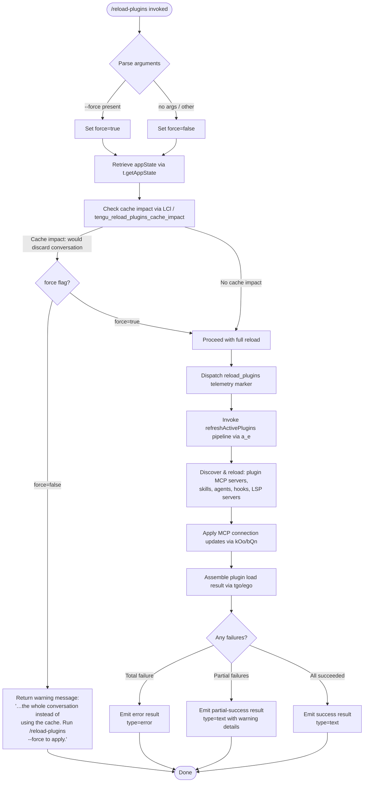

# `/reload-plugins`

> Analysis basis: CC v2.1.181 bundle.js (AST extraction + Claude interpretation)
> Minimum version: v2.1.181

---

## Overview

`/reload-plugins` activates pending plugin changes (MCP servers, skills, agents, hooks, and LSP servers) within the current interactive session by re-running the full plugin discovery and load pipeline. An optional `--force` flag bypasses cache-preservation logic, causing the entire conversation context to be rebuilt with freshly loaded plugin definitions. Without `--force`, the command attempts a hot-reload that preserves the existing conversation cache where possible.

---

## Registration

| Field | Value |
|---|---|
| type | `local` |
| name | `reload-plugins` |
| description | `Activate pending plugin changes in the current session` |
| argumentHint | `[--force]` |
| supportsNonInteractive | `false` |
| thinClientDispatch | `control-request` |
| module_id | `kCl` |
| load_inline | `true` |
| loc_byte | `12835610` |
| loc_byte_end | `12835854` |
| loc_line | `8484` |
| arbor_handler.name | `$sf` |
| arbor_handler.fqn | `claude-2.1.181::$sf` |
| arbor_handler.kind | `AsyncFunction` |
| arbor_handler.resolution_path | `module_id` |
| arbor_handler.n_hits | `0` |

Analysis basis: CC v2.1.181 bundle.js:+12835610

---

## Input Branching

The handler has 4+ distinct logical branches based on the `--force` flag, cache-impact check, argument parsing, and plugin type filtering. A Mermaid flowchart is used.



Analysis basis: CC v2.1.181 bundle.js:+12834308, +12834694, +12834730, +12834808, +12834914

---

## Behavioral Spec

### 1. Entry Point: Handler `$sf` (Arbor: `$sf`, AsyncFunction)

The main handler is resolved via `module_id` → `kCl` → handler identifier `$sf`.

```
async function reloadPluginsHandler(context, rawArgs):
    args = rawArgs.trim()                          // via e.trim at +12834694
    forceFlag = args.includes("--force")           // literal "--force" at +12834730
    forceParsed = forceFlag ? "force" : undefined  // literal "force" at +12834745

    appState = context.getAppState()               // +12834808

    cacheImpact = checkCacheImpact(appState)       // LCl at +12834762
    if cacheImpact.wouldDiscardConversation AND NOT forceFlag:
        return {
            type: "text",
            content: "…the whole conversation instead of using the cache. Run /reload-plugins --force to apply."
            // literal fragment at +12834193
        }

    emit telemetry("tengu_reload_plugins_cache_impact", ...)  // xCl at +12834914

    pluginScope = inferPluginScope(appState)       // Bsf at +12834968
    results = await refreshActivePlugins(appState, { force: forceFlag })  // a_e at +12835040

    outcome = buildOutputMessage(results)          // Die at +12835115, BHe at +12835072
    return outcome
```

Analysis basis: CC v2.1.181 bundle.js:+12834308

---

### 2. Cache Impact Check: `LCl` (cacheImpactChecker)

Determines whether proceeding would discard the conversation cache. Used as the guard before a destructive reload.

```
function checkCacheImpact(appState):
    hasPendingCacheEntries = appState.has(...)     // t.has at +12833376
    hasActiveConversation  = appState.has(...)     // n.has at +12833415

    if hasPendingCacheEntries AND hasActiveConversation:
        return { wouldDiscardConversation: true }

    pluginInfo = lookupInstalledPlugins(appState)  // iP at +12833459
    scopeInfo  = resolveScopeTokens(appState)      // t7 at +12833465
    capabilities = gatherCapabilities(appState)    // CE at +12833486

    return { wouldDiscardConversation: false, pluginInfo, scopeInfo, capabilities }
```

Analysis basis: CC v2.1.181 bundle.js:+12833326, +12833376, +12833415

---

### 3. Plugin Refresh Pipeline: `a_e` (refreshActivePlugins)

Orchestrates the complete plugin reload sequence. Clears caches, rediscovers all plugin sources, rebuilds connection state, and emits a final load event.

```
async function refreshActivePlugins(appState, options):
    log("refreshActivePlugins: clearing all plugin caches")  // literal at +12831279

    // Clear all plugin caches
    clearPluginIndexCache(appState)                // Fh at +12831337
    clearSkillIndexCache()                         // via O5 → e.clearSkillIndexCache at +13412115
    clearO4tCache()                                // t5 → O4t.clear at +10955940

    // Re-discover plugins from all config sources
    [localPlugins, projectPlugins, userPlugins] = await Promise.all([
        discoverLocalPlugins(appState),            // _ee at +12831583
        readLspConfig(appState),                   // RBe at +12831745
        resolveMarketplace(appState)               // Rxn at +12831873
    ])

    // Filter by type: plugin, skill, agent
    // literals: "plugin" +12834424, "skill" +12834455, "agent" +12834483
    pluginEntries = filterByScope(localPlugins, "plugin")   // Usf at +12831956
    skillEntries  = filterByScope(localPlugins, "skill")    // Fsf at +12831989

    // Validate hook registrations
    hookResults = validateHooks(pluginEntries)              // VAe at +12832140

    // Apply MCP connection updates
    mcpResults = await updateMcpConnections(appState)       // a at +12831881 → kOo/bQn

    // Emit assembled load result event
    LF.emit("pluginLoadResult", assembleResult(...))        // LF.emit at +12832386

    return {
        plugins: pluginEntries,
        skills:  skillEntries,
        mcp:     mcpResults,
        hooks:   hookResults,
        errors:  collectErrors(...)
    }
```

Analysis basis: CC v2.1.181 bundle.js:+12831277, +12831279, +12831337, +12831386, +12831583, +12831745, +12831873, +12831956, +12831989, +12832160, +12832386

---

### 4. MCP Server Load: `tgo` (assemblePluginLoadResult) and `ego` (enumerateMcpServers)

`tgo` assembles the final load result for all plugin MCP servers; `ego` enumerates per-server connection status.

```
async function assemblePluginLoadResult(context):
    // Collect all configured MCP servers
    servers = enumerateMcpServers(context)         // ego at +11098072

    results = await Promise.all(servers.map(connectAndLoad))
    // Telemetry markers for load stages:
    //   "plugin_load_all"              at +11099385
    //   "plugin_load_total_failure"    at +11099403
    //   "plugin_load_partial_failures" at +11099472

    if results.every(r => r.status == "fulfilled"):
        return { status: "ok", servers: results }
    else if results.every(r => r.status == "rejected"):
        return { type: "error", message: joinErrors(results) }
    else:
        partialFailures = results.filter(r => r.status == "rejected")
        return { type: "text", warnings: formatPartialFailures(partialFailures) }

    // Guard: if originalCwd changed mid-scan, skip side-effects
    // literal: "assemblePluginLoadResult: originalCwd changed mid-scan; skipping side-effects (stale early-kick)"
    //   at +11099538
```

Per-server failure codes observed in literals (bundle.js:+11079070 – +11080550):

| Code | Meaning |
|---|---|
| `marketplace-blocked-by-policy` | Policy prevents marketplace access |
| `marketplace-not-found` | Marketplace entry absent |
| `marketplace-load-failed` | Load attempt failed |
| `cache-miss` | Plugin not in local cache |
| `plugin-not-found` | Plugin binary absent |
| `ineffective-disable` | Disable directive had no effect |
| `generic-error` | Unclassified error |

Analysis basis: CC v2.1.181 bundle.js:+11098064, +11098072, +11099385, +11099403, +11099472, +11099538

---

### 5. MCP Connection Update: `kOo` (updateMcpConnections) and `bQn` (applyConnectionResult)

After plugin discovery, active MCP client connections are reconciled against the new configuration.

```
async function updateMcpConnections(appState):
    currentSlots = Object.entries(appState.mcpSlots)   // kOo → Object.entries at +16748422
    clients = appState.getClients()                     // t.getClients at +16748469

    for each [slotKey, slotConfig] in currentSlots:
        if slotConfig changed or new:
            result = await connectServer(slotConfig)    // DBe at +16748816
            await applyConnectionResult(result, slotKey)  // bQn at +16748825

function applyConnectionResult(result, slotKey):
    if slotConfig changed mid-flight:
        log("applyConnectionResult: disposing orphaned connect (slot config changed mid-flight)")
        // literal at +16748006
        result.cleanup()
    else if slot removed mid-flight:
        log("applyConnectionResult: disposing orphaned connect (slot removed mid-flight)")
        // literal at +16748091
        result.cleanup()
    else:
        appState.applyMcpUpdate(slotKey, result)        // e.applyMcpUpdate at +16747872
```

Analysis basis: CC v2.1.181 bundle.js:+16747584, +16747872, +16748006, +16748091, +16748422, +16748469, +16748816, +16748825

---

### 6. `BHe` (buildPluginOutputMessage) — Output Assembly

Constructs the final text or error message returned to the user from the reload outcome.

```
function buildPluginOutputMessage(reloadResults):
    pluginLoadResults = reloadResults.plugins
    mcpResults        = reloadResults.mcp
    errorList         = []

    for each result in pluginLoadResults:
        if result.status == "not-found":           // literal at +11975126
            errorList.push(formatNotFound(result))
        else:
            applyToSession(result)                 // OM, Lm, v$e, fs, R6, Uk, n5t pipeline

    // Classify plugins for output label: "plugin MCP server" / "hook" / "plugin LSP server"
    // literals at +12834515, +12835289, +12835348

    if errorList.length > 0:
        return { type: "error", content: errorList.join(" · ") }
        // separator literal " · " at +12834542
    else:
        return { type: "text", content: successSummary }
```

Analysis basis: CC v2.1.181 bundle.js:+12835072, +11975126, +12834515, +12834542, +12834597, +12834672

---

### 7. `n5t` (pluginSessionIntegration) — Plugin State Integration

`n5t` is the large integration function that wires loaded plugin artefacts (hooks, LSP configs, MCP clients, skill indices) into the live session state. It is called within `BHe`'s sub-pipeline after successful load.

```
function integratePluginIntoSession(pluginRecord, sessionState):
    // Validate scope and policy
    if blocked by policy:                           // literal "blocked-by-policy" at +11041505
        return earlyExit("blocked-by-policy")

    // Register hooks
    hookDefs = resolveHooks(pluginRecord)           // ao at +11043978
    sessionState.hooks.set(pluginRecord.id, hookDefs)

    // Register LSP configurations
    lspConfigs = resolveLspConfigs(pluginRecord)    // PM at +11041948
    sessionState.lsp.set(pluginRecord.id, lspConfigs)

    // Register MCP sub-servers
    mcpDefs = resolveMcpSubservers(pluginRecord)    // n5t sub-calls
    sessionState.mcp.set(pluginRecord.id, mcpDefs)

    // Validate semver dependencies
    semverOk = checkDependencyVersions(pluginRecord)  // Jkt at +11045144, bbn at +11042530
    if NOT semverOk:
        recordWarning("dependency-version-unsatisfied")

    // Track installed plugins for telemetry
    emitTelemetry("plugin_installed", {              // literal at +11049594
        "plugin.name":    pluginRecord.name,
        "plugin.version": pluginRecord.version,
        ...
    })
```

Analysis basis: CC v2.1.181 bundle.js:+11041470, +11041505, +11041948, +11042530, +11043978, +11045144, +11049594

---

## State & Side Effects

| Item | Detail |
|---|---|
| Telemetry — `tengu_reload_plugins_cache_impact` | Fired at +12833602 whenever the command evaluates whether a reload would discard the conversation cache |
| Telemetry — `tengu_plugin_state_file_error` | Fired at +11022694 when the plugin state file cannot be read/parsed |
| Telemetry — `tengu_mcp_auth_config_clear` | Fired at +11943365 when MCP OAuth auth config is cleared as part of MCP reconnection |
| Telemetry — `tengu_mcp_list_changed` | Fired at +16863982 when the MCP tool list changes post-reload |
| Telemetry — `tengu_feature_ok` / `tengu_feature_bad` / `tengu_feature_sad` | General feature success/failure markers at +1019804, +1019871, +1019952 |
| Cache cleared | `clearSkillIndexCache` (`e.clearSkillIndexCache` at +13412115), `O4t.clear` at +10955940, all plugin index caches |
| appState changes | MCP slot connections reconciled via `applyMcpUpdate`; hook registrations updated; LSP config entries updated; plugin records written to session state maps |
| Event emitted | `LF.emit("pluginLoadResult", …)` at +12832386 — notifies listeners of the reload outcome |
| MCP connections | Existing connections may be closed and re-established; orphaned mid-flight connections are cleaned up (literals at +16748006, +16748091) |
| Hook registration | Hooks are re-registered via `ao` / `lSt` pipeline; safe-mode skips hook registration (`"Safe mode: skipping plugin hook registration"` at +5203459) |
| Sound | None observed |
| Non-interactive | `supportsNonInteractive: false` — command is interactive-only |
| Thin-client dispatch | `thinClientDispatch: "control-request"` — in thin-client mode the command is forwarded as a control request |

---

## Version History

| Version | Change |
|---|---|
| v2.1.181 | Initial analysis |

---

## Common Mistakes

1. **Forgetting `--force` when changing plugin definitions mid-conversation.** Without `--force`, if the reload would discard the conversation cache, the command aborts with a warning and no reload occurs. Use `/reload-plugins --force` to accept the cache cost.

2. **Expecting non-interactive use.** `supportsNonInteractive` is `false`; running `/reload-plugins` in a non-interactive pipeline (e.g., `--print` mode) is not supported and will fail or be silently ignored.

3. **Assuming partial success means all plugins loaded.** The command can return a `text`-type result even when some MCP servers or skills failed to load. Always inspect the output for per-plugin failure codes such as `cache-miss`, `plugin-not-found`, or `marketplace-blocked-by-policy`.

4. **Treating the command as a no-op for MCP OAuth state.** A reload triggers `tengu_mcp_auth_config_clear`, meaning existing OAuth tokens for MCP servers may be cleared and re-acquired, potentially prompting re-authentication.

5. **Running during an active agent turn.** The plugin integration pipeline (`n5t`) mutates live session state maps. Invoking the command while an agent response is in progress may produce inconsistent plugin state until the turn completes.

---

## Appendix — Identifier Mapping

> For bundle debugging only. Identifiers change across versions.

| Identifier | Role |
|---|---|
| `$sf` | Main handler for `/reload-plugins` (AsyncFunction, Arbor-resolved) |
| `$S` | Sub-call from handler — initial state accessor/setup |
| `fd` | Called from `$S` and `$sf` — likely a shared utility (dispatch or format) |
| `jRe` | Callee of `fd` — low-level helper |
| `fX` | Called from `$sf` — argument pre-processing |
| `bn` | Callee of `fX` and `c` — base utility (string/buffer) |
| `LCl` | Cache impact checker — determines if reload would discard conversation |
| `RVr` | MCP server registry reload orchestrator |
| `OVr` | MCP server enumeration dispatcher |
| `tgo` | Assemble plugin load result |
| `ego` | Enumerate MCP servers and per-server connection status |
| `x7` | MCP config loader (reads `.mcp.json`, project/user/local settings) |
| `yc` | Settings path resolver |
| `Ab` | MCP config file parser (project scope) |
| `yee` | MCP config file parser (user/local scope) |
| `VE` | Policy settings checker |
| `YAn` | HTTP/dynamic MCP server validator |
| `zwn` | MCP binary / `.mcpb` / `.dxt` loader |
| `iP` | Plugin scope token lookup |
| `dMt` | Plugin scope string parser (handles `auto:` prefix) |
| `HUe` | HIPAA / compliance mode gate |
| `A6r` | Plugin concurrency parser (parseInt, Math.max/min) |
| `t7` | Case-insensitive plugin type normaliser |
| `JEd` | Plugin type validation helper |
| `CE` | Capabilities/output-tokens aggregator |
| `xCl` | Cache-impact telemetry emitter (`tengu_reload_plugins_cache_impact`) |
| `Bsf` | Plugin scope splitter (`n.split`) |
| `a_e` | `refreshActivePlugins` — core reload pipeline |
| `Xel` | Plugin index cache clear helper |
| `Fh` | Plugin index cache invalidator (calls `R3p`, `mM`, `IHe`, `n6r`, `t5`) |
| `R3p` | Plugin root resolver |
| `ow` | Plugin root path utility |
| `mM` | Skill index clear orchestrator (calls `O5`) |
| `O5` | `clearSkillIndexCache` wrapper |
| `t5` | `O4t.clear` — clears the O4t plugin store |
| `_ee` | Local plugin discovery from disk |
| `EVr` | Plugin manifest reader (`readFile`, JSON parse) |
| `YXi` | Plugin directory scanner / path resolver |
| `MPt` | Plugin package loader (reads `manifest.json`, computes hash) |
| `RBe` | LSP config reader (`.lsp.json`) |
| `v9d` | LSP config entry resolver / path validator |
| `C9d` | LSP path relative-path validator |
| `cxl` | Daemon status writer |
| `hQ` | Daemon status helper |
| `oi` | AsyncLocalStorage store accessor |
| `sjt` | Daemon status filename builder (`daemon.status.json`) |
| `Re` | JSON serialiser wrapper |
| `Rxn` | LSP extension-conflict deduplicator |
| `a` | MCP connection update coordinator (calls `DBe`, `bQn`, `kOo`) |
| `DBe` | Per-slot MCP server connector |
| `bQn` | `applyConnectionResult` — applies MCP connection outcomes to state |
| `kOo` | `updateMcpConnections` — iterates slots and triggers reconnects |
| `Usf` | Plugin entry filter (by type/scope, "plugin") |
| `Fsf` | Plugin entry filter (by type/scope, "skill") |
| `wCl` | Plugin-type whitelist checker |
| `VAe` | Hook registration validator |
| `Ul` | Hook argument parser / safe-mode gate |
| `BHe` | `buildPluginOutputMessage` — final output assembler |
| `OM` | Known-marketplaces.json loader |
| `Lm` | Marketplace JSON reader |
| `k6n` | Marketplace file path builder |
| `v$e` | Plugin tool-type validator (Array.isArray, Tn) |
| `Tn` | Schema type checker |
| `lM` | Managed-scope error thrower |
| `fs` | Plugin includes/split path helper |
| `PI` | Plugin URL/source validator (git, npm, file, directory) |
| `foa` | URL scheme extractor |
| `e1t` | Plugin source type dispatcher |
| `n0n` | Source normaliser |
| `moa` | GitHub URL parser |
| `Aoa` | Arbitrary URL validator |
| `y4d` | npm source handler |
| `eW` | Schema type normaliser |
| `goa` | Source pattern dispatcher |
| `poa` | Generic URL pattern matcher |
| `R6` | Plugin marketplace.json loader |
| `V4t` | `.claude-plugin` directory resolver |
| `Fho` | `marketplace.json` Zod parser |
| `Uk` | Plugin known-marketplace cross-reference |
| `Bho` | Plugin local-file reader |
| `CKp` | Plugin policy checker (`r.has`) |
| `n5t` | `pluginSessionIntegration` — wires plugin artefacts into session |
| `DL` | Schema type helper (Tn) |
| `B6n` | Plugin tool filter (fs, PI) |
| `JSt` | Path prefix checker (`./`) |
| `xe` | `tengu_feature_ok` emitter |
| `Me` | `tengu_feature_bad` emitter |
| `zU` | Notification queue pusher |
| `cG` | Shutdown race handler (Promise.race, process.exit) |
| `Mt` | Context-store accessor (cen → len.getStore) |
| `cen` | AsyncLocalStorage get-store wrapper |
| `PM` | Plugin file loader (Gho, ZSt, QSt, jho) |
| `Gho` | Plugin file sync reader |
| `jho` | Plugin manifest entry enumerator |
| `X4t` | Plugin session writer |
| `H` | Plugin session map (Map.set) |
| `t4e` | Session metadata updater |
| `XR` | Plugin extension validator (fs, $x) |
| `bbn` | Semver validity checker (Wz.valid, Wz.coerce, Wz.satisfies) |
| `oht` | MCP update applicator helper |
| `X0i` | Dependency graph walker |
| `gR` | Feature-flag set tracker |
| `g` | Buffer/stream processor (IPC message framer) |
| `y9f` | Background worker IPC message handler |
| `x` | Supervisor file-watcher |
| `mlc` | Real-path/stat utility |
| `F9f` | File-not-found handler |
| `d` | Worker output writer |
| `M` | Plugin record store map |
| `mtt` | Plugin JSON file reader |
| `oMt` | Plugin data directory writer |
| `qOi` | Plugin file filter |
| `Lec` | Prompt column formatter |
| `tae` | Plugin record updater |
| `R` | Periodic ticker / interval manager |
| `otl` | Plugin priority queue |
| `O` | Rate-limit event emitter |
| `lj` | Rate-limit token classifier |
| `Lt` | Logger / telemetry sink |
| `ao` | Hook loader and registrar |
| `ZA` | Hook schema validator |
| `OAr` | Hook path resolver |
| `Sv` | Hook runner wrapper |
| `qmr` | Hook run-time tracker |
| `jOe` | Hook instance factory |
| `lSt` | Atomic file writer (fsync, rename) |
| `fH` | Cache-set clearer (kKt.clear, Ser.clear) |
| `NZo` | Git-ignore / settings tracker |
| `O9` | Settings path joiner |
| `Ut` | `tengu_feature_sad` emitter |
| `tj` | Settings writer |
| `G6n` | Plugin root boundary validator |
| `W` | Scheduled task scheduler |
| `sMt` | Scheduled task backoff calculator |
| `hIn` | Scheduled task next-time calculator |
| `wec` | Boolean coercer for task enabled flag |
| `B` | Output write-throttle timer |
| `_re` | Tombstone existence checker |
| `se` | Session lifecycle manager (main session loop) |
| `KWn` | Session health checker |
| `Vv` | Terminal multiplexer detector |
| `K` | Keyboard backspace handler |
| `_ge` | List-live-sessions utility |
| `jle` | Session resume/load orchestrator |
| `Qe` | React render helper |
| `Mr` | Module initialiser |
| `Le` | Message pruner (tombstone removal) |
| `We` | Tombstone splice helper |
| `Zc` | UUID generator wrapper |
| `Wb` | App-state initialiser |
| `Py` | Permission checker |
| `KWt` | Project rename helper |
| `ZY` | Session archive helper |
| `Q$n` | Conversation metadata helper |
| `I6e` | Session archive utility |
| `j_e` | Model setting resolver |
| `xkn` | IXr integration (external extension) |
| `qje` | Fork/resume session helper |
| `Vje` | Fork neutralise helper |
| `Ue` | Timeout race helper |
| `Ke` | Notification gate |
| `RK` | Request-key / date-now tracker |
| `kue` | Session archive writer |
| `QWt` | Session initialiser (chdir, env setup) |
| `xue` | Session metadata re-appender |
| `w` | Blur/focus idle timer |
| `ue` | MCP client manager (GPt, kL, aLn, yrt, Ert) |
| `GPt` | MCP OAuth revoke handler |
| `kL` | MCP client cleanup |
| `aLn` | Active MCP server filter |
| `yrt` | Enabled MCP server filter |
| `Ert` | MCP server error reporter |
| `Ce` | MCP error accumulator |
| `pe` | Plugin priority queue accessor |
| `ht` | History slice writer |
| `Jkt` | Semver range validator |
| `d9r` | Dependency ID validator |
| `U6n` | Dependency resolver (Kho) |
| `Kho` | Plugin dependency graph entry |
| `Z4t` | Plugin cache accessor |
| `$6n` | Plugin version resolution (git ls-remote, semver maxSatisfying) |
| `o9p` | Plugin version cache |
| `Un` | Plugin version runner (Vr, Mt) |
| `b8` | Version coercion (Number, Number.isInteger, String) |
| `F6n` | Plugin cache key formatter |
| `t5t` | Plugin install/update executor |
| `ept` | Plugin npm install runner |
| `M6n` | Plugin install state tracker |
| `atl` | Plugin install lock |
| `Fce` | Plugin content hasher (SHA-256, ttl.createHash) |
| `DN` | Plugin queue entry (q6n, ew) |
| `O6n` | Plugin directory lister |
| `eq` | Plugin format helper |
| `vke` | Plugin version conflict detector |
| `I6n` | Plugin removal helper (Qk.rm) |
| `Who` | Plugin record updater (PM, J4t) |
| `F` | Permission rule evaluator (allow/deny/classify/ask) |
| `Clt` | Permission rule builder |
| `YW` | Tool permission orchestrator |
| `V` | Session write relay |
| `Q` | Output stream |
| `b9f` | Output escape processor |
| `Y` | Voice/recording state manager |
| `_` | MCP tool set manager (oht, OF, HP, B7, $B) |
| `Ye` | Tool list assembler |
| `FY` | Built-in tool concatenator |
| `FGe` | Tool list sorter / coordinator-mode filter |
| `IO` | Tool I/O logger |
| `Ate` | Tool capability mapper |
| `it` | Tool stream reader |
| `Vc` | Tool validation checker |
| `szt` | Tool schema sanitiser |
| `Ett` | Tool call deduplicator (_1i cache) |
| `He` | Path-variable interpolator (`${CLAUDE_PROJECT_DIR}` etc.) |
| `ae` | MCP tools/list change handler |
| `Qie` | Plugin data path resolver |
| `lhe` | Plugin path placeholder replacer |
| `ge` | Tool list concat helper |
| `sq` | Telemetry sink (Lt, Au) |
| `ee` | MCP update applicator |
| `s9p` | Plugin scope resolver sub-set |
| `he` | MCP session manager (connects/sends MCP messages) |
| `Rn` | MCP server readiness tracker |
| `Vt` | MCP message stream reader |
| `xo` | MCP session cleanup handler |
| `fna` | MCP server connection executor |
| `ps` | MCP permission helper |
| `Cr` | MCP capability reporter |
| `M9` | MCP tool name prefixer |
| `D2i` | VS Code extension gate |
| `tCn` | Tool call recorder |
| `d7` | Debug/trace logger |
| `RHl` | Request log serialiser |
| `Wsc` | CCD session / product-feedback gate |
| `we` | Conversation history fetcher |
| `W6l` | History event builder |
| `V6l` | History fetch descending |
| `B6l` | History source mismatch handler |
| `K6l` | History fetch ascending |
| `X` | MCP state synchroniser |
| `kBe` | MCP state writer (wwe) |
| `te` | Tool activation map |
| `aM` | Plugin scope lowercaser |
| `kA` | Plugin key formatter |
| `Pu` | OTEL metrics emitter |
| `b$e` | OTEL resource attribute builder |
| `oe` | Session context accessor |
| `Die` | Plugin label formatter (type=`plugin MCP server`, `hook`, `plugin LSP server`) |

---

Note: index built via Arbor fallback; some signals (telemetry, literals) may be missing — see arbor-fallback.js.