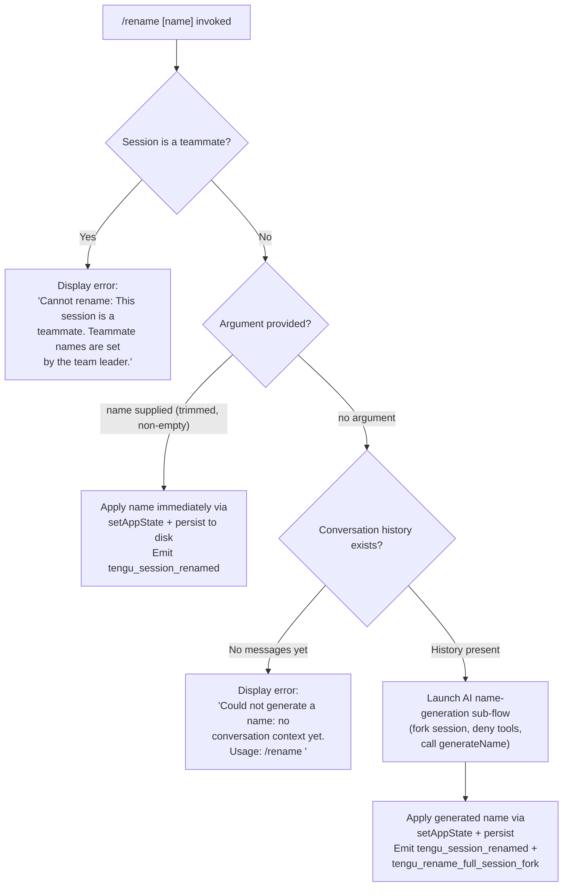

# `/rename`

> Analysis basis: CC v2.1.181 bundle.js (AST extraction + Claude interpretation)
> Minimum version: v2.1.181

---

## Overview

`/rename` changes the display name of the current conversation session. When called with an explicit name argument, the name is applied immediately; when called without an argument and conversation history exists, the command invokes an AI-assisted name-generation sub-flow to produce a title automatically. The command is also registered under the alias `/name`.

---

## Registration

| Field | Value |
|---|---|
| type | `local-jsx` |
| name | `rename` |
| description | `Rename the current conversation` |
| aliases | `["name"]` |
| argumentHint | `[name]` |
| immediate | `true` |
| module_id | `_hl` |
| load_inline | `true` |
| loc_byte | `12269105` |
| loc_byte_end | `12269304` |
| loc_line | `7906` |
| arbor_handler.name | `oJp` |
| arbor_handler.fqn | `claude-2.1.181::oJp` |
| arbor_handler.kind | `AsyncFunction` |
| arbor_handler.resolution_path | `module_id` |
| arbor_handler.n_hits | `0` |

Analysis basis: CC v2.1.181 bundle.js:+12269105

---

## Input Branching

Four distinct paths are identified from the call graph and literals, so a Mermaid flowchart is used.



Analysis basis: CC v2.1.181 bundle.js:+12268249, +12268368, +12268480, +12268269

---

## Behavioral Spec

### Top-level handler (`oJp`)

`oJp` is an `AsyncFunction` resolved by Arbor via the `module_id` path. It delegates to two inner functions depending on whether a name argument is present.

```
async function handleRenameCommand(context, argument):
    invoke renderComponent(context, argument)   // sWn / iWn branch selector
    invoke sessionStateLookup(context)           // ym → wx → store lookup
```

Analysis basis: CC v2.1.181 bundle.js:+12268801, +12268817, +12268859

---

### Teammate guard (`iWn`)

```
async function applyRename(context, rawArgument):

    // Teammate check
    if isTeammate(context):
        display "Cannot rename: This session is a teammate. ..."
        return

    trimmedArg = rawArgument.trim()

    if trimmedArg is non-empty:
        // Path A — explicit name supplied
        sanitizedName = escapeHtml(trimmedArg)   // aGn: replaces &, <, >, &#13;, &#10;
        applyNameToState(context, sanitizedName)
        persistSession(context)
        emit tengu_session_renamed
    else:
        // Path B — auto-generate
        if noConversationHistoryYet(context):
            display "Could not generate a name: no conversation context yet. Usage: /rename <name>"
            return
        generatedName = await generateNameFromHistory(context)   // mft pipeline
        applyNameToState(context, generatedName)
        persistSession(context)
        emit tengu_session_renamed
```

Analysis basis: CC v2.1.181 bundle.js:+12268249, +12268368, +12268480, +12268608

---

### HTML escape helper (`aGn`)

Called before any user-supplied name is stored to neutralise characters that would break JSX rendering.

```
function escapeHtml(raw):
    result = raw
        .replaceAll("&",  "&amp;")
        .replaceAll("<",  "&lt;")
        .replaceAll(">",  "&gt;")
        .replaceAll("\r", "&#13;")
        .replaceAll("\n", "&#10;")
    return result
```

Analysis basis: CC v2.1.181 bundle.js:+13856246, +13856263, +13856287, +13856310, +13856334, +13856358

---

### AI name-generation pipeline (`mft`)

`mft` orchestrates a restricted sub-agent call that produces a session title from conversation history.

```
async function generateNameFromHistory(context):

    // 1. Snapshot current session for forking
    sessionSnapshot = captureSessionState(context)   // ut → full-session fork
    emit tengu_rename_full_session_fork

    // 2. Build the API request
    request = buildRequest(context, {
        toolPermissions: "deny",          // literal "deny" — no tool calls allowed
        systemNote:      "Session name generation cannot use tools",
        tag:             "rename",
        subTag:          "rename_generate_name",
        outputSchema:    "json_schema",
    })

    // 3. Dispatch sub-query (rJp → Vx)
    //    Tool calls are denied; uses "other" category routing
    response = await dispatchSubQuery(request)   // rJp pipeline

    // 4. Extract text content (Hhl → w2 → trim)
    rawName = extractTextBlock(response).trim()

    // 5. Format and truncate (rWn)
    //    Joins array parts, slices to limit
    formattedName = formatName(rawName)

    // 6. Render result token stream (ZF → X5n → IL / $Ge)
    renderTokens(formattedName, context)

    return formattedName
```

Analysis basis: CC v2.1.181 bundle.js:+12266918, +12266959, +12266978, +12267030, +12267071, +12266363, +12266378, +12266442, +12266457, +12266481

---

### Sub-query dispatcher (`rJp`)

Manages the AbortController lifecycle, spawns the restricted inference call, and streams the result back.

```
async function dispatchSubQuery(request):

    controller = new AbortController()
    request.addEventListener("abort", () => controller.abort())

    // Permission context: "deny" — no tools available to the rename sub-agent
    // Category: "other", operation label: "rename"

    result = await runQuery(request, controller)   // Vx

    textBlock = extractFirstTextBlock(result)      // Hhl + w2
    logMessage(textBlock)                          // I + Ee

    return textBlock
```

Analysis basis: CC v2.1.181 bundle.js:+12266117, +12266167, +12266198, +12266245, +12266265, +12266603, +12266768, +12266798, +12266836

---

### Name string formatter (`rWn`)

Handles the case where the model returns multi-part or array-shaped output.

```
function formatName(rawInput):
    parts = []

    if Array.isArray(rawInput):
        for each item in rawInput:
            parts.push(item)
        joined = parts.join("")
    else:
        joined = rawInput

    // Truncate to a reasonable display length
    truncated = joined.slice(0, limit)
    return truncated
```

Analysis basis: CC v2.1.181 bundle.js:+12263370, +12263440, +12263458, +12263556, +12263588

---

### Session persistence (`TCe` / `dT`)

After a name is resolved (either user-supplied or AI-generated), the name is committed to `appState` and flushed to disk.

```
function persistRename(context, name):
    context.setAppState({ sessionName: name })   // t.setAppState
    flushSessionFile(context)                     // TCe → Tc / fa / Fp / uT
    updateTitleDisplay(context, name)             // dT → basename helper + Lt renderer
```

Analysis basis: CC v2.1.181 bundle.js:+12268608, +12268650, +12268654

---

## State & Side Effects

| Item | Detail |
|---|---|
| Telemetry | `tengu_session_renamed` (emitted on every successful rename, bundle.js:+13462021); `tengu_rename_full_session_fork` (emitted when AI name-generation is triggered, bundle.js:+12266921) |
| `appState` changes | `sessionName` field updated via `t.setAppState` (bundle.js:+12268608) |
| Session file | Flushed to disk via `TCe` pipeline (writes, renames, syncs) after state update (bundle.js:+12268650) |
| Title display | Updated via `dT` → `ub.basename` + `Lt` renderer (bundle.js:+12268654) |
| Hook registration | No hook registration observed in depth-2 traversal |
| Sound | No sound effects observed in depth-2 traversal |
| Sub-agent fork | When auto-generating: a restricted sub-agent is forked with tool permission `"deny"` and the system note `"Session name generation cannot use tools"` (bundle.js:+12266363, +12266378) |
| HTML escaping | All user-supplied names are HTML-escaped via `aGn` before storage (bundle.js:+13856246) |

---

## Version History

| Version | Change |
|---|---|
| v2.1.181 | Initial analysis |

---

## Common Mistakes

1. **Calling `/rename` with no argument before sending any messages** — the command returns the error `"Could not generate a name: no conversation context yet. Usage: /rename <name>"` rather than generating a name, because there is no conversation history for the AI sub-agent to work from.
2. **Expecting the AI-generated name to appear instantly** — the auto-generation path forks a sub-agent call; there is a latency between the command and the name appearing in the title.
3. **Attempting to rename a teammate session** — the command is blocked with an explicit error message (`"Cannot rename: This session is a teammate. Teammate names are set by the team leader."`); only the team leader can change a teammate's name.
4. **Embedding HTML special characters in a manual name** — the characters `&`, `<`, `>`, carriage return, and newline are silently replaced with their HTML entity equivalents before the name is stored, so the stored value will differ from the raw input.
5. **Using `/rename` when expecting tool-assisted name generation** — the AI sub-agent that generates names runs with all tools denied; it cannot call any external tools or MCP servers during name generation.

---

## Appendix — Identifier Mapping

> For bundle debugging only. Identifiers change across versions.

| Identifier | Role |
|---|---|
| `oJp` | Top-level async handler for `/rename` (Arbor-resolved entry point) |
| `sWn` | Render/dispatch wrapper called by `oJp` |
| `aGn` | HTML-escape helper for user-supplied names |
| `Sw` | Secondary helper invoked alongside `aGn` from `sWn` |
| `iWn` | Inner rename logic: teammate guard, argument branch, state update |
| `ym` | Session store accessor (delegates to `wx`) |
| `wx` | AsyncLocalStorage `.getStore()` wrapper |
| `mft` | AI name-generation orchestrator (forks sub-agent, builds request, formats result) |
| `ut` | Full-session snapshot / fork helper |
| `txt` | Sub-helper called by `ut` |
| `nxt` | Sub-helper called by `ut` |
| `p4` | Sub-helper called by `ut` |
| `d4` | Core data structure helper shared by fork and routing |
| `Ygn` | Routing/subscription helper used by `ut` |
| `V1r` | Event emission helper (emits `GrowthbookExperimentEvent`) |
| `Q1r` | Queue/dispatch helper within routing |
| `It` | Session file read/watch bootstrap |
| `w_e` | Config file reader (validates access, reads UTF-8, handles ENOENT) |
| `Byf` | File watcher setup (`watchFile` / `unwatchFile`) |
| `OAo` | API request builder (sets confidence threshold ~0.9) |
| `Ns` | Model/provider name normaliser |
| `xK` | Provider-specific model selector |
| `gs` | Model name string normaliser (trim, lowercase, alias expansion) |
| `Ug` | Model name lookup wrapper |
| `agt` | API gateway/token helper |
| `rJp` | Sub-query dispatcher (AbortController, query routing, text extraction) |
| `Wae` | Pre-query normalisation step |
| `Vx` | Core query runner (manages turns, streaming, agent lifecycle) |
| `B$n` | App-state-aware query builder |
| `G$n` | Post-query result handler |
| `gF` | Random hex ID generator |
| `uce` | Utility called after query completion |
| `I` | Message formatting / log-level router |
| `h6` | Sub-agent exit / lifecycle event handler |
| `N0` | Turn counter / limit checker |
| `l4e` | Message-type membership checker (checks `wgp` set) |
| `Xte` | State transition helper |
| `O5n` | Output shape builder |
| `oMa` | Message filter using `l4e` |
| `f` | Process/daemon manager (spawn, kill, memory checks) |
| `Lge` | Tool-list filter builder |
| `j` | Generic utility / JSON helper |
| `h2p` | Agent result formatter |
| `Pn` | Streaming chunk reader |
| `g` | Buffer concatenation / line-split stream reader |
| `h` | Timeout-aware stream wrapper |
| `r` | Flat-map result aggregator |
| `Ps` | Process-exit error handler |
| `Hhl` | Text-block extractor from API response |
| `w2` | String trim wrapper |
| `Ee` | String coercion wrapper |
| `rWn` | Name string formatter (join, slice, array handling) |
| `c4e` | Content-part builder used by `rWn` |
| `t` | Generic parameter / context reference |
| `ZF` | Token-stream renderer |
| `jc` | JSX component helper |
| `X5n` | Message serialiser / SHA-hash builder for conversation history |
| `Y5n` | Conversation snapshot helper |
| `IL` | Full inference loop (streaming, retries, tool calls) |
| `Q2p` | Message part mapper |
| `Mt` | Render helper combining `cen` + `gr` |
| `Re` | JSON.stringify wrapper |
| `Wt` | JSON.parse wrapper |
| `rZa` | Request object builder |
| `ln` | Logger (debug/info level) |
| `s` | Promise-tracking set helper |
| `$Ge` | Agent-call result extractor (errors if no assistant message) |
| `JAo` | Agent listing / sub-agent push helper |
| `_1l` | Full agent execution loop (the main inference engine) |
| `mx` | Minimal utility wrapper (delegates to `fx`) |
| `fx` | Low-level primitive helper |
| `EC` | Environment/config loader |
| `xr` | Runtime config reader |
| `qu` | Config key resolver |
| `evr` | API key type classifier (`/login managed key`, `sk-ant-`, `api`) |
| `sfe` | Config section fetcher |
| `T1` | Theme/terminal colour helper |
| `_m` | Logging formatter (delegates to `Lt`) |
| `Lt` | Terminal text renderer |
| `$c` | Filter helper (e.g., message list filter) |
| `EHe` | Logging subsystem initialiser (hooks, CCR, file-append log) |
| `qP` | Log-level predicate |
| `Vm` | Log-line composer |
| `r2` | Low-level renderer helper |
| `gr` | Glyph/colour renderer |
| `L6` | Log-file writer (append, mkdir, emit `tengu_session_renamed` nearby) |
| `Zk` | Log-line formatter |
| `S_e` | File-append log writer with directory creation |
| `JW` | Log rotation helper |
| `Au` | Async utility wrapper |
| `$e` | Error/event emitter wrapper |
| `Rht` | Root error handler |
| `Kte` | Log-sink registration helper |
| `AE` | Log-level filter |
| `Ice` | Initialisation flag |
| `a` | MCP server manager |
| `DBe` | MCP connection builder |
| `z8` | MCP transport configurator |
| `Pk` | MCP module loader |
| `o` | Column formatter |
| `qn` | Generic callback wrapper |
| `UOt` | Utility / cleanup helper |
| `Jta` | MCP connection handler |
| `zAn` | Auth-token helper |
| `qAn` | Auth client helper |
| `sn` | MCP debug logger |
| `yLn` | OAuth flow initiator |
| `ELn` | OAuth callback handler |
| `ana` | MCP reconnection helper |
| `WVr` | MCP error-recovery helper |
| `m` | Process value-set manager |
| `gP` | MCP skills telemetry emitter |
| `wVr` | MCP transport filter |
| `w` | Focus/blur window-state tracker |
| `Du` | MCP error logger |
| `nna` | MCP state reader |
| `Qrt` | Integer parser (MCP config) |
| `Lxn` | Integer parser (MCP config, secondary) |
| `bQn` | MCP connection result applier |
| `kBe` | MCP connection validator |
| `kL` | MCP cleanup orchestrator |
| `l` | Connection-slot lifecycle manager |
| `cxl` | Connection cache entry builder |
| `kOo` | MCP server reconciler |
| `sLn` | MCP server set membership checker |
| `Fn` | Retry-with-timeout helper |
| `Xrt` | MCP connection state resetter |
| `Cce` | CCR (remote config) initialiser |
| `y6e` | Agent-name setter (emits `tengu_agent_name_set`) |
| `RK` | CLAUDE.md / project config reader |
| `KIt` | Config file read-write helper |
| `fd` | File descriptor / journal helper |
| `jRe` | Journal entry writer |
| `fGn` | Object-keys enumerator for state diff |
| `TCe` | Session file persistence orchestrator |
| `Tc` | Session directory path builder |
| `vk` | Session path helper |
| `fa` | Session file read/write (lstat, readFile, writeFile, cache) |
| `d` | Daemon supervisor (start/stop/update config) |
| `YGe` | File stat helper (lstat, size guard 1 MB) |
| `bkl` | File content renderer |
| `y` | Spinner / progress indicator |
| `E` | Interval-based poller |
| `dlc` | Daemon lifecycle controller |
| `T` | Throttled event handler |
| `u` | Daemon start sequence |
| `xe` | Daemon stop helper (emits `tengu_feature_ok`) |
| `Me` | Daemon stop error handler (emits `tengu_feature_bad`) |
| `zU` | Conversation-reset helper |
| `cG` | Race/Promise.all combinator for daemon startup |
| `Dn` | Logger (`ln`) passthrough |
| `kp` | Logger (`ln`) passthrough (secondary) |
| `uT` | Session cache entry deleter |
| `Fp` | Atomic file write helper (randomBytes temp name, rename) |
| `Ih` | Atomic write implementation (writeFile, rename, chmod, copyFile, unlink) |
| `MA` | Session write validator |
| `ke` | Error logger (logError, QVe queue) |
| `Ho` | Error constructor wrapper |
| `rt` | String coercion helper |
| `ta` | Queue consumer |
| `fVc` | Bounded queue (shift/push) |
| `dT` | Title-bar display updater (basename + `Lt` renderer) |