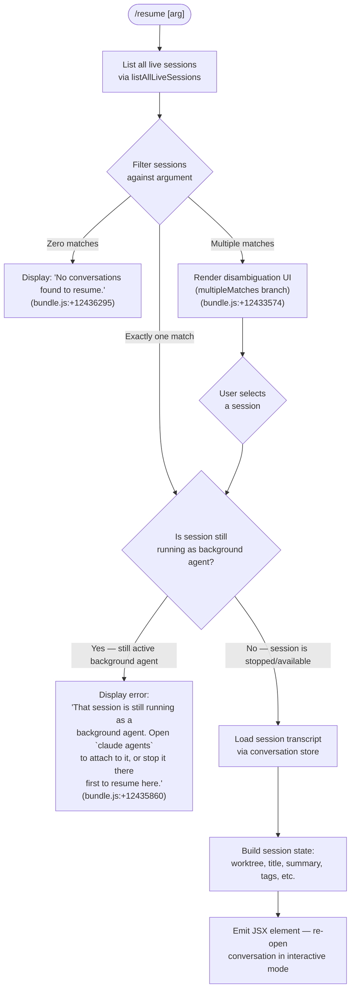

# `/resume`

> Analysis basis: CC v2.1.181 bundle.js (AST extraction + Claude interpretation)
> Minimum version: v2.1.181

---

## Overview

`/resume` (aliased as `/continue`) allows users to resume a previously saved conversation session by providing either a conversation ID or a search term. The command lists all known sessions, filters and ranks them against the supplied argument, and then re-opens the matched conversation — or presents a disambiguation UI when multiple sessions match.

---

## Registration

| Field | Value |
|---|---|
| type | `local-jsx` |
| name | `resume` |
| description | Resume a previous conversation |
| aliases | `["continue"]` |
| argumentHint | `[conversation id or search term]` |
| module_id | `X_l` |
| load_inline | `true` |
| loc_byte | `12437260` |
| loc_byte_end | `12437457` |
| loc_line | `7944` |
| arbor_handler.name | `Kef` |
| arbor_handler.fqn | `claude-2.1.181::Kef` |
| arbor_handler.kind | `AsyncFunction` |
| arbor_handler.resolution_path | `module_id` |
| arbor_handler.n_hits | `0` |

Analysis basis: CC v2.1.181 bundle.js:+12437260

---

## Input Branching

Five distinct code paths exist depending on session state and match results, so a Mermaid flowchart is used.



---

## Behavioral Spec

### 1. Session Discovery (`sessionListLoader`)

The handler begins by resolving all live sessions from the daemon's session registry.

```
async function sessionListLoader(context):
    sessions = await listAllLiveSessions(context)  // _ge → n.listAllLiveSessions
    filteredSessions = sessions.filter(isInteractiveMode)  // literal "interactive" at +8535145
    return filteredSessions
```

Analysis basis: CC v2.1.181 bundle.js:+12435850, +8535054, +8535145

---

### 2. Worktree Detection (`worktreeDetector`)

Worktree information for each session is resolved by running `git worktree list --porcelain` and parsing the output to attach a worktree path to the candidate session list.

```
async function worktreeDetector(projectPath):
    result = await spawnProcess(["git", "worktree", "list", "--porcelain"])
    // literals: "worktree", "list", "--porcelain" at +8524162, +8524169
    lines = result.split("\n")
    for line in lines:
        if line.startsWith("worktree "):   // literal "worktree " at +8524370
            worktreePath = line.slice(9)   // length of "worktree " = 9, literal at +8524404
            normalizeUnicode(worktreePath) // NFC normalisation, literal "NFC" at +64429
    return worktreeMap
```

Telemetry: `tengu_worktree_detection` fired during this phase (bundle.js:+8524251).

Analysis basis: CC v2.1.181 bundle.js:+8524107, +8524332

---

### 3. Argument Matching and Filtering (`sessionMatcher`)

After the session list is obtained the handler filters it against the user-supplied argument (conversation ID or search term).

```
function sessionMatcher(sessions, userArg):
    if userArg is empty:
        return sessions  // show all, most-recent first

    lowerArg = userArg.toLowerCase()

    // Primary: exact UUID match
    exactMatch = sessions.find(s => s.id == userArg)
    if exactMatch:
        return [exactMatch]

    // Secondary: substring search on title, summary, last-prompt
    candidates = sessions.filter(s =>
        s.title.includes(lowerArg) ||
        s.summary?.includes(lowerArg) ||
        s.lastPrompt?.includes(lowerArg)
    )

    // Sort by recency (localeCompare on timestamp)
    candidates.sort((a, b) => a.timestamp.localeCompare(b.timestamp))
    return candidates
```

Analysis basis: CC v2.1.181 bundle.js:+12436414, +8524496, +8524515, +8524542, +8524575

---

### 4. Branch Dispatch (main handler `Kef`)

```
async function resumeCommandHandler(arg, context):
    allSessions = await sessionListLoader(context)
    matches = sessionMatcher(allSessions, arg)

    if matches.length == 0:
        return renderText("No conversations found to resume.")
        // literal at +12436295

    if matches.length > 1:
        return renderDisambiguationUI(matches)
        // multipleMatches branch, literal at +12433574

    session = matches[0]

    if isBackgroundAgentRunning(session):
        return renderError(
            "That session is still running as a background agent. " +
            "Open `claude agents` to attach to it, or stop it there " +
            "first to resume here."
        )
        // literal at +12435860

    transcript = await loadTranscript(session, context)
    // calls qle (conversation store loader), gge (session metadata resolver)

    sessionState = buildSessionState(transcript, session)
    // resolves summary, last-prompt, custom-title, ai-title, tag, agent-name, mode,
    // permission-mode metadata keys
    // literals at +13475002, +13475069, +13475165, +13475243, +13475313, +13475374

    emitTelemetry("slash_command_session_id", session.id)
    // literal at +12436557
    emitTelemetry("slash_command_title", session.title)
    // literal at +12436782

    return xb.createElement(ResumedConversationView, {
        sessionState,
        timestamp: Date.now()
    })
    // xb.createElement call at +12436146, Date.now at +12436172
```

Analysis basis: CC v2.1.181 bundle.js:+12435850, +12436081, +12436146, +12436172, +12436217, +12436295, +12436396, +12436414, +12436428, +12436535, +12436551, +12436602, +12436663, +12436682, +12436832

---

### 5. Transcript Loading (`transcriptLoader` / `qle`)

The transcript store (`qle`) reads JSONL transcript files from disk, reconstructing the message chain. It reads metadata keys from the store using synchronous file I/O helpers (`kAf`, `xAf`) and resolves parent-child UUID links to recreate the conversation thread in order.

```
function loadTranscript(session, context):
    filePath = resolveTranscriptPath(session)
    rawData  = syncReadFile(filePath)          // kAf, R$.readSync
    messages = parseJSONL(rawData)             // Wt → JSON.parse
    chain    = relinkMessages(messages)        // xAf, AAf, vRl
    // compact_boundary markers respected: literal at +13881247
    // attribution-snapshot entries parsed: literal at +13476319
    return chain
```

Analysis basis: CC v2.1.181 bundle.js:+13477019, +13477200, +13471219, +13471556, +13472933

---

### 6. Session Metadata Resolution (`sessionMetadataResolver` / `gge`)

`gge` fetches the daemon status file and computes the display title, worktree association, and session age.

```
async function sessionMetadataResolver(sessionId, context):
    statusFile = path.join(sessionDir, "daemon.status.json")
    // literal "daemon.status.json" at +12998118
    status = await readJSON(statusFile)        // sjt → sr
    worktrees = await worktreeDetector(projectPath)
    session = worktrees.find(w => w.sessionId == sessionId)
    sortKey = session.timestamp.localeCompare(...)
    return { title, worktree, age, summary }
```

Analysis basis: CC v2.1.181 bundle.js:+8524107, +12998118, +12998230

---

### 7. Background-Agent Guard (`backgroundAgentCheck` / `KR`)

```
function isBackgroundAgentRunning(session):
    return backgroundSessionPattern.test(session.id)
    // KR → Hfd.test at +4272657
```

Analysis basis: CC v2.1.181 bundle.js:+12436396, +4272657

---

### 8. "No Sessions" and "Session Not Found" Error States

| Condition | Message / Behaviour |
|---|---|
| Zero matches after filter | `"No conversations found to resume."` (literal +12436295) |
| Session still active as background agent | Long advisory string directing user to `claude agents` (literal +12435860) |
| Multiple matches, user does not select | Disambiguation UI rendered (`multipleMatches`, literal +12433574) |
| Session ID not found in store | `sessionNotFound` path (literal +12433503) |

Analysis basis: CC v2.1.181 bundle.js:+12433503, +12433574, +12435860, +12436295

---

## State & Side Effects

| Item | Detail |
|---|---|
| Telemetry — `tengu_worktree_detection` | Fired during git worktree enumeration (bundle.js:+8524251) |
| Telemetry — `tengu_bg_attach` | Fired when the daemon attaches to a background session (bundle.js:+17092536) |
| Telemetry — `tengu_bg_attach_kick` | Fired when a competing client is evicted (bundle.js:+17094733) |
| Telemetry — `tengu_bg_attach_stall_gave_up` | Fired when an attach attempt times out (bundle.js:+17093466) |
| Telemetry — `tengu_bg_attach_stall_respawn` | Fired when a stalled worker is respawned (bundle.js:+17093736) |
| Telemetry — `tengu_bg_attach_upgrade` | Fired when a legacy worker is upgraded during attach (bundle.js:+13267834) |
| Telemetry — `tengu_bg_attach_legacy_autorespawn` | Fired when a legacy client triggers auto-respawn (bundle.js:+17091377) |
| Telemetry — `tengu_transcript_phantom_parent` | Fired when a transcript message references a missing parent UUID (bundle.js:+13473767) |
| Telemetry — `tengu_transcript_parent_cycle` | Fired when a cycle is detected in the parent-UUID chain (bundle.js:+13477687) |
| Telemetry — `tengu_chain_parent_cycle` | Fired on duplicate-parent detection in the chain builder (bundle.js:+13454577) |
| Telemetry — `tengu_chain_timestamp_fallback` | Fired when timestamp ordering is used as chain fallback (bundle.js:+13454726) |
| Telemetry — `tengu_relink_walk_broken` | Fired when the relink walk encounters a broken parent link (bundle.js:+13454083) |
| Telemetry — `tengu_daemon_control` | Fired on daemon control-key events during session attach (bundle.js:+17138162) |
| Telemetry — `tengu_bg_proto_mismatch` | Fired when the daemon protocol version mismatches (bundle.js:+17087088) |
| appState changes | Conversation session ID and title written to app state via `slash_command_session_id` / `slash_command_title` keys |
| Rendered element | `xb.createElement` produces a JSX element representing the resumed conversation view (bundle.js:+12436146) |
| File I/O | Transcript JSONL files read synchronously from disk via `kAf` / `xAf`; `daemon.status.json` read asynchronously |
| Background agent guard | If the target session has an active background agent, command aborts with an advisory message and no state change occurs |
| Sound | <!-- TODO: not found in depth-2 traversal; needs --depth 4 --> |

---

## Version History

| Version | Change |
|---|---|
| v2.1.181 | Initial analysis |

---

## Common Mistakes

1. **Passing a partial word that matches too many sessions** — when the search term is ambiguous the disambiguation UI is shown rather than a single session being resumed. Use the full UUID for guaranteed single-match behaviour.
2. **Trying to resume an active background agent session** — if the target session is still running as a background agent, `/resume` will refuse and direct you to `claude agents` instead. Stop or detach the background agent first.
3. **Confusing `/resume` with `/continue`** — both names resolve to the same handler; they are exact aliases. Neither form accepts subcommands.
4. **Expecting cross-project search** — the session list is filtered to the current worktree context. Sessions from other worktrees may not appear unless the worktree is detected by `git worktree list`.
5. **Running the command with no arguments expecting the most-recent session to open automatically** — while the implementation does return all sessions when no argument is supplied, this produces the disambiguation UI when more than one session exists; it does not silently open the single most-recent session.

---

## Appendix — Identifier Mapping

> For bundle debugging only. Identifiers change across versions.

| Identifier | Role |
|---|---|
| `Kef` | Main async handler for `/resume` (arbor_handler) |
| `Y_l` | Session list pre-filter (filters before passing to handler) |
| `_ge` | Session list loader — wraps `listAllLiveSessions` |
| `gge` | Session metadata resolver — reads `daemon.status.json` and worktree info |
| `Vr` | Subprocess spawner used for git worktree detection |
| `LOe` | Child-process lifecycle manager |
| `ke` | Error formatting / structured error constructor |
| `Ho` | Low-level error constructor helper |
| `rt` | String coercion utility |
| `ta` | Argument parsing helper |
| `qYo` | Argument tokeniser |
| `fVc` | Render queue manager (shift/push) |
| `Ee` | String converter utility |
| `qle` | Conversation / transcript store — reads and writes session metadata |
| `rPl` | Transcript file enumerator and context builder |
| `sje` | JSONL session context packer |
| `$Af` | Transcript directory resolver |
| `KR` | Background-agent pattern tester (`Hfd.test`) |
| `Ege` | Session state assembler — merges transcript state into view model |
| `GKn` | Timestamp parser (`Date.parse`) |
| `yge` | Session chain walker / parent-link resolver |
| `HAf` | Parallel transcript recovery helper |
| `_Af` | Session attribution chain builder |
| `hAf` | Ordered session heap sorter |
| `QRl` | Deduplicated session-map builder |
| `Bat` | Session list mapper |
| `Zwo` | Compact-boundary and replaceAll pre-processor |
| `bGt` | Message block parser (handles `isCompactSummary`, `text`, `command-args`, `bash-input`) |
| `Rl` | Markdown/text trimmer and regex executor |
| `tLo` | Content-type filter (image / document exclusion) |
| `yAf` | Array-aware content type checker |
| `EAf` | Some-based content type presence check |
| `jKn` | Parent-UUID map getter/setter |
| `WKn` | Session values array converter |
| `Gat` | Full session state getter — assembles all metadata maps |
| `nPl` | Session initialiser (calls `qle` + `Object.assign`) |
| `DAf` | Session directory stat helper |
| `tL` | Directory recursive reader |
| `Bwo` | Session worktree/content assembler |
| `JY` | Session list sorter and slicer (produces final sorted candidate list) |
| `K_l` | Bold-text renderer helper for disambiguation UI |
| `JHe` | JSX helper used in result rendering |
| `zWn` | Context file loader for resumed session |
| `u8t` | Context builder that collects project files |
| `rMe` | File content reader for context |
| `jwo` | Recursive directory file scanner |
| `t8t` | Context cache get/set |
| `DE` | Path sanitiser / relative-path builder |
| `xhc` | Log formatter |
| `Re` | JSON serialiser wrapper |
| `qc` | Path truncator / display formatter |
| `nqe` | Queue dispatcher |
| `Rhc` | Full context-file reader and Buffer.byteLength checker |
| `cxl` | Daemon status file reader |
| `hQ` | Session handle lookup |
| `oi` | Async-local-storage store accessor |
| `sjt` | Status file path joiner |
| `mH` | Unicode normaliser (`e.normalize`) |
| `gr` | Working-directory resolver |
| `I` | Message formatter — role/content builder |
| `ln` | Logger |
| `Wzc` | Logger wrapper |
| `ps` | Promise settlement helper |
| `mg` | Path maker / `mkdir -p` helper |
| `kAf` | Synchronous file reader (open/read/close) |
| `xAf` | Binary JSONL transcript parser |
| `LAf` | Buffer-based transcript line parser |
| `tPl` | Low-level byte-at accessor |
| `wAf` | Buffer compare helper |
| `vRl` | Conversation store value iterator |
| `AAf` | Parent-link traversal builder |
| `us` | React-state hook |
| `tSe` | Stream message framer |
| `M7c` | Stream frame type identifier |
| `R7c` | Frame concat builder |
| `O7c` | JSON frame parser |
| `P7c` | Raw frame parser |
| `O` | Rate-limit event enqueuer |
| `UEl` | Rate-limit state reader |
| `lj` | Usage-based billing classifier |
| `Lt` | Utility factory wrapper |
| `ls` | Logger shorthand |
| `Fn` | Timeout-backed promise wrapper |
| `aKn` | macOS memory pressure checker |
| `H$e` | Temp-file lstat/rm/readFile helper |
| `ut` | Session unlock / deduplication helper |
| `x1o` | Unix-socket connect helper |
| `O1o` | Worker lifecycle manager (spawn / retire / cleanup) |
| `$e` | React-state hook (Rht) |
| `W` | Scheduled-task runner |
| `sMt` | Task min-interval enforcer |
| `hIn` | Task max-interval enforcer |
| `wec` | Boolean coercion wrapper |
| `B` | Write-throttle / idle-exit timer |
| `_re` | Set membership tester |
| `tae` | Task scheduler retry handler |
| `L` | Worker sweep loop — memory/retirement/prewarm |
| `lKn` | Worker upgrade trigger |
| `Ujt` | Memory threshold checker |
| `ZDl` | Worker unlock helper |
| `qn` | Promise utility |
| `q` | Worker queue |
| `k` | Terminal write-rate limiter |
| `K` | Keyboard input handler |
| `DBe` | MCP connection builder |
| `bQn` | MCP update applicator |
| `kOo` | MCP client roster manager |
| `y9f` | PTY/terminal session message dispatcher |
| `sf` | Stream end/reply helper |
| `g` | Terminal buffer manager |
| `f` | Worker session manager |
| `M` | Worker instance (spawn, hQ, Date.now) |
| `Me` | Feature-ok telemetry emitter |
| `xe` | Feature-bad telemetry emitter |
| `F` | Permission classifier (allow/deny/classify/ask) |
| `d` | Supervisor config/write manager |
| `T` | Layout/resize helper |
| `h` | setTimeout-backed cache |
| `H` | Render/layout map |
| `A` | File list flat mapper |
| `_` | SDK connection manager |
| `V` | PTY write helper |
| `Y` | React ref / timeout holder |
| `Q` | PTY snapshot / jal helper |
| `x` | Terminal client session |
| `re` | String trim / boundary parser |
| `te` | Buffer Set tracker |
| `ee` | MCP update handler |
| `Wt` | JSON.parse wrapper |
| `nEe` | JSON.parse error handler |
| `w` | Grace-clock / blur-focus tracker |
| `p` | Process-exit / abort controller |
| `Xp` | Path resolver |
| `r2` | Utility factory (fx) |
| `BT` | Forced-shutdown label |
| `c_e` | Array-filter with max-length cap (64 / 32 literals) |
| `v` | Misc state holder |
| `S7t` | Tool-result block parser |
| `_7t` | Block type tester |
| `y7t` | Block text replacer |
| `LT` | Session lock token |
| `a` | MCP config + session state root |
| `c6` | Session config helper |
| `rAf` | Conversation resume-point resolver |
| `c` | Terminal write stream |
| `GKn` | Timestamp parser |
| `Gat` | Full session state getter (duplicate row for disambiguation) |

---

Note: index built via Arbor fallback; some signals (telemetry, literals) may be missing — see arbor-fallback.js.