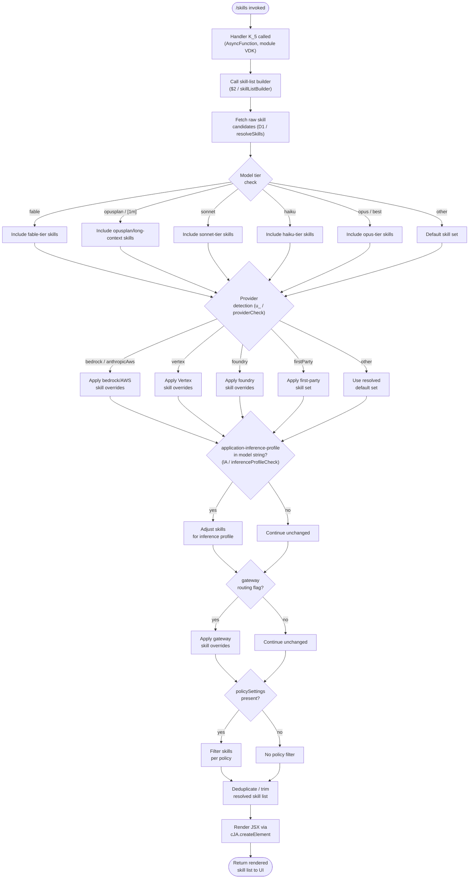

# `/skills`

> Analysis basis: CC v2.1.179 bundle.js (AST extraction + Claude interpretation)
> Minimum version: v2.1.179

---

## Overview

The `/skills` command lists the available skills (built-in capabilities) exposed by Claude Code at the time of invocation. It is a `local-jsx` command that resolves its handler inline via a module load, renders a JSX component, and delegates skill enumeration to a shared skill-resolution subsystem. No network round-trip to the model is required; the command executes entirely on the client side.

---

## Registration

| Field | Value |
|---|---|
| type | `local-jsx` |
| name | `skills` |
| description | `List available skills` |
| loc_byte | `12669088` |
| loc_byte_end | `12669220` |
| loc_line | `8587` |
| immediate | `true` |
| module_id | `VDK` |
| load_inline | `true` |
| arbor_handler.name | `K_5` |
| arbor_handler.fqn | `claude-2.1.179::K_5` |
| arbor_handler.kind | `AsyncFunction` |
| arbor_handler.resolution_path | `module_id` |
| arbor_handler.n_hits | `0` |

Analysis basis: CC v2.1.179 bundle.js:+12669088

---

## Input Branching

The command involves more than three distinct branching paths inside the skill-resolution subsystem (model-tier filtering, provider detection, policy-settings check, inference-profile check, gateway routing, etc.), so a Mermaid flowchart is used.



---

## Behavioral Spec

### 1. Entry Point — Handler Dispatch

The registered `immediate: true` flag means the command fires without prompting the model. When the user types `/skills`, the CLI resolves module `VDK` inline and calls the async handler `K_5`.

```
async function skillsCommandHandler(context):
    skillListElement = await buildSkillListJSX(context)
    return skillListElement
```

Analysis basis: CC v2.1.179 bundle.js:+12668903

---

### 2. JSX Rendering (`K_5` → `cJA.createElement`)

The handler's first action is constructing a React/JSX element tree. The element type and props are derived from the resolved skill list.

```
function renderSkillsView(resolvedSkills):
    element = createElement(SkillListComponent, { skills: resolvedSkills })
    return element
```

Analysis basis: CC v2.1.179 bundle.js:+12668903

---

### 3. Skill List Builder (`$2` / `skillListBuilder`)

`skillListBuilder` is the bridge between the raw skill-resolution subsystem and the JSX renderer. It:
1. Calls `resolveSkills` (D1) with up to **4** items of context (numeric literal `4` at bundle.js:+2283563).
2. Calls `stringNormalizer` (O4) on each candidate name.
3. Checks `inferenceProfileSet` (dTf) membership for each skill.
4. Applies a final deduplication gate (numeric literal `3` at bundle.js:+2283630).

```
function skillListBuilder(context):
    rawSkills = resolveSkills(context, maxItems=4)
    normalized = []
    for skill in rawSkills:
        name = stringNormalizer(skill.name)
        label = inferenceProfileLookup(skill)
        if not inferenceProfileSet.has(skill.id):
            normalized.append({ name, label })
    return normalized[:3]   // final cap
```

Analysis basis: CC v2.1.179 bundle.js:+2283563, +2283617, +2283630

---

### 4. Skill Resolution (`D1` / `resolveSkills`)

`resolveSkills` is the core dispatcher. It normalizes the current model identifier, then fans out to tier-specific and provider-specific resolvers.

```
function resolveSkills(context, maxItems):
    modelId = context.modelId.trim().toLowerCase()

    // Tier routing (bundle.js:+2285644–2285873)
    if modelId contains "fable":
        tierSkills = fableSkillSet()
    else if modelId contains "opusplan" or "[1m]":
        tierSkills = opusplanSkillSet()
    else if modelId contains "sonnet":
        tierSkills = sonnetSkillSet()
    else if modelId contains "haiku":
        tierSkills = haikuSkillSet()
    else if modelId contains "opus" or "best":
        tierSkills = opusSkillSet()
    else:
        tierSkills = defaultSkillSet()

    // Provider routing (bundle.js:+2121450–2121698)
    provider = detectProvider(context)   // u_ / providerCheck
    tierSkills = applyProviderOverrides(tierSkills, provider)

    // Inference-profile check (bundle.js:+2283442–2283493)
    tierSkills = filterByInferenceProfile(tierSkills, context)

    // Policy settings filter (bundle.js:+2267088)
    if context.policySettings exists:
        tierSkills = applyPolicyFilter(tierSkills, context.policySettings)

    // Gateway routing (bundle.js:+2270795)
    if context.gateway:
        tierSkills = applyGatewayOverrides(tierSkills)

    return tierSkills[:maxItems]
```

Analysis basis: CC v2.1.179 bundle.js:+2285567, +2285578, +2285596, +2285606, +2285624, +2285659, +2285801, +2285841, +2285873

---

### 5. Provider Detection (`u_` / `providerCheck` and `f6` / `providerResolver`)

Provider is detected by inspecting the model string for well-known provider prefixes. Known provider strings (all literals found in the traversal):

| String | Provider |
|---|---|
| `"bedrock"` | AWS Bedrock (bundle.js:+2121490) |
| `"foundry"` | Azure AI Foundry (bundle.js:+2121540) |
| `"anthropicAws"` | Anthropic-managed AWS (bundle.js:+2121596) |
| `"vertex"` | Google Vertex AI (bundle.js:+2121698) |
| `"firstParty"` | Direct Anthropic API (bundle.js:+2122314) |

`f6` (providerResolver) calls `String()` coercion as its base step (bundle.js:+28042). Boolean flags `"yes"` and `"on"` (bundle.js:+28091, +28097) control feature toggles within this resolver.

```
function providerCheck(modelId):
    raw = String(modelId)
    if raw includes "bedrock":   return "bedrock"
    if raw includes "foundry":   return "foundry"
    if raw includes "anthropicAws": return "anthropicAws"
    if raw includes "vertex":    return "vertex"
    return "firstParty"
```

Analysis basis: CC v2.1.179 bundle.js:+2121450, +2121490–2121698, +28042

---

### 6. Inference-Profile Detection (`lA` / `inferenceProfileCheck`)

The string `"application-inference-profile"` (bundle.js:+2283453) is searched within the model identifier string using `H.includes`. If found, the skill set is adjusted for the inference-profile context. The string `"mantle"` (bundle.js:+2272506) appears as an internal tier name within `PJH` (skillSetBuilder).

```
function inferenceProfileCheck(modelId, skills):
    if modelId includes "application-inference-profile":
        return adjustForInferenceProfile(skills)
    return skills
```

Analysis basis: CC v2.1.179 bundle.js:+2283442, +2283453

---

### 7. Model ID Normalisation Helpers

Several string-normalisation helpers are called during resolution:

| Helper | Operation | loc_byte |
|---|---|---|
| `stringNormalizer` (O4) | `H.replace(…)` — strips unwanted characters | +2265447 |
| `includesCheck` (EN) | `wyH.includes(…)` — membership test | +2265409 |
| `lowerCaseMapper` (pTf) | `H.toLowerCase()` — case fold | +2272127 |
| `trimHelper` (D1 internal) | `H.trim()` — whitespace strip | +2285567 |
| `replaceHelper` (_P6) | `H.replace(…)` — secondary replace | +2287619 |

Analysis basis: CC v2.1.179 bundle.js:+2265409, +2265447, +2272127, +2285567, +2287619

---

### 8. Model-String Parsing (`TK` / `modelStringParser`)

`TK` is a multi-step parser that tokenises the raw model string. It performs: split by delimiter (`Nj6`/`hj6`), map over tokens (`q.map`), trim each token, check membership (`K.includes`), apply `EN` (includesCheck), look up `policySettings`, call `BR1`/`R8` sub-resolvers, and finally recurse into `D1` (resolveSkills). Known model string variants found in literals:

- `"claude-fable-5"` (bundle.js:+3312642)
- `"claude-mythos-5"` (bundle.js:+3312664)
- `"claude-mythos-preview"` (bundle.js:+3312687)
- `"claude-opus-4-7"` (bundle.js:+3312716)
- `"claude-opus-4-8"` (bundle.js:+3312739)

```
function modelStringParser(rawModelString):
    parts = split(rawModelString, delimiter)   // Nj6, hj6
    tokens = parts.map(t => t.trim())
    for token in tokens:
        if token in knownModelSet:
            return resolveSkillsForModel(token)
    return resolveSkills(rawModelString)
```

Analysis basis: CC v2.1.179 bundle.js:+2266681, +2266698, +2266823, +2267088, +2267421

---

### 9. Async Jitter (`H` / `jitterHelper`)

`H` (jitterHelper) uses `Math.random()` (bundle.js:+14230697) and `setTimeout` (bundle.js:+14230734) with constants `2` and `1` (bundle.js:+14230695, +14230711). This introduces a small random delay (likely for debounce or rate-limit jitter) in an upstream async path, not in the direct rendering path.

```
async function jitterHelper(fn):
    delay = Math.random() * 2 + 1   // ms range
    await sleep(delay)
    return fn()
```

Analysis basis: CC v2.1.179 bundle.js:+14230695, +14230697, +14230711, +14230734

---

## State & Side Effects

| Item | Detail |
|---|---|
| Telemetry | None detected in depth-2 traversal (`telemetry: []`) |
| Hook registration | None detected in depth-2 traversal |
| appState changes | None detected; command is read-only, renders to UI only |
| Sound | None detected |
| Model resolution | Reads current model ID from context; no mutation |
| Provider detection | Read-only inspection of model string and context flags |
| JSX rendering | Produces a local JSX element tree via `cJA.createElement`; no network call |
| `immediate` flag | Command executes without sending a message to the model (bundle.js:+12669088) |

---

## Version History

| Version | Change |
|---|---|
| v2.1.179 | Initial analysis |

---

## Common Mistakes

1. **Expecting model output**: `/skills` is `immediate: true` — it never invokes the Claude model. Waiting for an AI response after running `/skills` will time out.
2. **Assuming a static skill list**: The resolved list depends on the active model ID (tier), provider (Bedrock, Vertex, Foundry, firstParty), inference-profile flag, gateway flag, and policy settings. The same command can return different results in different deployment contexts.
3. **Confusing `/skills` with MCP tool listing**: `/skills` lists built-in Claude Code capabilities, not MCP server tools. Use `/mcp` commands for MCP tool inspection.
4. **Expecting telemetry confirmation**: No `tengu_*` telemetry events are emitted by this command; log-based debugging is not available for it.
5. **Model string case sensitivity**: The tier-routing logic calls `.trim().toLowerCase()` before comparison, so mixed-case model IDs are handled correctly — but callers constructing synthetic model IDs must ensure the tier keyword (`fable`, `sonnet`, `haiku`, `opus`, etc.) appears as a substring after lowercasing.

---

## Appendix — Identifier Mapping

> For bundle debugging only. Identifiers change across versions.

| Identifier | Role |
|---|---|
| `K_5` | Main async handler for `/skills` (arbor_handler, AsyncFunction, module VDK) |
| `$2` | Skill list builder — bridges resolver and JSX renderer |
| `D1` | Core skill resolver — tier/provider/policy fan-out |
| `H` | Jitter helper — `Math.random` + `setTimeout` async delay utility |
| `_` | Secondary string operand used in `.toLowerCase` / `.replace` calls |
| `Dw` | Skill lookup dispatcher calling `xLH` |
| `xLH` | Skill lookup helper calling `f6` |
| `O4` | String normalizer — `H.replace` based character stripping |
| `EN` | Inclusion checker — `wyH.includes` membership test |
| `ts` | Skill-set tier selector, calls `tP_`, `Dn`, `_P6` |
| `tP_` | Tier-specific skill builder (calls `v5`, `Dn`, `_P6`) |
| `Dn` | Skill entry constructor (calls `u_`, `j7`) |
| `_P6` | Secondary replace helper — `H.replace` |
| `o0` | Skill-set aggregator calling `O48` |
| `O48` | Skill-set sub-builder (calls `v5`, `u7`) |
| `CLH` | Skill-set collector calling `eP_` |
| `eP_` | Skill-set entry builder calling `v5` |
| `oF` | String replace helper — `H.replace` |
| `pY` | Skill-set builder calling `PJH` |
| `PJH` | Skill-set entry builder (calls `v5`, `u_`, `u7`); uses `"mantle"` tier |
| `gR1` | High-level skill group resolver (calls `kAH`, `ts`, `TK`, `pY`) |
| `kAH` | Skill category resolver (calls `u_`, `j7`, `WJH`, `TAH`) |
| `TK` | Model string parser / tokenizer — multi-step split, map, filter |
| `u7` | Skill entry finalizer calling `u_` |
| `u_` | Provider resolver calling `f6` |
| `RLH` | Skill include-list checker (`cTf.includes`) |
| `IrH` | Skill resolver calling `f6` directly |
| `f6` | Base provider resolver using `String()` coercion |
| `pTf` | Case-fold helper — `H.toLowerCase()` |
| `uS` | Inference-profile and gateway skill filter (calls `xLH`, `lA`, `Dz`, `j7`) |
| `lA` | Inference-profile check (`"application-inference-profile"` substring test) |
| `Dz` | Skill set adjuster for inference profiles (calls `zX6`, `_Wf`, `u_`, `OX6`) |
| `j7` | Async skill resolution helper calling `Iq8` |

---

Note: index built via Arbor fallback; some signals (telemetry, literals) may be missing — see arbor-fallback.js.