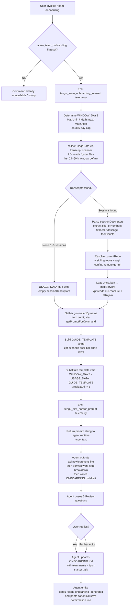

# `/team-onboarding`

> Analysis basis: CC v2.1.181 bundle.js (AST extraction + Claude interpretation)
> Minimum version: v2.1.181

---

## Overview

`/team-onboarding` is a `prompt`-type slash command that reads the invoking user's local Claude Code session transcripts, analyzes their usage patterns over a configurable window, and co-authors a ready-to-publish `ONBOARDING.md` guide that new teammates can paste directly into Claude Code for an interactive walkthrough. The command is a single-turn initiator: it immediately produces a concrete draft, then enters a collaborative review loop to fill in team-specific details (team name, starter task, tips) before writing the final file. The command is gated behind the `allow_team_onboarding` feature flag checked at invocation.

---

## Registration

| Field | Value |
|---|---|
| type | `prompt` |
| name | `team-onboarding` |
| description | Help teammates ramp on Claude Code with a guide from your usage |
| isHidden | `false` |
| handler_method | `getPromptForCommand` |
| handler_method_start | `13243885` |
| handler_method_end | `13244595` |
| loc_byte | `13243522` |
| loc_byte_end | `13244596` |
| loc_line | `8793` |
| prompt_body.length | `4539` characters |
| prompt_body.trace | `identifier→l (local→1 ext vars)` |
| arbor_handler.name | `getPromptForCommand` |
| arbor_handler.kind | `Method` |
| arbor_handler.resolution_path | `direct` |
| arbor_handler.fqn | `claude-2.1.181::getPromptForCommand` |
| arbor_handler.n_hits | `2` |

Analysis basis: CC v2.1.181 bundle.js:+13243522

---

## Input Branching

The handler follows more than three distinct paths (feature-flag gate → data collection → template substitution → prompt dispatch), so a Mermaid flowchart is used.



Analysis basis: CC v2.1.181 bundle.js:+13243885

---

## Behavioral Spec

### Feature-Flag Gate

```
function checkTeamOnboardingAllowed(appState):
    featureFlags = appState.featureFlags          // ii → K7u.has check
    if not featureFlags.has("allow_team_onboarding"):
        return UNAVAILABLE
    return PROCEED
```

The literal `"allow_team_onboarding"` is tested before any data collection begins.
Analysis basis: CC v2.1.181 bundle.js:+10236340

---

### Window-Day Calculation

```
function computeWindowDays(rawInput):
    // Hard-coded upper bound: 365 days
    clamped = Math.min(Math.max(Math.floor(rawInput), 1), 365)
    return clamped
```

The constant `365` is the maximum window the handler will request.
Analysis basis: CC v2.1.181 bundle.js:+13244134

---

### Usage-Data Collection (`transcriptScanner` / `LDl`)

```
function collectUsageData(windowDays):
    startTime = Date.now() - windowDays * 24 * 60 * 60 * 1000
    transcriptDir = resolveTranscriptDirectory()   // v2 + PO helpers
    files = await gmt.readdir(transcriptDir)
    jsonlFiles = files.filter(f => extname(f) == ".jsonl")

    sessions = []
    for each file in jsonlFiles:
        stat = await gmt.stat(join(transcriptDir, file))
        if not stat.isFile(): continue
        raw = await gmt.readFile(join(transcriptDir, file))
        lines = raw.split("\n")

        // Extract first user message
        firstMsg = extractFirstUserMessage(lines)    // u.includes + u.matchAll

        // Extract PR numbers via Wpf regex
        prNumbers = extractPrNumbers(lines)          // Wpf.exec

        // Extract MCP tool call counts via qpf regex
        toolCounts = extractToolCounts(lines)        // qpf.exec + Number()

        // Extract session title via Vpf regex
        title = extractTitle(lines)                  // Vpf.exec

        // Filter by start prefix (≥3 chars) via p.startsWith
        if qualifies(file, lines):
            sessions.push({ title, prNumbers, firstMsg, toolCounts })

    return { sessionDescriptors: sessions, windowDays }
```

The scanner reads only `.jsonl` files, uses a 24 h × `windowDays` time window (`24` and `60` appear as literals), and applies at least three distinct regex passes (`Wpf`, `qpf`, `Vpf`) to pull structured metadata from each session file.

Analysis basis: CC v2.1.181 bundle.js:+13232439 – +13233636

---

### MCP Server Resolution (`Ypf`)

```
function resolveMcpServers(workspaceRoot):
    mcpConfigPath = join(workspaceRoot, ".mcp.json")   // eKn.join literal ".mcp.json"
    raw = await kDl.readFile(mcpConfigPath)
    parsed = JSON.parse(raw)                            // Wt → JSON.parse
    servers = parsed["mcpServers"] ?? {}               // literal "mcpServers"
    result = []
    for each [name, entry] in Object.entries(servers):
        origin = entry.urlOrigin ?? null
        result.push({ name, urlOrigin: origin })
    return result
```

If `.mcp.json` is absent the resolver returns an empty list; errors are swallowed via `Dn` (error-normalizer helper).
Analysis basis: CC v2.1.181 bundle.js:+13234573 – +13234832

---

### Repo Detection (`Xpf` / `zpf`)

```
function detectRepos(workspaceRoot):
    // Primary: read git config user.name
    gitUserName = exec("git", ["config", "user.name"])      // literals "git","config","user.name"

    // Remote: read origin URL
    remoteOrigin = exec("git", ["remote", "get-url", "origin"])  // literals "remote","get-url","origin"

    // Sibling repos: scan parent directory for directories
    currentRepo = basename(workspaceRoot)                   // eKn.basename
    mcpRepos = scanSiblingRepos(workspaceRoot)
    return { currentRepo, remoteOrigin, gitUserName, mcpRepos }
```

Analysis basis: CC v2.1.181 bundle.js:+13235187 – +13235408

---

### Prompt Assembly (`getPromptForCommand`)

```
function getPromptForCommand(context):
    // 1. Gate check
    if not checkTeamOnboardingAllowed(context.appState):
        return null

    // 2. Emit pre-prompt telemetry
    emit("tengu_flint_harbor_prompt")               // loc_byte 13243922
    emit("tengu_team_onboarding_invoked")           // loc_byte 13244145

    // 3. Collect data
    windowDays  = computeWindowDays(context.input ?? 365)
    usageData   = await collectUsageData(windowDays)
    mcpServers  = await resolveMcpServers(context.cwd)
    repoInfo    = detectRepos(context.cwd)
    generatedBy = resolveGeneratedByName(context.config)

    // 4. Build guide template string
    guideTemplate = buildGuideTemplate(usageData, mcpServers, repoInfo, generatedBy)
    // guideTemplate contains ascii bar-chart rows (█ / ░, 20 chars wide)

    // 5. Substitute placeholders into the static prompt body
    //    Three replaceAll passes (t.replaceAll × 3)
    prompt = STATIC_PROMPT_BODY
        .replaceAll("{{WINDOW_DAYS}}", String(windowDays))
        .replaceAll("{{USAGE_DATA}}", JSON.stringify(usageData))
        .replaceAll("{{GUIDE_TEMPLATE}}", guideTemplate)

    // 6. Return as a text content block
    return { type: "text", content: prompt }        // literal "text" loc_byte 13244579
```

The handler is an inline `ObjectMethod` on the registration object (handler_method = `"getPromptForCommand"`); the Arbor resolver confirmed it via `direct` path with 2 hits.
Analysis basis: CC v2.1.181 bundle.js:+13243885 – +13244595

---

### Agent-Side Execution Protocol (Prompt-Driven)

Once the assembled prompt reaches the agent runtime, the agent is instructed to follow a strict ordered protocol:

1. **Immediate acknowledgment** — Output the fixed acknowledgment line ("Looking at how you've used Claude over the last `{{WINDOW_DAYS}}` days…") as the very first visible text, before any reasoning or tool calls.

2. **Work-type classification** — Parse the `sessionDescriptors` array; classify each session into one of seven canonical task types (`build_feature`, `debug_fix`, `improve_quality`, `analyze_data`, `plan_design`, `prototype`, `write_docs`). Select the top 3–5 by frequency with rough percentages. Categories are rendered in Title Case with spaces in the output document.

3. **Supplementary data gathering** — Resolve repo list from `currentRepo` plus workspace siblings; infer MCP server purpose from `name` and `urlOrigin`; leave Team Tips and Get Started sections as `TODO` placeholders.

4. **Write `ONBOARDING.md`** — Follow the injected `GUIDE_TEMPLATE`; use real numbers from usage data; render ASCII bar charts (filled `█`, empty `░`, 20 chars wide); use `generatedBy` for attribution (omit if absent); preserve the embedded HTML comment at the document's footer verbatim.

5. **Render in code block + Review section** — After the fenced code block insert a `---` rule and a `**Review**` heading with exactly three numbered questions about team name, starter task, and team tips.

6. **Update and confirm** — After the user replies, patch `ONBOARDING.md` with supplied details. Emit the canonical save-confirmation sentence verbatim, then apply any further edits on request.

Analysis basis: CC v2.1.181 bundle.js:+13243885 (prompt_body, length 4539)

---

### Allow-Product-Feedback Check (`ii` / `Vut`)

```
function checkSharePermission(appState):
    // Separate flag checked by Vut → ii path
    if not appState.featureFlags.has("allow_product_feedback"):
        return SKIP_TELEMETRY_SHARE
    emit("tengu_flint_harbor_share")    // loc_byte 10236402
```

The `allow_product_feedback` literal at loc_byte 10236340 indicates a secondary gate that controls whether usage telemetry is forwarded via the share pathway.
Analysis basis: CC v2.1.181 bundle.js:+10236337 – +10236402

---

## State & Side Effects

| Item | Detail |
|---|---|
| Telemetry — pre-prompt | `tengu_flint_harbor_prompt` (loc_byte 13243922) — fired immediately when handler runs |
| Telemetry — invocation | `tengu_team_onboarding_invoked` (loc_byte 13244145) — fired after window-day clamp |
| Telemetry — generation | `tengu_team_onboarding_generated` (loc_byte 13244464) — fired after guide is produced |
| Telemetry — share gate | `tengu_flint_harbor_share` (loc_byte 10236402) — fired only when `allow_product_feedback` flag is set |
| Telemetry — config errors | `tengu_config_parse_error`, `tengu_config_lock_contention`, `tengu_config_stale_write`, `tengu_config_auth_loss_prevented`, `tengu_config_fallback_write` — from config subsystem reached via `un`/`n7n` |
| File writes | `ONBOARDING.md` written in the working directory after the user confirms Review answers |
| File reads | Local `.jsonl` transcript files (via `LDl` / `gmt.readFile`); `.mcp.json` (via `Ypf` / `kDl.readFile`) |
| Config reads | Global config accessed via `w_e` / `It`; guarded by `"Config accessed before allowed."` error (loc_byte 13941172) |
| Feature-flag gates | `allow_team_onboarding` must be set for command to execute; `allow_product_feedback` controls share telemetry |
| Git subprocess | `git config user.name` and `git remote get-url origin` spawned via `Vr` / `LOe` child-process layer |
| appState changes | None observed at depth-2; the command is read-only with respect to app state |
| Hook registration | `Gi → v$o.register` reached via config watcher path (`Byf`); relates to file-watch lifecycle, not command-specific |
| Sound | None observed |
| Backup management | Config backup rotation via `h0o` / `backups` directory (loc_byte 13940740); max 5 backups (literal `5`, loc_byte 13940158) |

---

## Version History

| Version | Change |
|---|---|
| v2.1.181 | Initial analysis |

---

## Common Mistakes

1. **Invoking without the feature flag** — The `allow_team_onboarding` flag must be enabled in the team/enterprise policy. The command is registered as visible (`isHidden: false`) but the handler gate returns early if the flag is absent, producing no output.

2. **Running from a directory with no `.jsonl` transcripts** — If the transcript directory contains no `.jsonl` session files within the configured window, `sessionDescriptors` will be empty and the agent will leave the work-type breakdown as a `TODO`. Ensure you run from a machine and user account that has existing Claude Code session history.

3. **Expecting instant output after invocation** — The prompt instructs the agent to emit an acknowledgment line _before_ any reasoning. If the agent appears silent, it may be in an extended-thinking phase. The prompt explicitly warns against this, but long-context models may still pause.

4. **Skipping the Review questions** — The two-turn design is intentional: the first turn always produces a draft with `TODO` placeholders for team name, starter task, and tips. Answering the three Review questions is required to get a complete, publishable `ONBOARDING.md`.

5. **Expecting the command to detect repos outside the workspace** — Repo detection starts from `currentRepo` (the `cwd` basename) and scans immediate sibling directories only. Repos in arbitrary filesystem locations will not be discovered.

6. **Misinterpreting the 365-day cap** — The window is clamped to a maximum of 365 days (`Math.min(..., 365)`, loc_byte 13244134). Passing a larger value will silently clamp to 365; it is not an error.

---

## Appendix — Identifier Mapping

> For bundle debugging only. Identifiers change across versions.

| Identifier | Role |
|---|---|
| `__handler_team-onboarding` | Synthetic BFS entry point for the command handler (not a real bundle symbol) |
| `ut` | Prompt-dispatch / harbor-submit function called immediately after handler |
| `txt` | Text content-block constructor (depth-1 callee of `ut`) |
| `nxt` | Next-turn / continuation helper (depth-1 callee of `ut`) |
| `p4` | Prompt-pipeline stage (routes assembled prompt into agent queue) |
| `d4` | Downstream dispatch helper called by `p4` |
| `Q2` | Queue/channel wrapper used by `d4` |
| `Ygn` | Deduplication / idempotency guard for prompt submissions |
| `V1r` | Variant/version record builder (constructs submission record with UUID) |
| `zUe` | Zero-state initializer called by `V1r` |
| `$j` | Random-ID generator (uses `A0o.randomBytes`, 32 bytes, hex-encoded) |
| `Re` | JSON.stringify thin-wrapper |
| `H7u` | Submission header builder |
| `Q1r` | Queue insertion helper |
| `lti` | Lock/token issuer called by `Q1r` |
| `Kr` | Key-resolver utility |
| `Ifi` | In-flight tracker |
| `qV` | Queue-visibility gate (`y8c.has` check) |
| `It` | Config/state accessor (main entry to config subsystem) |
| `jt` | Path-join / base-path helper |
| `p0o` | Platform-options object |
| `w_e` | Config file reader (reads, parses, rotates backups) |
| `r` | Filesystem module reference (Node `fs`) |
| `Wt` | JSON.parse thin-wrapper |
| `x9` | String prefix-stripper (`startsWith` + `slice`) |
| `t` | Generic argument / context parameter |
| `ln` | Logger / structured-log emitter |
| `uUl` | User-level config-directory locator |
| `I` | Error-code classifier / normalizer |
| `j` | Utility / miscellaneous helper |
| `h0o` | Backup-directory path builder (`join` + `"backups"`) |
| `f` | Daemon subprocess manager |
| `Byf` | Config-file watcher (uses `Zzn.watchFile` / `unwatchFile`) |
| `kq` | Key-queue or key-watch helper |
| `Gi` | Hook/listener registrar (`v$o.register`) |
| `un` | Global-config save orchestrator |
| `n7n` | Config-with-lock writer (acquires lock, reads, merges, writes) |
| `s` | Secondary filesystem helper (overlapping role with `r`) |
| `i` | Stream / close helper |
| `gBs` | Config-object builder (`kvr` + `Object.assign`) |
| `kvr` | Config key-value resolver |
| `qmt` | Queue/mutex token helper |
| `n` | Lowercase normalizer (`toLowerCase`) |
| `T` | Terminal/display resize helper |
| `x` | Input/keypress event handler |
| `E` | Clamp/range helper (`Math.max` + `Math.min`) |
| `g` | IPC buffer / chunk processor |
| `h` | Timeout-backed reader |
| `m` | Process-set manager |
| `sf` | Stream-finalizer (calls `e.end`) |
| `y9f` | Daemon IPC message dispatcher (large multiplexer) |
| `Ee` | String coercer (`String(...)`) |
| `lSt` | Safe atomic file writer (uses temp file + rename + fsync) |
| `Jp` | Real-path resolver (`realpathSync`) |
| `u` | Connection/channel object |
| `Dn` | Error normalizer / logger |
| `cKe` | Chmod-error suppressor (swallows `EINVAL`/`ENOTSUP`/`EPERM`/`ENOSYS`) |
| `e` | Generic event emitter / environment reference |
| `dMe` | Dirty-mark / mutation flag |
| `f0o` | Feature-flag object iterator (`Object.entries`) |
| `L8t` | Timestamp / date helper (`Date.now`) |
| `t7n` | Project-config writer (atomic write via `lSt`) |
| `$e` | React-hook / effect runner |
| `Rht` | Root hook target |
| `Xpf` | Usage-data collection orchestrator (calls `LDl`, `Ypf`, `zpf`, `Vr`) |
| `gr` | Git runner helper |
| `fx` | Spawn-and-capture utility |
| `v2` | Project-path resolver (`YV.join` + `PO`) |
| `PO` | Projects-directory path builder |
| `DE` | Directory-entry formatter |
| `ZVc` | Absolute-value / numeric helper |
| `LDl` | Transcript-directory scanner (reads `.jsonl` files, builds `sessionDescriptors`) |
| `ls` | Log-and-swallow error helper |
| `o` | Output formatter / padder |
| `c` | File-stat wrapper |
| `bn` | Background-node helper |
| `l` | IPC / channel layer |
| `cxl` | Channel-connection wrapper |
| `p` | Process-exit / abort handler |
| `BT` | Before-terminate cleanup |
| `Ypf` | MCP config reader (reads `.mcp.json`, extracts `mcpServers`) |
| `zpf` | Guide-template builder (constructs ASCII bar-chart template) |
| `Vr` | Child-process / command executor (wraps `LOe`) |
| `LOe` | Full child-process spawn wrapper (cross-platform, with timeout) |
| `nZo` | Process-argument builder |
| `Zfr` | Stdio-stream connector |
| `emr` | Error-mapping resolver |
| `nmr` | Named-pipe / stdio helper |
| `uQo` | Finite-check validator (`Number.isFinite`) |
| `uSt` | Buffered-data accumulator |
| `Qfr` | Reflect-apply shim |
| `$Qo` | Exit-event listener setup |
| `cQo` | Timeout-race wrapper (`Promise.race`) |
| `dQo` | Kill-on-timeout helper |
| `aQo` | Data-chunk accumulator callback |
| `lQo` | Kill-signal sender |
| `UQo` | Parallel-stream joiner (`Promise.all`) |
| `mSt` | Max-buffer enforcer |
| `OQo` | Pipe-setup helper (`n.pipe`) |
| `NQo` | Stream-add helper |
| `AQo` | Error-event binder |
| `qzc` | String coercer for command args |
| `Xp` | Cross-platform path helper |
| `Wzc` | Logger wrapper for child-process errors |
| `ke` | HTTP / API request executor (Anthropic API client) |
| `Ho` | HTTP error constructor |
| `rt` | String coercer / tag helper |
| `ta` | API-request dispatcher |
| `fVc` | Request-queue rotator (`ren.shift` + `ren.push`) |
| `MOe` | Git-remote-URL parser (extracts host/repo slug) |
| `S7c` | String-index helper |
| `Li` | Substring extractor (`indexOf` + `slice`) |
| `Vut` | Share / product-feedback gate (checks `allow_product_feedback`, emits `tengu_flint_harbor_share`) |
| `ii` | Feature-flag evaluator (checks `V7u`/`K7u` sets, delegates to `tB`/`dz`) |
| `Xfi` | Flag-expansion helper |
| `dz` | Flag-default resolver |
| `tB` | Flag-truth evaluator |
| `xr` | Flag-string normalizer |
| `qu` | Flag-value decoder |
| `Bg` | API-profile builder (selects auth strategy) |
| `ob` | OAuth token resolver |
| `rme` | Raw-message encoder |
| `sb` | Submit-block helper |

---

Note: index built via Arbor fallback; some signals (telemetry, literals) may be missing — see arbor-fallback.js.