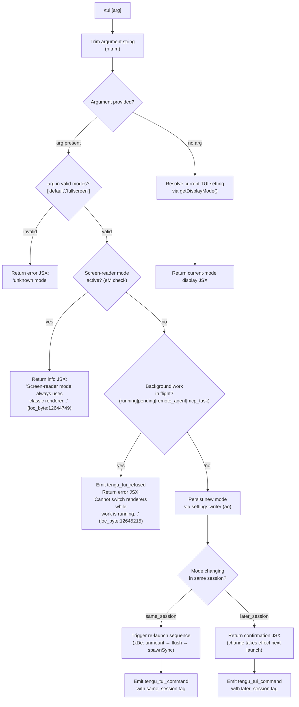

# `/tui`

> Analysis basis: CC v2.1.181 bundle.js (AST extraction + Claude interpretation)
> Minimum version: v2.1.181

---

## Overview

The `/tui` command lets users switch the terminal UI renderer at runtime between `default` and `fullscreen` modes. It validates the requested mode against environmental constraints (screen-reader state, background work in flight, tmux-CC mode, Windows-over-SSH detection) before writing the new setting and optionally re-launching Claude Code to apply the change. The command is of type `local-jsx`, meaning its handler produces a JSX element rendered in the terminal rather than sending a prompt to the model.

---

## Registration

| Field | Value |
|---|---|
| type | `local-jsx` |
| name | `tui` |
| description | `Set the terminal UI renderer (default \| fullscreen)` |
| argumentHint | `[default\|fullscreen]` |
| module_id | `abl` |
| load_inline | `true` |
| loc_byte | `12646614` |
| loc_byte_end | `12646796` |
| loc_line | `8269` |
| arbor_handler.name | `Hrf` |
| arbor_handler.fqn | `claude-2.1.181::Hrf` |
| arbor_handler.kind | `AsyncFunction` |
| arbor_handler.resolution_path | `module_id` |
| arbor_handler.n_hits | `0` |

Analysis basis: CC v2.1.181 bundle.js:+12646614

---

## Input Branching

Six or more distinct decision paths are present in the handler, so a Mermaid flowchart is used.



Analysis basis: CC v2.1.181 bundle.js:+12644229 – +12646267

---

## Behavioral Spec

### 1. Handler Entry — `tuiCommandHandler` (`Hrf`)

The Arbor-resolved handler is the async function `Hrf` (FQN `claude-2.1.181::Hrf`, resolution path `module_id`).

```
async function tuiCommandHandler(context):
    rawArg = context.args.trim()           // n.trim @ +12644229
    displayMode = resolveDisplayMode(context)   // Ds @ +12644254
    validModes = ["fullscreen", "default"]      // vTo @ +12644341

    if rawArg == "":
        return renderCurrentModeJsx(displayMode)

    if rawArg not in validModes:
        return renderErrorJsx("unknown mode: " + rawArg)

    if screenReaderModeActive(context):         // eM @ +12644735
        // literal @ +12644749
        return renderInfoJsx("Screen-reader mode always uses the classic renderer, ...")

    pendingWorkKinds = ["running","pending","remote_agent","mcp_task"]  // +12645085..+12645153
    if backgroundWorkInFlight(context, pendingWorkKinds):
        emit("tengu_tui_refused")              // +12645174
        // literal @ +12645215
        return renderErrorJsx("Cannot switch renderers while work is running ...")

    persistTuiSetting(rawArg, context)          // ao @ +12645403

    sessionTag = determineSameOrLaterSession()  // "same_session"|"later_session" @ +12646111,+12646126
    emit("tengu_tui_command", {mode: rawArg, session: sessionTag})  // +12645647

    if sessionTag == "same_session":
        triggerRelaunch(context)               // xDe call chain @ +12646173
        return          // process replaced
    else:
        return renderConfirmationJsx(rawArg)
```

Analysis basis: CC v2.1.181 bundle.js:+12644229

---

### 2. Display-Mode Resolution — `getDisplayMode` (`Ds`)

Determines the effective TUI renderer by walking a priority chain of override signals, each mapped to a string reason code.

```
function getDisplayMode(context):
    // Priority order (highest to lowest):
    if isLocalAgentContext():          // "local-agent" @ +3542190
        return {mode:"fullscreen", reason:"bg_forced_on"}   // +3543172
    if screenReaderEnabled():          // sti.isEnabled @ +3085520
        return {mode:"default", reason:"sr_auto_off"}       // +3543201
    if envVarDisables():               // CLAUDE_CODE_DISABLE_ALTERNATE_SCREEN
        return {mode:"default", reason:"env_off"}           // +3543230
    if envVarForces():                 // CLAUDE_CODE_NO_FLICKER => on
        return {mode:"fullscreen", reason:"env_on"}         // +3543280
    if tmuxCCDetected():               // "tmux -CC" / iTerm2 integration
        // literal @ +3542410
        return {mode:"default", reason:"tmux_cc_auto_off"}  // +3543304
    if windowsOverSSH():
        // literal @ +3542596
        return {mode:"default", reason:"win_ssh_auto_off"}  // +3543338
    if settingsExplicitlyOn():
        return {mode:"fullscreen", reason:"settings_on"}    // +3543397
    if settingsExplicitlyOff():
        return {mode:"default", reason:"settings_off"}      // +3543431
    if downsellFlagOn():
        return {mode:"fullscreen", reason:"downsell_on"}    // +3543504
    if gatebreakerOn():
        return {mode:"fullscreen", reason:"gb_on"}          // +3543569
    return {mode:"default", reason:"gb_off"}                // +3543577
```

Analysis basis: CC v2.1.181 bundle.js:+3542183

---

### 3. Environment-Override Detection — `checkNTe` (`NTe`)

Called during re-launch preparation. Reads the three environment variables that control fullscreen behavior and emits diagnostic strings for the UI.

```
function checkFullscreenEnvOverrides():
    noFlicker      = process.env["CLAUDE_CODE_NO_FLICKER"]           // +12641582
    disableAlt     = process.env["CLAUDE_CODE_DISABLE_ALTERNATE_SCREEN"]  // +12641607
    forceUpsell    = process.env["CLAUDE_CODE_FORCE_FULLSCREEN_UPSELL"]   // +12641646
    isEnabled      = screenReaderLibrary.isEnabled()                 // sti.isEnabled @ +3085554
    return {noFlicker, disableAlt, forceUpsell, isEnabled}
```

Analysis basis: CC v2.1.181 bundle.js:+12641566

---

### 4. Re-launch Sequence — `relaunchProcess` (`xDe`)

Executed only when the mode change must take effect in the current session. Orchestrates teardown then replaces the process image via `spawnSync`.

```
async function relaunchProcess(context):
    // 1. Resolve installer path (QF / nUn / $ae)
    binPath = resolveInstalledBinaryPath()              // QF @ +12639407

    // 2. Append --resume flag to argv
    argv = buildArgv(["--resume"])                     // literal @ +12639553

    // 3. Stop scroll-summary timer
    clearScrollSummaryInterval()                       // Q1t @ +12639575

    // 4. Unmount Ink/React UI
    unmountTerminalUI()                                // i3e @ +12639581

    // 5. Re-initialise Ink for new renderer
    reinitRenderer()                                   // Ckn @ +12639587

    // 6. Flush pending work with timeout
    await Promise.all([
        withTimeout(analyticsFlush(), 30000),          // lu @ +12639612, literal @ +12639620
        withTimeout(ioFlush(), 2000),                  // DWe @ +12639671, literal @ +12639677
        withTimeout(analyticsFlushAlt(), timeout),     // l3e @ +12639727, literal "analytics flush timeout"
    ])

    // 7. Load native add-on (execve bridge)
    loadNativeAddon()                                  // ebl @ +12640055

    // 8. Build new process env
    newEnv = Object.assign({}, process.env, overrides)  // +12639981

    // 9. Register signal handlers
    process.removeAllListeners()                       // +12640122
    process.on("SIGINT", ...)                          // +12640152, literal @ +12640093
    process.on("SIGHUP", ...)                          // literal @ +12640112

    // 10. Write any pending file (JT)
    writeRestartMarkerIfNeeded()                       // JT @ +12640401

    // 11. Replace process image via spawnSync / execve
    nbl.spawnSync(binPath, argv, {stdio:"inherit"})    // +12640179, literal @ +12640214

    process.exit(exitCode)                             // +12640428
```

Analysis basis: CC v2.1.181 bundle.js:+12639407

---

### 5. CLI-Argument Reconstruction — `buildRelaunchArgv` (`Iqn`)

Builds the argument vector passed to the replacement process.

```
function buildRelaunchArgv(existingArgs):
    result = Array.from(existingArgs)                  // +12640902
    keepArgs = filterAllowedArgs(existingArgs)         // kRe @ +12641049
    result.push(...keepArgs)                           // r.push @ +12641099
    // Append --add-dir entries
    addDirs = collectAddDirs(context)                  // literal "--add-dir" @ +12641077
    result.push(...addDirs)
    // Append --allow-dangerously-skip-permissions if set
    if bypassPermissionsActive():                      // literal @ +12641192
        result.push("--allow-dangerously-skip-permissions")
    // Append --effort / --permission-mode if set
    appendOptional(result, "--effort", ...)            // +12641334
    appendOptional(result, "--permission-mode", ...)   // +12641351
    return result.flatMap(normalize)                   // n.flatMap @ +12641296
```

Analysis basis: CC v2.1.181 bundle.js:+12640902

---

### 6. Settings Persistence — `persistAppSetting` (`ao`)

Writes the chosen TUI mode into the settings layer and clears any stale caches.

```
function persistAppSetting(key, value, context):
    settingsChain = resolveSettingsChain()    // ZA → fSe / OAr / x2 @ +1329296
    target = pickWritableLayer(settingsChain) // userSettings | localSettings
    clearInMemoryCaches()                     // fH: kKt.clear + Ser.clear @ +27824,+27836
    applyMergedWrite(target, key, value)      // NZo → eSe.writeFile @ +1165097
    notifyListeners()                         // KKe.emit @ +1330452
```

Analysis basis: CC v2.1.181 bundle.js:+12645403

---

### 7. Background-Note Display for Background Sessions

When running inside a background/daemon context the command surfaced a static informational note:

> "Background sessions always use the fullscreen renderer so scrolling and mouse work when attached. The tui setting applies to sessions started directly with `claude`."
> (literal @ bundle.js:+12644539)

This note is shown in the JSX output regardless of the argument provided when the context is a background session (`daemon-worker` literal @ +2299664, resolved via `Ci` → `G1e` @ +12644525).

---

## State & Side Effects

| Item | Detail |
|---|---|
| Telemetry — `tengu_tui_refused` | Emitted when background work blocks the renderer switch (bundle.js:+12645174) |
| Telemetry — `tengu_tui_command` | Emitted on every successful mode write; carries `mode` and session tag (`same_session` / `later_session`) (bundle.js:+12645647) |
| Telemetry — `tengu_scroll_summary` | Emitted by scroll-summary timer cleared during re-launch (bundle.js:+7190298) |
| Telemetry — `tengu_amber_creek` | Emitted inside `getDisplayMode` path (bundle.js:+3542927) |
| Telemetry — `tengu_pewter_brook` | Emitted inside `getDisplayMode` path (bundle.js:+3542835) |
| Settings write | Chosen renderer mode written to user or local settings layer via `ao` / `NZo` |
| In-memory cache clear | `kKt` and `Ser` Maps are cleared after settings write (bundle.js:+27824, +27836) |
| Process replacement | On `same_session` change, current process is replaced via `nbl.spawnSync` + `process.exit` (bundle.js:+12640179, +12640428) |
| Signal-handler reset | `process.removeAllListeners()` called before re-registering `SIGINT` / `SIGHUP` during relaunch (bundle.js:+12640122) |
| Ink/React unmount | `e.unmount()` called before re-launch to clean up the current renderer (bundle.js:+7188542) |
| Flush timeouts | Analytics flush: 30 000 ms; I/O drain: 2 000 ms (bundle.js:+12639620, +12639677) |
| Hook registration | `v$o.register` called as part of renderer re-init chain (`Gi` @ bundle.js:+65579) |
| Sound | None identified in depth-2 traversal |

---

## Version History

| Version | Change |
|---|---|
| v2.1.181 | Initial analysis |

---

## Common Mistakes

1. **Running `/tui fullscreen` while background tasks are active** — The command will refuse with the error "Cannot switch renderers while work is running in the background…" (bundle.js:+12645215). Wait for all tasks shown in `/tasks` to finish before switching.
2. **Expecting immediate visual change without re-launch** — Only a `same_session` switch triggers process replacement. If the runtime determines the change is `later_session`, the new renderer is applied only the next time `claude` is started from scratch.
3. **Overriding with environment variables and not realising they take priority** — `CLAUDE_CODE_DISABLE_ALTERNATE_SCREEN` and `CLAUDE_CODE_NO_FLICKER` both override the persisted setting. `/tui` will persist the value but `getDisplayMode` will still return the env-driven mode until the variable is cleared.
4. **Trying to enable fullscreen in screen-reader mode** — Screen-reader mode (`sti.isEnabled`) forcibly locks the renderer to `default`; `/tui fullscreen` will show an informational message and make no change (bundle.js:+12644749).
5. **Expecting `/tui` to affect background daemon sessions** — Background sessions always use the fullscreen renderer regardless of this setting (bundle.js:+12644539). The command's scope is limited to foreground `claude` sessions.

---

## Appendix — Identifier Mapping

> For bundle debugging only. Identifiers change across versions.

| Identifier | Role |
|---|---|
| `Hrf` | Main handler for `/tui` command (`tuiCommandHandler`) |
| `OGt` | Top-level entry wrapper that calls `xDe` and `NTe` |
| `xDe` | Re-launch orchestrator (`relaunchProcess`) |
| `QF` | Installed binary path resolver |
| `nUn` | Versioned binary path builder (joins `~/.local/share/claude/versions/…/bin`) |
| `bA` | Array-normalise helper used in path building |
| `vhe` | Alternative share-dir path builder |
| `$ae` | Home-relative bin path composer |
| `A0n` | Home directory resolver (`rsa.homedir` wrapper) |
| `qP` | Current working-directory getter |
| `Lt` | Helper using `fx` (likely a small utility) |
| `Q1t` | Scroll-summary interval stopper (`gXr` → `clearInterval`) |
| `gXr` | `clearInterval` wrapper for scroll summary |
| `i3e` | Terminal UI unmount helper (writes sync, unmounts Ink) |
| `Xyn` | Alternate-screen escape writer (`\x1b7` / `\x1b8` ANSI sequences) |
| `RFe` | Terminal type checker (Ghostty ≥1.2.0, iTerm2 ≥3.6.6) |
| `gL` | Tmux/screen escape-sequence patcher (`replaceAll`) |
| `Ckn` | Renderer re-initialisation (`qw`, `ila`, `j`, `sla`, `Ds`) |
| `sla` | Frame timing helper (`Date.now`, `Math.max`, `Math.round`, `Object.assign`) |
| `Ds` | Display-mode resolver (`getDisplayMode`), priority-chain walker |
| `qV` | Local-agent context check (`y8c.has`) |
| `eM` | Screen-reader enabled check (`sti.isEnabled`) |
| `BUr` | Sub-helper called in display-mode chain (`rt`) |
| `uZ` | Sub-helper calling `ZJu` |
| `$Ur` | Sub-helper calling `Yt` / `Boolean` |
| `Kr` | Display-mode chain sub-helper (`tj`) |
| `eQu` | Display-mode chain sub-helper calling `ut` |
| `ut` | Settings read/write core (uses `txt`, `nxt`, `p4`, `Vj`) |
| `lu` | Timeout-race utility (`setTimeout`, `Promise.race`, `clearTimeout`) |
| `eD` | Analytics flush initiator (`Au` → `Gi`) |
| `Au` | Analytics wrapper calling `Gi` |
| `Gi` | Event-drain registration (`v$o.register`) |
| `DWe` | I/O drain helper (`v$o.drain`) |
| `l3e` | Analytics alternate-flush (`Tkn`) |
| `ITo` | Working-directory setter for relaunch (`sbl.dirname`, `mg`, `_c`) |
| `ebl` | Native add-on loader (`bun:ffi`, `dlopen`, `execve`) |
| `NTe` | Environment override inspector (`CLAUDE_CODE_NO_FLICKER`, etc.) |
| `Iqn` | Relaunch argument-vector builder |
| `kRe` | Argument filter (keeps safe flags) |
| `gHn` | Helper used in argv building (`It`, `Boolean`) |
| `It` | File-watcher / config-reader composite |
| `w_e` | Config file reader (`readFileSync`, `statSync`, `readdirStringSync`) |
| `Byf` | File watcher (`Zzn.watchFile` / `unwatchFile`) |
| `Pr` | App-state reader for session constraints (`getAppState`, `findLast`) |
| `R5n` | Session-state sub-reader (`ps`) |
| `P5n` | Session-state sub-reader (`ps`) |
| `rB` | Settings reader sub-helper (`ut`, `es`) |
| `Uh` | App-state getter (`getAppState`) |
| `Ci` | Daemon-worker context detector (`G1e`) |
| `G1e` | Daemon-worker flag provider |
| `HIe` | Display-mode JSX helper (mirrors `Ds` sub-chain for rendering) |
| `ao` | Settings persistence entry point |
| `ZA` | Settings chain resolver (`fSe`, `x2`) |
| `fSe` | Settings file locator (joins `settings.json`, `settings.local.json`, `.claude`) |
| `jtn` | Path resolver inside settings locator |
| `JYc` | Settings layer helper (`rt`) |
| `O9` | `.claude` dir path builder |
| `XYc` | Managed-settings path builder (`managed-settings.json`, WSL) |
| `x2` | Settings layer object builder (aggregates all layer helpers) |
| `sbt` | Settings layer writer (`Yt`, `rbt`, `Cv`) |
| `OAr` | Per-layer settings applier (`Nts`, `fSe`, `ej`, `Pts`) |
| `Nts` | Settings normaliser / merger |
| `PAr` | Settings parser entry (`pSe`, `Rts`, `sbt`, `Wtn`) |
| `ej` | Settings cache accessor (`ZFo` get, `e$o` set, `DAr`) |
| `ZFo` | Settings in-memory cache getter (`Ser.get`) |
| `eU` | `structuredClone` wrapper |
| `DAr` | Settings JSON parse/apply helper |
| `e$o` | Settings in-memory cache setter (`Ser.set`) |
| `Pts` | Settings inline-SDK merge helper (`eU`, `Epe`, `_U`, `WKe`) |
| `Epe` | Settings validation helper (`qYc`, `KYc`, `YYc`) |
| `WKe` | Settings conflict/warning emitter |
| `Sv` | Settings read helper (`qJ`) |
| `qJ` | Config file reader with encoding detection (`jt`, `Jp`, `I`, `uen`) |
| `Jp` | File path canonicaliser (`realpathSync`) |
| `uen` | Config text pre-processor |
| `Dn` | Logging helper (`ln`) |
| `qmr` | Settings timestamp setter (`rtn.set`, `Date.now`) |
| `jOe` | Settings path joiner (`jtn`, `x2`) |
| `lSt` | Atomic file writer (`writeFileSync` + `fsyncSync` + `renameSync`) |
| `cKe` | `fchmodSync` error suppressor (`ln`) |
| `Re` | `JSON.stringify` wrapper |
| `fH` | In-memory cache clearer (`kKt.clear`, `Ser.clear`) |
| `NZo` | File-system settings writer (`eSe.writeFile`, `eSe.appendFile`, `eSe.mkdir`) |
| `Mt` | Store accessor (`cen`, `gr`) |
| `cen` | AsyncLocalStorage store getter (`len.getStore`, `mV`) |
| `vmr` | Settings merge helper (`Ru`) |
| `Qen` | Git-ignore / file-filter helper (`Vr`) |
| `Vr` | File-visibility checker (`LOe`, `qzc`, `ke`) |
| `T7c` | Path normaliser for ignore check (home-dir expansion) |
| `PZo` | Ignore-rule override helper (`Vr`) |
| `OZo` | Ignore-list helper |
| `Ut` | UI component helper (`j`, `$e`) |
| `tj` | Settings-load orchestrator (`px`, `ha`, `NAr`, `x2`, `DKt`) |
| `px` | Performance-mark helper (settings load start) |
| `ha` | Module loader with memory tracking (`S3o`, `d9`, `Por`, `process.memoryUsage`) |
| `d9` | Dynamic `require` wrapper |
| `NAr` | Settings-load core (`Date.now`, `wn`, `MKt`, `WJ`, `Nts`, `fSe`, `ej`, `Pts`) |
| `wn` | Log writer (`appendFileSync`, `mkdirSync`) |
| `MKt` | Settings-load timer |
| `obt` | Tracked-set helper (`t.add`, `AC.filter`, `t.has`) |
| `o` | Column formatter (`s.map`, `i.padEnd`) |
| `DKt` | Settings-load completion marker |
| `w1` | Terminal-capability detector (cursor, vscode, JetBrains, xterm.js) |
| `u0t` | Terminal-type string getter |
| `b_` | Raw terminal identifier reader |
| `PFr` | Terminal version fetcher (`fnd`, `u0t`) |
| `fnd` | Terminal ANSI version query sender |
| `D_` | Terminal-type fallback resolver (`b_`) |
| `mnd` | Terminal scroll-line count calculator (`parseFloat`, `Number.isNaN`, `Math.min`) |
| `OFr` | Scroll-line count source reader |
| `d4` | React/Ink render entry (`Q2`) |
| `Q2` | Ink render bootstrap (`Szu`, `VH`, `gOe`) |
| `Szu` | Ink stream setup (`rt`, `Ac`) |
| `rt` | `String` coercion utility |
| `Ac` | Output stream accessor (`xr`) |
| `gOe` | Ink output helper (`qYo`) |
| `qYo` | Ink terminal writer (`rt`) |
| `ii` | Color/theme initialiser (`Xfi`, `tB`, `ta`, `rme`, `dz`) |
| `Xfi` | Color scheme loader (`dz`) |
| `dz` | Theme file reader (`tB`, `cxt`, `Ame`) |
| `tB` | Base color builder (`xr`, `qu`, `Bg`, `ob`, `di`) |
| `cxt` | Theme file reader (`zfi.readFileSync`, `tIe`, `Fa`, `iHn`) |
| `Ame` | Theme detection helper (`t2s`, `zfe`) |
| `ta` | Color initialiser helper (`qYo`) |
| `rme` | Color-mode selector (`rt`) |
| `JT` | Restart-marker file writer (`Ire.writeFileSync`, `cor.join`) |
| `Hrf` | (also listed above) Primary `/tui` handler |
| `f` | Daemon worker orchestrator (background-session manager) |
| `M` | Background-session state machine |
| `Fn` | Promise timeout/abort helper |
| `Me` | Telemetry event emitter (`tengu_feature_bad`) |
| `xe` | Telemetry event emitter (`tengu_feature_ok`) |
| `aKn` | Low-memory background guard (`Yt`, `ut`) |
| `H$e` | Temporary cache-file cleaner (`cT.lstat`, `cT.rm`, `cT.readFile`) |
| `ke` | Tool-call logger / error recorder (`jJ.logError`) |
| `F` | Task retirement helper (`Clt`, `YW`) |
| `x1o` | Daemon socket client (`Dq.claim`, `jQn.connect`) |
| `O1o` | Background-session lifecycle manager |
| `p` | Forced-shutdown handler (`process.exit`, `u.abort`) |
| `ln` | Error/log printer |
| `$e` | ANSI escape / status renderer (`Rht`) |
| `c` | Exit-code writer helper (`bn`) |
| `a` | MCP + execve bridge orchestrator (`DBe`, `bQn`, `kOo`) |
| `DBe` | MCP server connector |
| `bQn` | MCP update applier |
| `kOo` | MCP client roster updater |
| `u` | Background-session bootstrap (`xe`, `Me`, `zU`, `cG`) |
| `zU` | Session state push helper (`sz.push`, `zUe`, `q1r`) |
| `cG` | Shutdown race helper (`Promise.race`, `dme`, `_me`, `Fn`, `process.exit`) |
| `Ee` | String-coerce helper |
| `VH` | Ink version compatibility shim |

---

Note: index built via Arbor fallback; some signals (telemetry, literals) may be missing — see arbor-fallback.js.