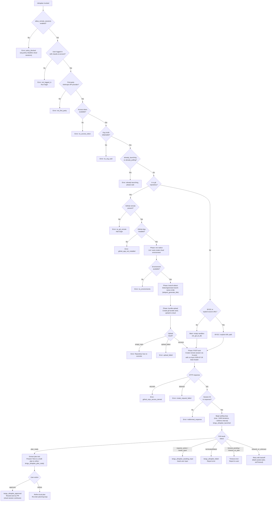

# `/ultraplan`

> Analysis basis: CC v2.1.181 bundle.js (AST extraction + Claude interpretation)
> Minimum version: v2.1.181

---

## Overview

`/ultraplan` launches a cloud-hosted background agent session that drafts an editable plan for the user's prompt inside Claude Code on the web. The command performs multi-phase pre-flight validation (login, git state, GitHub app installation, org policy), uploads the local repository as a git bundle seed to the cloud environment, creates a remote session, and then polls for the result — ultimately presenting a refined plan that the user can approve or further modify. If the remote session cannot be reached or is not permitted, the command falls back with descriptive error states.

---

## Registration

| Field | Value |
|---|---|
| type | `local-jsx` |
| name | `ultraplan` |
| description | `"Draft an editable plan in Claude Code on the web ( ... ) · See  ... "` |
| argumentHint | `<prompt>` |
| load_inline | `true` |
| load_ident | `gtf` |
| loc_byte | `12470063` |
| loc_byte_end | `12470295` |
| loc_line | `8035` |
| arbor_handler.name | `gtf` |
| arbor_handler.fqn | `claude-2.1.181::gtf` |
| arbor_handler.kind | `AsyncFunction` |
| arbor_handler.resolution_path | `load_ident` |
| arbor_handler.n_hits | `1` |

Analysis basis: CC v2.1.181 bundle.js:+12470063

The handler was inlined into a `load:()=>Promise.resolve({call: gtf})` shape; the Arbor symbol graph resolved it via `load_ident` with exactly 1 hit. `gtf` is the authoritative handler name used in pseudocode and the Appendix below.

---

## Input Branching

The command has many distinct precondition branches (login check, `allow_remote_sessions` policy, first-party API check, git repo state, GitHub app installation, org policy, environment availability, bundle upload, session creation, polling outcome) — well above the 3-branch threshold. A Mermaid flowchart is used.



Analysis basis: CC v2.1.181 bundle.js:+12468198, +12468219, +12465645, +12465663, +8577883, +8578385, +8578231, +8563460, +8563594, +8563952, +8564248, +12466824, +12465710

---

## Behavioral Spec

### 1. Handler Entry — `gtf` (AsyncFunction)

The handler `gtf` is the top-level async entry point resolved via `load_ident`.

```
async function handleUltraplan(context, args):
    appState = context.getAppState()

    // Check allow_remote_sessions policy flag
    if not appState.allow_remote_sessions:
        return policyError("policy_blocked", "Cloud sessions are disabled...")

    // Resolve prompt text from args
    promptText = extractPrompt(args)          // via p6n

    // Evaluate session eligibility (ii)
    eligibility = checkEligibility(appState)  // login, first-party, token, org UUID

    if eligibility.failed:
        return eligibility.error

    // Detect duplicate launch guard
    if sessionState == "already_polling" or sessionState == "already_launching":
        return error("ultraplan: already launching. Please wait...")

    // Build launch parameters
    launchParams = buildLaunchParams(promptText, appState)  // via CGt

    // Execute the cloud teleport workflow
    result = await teleportAndPoll(launchParams)            // via htf → Tge → ska

    // Reflect outcome into appState
    context.setAppState(updatedState)

    return renderResult(result)
```

Analysis basis: CC v2.1.181 bundle.js:+12468198, +12468533, +12468755

---

### 2. Prompt Extraction — `p6n`

Parses the raw argument string to isolate the user's planning prompt.

```
function extractPrompt(rawArgs):
    // Scan for "ultraplan" keyword anywhere in rawArgs (case-insensitive, global flag "gi")
    // bundle.js:+10925700, +10926052
    if rawArgs.startsWith("ultraplan"):
        slice off the command word     // e.startsWith, bundle.js:+10925302
        rawArgs = rawArgs.slice(...)   // e.slice, bundle.js:+10926280

    // Normalise whitespace runs: replace "$1$2" pattern, limit to 5 spaces
    // bundle.js:+10926377, +10926400
    normalised = rawArgs.replace(normRegex, "$1$2")

    // Apply replace with n.replace -> i.toLowerCase
    // bundle.js:+10926351
    result = normalised.replace(...)

    return result
```

Analysis basis: CC v2.1.181 bundle.js:+10926252, +10925302, +10926280, +10926351, +10926377

---

### 3. Eligibility Check — `ii` / `checkEligibility`

Runs a series of ordered precondition checks before any network call.

```
function checkEligibility(appState):
    // 1. Check V7u set (firstParty provider flag)
    //    bundle.js:+3340671
    if not V7u.has(providerKey):
        return fail("not_first_party",
                    "Cloud sessions are only available on the first-party Anthropic API provider.")

    // 2. Check K7u set (login / access token)
    //    bundle.js:+3340703
    if not K7u.has(authKey):
        return fail("not_logged_in",
                    "Please run /login and sign in with your Claude.ai account (not Console).")

    // 3. Check allow_product_feedback / telemetry consent
    //    bundle.js:+3340727
    telemetryMode = resolveTelemetryMode(appState)   // via ta -> qYo -> rt

    // 4. Evaluate enterprise/team tier checks
    //    bundle.js:+3340426, +3340461
    tier = getTier(appState)   // via tB: firstParty / enterprise / team checks

    // 5. Read config file (utf-8) to obtain org-level settings
    //    bundle.js:+3340534, via cxt -> zfi.readFileSync
    config = readConfigFile("utf-8")

    // 6. Validate feature flags (rme -> rt)
    //    bundle.js:+3340753
    validateFeatureFlags(config)

    return eligibility
```

Analysis basis: CC v2.1.181 bundle.js:+3340671, +3340703, +3340727, +3340153, +3340534

---

### 4. Session Launch Orchestration — `CGt`

Coordinates the full remote session lifecycle: guard checks, environment selection, bundle upload, session POST, and polling dispatch.

```
async function launchSession(params, appState):
    // Mark state as "already_launching" to prevent re-entry
    // bundle.js:+12465645, +12465663
    setState("already_launching")

    try:
        // Perform remote-eligibility pre-flight (qaa)
        // bundle.js:+12465463 (Qe -> Rht), telemetry: tengu_ccr_bundle_seed_enabled
        eligibility = await checkRemoteEligibility(appState)
        if not eligibility.ok:
            emit("tengu_ultraplan_create_failed")   // bundle.js:+12465423
            return eligibility.error

        // Set up abort/cancel tracking (s -> r.add / r.delete)
        // bundle.js:+12465579
        registerAbortHandler()

        // Resolve cloud environment (ZWn -> QWn -> ut)
        // bundle.js:+12465799
        environment = await selectEnvironment(appState)

        // Execute teleport workflow (htf)
        // bundle.js:+12465913
        sessionResult = await executeTeleport(params, environment)

        // Mark state as "already_polling"
        setState("already_polling")

        // Dispatch polling loop (ftf)
        // bundle.js:+12466020
        pollResult = await pollSession(sessionResult.sessionId)

        return pollResult
    finally:
        clearLaunchGuard()
```

Analysis basis: CC v2.1.181 bundle.js:+12465386, +12465421, +12465463, +12465500, +12465579, +12465686, +12465799, +12465913, +12466020

---

### 5. Remote Eligibility Pre-flight — `qaa`

Validates that the repository, GitHub remote, GitHub App installation, and org policy all permit a cloud session.

```
async function checkRemoteEligibility(appState):
    // Check not in git repo
    // bundle.js:+8577984
    if not inGitRepo(appState):
        return fail("not_in_git_repo")

    // Check BYOC seed bundle enabled
    // telemetry: tengu_ccr_bundle_seed_enabled, bundle.js:+7175893 (YU)
    seedEnabled = checkSeedBundleEnabled()

    // Check github.com remote (not BYOC/ghes)
    // bundle.js:+7176092
    remote = getOriginRemote()
    if remote contains "github.com":
        // Standard GitHub path
    elif remote tag == "byoc":
        // bundle.js:+7175804
        byocPath = true

    // GitHub App installation check (ZBe)
    // bundle.js:+7176116
    appInstalled = await checkGithubAppInstalled(appState)
    if not appInstalled:
        return fail("github_app_not_installed")

    return ok()
```

Analysis basis: CC v2.1.181 bundle.js:+7175423, +7175493, +7175804, +7175893, +7176092, +7176116

---

### 6. Teleport Workflow — `htf` / `executeTeleport`

Runs the multi-phase cloud teleport: environment resolution → branch detection → bundle upload → session POST.

```
async function executeTeleport(params, appState):
    // Phase: env-select (Vle -> qaa, a6)
    // bundle.js:+12466155
    env = await selectOrCreateEnvironment(appState)
    if not env:
        return fail("no_environments", "No environments available for session creation")

    // Build precondition check object
    // bundle.js:+12466238 ("precondition")
    precondition = buildPrecondition(appState, env)

    // Phase: branch-detect (Qfp -> teleport_generate_title)
    // bundle.js:+12466235, +8551469
    branchInfo = await detectOrGenerateBranch(params.prompt)
    // Generates: { title: "...", branch: "claude/task/{description}" }
    // Max branch segment: 75 chars, bundle.js:+8551165

    // Phase: bundle-upload (jro -> teleport_git_bundle_upload)
    // bundle.js:+8547787
    bundleResult = await uploadGitBundle(appState)
    // Modes: head / fallback_head / squashed / fallback_squashed / empty
    // bundle.js:+8549760, +8549799, +8549834, +8549877

    // Build session creation payload (tka -> qat.randomUUID)
    // bundle.js:+8565174, +8562779
    sessionPayload = buildSessionPayload(params, branchInfo, bundleResult)
    // Includes: anthropic-beta: "ccr-byoc-2025-07-29", bundle.js:+8564425
    // Includes: x-organization-uuid header, bundle.js:+8564447

    // POST session creation (ho.post)
    // bundle.js:+8565648
    response = await ho.post(sessionCreationEndpoint, sessionPayload)

    // Validate HTTP response codes
    // bundle.js:+8565704 (500), +8565740 (201), +8565809 (401), +8565813 (403), +8565817 (429)
    if response.status == 201:
        if not response.data.sessionId:
            return fail("malformed_response", "Server returned a malformed session response (no session id)")
        emit("tengu_ultraplan_launched")
        return { sessionId: response.data.sessionId, env: env }
    else:
        return fail("create_request_failed")
```

Analysis basis: CC v2.1.181 bundle.js:+12466155, +12466235, +12466238, +12466482, +12466515, +8547787, +8565648, +8565740, +8566314, +8566377

---

### 7. Session Polling Loop — `ptf` / `gyl`

Polls the remote session until a terminal state or timeout is reached.

```
async function pollSession(sessionId, appState):
    // Max iterations: 5400 (bundle.js:+12460952)
    // Poll interval: 1000 ms (bundle.js:+8584525)
    // Maximum session duration wall clock: 1800000 ms = 30 minutes (bundle.js:+8584532)
    // Timeout counter unit: 60000 ms = 1 minute (bundle.js:+12453098)

    startTime = Date.now()
    iteration = 0

    emit("tengu_ultraplan_timeout_seconds")   // record configured timeout

    loop:
        if iteration >= 5400:
            return fail("timeout_pending")

        response = await fetchSessionState(sessionId)   // via itf -> ut

        switch response.status:
            case "plan_ready":
                emit("tengu_ultraplan_plan_ready")
                planText = extractPlanText(response)
                // Present: "Here is a draft plan to refine:" + planText
                // bundle.js:+12461259
                return awaitUserAction(planText)

            case "requires_action", "needs_input":
                emit("tengu_ultraplan_awaiting_input")
                return promptUserForInput(response)

            case "approved":
                emit("tengu_ultraplan_approved")
                // Inject system message: "Results will land as a pull request..."
                // bundle.js:+12462540
                return systemMessage("Results will land as a pull request when the cloud session finishes. There is nothing to do here.")

            case "terminated", "failed":
                emit("tengu_ultraplan_failed")
                // Inject: "Cloud ultraplan session failed. Wait for the user's next instructions."
                // bundle.js:+12463363
                return fail("cloud session returned an error")

            case "running", "starting", "pending":
                // Continue polling
                await sleep(1000)
                iteration++

            case "network_or_unknown":
                // Retry with jitter: Math.random * 2 + 1 seconds
                // bundle.js:+14249544, +14249546, +14249560
                jitter = Math.random() * 2 + 1
                await setTimeout(jitter * 1000)
                iteration++

        elapsed = Date.now() - startTime
        if elapsed > 1800000:
            return fail("cloud session exceeded 30 minutes")

    return fail("timeout_no_plan")
```

Analysis basis: CC v2.1.181 bundle.js:+12460952, +12451780, +8584525, +8584532, +12453098, +12461259, +12462540, +12463363, +12452968, +12452916, +12452591, +12452663

---

### 8. Git Bundle Upload — `jro` / `uploadGitBundle`

Packages the local repository and uploads it to the cloud environment as a seed bundle.

```
async function uploadGitBundle(appState):
    // Verify git repository state
    // bundle.js:+8547848
    if not isGitRepo():
        return fail("not_in_git_repo", "Not in a git repository")

    // Check for any commits (git for-each-ref --count=1 refs/)
    // bundle.js:+8547990, +8548005, +8548017
    if noCommitsYet():
        return fail("empty_repo", "Repository has no commits yet")
        // User message: "Repository has no commits — run `git add . && git commit -m \"initial\"` then retry"
        // bundle.js:+8569805

    // Create git stash bundle (refs/seed/stash, refs/seed/root)
    // bundle.js:+8547888, +8547906
    stashRef = createGitStash()    // git stash create
    bundlePath = writeBundleFile("ccr-seed.bundle", stashRef)

    // Attempt HEAD bundle upload
    // telemetry: tengu_ccr_bundle_upload, bundle.js:+8548080
    uploadResult = await uploadBundle(bundlePath, mode="head")

    if uploadResult.status == 200:
        // bundle.js:+8548604
        finalMode = determineFinalBundleMode()
        // Possible modes: head / fallback_head / squashed / fallback_squashed
        emit("tengu_teleport_bundle_mode")   // bundle.js:+8564775

    elif uploadResult == "stash_failed":
        // bundle.js:+8548725
        return fail("stash_failed")

    // Clean up temp bundle file (Wat.unlink)
    // bundle.js:+8550035
    cleanupBundle(bundlePath)

    if uploadResult == "failed":
        return fail("upload_failed")   // bundle.js:+8549539

    return { mode: finalMode, bundleRef: ... }
```

Analysis basis: CC v2.1.181 bundle.js:+8547758, +8547787, +8547848, +8547888, +8548005, +8548080, +8548604, +8548725, +8549539, +8550035

---

### 9. Environment Selection and Auto-Creation — `a6` / `selectOrCreateEnvironment`

Lists available cloud environments and auto-creates a default one if none exist.

```
async function selectOrCreateEnvironment(appState):
    // Fetch environment list (Ree -> teleport_environments_list)
    // bundle.js:+7171029
    envList = await fetchEnvironments(accessToken, orgUUID)
    // Requires: timeout 15000 ms, bundle.js:+7171664
    // Requires: first-party API, bundle.js:+7171103

    if envList.length == 0:
        // Auto-create default environment (zot -> teleport_default_environment_create)
        // bundle.js:+7171949
        newEnv = await createDefaultEnvironment({
            name: "Default",
            type: "anthropic_cloud",
            workdir: "/home/user",
            runtime: { python: "3.11", node: "20" }
            // bundle.js:+7172364, +7172394, +7172470, +7172532, +7172549, +7172563, +7172578
        })
        if creation failed:
            log("warn", "Could not create a cloud environment. Set one up at https://claude.ai/code/onboarding?magic=env-setup")
            // bundle.js:+8566791
            return fail("no_default_env")
        emit("env_create")   // bundle.js:+8566895
        return newEnv

    // Select best matching environment
    // Priority: "bridge" type first, then default
    // bundle.js:+8567771
    selected = envList.find(e => e.type == "bridge") ?? envList[0]

    if not selected:
        return fail("no_environments", "No environments available for session creation")
        // bundle.js:+8567813, +8567930

    return selected
```

Analysis basis: CC v2.1.181 bundle.js:+7171029, +7171664, +7171949, +8566791, +8566895, +8567771, +8567813

---

### 10. Branch / Title Generation — `Qfp` / `detectOrGenerateBranch`

Generates a branch name and task title for the cloud session using the model.

```
async function detectOrGenerateBranch(promptText):
    // Construct branch name template: "claude/task/{description}"
    // bundle.js:+8551171, +8551207
    branchTemplate = "claude/task/{description}"

    // Max description segment: 75 characters, bundle.js:+8551165
    // Schema type: json_schema with fields: title (string), branch (string)
    // bundle.js:+8551291, +8551395, +8551403

    // Call model to generate title/branch
    // telemetry: teleport_generate_title, bundle.js:+8551469
    result = await callModel({
        prompt: promptText,
        schema: { title: "string", branch: "string" },
        responseFormat: "json_schema"
    })

    // Sanitise branch name: replace illegal chars (Jfp.replace)
    // bundle.js:+8551195
    sanitisedBranch = result.branch.replace(illegalCharsRegex, "")

    return { title: result.title, branch: sanitisedBranch }
```

Analysis basis: CC v2.1.181 bundle.js:+8551160, +8551165, +8551171, +8551207, +8551291, +8551469

---

### 11. Remote Session State Machine — `ska` / `pollRemoteSessionState`

Ingests streaming events from the remote session and maps them to local state transitions.

```
async function pollRemoteSessionState(sessionId, options):
    // Poll interval: 1000 ms, max duration: 1800000 ms
    // bundle.js:+8584525, +8584532
    startTime = Date.now()

    loop:
        event = await fetchNextEvent(sessionId)

        switch event.type:
            case "SessionStart":
                // bundle.js:+8586332
                setState("starting")

            case "hook_started":
                // bundle.js:+8586242
                setState("hook_started")

            case "hook_progress":
                // bundle.js:+8585722
                emitProgress(event.data)

            case "hook_response":
                // bundle.js:+8585751
                processHookResponse(event.data)

            case "result":
                // bundle.js:+8585539
                return parseResult(event.data)

            case "idle":
                // bundle.js:+8586158
                setState("idle")

        if event.status in ["archived", "completed"]:
            // bundle.js:+8584976, +8585051
            return terminalResult(event)

        if (Date.now() - startTime) > 1800000:
            return fail("cloud session exceeded 30 minutes")
            // bundle.js:+8587173

        await sleep(1000)
```

Analysis basis: CC v2.1.181 bundle.js:+8583167, +8584525, +8584532, +8585539, +8585722, +8585751, +8586158, +8586242, +8586332, +8587173

---

### 12. Background Session Manager — `f` / `manageBgSession`

Spawns and manages the background daemon process that bridges local Claude Code with the cloud session.

```
async function manageBgSession(sessionConfig):
    // Check memory before dispatching (N1o.freemem)
    // bundle.js:+17101752; telemetry: tengu_bg_dispatch_low_mem
    freeMem = process.freemem()
    if freeMem < threshold:
        emit("tengu_bg_dispatch_low_mem")
        // Platform-specific: macos, bundle.js:+13267617

    // Establish socket connection to daemon (x1o -> jQn.connect)
    // bundle.js:+17077652
    socket = await claimDaemonSocket()
    emit("tengu_bg_spare_claim")   // bundle.js:+17102747

    // Spawn daemon if not present (Dq.spawn)
    // bundle.js:+17103076
    if daemonNotRunning:
        spawnDaemon()
        waitForConnect()

    // Register session with daemon
    // telemetry: tengu_daemon_bg_session_create, bundle.js:+17101637 (via Me)
    session = await registerWithDaemon(sessionConfig)

    // Track session lifecycle (O1o)
    // bundle.js:+17102726
    trackSession(session, {
        onDone: () => setState("done"),
        onKilled: () => setState("killed"),
        onCrashed: () => setState("crashed")
    })

    // Escalate SIGKILL if process unresponsive after 30s
    // bundle.js:+17101276, telemetry: tengu_bg_dispatch_sigkill_escalate
    if processStuckFor(30_seconds):
        escalate("SIGKILL")
        emit("tengu_bg_dispatch_sigkill_escalate")
```

Analysis basis: CC v2.1.181 bundle.js:+17101637, +17101752, +17101276, +17102726, +17103076, +17077652

---

### 13. App State Reads and Writes

At entry and exit, the handler interacts with global application state:

```
// Entry: read current app state
appState = context.getAppState()          // bundle.js:+12468533

// Availability check: "allow_remote_sessions" flag
// bundle.js:+12468219
allowed = appState.allow_remote_sessions

// On completion: write updated state
context.setAppState(newState)             // bundle.js:+12468755

// khe.setState used inside task management (M0n)
// bundle.js:+7035898
khe.setState(taskUpdate)
```

Analysis basis: CC v2.1.181 bundle.js:+12468533, +12468755, +12468219

---

## State & Side Effects

| Item | Detail |
|---|---|
| Telemetry: `tengu_ultraplan_create_failed` | Fired when pre-flight eligibility check fails (bundle.js:+12465423) |
| Telemetry: `tengu_ultraplan_prompt_identifier` | Fired when prompt is extracted/identified (bundle.js:+12461085) |
| Telemetry: `tengu_ultraplan_launched` | Fired after successful session creation POST (bundle.js:+12467130) |
| Telemetry: `tengu_ultraplan_timeout_seconds` | Records configured timeout value at poll start (bundle.js:+12460918) |
| Telemetry: `tengu_ultraplan_awaiting_input` | Fired when session enters `requires_action` / `needs_input` state (bundle.js:+12461562) |
| Telemetry: `tengu_ultraplan_plan_ready` | Fired when session returns a completed plan (bundle.js:+12461630) |
| Telemetry: `tengu_ultraplan_approved` | Fired when user approves the plan (bundle.js:+12462050) |
| Telemetry: `tengu_ultraplan_failed` | Fired when remote session terminates in a failure state (bundle.js:+12462939) |
| Telemetry: `tengu_ccr_bundle_seed_enabled` | Fired during remote eligibility check (bundle.js:+7175896) |
| Telemetry: `tengu_ccr_bundle_upload` | Fired during git bundle upload phase (bundle.js:+8548080) |
| Telemetry: `tengu_teleport_bundle_mode` | Records which bundle upload mode was selected (bundle.js:+8564775) |
| Telemetry: `tengu_ccr_session_link` | Records session link after creation (bundle.js:+8558089) |
| Telemetry: `tengu_teleport_source_decision` | Records source type decision (bundle.js:+8570376) |
| Telemetry: `tengu_config_parse_error` | Fired when config file parsing fails (bundle.js:+13941803) |
| Telemetry: `tengu_bg_dispatch_sigkill_escalate` | Fired when background process requires SIGKILL escalation (bundle.js:+17101321) |
| Telemetry: `tengu_bg_dispatch_low_mem` | Fired when free memory is below threshold at dispatch time (bundle.js:+17101922) |
| Telemetry: `tengu_bg_spare_enable` | Fired when spare daemon slot is enabled (bundle.js:+17102619) |
| Telemetry: `tengu_bg_spare_claim` | Fired when a spare daemon process is claimed (bundle.js:+17102747) |
| Telemetry: `tengu_bg_spare_claim_fail` | Fired when spare claim fails (bundle.js:+17103013) |
| Telemetry: `tengu_bg_sendclaim_failed` | Fired when send-claim to daemon socket fails (bundle.js:+17077853) |
| Telemetry: `tengu_bg_low_mem_mb` | Records available memory in MB (bundle.js:+13267644) |
| Telemetry: `tengu_scheduled_task_missed` | Fired when a scheduled task is missed (bundle.js:+16570809) |
| Telemetry: `tengu_feature_ok` | Feature flag validated successfully (bundle.js:+1019804) |
| Telemetry: `tengu_feature_bad` | Feature flag validation failed (bundle.js:+1019871) |
| Hook registration | `Gi` calls `v$o.register` (bundle.js:+65579) to register task-notification hooks |
| appState changes | Reads `allow_remote_sessions` on entry (bundle.js:+12468219); writes updated session state on exit (bundle.js:+12468755); `khe.setState` used for task state updates (bundle.js:+7035898) |
| Session guard flags | Sets `already_launching` (bundle.js:+12465663) then `already_polling` (bundle.js:+12465645) to prevent re-entrant calls; cleared in `finally` block |
| File I/O | Reads local git config (`remote.origin.url` via `git config --get`, bundle.js:+1148743, +1148751); creates and uploads a temporary `ccr-seed.bundle` file, then unlinks it (bundle.js:+8549094, +8550035); reads config file with UTF-8 encoding (bundle.js:+3340534) |
| Network | HTTP POST to session-creation endpoint with header `anthropic-beta: ccr-byoc-2025-07-29` (bundle.js:+8564425); HTTP GET for environment list with 15 000 ms timeout (bundle.js:+7171664); long-poll with 1 000 ms intervals up to 30 minutes (bundle.js:+8584525, +8584532) |
| Sound | <!-- TODO: not found in depth-2 traversal; needs --depth 4 --> |

---

## Version History

| Version | Change |
|---|---|
| v2.1.181 | Initial analysis |

---

## Common Mistakes

1. **Invoking without a claude.ai login**: `/ultraplan` requires authentication via `/login` using a Claude.ai account (not a Console API key). Running with only an API key results in a `not_logged_in` or `not_first_party` error immediately.
2. **Using on a non-Anthropic API provider**: The command checks a `firstParty` flag; third-party or custom API providers cause a `not_first_party` failure before any network request.
3. **Repository has no commits**: The git bundle upload phase will fail with an `empty_repo` error if the working directory has no commits. The fix is to run `git add . && git commit -m "initial"` first.
4. **No GitHub remote configured**: A `github.com` remote (`git remote add origin REPO_URL`) is required for the standard path. Missing remotes produce a `no_git_remote` error with a clear message.
5. **GitHub App not installed**: Even with a valid remote, the GitHub App must be installed on the target repository. The error `github_app_not_installed` is surfaced with a link to `https://claude.ai/code` for setup.
6. **Re-invoking while a session is launching or polling**: The command is guarded by `already_launching` and `already_polling` flags. A second invocation before the first session completes returns the message `"ultraplan: already launching. Please wait for the session to start."` (bundle.js:+12464198).
7. **Organization policy blocking cloud sessions**: Enterprise or team administrators can disable cloud sessions entirely (`policy_blocked`). The error message directs users to contact their organization admin. This policy is evaluated via the `allow_remote_sessions` flag in `appState`.

---

## Appendix — Identifier Mapping

> For bundle debugging only. Identifiers change across versions.

| Identifier | Role |
|---|---|
| `gtf` | Top-level async handler for `/ultraplan` (Arbor-resolved, AsyncFunction) |
| `p6n` | Prompt extraction / argument parser |
| `d6n` | Prompt parsing helper (depth-2 under `p6n`) |
| `mho` | Prompt tokenisation / keyword scanning (finds "ultraplan" in text) |
| `ii` | Eligibility check orchestrator (login, first-party, org tier) |
| `Xfi` | Eligibility sub-checker (depth-2 under `ii`) |
| `dz` | Config file reader and tier evaluator |
| `tB` | Tier / provider type resolver (`firstParty`, `enterprise`, `team`) |
| `cxt` | Config file parse helper (readFileSync, utf-8) |
| `Ame` | Feature-flag validator |
| `ta` | Telemetry consent resolver |
| `qYo` | Telemetry mode helper |
| `rt` | String-to-result converter (used in eligibility and telemetry) |
| `rme` | Remote session feature-flag check |
| `ste` | State accessor / setter helper |
| `CGt` | Session launch orchestrator (guard → eligibility → env → teleport → poll) |
| `Qe` | UI notification emitter |
| `Rht` | Base notification/render primitive |
| `Iyl` | Launch-state flag manager |
| `ZWn` | Environment resolution wrapper |
| `QWn` | Environment fetch inner function |
| `ut` | Environment list fetcher (HTTP) |
| `ltf` | Environment list transformer |
| `htf` | Teleport workflow executor (env-select → branch-detect → bundle-upload → POST) |
| `Vle` | Environment selection helper |
| `qaa` | Remote eligibility pre-flight (git repo, GitHub remote, app install) |
| `Cs` | HTTP client wrapper |
| `fx` | HTTP client factory |
| `Mf` | HTTP middleware / interceptor |
| `dtf` | Draft plan text assembler |
| `utf` | Plan text formatter |
| `a6` | Core teleport logic (all cloud API calls, session payload building) |
| `Mt` | Model/message builder |
| `Ac` | API credential accessor |
| `Ch` | Auth token refresh helper |
| `TUn` | Request header builder (bearer token, org UUID) |
| `ke` | Access token retrieval (with error push to `QVe`) |
| `F2` | Organisation UUID resolver |
| `ks` | OAuth endpoint resolver (`local` / `staging` / `prod`) |
| `jE` | JSON API headers builder (`Content-Type`, `anthropic-version`) |
| `jro` | Git bundle upload workflow (`teleport_git_bundle_upload`) |
| `Lt` | HTTP timeout helper |
| `I` | Log-level router (`debug` / `warn` / `error`) |
| `$e` | React/JSX render helper |
| `UO` | Git remote URL resolver (`git config --get remote.origin.url`) |
| `tka` | Session payload constructor (UUID generation, event fields) |
| `U1t` | Session payload finaliser |
| `Re` | JSON serialiser wrapper |
| `ne` | Notification / event emitter |
| `eka` | Session link telemetry emitter (`tengu_ccr_session_link`) |
| `ckn` | Cancel/abort token factory |
| `Ree` | Environment list fetcher (`teleport_environments_list`) |
| `zot` | Default environment creator (`teleport_default_environment_create`) |
| `Ee` | Error-to-string converter |
| `c` | Background-session list accessor |
| `Qfp` | Branch name / title generator (`teleport_generate_title`) |
| `YU` | Token/cache store updater |
| `ZBe` | GitHub App installation checker |
| `FO` | Git default branch detector (`symbolic-ref`, `show-ref`) |
| `Ns` | Git remote URL parser / normaliser |
| `ioe` | URL scheme validator (`https` / `http`) |
| `V` | stdio write helper |
| `re` | String trim / normalise helper |
| `Ho` | Error constructor wrapper |
| `AH` | Abort-signal handler |
| `KH` | Cancellation check helper |
| `Ay` | Endpoint / base URL resolver (local / staging / prod) |
| `Mr` | HTTP client initialiser |
| `R8r` | HTTP retry handler |
| `mtf` | Task-notification message formatter |
| `Tge` | Remote-agent session manager (`remote_agent`) |
| `XB` | Session random ID generator (IPl.randomBytes) |
| `Kat` | Session file system setup (Rne.open) |
| `o0` | Session timestamp recorder |
| `amp` | Session metadata builder |
| `ska` | Session state polling loop (streaming event consumer) |
| `RM` | Task state machine (task_started / task_updated) |
| `qRp` | Task-started handler |
| `jRp` | Task-updated handler |
| `M0n` | Task state writer (`khe.setState`) |
| `Wpo` | Task state broadcaster |
| `VRp` | Task timestamp updater |
| `KRp` | Task batch updater (`Object.keys`) |
| `Lce` | Task entry builder (`user_typed`, `active`, `aborted`) |
| `ptf` | Poll loop driver (iterates `gyl`, dispatches to `itf`) |
| `gyl` | Individual poll tick (fetch + ingest + state transition) |
| `itf` | Session state fetcher |
| `Atf` | Poll result accumulator |
| `b$t` | Temporary file cleanup (Ol.unlink) |
| `o` | Column formatter (padEnd) |
| `l6` | Final plan delivery HTTP POST |
| `Gi` | Hook registration (`v$o.register`, task-notification) |
| `ftf` | Polling dispatcher (called after launch guard set to `already_polling`) |
| `It` | Watcher / config reader orchestrator |
| `jt` | File system path helper |
| `p0o` | Config path builder |
| `w_e` | Full config read-and-migrate (readFileSync, mkdirSync, copyFileSync) |
| `Wt` | JSON.parse wrapper |
| `x9` | Path prefix stripper |
| `ln` | Logger |
| `uUl` | Backup directory scanner |
| `h0o` | Backup path builder (TS.join) |
| `l` | Symlink resolver |
| `f` | Background process lifecycle manager (spawn, SIGKILL, socket) |
| `M` | Background process executor (spawn + env map) |
| `Fn` | Subprocess wrapper with timeout/abort |
| `Me` | Daemon session create emitter (`tengu_daemon_bg_session_create`) |
| `xe` | Feature-ok emitter (`tengu_feature_ok`) |
| `aKn` | Memory sampler (`tengu_bg_low_mem_mb`) |
| `H$e` | Stale file remover (cT.lstat / cT.rm / cT.readFile) |
| `F` | Permission classifier (`allow` / `deny` / `classify` / `ask`) |
| `x1o` | Daemon socket claim + connect (Dq.claim, jQn.connect) |
| `O1o` | Session lifecycle tracker (r.add/r.delete, Ig.rm/Ig.unlink) |
| `p` | Process exit handler (BT, process.exit, u.abort) |
| `$` | Disposable resource manager |
| `Byf` | File watcher (Zzn.watchFile / Zzn.unwatchFile) |
| `kq` | File watch debouncer |
| `Lft` | Parallel prerequisite resolver (Promise.all over UO, YU, Ru, Mt, ZBe) |

---

Note: index built via Arbor fallback; some signals (telemetry, literals) may be missing — see arbor-fallback.js.