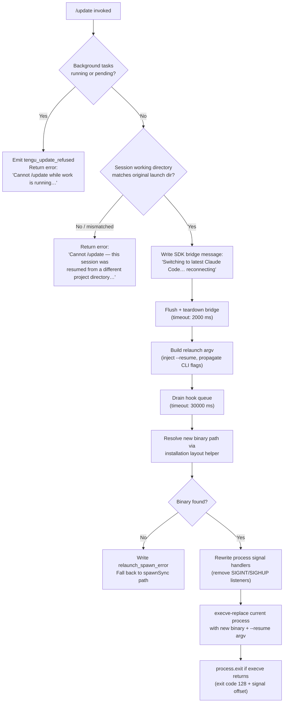

# `/update`

> Analysis basis: CC v2.1.181 bundle.js (AST extraction + Claude interpretation)
> Minimum version: v2.1.181

---

## Overview

The `/update` command switches a running Claude Code session to the latest installed version without ending the conversation. It validates that no background work is in progress and that the session's working directory matches the original launch directory, then performs an in-place process replacement (`execve`-style relaunch) with `--resume` injected into the argument vector so the conversation continues seamlessly on the new binary.

---

## Registration

| Field | Value |
|---|---|
| type | `local` |
| name | `update` |
| description | `Switch to the latest version (conversation continues)` |
| isHidden | `true` |
| supportsNonInteractive | `false` |
| module_id | `fwl` |
| load_inline | `true` |
| loc_byte | `12906146` |
| loc_byte_end | `12906387` |
| loc_line | `8499` |
| arbor_handler.name | `laf` |
| arbor_handler.fqn | `claude-2.1.181::laf` |
| arbor_handler.kind | `AsyncFunction` |
| arbor_handler.resolution_path | `module_id` |
| arbor_handler.n_hits | `0` |

Analysis basis: CC v2.1.181 bundle.js:+12906146

---

## Input Branching

The handler (`laf`) evaluates four distinct states before proceeding with a relaunch, making a Mermaid flowchart the appropriate representation.



---

## Behavioral Spec

### Pre-flight Guard: Background Work Check

Analysis basis: CC v2.1.181 bundle.js:+12904028

```
function checkNoBackgroundWork(appContext):
    statusSet = collectBackgroundTaskStatuses(appContext)
    # statuses considered blocking: "running", "pending"
    if any status in statusSet is "running" or "pending":
        emit telemetry("tengu_update_refused")
        return Error("Cannot /update while work is running in the background — wait for it to finish, then try again.")
    return OK
```

The blocking status strings `"running"` and `"pending"` are literal constants in the bundle.
Analysis basis: CC v2.1.181 bundle.js:+12904303, +12904325

### Pre-flight Guard: Working-Directory Consistency

Analysis basis: CC v2.1.181 bundle.js:+12904650

```
function checkWorkingDirectory(appState):
    originalDir = appState.getField("working_directory")   # from session init
    currentDir  = process.cwd()
    if originalDir != currentDir:
        return Error("Cannot /update — this session was resumed from a different project directory. Restart manually with --resume to continue on the latest version.")
    return OK
```

Error literal: `"Cannot /update — this session was resumed from a different project directory…"` (truncated for citation).
Analysis basis: CC v2.1.181 bundle.js:+12904650

### User-Visible Progress Message

```
function emitSwitchingMessage(bridgeWriter):
    bridgeWriter.writeSdkMessages([{
        role: "assistant",
        content: [{ type: "text", value: "Switching to latest Claude Code… reconnecting" }]
    }])
```

Literal message: `"Switching to latest Claude Code… reconnecting"`.
Analysis basis: CC v2.1.181 bundle.js:+12905135

### Bridge Flush and Teardown

```
async function flushAndTeardownBridge(bridge):
    await timedRace(bridge.flush(), timeoutMs=2000, label="bridge flush")
    bridge.teardown()
```

Timeout constant: 2000 ms (`"bridge flush"` label).
Analysis basis: CC v2.1.181 bundle.js:+12905205, +12905215, +12905220

### Relaunch Argument Vector Construction

Analysis basis: CC v2.1.181 bundle.js:+12905460

```
function buildRelaunchArgv(originalArgv, appState):
    args = Array.from(originalArgv)

    # Inject --resume so the new process re-attaches the conversation
    args.push("--resume", currentSessionId)

    # Propagate additional dirs registered during this session
    for dir in additionalDirs:
        args.push("--add-dir", dir)

    # Re-emit flag settings captured at startup
    # (--allow-dangerously-skip-permissions, --effort, --permission-mode)
    propagateFlagSettings(args, appState)

    return args
```

Relevant CLI flag literals: `"--resume"`, `"--add-dir"`, `"--allow-dangerously-skip-permissions"`, `"--effort"`, `"--permission-mode"`.
Analysis basis: CC v2.1.181 bundle.js:+12639553, +12641077, +12641192, +12641334, +12641351

### Installation Layout Resolution

The handler calls the version-directory resolver (`QF` → `nUn`) to locate the latest binary:

```
function resolveLatestBinaryPath():
    versionsDir = path.join(homeDir(), ".local", "share", "versions")
    # nUn enumerates entries, picks latest semver, returns bin path
    latestVersionDir = pickLatestVersion(versionsDir)
    binaryPath = path.join(latestVersionDir, "bin", "claude")
    return binaryPath
```

Path fragment literals: `".local"`, `"share"`, `"versions"`, `"bin"`.
Analysis basis: CC v2.1.181 bundle.js:+7006682, +7006691, +8487740, +7006762

Additionally, `Bun.which("claude")` is called as a fallback binary locator.
Analysis basis: CC v2.1.181 bundle.js:+861416

### Hook Queue Drain

```
async function drainHookQueue():
    await timedRace(
        hookQueue.drain(),
        timeoutMs = 30000,
        label     = "flush timeout (relaunch)"
    )
    # Second gate for cleanup steps
    await timedRace(
        runCleanupCallbacks(),
        timeoutMs = 30000,
        label     = "cleanup timeout"
    )
    await timedRace(
        analyticsFlush(),
        timeoutMs = 30000,
        label     = "analytics flush timeout"
    )
```

Timeout constants: 30000 ms across all three gates.
Analysis basis: CC v2.1.181 bundle.js:+12639620, +12639626, +12639682, +12639738

### Signal-Handler Rewrite and execve Replacement

```
function relaunchProcess(binaryPath, argv):
    process.removeAllListeners("SIGINT")
    process.removeAllListeners("SIGHUP")
    process.on("beforeExit", noOp)
    process.on("exit", noOp)

    result = nbl.spawnSync(binaryPath, argv, { stdio: "inherit" })

    if result indicates spawn error:
        writeFileSync(errorLogPath, "relaunch_spawn_error")
        process.exit(128 + signalCode)

    # On POSIX the execve call replaces this process image entirely;
    # the lines below are only reached if execve fails.
    process.kill(process.pid, "SIGTERM")
    process.exit(128)
```

Literals: `"SIGINT"`, `"SIGHUP"`, `"beforeExit"`, `"exit"`, `"relaunch_spawn_error"`, `"inherit"`, `128`.
Analysis basis: CC v2.1.181 bundle.js:+12640093, +12640112, +12640152, +12640179, +12640268, +12640309, +12640401, +12640428, +12640493, +12640541

### Native Library Loading (macOS / Linux)

Before calling `execve`, the handler loads the system C library via Bun FFI to obtain a direct `execve` pointer:

```
function loadExecveSymbol(platform):
    if platform == "macos":
        lib = dlopen("/usr/lib/libSystem.B.dylib", { execve: { args: ["ptr","ptr","ptr"], returns: "int" } })
    else:   # Linux
        lib = dlopen("libc.so.6",                  { execve: { args: ["ptr","ptr","ptr"], returns: "int" } })
    return lib.symbols.execve
```

Literals: `"macos"`, `"/usr/lib/libSystem.B.dylib"`, `"libc.so.6"`, `"bun:ffi"`, `"ptr"`, `"int"`.
Analysis basis: CC v2.1.181 bundle.js:+12638657, +12638693, +12638701, +12638730, +12638757, +12638784

### App-State Snapshot and Restoration

```
function snapshotAppState(context):
    state = context.getAppState()
    # Fields captured for the resumed session:
    # working_directory, allowed_tools, disallowed_tools,
    # avoid_prompts, bypassPermissions, permission_mode,
    # effort, model, max_thinking_tokens, flag_settings
    serialized = Object.assign({}, state, { uuid: generateUUID() })
    return serialized

function restoreAppStateOnResume(newContext, serialized):
    newContext.setAppState(serialized)
```

Analysis basis: CC v2.1.181 bundle.js:+12904910, +12905025, +12905346

---

## State & Side Effects

| Item | Detail |
|---|---|
| Telemetry | `tengu_update_refused` (emitted when background tasks block the update, +12904042) |
| Telemetry (indirect, relaunch path) | `tengu_scroll_summary` (+7190298), `tengu_amber_creek` (+3542927), `tengu_pewter_brook` (+3542835), `tengu_bg_dispatch_sigkill_escalate` (+17101321), `tengu_bg_spare_enable` (+17102619), `tengu_bg_spare_claim` (+17102747), `tengu_bg_spare_claim_fail` (+17103013), `tengu_daemon_control` (+17138162) |
| SDK bridge | Writes one assistant text message (`"Switching to latest Claude Code… reconnecting"`) before teardown |
| Bridge flush | `bridge.flush()` then `bridge.teardown()` with 2000 ms race timeout |
| Hook / analytics drain | Three separate 30 000 ms races: flush-timeout, cleanup-timeout, analytics-flush-timeout |
| appState changes | Snapshots current app-state (UUID refreshed) for hand-off to resumed process; sets `isHidden`-relevant fields via `setAppState` |
| Process signal handlers | `process.removeAllListeners` for `SIGINT` and `SIGHUP`; `beforeExit` and `exit` handlers replaced with no-ops |
| Native FFI | `dlopen` of system libc to call `execve` directly (Bun FFI, `bun:ffi`) |
| Daemon status file | `daemon.status.json` read/written during daemon coordination (+12998118) |
| File system | Error log written to disk on `relaunch_spawn_error` path via `Ire.writeFileSync` (+198143) |
| Sound | None observed |

---

## Version History

| Version | Change |
|---|---|
| v2.1.181 | Initial analysis |

---

## Common Mistakes

1. **Running `/update` while background tasks are active.** The command checks for `"running"` or `"pending"` task states and refuses with an explicit error. Wait for all background work to complete first.
2. **Session started in a different directory.** If the session's recorded `working_directory` no longer matches `process.cwd()` (e.g. after a manual `cd` or when resumed via `--resume` from elsewhere), `/update` refuses. Use a fresh `claude --resume` invocation from the correct directory instead.
3. **Expecting `/update` to be visible in the command list.** The command is registered with `isHidden: true` and will not appear in autocomplete or help output.
4. **Using `/update` in non-interactive mode.** `supportsNonInteractive: false` means the command is only available in interactive sessions.
5. **Assuming the process stays alive during update.** The mechanism is an `execve`-style replacement of the current process image — the PID will change and any code relying on the old PID (e.g. external monitoring) must be aware of this.

---

## Appendix — Identifier Mapping

> For bundle debugging only. Identifiers change across versions.

| Identifier | Role |
|---|---|
| `laf` | Main async handler for `/update` (Arbor-resolved, `claude-2.1.181::laf`) |
| `Zqn` | Binary/installation locator (calls `TA` for `Bun.which` and `QF` for version-dir resolution) |
| `TA` | `Bun.which` wrapper — locates `"claude"` on `PATH` |
| `xWo` | Inner `Bun.which` call site |
| `QF` | Version-directory resolver — walks `~/.local/share/versions`, calls `nUn` and `$ae` |
| `nUn` | Reads version list from the `versions` directory; joins paths |
| `bA` | `Array.isArray` guard used in version list processing |
| `vhe` | Home-directory path builder (`~/.local/share/…`) |
| `A0n` | `os.homedir()` wrapper |
| `$ae` | Supplementary path builder for version binary location |
| `Ci` | Process-type classifier (filters `"bg"`, `"daemon"`, `"daemon-worker"`) |
| `G1e` | Inner process-type check helper |
| `j` | Logging / debug utility (used throughout handler) |
| `dT` | Binary basename resolver (`path.basename` + `Lt`) |
| `Lt` | Terminal/UI text rendering helper (calls `fx`) |
| `fx` | Low-level text output primitive |
| `qP` | Current working directory accessor |
| `ITo` | Path utility: resolves `dirname` via `sbl.dirname`, renders text via `mg` and `_c` |
| `gr` | Text renderer called from `ITo` |
| `_c` | Secondary text renderer called from `ITo` |
| `Eue` | Error formatting / display helper |
| `vne` | Hook / attachment set membership check (checks `RAf.has`, calls `UKn`) |
| `UKn` | Hook registry helper |
| `NIo` | Conversation entry appender (`t.appendEntry`, `"last-prompt"` tag) |
| `Au` | Hook registration dispatcher (calls `Gi` → `v$o.register`) |
| `Gi` | Hook registration primitive (`v$o.register`) |
| `ke` | Streaming output / telemetry sink (log-error path, pushes to `QVe`) |
| `Ho` | Error constructor wrapper |
| `rt` | String-coercion utility |
| `ta` | Output queue manager (calls `qYo`) |
| `qYo` | Inner output helper (calls `rt`) |
| `fVc` | Ring-buffer manager for output items (`ren.shift` / `ren.push`) |
| `ym` | App-state store accessor (calls `wx`) |
| `wx` | AsyncLocalStorage `getStore` wrapper (`lvr.getStore`) |
| `AE` | App-state field extractor / transformer |
| `cxl` | SDK message writer; also writes `daemon.status.json`, calls `oi`, `sjt`, `Re` |
| `hQ` | Message content formatter (calls `cfe`) |
| `cfe` | Text-content normaliser (`roe`, `t.trim`, 1000 ms constant) |
| `oi` | Telemetry store accessor (`tLu.getStore`) |
| `sjt` | Status-file path builder (`daemon.status.json`) |
| `Re` | `JSON.stringify` wrapper |
| `dwl` | UUID generator (`zGt.randomUUID`) |
| `lu` | Timed-race helper (`Promise.race`, `setTimeout`, `clearTimeout`) |
| `NTe` | Feature-flag checker (`sti.isEnabled`) |
| `bCe` | String coercion helper |
| `xDe` | Relaunch orchestrator: stat check, teardown UI, drain hooks, rebuild args, execve |
| `Q1t` | Interval-clear helper (calls `gXr`) |
| `gXr` | `clearInterval` wrapper |
| `i3e` | Terminal UI unmount helper (`Fhe.writeSync`, `e.unmount`, calls `oF`, `Xyn`) |
| `oF` | Post-unmount cleanup |
| `Xyn` | Terminal restore / ANSI escape writer (`vZ.writeSync`, calls `RFe`, `vFe`, `gL`, `Xp`, `I`) |
| `RFe` | Terminal emulator detector (`b_`, `jyi.coerce`, `yk`; checks Ghostty ≥1.2.0, iTerm ≥3.6.6) |
| `vFe` | Additional terminal-state helper |
| `gL` | tmux / screen multiplexer escape handler (`PUr`, `e.replaceAll`) |
| `Xp` | ANSI escape sequence builder |
| `I` | Log-level / output formatter (debug, includes, toUpperCase, trim) |
| `Ckn` | Scroll-summary telemetry emitter (`tengu_scroll_summary`, calls `sla`, `Ds`) |
| `qw` | Scroll metric accessor |
| `ila` | Scroll metric helper |
| `sla` | Scroll timing calculator (`Date.now`, `Math.max`, `Math.round`, `Object.assign`) |
| `rla` | Scroll sub-metric helper |
| `Ds` | Fullscreen / terminal-mode manager (calls `qV`, `eM`, `BUr`, `uZ`, `$Ur`, `Kr`, `eQu`, `ut`) |
| `qV` | Terminal-mode registry check (`y8c.has`) |
| `eM` | Feature-flag check for fullscreen (`sti.isEnabled`) |
| `BUr` | String helper for terminal-mode path |
| `uZ` | Fullscreen mode teardown (`ZJu`) |
| `$Ur` | Window-type detector (`"windows"` literal, `Boolean`) |
| `Kr` | Fullscreen transition helper (`tj`) |
| `eQu` | Fullscreen cleanup helper |
| `ut` | Terminal raw-mode manager (`txt`, `nxt`, `p4`, `zTe.has`, `Ygn`, `ZLt.add`, `Vj.has`, `Vj.get`, `It`) |
| `eD` | Post-teardown hook runner (`Au`) |
| `DWe` | Hook drain (`v$o.drain`) |
| `l3e` | Async completion wrapper (`Promise.resolve`, `Tkn`, `e`) |
| `Tkn` | Completion signal helper |
| `ebl` | execve executor: validates path, changes dir, loads FFI, builds env, forks/execs |
| `a` | MCP server coordinator during relaunch (`DBe`, `bQn`, `kOo`) |
| `DBe` | MCP connection builder (stdio/sse/http/sse-ide/ws-ide) |
| `bQn` | MCP update applicator (`e.applyMcpUpdate`, `kBe`, `sn`, `kL`, `iE`) |
| `kOo` | MCP client roster reconciler (`DBe`, `bQn`, `Xrt`) |
| `u` | Process restart controller (calls `xe`, `Me`, `zU`, `cG`) |
| `zU` | Daemon restart helper (`d4`, `sz.push`, `zUe`, `q1r`) |
| `cG` | Graceful exit race (`Promise.race`, `Promise.all`, `dme`, `_me`, `Fn`, `process.exit`, 500 ms) |
| `Ee` | String error formatter |
| `JT` | Error-log file writer (`Ire.writeFileSync`, `cor.join`) |
| `Iqn` | Relaunch argument assembler (`Array.from`, `kRe`, `r.push`, `gHn`, CLI flag propagation) |
| `kRe` | Argument-filter helper |
| `gHn` | Boolean coercion for arg filter |
| `It` | Config-file watcher / installer (`jt`, `Sx`, `p0o`, `w_e`, `Byf`) |
| `jt` | Config path resolver |
| `p0o` | Config parse helper |
| `w_e` | Config file reader/migrator (`r.readFileSync`, `r.statSync`, `r.copyFileSync`, `r.mkdirSync`) |
| `Byf` | File-watch setup (`Zzn.watchFile`, `Zzn.unwatchFile`, `Fa`, `kq`, `Gi`) |
| `Pr` | Session-state snapshot builder (`e.getAppState`, `n.findLast`, `R5n`, `P5n`, `rB`) |
| `R5n` | Allowed-tools list serialiser (`ps`) |
| `P5n` | Disallowed-tools list serialiser (`ps`) |
| `rB` | Permission-mode serialiser (`ut`, `es`; emits `tengu_disable_bypass_permissions_mode`) |
| `Uh` | Effort/model/flag-settings snapshot helper (`e.getAppState`) |
| `f` | Background-session dispatcher (daemon spare pool, signal escalation, MCP, exec) |
| `M` | Scheduled-task runner (`tengu_scheduled_task_missed`, `hQ`, `oMt`, `Lec`, `tae`) |
| `Fn` | Promise-with-abort-signal helper (`setTimeout`, `clearTimeout`, `s.unref`) |
| `Me` | Feature-ok reporter (`tengu_feature_ok`, `$e`) |
| `xe` | Feature-bad reporter (`tengu_feature_bad`, `$e`) |
| `aKn` | Low-memory checker (`tengu_bg_low_mem_mb`, `Yt`, `ut`) |
| `H$e` | Cache-file eviction helper (`cT.lstat`, `cT.rm`, `cT.readFile`, `Dn`, `Cfd`) |
| `F` | Permission-rule set manager (`Clt`, `YW`; allow/deny/classify/ask) |
| `x1o` | Daemon socket claim/connect helper (`Dq.claim`, `jQn.connect`, `UM`) |
| `O1o` | Daemon session lifecycle manager (spawned/idle/crashed/blocked states, `Ig.rm`, `Ig.unlink`) |
| `p` | Forced-shutdown handler (`BT`, `process.exit`, `u.abort`) |
| `ln` | Logging sink |
| `$e` | Root error reporter (`Rht`) |
| `$` | Disposable resource holder (`$.dispose`) |
| `c` | Background-session wrapper (`bn`) |
| `bn` | Background-session label (`"background session"`) |
| `n` | IPC channel / event emitter helper (`n.close`, `i.toLowerCase`) |
| `r` | IPC data channel (`Ps`) |
| `s` | Connection lifecycle set manager (`r.add`, `i.finally`, `r.delete`) |
| `ps` | Tool-list serialisation primitive |
| `es` | Permission-mode enum helper |