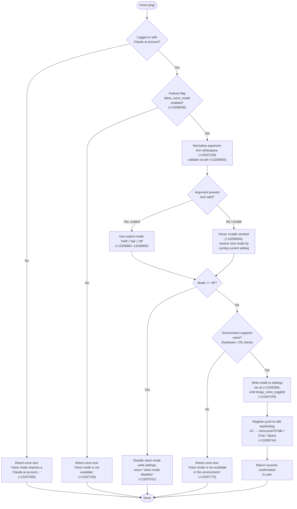

# `/voice`

> Analysis basis: CC v2.1.181 bundle.js (AST extraction + Claude interpretation)
> Minimum version: v2.1.181

---

## Overview

The `/voice` command toggles voice mode in Claude Code, cycling through three sub-modes (`hold`, `tap`, and `off`) or accepting an explicit mode argument. It enforces account and environment prerequisites before modifying the persistent settings file and optionally registers a push-to-talk keybinding. The command emits a `tengu_voice_toggled` telemetry event on every successful state transition.

---

## Registration

| Field | Value |
|---|---|
| type | `local` |
| name | `voice` |
| description | Toggle voice mode |
| argumentHint | `[hold\|tap\|off]` |
| supportsNonInteractive | `false` |
| isHidden | `null` |
| module_id | `Qkl` |
| load_inline | `true` |
| loc_byte | 13209480 |
| loc_byte_end | 13209722 |
| loc_line | 8651 |
| arbor_handler.name | `npf` |
| arbor_handler.fqn | `claude-2.1.181::npf` |
| arbor_handler.kind | `AsyncFunction` |
| arbor_handler.resolution_path | `module_id` |
| arbor_handler.n_hits | 1 |

Analysis basis: CC v2.1.181 bundle.js:+13209480

---

## Input Branching

Six distinct execution paths exist (account guard → feature-flag guard → argument parsing → mode resolution → environment check → settings write), so a Mermaid flowchart is used.



---

## Behavioral Spec

### Handler Entry Point (`npf`)

```
async function voiceCommandHandler(context):
    appState   = readVoiceState(context)          // uy  (+13206976)
    currentArg = context.args.trim()              // +13207226

    // Account guard
    if not accountIsLoggedIn(appState):           // +13207006
        return textResult("Voice mode requires a Claude.ai account. Please run /login to sign in.")

    // Feature-flag guard
    if not featureFlagEnabled("allow_voice_mode", appState):  // +13196206
        return textResult("Voice mode is not available.")

    // Argument validation
    normalizedArg = parseVoiceArg(currentArg)     // tpf (+13206835)
    // valid tokens: "hold", "tap", "off" (+13206882–13206905)
    // anything else yields the "invalid" sentinel (+13206926)

    targetMode = resolveTargetMode(normalizedArg, appState)
    // if "invalid": cycle from current persisted mode
    // if explicit: use as-is

    if targetMode == "off":
        writeSettings(disableVoice, appState)     // ao (+13207295)
        emitTelemetry("tengu_voice_toggled", {mode: "off"})  // +13207476
        return textResult("Voice mode disabled.")  // +13207531

    if not environmentSupportsVoice(appState):    // +13207775
        return textResult("Voice mode is not available in this environment.")

    success = writeSettings(enableVoice(targetMode), appState)  // ao
    if not success:
        return textResult("Failed to update settings. Check your settings file for syntax errors.")  // +13207393

    emitTelemetry("tengu_voice_toggled", {mode: targetMode})  // +13207476

    registerPushToTalkKeybinding(context)         // UC (+13208741)
    // keybinding action: "voice:pushToTalk"  (+13208744)
    // context: "Chat"  (+13208763)
    // key: "Space"     (+13208770)

    return successConfirmation(targetMode)
```

Analysis basis: CC v2.1.181 bundle.js:+13206965

---

### Argument Parser (`tpf`)

```
function parseVoiceArg(rawArg):
    trimmed = rawArg.trim()           // +13206835
    if trimmed in {"hold", "tap", "off"}:
        return trimmed
    return "invalid"                  // +13206926
```

Analysis basis: CC v2.1.181 bundle.js:+13206835

---

### Feature-Flag & Mode Check (`KVn` / `ii`)

```
function featureFlagEnabled(flagName, appState):
    // Reads the "allow_voice_mode" key from merged settings layers
    // Settings precedence (resolved by ii / dz):
    //   flagSettings → policySettings → userSettings → projectSettings → localSettings
    // Enterprise / team plan membership checked via plan tier (+3340426, +3340461)
    return settingsValue(flagName, appState) == true
```

Analysis basis: CC v2.1.181 bundle.js:+13196203 (`KVn`→`ii`), +13196206 (`allow_voice_mode` literal)

---

### Settings Writer (`ao`)

```
async function writeVoiceSetting(mode, appState):
    // Reads current user settings file:
    //   ~/.claude/settings.json  (+1310058 / +1310068)
    // Applies voice mode change atomically via writeFileSyncAndFlush
    //   (temp file → fchmod → fsync → rename pattern, lSt +1094871)
    // If the re-read config is missing auth that the cache has,
    //   refuses to write (guard at +13936008, tengu_config_auth_loss_prevented)
    // Returns true on success, false on parse/write error
    configPath = resolveSettingsPath()            // O9 (+1330070)
    currentConfig = readCurrentConfig(configPath)
    updatedConfig = applyVoiceMode(currentConfig, mode)
    return atomicWrite(configPath, updatedConfig) // lSt
```

Analysis basis: CC v2.1.181 bundle.js:+13207295

---

### Keybinding Registration (`UC`)

```
function registerPushToTalkKeybinding(context):
    // Loads user keybindings from keybindings.json  (+3971920)
    // via vEn → e$e (+3973686)
    // Inserts or updates action "voice:pushToTalk" (+13208744)
    //   in context "Chat" (+13208763), key "Space" (+13208770)
    // Emits tengu_custom_keybindings_loaded on success (+3971826)
    // Emits tengu_keybinding_fallback_used if action not found (+3980924)
    // If action_not_found sentinel: falls back gracefully (+3981002)
    keybindings = loadUserKeybindings()           // e$e
    keybindings.upsert({
        context: "Chat",
        key: "Space",
        action: "voice:pushToTalk"
    })
    persistKeybindings(keybindings)
```

Analysis basis: CC v2.1.181 bundle.js:+13208741

---

### Voice State Reader (`uy`)

```
function readVoiceState(context):
    // Reads merged app state including:
    //   - auth / OAuth status  (ob +3044630)
    //   - environment flags    (Ac +3044651, first-party: "firstParty" +2123618)
    //   - API key presence     (Bg +3044737, "ANTHROPIC_API_KEY" +3046782)
    //   - profile type         ("profile-implicit" +3043483, "user_oauth" +3043556)
    //   - claude-desktop-3p    (+3043014)
    // Returns composite state object used by all downstream guards
    return mergeState(authState(), envState(), settingsState())
```

Analysis basis: CC v2.1.181 bundle.js:+13206976

---

### Environment Voice Availability

The environment check (reached when `targetMode != "off"`) inspects hardware and OS-level voice capabilities. On systems where the microphone is inaccessible (e.g., SSH remote sessions or sandboxed environments), the command returns the string `"Voice mode is not available in this environment."` (+13207775). The macOS permission path for microphone access is `System Settings → Privacy & Security → Microphone` (+13208282).

Analysis basis: CC v2.1.181 bundle.js:+13207775

---

## State & Side Effects

| Item | Detail |
|---|---|
| Telemetry | `tengu_voice_toggled` (+13207476) — fired on every successful mode change (enable or disable) |
| Telemetry | `tengu_feature_ok` (+1019804) — generic feature success event in call chain |
| Telemetry | `tengu_feature_bad` (+1019871) — generic feature failure event in call chain |
| Telemetry | `tengu_feature_sad` (+1019952) — generic feature sad-path event in call chain |
| Telemetry | `tengu_custom_keybindings_loaded` (+3971826) — emitted when keybinding registration succeeds |
| Telemetry | `tengu_keybinding_fallback_used` (+3980924) — emitted when push-to-talk action is not found |
| Telemetry | `tengu_config_auth_loss_prevented` (+13936136) — emitted if settings write is refused to protect auth |
| Settings write | `~/.claude/settings.json` updated with new voice mode value; atomic write via temp-file pattern |
| Keybinding registration | `voice:pushToTalk` bound to `Space` in `Chat` context when voice is enabled |
| appState changes | Voice mode field updated in persistent user settings; in-memory state refreshed |
| Sound | Not observed in depth-2 traversal |
| Hook registration | `Gi` → `v$o.register` (+65579) called via file-watch path (`Byf`); watches config file for live reload |
| Environment guard | Command blocked entirely in environments without microphone access or in non-interactive mode (`supportsNonInteractive: false`) |
| Microphone permission hint | `System Settings → Privacy & Security → Microphone` (+13208282) surfaced to user when permission is denied |

---

## Version History

| Version | Change |
|---|---|
| v2.1.181 | Initial analysis |

---

## Common Mistakes

1. **Running `/voice` without a Claude.ai account** — The command exits immediately with an account-required message. Run `/login` first to authenticate via OAuth.
2. **Passing an unrecognized argument** — Any string other than `hold`, `tap`, or `off` is treated as the `"invalid"` sentinel, which causes the command to cycle to the next mode rather than error; this can be confusing.
3. **Expecting the command to work in non-interactive or SSH environments** — `supportsNonInteractive` is `false`, and a separate environment check prevents voice activation in environments without microphone access (e.g., remote SSH sessions).
4. **Malformed `settings.json`** — If the settings file has syntax errors, the write silently fails and the command returns `"Failed to update settings. Check your settings file for syntax errors."` The user must manually fix the JSON.
5. **Assuming `Space` is always available for push-to-talk** — The `Space` keybinding in the `Chat` context is registered only when voice is enabled. If another binding already occupies `Space` in that context, duplicate-key warnings are emitted and JSON uses the last value (+3969766).
6. **Revoking microphone permission after enabling voice** — The command does not re-check microphone permissions at runtime once voice mode is written to settings; permission denial surfaces only at activation time.

---

## Appendix — Identifier Mapping

> For bundle debugging only. Identifiers change across versions.

| Identifier | Role |
|---|---|
| `npf` | Main async handler for `/voice` command (Arbor-resolved entry point) |
| `fmt` | Voice state + feature-flag aggregation wrapper called by `npf` |
| `VVn` | Sub-wrapper inside `fmt`; delegates to voice state reader and diagnostic sink |
| `uy` | Voice/app state reader — merges auth, env, and settings into composite state |
| `Lp` | Low-level settings loader helper (reads disk, calls `rt` and `Ezt`) |
| `ob` | Auth/profile state builder — resolves profile type, OAuth token, API key |
| `Ac` | First-party classifier — tags auth context as `"firstParty"` |
| `zT` | Unknown sub-utility called during state read |
| `Bg` | API-key and auth-token validation block inside state reader |
| `tLt` | Thin wrapper calling `ZXe` (config path resolver) |
| `ZXe` | Config path resolver — calls `rt` and `Xre` |
| `sb` | Diagnostic sink (calls `di`) inside `VVn` |
| `KVn` | Feature-flag gate wrapper — delegates to `ii` for `allow_voice_mode` check |
| `ii` | Feature-flag lookup — reads merged settings, checks plan tier and flag value |
| `Xfi` | Settings lookup sub-routine within `ii` |
| `tB` | Settings layer resolver called by `ii` for enterprise/team plan checks |
| `ta` | Token / account plan reader |
| `rme` | Error reporter inside feature-flag path |
| `dz` | Settings layer merger / cascading resolver |
| `Kr` | Settings load orchestrator called by `npf`; triggers `tj` |
| `tj` | Top-level settings-from-disk loader (emits `loadSettingsFromDisk_start/end` marks) |
| `px` | Performance hook helper inside `tj` |
| `ha` | Memory-usage sampler / perf hook registrar |
| `d9` | `require('perf_hooks')` wrapper |
| `NAr` | Core settings assembly function — merges flag, policy, user, project, local layers |
| `wn` | File append / log writer used during settings load |
| `MKt` | Settings merge helper |
| `obt` | Settings deduplication / tracking set manager |
| `Nts` | Policy settings loader |
| `fSe` | User settings file path resolver (`~/.claude/settings.json`) |
| `ej` | Settings validation / error reporter |
| `Pts` | SDK inline settings loader |
| `x2` | Environment / platform metadata collector |
| `gr` | Generic getter utility |
| `sbt` | WSL detection helper |
| `DKt` | Settings load completion marker |
| `tpf` | Argument parser for `/voice` — trims input and validates against `hold`/`tap`/`off` |
| `ao` | Settings write orchestrator — reads, patches, and atomically writes user settings |
| `ZA` | Path resolution combo (`fSe` + `x2`) |
| `jt` | Home-directory / path utility |
| `OAr` | Telemetry-enriched settings write helper |
| `Sv` | Config persistence wrapper |
| `qJ` | Config file reader (handles BOM, CRLF, UTF-8/UTF-16) |
| `Jp` | Real-path resolver |
| `I` | Config object parser / normalizer |
| `uen` | Path join helper for config directory |
| `den` | Encoding-strip helper (BOM removal) |
| `Dn` | ENOENT-safe file reader |
| `ln` | Error code classifier (`ENOENT`, etc.) |
| `qmr` | Timestamp tracker (`rtn.set` + `Date.now`) |
| `jOe` | Settings file path builder (`jtn` + `x2`) |
| `jtn` | Path resolution chain (`KO.resolve` / `KO.dirname`) |
| `lSt` | Atomic file writer (temp → fchmod → fsync → rename pattern) |
| `cKe` | Permission-error classifier (`EINVAL`, `ENOTSUP`, `EPERM`, `ENOSYS`) |
| `Re` | JSON serializer |
| `fH` | Cache clear helper (`kKt.clear` + `Ser.clear`) |
| `NZo` | Gitignore / project-settings writer |
| `Mt` | AsyncLocalStorage context getter for settings |
| `cen` | Store getter (`len.getStore`) |
| `vmr` | Settings validation runner |
| `Qen` | Gitignore rule checker |
| `Vr` | Git command runner (`git check-ignore`, `git config`) |
| `T7c` | Path canonicalizer (home-dir expansion, absolute check) |
| `PZo` | Git-tracked file verifier (`git ls-files --error-unmatch`) |
| `O9` | `.claude` directory path builder |
| `Ut` | Generic React/state context reader |
| `j` | State atom / signal primitive |
| `$e` | State subscriber / effect scheduler |
| `Rht` | Root state initializer |
| `ke` | Settings write finalizer — pushes to `QVe`, logs errors via `jJ.logError` |
| `Ho` | Error string converter |
| `rt` | String converter (calls `String()`) |
| `fVc` | Write queue manager (`ren.shift` / `ren.push`) |
| `a` | MCP server orchestration entry (called late in `npf`) |
| `DBe` | MCP server manager — connects, reconnects, manages all server lifecycle |
| `z8` | MCP server set builder |
| `Hrt` | MCP server record constructor |
| `x7` | MCP server connector (resolves configs, applies permissions, connects) |
| `h5` | SDK MCP source lister |
| `Zwn` | MCP status color formatter (red/yellow) |
| `Art` | MCP server capability aggregator |
| `Pk` | MCP permission checker |
| `M_` | MCP approval gate (`Pue`, `It`, `Fa`) |
| `LVr` | MCP permission level resolver |
| `qn` | Generic value wrapper |
| `UOt` | MCP server filter |
| `Jta` | MCP connection initializer |
| `Mzr` | MCP context reader (`oi`, `wxn`, `Wt`) |
| `wwe` | MCP config hasher (SHA-256, `mJi.createHash`) |
| `KAn` | MCP schema validator (`Tse`, `Object.keys`, `ez`) |
| `zAn` | MCP AI-schema mapper |
| `AI` | MCP content hasher |
| `qAn` | MCP unique-key builder |
| `uc` | MCP base-hash utility |
| `sn` | MCP debug logger (`jJ.logMCPDebug`) |
| `yLn` | MCP server lifecycle manager (auth, connect, reconnect, close) |
| `t$d` | MCP server config parser |
| `R9` | MCP token storage interface (`M9`, `$l`) |
| `Aae` | MCP claude.ai connector helper |
| `hae` | MCP host availability checker |
| `Iae` | MCP OAuth flow runner (local HTTP server, PKCE, token exchange) |
| `Trt` | MCP pending-connection tracker |
| `SLn` | MCP reconnect state builder |
| `R7` | MCP full reconnect orchestrator |
| `M9` | Token store getter |
| `d` | Supervisor / daemon writer |
| `Du` | MCP error logger (`jJ.logMCPError`) |
| `Ee` | String coercer (calls `String()`) |
| `n$d` | MCP no-auth handler |
| `e$d` | MCP SSH-session detector |
| `ELn` | MCP server updater / hot-reload handler |
| `brt` | MCP pending-connection getter |
| `Irt` | MCP active-connection getter |
| `ana` | MCP context-aware connection executor |
| `oi` | AsyncLocalStorage store getter (`tLu.getStore`) |
| `wxn` | MCP path joiner |
| `WVr` | MCP connection result applier |
| `m` | Worker kill helper |
| `x` | Worker manager (kill, write, spawn) |
| `gP` | MCP skills telemetry emitter (`tengu_mcp_skills`) |
| `ut` | MCP tool capability tracker |
| `wVr` | MCP version-string resolver |
| `un` | Global config save function (auth-loss guard at +13936008) |
| `w` | Background session state watcher |
| `Az` | Session blur/focus state tracker |
| `L` | Background worker lifecycle sweep |
| `v` | Worker state machine |
| `uQl` | Worker queue tail reader |
| `nna` | MCP integer validation wrapper |
| `y8` | MCP response parser / demultiplexer |
| `Qrt` | MCP port parser (parseInt) |
| `Lxn` | MCP alternate port parser (parseInt) |
| `bQn` | MCP update applier (`applyMcpUpdate`) |
| `kBe` | MCP config change hasher |
| `kL` | MCP cleanup runner |
| `Xrt` | MCP config hash comparator |
| `l` | MCP client wrapper |
| `cxl` | Daemon status reader |
| `hQ` | Config file loader |
| `sjt` | Daemon status path builder |
| `kOo` | MCP server orchestration coordinator |
| `sLn` | MCP server permission-set checker (`vFd.has`, `NVr.has`) |
| `Fn` | Timeout-with-abort utility |
| `c` | Background session handle |
| `UC` | Keybinding registration orchestrator for `/voice` |
| `vEn` | Keybinding manager entry |
| `e$e` | Keybinding file loader and parser |
| `rBr` | Keybinding block extractor |
| `m8` | Keybinding tool-capability tracker |
| `yc` | Keybinding base loader (`Ul`, `Lp`) |
| `Gme` | Keybinding file path builder |
| `Wt` | JSON parser |
| `TEn` | Keybinding array validator |
| `EEn` | Keybinding entry enumerator |
| `MIi` | Keybinding state atom writer |
| `tBr` | Keybinding duplicate-key detector |
| `nBr` | Keybinding block structure validator |
| `wEn` | Keybinding applicator / merger |
| `lBr` | Keybinding conflict resolver |
| `aBr` | Keybinding override applier (`kZe`) |
| `IIi` | Keybinding map builder |
| `Aid` | Keybinding action descriptor builder |
| `Qe` | State effect scheduler |
| `hWe` | Language/locale normalizer (lowercase, `s$o.has`) |
| `It` | Config file watcher orchestrator |
| `p0o` | Config watch path resolver |
| `w_e` | Config file loader with backup support |
| `x9` | BOM / prefix stripper for config files |
| `uUl` | Config directory enumerator (readdirStringSync) |
| `h0o` | Config backup path builder |
| `f` | Background worker dispatcher / main scheduling loop |
| `M` | Worker instance lifecycle manager |
| `aKn` | Low-memory background dispatch helper (`tengu_bg_low_mem_mb`) |
| `H$e` | Stale-file cleaner (lstat → rm → readFile) |
| `F` | Worker retirement classifier (`deny` / `classify` / `ask`) |
| `x1o` | Daemon socket connection handler |
| `O1o` | Daemon session lifecycle (spawn, claim, retire, cleanup) |
| `$` | Global state atom store |
| `Byf` | Config file watcher (fs.watchFile / fs.unwatchFile) |
| `kq` | Watch debounce / coalesce helper |
| `Gi` | Hook registrar (`v$o.register`) |