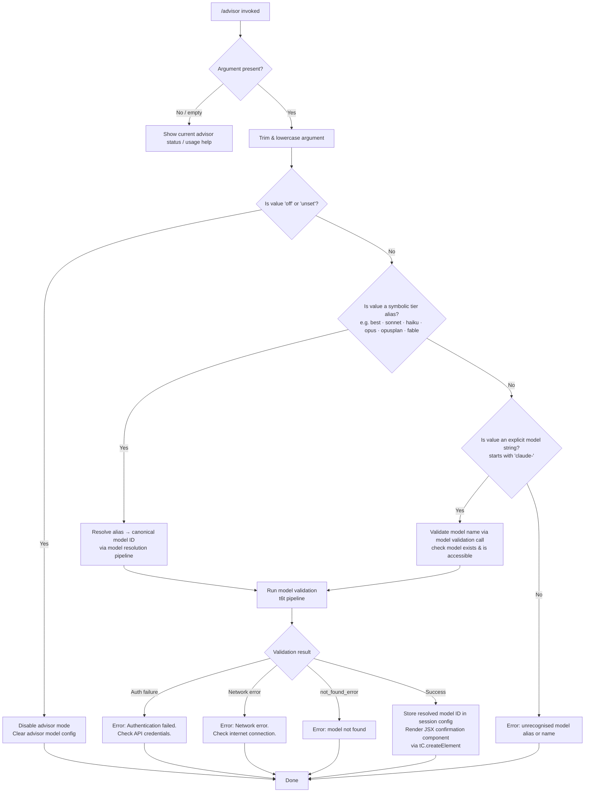

# `/advisor`

> Analysis basis: CC v2.1.183 bundle.js (AST extraction + Claude interpretation)
> Minimum version: v2.1.183

---

## Overview

The `/advisor` command enables the current Claude Code session to consult a stronger or alternative Claude model at key decision points during an agentic task. It accepts a model name (or symbolic tier alias) as its argument, resolves it against the available model roster, and configures a "side-query" pathway so that the active agent can delegate difficult sub-problems to the specified advisor model. The command operates as an async handler (`mcf`) that validates the target model, builds a JSX component for confirmation, and wires up the necessary API call infrastructure for background consultations.

---

## Registration

| Field | Value |
|---|---|
| type | `local-jsx` |
| name | `advisor` |
| description | `Let Claude consult a stronger model at key moments` |
| argumentHint | `[ ... ]` |
| isHidden | `null` (not hidden) |
| module_id | `iLl` |
| load_inline | `true` |
| loc_byte | `12903748` |
| loc_byte_end | `12904004` |
| loc_line | `8544` |
| arbor_handler.name | `mcf` |
| arbor_handler.fqn | `claude-2.1.183::mcf` |
| arbor_handler.kind | `AsyncFunction` |
| arbor_handler.resolution_path | `module_id` |
| arbor_handler.n_hits | `2` |

Analysis basis: CC v2.1.183 bundle.js:+12903748

---

## Input Branching

The command handles 4+ distinct paths based on the advisor mode string provided by the user: mode may be absent/empty, set to `"off"` or `"unset"`, set to a symbolic tier alias (`"best"`, `"sonnet"`, `"haiku"`, `"opus"`, `"opusplan"`, `"fable"`), or set to an explicit model name string. A Mermaid flowchart is therefore required.



---

## Behavioral Spec

### Top-Level Handler (`mcf`)

Analysis basis: CC v2.1.183 bundle.js:+12903196

```
async function advisorCommandHandler(argument, appContext):
    # Trim whitespace from raw argument
    rawInput = argument.trim()                          # calls n.trim (loc +12903196)

    # Build JSX response element for the UI layer
    responseElement = createElement(AdvisorComponent, ...) # tC.createElement (loc +12903232)

    # Dispatch to model-name resolution subsystem
    resolvedModel = resolveModelString(rawInput)        # _s (loc +12903350)

    # Dispatch to model validation pipeline
    validationResult = runModelValidation(rawInput)     # t6t (loc +12903364)

    # Build side-query executor context
    sideQueryCtx = buildSideQueryContext(appContext)    # s0e (loc +12903438)

    # Build the list of candidate advisor models available for selection
    candidateList = buildAdvisorCandidateList(sideQueryCtx) # oct (loc +12903511)

    return responseElement
```

### Mode String Check (`"off"` / `"unset"`)

Analysis basis: CC v2.1.183 bundle.js:+12903272 and +12903283

When the argument (after trim and lowercase) equals `"off"` or `"unset"`, the handler disables any previously configured advisor model and returns early. These string literals appear in the registration block's byte range.

```
function checkDisableMode(modeString):
    lowered = modeString.toLowerCase()
    if lowered == "off" or lowered == "unset":
        clearAdvisorModelSetting()
        return { status: "disabled" }
    return null
```

### Symbolic Alias Resolution (`_s`)

Analysis basis: CC v2.1.183 bundle.js:+12903350, +2291812, +2291841

The `resolveModelString` function (bundle identifier `_s`) maps human-friendly tier names to concrete model IDs. It trims and lowercases the input, then dispatches through a chain of sub-resolvers.

Recognised symbolic aliases (from literal constants in the call graph):

| Alias | Canonical model family |
|---|---|
| `"best"` | Highest-tier available model (provider-dependent) |
| `"fable"` | `claude-fable-5` |
| `"opusplan"` | Maps to an opus planning variant |
| `"sonnet"` | `claude-sonnet-4-x` series |
| `"haiku"` | `claude-haiku-4-x` series |
| `"opus"` | `claude-opus-4-x` series |

Analysis basis: CC v2.1.183 bundle.js:+2291889, +2291951, +2291992, +2292031, +2292070, +2292104

```
function resolveModelString(input):
    trimmed = input.trim()
    lower   = trimmed.toLowerCase()

    # Check whether the provider supports this alias
    isSupported = checkProviderSupport(lower)        # PR (loc +2291869)

    # Apply alias-to-model mapping
    mapped = applyAliasMap(lower)                    # bQ / Uvr / NK / pCt pipeline

    # Normalise model name (strip illegal characters, apply prefix rules)
    normalised = normaliseModelName(mapped)          # Bl (loc +2291851)

    # Apply provider-specific model-name transformation
    transformed = applyProviderTransform(normalised) # fL / Tfe / Rj / w_ chain

    return transformed
```

#### Provider Context Checks

Analysis basis: CC v2.1.183 bundle.js:+2126556, +2126606, +2126716, +2126764, +2127229, +2127249, +2127380

The resolver is provider-aware. Provider identifiers found in literals:

| Literal | Role |
|---|---|
| `"bedrock"` | AWS Bedrock provider path |
| `"foundry"` | Azure Foundry provider path |
| `"mantle"` | Mantle provider path |
| `"vertex"` | GCP Vertex AI provider path |
| `"anthropicAws"` | Anthropic-on-AWS provider |
| `"gateway"` | Cloud gateway provider |
| `"firstParty"` | Direct Anthropic API |

For Bedrock, model names are transformed to include the `application-inference-profile` format (literal at +2289561). For Azure, the `https://cognitiveservices.azure.com/.default` scope is used (literal at +3018344).

#### Known Explicit Model IDs

Analysis basis: CC v2.1.183 bundle.js:+2288479 – +2289425

The resolver recognises the following full model ID prefixes/strings for explicit-name matching:

- `claude-mythos-5` (+2288479)
- `claude-opus-4-8` (+2288536)
- `claude-opus-4-7` (+2288593)
- `claude-opus-4-6` (+2288650)
- `claude-opus-4-5` (+2288707)
- `claude-opus-4-1` (+2288764)
- `claude-opus-4-0` (+2288853)
- `claude-sonnet-4-6` (+2288885)
- `claude-sonnet-4-5` (+2288946)
- `claude-sonnet-4-0` (+2289041)
- `claude-haiku-4-5` (+2289075)
- `claude-3-7-sonnet` (+2289134)
- `claude-3-5-sonnet` (+2289195)
- `claude-3-5-haiku` (+2289256)
- `claude-3-opus` (+2289315)
- `claude-3-sonnet` (+2289368)
- `claude-3-haiku` (+2289425)
- `claude-fable-5` (+2276625)
- `claude-mythos-preview` (+3028940)

### Model Validation Pipeline (`t6t`)

Analysis basis: CC v2.1.183 bundle.js:+12903364, +11282834, +11282871, +11283038

```
async function runModelValidation(modelName):
    trimmed = modelName.trim()                        # e.trim (loc +11282834)
    if trimmed == "":
        raise Error("Model name cannot be empty")     # literal (loc +11282871)

    # Build prompt context for validation sub-call
    context = buildValidationContext(trimmed)         # ul (loc +11282905)

    lower = trimmed.toLowerCase()                     # n.toLowerCase (loc +11283019)

    # Check whether model is on the supported model set
    isSupportedModel = supportedModels.includes(lower) # Sfe.includes (loc +11283038)

    # Check the validation cache (avoid repeat API calls)
    if validationCache.has(lower):                    # Zsl.has (loc +11283140)
        return validationCache.get(lower)

    # Run the actual validation API call
    result = await performValidation(trimmed)         # I6 (loc +11283185)

    # Store result with cache control ephemeral marker (loc +11283329)
    validationCache.set(lower, result)                # Zsl.set (loc +11283348)

    # Dispatch post-validation alias normalisation
    normalised = normaliseAfterValidation(result)     # Ajp (loc +11283389)

    return normalised
```

Error messages emitted on validation failure (Analysis basis: CC v2.1.183 bundle.js):

- `"Authentication failed. Please check your API credentials."` (+11283607)
- `"Network error. Please check your internet connection."` (+11283709)
- When response `type == "not_found_error"` (+11283828): model does not exist for this account

#### Validation Sub-call API Architecture (`I6` / `Qj`)

Analysis basis: CC v2.1.183 bundle.js:+8781563, +8781608, +8781736

The validation call (`I6`) uses the `side_query` request mode (literal at +8781608) and requests `structured_outputs` (literal at +8781736). It hashes the query payload with SHA-256 (literal `"sha256"` at +8780613, hex output at +8780640) for cache-key generation via `Kso`. The underlying API client (`Qj`) sets the following headers:

| Header | Value |
|---|---|
| `x-app` | `"cli"` / `"cli-bg"` (+3015871, +3015884) |
| `User-Agent` | Built from `@anthropic-ai/claude-code` and version `2.1.183` (+3086103, +3086193) |
| `X-Claude-Code-Session-Id` | Session UUID (+3015917) |
| `x-client-app` | `"cli"` (+3016041) |

OAuth token refresh is performed before each call (log messages `"[API:auth] OAuth token check starting"` at +3016454 and `"[API:auth] OAuth token check complete"` at +3016508). A timeout of 600 000 ms (10 minutes) applies to the overall request (literal at +3016826), with up to 10 retries (literal at +3016834). The proxy-auth helper times out after 30 000 ms (literal at +1858054).

### Alias Post-Normalisation (`Ajp` / `hjp`)

Analysis basis: CC v2.1.183 bundle.js:+11283389, +11284141, +11284159

After validation, the model string undergoes a secondary normalisation pass that converts dash-separated shorthand aliases into their underscore-separated equivalents and vice-versa, for internal storage:

| Dash form | Underscore form |
|---|---|
| `fable-5` | `fable_5` |
| `opus-4-8` | `opus_4_8` |
| `opus-4-7` | `opus_4_7` |
| `opus-4-6` | `opus_4_6` |
| `opus-4-5` | `opus_4_5` |
| `sonnet-4-6` | `sonnet_4_6` |
| `sonnet-4-5` | `sonnet_4_5` |

Analysis basis: CC v2.1.183 bundle.js:+11284189–+11284666

### Side-Query Context Builder (`s0e` / `wio`)

Analysis basis: CC v2.1.183 bundle.js:+12903438, +8916539, +8916295

```
function buildSideQueryContext(appContext):
    # Collect model context information
    modelCtx = buildModelContext(appContext)           # ul (loc +8916539)

    # Build the Fo (formatted output) descriptor for the side-query channel
    outputDescriptor = buildFormattedOutput(modelCtx) # Fo (loc +8916620)

    # Apply wio (wire-IO) transform to bind the advisor channel
    wireIO = bindAdvisorWireIO(outputDescriptor):     # wio (loc +8916628)
        # wio internally calls:
        #   Fo, _s, Lr, Yoe, WK, SYe, Nun
        return configuredChannel

    return wireIO
```

### Candidate List Builder (`oct` / `g$n`)

Analysis basis: CC v2.1.183 bundle.js:+12903511, +8916495

```
function buildAdvisorCandidateList(sideQueryCtx):
    # Filter to models that are eligible as advisors
    eligibleModels = REP_registry.filter(isEligible)  # oct → REp.filter (loc +8916495)

    # For each eligible model, compute a display descriptor
    candidates = eligibleModels.map(m =>
        buildModelDescriptor(m, sideQueryCtx)          # g$n → s0e + Af + _s
    )

    return candidates
```

---

## State & Side Effects

| Item | Detail |
|---|---|
| Telemetry — `tengu_api_success` | Fired on successful advisor model API validation call (loc +8783279) |
| Telemetry — `tengu_lone_surrogate_sanitized` | Fired when response text contains lone UTF-16 surrogates that are sanitised (loc +8782975) |
| Telemetry — `tengu_prompt_cache_1h_config` | Fired when prompt caching with 1-hour TTL is configured for the advisor call (loc +13722283) |
| Telemetry — `tengu_scheduled_task_fire` | Fired when a scheduled advisory sweep task executes (loc +16743072) |
| Telemetry — `tengu_scheduled_task_missed` | Fired when a scheduled advisory sweep is missed (loc +16742321) |
| Telemetry — `tengu_scheduled_task_expired` | Fired when a scheduled advisory task expires without completion (loc +16743415) |
| Telemetry — `tengu_daemon_yield` | Fired when the background daemon yields to a foreground process (loc +17295299) |
| Telemetry — `tengu_bg_retire_grace_bridged_min` | Fired during background worker retirement grace-period bridging (loc +13292320) |
| Telemetry — `tengu_bg_retire_pinned_low_mem` | Fired when pinned background workers are retired due to low memory (loc +17279713) |
| Telemetry — `tengu_bg_attach_upgrade` | Fired when a background worker is promoted/upgraded (loc +13292392) |
| Telemetry — `tengu_bg_prewarm_per_sweep` | Fired each time a prewarm sweep runs for background workers (loc +17279834) |
| Validation cache (`Zsl`) | A Map keyed by lowercase model name; caches validation results to avoid duplicate API calls (loc +11283140) |
| Session advisor model config | The resolved model ID is written to the session's advisor model setting |
| Background worker pool | The command may trigger background worker lifecycle events (retire, prewarm, re-adopt) via the `L`/`W`/`ct` subsystem |
| JSX component render | A `tC.createElement` call produces the confirmation UI element returned to the REPL (loc +12903232) |
| AbortSignal composition | The side-query channel uses `AbortSignal.any` (loc +3025397) to combine session-level and per-call cancellation signals |
| Prompt-cache TTL marker | `"ephemeral"` cache-control marker applied to validation prompt (loc +11283329); `"1h"` TTL applied to main advisor prompt cache (loc +8782497) |
| Error output | Authentication, network, and model-not-found errors are emitted to the UI; `console.error` is used for SDK-level errors (loc +1858343) |
| `process.exit` | Called by `Fs` in unrecoverable error path with exit code `1` (loc +13324767, +13324780) |

---

## Version History

| Version | Change |
|---|---|
| v2.1.183 | Initial analysis |

---

## Common Mistakes

1. **Passing a model alias for a different provider**: Aliases such as `"fable"` or `"opusplan"` may not resolve if the active provider (Bedrock, Vertex, Foundry, etc.) does not expose the corresponding model. The resolver is provider-aware and will emit a "not found" error rather than falling back silently.

2. **Omitting the argument**: Running `/advisor` with no argument shows status/help output rather than configuring anything. Users intending to reset the advisor should explicitly pass `off` or `unset`.

3. **Expecting instant effect on in-flight tasks**: The advisor model is stored in session configuration for future agent decision points; it does not retroactively affect any sub-task already running.

4. **Case sensitivity**: Aliases are normalised to lowercase before matching, but explicit model IDs with unexpected capitalisation may fail the `Sfe.includes` check. Always use all-lowercase or the exact canonical string.

5. **Using an unsupported model string with the Bedrock provider**: Full model IDs must include the `application-inference-profile` wrapper for Bedrock. Passing a bare `claude-opus-4-5` string without the correct profile prefix will result in a validation error.

6. **Confusing dash and underscore forms**: Internally, model shortnames are stored in underscore form (e.g., `opus_4_8`), but the command accepts the dash form. Do not pass underscore forms on the command line — the parser normalises dashes, not underscores.

---

## Appendix — Identifier Mapping

> For bundle debugging only. Identifiers change across versions.

| Identifier | Role |
|---|---|
| `mcf` | Top-level async handler for `/advisor` command (arbor_handler) |
| `_s` | Model-string resolver — maps aliases and explicit names to canonical model IDs |
| `t6t` | Model validation pipeline — trims, looks up cache, fires API validation call |
| `s0e` | Side-query context builder — assembles advisor channel configuration |
| `oct` | Candidate list builder — filters eligible advisor models from registry |
| `g$n` | Per-model descriptor builder — called within candidate list construction |
| `wio` | Wire-IO binder — attaches advisor model to the side-query communication channel |
| `I6` | Core side-query API executor — dispatches structured-output validation call |
| `Qj` | Anthropic API client — handles HTTP, auth, retries, streaming |
| `MWu` | Streaming response handler — manages AbortSignal, timeouts, event-stream parsing |
| `ul` | Model-context builder — assembles full model context object for API calls |
| `Ajp` | Post-validation alias normaliser — dispatches to `hjp` for dash/underscore conversion |
| `hjp` | Alias normalisation worker — converts model shortname variants |
| `Fo` | Formatted-output descriptor builder — used by side-query and wire-IO paths |
| `NK` | Provider-type resolver — classifies provider identifier strings |
| `Bl` | Model-name string cleaner — applies regex replacements for illegal characters |
| `PR` | Provider support checker — tests whether current provider supports a given model |
| `bQ` | Alias-map dispatcher — routes alias strings to the appropriate sub-resolver |
| `Uvr` | Alias sub-resolver — handles first-tier alias expansion |
| `pCt` | Model-name post-processor — applies provider-specific replace transforms |
| `fL` | Provider-transform dispatcher — selects the correct transform chain |
| `Oun` | Outer normaliser — calls `Df` and `pd` for model-name normalisation |
| `Df` | Deep model-name formatter — calls multiple format helpers (`JRe`, `yRs`, etc.) |
| `pd` | Path-depth helper — used in model-name path normalisation |
| `Tfe` | Fable-tier transform — applies fable-series model-name rules |
| `Fvr` | Fable variant resolver — delegates to `Df` |
| `Rj` | Regex-replacement normaliser — used in model-name cleanup |
| `w_` | Wire-transform helper — calls `Jbe` for model-string restructuring |
| `Jbe` | Join-builder for model names — assembles final model string from parts |
| `wr` | String utility / writer — used across many model-name helpers |
| `NBs` | Nested builder for side-query model selection |
| `WK` | Model-key builder — constructs provider-qualified model key |
| `Mu` | Metadata utility — used in model resolution chain |
| `bfe` | Boolean-flag evaluator for model arrays |
| `Yoe` | Inclusion checker — tests if a model name is included in a list |
| `nNe` | Negative-name checker — tests for disallowed model identifiers |
| `Run` | Recursive sub-runner — re-enters `ul` for nested model resolution |
| `PBs` | Policy-based selector — filters models by policy settings key |
| `xn` | Cross-node model selector — uses `Mnn` and `B2` helpers |
| `K7e` | Key-entry resolver — iterates `Object.entries` on model map |
| `RBs` | Reverse-lookup builder — uses `nNe` and `indexOf` for model search |
| `ZMu` | Zero-match utility — handles unresolved alias fallback |
| `oCt` | Output-context transformer — normalises model output context |
| `eRu` | Entry resolver utility — handles `startsWith`-based model matching |
| `zoe` | Zone-of-eligibility checker — verifies model is in allowed set |
| `rNe` | Resolution-name extractor — calls `st` for string coercion |
| `nRu` | Name-resolution utility — lowercases and normalises model names |
| `jU` | Junction utility — coordinates `Ife`, `Fo`, `_H`, `Mu` sub-calls |
| `e_` | Entry expander — lowercase/include/replace chain for model IDs |
| `dHt` | Depth-hit tracker — used in model-name expansion |
| `Af` | Alias finaliser — applies final replacement pass on model strings |
| `_H` | Header/hash utility — composes `SIt`, `H0u`, `wr`, `W1e` |
| `SIt` | String-ID transformer — uses `wr` and `st` |
| `H0u` | Hex-output utility — tests `startsWith` on provider strings |
| `W1e` | Well-known list evaluator — lowercases and checks `Object.values` |
| `Am` | Aggregation mapper — calls `Lt` |
| `Lt` | List transformer — calls `gx` |
| `VK` | Version key builder — used in API client setup |
| `APr` | API-path resolver — splits, trims, slices path strings |
| `Hi` | Header injector — injects `uNe` into request headers |
| `pz` | Path-zone handler — calls `qun` |
| `qvr` | Query-variable resolver — applies `encodeURIComponent` |
| `T` | Transport layer — core HTTP dispatch with `vPe`, `QHc`, `Pe`, `Kc`, `$O`, etc. |
| `Lh` | Log handler — calls `uhn` for auth log messages |
| `WBs` | Write-boolean serialiser — calls `Boolean` |
| `hy` | Hydration helper — assembles request from `dp`, `ib`, `Ac`, `ts`, `YT`, `Ug`, etc. |
| `VH` | Version-header accessor |
| `TWu` | Token-write utility — uses `YT` and `aJe` |
| `Lr` | Logger/reporter — used in side-query channel binding |
| `Jsn` | JSON-serialise-and-send — handles `trustAccepted`, `Date.now`, `whu`, `RU`, `Cv` |
| `MWu` | Main-write utility — streaming response manager (AbortSignal, timeouts, UUID) |
| `M2` | Model-metadata accessor — calls `Pzc` and `wOe` |
| `dy` | Dynamic-yield handler — calls `st`, `Hl`, `RU`, `RK`, `hze`, etc. |
| `DWu` | Data-write utility — calls `mti`, `pti`, `wr` |
| `IWu` | Input-write utility — handles `VAn`, `wOe`, `_We`, `_re`, `Lwr`, `VH`, `Ps` |
| `oTe` | Outbound-token emitter — date-stamped, uses `Bnr`, `aPu`, `Wzt` |
| `$nr` | Nonce/timestamp generator — calls `Date.now` |
| `fLt` | Field-lookup transformer — lowercases header keys |
| `zTe` | Zero-trace error logger — calls `console.error` for SDK errors |
| `VAn` | Value-annotator — calls `CC`, `js`, `Fo`, `wOe` |
| `M` | Message processor — main conversation loop handler |
| `x` | Output-writer — calls `d.write` |
| `w` | Window/blur tracker — monitors focus state (blurred/focused) |
| `v` | Version accessor |
| `_re` | Resolver entry — finds matching provider prefix via `Bpc.find` |
| `Mv` | Model-viewer — calls `Ug` |
| `ib` | Identity builder — assembles agent identity (profile-implicit, user_oauth) |
| `sTe` | Stream-token emitter — enriches response with provider, `ke`, `Re`, `fPu` |
| `RYe` | Response-yield executor — fires `fetch` against `https://api.anthropic.com` with `AbortSignal.timeout` (10 000 ms) |
| `I` | Input handler — manages keyboard/scroll events |
| `h` | Helper — calls `a`, `r.setTimeout` |
| `a` | App-state accessor — reads from `s.get`, `s.values` via `n3e`, `uZn`, `mta` |
| `GUe` | Gateway-URL evaluator — checks for `claude-3-` prefix and assembles gateway URL |
| `d1` | Data-layer accessor — calls `wr` |
| `nse` | Namespace entry — calls `jgt`, `n.get`, `xwr` |
| `jgt` | JWT/token getter |
| `xwr` | Cross-wire resolver — replaces foundry resource name with `unknown-foundry-resource` |
| `_` | SDK transport initialiser — orchestrates `xht`, `GF`, `vP`, `eY`, `ZB`, `De`, `Ho` |
| `xht` | Transport-type switcher — dispatches to `pcc` (http/sse/dynamic) |
| `De` | Dependency executor — calls `Ho`, `st`, `ra`, `Bzc`, `hKe.push`, `QJ.logError` |
| `Ho` | Host-error factory — wraps `Error` and `String` |
| `nyp` | Named-yield-point finder — uses `e.find` / `n.find` to locate model entries |
| `Kso` | Key-store hash — creates SHA-256 cache key via `wRa.createHash` |
| `Kun` | Key-unifier — composes `Hl`, `wr`, `Mu`, `qun`, `jvr`, `T` for auth header assembly |
| `Hl` | Header-label formatter — calls `String` |
| `qun` | Queue-unit — reads from `jBs.getStore` (async-local-storage context) |
| `jvr` | JWT-value resolver |
| `d_n` | Data-normaliser — calls `wr` |
| `M4e` | Model-for-exec builder — main sub-agent model configurator; handles `repl_main_thread*`, `auto_mode`, `memdir_relevance` flags |
| `vo` | View-output helper — calls `hy`, `Y2`, `mi` |
| `_rr` | Reserved-resource referencer |
| `ct` | Context-tracker — manages `pIe`, `Cxt`, `u8` cache stores |
| `yrr` | Year/round reference — utility in model config |
| `UR` | URL-resolver — calls `LPr` and `BUe` for endpoint construction |
| `LPr` | Link-path resolver — calls `wr` |
| `BUe` | Base-URL evaluator — uses `st` and `Z1e`; applies `"hipaa"` tier check |
| `L` | Loop/lifecycle manager — orchestrates worker sweeps (prewarm, retire, respawn) |
| `W` | Worker-entity — manages scheduled tasks (never/recurring), grace clocks, `fae` |
| `p8t` | Process-8-tracker — checks `YKn` and `yRl.freemem` for memory management |
| `ERl` | Environment-resource limiter — calls `ct` |
| `B$e` | Buffer-store entry — reads/writes checkpoint files via `fT.lstat/rm/readFile` |
| `Wn` | Worker-node base — calls `t` |
| `XKn` | Cross-key-node — calls `ct` for context lookup |
| `V` | Viewport handler — manages `K.preventDefault`, `$` |
| `xRa` | Cross-resource array helper |
| `rhn` | Request-header-normaliser — uses `YQ`, `Fo`, `n.includes` for temperature and side-query headers |
| `Uv` | Utility-vector — maps over message arrays |
| `Qve` | Queue-value executor — handles tool-call dispatch (`Fa`, `o8`, `Mc`, `Lt`, `Pe`) |
| `o8` | Object-8 serialiser — generates random bytes via `Eko.randomBytes` (32 bytes) |
| `Mc` | Message-constructor — calls `hy` and `Ct` |
| `Pe` | Payload encoder — calls `JSON.stringify` |
| `c9o` | Cache-9-object manager — manages array push/pop with `uYt` validation |
| `uYt` | UUID-yt validator — tests `VHc` regex against values |
| `cU` | Clone-utility — calls `structuredClone` |
| `pYt` | Pop-yt handler — manages array normalisation with `dYt` |
| `dYt` | Data-yt transformer — calls `i9o` and `e.replace` |
| `Qe` | Queue-entry — calls `ogt` |
| `ogt` | Output-guard tracker |
| `Dwr` | Data-write router — calls `wr` and `n9s` |
| `n9s` | Name-9-splitter — parses model response strings with regex and split |
| `kwr` | Key-write resolver — manages per-request caching with `xwr`, `jgt`, `r.get/set` |
| `nEe` | Name-entry evaluator |
| `Ur` | URL-router — calls `ey` and `Qe` |
| `ey` | Endpoint-yield — calls `ogt` |
| `os` | Output-stream — calls `ogt` |
| `dDt` | Data-dispatch target — calls `Nki`, `Pet`, `uDt` for tool dispatch |
| `Nki` | Node-key-injector — calls `ihd`, `De` |
| `Pet` | Payload-event-tracker — calls `ey` |
| `uDt` | Utility-dispatch-target — calls `Pet`, `cDt` |
| `CF` | Context-filter — dispatches agents by prefix (`agent:builtin:`, `agent:custom:`, `agent:`) |
| `shd` | Shared-handler dispatcher — routes `startsWith`-matched agent strings |
| `x1` | Executor-1 — handles `repl_main_thread` agent type |
| `Rgt` | Registration-getter — retrieves command registration metadata |
| `SYe` | Supported-yield evaluator — checks `e.includes` for model support |
| `Nun` | Null-union normaliser — calls `wr`, `Mu`, `bfe`, `SYe` for model list assembly |
| `Fs` | Fatal-shutdown handler — emits `"cli_error"` data event and calls `process.exit(1)` |

---

*Note: index built via Arbor fallback; some signals (telemetry, literals) may be missing — see arbor-fallback.js.*