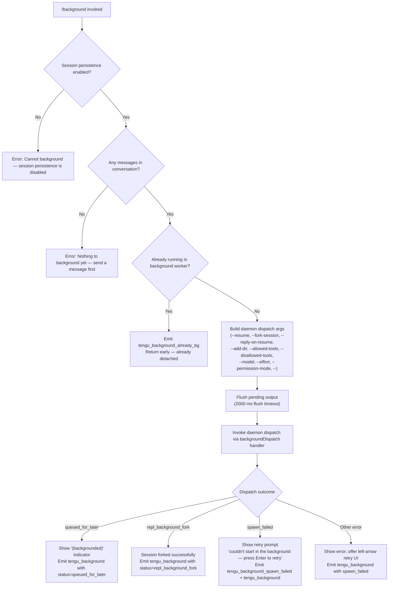

# `/background`

> Analysis basis: CC v2.1.183 bundle.js (AST extraction + Claude interpretation)
> Minimum version: v2.1.183

---

## Overview

`/background` (alias: `/bg`) detaches the current interactive REPL session from the terminal by forking it into a background daemon worker process, then exits the foreground CLI. An optional prompt argument is appended to the forked session before detachment, allowing work to continue autonomously. The session can later be re-attached via `--resume`.

---

## Registration

| Field | Value |
|---|---|
| type | `local-jsx` |
| name | `background` |
| aliases | `["bg"]` |
| description | `Send this session to the background and free the terminal` |
| argumentHint | `[prompt]` |
| immediate | `null` |
| module_id | `lPl` |
| load_inline | `true` |
| loc_byte | `13353636` |
| loc_byte_end | `13353876` |
| loc_line | `8930` |
| arbor_handler.name | `Thf` |
| arbor_handler.fqn | `claude-2.1.183::Thf` |
| arbor_handler.kind | `AsyncFunction` |
| arbor_handler.resolution_path | `module_id` |
| arbor_handler.n_hits | `0` |

Analysis basis: CC v2.1.183 bundle.js:+13353636

---

## Input Branching

The handler `Thf` contains 4+ distinct branches depending on session persistence state, whether any conversation exists, whether the current session is already backgrounded, and the outcome of the daemon dispatch. A Mermaid flowchart is used.



Analysis basis: CC v2.1.183 bundle.js:+13352910, +13353127, +13349738, +13349812

---

## Behavioral Spec

### Guard: Session Persistence Check

If session persistence is not enabled, the command immediately returns a user-facing error message without attempting any daemon interaction.

```
function checkPersistenceEnabled(sessionConfig):
    if not sessionConfig.persistenceEnabled:
        return Error("Cannot background — session persistence is disabled, so the forked job would have nothing to resume.")
```

Analysis basis: CC v2.1.183 bundle.js:+13352990

### Guard: Conversation Existence Check

If no messages have been exchanged in the current session yet, the command returns an early error, since there is nothing meaningful to fork.

```
function checkHasConversation(messages):
    if messages is empty:
        return Error("Nothing to background yet — send a message first.")
```

Analysis basis: CC v2.1.183 bundle.js:+13353166

### Guard: Already-Backgrounded Check

If the process is already executing as a daemon background worker (detected by checking the current worker context), the command short-circuits and emits a telemetry event without attempting a second fork.

```
function checkNotAlreadyBackground(workerContext):
    if workerContext.isDaemonWorker:
        emit telemetry "tengu_background_already_bg"
        return  // no-op
```

Analysis basis: CC v2.1.183 bundle.js:+13352922, +13352924

### Argument Assembly

The handler assembles the CLI argument list that the background daemon worker will use when re-spawning or continuing the session. Observed argument flags:

| Flag | Purpose |
|---|---|
| `--resume` | Resume the forked session by ID |
| `--fork-session` | Signal that this launch is a fork, not a fresh start |
| `--reply-on-resume` | Append the user-supplied prompt text on resume |
| `--add-dir` | Pass through additional directories in scope |
| `--allowed-tools` | Forward the allowed-tool list |
| `--disallowed-tools` | Forward the disallowed-tool list |
| `--model` | Forward the active model selection |
| `--effort` | Forward the effort-level setting |
| `--permission-mode` | Forward the active permission mode |
| `--` | Argument terminator before free-form prompt text |

Analysis basis: CC v2.1.183 bundle.js:+13348441, +13348454, +13348496, +13348548, +13348583, +13348624, +13348655, +13348684, +13348701, +13348729

### Permission-Mode Guards

Two additional safety gates are checked before dispatch:

1. **`bypassPermissions` gate**: If the session uses `--dangerously-skip-permissions`, the user must have previously acknowledged the disclaimer interactively. The command checks for this acceptance; if absent it returns an error directing the user to run `claude --dangerously-skip-permissions` once interactively first.

2. **Auto-mode gate**: If `--permission-mode auto` is active, the user must have opted in interactively before backgrounding is allowed.

Analysis basis: CC v2.1.183 bundle.js:+13346409, +13346546, +13346708

### Cloud/Remote Conflict Check

If `--cloud` or `--remote` flags are present on the session, the command refuses to background, emitting:

> `--bg and --cloud are different backends. Use 'claude --cloud '<task>'' directly to start a cloud session.`

Analysis basis: CC v2.1.183 bundle.js:+13291626

### Output Flush

Before handing off to the daemon, the command waits up to **2000 ms** for any pending output to flush, using a `Promise.race` between a flush completion promise and a timeout guard. If the flush times out, a `"flush timeout"` condition is noted and dispatch proceeds anyway.

```
async function flushWithTimeout(flushPromise, timeoutMs = 2000):
    result = await Promise.race([
        flushPromise,
        delay(timeoutMs).then(() => "flush timeout")
    ])
    return result
```

Analysis basis: CC v2.1.183 bundle.js:+13348377, +13348385, +13348390

### Daemon Dispatch

The core backgrounding operation is performed by the `backgroundDispatch` function (Arbor handler: `Thf` → internal dispatch chain rooted at `UX` → `mhf` → `ALo`). This:

1. Ensures the daemon is running (starting a transient or service daemon if needed).
2. Writes a dispatch file to the daemon's jobs directory.
3. Connects to the daemon's Unix domain control socket and sends the assembled argument list.
4. Waits for an acknowledgement from the daemon (timeout: **6000 ms** for the initial connection attempt, with retry logic).

```
async function backgroundDispatch(args, sessionId):
    ensureDaemonRunning()          // may prompt "Install as a service now? [y/N/never, or 'once' just for now]"
    socketPath = getDaemonSocket()
    writeDispatchFile(args)
    ack = await connectAndSend(socketPath, args, timeout=6000)
    return ack.status             // "repl_background_fork" | "queued_for_later" | error
```

Analysis basis: CC v2.1.183 bundle.js:+13321654, +13321695, +13321916, +13289189

### Outcome Handling and UI

After dispatch returns, the command renders one of several JSX outcomes using `N_e.createElement`:

| Status | User-Visible Behaviour |
|---|---|
| `repl_background_fork` | Shows `(backgrounded)` label; terminal is freed |
| `queued_for_later` | Session queued; shows status; terminal freed |
| `spawn_failed` | Shows `"couldn't start in the background — press Enter to retry"` with a `left_arrow` interactive retry control |
| Daemon unreachable | Error message with hint to check daemon health |

The prompt text supplied to `/background [prompt]` is tagged with `"command": "background"` and a 120-second timeout guard is applied to the overall render.

Analysis basis: CC v2.1.183 bundle.js:+13349448, +13349137, +13350142, +13350391, +13350621

### Daemon Cold-Start Prompt

If no daemon is running, the user may be interactively asked:

> `Install as a service now? [y/N/never, or 'once' just for now]`

Accepted inputs: `yes`, `once`, `no`, `never`. The answer is recorded and telemetry `tengu_bg_daemon_cold_start_ask_answer` is emitted.

Analysis basis: CC v2.1.183 bundle.js:+13289189, +13289320, +13289342

### Session Worker Context (Daemon Side)

On the daemon side, the worker labels itself as a `"background session"`. Shutdown sequencing uses a `"daemon_stop"` / `"daemon_stop_failed"` pair and a `"forced shutdown"` escalation path via `SIGKILL`. The worker communicates with the supervisor over a Unix socket labelled `"daemon-worker"` and emits a `"detach-request"` message type.

Analysis basis: CC v2.1.183 bundle.js:+17311741, +17311789, +17311826, +17308186, +11259680, +2302981

---

## State & Side Effects

| Item | Detail |
|---|---|
| Telemetry: `tengu_background` | Emitted on every invocation that reaches dispatch; carries `status` field (`repl_background_fork`, `queued_for_later`, `spawn_failed`) |
| Telemetry: `tengu_background_already_bg` | Emitted when `/background` is run inside an already-backgrounded worker |
| Telemetry: `tengu_background_spawn_failed` | Emitted when the daemon spawn fails outright |
| Telemetry: `tengu_bg_dispatch` | Emitted by the dispatch layer on each attempt |
| Telemetry: `tengu_bg_dispatch_fallback` | Emitted when dispatch falls back to a transient path |
| Telemetry: `tengu_bg_dispatch_rescued` | Emitted when a failed dispatch is recovered |
| Telemetry: `tengu_bg_daemon_cold_start_ask` | Emitted when the user is prompted to install the daemon |
| Telemetry: `tengu_bg_daemon_cold_start_ask_answer` | Records the user's choice |
| Telemetry: `tengu_rename_full_session_fork` | Emitted when the session name is recorded at fork time |
| Telemetry: `tengu_daemon_control` | Emitted by daemon control operations during shutdown sequencing |
| Session state | The foreground REPL exits; the forked job runs under the daemon as a background worker |
| appState changes | `getAppState` / `setAppState` are called during dispatch to tag the session as backgrounded |
| File system | A dispatch file is written to the daemon's `jobs/` directory; a temporary directory (`tmp`) may be created under the daemon path |
| Terminal | The terminal is freed by the foreground process exiting |
| Sound / hooks | No sound events found. No hook registration specific to this command found in depth-2 traversal |

Analysis basis: CC v2.1.183 bundle.js:+13349738, +13349761, +13349812, +13349886, +13352924, +13349085

---

## Version History

| Version | Change |
|---|---|
| v2.1.183 | Initial analysis |

---

## Common Mistakes

1. **Running `/background` before sending any message.** The command will refuse with "Nothing to background yet — send a message first." — the fork requires at least one conversation turn to have content worth persisting.

2. **Using `/background` when session persistence is disabled.** If the daemon or session store is not configured, the command hard-errors immediately. Ensure `claude daemon install` has been run (or a transient daemon can start) before relying on `/background`.

3. **Mixing `--cloud` with `/background`.** Cloud-backend sessions cannot be backgrounded via the daemon; they are distinct backends. Use `claude --cloud '<task>'` directly for cloud tasks.

4. **Expecting `/background` to work inside an already-backgrounded worker.** If the current process is already a daemon worker, the command silently no-ops (emits `tengu_background_already_bg`). Re-detaching a background session is not supported.

5. **Using `--dangerously-skip-permissions` without prior interactive acknowledgement.** The command enforces that the bypass-permissions disclaimer has been accepted in an interactive session before allowing backgrounding with that mode.

6. **Expecting immediate output after `/background`.** There is a 2000 ms flush timeout before hand-off to the daemon. Brief terminal delays before the prompt returns are expected.

---

## Appendix — Identifier Mapping

> For bundle debugging only. Identifiers change across versions.

| Identifier | Role |
|---|---|
| `Thf` | Main handler for `/background` command (AsyncFunction, Arbor-resolved) |
| `dzn` | Background dispatch argument builder / orchestrator |
| `UX` | Background session launcher — creates temp dir, invokes `mhf` |
| `mhf` | Core daemon dispatch implementation (assembles args, calls daemon) |
| `ALo` | Daemon connection and dispatch loop |
| `lG` | Daemon ensure-running helper (checks status, spawns if needed) |
| `d8t` | Daemon cold-start flow (service install prompt + spawn) |
| `fLo` | Dispatch file writer |
| `u8n` | Control socket connect helper (with timeout) |
| `Ry` | Unix socket send/receive helper |
| `hue` | Daemon socket file reader |
| `zRl` | Dispatch outcome classifier |
| `pzn` | JSX outcome renderer for `/background` results |
| `Uft` | Session fork / rename handler called at fork time |
| `BZp` | Fork dispatch inner loop |
| `Jx` | Agent query runner used in forked session startup |
| `v2n` | App-state updater for backgrounded session |
| `S_` | Session state reader |
| `iA` | Session persistence check helper |
| `ILo` | Permission-mode gate checker |
| `nD` | Cloud/remote conflict gate |
| `XRe` | Allowed-dirs arg collector |
| `Fs` | CLI error emitter (emits `cli_error`, calls `process.exit`) |
| `SG` | Daemon shutdown sequencer (Promise.race + process.exit) |
| `uu` | Flush-with-timeout helper (2000 ms race) |
| `Ct` | Config reader (reads session/config files) |
| `q_e` | Config file parser |
| `Ebf` | Config file watcher |
| `gMe` | Permission-set helper |
| `Gq` | Flag/tool permission resolver |
| `Shf` | Argument list filter/validator |
| `azn` | Flag expansion helper |
| `OCe` | Tool-list argument parser |
| `lzn` | Session-ID argument parser |
| `bhf` | Permission-bypass flag handler |
| `oPl` | Tool-permission argument helper |
| `rPl` | Flag filter helper |
| `Mt` | Log/telemetry store accessor |
| `Ar` | Log record emitter |
| `KHe` | Detach-request sender to daemon worker |
| `bsl` | Worker task-socket writer |
| `G6` | Socket write helper |
| `mq` | Environment / mode detector (production/test) |
| `lNe` | Tmux environment helper |
| `HRu` | Shell spawner for environment detection |
| `_Ru` | Sync shell spawn wrapper |
| `Hi` | Daemon-worker init helper |
| `T6f` | Daemon protocol message handler (main IPC loop) |
| `Auc` | Protocol dispatch throttle / retry |
| `NVt` | Stream destroy/write helper |
| `b6f` | Worker stall / respawn handler |
| `L` | Background sweep / retire loop |
| `W` | Scheduled-task runner |
| `f` | Worker lifecycle manager (spawn, kill, retire) |
| `Bn` | Graceful-shutdown timer helper |
| `De` | Telemetry logger (logError path) |
| `Ee` | String coercion utility |
| `Pe` | JSON serializer helper |
| `ct` | Telemetry event emitter |
| `dn` | Logging helper |
| `wp` | Write-file helper |
| `Mn` | Log-error helper |
| `st` | String cast utility |
| `j` | Telemetry batch helper |
| `Ue` | Feature-flag reporter (`tengu_feature_bad`) |
| `ke` | Feature-flag reporter (`tengu_feature_ok`) |
| `Re` | Feature-flag reporter (`tengu_feature_sad`) |
| `Pt` | Feature-flag reporter (`tengu_feature_sad` variant) |
| `qi` | Signal / event bus register |
| `Au` | App-config accessor |
| `G2` | Settings merge helper (userSettings / localSettings / flagSettings / policySettings) |
| `xn` | Settings loader |
| `VGn` | Compact-boundary marker helper |
| `vH` | Slice helper for conversation compaction |
| `FCe` | File-cache helper |
| `LA` | File-cache entry writer |

---

Note: index built via Arbor fallback; some signals (telemetry, literals) may be missing — see arbor-fallback.js.