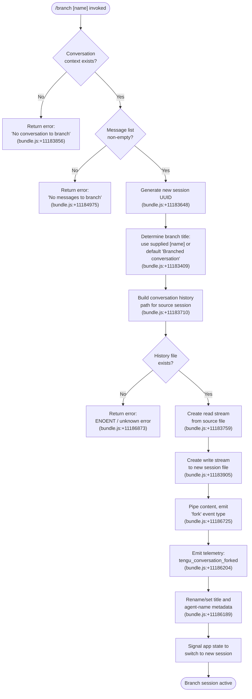

# `/branch`

> Analysis basis: CC v2.1.183 bundle.js (AST extraction + Claude interpretation)
> Minimum version: v2.1.183

---

## Overview

The `/branch` command creates a diverging copy of the current conversation at the point it is invoked, forking the message history so the user can explore an alternative direction without altering the original thread. Internally the handler (`k6p`) reads existing conversation messages, assigns a new session UUID, copies the conversation history file, and optionally applies a caller-supplied branch name before signalling a fork event. If no conversation exists, or if no messages are present, the command exits early with a descriptive error.

## Registration

| Field | Value |
|---|---|
| type | `local-jsx` |
| name | `branch` |
| description | `Create a branch of the current conversation at this point` |
| argumentHint | `[name]` |
| module_id | `_Ho` |
| load_inline | `true` |
| loc_byte | `12763537` |
| loc_byte_end | `12763714` |
| loc_line | `8420` |
| arbor_handler.name | `k6p` |
| arbor_handler.fqn | `claude-2.1.183::k6p` |
| arbor_handler.kind | `AsyncFunction` |
| arbor_handler.resolution_path | `module_id` |
| arbor_handler.n_hits | `0` |

Analysis basis: CC v2.1.183 bundle.js:+12763537

## Input Branching

The command has four distinct execution paths depending on conversation state and whether the history file already exists. A Mermaid flowchart is used.



## Behavioral Spec

### Entry Point — Main Handler (`k6p`)

The Arbor-resolved handler `k6p` is an `AsyncFunction` that orchestrates the entire branch operation.

```
async function branchCommandHandler(commandInput, appContext):
    conversationState = appContext.getCurrentConversation()
    if conversationState is null or undefined:
        return errorResult("No conversation to branch")

    messages = conversationState.messages
    if messages is empty:
        return errorResult("No messages to branch")

    newSessionId = crypto.randomUUID()
    branchTitle = commandInput.args.trim() OR "Branched conversation"

    sourcePath = buildConversationFilePath(conversationState.sessionId, appContext)
    destPath   = buildConversationFilePath(newSessionId, appContext)

    await ensureParentDirectoryExists(destPath)
    await copyConversationFile(sourcePath, destPath)

    await setSessionTitle(newSessionId, branchTitle, appContext)
    await setAgentName(newSessionId, appContext)

    emitTelemetry("tengu_conversation_forked")
    appContext.switchToSession(newSessionId)
    return successResult()
```

Analysis basis: CC v2.1.183 bundle.js:+11186989

---

### Sub-feature: Sanitize Branch Name (`sanitizeBranchName` — wraps `Jrl`)

Before the branch title is stored, the raw argument string is sanitized to remove characters that are illegal in file-system or session identifiers.

```
function sanitizeBranchName(rawName):
    # Find and replace characters that match an internal pattern
    cleaned = rawName.replace(illegalCharPattern, "")
    return cleaned
```

Analysis basis: CC v2.1.183 bundle.js:+11183461, +11183539

---

### Sub-feature: File Copy Pipeline (`copyConversationFile` — wraps `Qrl`)

The copy is performed via Node.js streaming to avoid loading the entire file into memory.

```
async function copyConversationFile(sourcePath, destPath):
    mkdir(dirname(destPath), { recursive: true })

    readStream  = fs.createReadStream(sourcePath, { encoding: "utf8" })
    writeStream = fs.createWriteStream(destPath)

    lineInterface = readline.createInterface({ input: readStream })
    outputBuffer  = []

    for each line in lineInterface:
        parsed = JSON.parse(line)
        outputBuffer.push(parsed)
        if outputBuffer.length >= 100:          # flush threshold (bundle.js:+11183576)
            drainWriteStream(writeStream, outputBuffer)
            outputBuffer = []

    drainWriteStream(writeStream, outputBuffer)
    writeStream.end()
    await streamFinished(writeStream)

    cleanupTempFiles()
```

Analysis basis: CC v2.1.183 bundle.js:+11183759, +11183905, +11183999, +11184101

Key constants observed in this path:
- Flush threshold: **100** records (bundle.js:+11183576)
- Buffer size hint: **448** bytes (bundle.js:+11183741)
- Write-stream buffer: **384** bytes (bundle.js:+11183951)
- Encoding: **`"utf8"`** (bundle.js:+11183792)

---

### Sub-feature: Conversation History Lookup (`conversationHistoryLoader` — wraps `Zrl`)

`Zrl` is called by `k6p` to resolve and load the conversation metadata before copying begins.

```
async function loadConversationContext(appContext):
    conversation = findActiveConversation(appContext.sessions)
    if not conversation:
        return null

    historyPath = buildHistoryPath(conversation.sessionId)
    stat = await fs.lstat(historyPath)
    if not stat.isFile():
        return null

    return {
        sessionId : conversation.sessionId,
        messages  : conversation.messages,
        path      : historyPath
    }
```

Analysis basis: CC v2.1.183 bundle.js:+11186008, +11186067, +11186071

---

### Sub-feature: Session Rename — Title (`setSessionTitle` — wraps `B6`)

After the file is copied, the new session receives the branch title via a title-set operation. The internal event type used is `"custom-title"` (bundle.js:+13486925).

```
async function setSessionTitle(sessionId, title, appContext):
    logEntry = buildLogEntry(type="custom-title", value=title)
    appendLogEntry(sessionId, logEntry)
    emitEvent("tengu_session_renamed")
    return title
```

Analysis basis: CC v2.1.183 bundle.js:+11186171, +13487004, +13487017

---

### Sub-feature: Session Rename — Agent Name (`setAgentName` — wraps `B6e`)

A parallel metadata write records the agent-name association for the branched session. The event type used is `"agent-name"` (bundle.js:+13490456).

```
async function setAgentName(sessionId, appContext):
    logEntry = buildLogEntry(type="agent-name", value=agentName)
    appendLogEntry(sessionId, logEntry)
    emitEvent("tengu_agent_name_set")
```

Analysis basis: CC v2.1.183 bundle.js:+11186189, +13490541, +13490554

---

### Sub-feature: Completion Signal and Fork Event (`forkSignal` — wraps `Zrl` tail)

After successful copy and metadata writes, the handler emits an ISO-8601 timestamp and records the `"fork"` event type into the new session log to mark the branch origin.

```
function emitForkCompletionRecord(newSession):
    record = {
        type      : "fork",
        timestamp : new Date().toISOString(),
        epochMs   : new Date().getTime()
    }
    appendLogEntry(newSession.sessionId, record)
    telemetry.emit("tengu_conversation_forked")
```

Analysis basis: CC v2.1.183 bundle.js:+11186725, +11186204, +11186294, +11186343

---

### Sub-feature: Autocompletion for Branch Name Argument (`completionProvider` — wraps `x6p`)

The command accepts an optional `[name]` argument. The argument hint autocompletion:

```
function provideBranchNameCompletions(partialInput, existingBranches):
    seen = new Set()
    results = []
    for candidate in existingBranches:
        normalised = candidate.replace(specialCharsPattern, "")
        id = parseInt(normalised, 10)
        if not seen.has(id):
            seen.add(id)
            results.push(candidate)
    return results
```

Analysis basis: CC v2.1.183 bundle.js:+11185678, +11185778, +11185825

---

## State & Side Effects

| Item | Detail |
|---|---|
| Telemetry | `tengu_conversation_forked` (bundle.js:+11186204) — fired on every successful branch; additional infrastructure events `tengu_session_renamed` (+13487017) and `tengu_agent_name_set` (+13490554) fire for metadata writes |
| File system | Creates a new JSONL conversation file at the platform history directory (stream-copied from the source session file) |
| Directory creation | `mkdir` with `{ recursive: true }` called before write stream opens (bundle.js:+11183710) |
| Temp file cleanup | On error, partial destination file is `unlink`-ed (bundle.js:+11184119) |
| Read stream teardown | `readStream.destroy()` called on error path (bundle.js:+11184101) |
| appState changes | Active session is switched to the newly created branch session ID after successful copy |
| Event emission | A `"fork"`-typed record is appended to the new session log to mark the branch point (bundle.js:+11186725) |
| Hook registration | `readline.createInterface` event (`"open"`, bundle.js:+11183818) and `"drain"` event (+11184216) registered on I/O streams |
| Error strings | `"No conversation to branch"` (+11183856); `"No messages to branch"` (+11184975); `"Unknown error occurred"` (+11186873) |
| Progress updates | `"progress"` event type emitted during stream copy (bundle.js:+11184893) |
| Content-replacement marker | `"content-replacement"` tag applied to rewritten lines (bundle.js:+11184336) |
| Model-refusal fallback | `"model_refusal_fallback"` metadata tag attached on certain parse failures (bundle.js:+11184650) |

## Version History

| Version | Change |
|---|---|
| v2.1.183 | Initial analysis |

## Common Mistakes

1. **Invoking `/branch` before any messages exist** — the command performs an explicit non-empty-message guard and returns `"No messages to branch"`. Send at least one user or assistant message before branching.
2. **Invoking `/branch` outside an active conversation** — if Claude Code has no current session context, the guard at the top of `k6p` returns `"No conversation to branch"` and no file is created.
3. **Expecting the original conversation to be modified** — `/branch` is a read-and-copy operation; the source session file is never modified. Both conversations continue independently after the fork.
4. **Using characters that are invalid in session file names as the branch name** — the `sanitizeBranchName` helper strips illegal characters from the `[name]` argument silently; the stored title may differ from the typed input.
5. **Assuming synchronous completion** — `k6p` is an `AsyncFunction`; the active-session switch only occurs after the stream `finished` event resolves. UI may briefly show the old session during the copy.

## Appendix — Identifier Mapping

> For bundle debugging only. Identifiers change across versions.

| Identifier | Role |
|---|---|
| `k6p` | Main branch command handler (AsyncFunction, Arbor-resolved) |
| `Zrl` | Conversation context loader / top-level orchestrator called by `k6p` |
| `Qrl` | File copy pipeline (stream copy of conversation JSONL) |
| `Jrl` | Branch name sanitizer (find/replace illegal characters) |
| `x6p` | Branch name argument completion provider |
| `B6` | Session title writer (emits `custom-title` log entry) |
| `B6e` | Agent-name metadata writer (emits `agent-name` log entry) |
| `mh` | Low-level logging helper called by `Zrl` |
| `Au` | Log entry appender called by `mh` |
| `qi` | Event registration utility called by `Au` |
| `dX` | History/completion file locator |
| `Rge` | Git worktree detection utility |
| `IOl` | Directory-recursive file scanner |
| `Ije` | Binary buffer builder utility |
| `V0` | String escape/replacement utility |
| `Di` | String index/slice utility |
| `$_e` | Synchronous log-append helper (used by `B6`, `B6e`) |
| `mq` | Telemetry mode selector |
| `jt` | Path join utility |
| `De` | Error logger / structured error emitter |
| `Ho` | Error constructor wrapper |
| `st` | String coercion utility |
| `ra` | Telemetry rate controller |
| `eJo` | Inner telemetry helper called by `ra` |
| `Bzc` | Telemetry queue manager (shift/push) |
| `Pe` | JSON serializer wrapper |
| `Gt` | JSON parser wrapper |
| `Mn` | Async notification dispatcher |
| `dn` | Low-level I/O write primitive |
| `Lt` | Session path resolver |
| `gx` | Platform path utility |
| `Ar` | Argument object builder |
| `tD` | Conversation message type formatter |
| `eO` | Message encoding helper |
| `Gm` | Content block assembler |
| `p2` | Text block constructor |
| `Hg` | Header builder |
| `S6` | Stream state checker |
| `Tn` | Background session event handler |
| `A` | Session lifecycle coordinator |
| `f` | Background session dispatch loop |
| `M` | Background session manager |
| `Dtt` | Conversation file reader |
| `d` | Supervisor write handler |
| `T` | Signal/message type resolver |
| `CQ` | Configuration query helper |
| `CMt` | `.claude` directory writer |
| `J1i` | Scheduled task filter |
| `Jnc` | Prompt reload notifier |
| `fae` | File-change aggregator |
| `g` | Socket buffer handler |
| `u` | Daemon stop controller |
| `k` | Message dispatch coordinator |
| `h` | Session timeout handler |
| `j` | Generic async task scheduler |
| `q` | Session queue |
| `Bn` | Child-process timeout wrapper |
| `o` | Padded output formatter |
| `Re` | Feature-flag OK reporter |
| `Ue` | Feature-flag inner helper |
| `ke` | Feature-flag error reporter |
| `YKn` | macOS low-memory monitor |
| `ct` | Memory-check orchestrator |
| `B$e` | Pin-file loader |
| `nDt` | Pin file path builder |
| `zAd` | Recursive directory scanner |
| `$` | Permission-classifier dispatcher |
| `zlt` | Permission rule evaluator |
| `R6` | Permission resolve chain |
| `NNo` | Daemon socket claim handler |
| `Nko` | Daemon state file writer |
| `f6f` | Claim-send timeout wrapper |
| `p6f` | Claim frame builder |
| `wp` | Socket write primitive |
| `Ee` | String coercion for socket |
| `FM` | Binary frame encoder |
| `jNo` | Background session lifecycle handler |
| `Ic` | Session file path helper |
| `fa` | Session state file reader/writer |
| `pg` | Active-session state checker |
| `OCe` | Session option collector |
| `Pp` | Session persistence helper |
| `rft` | Roster entry fetch |
| `P6t` | Path helper (qh.join + M6t) |
| `e_e` | Session export path builder |
| `iD` | Session import handler |
| `BN` | Uyo-based session path builder |
| `WM` | Late-claim handler |
| `R6t` | Roster path builder |
| `p` | Forced-shutdown handler |
| `WT` | Shutdown signal sender |
| `R` | Disposable resource wrapper |
| `m` | Active-session kill iterator |
| `l` | Stream destroy wrapper |
| `k0l` | Daemon status JSON writer |
| `ci` | AsyncLocalStorage store getter |
| `Mjt` | Status file path builder |
| `_` | SDK transport dispatcher |
| `xht` | HTTP transport selector |
| `pcc` | Object-key enumerator |
| `Ah` | Completion cache lookup |

Note: index built via Arbor fallback; some signals (telemetry, literals) may be missing — see arbor-fallback.js.