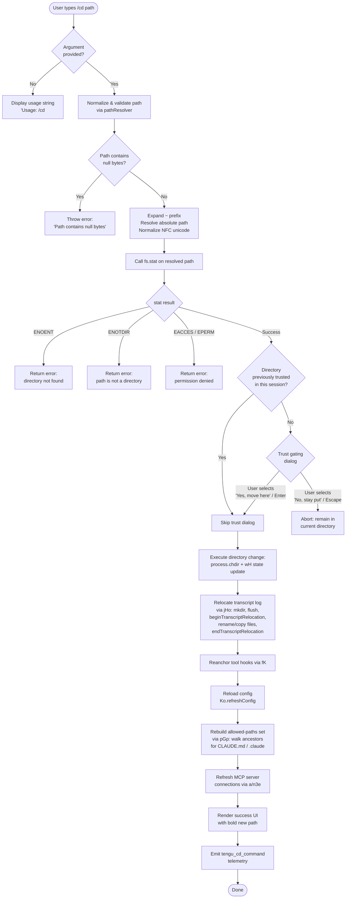

# `/cd`

> Analysis basis: CC v2.1.183 bundle.js (AST extraction + Claude interpretation)
> Minimum version: v2.1.183

---

## Overview

The `/cd` command moves the active Claude Code session to a new working directory specified by the user. It validates the target path, enforces trust gating for previously-unseen directories, performs the actual working-directory change (including `process.chdir`), relocates the transcript log, and refreshes all dependent state (config, tool permissions, context files, MCP server connections).

---

## Registration

| Field | Value |
|---|---|
| type | `local-jsx` |
| name | `cd` |
| description | Move this session to a new working directory |
| argumentHint | `<path>` |
| module_id | `kol` |
| load_inline | `true` |
| loc_byte | `11227522` |
| loc_byte_end | `11227682` |
| loc_line | `6940` |
| arbor_handler.name | `AGp` |
| arbor_handler.fqn | `claude-2.1.183::AGp` |
| arbor_handler.kind | `AsyncFunction` |
| arbor_handler.resolution_path | `module_id` |
| arbor_handler.n_hits | `0` |

Analysis basis: CC v2.1.183 bundle.js:+11227522

---

## Input Branching

The command has five or more distinct code paths based on argument presence, path validity, filesystem errors, trust state, and permission gating. A Mermaid flowchart is required.



---

## Behavioral Spec

### 1. Handler Entry — `handlerMain` (bundle identifier: `AGp`)

```
async function handlerMain(commandArgs, context):
    rawInput = commandArgs.trim()

    if rawInput is empty:
        display("Usage: /cd <path>")
        return

    resolvedPath = resolvePath(rawInput)          // see §2
    statResult   = await fs.stat(resolvedPath)    // see §3

    if needsTrustConfirmation(resolvedPath):      // see §4
        confirmed = await showTrustDialog(resolvedPath)
        if not confirmed:
            return  // user cancelled

    await applyDirectoryChange(resolvedPath, context)  // see §5
    await refreshContextAndConnections(context)        // see §6

    emit telemetry: "tengu_cd_command"
    renderSuccessMessage(resolvedPath)
```

Analysis basis: CC v2.1.183 bundle.js:+11225960 (usage string), +11226051 (stat call), +11226807 (applyDirectoryChange), +11226694 (refreshContext)

---

### 2. Path Resolution — `pathResolver` (bundle identifier: `Ds`)

```
function resolvePath(rawInput):
    if rawInput contains null bytes:
        throw Error("Path contains null bytes")

    trimmed = rawInput.trim()

    if platform is "windows":
        check for Windows-specific path patterns via regex match

    normalizedInput = unicodeNormalize(trimmed, "NFC")  // via AH

    if normalizedInput starts with "~/":
        homeDir = os.homedir()
        normalizedInput = join(homeDir, normalizedInput.slice(2))
    elif normalizedInput starts with "~\\":
        homeDir = os.homedir()
        normalizedInput = join(homeDir, normalizedInput.slice(2))

    if isAbsolute(normalizedInput):
        return path.normalize(normalizedInput)
    else:
        return path.resolve(currentWorkingDir, normalizedInput)
```

- Null-byte rejection literal: `"Path contains null bytes"` (bundle.js:+1091832)
- Tilde expansion uses `"~/"` (bundle.js:+1091960)
- Unicode normalization form: `"NFC"` (bundle.js:+68388)
- Windows platform detection string: `"windows"` (bundle.js:+1092029)

Analysis basis: CC v2.1.183 bundle.js:+1091579

---

### 3. Filesystem Validation — `statCheck` (called from `AGp`)

```
async function statCheck(resolvedPath):
    try:
        stat = await fs.stat(resolvedPath)
        return stat
    catch error:
        switch error.code:
            case "ENOENT":   return { error: "directory not found" }
            case "ENOTDIR":  return { error: "path is not a directory" }
            case "EACCES":   return { error: "permission denied" }
            case "EPERM":    return { error: "operation not permitted" }
            default:         rethrow
```

Error code literals found at: `"ENOENT"` (+11226263), `"ENOTDIR"` (+11226277), `"EACCES"` (+11226292), `"EPERM"` (+11226306).

Analysis basis: CC v2.1.183 bundle.js:+11226051

---

### 4. Trust Gating Dialog — `trustDialog` (bundle identifier: `xol` / inline JSX in `AGp`)

When the session has not previously visited the target directory, a trust confirmation dialog is rendered as a JSX component.

```
function showTrustDialog(resolvedPath):
    render dialog with:
        title:   "Claude Code"
        style:   "warning"
        body:
            "This session hasn't worked here before. Is this a directory you created or one you trust?"
            "Claude Code will be able to read, edit, and execute files here."
            link: "Security guide" → "https://code.claude.com/docs/en/security"
        options:
            [Enter / "confirm"] → "Yes, move here"   // confirm
            [Escape / "cancel"] → "No, stay put"      // abort

    return user choice
```

Literal fragments found at: `"Yes, move here"` (+11223580), `"No, stay put"` (+11223609), `"Security guide"` (+11223470), `"https://code.claude.com/docs/en/security"` (+11223426).

The stale-context warning fragment `"previous directory — that information is stale. All tool calls and "` (+11225066) indicates the dialog also surfaces a note that prior tool context is now stale.

Analysis basis: CC v2.1.183 bundle.js:+11222834 (`xol`), +11223057

---

### 5. Applying the Directory Change — `applyDirectoryChange` (bundle identifier: `fGp`)

```
async function applyDirectoryChange(resolvedPath, context):
    // 1. Resolve the real path (follow symlinks)
    realPath = await fs.realpath(resolvedPath)

    // 2. Change process working directory
    process.chdir(realPath)

    // 3. Update internal CWD state tracker (wH)
    updateCwdState(realPath)              // emits tengu_shell_set_cwd

    // 4. Emit path-change event to subscribers (DD → Atr.emit)
    emitCwdChangeEvent(realPath)

    // 5. Relocate transcript log to new directory (jHo)
    await relocateTranscript(realPath)

    // 6. Reanchor hook file paths (fK → hoe.reanchor)
    reanchorHooks(realPath)

    // 7. Reload config for new directory context
    Ko.refreshConfig()

    // 8. Rebuild ancestor CLAUDE.md / .claude allowed-paths set (pGp)
    rebuildAllowedPaths(realPath)

    // 9. Escape-encode path for display (XGn)
    displayPath = htmlEscape(realPath)
```

- `process.chdir` call at bundle.js:+11224530
- `tengu_shell_set_cwd` telemetry emitted inside `wH` at bundle.js:+7031167
- `Ko.refreshConfig()` call at bundle.js:+11224851
- `tengu_cd_command` telemetry fired at bundle.js:+11224872

Analysis basis: CC v2.1.183 bundle.js:+11224518

---

### 6. Transcript Relocation — `relocateTranscript` (bundle identifier: `jHo`)

```
async function relocateTranscript(newDir):
    newTranscriptDir = path.join(newDir, "cd")   // literal "cd" at +13468905

    // Signal log writer to pause and hold
    transcriptWriter.beginTranscriptRelocation()

    // Flush any pending writes
    transcriptWriter.flush()

    // Create destination directory (mode 0o700 = octal 448)
    await fs.mkdir(newTranscriptDir, { recursive: true, mode: 448 })

    // Move or copy existing transcript files (KPl)
    await moveOrCopyFiles(currentTranscriptDir, newTranscriptDir)

    // Update internal path reference
    updateTranscriptPath(newTranscriptDir)

    // Resume log writer
    transcriptWriter.endTranscriptRelocation()
```

- Directory creation mode `448` (decimal) = `0o700` octal, found at bundle.js:+13469066
- File move errors handled: `"EEXIST"` (+13469411), `"EBUSY"` (+13469438), `"ENOTEMPTY"` (+13469451), `"EXDEV"` (+13469552), `"EISDIR"` (+13469616), `"ENOTSUP"` (+13469630)

Analysis basis: CC v2.1.183 bundle.js:+13468842

---

### 7. Allowed-Paths Rebuild — `rebuildAllowedPaths` (bundle identifier: `pGp`)

```
function rebuildAllowedPaths(newDir):
    allowedSet = new Set()

    // Walk ancestor directories collecting CLAUDE.md / CLAUDE.local.md
    current = newDir
    while current != parsed.root:
        allowedSet.add(normalize(current))
        parentDirs.push(path.dirname(current))
        current = path.dirname(current)

    parentDirs.reverse()

    // Scan each ancestor for CLAUDE.md, .claude/rules/*.md (sRt / Nve)
    for each dir in parentDirs:
        scanForMemoryFiles(dir, allowedSet)

    // Collect context file entries for display (oRt)
    contextEntries = buildContextList(allowedSet)
    return contextEntries
```

Memory file names referenced: `"CLAUDE.md"` (+5059677), `"CLAUDE.local.md"` (+5059845), `".claude"` (+5059744), `"rules"` (+5059926)

Analysis basis: CC v2.1.183 bundle.js:+11224323

---

### 8. MCP State Refresh — `mcpRefresh` (bundle identifier: `a` → `n3e` / `B1o`)

After the CWD changes, MCP server configurations are reloaded and connections re-evaluated:

```
async function mcpRefresh(context):
    // Re-read MCP config from new directory context (n3e)
    newConfig = await readMcpConfig()

    // Apply diffs: connect new servers, disconnect removed ones (B1o / uZn)
    await applyMcpUpdate(context.mcpState, newConfig)

    // For each remaining server, refresh tool list
    await Promise.all(servers.map(s => s.refreshTools()))
```

Analysis basis: CC v2.1.183 bundle.js:+11227100 (call to `a`), +16919733 (`n3e`), +16920971 (`B1o`)

---

### 9. Success Rendering — `successMessage` (bundle identifier: `mGp`)

```
function renderSuccess(resolvedPath):
    displayPath = htmlEscape(resolvedPath)       // XGn: &amp; &lt; &gt; &#13; &#10;
    boldPath    = Ht.bold(displayPath)
    output      = "Moving to a new directory: " + boldPath
    render(output)
```

- `"Moving to a new directory:"` literal at bundle.js:+11224062
- Bold formatting call to `Ht.bold` at bundle.js:+11225367 and +11226088

Analysis basis: CC v2.1.183 bundle.js:+11225261

---

## State & Side Effects

| Item | Detail |
|---|---|
| Telemetry — `tengu_cd_command` | Fired after successful directory change; bundle.js:+11224872 |
| Telemetry — `tengu_shell_set_cwd` | Fired inside CWD state updater (`wH`) whenever the shell CWD is set; bundle.js:+7031167 |
| `process.chdir` | Node.js built-in called to change the process working directory; bundle.js:+11224530 |
| CWD state (`wH`) | Internal async-storage CWD tracker updated; emits event via `Atr.emit`; bundle.js:+7031047 |
| Transcript relocation (`jHo`) | Transcript log directory is moved/copied to a subdirectory inside the new working directory; bundle.js:+13468842 |
| Hook reanchor (`fK → hoe.reanchor`) | All registered tool hooks have their file-path anchors updated to the new directory; bundle.js:+11224800 |
| Config reload (`Ko.refreshConfig`) | Project and local settings files are re-read from the new directory hierarchy; bundle.js:+11224851 |
| Allowed-paths set (`pGp`) | Ancestor CLAUDE.md / .claude files rescanned; set rebuilt; bundle.js:+11224323 |
| MCP connections (`a / n3e / B1o`) | MCP config re-evaluated; servers added/removed/reconnected as needed; bundle.js:+11227100 |
| Trust store | Previously-unseen directories require interactive trust confirmation before any change is applied |
| App-state session (`Fr`) | Session app-state (`working_directory`, `allowed_tools`, `permission_mode`, etc.) re-read after move; bundle.js:+10852888 |

---

## Version History

| Version | Change |
|---|---|
| v2.1.183 | Initial analysis |

---

## Common Mistakes

1. **Omitting the path argument** — `/cd` with no argument displays `Usage: /cd <path>` and does nothing. Always supply a path: `/cd ~/projects/myapp`.
2. **Supplying a file path instead of a directory** — The command calls `fs.stat` and rejects `ENOTDIR`; supply a directory, not a file.
3. **Paths with null bytes** — The path resolver explicitly rejects inputs containing null bytes with the error `"Path contains null bytes"`. This can occur when arguments are constructed programmatically with untrusted input.
4. **Expecting the old context to remain valid** — After `/cd` succeeds, all prior tool-context references (open file handles, relative paths, CLAUDE.md rules) are invalidated and reloaded from the new location. The session displays a stale-context warning.
5. **Untrusted directories** — Moving into a directory the session has not visited before triggers a trust dialog. Dismissing it (Escape or "No, stay put") leaves the session in the original directory.
6. **Transcript loss on abrupt failure** — The transcript relocation procedure uses `beginTranscriptRelocation` / `flush` / `endTranscriptRelocation` to guard against data loss; killing the process mid-move may leave the transcript in an inconsistent state.

---

## Appendix — Identifier Mapping

> For bundle debugging only. Identifiers change across versions.

| Identifier | Role |
|---|---|
| `AGp` | Main async handler for `/cd` command (handler entry point) |
| `Ds` | Path resolver / validator (null-byte check, tilde expansion, NFC normalize, absolute resolution) |
| `fGp` | Apply directory change (process.chdir, state update, transcript relocation, hook reanchor, config reload) |
| `jHo` | Transcript relocation orchestrator (mkdir, flush, beginTranscriptRelocation, file move/copy, endTranscriptRelocation) |
| `KPl` | File mover used inside transcript relocation (rename / rm / copyFile with error handling) |
| `fOl` | Recursive directory copier used as fallback in transcript relocation |
| `pGp` | Allowed-paths rebuilder (walks ancestors, collects CLAUDE.md / .claude entries) |
| `sRt` | CLAUDE.md file scanner (walks directory tree collecting memory files) |
| `Nve` | Directory tree walker used by `sRt` for scanning memory files |
| `oRt` | Context entry list builder (formats allowed-path entries for display) |
| `mGp` | Success message renderer (bold path display) |
| `wol` | Permission / allowed-path checker called during directory evaluation |
| `uGp` | Sub-function in allowed-path logic handling pattern matching |
| `xHf` | Permission resolver combining multiple config layers |
| `k5t` | Path pattern matcher (handles `~`, `..`, `../` prefixes, regex for glob patterns) |
| `sGe` | Permission decision maker used by `xHf` |
| `dGp` | Deny/allow decision emitter in permission flow |
| `_q` | Deny-rule aggregator |
| `SA` | Rule string formatter / sanitizer |
| `VHe` | Auto/plan mode permission evaluator |
| `j5e` | Shell-type detector (pwsh, powershell, cmd, wsl) used in path handling |
| `x3t` | Shell command scanner for dangerous patterns |
| `Fr` | Session app-state reader (working_directory, allowed_tools, permission_mode, etc.) |
| `b6n` | App-state message builder for `working_directory` |
| `T6n` | App-state message builder for tool lists |
| `mB` | System prompt updater called after CWD change |
| `ct` | Core render / hook scheduling utility |
| `Ct` | React render scheduler |
| `Dpt` | System prompt injector (type "system") |
| `P5t` | Secondary system prompt injector |
| `wH` | Shell CWD state manager (emits `tengu_shell_set_cwd`) |
| `emr` | Async-storage CWD reader |
| `DD` | CWD event emitter (calls `Atr.emit`) |
| `Igt` | Path normalizer utility |
| `fK` | Hook reanchor dispatcher (calls `hoe.reanchor`) |
| `bE` | Side-effect flush after directory change |
| `XGn` | HTML entity escaper for path display (`&amp;`, `&lt;`, `&gt;`, `&#13;`, `&#10;`) |
| `vw` | Display value formatter |
| `AH` | Unicode NFC normalizer |
| `OD` | Symlink-aware path resolution with trust-set management |
| `Yor` | Symlink chain resolver |
| `Zde` | Real-path resolver with symlink tracking |
| `jp` | Canonical-path finder using realpathSync |
| `D5t` | Home-directory prefix stripper for display |
| `Mt` | Async-storage getter (reads current store) |
| `Qen` | Store reader with fallback |
| `Ar` | Global state accessor |
| `gx` | Global registry map |
| `jt` | Promise utility / async helper |
| `dn` | No-op / identity utility |
| `ms` | Message builder / formatter |
| `Mn` | Path-display formatter (with tilde substitution) |
| `a` | MCP refresh orchestrator entry point |
| `n3e` | MCP config loader and server diff applier |
| `uZn` | MCP connection updater (applyMcpUpdate) |
| `B1o` | MCP client reconciler (filter, connect, disconnect) |
| `fw` | MCP cleanup helper |
| `hot` | MCP hash/config comparator |
| `mta` | MCP state holder initializer |
| `Szr` | MCP server state manager |
| `jLn` | MCP server filter (has-checks against allow/deny sets) |
| `Bn` | Async retry / timeout wrapper |
| `dW` | MCP config reader with layer merging |
| `W7` | MCP server instance manager |
| `Ort` | MCP server config validator |
| `k5` | MCP SDK entry builder |
| `NLn` | MCP warning/error color formatter |
| `Mrt` | MCP server connection-result applier |
| `Nk` | MCP tool registry |
| `P_` | MCP tool registration helper |
| `EKr` | MCP tool entry builder |
| `pra` | MCP server polling / watch setup |
| `Vwe` | MCP config hash generator |
| `Phn` | MCP hash helper |
| `Ohn` | MCP capability hash |
| `EI` | MCP resource hash |
| `Mhn` | MCP server metadata store |
| `dc` | MCP metadata serializer |
| `oxn` | MCP OAuth server handler |
| `CBd` | MCP OAuth connection manager |
| `vBd` | MCP OAuth callback handler |
| `Sra` | MCP connection polling loop |
| `OKr` | MCP reconnection handler |
| `yKr` | MCP notification router |
| `pn` | MCP notification dispatcher |
| `on` | MCP debug logger |
| `Cu` | MCP error logger |
| `Uk` | MCP tool-skills tracker (emits `tengu_mcp_skills`) |
| `kz` | Background worker clock utility |
| `L` | Background worker sweep loop |
| `w` | Background worker registry |
| `Dec` | Background worker away-summary handler |
| `d0n` | MCP cache path builder |
| `ci` | Async-local-storage reader for request context |
| `xol` | JSX memo-cache sentinel / trust dialog component wrapper |
| `lQc` | Rule string validator |
| `nk` | Object.hasOwn wrapper |
| `cQc` | Rule comparator |
| `aQc` | Rule escape helper |
| `iQc` | String replace-all utility |
| `Zf` | String sanitizer for display |
| `Qke` | Keyword checker |
| `its` | Keyword list |
| `aI` | Path normalizer with replaceAll |
| `wh` | Config file locator |
| `u5` | Directory entry classifier |
| `tRt` | gitignore-aware path filter |
| `Pe` | JSON serializer wrapper |
| `Kc` | Log entry formatter |
| `Hqe` | String truncator |
| `n_c` | Log file writer |
| `De` | Error logger / structured log writer |
| `Ho` | Error constructor helper |
| `ra` | Log queue manager |
| `Bzc` | Log rotation helper |
| `T` | Generic render / message dispatcher |
| `QHc` | Fallback output formatter |
| `Au` | Hook registration dispatcher |
| `qi` | Hook registry (calls `B2o.register`) |
| `mq` | Environment detector (production/test) |
| `st` | String coercer |
| `aOl` | Environment flag reader |
| `E9` | Test mode checker |
| `lNe` | Output stream writer |
| `Yb` | Event emitter wrapper |
| `L2o` | Listener registration helper |
| `w2o` | Event dispatch helper (calls `Izt.emit`) |
| `Wn` | State diff utility |
| `l1t` | List deduplicator |
| `Ee` | String coercer (calls `String()`) |
| `m` | Worker kill orchestrator |
| `k` | Individual worker terminator |
| `v` | Worker state enum |
| `gra` | Async generator / stream utility |
| `U8` | Stream mapper (requires mapper function) |
| `Hot` | Integer parser (parseInt base-10) |
| `p0n` | Integer parser (parseInt base-20) |
| `uK` | Path normalizer via `zO.normalize` |
| `Lr` | MCP server logger |

---

Note: index built via Arbor fallback; some signals (telemetry, literals) may be missing — see arbor-fallback.js.