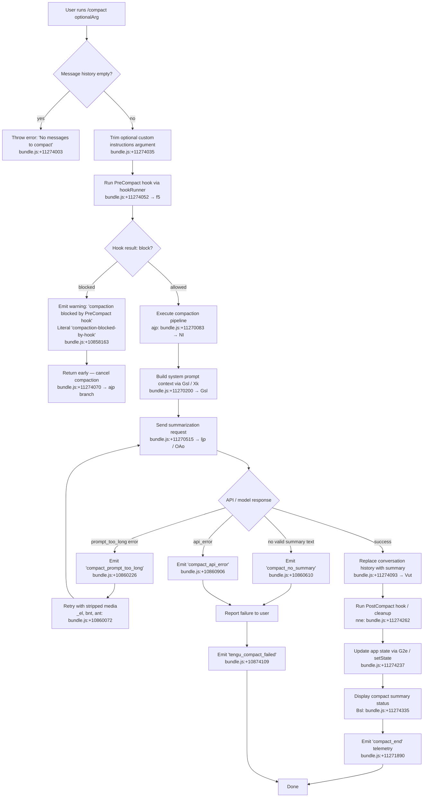

# `/compact`

> Analysis basis: CC v2.1.183 bundle.js (AST extraction + Claude interpretation)
> Minimum version: v2.1.183

---

## Overview

The `/compact` command frees up available context window space by summarizing the current conversation into a condensed representation, replacing prior message history with a compact summary. It accepts an optional argument for custom summarization instructions and supports both manual invocation and automatic (reactive) triggering when the context approaches its limit.

---

## Registration

| Field | Value |
|---|---|
| type | `local` |
| name | `compact` |
| description | `Free up context by summarizing the conversation so far` |
| argumentHint | `<optional custom summarization instructions>` |
| supportsNonInteractive | `true` |
| thinClientDispatch | `post-text` |
| module_id | `jsl` |
| load_inline | `true` |
| loc_byte | `11274971` |
| loc_byte_end | `11275271` |
| loc_line | `7028` |
| arbor_handler.name | `ijp` |
| arbor_handler.fqn | `claude-2.1.183::ijp` |
| arbor_handler.kind | `AsyncFunction` |
| arbor_handler.resolution_path | `module_id` |
| arbor_handler.n_hits | `0` |

Analysis basis: CC v2.1.183 bundle.js:+11274971

---

## Input Branching

There are 4+ distinct branches in the handler depending on message availability, argument trimming, hook results, and compaction outcome. A Mermaid flowchart is used.



---

## Behavioral Spec

### Entry Point — Main Handler (`ijp`)

The main handler (`ijp`, `AsyncFunction`) is the entry point resolved via `module_id` → `jsl`. It validates the message history, optionally trims the user-supplied custom instructions, and then routes to the two principal sub-flows: hook gate and compaction executor.

```
async function compactCommandHandler(options, customArg):
    if no messages in conversation:
        throw Error("No messages to compact")   // bundle.js:+11274003

    trimmedInstructions = customArg?.trim() ?? ""  // bundle.js:+11274035

    hookResult = await runPreCompactHook(trimmedInstructions)  // f5, bundle.js:+11274052
    if hookResult.blocked:
        emitWarning("compaction-blocked-by-hook")  // bundle.js:+10858163
        return

    compactionResult = await executeCompaction(options, trimmedInstructions)
                                               // ajp, bundle.js:+11274070

    if compactionResult.success:
        await postCompactCleanup(options)      // nne, bundle.js:+11274262
        await updateConversationState(compactionResult)  // G2e, bundle.js:+11274237
        await displayCompactStatus(compactionResult)     // Bsl, bundle.js:+11274335
    else:
        reportCompactionFailure(compactionResult.error)

    emit("compact_end")                        // bundle.js:+11271890
```

Analysis basis: CC v2.1.183 bundle.js:+11274071–11274722

---

### PreCompact Hook Gate (`f5`)

Before any summarization occurs, the `f5` function runs the `PreCompact` hook (hook type literal `"PreCompact"`, bundle.js:+13575116). If any registered hook responds with a block directive, compaction is cancelled and a warning notification (literal `"compaction-blocked-by-hook"`, bundle.js:+10858163) is emitted.

```
async function runPreCompactHook(instructions):
    hookEvent = { type: "PreCompact", instructions }
    result = await hookRunner(hookEvent)  // Lr: bundle.js:+5077227; ct: bundle.js:+5077249
    return result
```

Analysis basis: CC v2.1.183 bundle.js:+11274052

---

### Compaction Executor (`ajp`)

This is the primary compaction orchestration function. It:
1. Records a performance timestamp (`performance.now`, bundle.js:+11270061).
2. Gathers current conversation state and system prompt context via `Gsl` (bundle.js:+11270200).
3. Assembles message lists for summarization via `lX` and `cx` (bundle.js:+11270125).
4. Emits progress tracking literals such as `"compact_progress"` (bundle.js:+11269924), `"hooks_start"` (bundle.js:+11269955), `"pre_compact"` (bundle.js:+11269978), `"sdk_status"` (bundle.js:+11270020), `"compacting"` (bundle.js:+11270040).
5. Calls the summarization agent via `ljp` (bundle.js:+11270515).
6. On success, stores compaction metadata (literal `"compactMetadata"`, bundle.js:+11271345) and emits `"compact_start"` (bundle.js:+11270484).
7. On failure, classifies the error and emits appropriate telemetry (see State & Side Effects).

```
async function executeCompaction(options, instructions):
    startTime = performance.now()              // bundle.js:+11270061
    emit("compact_progress")                   // bundle.js:+11269924

    conversationState = await buildConversationContext(options)
                                               // Gsl, bundle.js:+11270200
    messageSet = await assembleMessages(conversationState)
                                               // lX + cx, bundle.js:+11270125

    emit("compact_start")                      // bundle.js:+11270484

    response = await callSummarizationModel(messageSet, instructions)
                                               // ljp → OAo, bundle.js:+11270515

    if response has valid text:
        return { success: true, summary: response.text,
                 metadata: compactMetadata }
    else if response is prompt_too_long:
        strippedMessages = stripMediaBlocks(messageSet)
                                               // _el, bundle.js:+10860072
        return retry with strippedMessages
    else:
        classify and return error result
```

Analysis basis: CC v2.1.183 bundle.js:+11270061–11270848

---

### Conversation Context Assembly (`Gsl` → `Xk`)

`Gsl` (bundle.js:+11270200) calls `e.getAppState` to retrieve the live application state, then delegates to `Xk` (bundle.js:+11273483) which assembles the full system prompt context passed to the summarization model. This includes:
- Environment information (`env_info_static`, `env_info_simple`, bundle.js:+13694470, +13694507).
- Context management settings (`context_management`, bundle.js:+13694698).
- Flag settings (`flagSettings`, bundle.js:+13703591).
- Tool definitions and permission context.

```
async function buildConversationContext(options):
    appState = options.getAppState()           // bundle.js:+11273459
    systemPromptContext = await assembleSystemContext(appState)
                                               // Xk, bundle.js:+11273483
    lastSummary = findLastSummaryMessage(appState)
                                               // Fr, bundle.js:+11273537
    return { appState, systemPromptContext, lastSummary }
```

Analysis basis: CC v2.1.183 bundle.js:+11273459–11273787

---

### Summarization Model Call (`ljp` → `OAo`)

`ljp` (bundle.js:+11270515) sends the assembled message context to the AI model via `OAo` (bundle.js:+11272297), which uses `Promise.race` (bundle.js:+10682565) to handle concurrent abort signals. The compaction agent is restricted to text-only output — tool use during compaction is explicitly denied (literal `"Tool use is not allowed during compaction"`, bundle.js:+10869891; `"compaction agent should only produce text summary"`, bundle.js:+10869971).

The summarization system prompt begins with: `"You are a helpful AI assistant tasked with summarizing conversations."` (bundle.js:+10872772).

```
async function callSummarizationModel(messages, instructions):
    // OAo: bundle.js:+10682408
    abortRace = Promise.race([modelCall, abortSignal])
    response = await abortRace

    if aborted:
        emit("miss_not_ready" or "aborted")    // bundle.js:+11272382, +11272460
        return { error: "aborted" }

    if boundary UUID missing:
        emit("boundary_uuid_missing")          // bundle.js:+11272714
        return { error: "boundary_uuid_missing" }

    if response contains valid text:
        emit("hit")                            // bundle.js:+11272841
        return { success: true, text: response.text }

    return { error: classifyError(response) }
```

Analysis basis: CC v2.1.183 bundle.js:+11270515–11273248

---

### Compaction Application and State Replacement (`Vut`)

After a successful summary is obtained, `Vut` (bundle.js:+11274093) replaces the conversation history. This involves:
- Identifying the compaction boundary via `"compact_boundary"` messages (bundle.js:+13908934).
- Inserting a new `"system"` role message (bundle.js:+13908912) tagged with `"compact_boundary"`.
- Setting `"Conversation compacted"` as the displayed summary header (bundle.js:+13908490).
- Running post-compact file restoration for any referenced files (`P5n`, `F5n`, `U5n`, `N5n`: bundle.js:+10861156–10861264).
- Emitting `tengu_compact_cache_prefix` (bundle.js:+10859790) for cache-sharing telemetry.

```
async function applyCompactionResult(summary, options):
    // Vut: bundle.js:+10858990
    boundary = createCompactBoundary()         // type="system", "compact_boundary"
                                               // bundle.js:+13908912, +13908934

    newHistory = [boundary, summaryMessage]

    await restorePostCompactFiles(options)     // P5n/F5n/U5n/N5n
    options.setAppState({ messages: newHistory })
    // t.getAppState: bundle.js:+10859208
```

Analysis basis: CC v2.1.183 bundle.js:+10858990–10864186

---

### Post-Compact Cleanup (`nne`)

After the state replacement, `nne` (bundle.js:+11274262) performs a set of cache and state invalidations:
- Clears pending abort signals (`x5n`, bundle.js:+10686007).
- Clears caches (`T5n`, `gea`: bundle.js:+10686472, +10686478).
- Resets autonomous loop delivery counter (`K2p.resetAutonomousLoopDelivered`, bundle.js:+10686510).
- Emits `"post_compact_cleanup"` (bundle.js:+10686383) and `"subagent_exit"` (bundle.js:+10686108).

```
async function postCompactCleanup(options):
    // nne: bundle.js:+11274262
    clearPendingAbortSignals()                 // x5n
    clearConversationCaches()                  // T5n, gea
    resetAutonomousLoopDelivered()             // K2p.resetAutonomousLoopDelivered
    resetOutputValues()                        // ry, Object.values: bundle.js:+10686560
    emit("post_compact_cleanup")               // bundle.js:+10686383
```

Analysis basis: CC v2.1.183 bundle.js:+11274262–11274335

---

### Compact Status Display (`Bsl`)

`Bsl` (bundle.js:+11274335) renders the user-visible compact result:
- Registers a keybinding `app:toggleTranscript` / `ctrl+o` (bundle.js:+11273264, +11273296) labelled `"Global"`.
- Displays a dimmed status message: `"Compacted "` (bundle.js:+11273403) with token count details.
- Joins the output lines for terminal display (`o.join`, bundle.js:+11273416).

```
function displayCompactStatus(result):
    // Bsl: bundle.js:+11273248
    registerKeybinding("app:toggleTranscript", "ctrl+o", "Global")
    status = "Compacted " + formatTokenDelta(result)
    renderDimmed(status)                       // Ht.dim, bundle.js:+11273396
```

Analysis basis: CC v2.1.183 bundle.js:+11273248–11273416

---

### Reactive (Automatic) Compaction (`Vut` / `jAo`)

Separate from manual `/compact`, the bundle implements reactive compaction triggered automatically when context usage is high. The literal `"reactive_compact"` (bundle.js:+10694436) distinguishes this path. Key behaviors:
- Requires at least 2 message groups to compact (literal `"Reactive compact: fewer than 2 groups, nothing to compact"`, bundle.js:+5235645; telemetry `"too_few_groups"`, bundle.js:+5235735).
- Requires at least one assistant message in the summarization set (literal `"Reactive compact: no assistant messages in summarize set, bailing"`, bundle.js:+5236209).
- Retries with stripped media on `media_too_large` errors (literal `"Reactive compact: summarize hit media-size error, retrying stripped"`, bundle.js:+5237336).
- Reports `tengu_reactive_compact_attempt`, `tengu_reactive_compact_succeeded`, or `tengu_reactive_compact_failed`.

```
async function reactiveCompaction(context):
    // jAo: bundle.js:+10690069
    groups = splitIntoCompactionGroups(context.messages)
    if groups.length < 2:
        emit("too_few_groups")
        return { skip: true }

    assistantMessages = groups.filter(hasAssistantMessage)
    if assistantMessages.length == 0:
        return { skip: true }

    result = await runSummarizationPass(groups)
    if result.error == "media_too_large":
        strippedGroups = stripMediaFromGroups(groups)
        result = await runSummarizationPass(strippedGroups)

    return result
```

Analysis basis: CC v2.1.183 bundle.js:+10690069–10691126

---

## State & Side Effects

| Item | Detail |
|---|---|
| Telemetry: `tengu_compact` | Emitted on each compaction attempt (bundle.js:+10862205) |
| Telemetry: `tengu_compact_failed` | Emitted on compaction failure (bundle.js:+10874109) |
| Telemetry: `tengu_compact_cache_prefix` | Emitted for cache-sharing tracking (bundle.js:+10859790) |
| Telemetry: `tengu_compact_cache_sharing_success` | Cache sharing succeeded (bundle.js:+10870835) |
| Telemetry: `tengu_compact_cache_sharing_fallback` | Cache sharing fell back (bundle.js:+10871465) |
| Telemetry: `tengu_compact_credits_clamp_rescue` | Credit clamp rescue during reactive compact (bundle.js:+5236297) |
| Telemetry: `tengu_reactive_compact_attempt` | Reactive compact triggered (bundle.js:+5236454) |
| Telemetry: `tengu_reactive_compact_succeeded` | Reactive compact succeeded (bundle.js:+10692886) |
| Telemetry: `tengu_reactive_compact_failed` | Reactive compact failed (bundle.js:+10690417) |
| Telemetry: `tengu_precomputed_compact_consumed` | Pre-computed compact result used (bundle.js:+10685057) |
| Telemetry: `tengu_precomputed_compact_discarded` | Pre-computed compact result discarded (bundle.js:+10685696) |
| Telemetry: `tengu_compact_ptl_retry` | Prompt-too-long retry occurred (bundle.js:+10860266) |
| Telemetry: `tengu_model_fallback_triggered` | Model fallback during compact (bundle.js:+10874448) |
| Telemetry: `tengu_post_compact_file_restore_success` | Post-compact file restore succeeded (bundle.js:+10875361) |
| Telemetry: `tengu_post_compact_file_restore_error` | Post-compact file restore failed (bundle.js:+10875403) |
| Hook: PreCompact | Fired before summarization begins; can block compaction (literal `"PreCompact"`, bundle.js:+13575116) |
| Hook: PostCompact | Fired after compaction completes (literal `"PostCompact"`, bundle.js:+13608883) |
| appState changes | Conversation messages replaced with `[compact_boundary_system_msg, summary_msg]`; app state updated via `e.setAppState` (bundle.js:+10848212) |
| Keybinding registration | `app:toggleTranscript` bound to `ctrl+o` / `Global` on completion (bundle.js:+11273264) |
| Cache invalidation | Clears `eQa`, `COt`, `izr` caches; resets autonomous loop counters (bundle.js:+10664533, +6675402, +6675414) |
| Sound | <!-- TODO: not found in depth-2 traversal; needs --depth 4 --> |
| Progress literals emitted | `"compact_progress"`, `"hooks_start"`, `"pre_compact"`, `"sdk_status"`, `"compacting"`, `"compact_start"`, `"compact_end"` |
| Error literals | `"No messages to compact"` (bundle.js:+11274003), `"Compaction canceled."` (bundle.js:+11274544), `"Compaction failed · conversation could not be reduced below the context limit"` (bundle.js:+11271015), `"Compaction failed · attached media exceeds size limits"` (bundle.js:+11271137) |
| Compact type differentiation | `"compact_auto"` vs `"compact_manual"` (bundle.js:+10858950, +10858965); `"reactive_compact"` (bundle.js:+10694436) |
| Compaction-blocked notification | Literal `"compaction-blocked-by-hook"` / `"compaction blocked by PreCompact hook"` (bundle.js:+10858163, +10858197) |
| Fable model policy guard | If only Fable 5 is allowed and it requires credits, emits `"compact_no_allowed_fallback"` and shows message (bundle.js:+10872341) |

---

## Version History

| Version | Change |
|---|---|
| v2.1.183 | Initial analysis |

---

## Common Mistakes

1. **Running `/compact` with an empty conversation**: The handler explicitly throws `"No messages to compact"` if there are no messages — the command must be used mid-conversation.
2. **Expecting PreCompact hooks to be skipped**: Any hook registered as `PreCompact` can block the compaction entirely; if `/compact` appears to do nothing, check hook registrations.
3. **Assuming all models support compaction**: The `compact_no_allowed_fallback` guard means users whose model policy is restricted to models requiring usage credits (e.g., Fable 5 only) may be unable to compact — the command will display an error instead.
4. **Supplying very long custom instructions**: The argument is trimmed but not otherwise validated before being passed to the summarization model; extremely long instructions may contribute to prompt-too-long errors that trigger a media-stripped retry.
5. **Misunderstanding reactive vs. manual compact**: The `/compact` command is the manual path (`"compact_manual"`). The system also triggers compaction automatically (`"compact_auto"`, `"reactive_compact"`) near context limits — these are separate code paths and the `/compact` command does not control the reactive threshold.

---

## Appendix — Identifier Mapping

> For bundle debugging only. Identifiers change across versions.

| Identifier | Role |
|---|---|
| `ijp` | Main `/compact` command handler (AsyncFunction, entry point) |
| `ajp` | Compaction executor / orchestrator |
| `Gsl` | Conversation context builder (calls `getAppState`, `Xk`) |
| `Xk` | System prompt context assembler |
| `ljp` | Summarization model call dispatcher |
| `OAo` | Model API call with abort-race handling |
| `qdt` | Compaction response parser / token accounting |
| `Vut` | Compaction application — replaces conversation history |
| `Sel` | Compaction agent loop / streaming handler |
| `nne` | Post-compact cleanup (cache invalidation, state reset) |
| `Bsl` | Compact status display renderer |
| `G2e` | App state updater (`LRt.setState`) |
| `jAo` | Reactive compaction orchestrator |
| `Rvn` | Reactive compaction summarization pass |
| `_Ld` | Reactive compaction summarization core |
| `M5n` | Full compaction pipeline (manual path) |
| `vke` | Compaction message assembly helper |
| `WAo` | Post-compact message builder |
| `f5` | PreCompact hook runner |
| `lX` | Message set assembler for summarization |
| `cx` | Hook execution context / callback runner |
| `Fr` | Last summary finder in app state |
| `b6` | System prompt loader |
| `mB` | Context manager helper |
| `NI` | API query executor |
| `O9p` | Context pre-processor |
| `$6n` | Message normalizer for summarization |
| `P5n` | Post-compact file restore — tool results |
| `F5n` | Post-compact file restore — app state files |
| `U5n` | Post-compact file restore — conversation files |
| `N5n` | Post-compact file restore — additional files |
| `dHe` | Post-compact hook dispatcher |
| `Cke` | Compaction permission controller |
| `gi` | UUID / timestamp generator |
| `nW` | Hook loader (plugin hooks) |
| `z2p` | Post-compact pipeline coordinator |
| `KCe` | Telemetry / metrics emitter |
| `Ru` | OpenTelemetry resource attribute builder |
| `V$e` | OTEL metrics attribute assembler |
| `DOt` | Tracing span creator for compaction |
| `TBi` | Token budget / math helper |
| `yLd` | Reactive compact retry helper |
| `FRt` | Compact boundary message builder |
| `bnt` | Message partition helper |
| `ant` | Abort/error type classifier |
| `she` | Array content checker |
| `bRt` | Version string parser |
| `sN` | String prefix checker |
| `LL` | Full message rendering pipeline |
| `fvn` | Message statistics calculator |
| `mvn` | Token count rounder |
| `Bm` | Math rounding utility |
| `gwd` | Message token tracking map |
| `vH` | UUID generator helper |
| `VGn` | Compact boundary UUID generator |
| `wb` | UUID creation utility |
| `qho` | Cancellation status emitter |
| `Eel` | Error log formatter |
| `FI` | Output log shift-push queue |
| `TJ` | Terminal journal writer |
| `Fg` | Feature flag gate |
| `Ee` | String coercion utility |
| `os` | OpenTelemetry span helper |
| `Ue` | Output event emitter (primary) |
| `Qe` | Output event emitter (secondary) |
| `Pe` | JSON stringify wrapper |
| `j` | Assistant message builder |
| `st` | String formatter |
| `ct` | Config/settings reader |
| `Ct` | Config file watcher |
| `q_e` | Config file reader / copier |
| `Ebf` | File watcher setup |
| `T` | Message type classifier |
| `De` | Error logger |
| `Re` | Render event emitter |
| `Pt` | Output pipe emitter |
| `ke` | Async message emitter |
| `wM` | Abort controller with timeout |
| `Pvn` | Permission check helper |
| `Qbe` | Permission query builder |
| `ehe` | Max output token resolver |
| `YTe` | Model output token limits table |
| `yae` | Token env var parser |
| `HM` | Last-element finder |
| `Dvn` | Last-message-tracker helper |
| `kvn` | Find-last assistant message |
| `W8r` | Message content flattener |
| `e9p` | Array-check content helper |
| `t9p` | Message filter helper |
| `n9p` | Message array mapper |
| `gel` | Character-code text extractor |
| `Bho` | Recursive object mapper |
| `BNl` | Main conversation turn runner |
| `odt` | Output dispatch handler |
| `tgo` | Tool output generator |
| `J4t` | Turn accounting / metrics |
| `w9p` | Tool-search mode selector |
| `gke` | Tool-search availability checker |
| `MMt` | Tool-search status logger |
| `nse` | Notification service entry |
| `g7` | Platform lowercase helper |
| `pnt` | Permission node type resolver |
| `fI` | Permission flag inspector |
| `DCn` | Permission context decoder |
| `m2i` | Memory zone resolver |
| `TQ` | Terminal queue writer |
| `Pg` | Page renderer |
| `w_` | Write helper |
| `fL` | Output formatter |
| `Tfe` | Formatter variant |
| `GU` | UI rendering gate |
| `ul` | Universal line renderer |
| `L` | Background worker lifecycle manager |
| `W` | Grace-clock shift / scheduling |
| `B$e` | File lstat/rm/read helper |
| `XKn` | Worker context checker |
| `ERl` | Worker context validator |
| `p8t` | Memory / freemem poller |
| `Jx` | Main turn executor |
| `v2n` | Turn state updater |
| `bce` | Conversation file loader |
| `Y6e` | File filter helper |
| `D4e` | Tombstone checker |
| `HRa` | Tombstone gate |
| `cce` | Tool deduplication filter |
| `Y3p` | Forked agent emitter |
| `v6` | Post-turn command runner |
| `B0` | Background session accessor |
| `I6n` | Inline comment helper |
| `ine` | Inline context helper |
| `Hx` | gx wrapper |
| `gx` | Core gx utility |
| `Gr` | Internal graph helper |
| `aq` | Agent queue accessor |
| `Fo` | Model feature flag checker |
| `lGn` | Tool listing builder |
| `ZL` | Feature flag ZL |
| `T_f` | System prompt text builder |
| `I_f` | Confirmation instruction builder |
| `C_f` | Code-style instruction builder |
| `JAn` | Fable model name checker |
| `Oj` | Internal object helper `Bl` |
| `Jmi` | MCP instruction builder |
| `zQ` | Internal zQ helper |
| `r0o` | Route-to-output helper |
| `ryf` | Route-to-output wrapper |
| `$_f` | Tool schema assembler |
| `e0t` | Memory directory loader |
| `Y_f` | Env-info static builder |
| `z_f` | Env-info simple builder |
| `D_f` | Language setting builder |
| `M_f` | Output style builder |
| `J_f` | Background session builder |
| `x2n` | Scratchpad builder |
| `Z_f` | Brief mode checker |
| `nyf` | Flag settings builder |
| `j_f` | Config section builder |
| `x_f` | Config section reader |
| `k_f` | Config key builder |
| `zWa` | Computed value cache |
| `G_f` | Qxo wrapper |
| `R_f` | R_f helper |
| `P_f` | Prompt assembly helper |
| `O_f` | Output path builder |
| `N_f` | N_f helper |
| `U_f` | U_f permission builder |
| `B_f` | B_f builder |
| `Nhi` | Nhi helper |
| `QTe` | Anthropic AWS checker |
| `oNl` | Sub-turn output manager |
| `Zxo` | Zxo helper |
| `XTe` | Pewter owl tool checker |
| `Id` | ID assembler |
| `Lt` | gx-Lt wrapper |
| `NO` | gx-NO wrapper |
| `PC` | Model effort/context checker |
| `jR` | jR hook |
| `tD` | tD helper |
| `Mt` | Ar-Mt wrapper |
| `hB` | Policy settings loader |
| `G_e` | mIe wrapper |
| `Pxo` | Hook type loader |
| `Rxo` | Hook filter |
| `Wn` | t-Wn wrapper |
| `TOe` | ken wrapper |
| `a7n` | Hook callback dispatcher |
| `xxo` | MCP tool runner |
| `u7n` | Hook output JSON parser |
| `Qce` | Plugin metrics collector |
| `Lxo` | HTTP hook runner |
| `F1l` | HTTP response parser |
| `b_e` | Background error helper |
| `d7n` | Shell hook executor |
| `u3e` | Hook merge helper |
| `F8` | Telemetry emitter |
| `n3e` | MCP server connector |
| `uZn` | MCP connection result applier |
| `mta` | Szr wrapper |
| `B1o` | MCP client builder |
| `Snt` | Summary message accessor |
| `Mvn` | Summary text trimmer |
| `Pn` | IPC pipe reader |
| `g` | Buffer concat helper |
| `h` | Socket timeout helper |
| `Qp` | Socket end helper |
| `T6f` | Daemon message handler |
| `Nza` | F9t wrapper |
| `F9t` | Dfo get / Mfo helper |
| `Oza` | Turn status formatter |
| `w2n` | w2n helper |
| `fR` | Session ID generator |
| `q8r` | q8r helper |
| `ehe` | YTe + yae — output token resolver |
| `mFe` | Agent prefix checker |
| `x1` | Starts-with helper |
| `ET` | Token usage extractor |
| `bFi` | Error code extractor |
| `uee` | uee helper |
| `eRt` | Entry reverse mapper |
| `B2e` | B2e helper |
| `k7` | K2i wrapper |
| `kRt` | Cache key builder |
| `yvn` | Cache key starts-with helper |
| `V2e` | Cache writer |
| `PWe` | PWe helper |
| `Kdt` | Au wrapper |
| `Au` | qi wrapper |
| `g4t` | UUID generator |
| `oX` | Tool result injector |
| `v9p` | Array-isArray check |
| `C9p` | ane wrapper |
| `z2p` | Post-compact file/state restorer |
| `O5n` | Tool file restorer |
| `dHe` | hP/g7/gke/Zho dispatcher |
| `Cke` | Permission set manager |
| `O6e` | hP/g7/gke push helper |
| `gi` | UUID + now generator |
| `nW` | Plugin hook loader |
| `cHe` | cHe helper |
| `LL` | Full message renderer pipeline |
| `fvn` | Message stats — forEach |
| `Bm` | Math.round wrapper |
| `gwd` | Token map tracker |
| `bk` | PC + jR hook combo |
| `Fh` | getAppState wrapper |
| `Rvn` | Reactive compact summarizer |
| `FRt` | Compact boundary builder |
| `r` | Fs wrapper |
| `TBi` | Math.max/floor token budget |
| `f` | Worker lifecycle instance |
| `_Ld` | Reactive compact core |
| `m` | Worker values/kill helper |
| `yLd` | TBi retry helper |
| `pRt` | uRt wrapper |
| `uRt` | Abort error type |
| `h5` | Output sanitizer (truncate/redact) |
| `mLd` | URL content replacer |
| `aLd` | Phone replacer |
| `cLd` | Phone replace variant |
| `rLd` | IP replacer |
| `Zwd` | Email replacer |
| `Jwd` | Home dir replacer |
| `dLd` | Drive path replacer |
| `uLd` | UNC replacer |
| `fLd` | API error body replacer |
| `yFi` | yFi helper |
| `Pt` | j/Ue pipe emitter |
| `Ee` | String coercion |
| `nne` | Post-compact cleanup |
| `x5n` | Abort signal clearer |
| `nRt` | Xx wrapper |
| `Xx` | Xx utility |
| `cHt` | cHt helper |
| `pHt` | gx/Cre wrapper |
| `Cre` | Cre helper |
| `T5n` | eQa cache clearer |
| `gea` | COt/izr cache clearer |
| `zUa` | e-state resetter |
| `f0e` | e/t resetter |
| `ry` | RWe / Object.values helper |
| `$Ao` | $Ao helper |
| `G2e` | LRt.setState caller |
| `Bsl` | Compact display renderer |
| `Z4e` | NEp wrapper |
| `NEp` | jK/dee/nhe model selector |
| `GC` | uSn/dSn config gate |
| `uSn` | _kt config loader |
| `dSn` | t3r/kCi/zt config reader |
| `KCe` | Metrics emitter with rounding |
| `Ru` | OTEL resource attribute builder |
| `V$e` | OTEL attribute assembler |
| `fHt` | fHt helper |
| `cnr` | cnr helper |
| `unr` | unr helper |
| `Vut` | Compaction application to history |
| `DOt` | Tracing span builder |
| `Gae` | Gae helper |
| `CP` | CP helper |
| `$F` | khe.active checker |
| `Snt` | Summary accessor |
| `Mvn` | Summary trimmer |
| `Pn` | HO.randomUUID + h helper |
| `Sel` | Compaction agent streaming loop |
| `Nza` | F9t nza helper |
| `Oza` | F9t st helper |
| `Jx` | Main turn driver |
| `v2n` | Turn state updater |
| `w2n` | w2n sub-helper |
| `fR` | fR session ID |
| `bce` | Au + Y6e file loader |
| `v6` | R3p/x5n/ke/Re runner |
| `D4e` | J_p.has tombstone checker |
| `HRa` | D4e gate |
| `cce` | wb/d_p/e.filter deduper |
| `Y3p` | j/Ue/Ur fork emitter |
| `q8r` | q8r helper |
| `Pvn` | Array permission checker |
| `Qbe` | Wy/nb permission builder |
| `HM` | e.findLast helper |
| `Dvn` | kvn helper |
| `kvn` | findLast assistant msg |
| `I` | Math.max/floor input handler |
| `k` | Uuc/Gp key handler |
| `E` | _/Math helpers |
| `r9p` | Qe/Ue emitter variant |
| `TJ` | Terminal journal |
| `J4t` | Turn metrics tracker |
| `Zye` | Zye helper |
| `g7` | toLowerCase platform |
| `nse` | jgt/n.get/xwr notifier |
| `gke` | e.some/Pc tool-search checker |
| `MMt` | BUe/lGr/hTd/st/Hl logger |
| `w9p` | T9p/vel/Jho/I9p/wel selector |
| `W8r` | Message flatMap helper |
| `e9p` | Array.isArray content check |
| `t9p` | e.filter message filter |
| `n9p` | e.map message normalizer |
| `X4t` | X4t helper |
| `Bho` | Recursive object mapper |
| `gel` | charCodeAt/slice extractor |
| `pnt` | fI/DCn/m2i permission resolver |
| `fI` | Bl/Fo/Oj flag inspector |
| `DCn` | vjr decoder |
| `m2i` | zRe/YRe memory zone |
| `TQ` | Pg/fI/w_/fL/Tfe/GU/ul renderer |
| `Pg` | _s/pL page helper |
| `w_` | Jbe write helper |
| `fL` | Oun formatter |
| `Tfe` | Fvr formatter |
| `GU` | UBs/ul/Bl/PR/pd/zoe/Run renderer |
| `ul` | Universal line renderer |
| `odt` | tgo/BNl dispatch |
| `tgo` | U6n/F6n tool output |
| `BNl` | Full conversation turn runner |
| `BFn` | Ct/Fo/Object.entries hook filter |
| `Hx` | gx wrapper |
| `L` | Background worker lifecycle |
| `w` | kz/Date.now/Math.min worker |
| `W` | Grace-clock manager |
| `x` | d.write/j x helper |
| `p8t` | YKn/yRl freemem |
| `ERl` | ct worker context |
| `B$e` | fT lstat/rm/readFile |
| `R` | R.add set helper |
| `q` | q.retireIfSettled helper |
| `XKn` | ct context key |
| `V` | K.preventDefault handler |
| `L_` | ey/Qe renderer |
| `ey` | ogt helper |
| `Ur` | ey/Qe emitter |
| `Jd` | Af/W1e/Dun/bfe/Joe renderer |
| `Af` | e.replace sanitizer |
| `W1e` | e.toLowerCase model name |
| `Dun` | wBs/Pvr/xBs helper |
| `bfe` | Ct/Array.isArray helper |
| `Joe` | e.endsWith/Fo checker |
| `rW` | Array.isArray wrapper |
| `_el` | Message slicer for retry |
| `bnt` | t.push/n.push partition |
| `ant` | she/bRt abort classifier |
| `she` | Array.isArray/t.some content check |
| `bRt` | e.match/parseInt version parser |
| `sN` | e.startsWith helper |
| `N` | N.push accumulator |
| `Gm` | p2/Hg/Ar/cwe.join context joiner |
| `p2` | gx p2 helper |
| `Ar` | gx Ar helper |
| `ow` | F9/Hl/st/ct permission helper |
| `F9` | F9 helper |
| `Hl` | String Hl helper |
| `OMt` | OMt helper |
| `$Rt` | HLd sanitizer |
| `HLd` | t.replace/t.match/r.trim/t.trim sanitizer |
| `C7` | Eae/uee error type checker |
| `Eae` | Qtt.has error set |
| `Eel` | TJ/Ee/FI error log |
| `FI` | Lr/_x/OLd/t.shift/t.push output queue |
| `_x` | _x helper |
| `OLd` | a3i/rWr.get/rWr.set output log |
| `xOt` | xOt helper |
| `VBe` | e.setStatus status setter |
| `qho` | st cancellation emitter |

---

Note: index built via Arbor fallback; some signals (telemetry, literals) may be missing — see arbor-fallback.js.