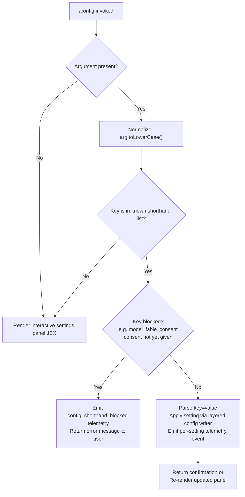

# `/config`

> Analysis basis: CC v2.1.183 bundle.js (AST extraction + Claude interpretation)
> Minimum version: v2.1.183

---

## Overview

`/config` (aliased as `/settings`) opens an interactive settings panel that lets the user view and modify Claude Code's runtime configuration. When invoked with a shorthand argument of the form `key=value`, the command applies the change directly without opening the panel UI. The command renders a JSX component and delegates persistence to the layered settings subsystem.

---

## Registration

| Field | Value |
|---|---|
| type | `local-jsx` |
| name | `config` |
| description | `Open settings` |
| aliases | `["settings"]` |
| argumentHint | `[key=value]` |
| module_id | `sll` |
| load_inline | `true` |
| loc_byte | `11673844` |
| loc_byte_end | `11674122` |
| arbor_handler.name | `Cqp` |
| arbor_handler.fqn | `claude-2.1.183::Cqp` |
| arbor_handler.kind | `AsyncFunction` |
| arbor_handler.resolution_path | `module_id` |
| arbor_handler.n_hits | `0` |

Analysis basis: CC v2.1.183 bundle.js:+11673844

---

## Input Branching

The handler has four distinct paths based on whether an argument is present, whether it matches known shorthand keys, whether it is blocked, and finally the interactive panel path. A Mermaid flowchart is used.



Analysis basis: CC v2.1.183 bundle.js:+11672967 (toLowerCase), +11672986 (known-key check), +11673096 (panel render path), +11673138 (shorthand parse path)

---

## Behavioral Spec

### 1. Entry Point — Handler `Cqp` (AsyncFunction)

```
async function configCommandHandler(context, rawArg):
    // Step 1: Check if a shorthand argument was supplied
    normalizedArg = rawArg?.toLowerCase() ?? ""

    // Step 2: If argument is absent or not in the known shorthand registry,
    //         open the interactive settings panel JSX component
    if normalizedArg is empty OR normalizedArg NOT in knownShorthands:
        return createElement(settingsPanelComponent, context)

    // Step 3: Check if this key is currently blocked
    //         (e.g. "model" alias requiring usage-credits consent)
    if isBlocked(normalizedArg):
        emit("config_shorthand_blocked")
        return errorMessage("needs usage-credits consent — run /model first")

    // Step 4: Parse the value portion
    parsedKV = parseKeyValue(normalizedArg)   // see §3

    // Step 5: Apply the change through the layered config subsystem
    applySettingChange(parsedKV.key, parsedKV.value)

    // Step 6: Emit per-setting telemetry (key-specific event)
    emitSettingTelemetry(parsedKV.key)
```

Analysis basis: CC v2.1.183 bundle.js:+11672896 (createElement call), +11672967 (toLowerCase), +11672986 (known-key guard), +11673019 (random/delay helper), +11673096 (panel render)

---

### 2. Interactive Settings Panel — Component `settingsPanelComponent` (via `c6t` → `Gpt` → `M_o`)

The panel is a React/Ink JSX component tree assembled by the `Gpt` function and rendered by `M_o`. It reads current state via `e.getAppState()` and writes back via `e.setAppState()`. Each setting row is one of several control types:

| Control Type | Bundle identifier | Purpose |
|---|---|---|
| Boolean toggle | `ke` / `Re` / `Pt` | On/off settings |
| Managed enum | `managedEnum` literal | Fixed-choice drop-down |
| Enum selector | `enum` literal | Free-choice list |
| Text input | inline text field | Language, API key |

The panel groups settings into logical sections derived from the literals present in the implementation. The following settings rows are confirmed by the literals:

| Setting key (literal) | Display label (literal) |
|---|---|
| `model` | `Model` |
| `verbose` | `Verbose output` / `Verbose` |
| `preferredNotifChannel` | `Notifications` |
| `inputNeededNotifEnabled` | `Push when actions required` |
| `agentPushNotifEnabled` | `Push when Claude decides` |
| `autoCompact` | `Auto-compact` |
| `autoCompactEnabled` | *(internal key)* |
| `switchModelsOnFlag` | *(refusal-fallback setting)* |
| `tips` | `Show tips` |
| `reduceMotion` | `Reduce motion` |
| `thinking` | `Thinking mode` |
| `fast` | `Fast mode` |
| `promptSuggestionEnabled` | `Prompt suggestions` |
| `recap` | `Session recap` |
| `checkpoints` | `Rewind code (checkpoints)` |
| `fileCheckpointingEnabled` | *(internal key)* |
| `workflows` | `Dynamic workflows` |
| `workflowKeywordTriggerEnabled` | `Ultracode keyword trigger` |
| `progressBar` | `Terminal progress bar` |
| `terminalProgressBarEnabled` | *(internal key)* |
| `showStatusInTerminalTab` | `Show status in terminal tab` |
| `turnDuration` | `Show turn duration` |
| `showTurnDuration` | *(internal key)* |
| `precomputeCompactionEnabled` | `Precompute compaction` |
| `timestamps` | `Show message timestamps` |
| `showMessageTimestamps` | *(internal key)* |
| `permissionMode` | `Default permission mode` |
| `worktreeBaseRef` | `Worktree base ref` |
| `useAutoModeDuringPlan` | `Use auto mode during plan` |
| `gitignore` | `Respect .gitignore in file picker` |
| `copyFullResponse` | `Skip the /copy picker` |
| `copyOnSelect` | `Copy on select` |
| `autoScroll` | `Auto-scroll` |
| `autoScrollEnabled` | *(internal key)* |
| `agentsView` | `Agents view` |
| `defaultToAgentsView` | `Open agents view by default` |
| `leftArrowOpensAgents` | *(left-arrow shortcut)* |
| `autoUpdatesChannel` | `Auto-update channel` |
| `theme` | `Theme` |
| `notifChannel` | `Notifications` |
| `outputStyle` | `Output style` |
| `outputStyles` | *(internal key)* |
| `defaultView` | `Default view` |
| `language` | `Language` |
| `editor` | `Editor mode` |
| `editorMode` | *(internal key)* |
| `externalEditorContext` | `Show last response in external editor` |
| `prStatus` | `Show PR status footer` |
| `diffTool` | `Diff tool` |
| `autoConnectIde` | `Auto-connect to IDE (external terminal)` |
| `autoInstallIdeExtension` | `Auto-install IDE extension` |
| `chrome` | `Claude in Chrome` |
| `teammateMode` | `Teammate mode` |
| `teammateDefaultModel` | `Default teammate model` |
| `remoteControl` | `Enable Remote Control for all sessions` |
| `remoteControlAtStartup` | *(internal key)* |
| `showExternalIncludesDialog` | `External CLAUDE.md includes` |
| `apiKey` | `Use custom API key` |

Analysis basis: CC v2.1.183 bundle.js:+11297230 (model), +11297355 (verbose), +11297521 (preferredNotifChannel), +11297788 (agentPushNotifEnabled), +11297968 (autoCompact), +11298641 (reduceMotion), +11298948 (thinking), +11299193 (fast), +11299587 (promptSuggestionEnabled), +11300043 (checkpoints), +11300306 (workflows), +11301031 (progressBar), +11302465 (permissionMode), +11304335 (copyOnSelect), +11304496 (autoScroll), +11304702 (agentsView), +11305292 (autoUpdatesChannel), +11305555 (theme), +11306257 (outputStyle), +11306593 (defaultView), +11307048 (language), +11307376 (editor), +11307636 (externalEditorContext), +11307940 (prStatus), +11308603 (diffTool), +11308850 (autoConnectIde), +11309131 (autoInstallIdeExtension), +11309773 (teammateMode), +11310578 (remoteControl), +11311095 (showExternalIncludesDialog), +11311361 (apiKey)

---

### 3. Shorthand Argument Parser — `parseKeyValue` (via `a6t`)

```
function parseKeyValue(input):
    trimmed = input.trim()

    // Check for "=" separator
    if "=" NOT in trimmed:
        return { key: trimmed, value: undefined }

    eqIndex = trimmed.indexOf("=")
    key     = trimmed.slice(0, eqIndex)
    rest    = trimmed.slice(eqIndex + 1)

    // Detect multi-value syntax (comma-separated after "=")
    if "," in rest:
        values = rest.split(",")
        return { key: key, value: values }

    return { key: key, value: rest }
```

Analysis basis: CC v2.1.183 bundle.js:+11313215 (trim), +11313232 (includes check), +11313266 (split), +11313322 (indexOf), +11313339 (slice key), +11313448 (indexOf second), +11313483 (push), +11313495 (slice value)

---

### 4. Layered Settings Write — `applySettingChange` (via `co` → `MSt` / `Pe` / `Ves`)

```
function applySettingChange(key, value, scope):
    // Determine target config scope:
    //   "userSettings"    → ~/.claude/settings.json
    //   "projectSettings" → .claude/settings.json  (project root)
    //   "localSettings"   → .claude/settings.local.json
    //   "policySettings"  → managed policy layer (read-only for users)

    targetPath = resolveConfigPath(scope)

    // Load current config from disk with lock acquisition
    current = loadSettingsFromDisk(targetPath)   // emits loadSettingsFromDisk_start / _end

    // Merge the new key/value
    updated = merge(current, { [key]: coerceValue(value) })

    // Write atomically (temp-file + rename) with fsync flush
    atomicWriteWithFlush(targetPath, updated)
    // Falls back to in-place write if EACCES on rename (emits config_shorthand_blocked
    // or writeFileSyncAndFlush fallback message)

    // Clear in-memory caches
    clearSettingsCache()
```

Config path constants observed:
- User settings directory fragment: `.claude` (bundle.js:+1313104), filename `settings.json` (bundle.js:+1313114)
- Local settings filename: `settings.local.json` (bundle.js:+1313176)

Atomic write uses 6-byte hex random suffix (bundle.js:+1096970, +1096982), sets file permissions, calls `fsyncSync`, then `renameSync`. On `EACCES` falls back to in-place write and logs `"writeFileSyncAndFlush: in-place fallback write failed; content preserved at temp path"` (bundle.js:+1098768).

Guard: if re-read config is missing auth fields that the in-memory cache has, the write is **refused** to prevent auth loss (see literal `"saveConfigWithLock: re-read config is missing auth that cache has; refusing to write to avoid wiping ~/.claude.json. See GH #3117."` at bundle.js:+13967072).

Analysis basis: CC v2.1.183 bundle.js:+1332384 (policySettings), +1332406 (flagSettings), +1333030 (userSettings), +1333145 (projectSettings), +1333168 (localSettings), +1096954 (randomBytes), +1097604 (fsyncSync), +1097813 (renameSync), +1097986 (EACCES)

---

### 5. Fast Mode Toggle — sub-handler (via `dL` → `Woe`)

Fast mode has availability guards checked before any write:

```
function applyFastModeSetting(value, authKind, orgStatus):
    if authKind NOT in ["oauth", "api-key"]:
        return error("Fast mode is only available when using the Anthropic API directly")

    if orgStatus == "pending":
        return info("Checking fast mode availability (org status pending)")

    if orgStatus == "disabled":
        return error("Fast mode is not available")

    if context == "agent-sdk":
        return error("Fast mode is not available in the Agent SDK")

    applySettingChange("fast", value)
    emit("tengu_chomp_inflection")
```

Analysis basis: CC v2.1.183 bundle.js:+2260208 (API-only message), +2260276 (not available), +2260623 (Agent SDK), +2260785 (pending), +2260913 (disabled), +2261082 (oauth), +2261090 (api-key)

---

### 6. Notification Preferences Patch — sub-handler (via `Hjp`)

When the user changes `preferredNotifChannel` or `inputNeededNotifEnabled`, the handler sends a PATCH request to the Anthropic backend:

```
function patchNotifPrefs(key, value):
    emit("notif_prefs_patch")
    result = httpPatch("/notification-preferences", { [key]: value })

    if result.ok:
        emit("notif_prefs_patch_ok")
        applySettingChange(key, value, "userSettings")
    else if result.status == 401:
        emit("no_auth")
        return error("Authentication required")
    else:
        emit("notif_prefs_patch_failed")
        emit("http_error")
        return error(result.message)
```

Analysis basis: CC v2.1.183 bundle.js:+11289376 (notif_prefs_patch), +11289396 (no_auth), +11289417 (info), +11289424 (notif_prefs_patch_ok), +11289512 (notif_prefs_patch_failed), +11289572 (http_error)

---

### 7. Model Selection Row — sub-handler (via `Gpt` → `j` / config_model_changed)

```
function applyModelSetting(modelAlias):
    // Validate alias is in known list (sonnet, haiku, opus, best, fable, opusplan, …)
    if modelAlias == "fable" AND consentNotGiven:
        emit("model_fable_consent")
        return error("needs usage-credits consent — run /model first")

    resolvedModelId = resolveAlias(modelAlias)
    applySettingChange("model", resolvedModelId, "userSettings")
    emit("tengu_config_model_changed")
```

Known alias literals: `sonnet` (+2291992), `haiku` (+2292031), `opus` (+2292070), `best` (+2292104), `fable` (+2291889), `opusplan` (+2291951).

Specific versioned model IDs visible: `opus-4-6` (+11282600), `sonnet-4-6` (+11282625), `opus-4-7` (+2261503), `opus-4-8` (+2261527).

Analysis basis: CC v2.1.183 bundle.js:+11296911 (tengu_config_model_changed), +11308460 (model_fable_consent), +11308482 (config_shorthand_blocked)

---

### 8. Config Save with Lock and Backup Rotation — `saveConfigWithLock` (via `pn` → `W7n`)

```
function saveConfigWithLock(path, data):
    // Attempt to acquire file lock; warn if contention exceeds 100 ms
    acquireLock(path, timeoutMs=60000)
    // Lock contention warning threshold: 100 ms  (bundle.js:+13966650)
    // Lock timeout: 60 000 ms  (bundle.js:+13967426)

    current = readConfigFromDisk(path)

    // Safety: refuse write if auth fields would be wiped
    if cacheHasAuth AND current lacks auth:
        emit("tengu_config_auth_loss_prevented")
        releaseLock()
        return

    // Rotate backups: keep up to 5 numbered .backup.N files
    rotateBackups(path, maxBackups=5)      // bundle.js:+13967675

    atomicWrite(path, data)
    releaseLock()
```

Lock contention emits `tengu_config_lock_contention` (+13966745). Stale-write guard emits `tengu_config_stale_write` (+13966881). Auth-loss prevention emits `tengu_config_auth_loss_prevented` (+13967224). Parse errors during read emit `tengu_config_parse_error` (+13969320). Fallback writes emit `tengu_config_fallback_write` (+13966361).

Analysis basis: CC v2.1.183 bundle.js:+13963318 (W7n entry), +13966650 (100 ms constant), +13967426 (60 000 ms timeout), +13967675 (5 backups), +13967072 (auth-loss guard message)

---

## State & Side Effects

| Item | Detail |
|---|---|
| Telemetry — model | `tengu_config_model_changed` (bundle.js:+11296911) |
| Telemetry — feature flags | `tengu_feature_ok` (+1021887), `tengu_feature_sad` (+1022035), `tengu_feature_bad` (+1021954) |
| Telemetry — push notif prefs | `tengu_push_notif_pref_changed` (+11297686), `tengu_kairos_push_notifications` (+4920089), `tengu_kairos_input_needed_push` (+4920152) |
| Telemetry — auto-compact | `tengu_auto_compact_setting_changed` (+11298124) |
| Telemetry — refusal fallback | `tengu_refusal_fallback_setting_changed` (+11298362) |
| Telemetry — tips | `tengu_tips_setting_changed` (+11298593) |
| Telemetry — reduce motion | `tengu_reduce_motion_setting_changed` (+11298891) |
| Telemetry — thinking | `tengu_thinking_toggled` (+11299112) |
| Telemetry — fast mode | `tengu_chomp_inflection` (+11299553), `tengu_penguins_off` (+2260314) |
| Telemetry — sedge/lantern | `tengu_sedge_lantern` (+11299787) |
| Telemetry — file history | `tengu_file_history_snapshots_setting_changed` (+11300230) |
| Telemetry — progress bar | `tengu_terminal_progress_bar_setting_changed` (+11301220), `tengu_terminal_sidebar` (+11301287) |
| Telemetry — terminal tab | `tengu_terminal_tab_status_setting_changed` (+11301535) |
| Telemetry — turn duration | `tengu_show_turn_duration_setting_changed` (+11301759), `tengu_sepia_moth` (+11301823) |
| Telemetry — compaction | `tengu_precompute_compaction_setting_changed` (+11302079), `tengu_silk_hinge` (+11302150) |
| Telemetry — timestamps | `tengu_show_message_timestamps_setting_changed` (+11302394) |
| Telemetry — gitignore | `tengu_respect_gitignore_setting_changed` (+11304085) |
| Telemetry — fullscreen | `tengu_amber_creek` (+3545528), `tengu_pewter_brook` (+3545436) |
| Telemetry — default view | `tengu_default_view_setting_changed` (+11306977) |
| Telemetry — editor mode | `tengu_editor_mode_changed` (+11307566) |
| Telemetry — external editor | `tengu_external_editor_context_changed` (+11307881) |
| Telemetry — PR status | `tengu_pr_status_footer_setting_changed` (+11308195) |
| Telemetry — diff tool | `tengu_diff_tool_changed` (+11308768) |
| Telemetry — IDE auto-connect | `tengu_auto_connect_ide_changed` (+11309040) |
| Telemetry — IDE extension | `tengu_auto_install_ide_extension_changed` (+11309344) |
| Telemetry — Chrome | `tengu_claude_in_chrome_setting_changed` (+11309680) |
| Telemetry — teammate | `tengu_teammate_mode_changed` (+11310047) |
| Telemetry — config panel | `tengu_maple_sundial` (+11294779), `tengu_amber_flint` (+7049331) |
| Telemetry — config I/O | `tengu_config_lock_contention` (+13966745), `tengu_config_stale_write` (+13966881), `tengu_config_auth_loss_prevented` (+13967224), `tengu_config_parse_error` (+13969320), `tengu_config_fallback_write` (+13966361) |
| Telemetry — daemon | `tengu_daemon_config_reload` (+17290894), `tengu_daemon_idle_exit` (+17296329), `tengu_daemon_yield` (+17295299) |
| Telemetry — background workers | `tengu_bg_retire_pinned_low_mem` (+17279713), `tengu_bg_prewarm_per_sweep` (+17279834) |
| Telemetry — notif patch API | `tengu_push_notif_pref_changed`, `notif_prefs_patch`, `notif_prefs_patch_ok`, `notif_prefs_patch_failed` |
| Telemetry — auto mode | `tengu_auto_mode_config` (+13830398), `tengu_ccr_bridge` (+13950323) |
| appState changes | Reads via `e.getAppState()` (+11316356); writes via `e.setAppState()` (+11317269) |
| Config files written | `~/.claude/settings.json` (user), `.claude/settings.json` (project), `.claude/settings.local.json` (local) |
| Cache invalidation | `clearSettingsCache()` clears two internal maps (`Szt`, `ctr`) via `mH` (+34016, +34028) |
| Backup rotation | Up to 5 numbered `.backup.N` files adjacent to the config file |
| Error output | CLI errors via `console.error` through `yje` (+13324699); exit code 1 on fatal error (+13324780) |

---

## Version History

| Version | Change |
|---|---|
| v2.1.183 | Initial analysis |

---

## Common Mistakes

1. **Using `/config key value` (space-separated) instead of `/config key=value`** — The parser splits on `=`, not on whitespace. A space-separated argument will be treated as an unknown key and will silently open the interactive panel instead of applying the change.

2. **Setting `model` to a versioned ID directly via shorthand** — The shorthand path accepts alias names (`sonnet`, `opus`, `haiku`, `best`, `fable`, `opusplan`), not raw API model IDs. Use `/model` for specific model IDs.

3. **Expecting `/config` to be persistent when scope is not `userSettings`** — Project-level and local settings are per-directory; running `/config` in a different working directory will not see those changes.

4. **Toggling fast mode outside the Anthropic API context** — Fast mode is guarded by auth kind and org status. Attempting to enable it via a Bedrock, Vertex, or Agent SDK session will produce an error without writing any change.

5. **Concurrent Claude instances writing config** — The lock has a 60-second timeout. If another instance holds the lock, the write will be delayed and emit `tengu_config_lock_contention`. Users should avoid running simultaneous `config` writes from multiple terminals targeting the same config file.

6. **Bypassing the "fable" / usage-credits model without `/model` consent** — Setting `model=fable` via shorthand when consent has not been given is blocked with `config_shorthand_blocked`. Run `/model` first to grant consent interactively.

---

## Appendix — Identifier Mapping

> For bundle debugging only. Identifiers change across versions.

| Identifier | Role |
|---|---|
| `Cqp` | Main async handler for `/config` command (arbor_handler) |
| `c6t` | Settings panel factory — builds the panel component and its sub-components |
| `Gpt` | Settings panel React/Ink component (top-level render function) |
| `M_o` | Interactive settings panel outer component; reads/writes appState |
| `a6t` | Shorthand key=value argument parser |
| `co` | Layered settings loader/writer — orchestrates read, merge, write across scopes |
| `MSt` | Atomic file write with fsync flush (`writeFileSyncAndFlush`) |
| `Pe` | JSON serializer helper |
| `mH` | Settings in-memory cache invalidation function |
| `Ves` | gitignore-aware file utilities (used during settings path resolution) |
| `J9` | Config directory path joiner (`.claude/settings.json` etc.) |
| `Ar` | Settings schema/validation helper |
| `ke` | Boolean toggle "on" feature-flag writer |
| `Pt` | Boolean toggle "off" feature-flag writer |
| `Re` | Boolean toggle "bad" feature-flag writer |
| `_j` | Settings-from-disk loader (calls `loadSettingsFromDisk_start/end`) |
| `De` | Settings change event emitter / side-effect dispatcher |
| `RAr` | Timestamp recorder for settings access |
| `c1e` | Combined settings reader (assembles merged view) |
| `B2` | Settings object constructor / schema normalizer |
| `QA` | Policy settings reader |
| `Thr` | Project-level settings loader |
| `Fhr` | Settings path resolver for project scope |
| `xn` | Settings cache getter |
| `Mnn` | Settings cache setter with project-root key |
| `pn` | Global config save orchestrator (`saveGlobalConfig`) |
| `W7n` | Config save with file lock (`saveConfigWithLock`) |
| `q_e` | Config read from disk with parse-error handling |
| `j7n` | Config write helper (atomic temp-file path) |
| `oWt` | Lock acquisition timestamp tracker |
| `_ko` | Config object entries iterator |
| `AAt` | Config backup rotation helper |
| `CNt` | Notification preferences manager |
| `dG` | Notification preference entries builder |
| `N0o` | Notification channel resolver |
| `W_e` | Notification rules mapper |
| `Os` | Fullscreen / terminal-mode detector |
| `L2` | Local-agent mode checker |
| `tM` | Tmux CC detection checker |
| `_Z` | Windows-over-SSH (ConPTY) detector |
| `RFr` | Fullscreen availability predicate |
| `PFr` | Fullscreen disabled-reason formatter |
| `ved` | Fullscreen state side-effect handler |
| `GR` | Notification API PATCH request helper |
| `uQe` | HTTP notification preference request builder |
| `AX` | Auth-gated notification pref dispatcher |
| `hc` | Terminal bell / notification channel UI component |
| `Ul` | Notification channel option: terminal bell |
| `dp` | Notification channel option: none |
| `L4` | Settings key prefix stripper |
| `eCn` | "Input needed" push notification enablement handler |
| `Ude` | Language setting formatter |
| `Ue` | UI option list renderer |
| `pil` | Model selector sub-panel |
| `WK` | Model list data provider |
| `y_o` | Model alias filter (sonnet variant) |
| `E_o` | Model alias filter (non-sonnet variant) |
| `ul` | Expanded model list builder |
| `Hjp` | Notification preference patch dispatcher |
| `T_o` | Settings key iteration and dispatch function |
| `lil` | Settings row label renderer |
| `Qe` | UI option component |
| `FCn` | `switchModelsOnFlag` (refusal fallback) toggle handler |
| `dL` | Fast mode toggle outer handler |
| `Woe` | Fast mode availability gate and state machine |
| `eNe` | `sT`-invoking setting normalizer |
| `ct` | Feature-flag state reader/writer |
| `OHn` | Feature-flag cache get-or-create |
| `Ct` | Feature-flag disk persistence writer |
| `iUr` | `aUr` wrapper for notification pref endpoint |
| `aUr` | Notification preference HTTP client |
| `$pt` | `tDe`-invoking context checker |
| `tDe` | Config access guard ("Config accessed before allowed") |
| `rx` | Remote control setting handler |
| `tWt` | Remote control state reader |
| `WW` | Remote control writer |
| `V4e` | Remote control toggle sub-handler |
| `lue` | Auto-update channel setting handler |
| `ro` | Module export bootstrapper |
| `D_o` | External CLAUDE.md includes setting handler |
| `YT` | API key setting handler |
| `OU` | API key value masker (first 20 chars slice) |
| `Bpt` | Config panel sub-component mount helper |
| `Sc` | Legacy global config migration helper |
| `BD` | Settings merge deduplicator |
| `e_n` | Workflow allow/disable setting handler |
| `AAi` | Workflow feature gate |
| `nDe` | Auto-mode config reader |
| `mGe` | Auto-mode config writer |
| `Aae` | Agent push notification sub-handler |
| `ra` | Essential-traffic / no-telemetry mode checker |
| `eJo` | Traffic mode state reader |
| `ab` | Teammate-related setting sub-handler |
| `jBe` | IDE connection state checker |
| `Ige` | Auto-updater availability checker |
| `AKe` | Auto-update channel validator |
| `gjn` | Teammate model setting handler |
| `t9t` | Teammate config sub-writer |
| `El` | Agent-teams feature gate |
| `kjd` | Agent-teams flag reader |
| `eXr` | Config panel JSX text renderer |
| `ZYr` | Config panel section divider renderer |
| `Kv` | Settings reload trigger (calls `co`) |
| `yje` | CLI error printer (red text + console.error) |
| `eI` | Fatal error file writer |
| `Fs` | CLI fatal-error handler (print + exit 1) |
| `E` | Background worker concurrency math helper |
| `_` | Background worker sweep orchestrator |
| `w` | Background worker idle/blur state manager |
| `L` | Background worker lifecycle scheduler |
| `Dec` | Background worker queue tail accessor |
| `c4` | Config schema / model alias registry builder |
| `vo` | Model tier definitions |
| `$un` | Full model list builder |
| `Pg` | Model alias resolver helper |
| `_s` | Model alias normalization and routing |
| `eDe` | Model display name builder |
| `IA` | Model availability checker |
| `Oj` | Model UI label builder |
| `Dk` | Model tier classifier |
| `JB` | Model description builder |
| `yH` | Model token context helper |
| `sT` | API provider / auth type resolver |
| `Ife` | Provider state reader |
| `Cfe` | Pro plan checker |
| `wr` | Auth credential reader |
| `sa` | Provider-specific model caps reader |
| `T` | Settings value coercion and validation utility |
| `Mn` | File system ENOENT-safe reader |
| `Ar` | Settings schema registry |
| `gx` | Settings default values map |
| `Wn` | Generic value identity wrapper |
| `mX` | Panel layout manager |
| `Ajn` | Panel layout sub-components assembler |
| `j` | Ink Box/Text primitive |
| `v` | Ink render context |
| `st` | Ink/React primitive (String coercion helper) |
| `uc` | Ink styled text component |
| `HJ` | Ink horizontal rule component |
| `E` | Ink dimension calculator |
| `w` | Ink render scheduler |

---

*Note: index built via Arbor fallback; some signals (telemetry, literals) may be missing — see arbor-fallback.js.*