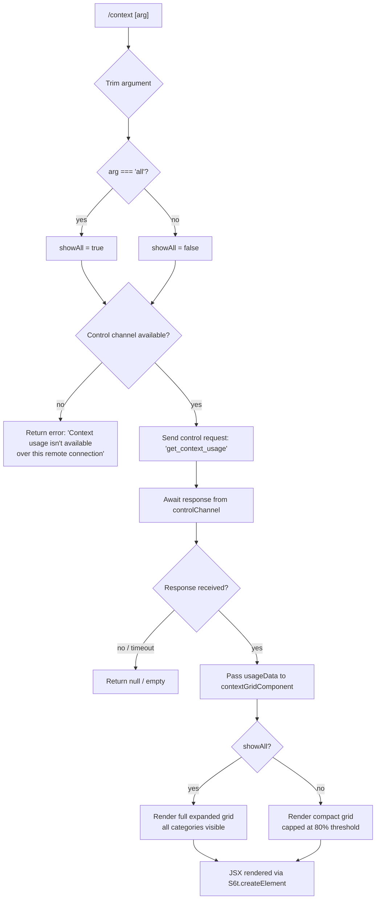

# `/context`

> Analysis basis: CC v2.1.183 bundle.js (AST extraction + Claude interpretation)
> Minimum version: v2.1.183

---

## Overview

The `/context` command visualizes the current context window usage as a colored grid of labeled sections. It dispatches a control request through the active session's control channel and renders a JSX component that breaks down how the context is allocated across system prompt, tools, memory files, messages, and other categories. An optional `all` argument expands the view to show more detail.

---

## Registration

| Field | Value |
|---|---|
| type | `local-jsx` |
| name | `context` |
| description | `Visualize current context usage as a colored grid` |
| argumentHint | `[all]` |
| thinClientDispatch | `control-request` |
| module_id | `wll` |
| load_inline | `true` |
| loc_byte | `11693244` |
| loc_byte_end | `11693470` |
| loc_line | `7089` |
| arbor_handler.name | `mVp` |
| arbor_handler.fqn | `claude-2.1.183::mVp` |
| arbor_handler.kind | `AsyncFunction` |
| arbor_handler.resolution_path | `module_id` |
| arbor_handler.n_hits | `0` |

Analysis basis: CC v2.1.183 bundle.js:+11693244

---

## Input Branching

The command has 3+ distinct branches based on argument content, connection type, and rendering mode.



Analysis basis: CC v2.1.183 bundle.js:+11691838, +11691869, +11691895, +11691920, +11692004

---

## Behavioral Spec

### Handler Entry Point

The async handler `mVp` is the resolved entry for `/context`.

```
async function contextCommandHandler(args, appContext):
    trimmedArg = args.trim()                          // +11691844
    showAll    = (trimmedArg === "all")               // +11691869

    controlChannel = getControlChannel(appContext)    // +11691892 (YO → dd)
    if not controlChannel:
        return errorMessage(
            "Context usage isn't available over this remote connection"
        )                                             // +11691922

    response = await appContext.sendControlRequest(
        "get_context_usage"                           // +11692034
    )                                                 // +11692004

    if not response:
        return null

    usageData = buildContextUsageModel(response, showAll)  // E6t +11692174
    grid      = renderContextGrid(usageData, showAll)      // S6t.createElement +11692068

    return grid
```

Analysis basis: CC v2.1.183 bundle.js:+11691838

---

### Context Usage Model Builder

The function mapped to `E6t` processes raw usage data into a structured model that the grid renderer consumes.

```
function buildContextUsageModel(rawResponse, showAll):
    sections = rawResponse.filter(...)               // +11689941
    systemSection = sections.find(s => s.type === "system")  // +11690259, literal "system" +11692151

    categories = [
        { label: "System prompt",         color: "promptBorder",              key: "promptBorder"    },  // +10891682, +10891713
        { label: "System tools",          color: "cyan_FOR_SUBAGENTS_ONLY",   key: "systemTools"     },  // +10891763
        { label: "MCP tools",             color: "cyan_FOR_SUBAGENTS_ONLY",   key: "mcpTools"        },  // +10891828
        { label: "MCP tools (deferred)",  color: "cyan_FOR_SUBAGENTS_ONLY",   key: "mcpDeferred"     },  // +10891904
        { label: "Memory files",          color: "claude",                    key: "memoryFiles"     },  // +10892146
        { label: "Messages",              color: "purple_FOR_SUBAGENTS_ONLY", key: "messages"        },  // +10892690
        { label: "Free space",            color: "green",                     key: "freeSpace"       },  // literal "Free space" +11689976
        { label: "Autocompact buffer",    color: "yellow",                    key: "autocompact"     },  // +11689999
    ]

    // Format percentage values
    for each category:
        pct = formatPercentage(category.tokens / total * 100)   // Gre → Math.round +220491

    compactBoundary = 80   // threshold constant +11692380
    if not showAll:
        sections = sections.filter(pct >= compactBoundary threshold logic)

    return { sections, total, categories, showAll }
```

Analysis basis: CC v2.1.183 bundle.js:+11689900, +11689941, +11692174, +11692380

---

### Percentage Formatter

The helper mapped to `Gre` formats a numeric ratio as a locale string.

```
function formatPercent(value):
    rounded = Math.round(value)                      // +220491
    return rounded.toLocaleString("en-US", {         // literal "en-US" +222444
        style: "percent",                            // literal "compact" +222462 (notation)
        maximumFractionDigits: 0
    })
    // Appends ".0" suffix for display when applicable  // literal ".0" +220432
    // Threshold markers: 20 → "< 20", 10            // +220462, +220471, +220504
```

Analysis basis: CC v2.1.183 bundle.js:+220418, +220491

---

### Control Request Sender

`o.sendControlRequest` (reached from `mVp` at +11692004) sends a named control-channel message and returns a promise.

```
async function sendControlRequest(channelName, requestType):
    // channelName = "controlChannel"   // literal +11691895
    // requestType = "get_context_usage"// literal +11692034
    padded = requestType.padEnd(40, " ")   // +17300745, literal "  " spacing +17300766
    return channelProxy.send(padded)
```

Analysis basis: CC v2.1.183 bundle.js:+11692004, +17300745

---

### Output JSX Renderer

The render path calls `hat` to attach a stream listener, then `S6t.createElement` to return a JSX tree.

```
function renderContextGrid(usageData, showAll):
    // Attach update listener
    hat(streamHandle, outputCallback)                // +11692064

    // Build cell list for each usage bucket
    cells = usageData.sections.map(section =>
        createElement(gridCell, {
            label:      section.label,
            pct:        section.pct,
            color:      section.color,
            showAll:    showAll,
        })
    )

    // Wrap in container
    return S6t.createElement(contextGridContainer, {
        cells:    cells,
        showAll:  showAll,
        total:    usageData.total,
    })                                               // +11692068
```

Analysis basis: CC v2.1.183 bundle.js:+11692064, +11692068

---

### Category Labels and Keys (literals)

The following string literals appear in the context usage display:

| Category Label | Internal Key Literal | Location |
|---|---|---|
| `Free space` | — | +11689976 |
| `Autocompact buffer` | — | +11689999 |
| `Project` | `projectSettings` | +11690945 / +11690925 |
| `User` | `userSettings` | +11690982 / +11690965 |
| `Local` | `localSettings` | +11691017 / +11690999 |
| `Flag` | — | +11691052 |
| `Policy` | — | +11691088 |
| `Plugin` | `plugin` | +11691118 / +11691107 |
| `Built-in` | `built-in` | +11691150 / +11691137 |

Analysis basis: CC v2.1.183 bundle.js:+11689976 – +11691150

---

### Compact Threshold

When called without the `all` argument, the grid applies a compaction threshold:

- Compact boundary constant: **80** (bundle.js:+11692380)
- Sections below this threshold may be suppressed or merged in the default view.
- The `all` argument (literal `"all"`, bundle.js:+11691869) forces display of all sections regardless of size.

Analysis basis: CC v2.1.183 bundle.js:+11692380, +11691869

---

## State & Side Effects

| Item | Detail |
|---|---|
| Telemetry | `tengu_amber_creek` (+3545528), `tengu_pewter_brook` (+3545436), `tengu_marlin_porch` (+3916680), `tengu_native_cursor` (+3917030), `tengu_silent_harbor` (+13694228), `tengu_slate_harrier` (+13703926) — fired in callees reachable from `Os` and `ct` during context assembly |
| Control request | Sends `"get_context_usage"` over `"controlChannel"` via `thinClientDispatch: "control-request"` |
| Hook registration | `hat` registers an output stream listener at +11692064 |
| appState changes | None identified in depth-2 traversal |
| JSX rendering | `S6t.createElement` renders a grid component; `Wle.createElement` used inside `hat` sub-renderer (+8147896) |
| Sound | None detected |
| Remote guard | Returns a static error string when the control channel is unavailable (+11691922) |

---

## Version History

| Version | Change |
|---|---|
| v2.1.183 | Initial analysis |

---

## Common Mistakes

1. **Running over a remote connection without a control channel** — The command returns `"Context usage isn't available over this remote connection"` if the `controlChannel` is not present. Ensure you are running in a local interactive session or a session with a live control channel.
2. **Expecting real-time updates** — `/context` renders a snapshot at invocation time. It does not poll or update live; re-run the command to refresh.
3. **Confusing `/context` with memory commands** — This command visualizes token budget allocation, not memory file contents. For memory inspection use `/memory`.
4. **Missing the `all` argument** — Without `all`, sections below the 80-token-percentage threshold may be hidden. Use `/context all` to see the full breakdown including small allocations.
5. **Interpreting percentages as exact** — Values are rounded via `Math.round` before display; small rounding differences across categories are expected and do not indicate a bug.

---

## Appendix — Identifier Mapping

> For bundle debugging only. Identifiers change across versions.

| Identifier | Role |
|---|---|
| `mVp` | Main async handler for `/context` command |
| `Os` | Context state assembler (collects system prompt, tools, messages) |
| `E6t` | Context usage model builder (processes raw response into display sections) |
| `Gre` | Percentage formatter (Math.round + locale string) |
| `fVp` | Context display helper / slice formatter |
| `vH` | Value slicer for display ranges |
| `VGn` | Value getter/wrapper |
| `hat` | Output stream listener registrar |
| `x8` | JSX sub-renderer for stream output |
| `NZ` | Theme-aware render switch |
| `aCe` | Render variant A (context cell component) |
| `bBr` | Render variant B (context cell component) |
| `PBr` | JSX element factory wrapper |
| `S6t` | React-like createElement host for context grid |
| `Wle` | Secondary createElement host (stream output) |
| `E6t` | Usage section filter/finder/formatter |
| `zKe` | Section key helper |
| `_l` | Locale number formatter bootstrap |
| `au` | Locale formatting helper |
| `c_c` | Core locale format function |
| `dd` | Control channel getter |
| `aPe` | Channel accessor implementation |
| `YO` | Control channel presence check |
| `k6n` | Outer context computation orchestrator (builds all categories and totals) |
| `ck` | Model/settings resolver |
| `jK` | Model key resolver |
| `S_` | Model string builder |
| `VG` | Model version getter |
| `ul` | Model alias expander |
| `sT` | Settings tree walker |
| `Ife` | Settings renderer (inline) |
| `Cfe` | Settings renderer (pro tier) |
| `wr` | API provider resolver |
| `vo` | Pro-tier check |
| `sa` | Settings accessor |
| `GU` | Model enforcement evaluator |
| `UBs` | Admin policy model enforcer |
| `Bl` | Model name normalizer |
| `PR` | Provider prefix checker |
| `pd` | Provider dispatcher |
| `zoe` | Credential/provider routing helper |
| `Run` | Model run resolver |
| `_s` | Model alias shorthand resolver |
| `yH` | Model settings helper |
| `bQ` | Model routing helper |
| `NK` | Provider name key |
| `fL` | Feature-flag loader |
| `Tfe` | Feature variant resolver |
| `NBs` | Model name bus router |
| `rNe` | Render name emitter |
| `nRu` | Name lowercaser |
| `jU` | Model upgrade resolver |
| `YC` | Auto-compact settings reader |
| `Sc` | Global settings cache reader |
| `BD` | Settings set builder |
| `Fhr` | Settings fetch resolver |
| `xn` | Extended settings reader |
| `XB` | Auto-compact window calculator |
| `Fo` | Model full-name resolver |
| `K7e` | Model key entry resolver |
| `e_` | Model string normalizer |
| `Af` | Model alias fixer |
| `Wy` | Window utility |
| `nb` | Number bounds checker |
| `Tti` | Token count integer parser |
| `bPr` | Token bound resolver |
| `Iti` | Token limit resolver |
| `yae` | Token count validator |
| `DCd` | Auto-compact config dispatcher |
| `Cti` | Context token info resolver |
| `vti` | Context token value resolver |
| `yjr` | Context token formatter |
| `_jr` | Token string parser/rounder |
| `Xk` | System prompt assembler (builds full system prompt for context) |
| `Mt` | Memory/storage accessor |
| `Qen` | Store getter |
| `Ar` | Logger/reporter |
| `lGn` | System prompt list builder |
| `XTe` | Tool param JSON builder |
| `TPr` | Tool prompt resolver |
| `T_f` | Context block builder |
| `b_f` | Brief-mode block selector |
| `I_f` | Confirmation block builder |
| `C_f` | Extra context block builder |
| `xti` | Context item builder |
| `JAn` | Fable identity checker |
| `Oj` | Operator name normalizer |
| `Jmi` | JSON schema validator |
| `Dxt` | Schema freezer/validator |
| `r0o` | Output-style resolver |
| `Hl` | String coercer |
| `ryf` | Output-style fallback |
| `aq` | Agent query resolver |
| `$_f` | Full system prompt composer |
| `ZC` | System prompt cache |
| `F_f` | System prompt fetcher |
| `dHo` | Dynamic hook loader |
| `S7` | Beta feature gate |
| `zu` | Context usage accumulator |
| `jW` | Session context joiner |
| `Aq` | Array context flattener |
| `e0t` | Memory file loader and formatter |
| `wu` | Working directory tool |
| `oie` | Directory maker |
| `A8` | File/directory stat checker |
| `Qe` | Quick executor |
| `ke` | File key extractor |
| `ghi` | Memory glob resolver |
| `nZu` | Memory file normalizer |
| `Zxt` | Memory file path splitter |
| `lb` | Context tool loader |
| `Fx` | Context working-dir formatter |
| `db` | Database path joiner |
| `Dhi` | Directory hierarchy index |
| `khi` | Key hierarchy index |
| `xhi` | Extended hierarchy index |
| `Ihi` | Index hierarchy builder |
| `Thi` | Tag hierarchy index |
| `VUr` | Volume URI resolver |
| `Y_f` | Language/locale block builder |
| `ZA` | Language code resolver |
| `e0o` | Env output formatter |
| `z_f` | Static env info block builder |
| `n0o` | OS info accessor |
| `t0o` | Shell type detector |
| `J_f` | Background-session block builder |
| `Mlo` | MCP list getter |
| `x2n` | Scratchpad/temp block builder |
| `FX` | Temp file context loader |
| `B_e` | Bundle entry resolver |
| `Z_f` | Brief-mode flag checker |
| `nyf` | Non-default context builder |
| `bQe` | Boundary queue emitter |
| `j_f` | JSON context frame builder |
| `x_f` | Extra context frame builder |
| `k_f` | Key context frame |
| `zWa` | Cache-warm accessor |
| `G_f` | Gate flag checker |
| `P_f` | Prompt flag builder |
| `L_f` | Language flag resolver |
| `O_f` | Output flag builder |
| `N_f` | Name flag resolver |
| `U_f` | Usage flag builder |
| `ow` | Output writer |
| `B_f` | Base flag builder |
| `Nhi` | Non-hierarchy index |
| `Ohi` | Output hierarchy index |
| `QTe` | Queue tool entry |
| `UR` | Usage reporter |
| `Mu` | Model upgrader |
| `oNl` | Output node list builder |
| `rGn` | Range generator (Math.max) |
| `b6` | Base-6 context loader |
| `Wc` | Working context accessor |
| `iw` | Inline writer |
| `zw` | Zone writer |
| `_a` | Anchor accessor |
| `ro` | Runtime object initializer |
| `aH` | Agent handler |
| `Ue` | Utility executor |
| `Jtt` | JSON token tracker |
| `Eae` | Entry accumulator |
| `p9p` | Prompt section processor |
| `d9p` | Data section parser |
| `M6n` | Module section builder |
| `X_f` | Extended flag builder |
| `Uhi` | Usage hierarchy index |
| `Yxo` | Index key extractor |
| `dpt` | Data prompt transformer |
| `uBe` | Usage block emitter |
| `De` | Display error handler |
| `Iel` | Index element loader |
| `f9p` | Filter prompt processor |
| `Zse` | Zone settings emitter |
| `hc` | Hook config reader |
| `W0` | Window-0 accessor |
| `rRt` | Rate-limit resolver |
| `m9p` | Message prompt processor |
| `Dke` | Data key extractor |
| `R6n` | Role section builder (tool definitions) |
| `Re` | Result executor |
| `rF` | Result formatter |
| `SG` | Session gateway |
| `I4e` | Index for entries |
| `g9p` | Grid section processor (core context grid builder) |
| `Bm` | Byte mapper (Math.round) |
| `Tn` | Token normalizer |
| `WT` | Window terminator |
| `H9p` | Header section processor |
| `A9p` | Attachment section processor |
| `z6r` | Zone flag resolver |
| `pae` | Page attachment emitter |
| `Tel` | Token element loader |
| `Tl` | Token list |
| `S9p` | System section processor |
| `_9p` | Internal section parser |
| `y9p` | Symbol section parser |
| `E9p` | Entry section parser |
| `LL` | Low-level conversation loader (full message assembly) |
| `MEf` | Message entry formatter |
| `nFl` | Name filter lookup |
| `UEf` | Usage entry formatter |
| `GEf` | Group entry formatter |
| `F0o` | Flag output object |
| `FEf` | Filter entry formatter |
| `$Ef` | System entry formatter |
| `Xmt` | Extra message tracker |
| `Pn` | Prompt normalizer |
| `vw` | View writer |
| `nlo` | Node list output |
| `C7n` | Context 7 normalizer |
| `hP` | Header printer |
| `c0o` | Content object output |
| `REf` | Result entry formatter |
| `jUl` | JSON utility list |
| `PEf` | Page entry formatter |
| `nSf` | Node section finder |
| `pNl` | Page node list |
| `WEf` | Write entry formatter |
| `oFl` | Output file list |
| `$6n` | System 6 normalizer (full conversation builder) |
| `oSf` | Output section formatter |
| `jEf` | JSON entry formatter |
| `h4e` | Header 4 entry |
| `fSf` | Full section formatter |
| `A4e` | Array 4 entry |
| `mSf` | Message section formatter |
| `qEf` | Queue entry formatter |
| `tFl` | Type filter list |
| `sFl` | Section filter list |
| `NEf` | Node entry formatter |
| `h9p` | History section processor |
| `Ctt` | Context token tracker |
| `vC` | View context resolver |
| `e4t` | Entry 4 tracker |
| `Cmo` | Context model object |
| `Ho` | Handler object (Error/String wrapper) |
| `cee` | Context entry emitter |
| `ehe` | Entry handler emitter |
| `YTe` | Context token entry |
| `ne` | Node entry |
| `ee` | Event entry |
| `U8` | Utility 8 (stream multiplexer) |
| `Hot` | Handler output tracker |
| `p0n` | Page 0 normalizer |
| `Y` | Session state holder |
| `t3e` | Token 3 entry |
| `B1o` | Base 1 object |
| `te` | Token entry |
| `E` | Event handler |
| `_` | Underscore utility (connection handler) |
| `v` | Value accessor |
| `f5` | Flag 5 resolver |
| `TFi` | Token filter index |
| `bFi` | Base filter index |
| `SFi` | Section filter index |
| `NI` | Node index |
| `O9p` | Output 9 processor |
| `vt` | Virtual terminal |
| `xy` | XY coordinate utility |
| `Nn` | Node normalizer (plugin/session lifecycle) |
| `hft` | Header filter |
| `yft` | Symbol filter |
| `Eft` | Entry filter |
| `Wfl` | Write filter list |
| `Iw` | Index writer (plugin loader) |
| `P1i` | Path 1 index (directory reader) |
| `a_e` | Array entry emitter (MCP config loader) |
| `Sft` | Section filter (plugin state) |
| `Bh` | Base handler (plugin registry) |
| `Ke` | Key entry |
| `Ft` | Full tracker (MCP server config) |
| `by` | Byte handler |
| `ae` | Array entry |
| `un` | Unit normalizer (session/DOM orchestrator) |
| `po` | Page output |
| `kt` | Key tracker (session init) |
| `On` | Output normalizer (config reload handler) |
| `bo` | Base output (conversation engine) |
| `_n` | Internal normalizer |
| `en` | Event normalizer |
| `el` | Element loader |
| `it` | Index tracker |
| `Dm` | DOM manipulator |
| `Ae` | Array entry (session lifecycle, MCP reconnect) |
| `se` | Session entry (main session loop) |
| `Rqn` | Request queue normalizer |
| `zv` | Zone viewer (terminal graphics) |
| `V` | View handler |
| `Ah` | Agent handler |
| `Oge` | Output gate emitter (MCP session list) |
| `W` | Window handler (session scheduler) |
| `ece` | Event context emitter (session resume) |
| `xe` | Extended entry |
| `qe` | Queue entry |
| `nu` | Node utility |
| `Yb` | Symbol buffer |
| `Gy` | Gyroscope utility (session state) |
| `Iqt` | Index queue tracker (project file handler) |
| `fX` | File extension handler |
| `U2n` | Utility 2 normalizer |
| `V6e` | View 6 entry |
| `sye` | Symbol entry |
| `mDn` | Module DN handler |
| `Lqt` | List queue tracker |
| `p8e` | Page 8 entry |
| `f8e` | File 8 entry |
| `Oe` | Output entry |
| `wqt` | Write queue tracker |
| `YK` | Symbol key |
| `Wue` | Write utility entry |
| `xqt` | Extended queue tracker (working dir setup) |
| `jue` | JSON utility entry |
| `w` | Window/timer utility |
| `xr` | Extended resolver (plugin cleanup) |
| `In` | Index normalizer |
| `wra` | Write array (MCP connect handler) |
| `ND` | Node dispatcher |
| `on` | Output normalizer (MCP debug logger) |
| `Cu` | Context utility (MCP error logger) |
| `Pc` | Page context |
| `ms` | Message sender |
| `z9` | Zone 9 handler |
| `oc` | Output context |
| `$Bi` | System bi-handler (VS Code experiment gate) |
| `kLd` | Key loader |
| `FCn` | Feature context normalizer |
| `v7` | View 7 |
| `Z_l` | Zone list (tool result normalizer) |
| `oTo` | Output tracker object |
| `the` | Token handler entry |
| `JB` | JSON buffer |
| `Dk` | Data key |
| `plc` | Plugin list context (feedback/rating handler) |
| `di` | Data index |
| `yG` | Symbol getter |
| `dNo` | Data normalizer object |
| `ge` | Gate entry (session gate checker) |
| `Sq` | Sequence queue |
| `Lt` | List tracker |
| `Au` | Auth utility |
| `Te` | Token entry (session MCP entry) |
| `mh` | Message handler |
| `Ye` | Symbol entry (tool/session registry) |
| `ZY` | Zone symbol (tool list builder) |
| `XP` | Extended processor (tool permission resolver) |
| `Gce` | Gate context entry |
| `sje` | Session job entry (coordinator-mode tool sort) |
| `yCl` | Symbol context list |
| `NO` | Node output |
| `Ite` | Index token entry (tool permission engine) |
| `uio` | Utility I/O (tool filter) |
| `dio` | Data I/O |
| `cio` | Context I/O |
| `d` | Data handler (MCP config updater) |
| `SA` | System accessor |
| `kx` | Key transformer |
| `i1e` | Index 1 entry |
| `L` | List handler (worker pool manager) |
| `nt` | Node tracker |
| `Be` | Base entry |
| `Xzt` | Extended zone tracker |
| `Ftt` | Format tracker (JSON schema validator) |
| `TTd` | Token tracker data |

---

Note: index built via Arbor fallback; some signals (telemetry, literals) may be missing — see arbor-fallback.js.