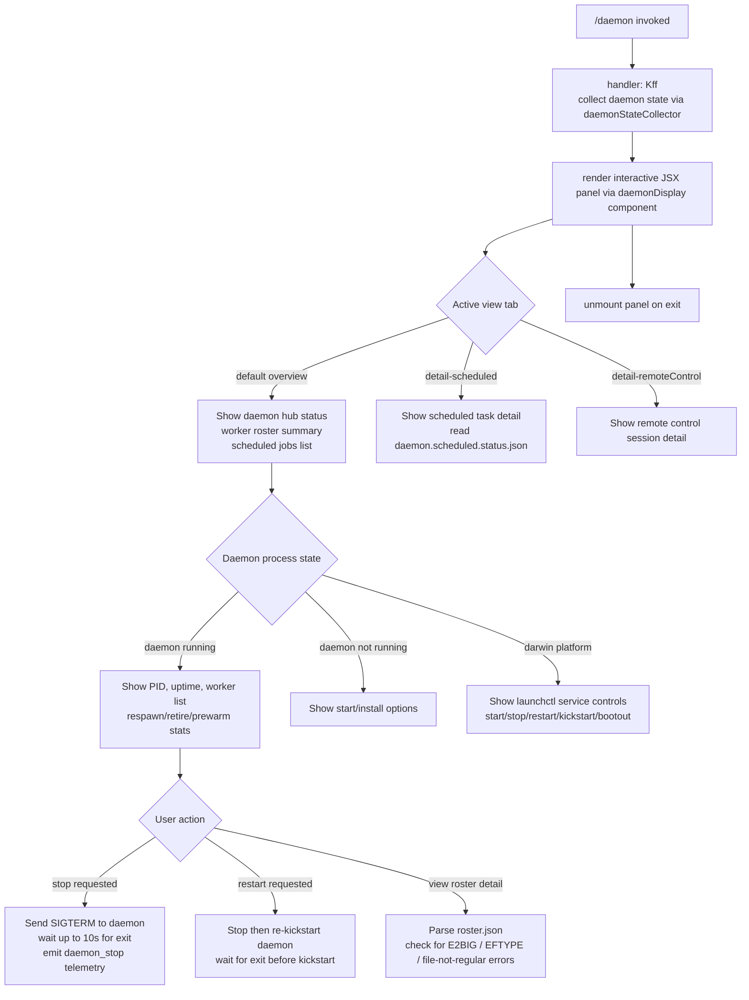

# `/daemon`

> Analysis basis: CC v2.1.183 bundle.js (AST extraction + Claude interpretation)
> Minimum version: v2.1.183

---

## Overview

The `/daemon` command provides a management interface for Claude Code's background daemon process and associated background services. It allows the user to inspect daemon status, start/stop/restart the system-level service, view scheduled routines, manage remote-control sessions, and monitor the background worker roster. The command renders an interactive JSX panel that aggregates live state from multiple daemon subsystems.

---

## Registration

| Field | Value |
|---|---|
| type | `local-jsx` |
| name | `daemon` |
| description | `Manage background services and routines` |
| immediate | `true` |
| module_id | `vwo` |
| load_inline | `true` |
| loc_byte | `13220385` |
| loc_byte_end | `13220553` |
| loc_line | `8691` |
| arbor_handler.name | `Kff` |
| arbor_handler.fqn | `claude-2.1.183::Kff` |
| arbor_handler.kind | `AsyncFunction` |
| arbor_handler.resolution_path | `module_id` |
| arbor_handler.n_hits | `0` |

Analysis basis: CC v2.1.183 bundle.js:+13220385

---

## Input Branching

The command's handler (`Kff`) and its rendering component (`Cwo`) branch across more than three distinct display modes depending on daemon state and the selected detail view. A Mermaid flowchart is used.



Analysis basis: CC v2.1.183 bundle.js:+13209586, +13209736, +13210356, +13210514, +11736082, +11736122

---

## Behavioral Spec

### 1. Top-Level Handler (`Kff`)

The Arbor-resolved handler `Kff` is an `AsyncFunction` reached via `module_id → vwo`. It orchestrates the two primary runtime steps:

```
async function daemonCommandHandler(context):
    state = await collectDaemonState()          // calls daemonStateCollector
    renderResult = await renderDaemonPanel(state)  // calls daemonPanelRenderer
    return renderResult
```

Analysis basis: CC v2.1.183 bundle.js:+13209586, +13209656

---

### 2. Daemon State Collector (`Iwo`)

Collects the full runtime picture of the daemon by fanning out to several sub-collectors in parallel.

```
async function daemonStateCollector():
    [rosterInfo, daemonStatus, scheduledStatus, mcpStatus, launchctlInfo] =
        await Promise.all([
            readRosterFile(),          // ZDl → Dmt → Cvo
            readDaemonStatusJson(),    // M0l
            readScheduledStatusJson(), // iDl
            readRosterEntries(),       // Iq
            queryLaunchctl(),          // yX → Un → o8n
        ])

    return {
        rosterInfo,
        daemonStatus,
        scheduledStatus,
        mcpStatus,
        launchctlInfo,
        objectKeys: Object.keys(aggregatedState)
    }
```

Analysis basis: CC v2.1.183 bundle.js:+13209145, +13209173, +13209186, +13209192, +13209198, +13209219, +13209241, +13209263, +13209281, +13209286, +13209381

---

### 3. Roster File Reader (`ZDl` → `Dmt` → `Cvo`)

Reads and parses the daemon configuration file. File size limit is enforced.

```
async function readRosterFile(path):
    stat = await fs.stat(path)
    if not stat.isFile():
        throw Error("not a regular file")

    // Maximum read size: 1,048,576 bytes
    raw = await fs.readFile(path, { encoding: "utf8" })
    trimmed = raw.trim()
    parsed = JSON.parse(trimmed)
    if not Array.isArray(parsed):
        // validate schema with schemaValidator
        pass
    return parsed
```

Maximum file read size: 1,048,576 bytes (bundle.js:+13023304)
File encoding: `"utf8"` (bundle.js:+13023423)

Analysis basis: CC v2.1.183 bundle.js:+13203853, +13116537, +13023246

---

### 4. Daemon Status File Reader (`M0l`)

Reads `daemon.status.json` from the daemon run directory.

```
async function readDaemonStatusJson():
    path = joinPath(daemonDir, "daemon.status.json")
    store = getContextStore()                // ci → L0u.getStore
    raw = await fs.readFile(path, encoding)
    parsed = parseJson(raw)
    if daemonNotResponding:
        process.kill(pid, signal)           // escalate
    return parsed
```

Status file name: `"daemon.status.json"` (bundle.js:+13022484)

Analysis basis: CC v2.1.183 bundle.js:+13022770, +13022780, +13022967

---

### 5. Scheduled Status File Reader (`iDl`)

Reads `daemon.scheduled.status.json` separately for the scheduled-task detail view.

```
async function readScheduledStatusJson():
    path = joinPath(daemonRunDir, "daemon.scheduled.status.json")
    raw = await fs.readFile(path)
    parsed = parseJson(raw)
    if daemonNotResponding:
        process.kill(pid, signal)
    return parsed
```

Scheduled status file name: `"daemon.scheduled.status.json"` (bundle.js:+13115044)

Analysis basis: CC v2.1.183 bundle.js:+13115251, +13115264, +13115450

---

### 6. Roster Entry Parser (`Iq`)

Reads `roster.json`, validates file integrity, and parses each worker entry. Handles error conditions including oversized entries and corrupted files.

```
async function readRosterEntries():
    stat = await fs.lstat(rosterPath)
    if stat.isFile():
        pass
    else:
        logError("is not a regular file — removing")  // bundle.js:+11744524
        await fs.rm(rosterPath)

    raw = await fs.readFile(rosterPath)
    decoded = decodeBuffer(raw)           // Mn
    entries = parseEntries(decoded)       // wp, IJ

    for entry in entries:
        if entry is oversized:            // E2BIG check at +11744650
            markError("E2BIG")
        if entry has wrong type:          // EFTYPE check at +11744662
            markError("EFTYPE")

    // Rotate roster if stale
    if rosterIsStale():
        timestamp = Date.now()
        await fs.rename(rosterPath, backupRosterPath)

    validate schema (Dcl → Array.isArray, Object.keys)
    emit telemetry if parse fails (tengu_bg_roster_parse_failed)

    return entries
```

Roster file name: `"roster.json"` (bundle.js:+11740348)
Error codes encountered: `"E2BIG"`, `"EFTYPE"` (bundle.js:+11744650, +11744662)

Analysis basis: CC v2.1.183 bundle.js:+11744377, +11744439, +11744570, +11744691, +11744708

---

### 7. launchctl Query (`yX` → `Un` → `o8n` → `ycl`)

On macOS (`darwin`), queries the system service manager to confirm daemon registration state.

```
async function queryLaunchctl():
    uid = process.getuid()                // ycl
    result = await spawnCommand(
        "launchctl",                      // bundle.js:+11737197
        ["print", serviceLabel],          // "print" at +11737210
        { timeout: 5000 }                 // timeout: 5000ms at +11737244
    )
    return parseLaunchctlOutput(result)
```

Command: `"launchctl print"` (bundle.js:+11737197, +11737210)
Timeout: 5,000 ms (bundle.js:+11737244)

Analysis basis: CC v2.1.183 bundle.js:+11737194, +11737218, +11733993

---

### 8. Daemon Service Lifecycle Controls (`Zpt` / `D6t`)

The panel exposes start, stop, restart, kickstart, and bootout controls. On `darwin`, these delegate to `launchctl`. Uninstall is not available on Darwin (`"service uninstall not available on darwin"`, bundle.js:+11735826).

```
function stopDaemon():
    sendSignal(pid, "SIGTERM")
    waitForExit(maxWait: 10_000ms)
    if not exited:
        log("daemon did not exit within 10s of SIGTERM; restart aborted before kickstart")
    emit telemetry: daemon_stop / daemon_stop_failed

function restartDaemon():
    stopDaemon()
    if exited:
        launchctl("kickstart", serviceLabel)

function uninstallDaemon():
    // darwin: not available
    launchctl("bootout", serviceLabel)

function installAndStartDaemon():
    launchctl("kickstart", serviceLabel)
```

Timeout before declaring restart failure: 10 s (bundle.js:+11736379)
Platform check literal: `"darwin"` (bundle.js:+11736705)
Kickstart interval poll: 50 ms (bundle.js:+11736350)

Analysis basis: CC v2.1.183 bundle.js:+11735667, +11735695, +11735735, +11735826, +11736057, +11736082, +11736122, +11736335

---

### 9. Rendering Component (`Cwo`) and Display Tabs

The JSX panel component `Cwo` uses React hooks (`useState`, `useRef`, `useMemo`, `useSyncExternalStore`) to drive the display. Three named view tabs are observed from literals:

| Tab Literal | Purpose |
|---|---|
| `"hub"` | Default overview of daemon and worker roster |
| `"detail-scheduled"` | Scheduled-task detail pane |
| `"detail-remoteControl"` | Remote-control session pane |

Section labels rendered:
- `"Scheduled"` (bundle.js:+13210992)
- `"Remote Control"` (bundle.js:+13211313)
- `"Claude daemon"` (bundle.js:+13211598)

The component also presents a `"permission"` sub-panel (bundle.js:+13211696) and an `"uninstall"` action item (bundle.js:+13210167).

Analysis basis: CC v2.1.183 bundle.js:+13209736, +13209753, +13209785, +13209863, +13210020, +13210129, +13210187, +13210218, +13210356, +13210454, +13210514, +13210641

---

### 10. Worker Lifecycle Management (Background Sweep, `L`)

The background sweep function (called by the daemon process itself, observed in the call graph from `w` → `L`) manages worker pool health. It is not directly user-invoked but is part of the daemon process that `/daemon` observes.

```
function backgroundSweep():
    now = Date.now()
    for worker in workers.values():
        worker.shiftGraceClocksForward()
        if memoryLow and worker is settled:
            emit telemetry: tengu_bg_retire_pinned_low_mem
            // log: "bg: low memory persists after shedding non-pinned — retiring pinned settled workers as a last resort"
        if worker.isStale:
            worker.respawnIfIdleStale()
        if worker.isSettled:
            worker.retireIfSettled()

    // prewarm spare workers
    prewarmSpares()
    emit telemetry: tengu_bg_prewarm_per_sweep
```

Low-memory log message: `"bg: low memory persists after shedding non-pinned — retiring pinned settled workers as a last resort"` (bundle.js:+17279602)

Analysis basis: CC v2.1.183 bundle.js:+17279099, +17279147, +17279158, +17279204, +17279230, +17279244, +17279329, +17279383, +17279420, +17279713, +17279834

---

### 11. Daemon Control Stop Flow (`u` → `SG`)

When the user requests a stop from the panel, the shutdown sequence races a grace period against process termination.

```
async function daemonControlStop():
    emit telemetry: tengu_daemon_control
    result = await Promise.race([
        gracefulShutdown(),         // Lme → wme.shutdown
        timeout(500ms),             // Nme → clearTimeout + Cko
        abortSignal(),              // Bn
    ])
    process.exit(code)
```

Grace-period timeout: 500 ms (bundle.js:+17306923)

Analysis basis: CC v2.1.183 bundle.js:+17306879, +17306893, +17306906, +17306912, +17306920, +17306962, +17311864

---

### 12. MCP Server Orchestration (`n3e`, `uZn`, `B1o`)

The daemon command's state collection also encompasses MCP server connection state, because `/daemon` surfaces MCP health. The MCP manager `n3e` is invoked in parallel during state collection.

```
async function mcpOrchestrator(config):
    servers = Object.entries(config)
    for each [name, serverConfig] in servers:
        if serverConfig.status == "disabled":
            skip
        if serverConfig.type == "stdio":
            connectStdio(serverConfig)
        elif serverConfig.type in ["sse-ide", "ws-ide"]:
            connectIde(serverConfig)
        elif serverConfig.type == "claudeai-proxy":
            connectProxy(serverConfig)

    applyConnectionResults()       // uZn → e.applyMcpUpdate
    notifyRetryRecovery()          // "[MCP] Retry: all remote servers recovered, stopping"
    emit telemetry: tengu_mcp_skills
```

Connection failure cache file: `"mcp-needs-auth-cache.json"` (bundle.js:+6825583)
Retry backoff message: `"Skipping connection (recent failure cached; retries automatically in 15 min, or edit the plugin config to retry now)"` (bundle.js:+6836374)

Analysis basis: CC v2.1.183 bundle.js:+6835328, +6836535, +6836647, +6836692, +16920027, +16920773, +6624971

---

## State & Side Effects

| Item | Detail |
|---|---|
| Telemetry | `tengu_bg_roster_parse_failed` (roster parse error); `tengu_mcp_skills` (MCP connection); `tengu_config_auth_loss_prevented` (config auth guard); `tengu_bg_retire_pinned_low_mem` (low-memory worker retire); `tengu_bg_prewarm_per_sweep` (prewarm cycle); `tengu_feature_ok` / `tengu_feature_bad` (feature flag checks); `tengu_daemon_control` (stop/restart action); `tengu_amber_anchor` (background service anchor); `tengu_bg_proto_mismatch` (protocol version mismatch); `tengu_bg_dispatch_stale_drop` (stale dispatch dropped); `tengu_daemon_config_reload` (config reloaded on mtime change); `tengu_bg_state_read_transient` (transient state-read event); `tengu_bg_attach_legacy_autorespawn`, `tengu_bg_attach_upgrade`, `tengu_bg_attach`, `tengu_bg_attach_stall_ms`, `tengu_bg_attach_stall_gave_up`, `tengu_bg_attach_stall_respawn`, `tengu_bg_attach_kick` (attach lifecycle); `tengu_daemon_idle_exit` (daemon idle exit) |
| Files read | `daemon.json`, `daemon.status.json`, `daemon.scheduled.status.json`, `roster.json`, `mcp-needs-auth-cache.json` |
| Files written/deleted | `roster.json` may be renamed (rotation); stale/corrupt roster files removed via `fs.rm` |
| Process signals sent | `SIGTERM` (graceful stop), `SIGKILL` (stall recovery) |
| Platform service calls | `launchctl print`, `launchctl kickstart`, `launchctl bootout`, `launchctl stop` (macOS only) |
| appState changes | MCP server connection map updated via `applyMcpUpdate`; worker roster state updated; daemon config reloaded on mtime change |
| React rendering | JSX panel mounted via `i.render`, unmounted via `i.unmount` after command exits |
| Sound | <!-- TODO: not found in depth-2 traversal; needs --depth 4 --> |
| Hook registration | `useState`, `useRef`, `useMemo`, `useSyncExternalStore`, `useContext` (React hooks in `Cwo`/`du`) |

---

## Version History

| Version | Change |
|---|---|
| v2.1.183 | Initial analysis |

---

## Common Mistakes

1. **Expecting `/daemon` on non-macOS to show service controls** — `launchctl`-based start/stop/restart/kickstart/bootout controls are gated to `darwin` platform. Other platforms will not show these options. `"service uninstall not available on darwin"` is logged if the code path is hit incorrectly.
2. **Assuming roster.json is always valid** — The command defensively handles `E2BIG`, `EFTYPE`, and "not a regular file" conditions on `roster.json`, removing corrupted entries automatically. Users may lose stale roster data silently.
3. **Restarting daemon immediately after stop** — The restart path waits up to 10 seconds for the daemon to exit after `SIGTERM` before proceeding to `kickstart`. Interrupting this wait leaves the daemon in an inconsistent state.
4. **Expecting MCP connections to reflect immediately** — MCP server connection state is read from cache and live state asynchronously; a 15-minute backoff applies to recently-failed servers unless config is edited to force retry.
5. **Confusing `/daemon` stop with forced shutdown** — The stop path uses a 500 ms grace period race; if the daemon does not exit gracefully, `process.exit` is called. This is distinct from a `SIGKILL` (used only in stall recovery during attach).

---

## Appendix — Identifier Mapping

> For bundle debugging only. Identifiers change across versions.

| Identifier | Role |
|---|---|
| `Kff` | Top-level async handler for `/daemon` command (Arbor-resolved) |
| `tmf` | Daemon panel render orchestrator (JSX mount + MCP state assembly) |
| `Iwo` | Daemon state collector (fans out to all sub-collectors) |
| `hDe` | Sub-collector helper called by daemonStateCollector |
| `ZDl` | Roster file read + worker entry parse coordinator |
| `Dmt` | Daemon configuration file reader (reads `daemon.json`) |
| `Cvo` | Low-level file stat/read/parse utility (with 1 MiB limit) |
| `two` | Array validation helper for roster entries |
| `De` | Log/queue dispatcher (routes to essential-traffic queue) |
| `Ho` | Error string formatter |
| `st` | String coercion utility |
| `ra` | Queue routing helper (essential-traffic) |
| `Bzc` | Circular buffer manager (shift/push on fixed queue) |
| `_0` | Daemon PID file reader + process kill orchestrator |
| `w6t` | PID file lstat/read/remove helper |
| `xyo` | PID file line-split reader |
| `Fv` | Post-kill cleanup helper |
| `VDl` | Daemon status directory scanner |
| `Aje` | Per-status-file reader with ENOENT handling |
| `dn` | Buffer decode utility |
| `ci` | Context store accessor (`L0u.getStore`) |
| `Swo` | Status entry formatter (`Ewo`) |
| `Ee` | String coercion with `String()` |
| `J6` | Path join helper (joins daemon dir components) |
| `M0l` | `daemon.status.json` reader (process kill on timeout) |
| `Mjt` | Status JSON path builder |
| `iDl` | `daemon.scheduled.status.json` reader |
| `sDl` | Scheduled status path builder |
| `Iq` | Roster entry parser (validates, rotates, emits parse telemetry) |
| `Ene` | Roster path builder |
| `ZHe` | Roster directory path builder |
| `Qe` | Timing/event helper (`ogt`) |
| `d8n` | Roster rotation handler (rename + timestamp) |
| `O6t` | Roster staleness timestamp checker |
| `Gt` | JSON parse wrapper |
| `Mn` | Buffer-to-string decoder |
| `wp` | Entry decode helper |
| `IJ` | Entry field extractor |
| `Dcl` | Schema validator (Array.isArray + Object.keys checks) |
| `J7t` | Entry validation pipeline |
| `ey` | Validation result emitter |
| `os` | Oversized-entry error emitter |
| `yX` | launchctl query launcher |
| `Un` | launchctl process spawner |
| `qr` | Generic process spawn helper |
| `Mt` | Spawn result accumulator |
| `o8n` | UID-aware launchctl argument builder |
| `ycl` | `process.getuid()` wrapper |
| `sMl` | MCP server state assembler (calls `tnt`) |
| `tnt` | MCP model/tool aggregator |
| `mRt` | MCP registration table builder |
| `ivd` | MCP tool entry processor |
| `T` | Log level / model tag normaliser |
| `lvd` | MCP tool display entry builder |
| `RFi` | MCP tool filter helper |
| `Fo` | Inference profile checker |
| `Pg` | Model display helper |
| `_s` | Model slug normaliser (toLowerCase, trim, slug matching) |
| `a` | MCP server orchestration entry point (calls `n3e`, `uZn`, `mta`) |
| `n3e` | Full MCP server connection manager |
| `dW` | Per-server connection driver |
| `Ort` | Server connection result applicator |
| `W7` | MCP server connect worker (handles all transport types) |
| `k5` | SDK-type server connector |
| `NLn` | Error-level status display helper (red/yellow) |
| `Mrt` | SSE/HTTP server connection manager |
| `Nk` | MCP server state key resolver |
| `P_` | Context + Fa-based state persistence helper |
| `EKr` | MCP state key encoder |
| `Wn` | Notification broadcast helper |
| `pra` | Per-server connection attempt runner |
| `w7r` | Auth cache reader |
| `Vwe` | MCP server fingerprint hasher (sha256/hex) |
| `Phn` | Server hash comparator |
| `Ohn` | Hash-based server identity checker |
| `EI` | Hash builder (Gni.createHash) |
| `Mhn` | Hash dispatcher |
| `dc` | Hash output formatter |
| `on` | MCP debug logger |
| `oxn` | OAuth flow manager |
| `Lr` | OAuth session entry point |
| `CBd` | OAuth connect handler (races auth URL, callback, timeout) |
| `vBd` | OAuth callback URL processor |
| `Sra` | Post-connection auth state writer |
| `d0n` | Auth cache path builder |
| `Pe` | JSON stringify wrapper |
| `OKr` | Connection error handler + telemetry emitter |
| `m` | Worker map iterator (SIGTERM sender) |
| `n` | Worker name normaliser (toLowerCase) |
| `k` | Individual worker process handle |
| `Uk` | MCP skills telemetry emitter |
| `ct` | Skills context tracker |
| `yKr` | MCP capability filter |
| `pn` | Global config reader/writer |
| `w` | Background session clock/sweep entry |
| `kz` | Clock state reader |
| `L` | Background worker sweep function |
| `v` | Background session state variable |
| `Dec` | Session decay helper |
| `Cu` | MCP error logger |
| `gra` | MCP request mapper (validates integer IDs) |
| `U8` | JSON-RPC request/response mapper |
| `Hot` | Port parseInt helper |
| `p0n` | Secondary port parseInt helper |
| `uZn` | MCP connection result applicator |
| `t3e` | MCP server fingerprint comparator |
| `fw` | MCP cleanup + reconnect helper |
| `hot` | MCP hash-based reconnect decider |
| `mta` | MCP transport state machine |
| `Szr` | Transport state initialiser |
| `s` | Promise tracking set (add/delete on finally) |
| `l` | Per-session clock tick handler |
| `k0l` | Session clock tick runner |
| `CQ` | Clock config fetcher |
| `B1o` | MCP bulk reconnect orchestrator |
| `jLn` | MCP server whitelist checker |
| `Bn` | Timeout-with-abort helper |
| `c` | Timeout handle wrapper |
| `Cwo` | JSX rendering component for `/daemon` panel |
| `Ns` | Clock context hook (`QIi.useContext`) |
| `du` | Debounced re-render hook |
| `u` | Render lifecycle helper (stop/abort on unmount) |
| `ke` | Feature flag OK reporter |
| `Ue` | Feature flag result emitter |
| `Re` | Feature flag BAD reporter |
| `rF` | Background session factory |
| `T4` | Session initialiser |
| `gFe` | Session cleanup helper |
| `MNr` | Session UUID generator + event emitter |
| `SG` | Daemon shutdown race coordinator |
| `Lme` | Graceful shutdown caller (`wme.shutdown`) |
| `Nme` | Shutdown timeout clearer (`Cko`) |
| `g` | IPC socket read/write handler |
| `h` | Socket buffer accumulator |
| `Qp` | Socket end/stringify helper |
| `T6f` | Core IPC protocol dispatcher (all message types) |
| `I6f` | IPC frame reader |
| `x_` | IPC context attacher (`AIe → ct`) |
| `AIe` | Attach context helper |
| `$No` | IPC lease entry |
| `Auc` | IPC dispatch timeout tracker |
| `one` | Timing-safe key comparison (`nZa.timingSafeEqual`) |
| `H` | Repaint coordinator |
| `I4e` | Teammate mailbox message marker |
| `fa` | Job state file reader/writer |
| `d` | Job lifecycle controller (start/stop/updateConfig) |
| `Ic` | Job directory path resolver |
| `wk` | Job root path builder |
| `doe` | Project link scanner (reads user/assistant JSONL files) |
| `BS` | Realpath resolver |
| `Xy` | Path validation regex tester |
| `N2` | Path join + resolve helper |
| `sL` | Directory recursive scanner |
| `C7c` | File content scanner (readline interface) |
| `XKn` | Attach upgrade handler (tengu_bg_attach_upgrade) |
| `S6f` | Stall timer calculator (Math.max) |
| `D` | Deferred write flusher |
| `P` | Interval handle |
| `aue` | Attach stall recovery helper |
| `b6f` | Worker kill + cleanup on stall |
| `X` | MCP update + reconnect driver |
| `_` | Session teardown + connection drop handler |
| `Y` | Config polling helper (setTimeout-based) |
| `V` | Keypress intercept handler |
| `Q` | Worker kill queue |
| `R` | Write-flush state reference |
| `y` | Session list holder |
| `xht` | Session list initialiser |
| `B` | Heartbeat/ping timer |
| `$` | Permission decision router (deny/classify/ask) |
| `zlt` | Permission classification helper |
| `R6` | Permission UI renderer |
| `q` | Socket once-listener handle |
| `v6f` | Output escape/replace filter |
| `K` | Write relay (Q.write + g.write) |
| `NVt` | Socket destroy + write helper |
| `Zpt` | launchctl bootout / unlink handler |
| `Ryo` | Home-directory path builder |
| `D6t` | launchctl kickstart sequence |
| `Pyo` | launchctl kickstart runner (setTimeout poll) |
| `Ar` | React render helper (`gx`) |
| `gx` | Low-level React reconciler entry |
| `E` | Viewport dimension calculator (Math.max/min) |
| `p` | Forced shutdown handler (`process.exit`) |
| `WT` | Shutdown signal label |

---

Note: index built via Arbor fallback; some signals (telemetry, literals) may be missing — see arbor-fallback.js.