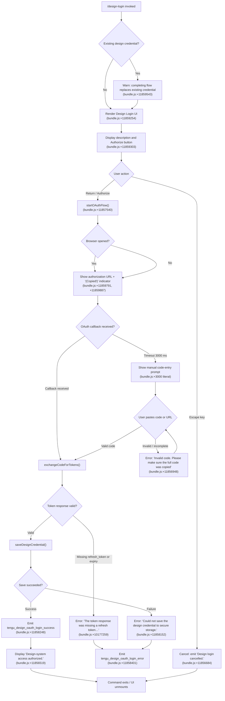

# `/design-login`

> Analysis basis: CC v2.1.183 bundle.js (AST extraction + Claude interpretation)
> Minimum version: v2.1.183

---

## Overview

`/design-login` initiates an OAuth authorization flow that grants Claude Code access to the claude.ai design system, enabling the `/design-sync` command. It renders an interactive JSX UI component that guides the user through browser-based OAuth or manual authorization-code entry, then stores the resulting credential for subsequent design-system operations.

---

## Registration

| Field | Value |
|---|---|
| type | `local-jsx` |
| name | `design-login` |
| description | `Authorize design-system access for /design-sync with your claude.ai account` |
| loc_byte | `11862538` |
| loc_byte_end | `11862737` |
| loc_line | `7630` |
| module_id | `bdl` |
| load_inline | `true` |
| arbor_handler.name | `Idl` |
| arbor_handler.fqn | `claude-2.1.183::Idl` |
| arbor_handler.kind | `Function` |
| arbor_handler.resolution_path | `direct` |
| arbor_handler.n_hits | `1` |

Analysis basis: CC v2.1.183 bundle.js:+11862538

---

## Input Branching

This command has more than three distinct interaction branches (initial state, OAuth-in-progress, manual code entry, success, cancellation, credential-save error). A Mermaid flowchart is used.



---

## Behavioral Spec

### Handler: renderDesignLoginUI (arbor: `Idl`, bundle handler: `d7p`)

The top-level handler is the React component registered as `d7p` in the bundle (Arbor resolves this to `Idl`). It uses `Tu.createElement` to produce the interactive JSX tree.

```
function renderDesignLoginUI(props):
    return createElement(designLoginComponent, props)
```

Analysis basis: CC v2.1.183 bundle.js:+11862304

---

### Sub-feature: Design Login Component (`Sdl`)

The core component is `Sdl`. It initializes React state, refs, and hooks, then manages the full OAuth lifecycle.

```
function designLoginComponent(props):
    [status, setStatus] = useState("starting")      // loc:+11856223
    [retryCount, setRetryCount] = useState(0)        // loc:+11856304
    terminalSize = useTerminalSize()                 // via fr -> ECi.useContext
    clock = useClock()                               // via Ns -> QIi.useContext

    columnWidth = Math.max(terminalSize.columns, 50) // loc:+11856433

    onKeyPress = useCallback(handleKeyInput, [...])
    authManager = useAuthManager()                   // via Rd -> sAe.useContext

    useEffect(() => {
        startOAuthFlow()
    }, [])

    function handleKeyInput(key, input):
        if input == "escape":
            setStatus("cancelled")
            emitMessage("Design login cancelled.")  // loc:+11856684
            return
        if input == "return":
            if status == "waiting_for_login":
                submitManualCode()
            else:
                initiateAuth()

    function initiateAuth():
        if CLAUDE_CODE_DESIGN_OAUTH_CLIENT_ID not configured:
            throw Error("The Claude Design OAuth client is not configured…") // loc:+11857317
        buildOAuthParams()         // via Ps, d4n
        startOAuthFlow(params)     // loc:+11857540

    return renderLayout()
```

Analysis basis: CC v2.1.183 bundle.js:+11856204

---

### Sub-feature: OAuth Flow Initiation (`r.startOAuthFlow`)

```
function startOAuthFlow(oauthParams):
    // Opens browser to authorization URL
    // Sets a setTimeout of 3000 ms (loc:+3000 literal, loc:+11857619)
    //   — after timeout, transitions UI to manual code-entry mode
    // Copies authorization URL to clipboard via platform clipboard helper (zv)
    p.setTimeout(fallbackToManualEntry, 3000)
    openBrowser(authorizationURL)
    displayAuthURL(authorizationURL)
    displayCopiedIndicator()     // "(Copied!)"  loc:+11859887
```

Analysis basis: CC v2.1.183 bundle.js:+11857540, +11857619

---

### Sub-feature: Manual Code / Callback URL Entry (`r.handleManualAuthCodeInput`)

When the OAuth redirect cannot be intercepted automatically (remote session), the user is prompted to paste the full callback URL or the authorization code from the browser address bar.

```
function handleManualAuthCodeInput(rawInput):
    // UI prompt explains: browser redirects to
    // http://localhost:<port>/callback?code=...&state=...
    // On remote sessions the page fails but the URL in the address bar is valid
    parsed = parseCallbackURL(rawInput)
    if parsed.code is missing:
        showError("Invalid callback URL: missing authorization code. Ask the user to paste…")
        // loc:+6623950
        return
    exchangeCodeForTokens(parsed.code, parsed.state)
```

Analysis basis: CC v2.1.183 bundle.js:+11857145, +6623950

---

### Sub-feature: Token Exchange and Persistence (`zpo`, `c4n`)

```
function exchangeAndSaveTokens(code, state):
    response = httpPost(tokenEndpoint, {
        grant_type: "authorization_code",
        code: code,
        "Content-Type": "application/json",    // loc:+2138625
        timeout: 5000                           // loc:+2138668 (ms)
    })

    if response.refresh_token is missing OR response.expiry is missing:
        emitTelemetry("tengu_design_oauth_login_error")
        showError("The token response was missing a refresh token or expiry…")
        // loc:+10177259
        return

    // Persist via secure storage
    result = saveDesignCredential(response)
    if result == failure:
        emitTelemetry("tengu_design_oauth_login_error")   // loc:+11858401
        showError("Could not save the design credential to secure storage.")
        // loc:+11858152
        return

    // 1500 ms display delay before success confirmation  loc:+11858377
    await delay(1500)
    emitTelemetry("tengu_design_oauth_login_success")     // loc:+11858248
    setStatus("success")
    showMessage("Design-system access authorized.")        // loc:+11856519
```

Analysis basis: CC v2.1.183 bundle.js:+10176876, +10173556, +11858043

---

### Sub-feature: OAuth Parameter Construction (`Ps`, `d4n`)

```
function buildOAuthParams(env):
    // Reads CLAUDE_CODE_DESIGN_OAUTH_CLIENT_ID
    // In prod environment: uses production claude.ai endpoints
    // In staging: uses staging endpoints
    // Supports CLAUDE_CODE_CUSTOM_OAUTH_URL override (must be approved endpoint)
    //   — if not approved: throws "CLAUDE_CODE_CUSTOM_OAUTH_URL is not an approved endpoint."
    //     loc:+861165
    // Local dev ports tried: 8000, 4000, 3000  (loc:+860044, +860131, +860221)
    // MCP toolbox path: /v1/toolbox/shttp/mcp/{server_id}  (loc:+860899)
    clientId = env.CLAUDE_CODE_DESIGN_OAUTH_CLIENT_ID
    if clientId starts with "00000000-":
        // local OAuth suffix applied  loc:+860831
        suffix = "-local-oauth"
    return OAuthConfig { clientId, authEndpoint, tokenEndpoint, redirectPort: 8205 }
```

Analysis basis: CC v2.1.183 bundle.js:+860969, +860718, +861165

---

### Sub-feature: Telemetry for Manual Entry (`tengu_design_oauth_manual_entry`)

```
function onManualEntryInitiated():
    // Fired when the user switches from waiting for browser callback
    // to manually entering the authorization code
    emitTelemetry("tengu_design_oauth_manual_entry")   // loc:+11857107
    setStatus("waiting_for_login")
```

Analysis basis: CC v2.1.183 bundle.js:+11857107

---

### Sub-feature: About-to-Retry State

```
function onAboutToRetry():
    // Intermediate state shown before re-initiating OAuth after error
    setStatus("about_to_retry")          // loc:+11856788
    await delay(retryDelay)
    initiateAuth()
```

Analysis basis: CC v2.1.183 bundle.js:+11856788

---

### Sub-feature: Clipboard Helper (`zv` → `SHi` → `Un`)

The authorization URL is automatically copied to clipboard using a platform-aware helper.

```
function copyToClipboard(text):
    platform = detectPlatform()
    if platform == "macos":
        spawn("pbcopy")                  // loc:+3537613
    elif platform == "linux":
        if wayland: spawn("wl-copy")     // loc:+3536573
        elif DISPLAY: spawn("xclip")     // loc:+3536641
        else: spawn("xsel")              // loc:+3536681
    elif platform == "windows":
        spawn("powershell.exe", ["-NoProfile", "-NonInteractive", "-Command", ...])
        // loc:+3538010
    elif tmux:
        spawn("tmux", ["load-buffer", "-w", ...])  // loc:+3536860
    else:
        // OSC 52 escape sequence fallback
        writeOSC52(text)
    // Encoding: base64  loc:+3537194
```

Analysis basis: CC v2.1.183 bundle.js:+3537208, +3537611

---

## State & Side Effects

| Item | Detail |
|---|---|
| Telemetry: `tengu_design_oauth_manual_entry` | Fired when user switches to manual code-entry mode (bundle.js:+11857107) |
| Telemetry: `tengu_design_oauth_login_success` | Fired on successful credential storage (bundle.js:+11858248) |
| Telemetry: `tengu_design_oauth_login_error` | Fired on token exchange or credential-save failure (bundle.js:+11858401) |
| Telemetry: `tengu_daemon_config_reload` | Fired on daemon config reload path reached during side-effect chain (bundle.js:+17290894) |
| Telemetry: `tengu_mcp_skills` | MCP skills update event, reached via MCP manager side-effects (bundle.js:+6624971) |
| Telemetry: `tengu_config_auth_loss_prevented` | Auth-loss guard in global config save (bundle.js:+13963653) |
| Secure storage write | Stores design OAuth tokens (refresh token + expiry) to secure storage via `c4n` |
| Clipboard write | Authorization URL is copied to platform clipboard on flow start (bundle.js:+11859887) |
| Browser launch | Opens the claude.ai authorization URL in the default browser |
| setTimeout (3000 ms) | Falls back to manual entry if browser callback not received (bundle.js:+11857619) |
| Display delay (1500 ms) | Brief pause before success message display (bundle.js:+11858377) |
| MCP connection state | Side-effect chain touches MCP manager (`n3e`, `B1o`, `uZn`) — connection slots may be refreshed after credential update |
| appState changes | `status` field cycles through: `starting` → `waiting_for_login` / `processing` → `about_to_retry` / `success` / cancelled |
| Sound | None detected in depth-2 traversal |

---

## Version History

| Version | Change |
|---|---|
| v2.1.183 | Initial analysis |

---

## Common Mistakes

1. **Missing OAuth client ID**: If the environment variable `CLAUDE_CODE_DESIGN_OAUTH_CLIENT_ID` is not set or still contains the placeholder `00000000-` UUID, the command throws immediately with an error about the client not being configured in this build (bundle.js:+11857317). This is a build-time configuration requirement.

2. **Remote session / no browser**: In remote SSH or container sessions the browser redirect to `localhost` fails silently. The UI will fall back to manual entry after 3 seconds, requiring the user to paste the full callback URL (including `?code=...&state=...`) from the browser address bar into the terminal (bundle.js:+6623950).

3. **Partial code paste**: Pasting only the `code` parameter value rather than the full callback URL may trigger the "Invalid callback URL: missing authorization code" error. The UI expects the entire redirect URL or an already-extracted code depending on the parsing branch.

4. **Credential replacement warning**: Running `/design-login` when a design credential already exists replaces it without further confirmation beyond the warning displayed in the UI (bundle.js:+11859543). Teams sharing a Claude Code config should coordinate before re-authorizing.

5. **Custom OAuth URL restriction**: Setting `CLAUDE_CODE_CUSTOM_OAUTH_URL` to an unapproved endpoint causes an immediate error ("not an approved endpoint", bundle.js:+861165). Only endpoints registered in the approved list are accepted.

6. **Token must include refresh_token**: The token endpoint response must contain both a `refresh_token` and expiry. If the OAuth server returns only an access token, the credential is rejected and not stored (bundle.js:+10177259).

---

## Appendix — Identifier Mapping

> For bundle debugging only. Identifiers change across versions.

| Identifier | Role |
|---|---|
| `d7p` | Top-level JSX wrapper / command handler (renders `Sdl`) |
| `Sdl` | Design login React component (main state machine) |
| `Idl` | Arbor-resolved handler function name for `/design-login` |
| `Ns` | Clock context hook (`useClock`) |
| `fr` | Terminal size context hook (`useTerminalSize`) |
| `I` | Key-input / event handler for scroll/navigation |
| `k` | File-watch / config reload event handler |
| `Uuc` | Filesystem realpath+stat helper |
| `Mn` | ENOENT error classifier |
| `Gp` | General process/utility helper |
| `T` | HTTP request builder / API call helper |
| `QHc` | Request formatter (includes FO, ssr, j2o) |
| `Pe` | JSON.stringify wrapper |
| `Kc` | Path canonicalization / redaction helper (emits `[REDACTED]`) |
| `Hqe` | Query-string / search helper |
| `n_c` | File read with byte-length accounting |
| `De` | Log/event dispatcher (pushes to `hKe`, calls `QJ.logError`) |
| `Ho` | Error/string coercion utility |
| `st` | String coercion wrapper |
| `ra` | Essential-traffic queue helper |
| `Bzc` | Queue shift/push manager |
| `j6f` | Claude version/channel lookup |
| `BUn` | Version path builder (joins `l4e`, calls `Whe`) |
| `d` | MCP connection write/supervisor manager |
| `Aje` | File stat + MIME/content-type resolver |
| `r` | Data-stream / write helper |
| `qDl` | Column-width / layout calculator |
| `i` | Connection slot manager (get/set/delete/close) |
| `y` | Background worker controller (l1t, xht) |
| `E` | Interval/polling controller (start/stop/updateConfig) |
| `Puc` | Heartbeat sender (`zse`) |
| `j` | General async/deferred utility |
| `s` | Inflight-request tracker (add/delete/finally) |
| `a` | MCP state aggregator (wraps `n3e`, `uZn`, `mta`) |
| `n3e` | MCP server connection orchestrator |
| `dW` | MCP slot diff/apply helper |
| `Ort` | MCP server option builder (`bP`, `Gpe`) |
| `W7` | MCP connection initializer (full lifecycle) |
| `k5` | SDK-type MCP server enumerator |
| `NLn` | Warning/error color formatter (`_Kr`, `Ht.red`, `Ht.yellow`) |
| `Mrt` | MCP tool-manifest merger/reconciler |
| `Nk` | Permission checker (`P_`, `EKr`) |
| `P_` | Permission policy evaluator (`zue`, `Ct`, `Fa`) |
| `EKr` | Extended permission rule resolver |
| `o` | String pad/format helper |
| `Wn` | Tree-walk / notification helper |
| `pra` | MCP connection attempt runner |
| `w7r` | Connection result handler (`ci`, `d0n`, `Gt`) |
| `Vwe` | Content-hash utility (SHA-256, `IQi.createHash`) |
| `Phn` | Prompt/schema builder (`Rse`, `Az`) |
| `Ohn` | Output hash manager |
| `EI` | Entry hasher (`Pe`, `Gni.createHash`) |
| `Mhn` | Manifest-hash helper (`dc`) |
| `dc` | Config digest helper (`D3s`) |
| `on` | MCP debug logger (`hKe.push`, `QJ.logMCPDebug`) |
| `oxn` | MCP OAuth proxy connection handler |
| `Lr` | OAuth proxy link resolver |
| `CBd` | OAuth flow manager (start, authenticate, complete_authentication) |
| `vBd` | OAuth callback/code exchange handler |
| `Sra` | MCP server reconnection scheduler |
| `ci` | Async-local-storage store getter (`L0u.getStore`) |
| `d0n` | Path joiner for MCP needs-auth cache |
| `OKr` | MCP auth-cache reader/writer |
| `Ee` | String coercion / error-message extractor |
| `m` | Worker process kill manager |
| `n` | String toLowerCase normalizer |
| `Uk` | MCP skills broadcaster |
| `ct` | Skills snapshot collector (`wxt`, `Lxt`, `I4`) |
| `yKr` | MCP capability filter (includes check) |
| `pn` | Global config writer with auth-loss guard |
| `w` | Background worker entry (blur/focus lifecycle) |
| `kz` | Worker blur-state tracker |
| `L` | Background worker sweep scheduler |
| `v` | Worker state snapshot |
| `Dec` | Worker array accessor (`.at`) |
| `Cu` | MCP error logger (`hKe.push`, `QJ.logMCPError`) |
| `gra` | Zod/schema validator entry point |
| `U8` | Schema validation engine (TypeError, AggregateError) |
| `Hot` | parseInt wrapper (radix 10) |
| `p0n` | parseInt wrapper variant (radix 20) |
| `uZn` | MCP update applicator (`applyMcpUpdate`) |
| `t3e` | MCP update hash checker |
| `fw` | MCP cleanup + skills re-broadcast |
| `hot` | MCP server slot cleanup (`Vwe`, `o.cleanup`) |
| `mta` | MCP config transform (`Szr`) |
| `l` | Daemon-status reporter (`k0l`) |
| `k0l` | Daemon status file writer (`daemon.status.json`) |
| `CQ` | Config file accessor (`vfe`) |
| `Mjt` | Daemon status path builder (`x0l.join`) |
| `B1o` | MCP retry-all-recovered handler |
| `jLn` | Permission set membership checker (`X2d`, `LKr`) |
| `Bn` | Timeout-guarded async runner (setTimeout/clearTimeout) |
| `c` | Timer/process handle wrapper (`Tn`) |
| `I9t` | OAuth URL builder shim (`d4n`) |
| `d4n` | OAuth parameter constructor (`Ps`) |
| `Ps` | OAuth endpoint resolver (prod/staging/custom URL) |
| `Oqo` | Environment variable reader for OAuth config |
| `uUc` | OAuth URL approval checker |
| `p` | Forced-shutdown timer (`WT`, `process.exit`, `u.abort`) |
| `WT` | Shutdown wait helper |
| `u` | AbortController / daemon stop orchestrator |
| `ke` | `tengu_feature_ok` telemetry emitter |
| `Ue` | Generic feature-flag telemetry dispatcher (`ogt`) |
| `Re` | `tengu_feature_bad` telemetry emitter |
| `rF` | MCP transport registration helper (firstParty) |
| `T4` | MCP server spec normalizer (`uB`) |
| `gFe` | MCP transport registry builder (`BR`) |
| `MNr` | MCP server instance factory (`kNr.randomUUID`, `EJe`, `o8`) |
| `SG` | Graceful-shutdown sequencer (Promise.race/all) |
| `Lme` | MCP shutdown helper (`wme.shutdown`) |
| `Nme` | clearTimeout + `Cko` cleanup |
| `p1` | OAuth token-refresh HTTP poster (`mo.post`) |
| `Pt` | `tengu_feature_sad` telemetry emitter |
| `zpo` | Design token save orchestrator (`Ipe.filter`, `p1`, `n.join`) |
| `c4n` | Design credential secure-storage writer (`dc`, `T`, `Ee`) |
| `Rd` | Auth-state subscription hook (`sAe.useContext/useRef/useMemo/useSyncExternalStore`) |
| `zv` | Clipboard orchestrator (platform detection + write) |
| `d0t` | Clipboard backend loader (`b_`) |
| `b_` | Platform-specific clipboard backend selector |
| `SHi` | Clipboard write dispatcher (`zt`, `Un`) |
| `Un` | Clipboard write executor (`qr`, `Mt`) |
| `qr` | OSC52 / native clipboard writer |
| `Mt` | Clipboard fallback handler (`Qen`, `Ar`) |
| `xFr` | Linux clipboard helper (`zt`, `_A`) |
| `_A` | xclip/xsel spawn helper (`Fqo`) |
| `ged` | tmux buffer clipboard helper (`Un`, `T`) |
| `LFr` | Platform guard for clipboard |
| `p0t` | Clipboard encoding helper (`d0t`, `zt`) |
| `EL` | OSC52 escape-sequence builder (`LFr`, `e.replaceAll`) |
| `aE` | Multi-line clipboard join helper (`EHi`, `e.join`) |
| `EHi` | Clipboard line preprocessor (`b_`) |
| `T9t` | Design credential status renderer (`dc`, `T`, `Ee`) |

Note: index built via Arbor fallback; some signals (telemetry, literals) may be missing — see arbor-fallback.js.