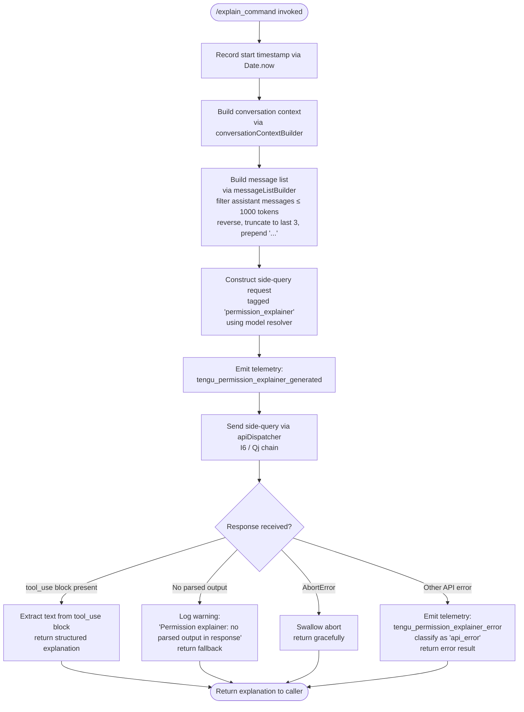

# `/explain_command`

> Analysis basis: CC v2.1.183 bundle.js (AST extraction + Claude interpretation)
> Minimum version: v2.1.183

---

## Overview

`/explain_command` is an internal tool-type command that generates a human-readable explanation of a pending tool-use permission request. When Claude Code needs to ask the user whether to allow a tool call, this command constructs a focused side-query to a language model (tagged `"permission_explainer"`) and returns a plain-text explanation of what the tool would do and why it is being requested.

---

## Registration

| Field | Value |
|---|---|
| type | `tool` |
| name | `explain_command` |
| description | `null` |
| loc_byte | `14798938` |
| loc_byte_end | `14798974` |
| loc_line | `10975` |
| arbor_handler.name | `Bql` |
| arbor_handler.fqn | `claude-2.1.183::Bql` |
| arbor_handler.kind | `AsyncFunction` |
| arbor_handler.resolution_path | `direct` |
| arbor_handler.n_hits | `1` |

Analysis basis: CC v2.1.183 bundle.js:+14798938

---

## Input Branching

The handler has four or more distinct outcome paths (success with parsed output, abort/cancel, API error, and missing-output fallback), so a Mermaid flowchart is used.



Analysis basis: CC v2.1.183 bundle.js:+14798633 (handler entry `Bql → EPo`), +14799421 (success telemetry), +14799633 (error telemetry), +14799768 (no-output warning), +14800091 (AbortError literal), +14800162 (api_error literal)

---

## Behavioral Spec

### 1. Handler Entry — `explainCommandHandler` (`Bql`)

```
async function explainCommandHandler(toolUseContext):
    startTime = Date.now()
    context = buildConversationContext(toolUseContext)    // EPo
    messageList = buildTruncatedMessageList(context)     // sPf
    request = buildPermissionExplainerRequest(context)   // oPf
    response = await dispatchSideQuery(request)          // I6 path
    result = parseExplainerResponse(response)
    return result
```

Analysis basis: CC v2.1.183 bundle.js:+14798633, +14798657, +14798678, +14798696, +14798843, +14798856

---

### 2. Conversation Context Builder — `buildConversationContext` (`EPo`)

```
function buildConversationContext(input):
    config = loadConfig()              // Ct → q_e
    watchForConfigChanges(config)      // Ebf
    return { config, messages: input.conversationHistory }
```

The config loader (`q_e`) reads the global configuration from disk using `r.readFileSync` with UTF-8 encoding. It also manages a backup directory (`"backups"`) and handles the `ENOENT` and `EEXIST` error codes during config file access.

Analysis basis: CC v2.1.183 bundle.js:+14798509, +13968745, +13968919, +13968257

---

### 3. Message List Builder — `buildTruncatedMessageList` (`sPf`)

```
function buildTruncatedMessageList(messages):
    // Filter to assistant messages only whose token count ≤ 1000
    filtered = messages.filter(m => m.role == "assistant" && tokenCount(m) <= 1000)
    // Take at most 3 most-recent messages (reverse then slice)
    recent = filtered.reverse().slice(0, 3)
    // Prepend ellipsis sentinel to indicate truncation
    recent.unshift("...")
    return recent.join(separator)
```

Constants observed in this path:
- Role filter target: `"assistant"` (bundle.js:+14798237)
- Token ceiling per message: `1000` (bundle.js:+14798202)
- Maximum message count: `3` (bundle.js:+14798257)
- Truncation sentinel: `"..."` (bundle.js:+14798433)
- Text content type: `"text"` (bundle.js:+14798340)

The surrogate-pair boundary check (charCodeAt thresholds `55296` / `56319`, bundle.js:+201582, +201592) is applied inside the string normalizer (`ND`) to avoid splitting multi-byte characters when truncating.

Analysis basis: CC v2.1.183 bundle.js:+14798214, +14798257, +14798282, +14798425, +14798441, +14798474

---

### 4. Side-Query Request Builder — `buildPermissionExplainerRequest` (`oPf`)

```
function buildPermissionExplainerRequest(context):
    payload = formatAsJSON(context)        // Pe → JSON.stringify
    payload.systemTag = "permission_explainer"
    payload.toolUseType = "tool_use"
    return payload
```

The system tag `"permission_explainer"` (bundle.js:+14798996) is embedded in the request to identify this as an explainer side-query, distinct from normal agent turns. The `"tool_use"` content type tag (bundle.js:+14799151) marks the expected response shape.

Analysis basis: CC v2.1.183 bundle.js:+14798148, +14798174, +14798996, +14799151

---

### 5. API Dispatch — `apiDispatcher` (`I6`) and Core Request Handler (`Qj`)

The side-query is routed through the same streaming API infrastructure used by the main agent loop:

```
async function dispatchSideQuery(request):
    headers = buildRequestHeaders()     // includes X-Claude-Code-Session-Id,
                                        // User-Agent, x-client-app, etc.
    authToken = resolveAuthToken()      // hy → Ug → Ct (auth chain)
    response = await streamingPost(request, headers, authToken)
    return response
```

Key infrastructure pulled in:
- Session ID header: `"X-Claude-Code-Session-Id"` (bundle.js:+3015917)
- Side-query label: `"side_query"` (bundle.js:+8781608), `"sideQuery"` (bundle.js:+8783019)
- Byte-stream watchdog with idle timeout, emitting `tengu_byte_stream_idle_timeout_ms` (bundle.js:+3022411) and firing `tengu_byte_watchdog_fired_late` (bundle.js:+3023622)
- Prompt-cache 1-hour TTL config via `tengu_prompt_cache_1h_config` (bundle.js:+13722283)

Analysis basis: CC v2.1.183 bundle.js:+14798843, +14798856, +8781608, +3015917

---

### 6. Response Parsing and Result Construction

```
function parseExplainerResponse(response):
    if response contains tool_use block:
        emit telemetry("tengu_permission_explainer_generated")
        return extractTextContent(response.tool_use)

    if response is empty / no parsed output:
        log("Permission explainer: no parsed output in response")
        return fallbackExplanation()

    if error is AbortError:
        return gracefulAbort()

    // All other errors
    emit telemetry("tengu_permission_explainer_error")
    classify error as "api_error"
    return errorResult()
```

The `"permission_explainer_generate"` literal (bundle.js:+14799523) appears as an internal operation label used when constructing the tool-use call sent to the model.

Analysis basis: CC v2.1.183 bundle.js:+14799421, +14799471, +14799523, +14799715, +14799768, +14800091, +14800127, +14799633, +14800162

---

### 7. Permission Classification Helper — `classifyPermission` (`Qi`)

```
function classifyPermission(toolName):
    if Object.hasOwn(toolNames, toolName):
        if toolName.startsWith("mcp__"):
            return "mcp_tool"     // MCP-prefix tool
        return lookupBuiltinCategory(toolName)
    return null
```

This helper is called during result construction to annotate the explanation with the category of the tool whose permission is being explained (`"mcp__"` prefix detection at bundle.js:+3296570, `"mcp_tool"` label at bundle.js:+3296589).

Analysis basis: CC v2.1.183 bundle.js:+14799471, +3296501, +3296557, +3296570, +3296589

---

## State & Side Effects

| Item | Detail |
|---|---|
| Telemetry — success | `tengu_permission_explainer_generated` (bundle.js:+14799421) |
| Telemetry — error | `tengu_permission_explainer_error` (bundle.js:+14799633) |
| Telemetry — API watchdog | `tengu_byte_stream_idle_timeout_ms`, `tengu_byte_watchdog_fired_late` |
| Telemetry — config | `tengu_config_parse_error`, `tengu_config_auth_loss_prevented`, `tengu_prompt_cache_1h_config` |
| Telemetry — feature flags | `tengu_feature_ok`, `tengu_feature_bad`, `tengu_feature_sad` |
| Side-query label | Request tagged `"permission_explainer"` and `"side_query"` — does **not** affect main conversation history |
| Config access | Reads global config via `readFileSync`; sets up file watcher (`Ebf` / `B7n.watchFile`) |
| Config backup | May create `"backups"` subdirectory alongside config file |
| appState changes | None observed in depth-2 traversal |
| Sound | None observed in depth-2 traversal |
| Hook registration | `qi → B2o.register` (bundle.js:+69538) — lifecycle hook registered during config-watch setup |

---

## Version History

| Version | Change |
|---|---|
| v2.1.183 | Initial analysis |

---

## Common Mistakes

1. **Treating `/explain_command` as a user-facing conversational command.** It is registered as type `tool`, not `prompt`. It is invoked programmatically when the permission subsystem needs an explanation rendered, not directly by the user typing `/explain_command` in the REPL.
2. **Expecting a full conversation response.** The command fires a short side-query capped to the last 3 assistant messages (≤1000 tokens each) and returns only the explanation text, not a full agent turn.
3. **Assuming the model used is the same as the main agent.** The `"permission_explainer"` tag routes to a potentially different model configuration; the side-query infrastructure (`I6`/`Qj`) resolves the model independently.
4. **Not handling the no-output fallback.** Callers must check for the `"Permission explainer: no parsed output in response"` condition — the command does not throw in this case; it returns a fallback result silently.
5. **Confusing MCP tool explanations with built-in tool explanations.** The `classifyPermission` helper applies different logic for names starting with `"mcp__"`, so MCP tool permission dialogs receive a different annotation path.

---

## Appendix — Identifier Mapping

> For bundle debugging only. Identifiers change across versions.

| Identifier | Role |
|---|---|
| `Bql` | Main async handler for `explain_command` (`explainCommandHandler`) |
| `EPo` | Conversation context builder |
| `Ct` | Config loader / accessor |
| `q_e` | Low-level config file reader (readFileSync, JSON parse, backup management) |
| `RFl` | Config directory resolver (basename, readdirStringSync, join, dirname) |
| `Ebf` | Config file watcher setup (watchFile / unwatchFile) |
| `Kq` | Watcher change-event callback |
| `qi` | Lifecycle hook registrar (calls `B2o.register`) |
| `jt` | Logger / debug utility |
| `Hko` | Config schema validator |
| `V9` | String prefix stripper (startsWith / slice) |
| `Gt` | JSON safe-parser (`JSON.parse` wrapper) |
| `T` | Log-level dispatcher (debug/error routing) |
| `dn` | Error code extractor |
| `Sko` | Backup path builder (join + `tr`) |
| `oPf` | Permission-explainer request builder (`Pe` + `String`) |
| `Pe` | JSON serializer (`JSON.stringify` wrapper) |
| `sPf` | Message list truncator (filter, reverse, unshift, join) |
| `ND` | Safe string truncator with surrogate-pair boundary check |
| `js` | Model-config resolver entry point |
| `jK` | Model selector core |
| `ul` | Model string normalizer / tier resolver |
| `_s` | Model string canonicalizer (trim, toLowerCase, tier mapping) |
| `oCt` | Model prefix handler (`"claude-"` detection) |
| `Uun` | Full model resolution pipeline |
| `I6` | API side-query dispatcher (main entry for HTTP requests) |
| `Qj` | Core API request handler (headers, auth, streaming) |
| `MWu` | Streaming request executor (AbortSignal, timeout, retry) |
| `kWu` | Byte-stream watchdog (performance.now, setTimeout, ReadableStream reader) |
| `hy` | Auth orchestrator |
| `Ug` | Auth resolver (ANTHROPIC_API_KEY, OAuth, apiKeyHelper) |
| `ib` | OAuth profile handler |
| `AJe` | Auth token formatter |
| `Jsn` | Proxy auth helper runner |
| `pz` | AsyncLocalStorage context accessor (`jBs.getStore`) |
| `qun` | Store accessor wrapper |
| `APr` | Request URL parser (split, trim, indexOf, slice) |
| `qvr` | URL encoder (`encodeURIComponent`) |
| `Lh` | OAuth token refresher (`uhn → UPr`) |
| `dy` | Network config builder (proxy, IP validation) |
| `RK` | URL scheme / host parser |
| `NEr` | IP address validator (`OEr.isIP`) |
| `IWu` | Request-context assembler (gateway, wOe, Lwr, Ps, VH) |
| `VAn` | Request variant selector (CC, js, Fo, wOe) |
| `Ps` | Endpoint validator (staging/prod check, CLAUDE_CODE_CUSTOM_OAUTH_URL guard) |
| `oTe` | OAuth token refresh poller (aPu, Date.now) |
| `aPu` | Gateway JWT refresh (NS.post, refresh_token, Content-Type) |
| `sTe` | WIF (Workload Identity Federation) credential resolver |
| `RYe` | WIF token exchange (fetch, AbortSignal.timeout) |
| `GUe` | Request header builder (Fo, _H, d1) |
| `Fo` | Model-to-API-path mapper (K7e, e_, dHt, Af) |
| `e_` | Model string normalizer for routing (toLowerCase, includes, replace) |
| `nse` | Foundry resource resolver (jgt, xwr) |
| `xwr` | Foundry URL rewriter (replace, Lwr) |
| `Kso` | Request fingerprint hasher (`wRa.createHash`, sha256) |
| `Kun` | User-agent / session-context builder (Hl, wr, Mu, qun) |
| `d_n` | Response header sanitizer |
| `M4e` | Main-thread request context tagger (`"repl_main_thread*"`, `"auto_mode"`, `"memdir_relevance"`) |
| `ct` | Request-cache manager (wxt, Lxt, I4, OHn, Cxt) |
| `OHn` | Cache hit/miss tracker (ONr, pIe, RNr, $Nr) |
| `UR` | Response unwrapper (LPr, BUe, Z1e) |
| `Qve` | Response content extractor (Fa, Array.isArray, o8, Mc, Lt, Pe) |
| `o8` | Tool-use session initializer (Ct, Eko.randomBytes, pn) |
| `pn` | Session bootstrap (W7n, vx, LMe, _ko, oWt, q_e, AAt) |
| `c9o` | Content array popper (t.pop, Array.isArray, uYt) |
| `pYt` | Content array pusher (n.pop, Array.isArray, uYt, dYt) |
| `uYt` | Content item validator (cYt, VHc.test) |
| `dDt` | Cache-digest builder (Nki, Pet, uDt) |
| `CF` | Agent-ID resolver (shd, x1, De) |
| `shd` | Agent prefix parser (`"agent:builtin:"`, `"agent:custom:"`, `"agent:"`) |
| `Dwr` | Response message normalizer (wr, n9s) |
| `kwr` | Header allowlist filter (xwr, jgt, r.get, o.has, s.add, r.set) |
| `Qi` | Permission classifier (`Object.hasOwn`, `"mcp__"` prefix, `"mcp_tool"`) |
| `Pt` | Feature-flag reporter (`tengu_feature_sad`) |
| `Ue` | Telemetry event emitter (`ogt`) |
| `Ee` | Error string converter (`String`) |
| `De` | Error logger / reporter (Ho, st, ra, Bzc, hKe.push, QJ.logError) |
| `Ho` | Error normalizer (`Error`, `String`) |
| `Re` | Secondary feature reporter (`tengu_feature_bad`) |
| `ke` | Primary feature reporter (`tengu_feature_ok`) |
| `vx` | Config schema version accessor |
| `Hko` | Config field validator |

---

Note: index built via Arbor fallback; some signals (telemetry, literals) may be missing — see arbor-fallback.js.