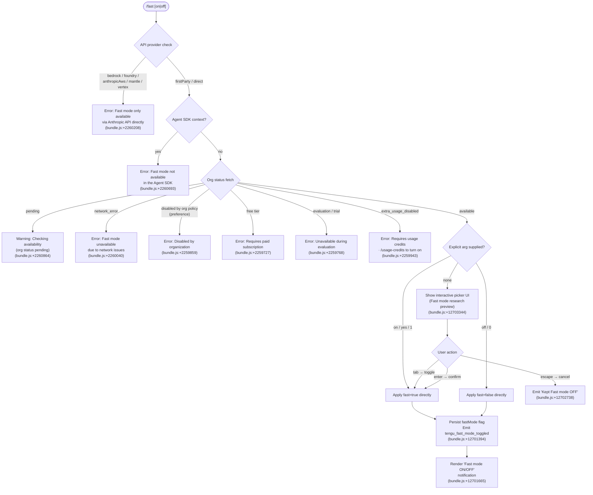

# `/fast`

> Analysis basis: CC v2.1.183 bundle.js (AST extraction + Claude interpretation)
> Minimum version: v2.1.183

---

## Overview

`/fast` toggles Claude Code's "Fast mode" (research preview) on or off for the current session. When invoked, it validates eligibility across multiple criteria — API provider, subscription tier, organization policy, and network availability — then presents an interactive confirmation UI before committing the state change. If called with an explicit `on` or `off` argument the command bypasses the picker and applies the change directly.

---

## Registration

| Field | Value |
|---|---|
| type | `local-jsx` |
| name | `fast` |
| description | `Toggle fast mode ( ... )` |
| argumentHint | `[on\|off]` |
| thinClientDispatch | `control-request` |
| immediate | `null` |
| isHidden | `null` |
| module_id | `fIl` |
| load_inline | `true` |
| loc_byte | `12706083` |
| loc_byte_end | `12706355` |
| loc_line | `8322` |
| arbor_handler.name | `wif` |
| arbor_handler.fqn | `claude-2.1.183::wif` |
| arbor_handler.kind | `AsyncFunction` |
| arbor_handler.resolution_path | `module_id` |
| arbor_handler.n_hits | `3` |

Analysis basis: CC v2.1.183 bundle.js:+12706083

---

## Input Branching

The command has 5+ distinct branches depending on API provider, subscription state, org policy, network status, and explicit argument; a Mermaid flowchart is used.



---

## Behavioral Spec

### Handler Entry Point (`wif`)

The top-level async handler (`wif`, resolved via `module_id` → `fIl`) is the authoritative entry point.

Analysis basis: CC v2.1.183 bundle.js:+12705083

```
async function fastCommandHandler(args, appState):
    prefetchFastModeAvailability(appState)     // wif → gYe, non-blocking
    renderFastModeComponent(appState, args)    // wif → gVn
    emitShortcutTelemetry("shortcut")          // wif → j
```

### Provider Eligibility Check (`wif` → `Woe` → `wr`)

Before the picker or any state change, the handler checks the active API provider.

Analysis basis: CC v2.1.183 bundle.js:+2260176

```
function checkFastModeProviderEligibility(provider):
    // provider is one of: bedrock, foundry, anthropicAws, mantle, vertex, firstParty
    nonDirectProviders = ["bedrock", "foundry", "anthropicAws", "mantle", "vertex"]
    if provider in nonDirectProviders:
        return Error("Fast mode is only available when using the Anthropic API directly")
        // literal: bundle.js:+2260208
    if runningInsideAgentSDK():
        return Error("Fast mode is not available in the Agent SDK")
        // literal: bundle.js:+2260693
    return OK
```

### Organization / Subscription Gate (`Woe` → `ct` → `OHn`)

After provider checks pass, the org-level fast mode status is resolved from a cached or live fetch.

Analysis basis: CC v2.1.183 bundle.js:+2260311

```
function resolveOrgFastModeStatus(orgStatus):
    match orgStatus:
        case "pending":
            warn("Fast mode unavailable: Checking fast mode availability (org status pending)")
            // literal: bundle.js:+2260785
            return PENDING
        case "network_error":
            warn("Fast mode unavailable due to network connectivity issues")
            // literal: bundle.js:+2260040
            return UNAVAILABLE
        case "free":
            warn("Fast mode requires a paid subscription")
            // literal: bundle.js:+2259727
            return UNAVAILABLE
        case "extra_usage_disabled":
            warn("Fast mode requires usage credits · /usage-credits to turn them on")
            // literal: bundle.js:+2259943
            return UNAVAILABLE
        case "preference" (org disabled):
            warn("Fast mode has been disabled by your organization")
            // literal: bundle.js:+2259859
            return UNAVAILABLE
        case "active":
            return AVAILABLE
```

### Fast Mode Availability Prefetch (`gYe`)

A non-blocking prefetch is fired before the UI is shown to warm the availability cache.

Analysis basis: CC v2.1.183 bundle.js:+12705145

```
async function prefetchFastModeAvailability(appState):
    if inFlightPromise exists:
        log("Fast mode prefetch in progress, returning in-flight promise")
        // literal: bundle.js:+2264399
        return existingPromise

    if fetchedRecently():
        log("Skipping fast mode prefetch, fetched recently")
        // literal: bundle.js:+2264646
        return cached

    auth = await resolveAuth(appState)    // gYe → jMu → Ps
    if auth is null:
        raise Error("No auth available")
        // literal: bundle.js:+2264822

    try:
        response = await callFastModeAPI(auth)  // gYe → $U → hqu
        updateFastModeCache(response)
        emit("kvr", response)                   // gYe → kvr.emit
    catch err if HTTP 401:
        triggerOAuthRecovery()
    catch err if HTTP 403:
        // treat as disabled
    catch AxiosError:
        setStatus("network_error")

    emit("tengu_org_penguin_mode_fetch_failed") on error  // telemetry: bundle.js:+2265818
```

### Argument Parsing and Direct Toggle

When `/fast on`, `/fast off`, `/fast yes`, or the numeric literals `1`/`0` are supplied, the confirmation UI is bypassed.

Analysis basis: CC v2.1.183 bundle.js:+12705198

```
function parseExplicitFastArg(rawArg):
    normalized = rawArg.trim().toLowerCase()
    if normalized in ["on", "yes", "1"]:
        return FORCE_ON
    if normalized in ["off", "0"]:
        return FORCE_OFF
        // literal "off": bundle.js:+12705198
    return NONE  // show picker
```

### Interactive Picker UI (`HVn`)

When no explicit argument is given the command renders a full-screen terminal picker labelled "Fast mode (research preview)".

Analysis basis: CC v2.1.183 bundle.js:+12703344

```
function renderFastModePicker(currentState, eligibility):
    show dialog titled " Fast mode (research preview)"
    display current state as "ON " or "OFF"
    // literals: bundle.js:+12704120, +12704126

    if eligibility == "overloaded":
        show "Fast mode overloaded and is temporarily unavailable"
        // literal: bundle.js:+12704292
    elif hitFastLimit():
        show "You've hit your fast limit · resets in {countdown}"
        // literal: bundle.js:+12704346

    register keymap:
        "tab"    → "toggle"   (confirm:toggle)
        "enter"  → "confirm"  (confirm:yes)
        "escape" → "cancel"
        // literals: bundle.js:+12703616, +12703629, +12703667, +12703682, +12703537, +12703553

    show link: https://code.claude.com/docs/en/fast-mode
    // literal: bundle.js:+12704566

    on confirm:
        applyFastModeToggle()
        emit("tengu_fast_mode_toggled")
        // telemetry: bundle.js:+12701394
        showNotification("Fast mode OFF" or state label)
        // literal: bundle.js:+12701665

    on cancel:
        log("Kept Fast mode OFF")
        // literal: bundle.js:+12702738
```

### Flag Settings Persistence (`gVn` → `hVn` → `QDe`)

The toggle writes to a `flagSettings` key in the layered settings store after user confirms.

Analysis basis: CC v2.1.183 bundle.js:+12700462

```
function applyFlagSettings(newFastModeValue):
    flagSettings = readCurrentFlagSettings()    // gVn → hVn
    flagSettings["fastMode"] = newFastModeValue // literal "fastMode": bundle.js:+12700462
    persistSettings(flagSettings)               // hVn → QDe (coerces: String/Number/Boolean)
    emit("apply_flag_settings")                 // literal: bundle.js:+12701025
    emit("tengu_fast_mode_toggled")             // telemetry: bundle.js:+12701394
```

### Opus 4.6 Deprecation Path (`$Io` → `pBs`)

A deprecation notice is triggered for users on Opus 4.6 models with the `opus46-fast-mode-deprecation` experiment.

Analysis basis: CC v2.1.183 bundle.js:+12700780

```
function checkOpus46FastModeDeprecation(model, orgStatus):
    if experiment("opus46-fast-mode-deprecation") and model includes "opus-4-6":
        emit("tengu_sunset_penguin_opus46")    // telemetry: bundle.js:+2261607
        show deprecation notice with sunset date 2026-06-29
        // literal: bundle.js:+2261637
```

### Cooldown Re-enable (`Lvr`)

Fast mode can enter a "cooldown" state; when the cooldown expires, the mode is automatically re-enabled and a log entry is emitted.

Analysis basis: CC v2.1.183 bundle.js:+2261836

```
function onCooldownExpired():
    if currentState == "cooldown" and cooldownElapsed():
        log("Fast mode cooldown expired, re-enabling fast mode")
        // literal: bundle.js:+2261889
        setFastModeActive(true)
        emit("mBs", "fastMode", true)   // Lvr → mBs.emit
```

### Picker Shown Telemetry (`wif`)

When the interactive picker is displayed (no explicit arg), a separate telemetry event fires.

Analysis basis: CC v2.1.183 bundle.js:+12705321

```
function onPickerShown():
    emit("tengu_fast_mode_picker_shown")   // telemetry: bundle.js:+12705323
    recordTimestamp(Date.now())
```

---

## State & Side Effects

| Item | Detail |
|---|---|
| Telemetry — `tengu_fast_mode_toggled` | Fired on every successful toggle (on or off). bundle.js:+12701394 |
| Telemetry — `tengu_fast_mode_picker_shown` | Fired when the interactive picker UI is displayed. bundle.js:+12705323 |
| Telemetry — `tengu_org_penguin_mode_fetch_failed` | Fired when the org-status prefetch request fails. bundle.js:+2265818 |
| Telemetry — `tengu_penguins_off` | Fired when fast mode is disabled (internal state machine). bundle.js:+2260314 |
| Telemetry — `tengu_sunset_penguin_opus46` | Fired for Opus 4.6 model deprecation path. bundle.js:+2261607 |
| Telemetry — `tengu_oauth_401_*` (family) | OAuth 401 recovery events fired during prefetch auth failures. bundle.js:+3064361 ff. |
| Telemetry — `tengu_config_*` (family) | Config lock / stale-write / auth-loss events fired during settings persistence. bundle.js:+13966745 ff. |
| Telemetry — `tengu_feature_ok / bad / sad` | Feature flag evaluation events fired by the org-status resolver. bundle.js:+1021887 ff. |
| appState — `fastMode` | Written to `flagSettings.fastMode` (boolean). Persisted to disk via the layered settings store. bundle.js:+12700462 |
| appState — cooldown | Internal `cooldown` status cleared on expiry; state transitions back to `active`. bundle.js:+2261836 |
| Event emitter — `kvr` | Emitted with the raw org-status API response after a successful prefetch. bundle.js:+2265449 |
| Event emitter — `mBs` | Emitted on cooldown expiry re-enable. bundle.js:+2261949 |
| Hook registration | `Wo` registers a global handler via `o.registerHandler` for keyboard events (tab/enter/escape). bundle.js:+4197024 |
| Sound | None identified in depth-2 traversal. |
| thinClientDispatch | Dispatches `control-request` to the thin-client layer; the UI component is rendered in-process. |
| Config write side-effect | `flagSettings` key written through the atomic file-write path (`MSt` / `q_e`) including backup rotation. bundle.js:+13967542 |
| Org-status prefetch cache | In-flight promise deduplicated via module-scope variable; skipped if fetched recently (within 20-slot window). bundle.js:+2264646 |

---

## Version History

| Version | Change |
|---|---|
| v2.1.183 | Initial analysis |

---

## Common Mistakes

1. **Invoking `/fast` on a non-first-party API endpoint** (AWS Bedrock, GCP Vertex, etc.) will always produce a hard error — Fast mode is restricted to the Anthropic API directly. There is no workaround within the CLI; switch `ANTHROPIC_API_KEY` to a direct key.
2. **Expecting `/fast on` to work on a free-tier account** — the command checks subscription status before applying and returns a "requires paid subscription" message. The toggle will not persist.
3. **Running inside the Agent SDK** — Fast mode is explicitly blocked in Agent SDK contexts; the error message says so verbatim (`bundle.js:+2260693`). Do not attempt to script around it.
4. **Ignoring the `pending` state** — if the org status has not yet resolved, the command emits a warning and leaves Fast mode unchanged. Retry after a moment.
5. **Confusing `extra_usage_disabled` with "org disabled"** — the two error messages and recovery paths are different. `extra_usage_disabled` can be resolved via `/usage-credits`; org policy (`preference`) cannot be overridden by the user.
6. **Assuming the Opus 4.6 model still supports Fast mode** — the `opus46-fast-mode-deprecation` experiment path triggers a deprecation notice and sunset date (2026-06-29) for these models. Migrate to a newer model variant.

---

## Appendix — Identifier Mapping

> For bundle debugging only. Identifiers change across versions.

| Identifier | Role |
|---|---|
| `wif` | Top-level async fast-command handler (Arbor-resolved entry point) |
| `Woe` | Fast mode availability gate; checks provider, org status, and SDK context |
| `gYe` | Fast mode availability prefetch function (non-blocking) |
| `gVn` | Fast mode component renderer (renders picker or applies direct toggle) |
| `hVn` | Flag-settings applier; reads and writes `flagSettings.fastMode` |
| `QDe` | Settings field coercer (String / Number / Boolean normalization) |
| `HVn` | Fast mode picker React component |
| `$Io` | Opus 4.6 deprecation path dispatcher |
| `pBs` | Sunset / deprecation notice renderer for Opus 4.6 |
| `Lvr` | Cooldown expiry handler; re-enables Fast mode after cooldown |
| `uc` | App state reader utility |
| `wr` | Provider / API-type resolver |
| `ct` | Org-status cache lookup and hydration |
| `OHn` | Org experiment / feature-flag resolver |
| `RNr` | Feature flag evaluation (GrowthBook experiment event) |
| `Ct` | Config file reader (reads `~/.claude.json` via `readFileSync`) |
| `q_e` | Low-level config read/write with backup rotation |
| `Ebf` | File-watch registration for config hot-reload |
| `jMu` | Auth token resolver for prefetch requests |
| `Ps` | OAuth / API-key endpoint builder |
| `$U` | In-flight prefetch promise manager (dedup + cache) |
| `hqu` | HTTP request executor for org-status API call |
| `QU` | HTTP client factory (FK / pme / fme) |
| `tni` | Request retry / backoff logic |
| `pJe` | Token expiry checker |
| `De` | API error handler (logs to `hKe`, calls `QJ.logError`) |
| `co` | Settings layer orchestrator (user / project / local settings) |
| `QA` | User-settings loader |
| `LSe` | Settings file path resolver |
| `Thr` | Full settings load (Vns + LSe + Hj + Wns chain) |
| `Vns` | Settings validation and key filtering |
| `Hj` | Project-level settings reader |
| `Wns` | SDK inline settings merger |
| `bv` | Settings file reader with slice/replaceAll sanitization |
| `eQ` | Raw JSON config file reader |
| `MSt` | Atomic file write with temp-file + fsync + rename |
| `vKe` | Permission / fchmod error handler |
| `Mn` | Directory/error utility (`dn` wrapper) |
| `mH` | Cache clear utility (`Szt.clear`, `ctr.clear`) |
| `Ves` | Gitignore-aware file writer |
| `Mt` | Context/auth getter |
| `_j` | Settings disk-load orchestrator (`hx` + `ha` + `Ihr` + `bzt`) |
| `Ihr` | Incremental settings loader with dedup tracking |
| `pn` | Global config save orchestrator |
| `W7n` | Config write with lock, backup, and auth-loss guard |
| `j7n` | Config save with directory creation |
| `C3s` | Config object merger (`Object.assign`) |
| `Sko` | Backup path builder |
| `oWt` | Lock wait / contention detector |
| `ul` | Model string resolver / normalizer |
| `Ubt` | Remote model list fetcher (drs + urs) |
| `Fbt` | Policy settings applier |
| `wSe` | Remote-managed settings reader |
| `B2` | Model capability record builder |
| `Pbt` | Model constraint applicator |
| `Run` | Model alias resolver |
| `_s` | Model ID normalizer (lowercase + alias map) |
| `oCt` | Model name canonicalizer (prefix `claude-`) |
| `xn` | Model metadata lookup |
| `Mnn` | Model feature table (i2o + Thr + a2o) |
| `K7e` | Environment/entrypoint resolver |
| `Gr` | Runtime context getter (`_j`) |
| `ZMu` | Model string disambiguation (PR + oCt + _s + DBs) |
| `eRu` | Model string edge-case handler |
| `PBs` | Policy settings entry iterator |
| `RBs` | Model index finder (`nNe` + indexOf) |
| `nNe` | Model name normalizer / inclusion check |
| `PR` | Model string prefix recognizer |
| `eNe` | App state provider accessor |
| `sT` | App state slice getter (Ife + Cfe + wr + vo + sa) |
| `Ife` | Ink state reader |
| `Cfe` | Component state reader (`sa`) |
| `vo` | Renderer state accessor (hy + Y2 + mi) |
| `sa` | React rendering bridge (yIr + _Ir + hy + mi) |
| `js` | Keyboard event dispatcher (jK + _s + Pg) |
| `jK` | Key handler router (S_ + VG + ts + ul) |
| `Pg` | Key binding evaluator (_s + pL) |
| `pL` | Key binding resolver ($vr + Uun) |
| `jS` | Session state accessor (dd → aPe) |
| `dd` | Session data getter |
| `aPe` | Session data store |
| `IA` | Auth context reader (uc + pL + _s + r.includes) |
| `l4` | Layout / display helper |
| `GWe` | VS Code client guard (`Lr` → `claude-vscode`) |
| `Lr` | Client type getter |
| `wun` | State write utility (`st`) |
| `BMu` | Notification emitter |
| `Dvr` | Fast mode state reader (uc + wun + Ct) |
| `ra` | API request builder (`eJo` → `st`) |
| `Mv` | UI component mountpoint (`Ug`) |
| `Ug` | Full interactive UI renderer (dp + eM + TLt + YT + GWe + LIt + ib + Ac + Ct + OU) |
| `dp` | Terminal display primitive (`st` + `GKt`) |
| `eM` | Display element builder (dp + xn + ts) |
| `TLt` | Layout tree builder |
| `YT` | Render cycle scheduler |
| `LIt` | Line-item renderer (`NRs`) |
| `ib` | Interactive box component (lcn + dp + AJe + wj + eM + st + vj + mi + Y2 + K1e + Kti + zti) |
| `Ac` | API client builder (`wr`) |
| `OU` | Response slice extractor |
| `Rv` | Array-aware include checker |
| `jMu` | Auth token builder for API call |
| `Ps` | OAuth endpoint configuration |
| `Oqo` | Endpoint URL builder |
| `uUc` | URL validator |
| `co` | Settings orchestrator (see above) |
| `RAr` | Timestamp recorder (`Vtn.set` + `Date.now`) |
| `c1e` | Settings layer selector (`knn` + `B2`) |
| `knn` | Settings path resolver (`o1.resolve` + `tr` + `o1.dirname`) |
| `jp` | Realpath resolver (`_d` + `YA` + `Yor` + `e.realpathSync`) |
| `vKe` | Permission error handler |
| `hAr` | gitignore helper (`Du`) |
| `Btn` | Path qualifier (`qr`) |
| `QXc` | Home-dir expander (`qr` + `t.trim` + `EAr.homedir`) |
| `Wes` | gitignore write helper (`qr`) |
| `qes` | Config write-mode selector |
| `Ar` | Span / tracing helper (`gx`) |
| `Pt` | Request parameter builder (`j` + `Ue`) |
| `Ue` | Config value accessor (`ogt`) |
| `_j` | Settings disk-load orchestrator |
| `hx` | Settings disk path getter |
| `ha` | Memory usage tracker (`k9o` + `v9` + `Tsr.push` + `process.memoryUsage`) |
| `Ihr` | Incremental settings loader |
| `bzt` | Post-load finalizer |
| `pn` | Global config save orchestrator |
| `W7n` | Locked config writer |
| `C3s` | Config merger |
| `AAt` | Auth availability checker |
| `Sko` | Backup filename builder |
| `oWt` | Lock wait monitor |
| `j7n` | Config save with dir creation |
| `gVn` | Fast mode JSX component tree builder |
| `hVn` | Flag-settings applier |
| `zbe` | Feature flag guard |
| `QDe` | Settings type coercer |
| `JDe` | Theme / display config loader (x4 + Sc + Ht.dim + No) |
| `x4` | Theme loader (c0t + Y_n + L4 + eHi) |
| `c0t` | Theme default selector |
| `Y_n` | Theme include checker |
| `L4` | Theme prefix stripper |
| `eHi` | Theme initializer |
| `Sc` | Global config reader (BD + Fhr + xn + Ct) |
| `BD` | Tool-set builder (Qgt + t.add + yC.filter) |
| `Fhr` | Config path resolver (QA + voe.resolve) |
| `No` | Foreground color parser (BIe + Lz) |
| `BIe` | ANSI/hex color resolver (full Ht color palette) |
| `Lz` | Color fallback handler |
| `Fo` | Model display-name formatter (K7e + e_ + Af) |
| `e_` | Model ID sanitizer (toLowerCase + includes + replace) |
| `dHt` | Display hint resolver |
| `Af` | String replacer |
| `BU` | Number formatter (TBs) |
| `TBs` | Integer/decimal formatter |
| `HYe` | App state updater (`uc`) |
| `$Io` | Opus 4.6 deprecation gatekeeper |
| `pBs` | Deprecation notice renderer (Fo + js + ct + Date.parse) |
| `HVn` | Fast mode picker React component (full UI) |
| `ft` | App-state store hook (`BBr` + `t.getState` + `hCe.useSyncExternalStore`) |
| `BBr` | AppStateProvider context reader |
| `$i` | Input handler hook (Oc + So + Ns + k8 hooks + Mld) |
| `Oc` | State selector (BBr) |
| `So` | Another state selector (BBr) |
| `Ns` | Clock context reader |
| `Mld` | Reduce-based state accumulator |
| `a` | MCP manager hook (n3e + uZn + mta + B1o) |
| `n3e` | MCP server connection orchestrator |
| `dW` | MCP tool dispatcher |
| `Nk` | MCP namespace key builder |
| `Wn` | MCP config watcher |
| `l1t` | MCP list filter |
| `pra` | MCP server starter |
| `Ohn` | MCP ping handler |
| `Mhn` | MCP debug collector |
| `on` | MCP debug logger |
| `oxn` | MCP output handler (Lr + CBd + vBd) |
| `Sra` | MCP async result handler |
| `OKr` | MCP error/output router |
| `Uk` | MCP capability checker (`ct`) |
| `yKr` | MCP knowledge retriever (`pn`) |
| `Cu` | MCP error logger |
| `Ee` | String coercer |
| `gra` | MCP state getter |
| `Hot` | MCP port parser |
| `p0n` | MCP config parser |
| `uZn` | MCP connection result applier |
| `t3e` | MCP tool-version validator |
| `fw` | MCP connection cleanup |
| `mta` | MCP transport adapter |
| `Szr` | MCP transport builder |
| `B1o` | MCP client manager |
| `jLn` | MCP client capability filter |
| `Bn` | Async timeout wrapper |
| `hot` | MCP server health checker |
| `vCi` | Component visibility helper |
| `gkt` | Global key table |
| `Lvr` | Cooldown expiry / fast-mode re-enabler |
| `Qe` | Ink render primitive (`ogt`) |
| `ogt` | Terminal output primitive |
| `c` | Background session type guard (`Tn`) |
| `Tn` | Session type identifier |
| `Wo` | Global key handler registrar (ZE + xCe hooks + o.registerHandler) |
| `ZE` | Context provider accessor |
| `ea` | Timer / countdown formatter (Math.floor + Math.round) |