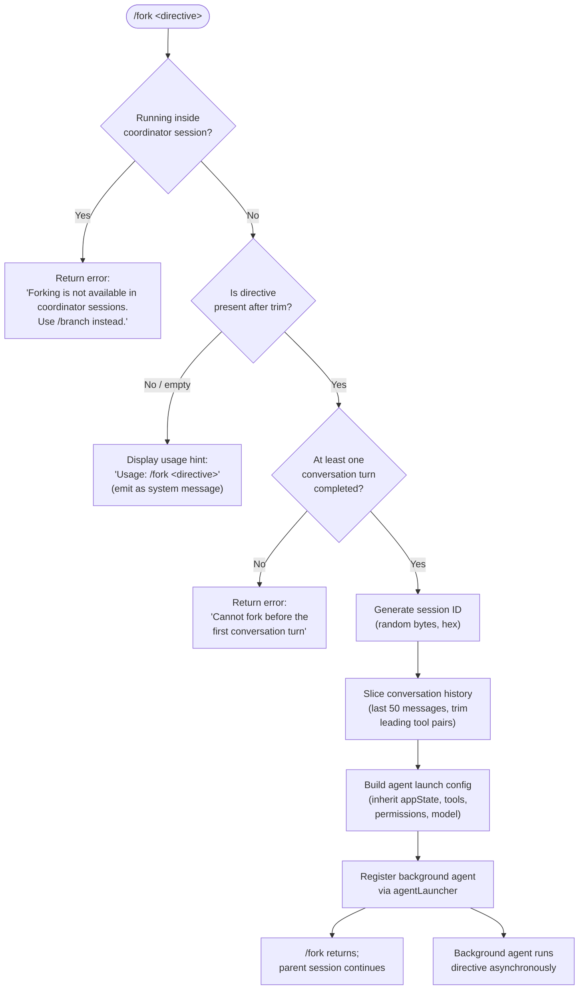

# `/fork`

> Analysis basis: CC v2.1.183 bundle.js (AST extraction + Claude interpretation)
> Minimum version: v2.1.183

---

## Overview

`/fork` spawns a background agent that inherits the full conversation history up to the current turn, then sends that agent a caller-supplied directive. The parent session continues independently while the forked agent works asynchronously. The command is unavailable in coordinator sessions and requires at least one completed conversation turn before it can be invoked.

---

## Registration

| Field | Value |
|---|---|
| type | `local-jsx` |
| name | `fork` |
| description | `Spawn a background agent that inherits the full conversation` |
| argumentHint | `<directive>` |
| module_id | `fCl` |
| load_inline | `true` |
| loc_byte | `12764229` |
| loc_byte_end | `12764432` |
| arbor_handler.name | `raf` |
| arbor_handler.kind | `AsyncFunction` |
| arbor_handler.fqn | `claude-2.1.183::raf` |
| arbor_handler.resolution_path | `module_id` |
| arbor_handler.n_hits | `0` |

Analysis basis: CC v2.1.183 bundle.js:+12764229

---

## Input Branching

The command has four distinct decision paths on the user-supplied directive and session state.



Analysis basis: CC v2.1.183 bundle.js:+12763788 (directive trim), +12763812 (usage string), +12763852 (system-message role), +12763921 (agent launcher call), +12763926 (coordinator guard), +12763999 (pre-turn guard)

---

## Behavioral Spec

### 1. Guard: coordinator session rejection

```
function checkCoordinatorGuard(sessionContext):
    if sessionContext.isCoordinatorMode:
        emit system message:
            "Forking is not available in coordinator sessions. Use /branch instead."
        return ABORT
```

Analysis basis: CC v2.1.183 bundle.js:+12763926

---

### 2. Directive parsing

```
function parseDirective(rawInput):
    trimmed = rawInput.trim()
    if trimmed is empty or missing:
        emit usage hint "Usage: /fork <directive>" as system message
        return ABORT
    return trimmed
```

Analysis basis: CC v2.1.183 bundle.js:+12763788, +12763812

---

### 3. Guard: pre-first-turn rejection

```
function checkConversationReady(conversationHistory):
    if conversationHistory has no completed turns:
        emit system message:
            "Cannot fork before the first conversation turn"
        return ABORT
```

Analysis basis: CC v2.1.183 bundle.js:+12763999

---

### 4. Conversation snapshot construction

```
function buildConversationSnapshot(history):
    // Keep at most the last 50 messages (constant from literals)
    recent = history.slice(-50)
    // Trim leading messages that are orphaned tool-use/tool-result pairs
    // using the lastIndexOf walk-back heuristic (see replContextBuilder)
    snapshot = trimOrphanedToolPairs(recent)
    return snapshot
```

Analysis basis: CC v2.1.183 bundle.js:+11181196 (slice constant 50), +11181199 (e.slice call), call graph `hHo → e.slice`

---

### 5. Session ID generation

```
function generateForkSessionId():
    // Uses randomBytes(8).toString("hex") → 16-char hex string
    raw = crypto.randomBytes(8)
    id  = raw.toString("hex")
    return id
```

Analysis basis: CC v2.1.183 bundle.js:+32806 (randomBytes call in `fR`), +32822 (length 8), +32834 (encoding "hex"); call graph `hHo → fR`

---

### 6. Agent launch-config assembly (`contextConfigBuilder`)

The agent inherits the parent session's configuration with several fields patched:

```
function buildForkConfig(parentAppState, directive, sessionId, conversationSnapshot):
    config = {
        type:               "local_agent",
        session:            sessionId,
        working_directory:  parentAppState.working_directory,
        allowed_tools:      parentAppState.allowed_tools,
        disallowed_tools:   parentAppState.disallowed_tools,
        avoid_prompts:      parentAppState.avoid_prompts,
        permission_mode:    parentAppState.permission_mode,
        effort:             parentAppState.effort,
        model:              parentAppState.model,
        max_thinking_tokens:parentAppState.max_thinking_tokens,
        flag_settings:      parentAppState.flag_settings,
        // Conversation context
        initialMessages:    conversationSnapshot,
        // Directive injected as user turn
        userPrompt:         directive,
        // Background mode
        bg_session:         true,
        output_style:       "bg",
    }
    return config
```

Analysis basis: CC v2.1.183 bundle.js:+10852993 (`working_directory`), +10853048 (`allowed_tools`), +10853103 (`disallowed_tools`), +10853164 (`avoid_prompts`), +10853266 (`permission_mode`), +10853621 (`effort`), +10853634 (`model`), +10853646 (`max_thinking_tokens`), +10853672 (`flag_settings`), +10528755 (`local_agent`), +13694610 (`bg-session`), +13701027 (`bg`)

---

### 7. Background agent registration and launch

```
async function launchForkAgent(config):
    // Register with the background-session dispatcher (agentRegistry)
    agentRegistry.add(config.session)
    agentRegistry.finally(() => agentRegistry.delete(config.session))

    // Create a worktree/symlink-linked scratch directory for the agent
    await prepareAgentDirectory(config.session)

    // Spawn the local agent process via the daemon
    agentHandle = await agentLauncher(config)

    // Mark status as "pending" then "running"
    agentHandle.status = "running"

    // Register completion callback
    agentHandle.onComplete(notifyParentSession)
    return agentHandle
```

Analysis basis: CC v2.1.183 bundle.js:+11181266 (`KK` → agent registry), +11181287 (`Yut` → agent launcher), +13551352 ("pending"), +10528800 ("running"), call graph `hHo → KK`, `hHo → Yut`

---

### 8. Timing and watchdog constants

| Constant | Value | Role |
|---|---|---|
| Conversation slice limit | `50` messages | Maximum history sent to forked agent |
| Agent stall timeout | `600000` ms (10 minutes) | Watchdog fires if agent produces no output |
| Subagent context trim head | `49` messages | Walk-back guard for orphaned tool pairs |

Analysis basis: CC v2.1.183 bundle.js:+11181196 (50), +11181209 (49), +8879890 (600000)

---

## State & Side Effects

| Item | Detail |
|---|---|
| Telemetry | `tengu_feature_ok` (handler entry, +1021887); `tengu_feature_bad` (handler error, +1021954); `tengu_async_agent_stall_timeout` (+8880950); `tengu_agent_tool_completed` (+8876861); `tengu_agent_tool_terminated` (+8884528); `tengu_auto_mode_decision` (+8878560); `tengu_quartz_heron` (+8888928); `tengu_shale_finch` (+8872371) |
| Agent directory creation | Creates a timestamped scratch directory under the subagents path; sets up symlinks or worktree entries (`Wne.mkdir`, `Wne.symlink`) |
| Agent registry mutation | Adds the new session ID to the background-agent registry (`KK`); registers a `finally` cleanup to remove it on completion or error |
| `appState` changes | None in the parent session; the forked agent receives a copy of the parent's app-state snapshot |
| Sound / UI | No sound event; the parent terminal continues normally; the forked agent's output appears in a separate background pane |
| Hook events emitted | `SubagentStart` hook fires inside the forked agent's session bootstrap (`sv`); `SubagentStop` on completion |
| Telemetry span | OpenTelemetry span `claude_code.subagent.spawn` / `subagent.spawn` created via `Xea` (+6694715) |
| Transcript file | The forked agent writes its transcript to a `.jsonl` file under the subagents subdirectory (`agent_metadata` key, +13450043) |

---

## Version History

| Version | Change |
|---|---|
| v2.1.183 | Initial analysis |

---

## Common Mistakes

1. **Running `/fork` in a coordinator session** — The command explicitly rejects coordinator contexts; use `/branch` instead (error message is surfaced inline).
2. **Calling `/fork` before the first user/assistant turn** — The command guards against an empty history; send at least one message before forking.
3. **Omitting the directive argument** — Without text after `/fork`, the command prints the usage hint and does nothing; the directive is mandatory.
4. **Expecting synchronous output** — The forked agent runs in the background; its results are not streamed into the current session's terminal unless a hook or notification channel is configured.
5. **Assuming full history is inherited** — Only the last 50 messages (with orphaned tool-pair trimming) are passed to the fork, not the entire conversation.

---

## Appendix — Identifier Mapping

> For bundle debugging only. Identifiers change across versions.

| Identifier | Role |
|---|---|
| `raf` | Main handler (`AsyncFunction`) for `/fork` — entry point resolved via `module_id` |
| `hHo` | Fork orchestrator — builds launch config, assembles conversation snapshot, calls agent launcher |
| `L6p` | Context config builder — assembles full system prompt and agent config object from appState |
| `Fr` | App-state reader — retrieves working directory, tool lists, model settings |
| `b6n` | Tool-list config extractor (allowed_tools segment) |
| `T6n` | Tool-list config extractor (disallowed_tools segment) |
| `mB` | Permission-mode field extractor |
| `Xk` | System-prompt assembly coordinator — orchestrates all sub-prompt builders |
| `j4e` | Background agent execution engine — runs the forked agent's agentic loop |
| `L3` | Session runner — sets up hooks, MCP monitors, transcript, and drives the agent turn loop |
| `Yut` | Agent launcher — creates the local-agent process, registers with daemon |
| `m6e` | Directory preparation — `mkdir`, `symlink`, `unlink` for agent scratch space |
| `fR` | Session-ID generator — `randomBytes` → hex string |
| `KK` | Background-agent registry — tracks active forked agents |
| `sv` | Subagent hook runner — fires `SubagentStart`, `SubagentStop`, and lifecycle hooks |
| `Fs` | Fatal-error handler — `process.exit(1)` on unrecoverable errors |
| `gte` | Model-selection and permission-context builder |
| `ck` | Tool-context assembler |
| `ERa` | Agent-summary generator — called at fork completion |
| `pio` | Agent-output processor — handles streamed events from the forked agent |
| `R3p` | Main query/streaming loop for the agent (API call orchestration) |
| `Ite` | MCP tool dispatcher and context set builder |
| `v6` | Per-turn agent driver — calls `R3p` per turn |
| `Xea` | OpenTelemetry span manager — emits `claude_code.subagent.spawn` |
| `iw` | App-state context wrapper |
| `st` | String utility / identifier formatter |
| `zw` | Additional state wrapper |
| `_a` | Supplementary state accessor |
| `Re` | Model-feature check utility |
| `Ue` | Feature-flag gate |
| `ogt` | Feature-gate evaluator |
| `Mt` | Message formatter |
| `Fo` | Provider/model identifier helper |
| `lGn` | Plugin/tool listing assembler |
| `Gr` | Log/trace writer |
| `XTe` | Pewter-owl tool injector |
| `ZL` | SDK send-user-message builder |
| `T_f` | Output-style system-prompt segment builder |
| `I_f` | Confirmation-policy segment builder |
| `C_f` | Context-management segment builder |
| `JAn` | Fable-identity prefix checker |
| `Oj` | Text block formatter |
| `Jmi` | Tool-param JSON segment builder |
| `zQ` | Logging helper |
| `ct` | Tool-permission cache |
| `r0o` | Model-specific segment builder (claude-opus-4-7 branch) |
| `ryf` | Wrapper calling `r0o` |
| `aq` | Trace/log helper |
| `$_f` | Session-guidance system-prompt builder |
| `e0t` | Memory-load prompt builder |
| `Y_f` | Environment info (static) builder |
| `z_f` | Environment info (simple/worktree) builder |
| `D_f` | Language segment builder |
| `M_f` | Output-style segment builder |
| `J_f` | Background-session segment builder |
| `x2n` | Scratchpad segment builder |
| `Z_f` | Brief/context-management segment builder |
| `nyf` | Flag-settings segment builder |
| `j_f` | Base identity segment assembler |
| `q_f` | Reproduce-verify workflow segment builder |
| `x_f` | Act-dont-rederive segment builder |
| `k_f` | Heron-brook segment builder |
| `zWa` | Tool-cache prewarmer |
| `G_f` | Autonomy-append segment builder |
| `R_f` | Scratchpad finalizer |
| `P_f` | System-prompt finisher |
| `O_f` | Doing-tasks segment builder |
| `N_f` | Wrapper calling `r0o` for N variant |
| `U_f` | Using-tools segment builder |
| `B_f` | Tone-and-style segment builder |
| `Nhi` | Memory-disabled note injector |
| `QTe` | First-party/anthropicAws provider classifier |
| `oNl` | System-prompt assembly finalizer / wrapper |
| `b6` | System-prompt collector — calls sub-builders and concatenates segments |
| `Wc` | Working-directory resolver |
| `ro` | Process-binding / main-thread registrar |
| `a` | MCP client state tracker |
| `aH` | Additional history injector |
| `Qe` | JSX/React element builder |
| `t` | Generic local variable (context varies) |
| `Y9n` | Conversation snapshot assembler — slices and trims history |
| `VMp` | Assistant-message type filter |
| `KMp` | Tool-result type filter |
| `qMp` | Tool-use pair filter |
| `W8a` | Orphaned-tool-pair trimmer |
| `zMp` | Tool-result completion checker |
| `Vrl` | Directive text trimmer |
| `fR` | Random-hex session-ID generator |
| `KK` | Agent registry (Set of active session IDs) |
| `Yut` | Agent launcher (creates process, registers callbacks) |
| `m6e` | Agent directory preparer |
| `Yzn` | Active-agent set manager |
| `bxo` | Agent scratch-dir creator |
| `fh` | Agent transcript-path builder |
| `dn` | Directory cleaner |
| `T` | Environment-variable formatter |
| `De` | Error logger |
| `mlt` | Agent file-handle opener |
| `hM` | Subagent path resolver |
| `p2` | Path utility |
| `Ar` | Asset/path resolver |
| `Lt` | Logger (general) |
| `wf` | Warning logger |
| `rN` | Signal-handler registrar |
| `Xl` | Event-listener max setter |
| `HFi` | Signal callback binder |
| `u0` | Timestamp recorder for agent start |
| `ks` | Key-store / settings helper |
| `gx` | Global exports accessor |
| `gte` | Model and permission context builder |
| `ck` | Tool-allowlist cache manager |
| `jK` | Tool-context segment builder |
| `sT` | Tool-availability formatter |
| `Rj` | Text replacer |
| `w_` | JSON-be builder |
| `GU` | Tool-usage-string builder |
| `ul` | Tool-list formatter |
| `_s` | Model-alias resolver |
| `fL` | Tool-filter builder |
| `$hp` | Hop/help segment builder |
| `Bl` | Block replacer |
| `Jln` | ARN/path prefix checker |
| `g0u` | ARN sub-string extractor |
| `_H` | Provider-type classifier (bedrock/vertex/foundry/mantle) |
| `SIt` | Provider-string formatter |
| `H0u` | Anthropic-prefix checker |
| `wr` | Warning writer |
| `W1e` | Model lowercase normaliser |
| `q7e` | Model-alias expander |
| `tIr` | Model-prefix checker |
| `EDa` | Model-provider domain extractor |
| `c` | Terminal/TTY handle |
| `Tn` | Terminal capability checker |
| `yDa` | Model display-name builder |
| `Nj` | Provider label builder |
| `yH` | Feature-flag gate (Ife-based) |
| `Qoo` | Model-selector display |
| `u4` | AsyncLocalStorage getter |
| `Rx` | Store accessor |
| `Uj` | Context-local runner |
| `j4e` | Agent execution engine (agentic loop) |
| `od` | Agent ID extractor |
| `Wlt` | Transcript updater |
| `Zae` | State transition handler for agent turns |
| `bLe` | App-state setter (setState) |
| `Kot` | Log writer |
| `I` | Cursor/input position manager |
| `k` | Key-event handler |
| `E` | Cursor clamp helper |
| `ee` | MCP tool-result processor |
| `U8` | Promise.all / stream aggregator |
| `g` | Stream buffer handler |
| `Hot` | Integer parser (tool result) |
| `y` | Stream token accumulator |
| `p0n` | Token-count parser |
| `Y` | MCP update applier |
| `ne` | MCP state tracker |
| `t3e` | MCP retry state |
| `Ee` | String coercer |
| `q` | Flush helper |
| `B1o` | MCP client manager |
| `B` | Watchdog timer manager |
| `R` | Abort/reset helper |
| `d` | Terminal write dispatcher |
| `P` | Turn finaliser |
| `$` | Permission classifier |
| `zlt` | Permission decision resolver |
| `R6` | Tool-execution dispatcher |
| `t$n` | Agent-state updater |
| `jmo` | Performance-mark recorder |
| `i_` | Log flush coordinator |
| `Wmo` | Task-notification emitter |
| `p` | Process-exit handler |
| `WT` | Graceful-shutdown coordinator |
| `u` | Session-stop handler |
| `G4e` | Task registry updater |
| `o` | Status-line formatter |
| `QP` | Performance-head recorder |
| `Lr` | Log-record writer |
| `Fut` | Task-completion finaliser |
| `Np` | HTML-entity unescaper |
| `e$n` | Active-tool-use filter |
| `Cc` | Tool-use list filter |
| `n$n` | Turn-counter incrementer |
| `o$n` | Observation spec resolver |
| `Tl` | Tool-parameter cache |
| `ERa` | Agent summary generator |
| `jlt` | Tool-ID set builder |
| `_` | Stream-event processor |
| `Jx` | Stream event handler (message_start/delta) |
| `Pn` | UUID + handle creator |
| `Z_p` | Stream-context pointer |
| `bRa` | API-usage recorder |
| `h` | Timer/async handle |
| `M` | Task-file manager |
| `Dtt` | Task-file reader |
| `CQ` | vfe-based config store |
| `CMt` | Task-file writer |
| `J1i` | Task-filter helper |
| `Jnc` | Task-summary formatter |
| `fae` | Task-file reconciler |
| `m` | Process-kill manager |
| `i$n` | Last-index finder for transcript |
| `r$n` | Read-only command checker |
| `x6e` | Tool-use classifier |
| `TPa` | Transcript updater (with progress) |
| `tFp` | Transcript flush helper |
| `O2t` | Agent-output processor entry |
| `Aio` | Agent-IO adapter |
| `Zyp` | Speculation aborter |
| `eEp` | Agent-error-path handler |
| `Ylt` | Task-progress reporter |
| `s$n` | Agent-prefix router (agent: prefix) |
| `PHe` | Performance head-of-line recorder |
| `Zlt` | Agent-status-prefix router |
| `pio` | Agent output post-processor |
| `HM` | Last-assistant-message finder |
| `uee` | Agent-completion event emitter |
| `Jyp` | Agent-timing recorder |
| `H` | Active-task set |
| `CA` | String builder |
| `lM` | MIME/content-type checker |
| `Ru` | Event emitter wrapper |
| `vAe` | Content-type normaliser |
| `Ur` | Nonconforming-event handler |
| `Qyp` | VFn-based gate checker |
| `IPa` | Agent-update recorder |
| `ke` | Model-feature checker |
| `ae` | Warning emitter |
| `nu` | UUID generator |
| `Hte` | Agent-halt handler |
| `js` | Model-display formatter |
| `x` | Stream enqueue helper |
| `N2t` | UUID-based agent-ID minter |
| `mio` | Agent-mode orchestrator |
| `rPa` | Subagent-route entry |
| `R2t` | Subagent response processor |
| `WG` | Agent wait-group |
| `os` | ogt-based feature evaluator |
| `CPa` | JUl-based capability gate |
| `t0e` | Turn-state updater |
| `K` | Output write dispatcher |
| `Q` | Terminal output stream |
| `v6f` | Text-replace formatter |
| `aHt` | Post-turn cleanup |
| `pRa` | GFn-delete cleaner |
| `L3` | Session runner / turn orchestrator |
| `Jge` | Turn-level permission checker |
| `sEp` | Permission-slice validator |
| `HBi` | $8r session-ID setter |
| `Mhe` | Session metadata helper |
| `Ixn` | Perfetto trace recorder |
| `wea` | dzr trace-store reader/writer |
| `vea` | Math.abs-based delta checker |
| `J3d` | Trace-event push helper |
| `w2n` | Conversation version recorder |
| `QAe` | YB-based config loader/dumper |
| `YB` | Config persistence helper |
| `He` | CLAUDE.md template expander |
| `me` | Hook-event broadcaster |
| `uae` | EMt-based template evaluator |
| `The` | Template string replacer |
| `Ite` | MCP tool dispatcher |
| `uio` | Tool-filter (availability checker) |
| `dio` | Tool-set adder |
| `f` | Subagent-process manager |
| `cio` | Tool-include splitter |
| `ow` | Tool-context builder (F9/Hl) |
| `SA` | Tool-name normaliser |
| `kx` | MCP tool-name splitter |
| `i1e` | Tool-name Y9-resolver |
| `L` | Worker lifecycle manager |
| `v` | Task-state variable |
| `ZC` | Local-agent context builder |
| `Pc` | Permission classifier |
| `SPa` | Session-permission validator |
| `Ae` | Agent-list manager / MCP reconnector |
| `se` | Agent session runner (main) |
| `en` | Active-agent set |
| `_n` | Notification pusher |
| `xr` | Plugin-cleanup handler |
| `wra` | MCP connect/reconnect coordinator |
| `ms` | Message-content builder |
| `l` | k0l-based stream writer |
| `In` | Tool-search indexer |
| `z9` | oc-based tool resolver |
| `$Bi` | VSCode-plugin gate |
| `FCn` | v7-based config fetcher |
| `v7` | Config value accessor |
| `Z_l` | JSON-stringify telemetry logger |
| `plc` | ccd-session plugin loader |
| `DIp` | System-prompt injector for subagent |
| `xBt` | xBt prompt injector (K_f + oNl) |
| `RIp` | Tool-restriction checker |
| `kBt` | Subagent-start hook runner |
| `Id` | Model-ID validator |
| `sv` | Hook executor (SubagentStart/Stop etc.) |
| `xe` | Background-queue runner |
| `x8t` | Queue-entry type |
| `we` | bjl/Ijl message types |
| `Nne` | Czn-dHf feature gate |
| `Rue` | Context-size estimator |
| `ene` | Background-enqueue helper |
| `gi` | UUID + timestamp minter |
| `iE` | Tool-include checker |
| `xn` | Mnn/B2 name builder |
| `$me` | vQu-based MCP gate |
| `_Ra` | Object.keys-based state tracer |
| `Ec` | gx-based exports accessor |
| `PIp` | Uct-based hook runner |
| `Uct` | hS-based system hook |
| `Di` | String index/slice helper |
| `I5e` | Tool-sort/locale comparer |
| `hS` | Tool finder |
| `zu` | Locale-sort helper |
| `mt` | Output writer |
| `xt` | Prompt-command dispatcher |
| `I_e` | Plugin refresh coordinator |
| `F_e` | Plugin filter |
| `Db` | Tool deduplicator / tool-set builder |
| `Ke` | Config-entry filter |
| `spe` | Object.assign-based config merger |
| `Le` | Marketplace plugin loader |
| `cW` | File-extension checker (.mcpb/.dxt) |
| `pt` | Plugin detail loader |
| `Gt` | JSON.parse wrapper |
| `nr` | Plugin-push helper |
| `Hn` | Plugin-path normaliser |
| `xIp` | System-config loader (enterprise/project) |
| `mDn` | TJr-based managed-settings loader |
| `eEe` | Config-entry expander |
| `hc` | Ul/dp config applier |
| `Ul` | Safe-mode / strict-mode flag handler |
| `a3` | Hb-based enterprise config reader |
| `Met` | TAe/uIe metadata extractor |
| `k5` | Object.entries-based config merger |
| `Be` | Bridge SIGTERM handler |
| `ot` | TL/yF abort coordinator |
| `vt` | Virtual-tree appendChild helper |
| `xy` | Node type helper |
| `Nn` | REPL transcript renderer |
| `un` | DOM-like comment creator |
| `it` | Dm-based DOM node |
| `dHe` | Tool-search configurator |
| `hP` | MMt-based tool-search builder |
| `g7` | Tool-search provider normaliser |
| `gke` | Tool-search availability checker |
| `Zho` | Deferred-tools pool manager |
| `BFn` | Ct-based telemetry annotator |
| `Ct` | Telemetry event recorder |
| `v2n` | Conversation-compaction handler |
| `nwe` | Compaction state helper |
| `ZQi` | Compaction-config reader |
| `S6n` | Compaction-signal builder |
| `L2n` | Tool-list reconciler |
| `A2` | Tool-availability checker |
| `a5t` | Tool-filter with bzn |
| `i5t` | Tool-add deduplicator |
| `KY` | bzn-based tool updater |
| `pae` | WPl-based tool-presence checker |
| `PV` | Tool-presence gate |
| `Dtl` | s5t-based tool-state cache |
| `nb` | Tti/bPr/Iti notification builders |
| `Wy` | gx-based settings accessor |
| `K6r` | Tool-ranking / scoring engine |
| `y5e` | Exponential-backoff calculator |
| `vC` | _s/Bl/Fo model-classifier |
| `B0` | Turn-boundary marker |
| `Hx` | gx-based helper |
| `Cre` | Context-reset helper |
| `A` | Subagent-process list |
| `slo` | Au-based context saver |
| `Au` | qi-based context writer |
| `bce` | Au/Y6e context referencer |
| `Y6e` | Czn/$zn context filter |
| `$ct` | sOl/Rl.writeFile context writer |
| `sOl` | hM-based scratch-path resolver |
| `Pe` | JSON.stringify wrapper |
| `Yt` | Ah/Hn plugin-change watcher |
| `Ah` | Change-event handler |
| `On` | File-watcher / CLAUDE.md reloader |
| `Xea` | OTel span manager |
| `Gae` | Span attribute setter |
| `$F` | khe-based AsyncLocalStorage active span getter |
| `KBe` | V$e-based span creator |
| `CP` | Span context propagator |
| `nLe` | tLe/khe context setter |
| `v6` | Per-turn agent driver |
| `R3p` | Main API query / streaming loop |
| `x5n` | Agent-exit cleanup ($6/DAo/h4t/MAo deletes) |
| `D4e` | J_p-based feature gate |
| `ilo` | Agent-response length tracker / sao-cache |
| `gRa` | Y_p-based forked-agent gate |
| `oao` | rao-clear cache resetter |
| `sao` | rao-based response cache |
| `w7n` | Math.ceil token estimator |
| `Ztt` | Math.round token estimator |
| `JEf` | Response finaliser |
| `kt` | Session-entry assembler |
| `To` | Tool-owner set |
| `Oae` | oc-based tool resolver |
| `_He` | ct-based permission helper |
| `Juo` | gs/b3n hook runner |
| `cce` | wb/d_p tool-cache checker |
| `wb` | Tool-cache initialiser |
| `d_p` | Tool-find helper |
| `kIp` | Session-key injector |
| `uRa` | Session-cleanup helper |
| `Cy` | kEf/J8t/DEf tool-output formatter |
| `kEf` | J8t-based output type selector |
| `J8t` | Output type constant |
| `DEf` | XGt/Pn output formatter |
| `k2n` | k2n output builder |
| `Fct` | Cy/tne/bdt/Lt skill executor |
| `tne` | t.trim-based skill-name cleaner |
| `bdt` | Tl/dce-based tool-param decoder |
| `zFa` | od/PHe task-status getter |
| `ARa` | Object.values / t.all promise combiner |
| `fHe` | Lt/WP/HM/Cc/sv session finaliser |
| `WP` | m8/ub/KG/S9 session-state builder |
| `b1l` | Object.values/GI/TPe session-output builder |
| `T1l` | j0/TPe transcript mapper |
| `Xe` | Session-export helper |
| `k7` | K2i-based key builder |
| `K2i` | Key-derivation function |
| `tBi` | tW.delete / V2e session-teardown |
| `V2e` | z2i/Y2i file writer |
| `olo` | s5t.delete cleanup |
| `WBe` | bxn/dzr trace-store cleaner |
| `Jea` | tLe/VBe/rLe span ender |
| `VBe` | e.setStatus span status setter |
| `rLe` | $F/khe.enterWith span restorer |
| `_Bi` | $8r.delete session-ID cleaner |
| `hRa` | Object.entries / t.all parallel-runner |
| `o0` | Batch operation helper |
| `zge` | t.update/De/i_ agent-update finaliser |
| `GMt` | Session global-mode setter |
| `DLe` | Session dependency-loader |

---

Note: index built via Arbor fallback; some signals (telemetry, literals) may be missing — see arbor-fallback.js.